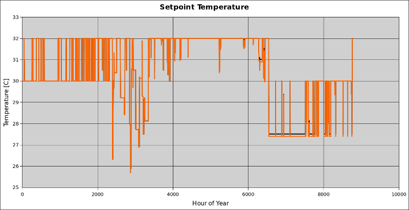
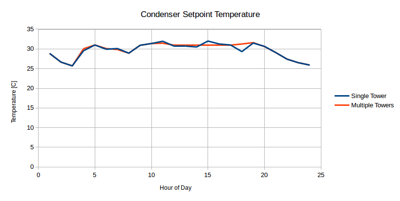

Adding Support for Multiple Cooling Towers in Condenser Entering Temp Reset Setpoint Managers
---------------------------------------------------------------------------------------------

This will add implementation for using multiple cooling towers into the following existing setpoint managers:

 - SetpointManager:CondenserEnteringReset
 - SetpointManager:CondenserEnteringReset:Ideal
 
These setpoint managers are intended to minimize plant energy use by adjusting the condenser setpoint temperature.  The first uses user-defined curve fit expressions to determine a reset temperature.  The second uses a search technique to re-simulate the plant and find the minimum energy point.

# Justification

The current implementation requires a strict topology of a single chiller on the chilled water loop, and a single cooling tower on the condenser loop.  This is highly restrictive for users interested in using this embedded low energy control technique.  The addition of support for multiple towers has been requested by Carrier to ensure their adoption of EnergyPlus.

# Expected Outcome

The final outcome of this new feature is the ability to control (via resetting the setpoint temperature) multiple cooling towers.  This work is not intended to make changes to the setpoint manager operation/algorithms except where required to allow multiple towers.  Thus I won't be evaluating whether the setpoint managers are actually maintaining the lowest energy state.

# Expected Approach

Development of this will involve a few steps which will approximately follow this pattern (with review happening in several phases):

  1. Investigate the current object implementation in terms of documentation and source code
  2. Determine if any input changes are required
  3. Determine if there is any code restructuring necessary/desired
  4. Determine expected changes to be made in the code (i.e. create a design)
  5. Create tests (unit/integration) that demonstrate the deficiency
  6. Make code changes to implement new feature

## Plan

The detailed plan for completing this new feature falls into four categories: refactoring (prep) work, core code changes, supplemental code changes, and testing.

### Refactoring

Some refactoring will be performed in SetPointManager:

 - Delete member constructors, they aren't used
 - Pull global ```Calc*()``` functions into calculate() member functions for each SetPointManager class

### Core Code Changes

Code changes for this new feature:
 
 - With the SetpointManager:CondenserEnteringReset implementation, it isn't clear why it doesn't support multiple towers, so long as the effect of multiple towers are included in the user-defined curves
 - With the SetpointManager:CondenserEnteringReset:Ideal implementation, at a minimum the tower energy variables will need to be transformed into vectors, possibly additional work revealed during implementation and testing
 - Unit tests will be added

### Testing

 - Unit tests will be added to support the changes in the source code.
 - At least one new example file will be added to demonstrate this feature
 - Simulation output will be evaluated to verify operation is as expected

# Researching Existing Modules

## SetpointManager:CondenserEnteringReset
### Purpose
  - resets entering water temp setpoint to optimal setpoint temp resulting in minimum net energy consumption.
### Overview
  - uses one curve for optimum condenser ewt and two other curves for bcs on the optimized sp value
### Inputs
  - default entering temperature reset schedule
  - minimum design wet-bulb temperature curve name: T = f(OutdoorWetBulb, WeightedPLR, TowerDesignWB, CondenserFlowPerCapacity)
  - minimum outside wet-bulb temperature curve name: T = f(MinDesignWetBulb, WeightedPLR, TowerDesignWB, CondenserFlowPerCapacity)
  - optimized condenser entering temp curve name: T = f(OutdoorWetBulb, WeightedPLR, TowerDesignWB, CondenserFlowPerCapacity)
  - minimum lift
  - max condenser entering temp
  - cooling tower deisgn inlet air wet-bulb temp
### Eng Ref
  - calculate WPLR = current chiller cooling load / nominal chiller capacity
  - calculate normalized flow per capacity = design tower flow rate / design tower capacity
  - use curve to calculate MinDesignWB, MinActualWB, OptCondEntTemp
  - if OptCondEntTemp out of bounds from MinDesignWB and MinActualWB, use the default value from the schedule, otherwise use OptCondEntTemp
### Source code
  - hardwire des condenser flow per ton -- why?
  - recall a few parameters
  - get chiller load from PL.LS.BR.CP.MyLoad
  - check type of chiller and assign TempDesCondIn and TempEvapOutDesign
  - constrain min cond setpoint and entering cond temp
  - store design load and actual load
  - (referencing vectors, but only operating on scalars)
  - if chiller load is zero use design value
  - calculate weighted load ratio
  - get curve values
  - calculate setpoint based on conditions
### Simulation output
  - (use this section for determining outputs for testing/evaluation, and also trying out multiple towers)
 
## SetpointManager:CondenserEnteringReset:Ideal
### Purpose
  - determines near-optimal condenser water entering setpoint resulting in minimum net energy consumption
### Overview
  - uses a search algorithm to find ideal setpoint at a given time step
### Inputs:
  - minimum lift
  - max condenser entering temp
### Eng Ref:
  - requires resimulating HVAC systems at each timestep until optimal condition (minimum total chiller, tower, chw pump, and cond pump power, aka TEC)
  - minimum bound = f(MinimumLift[user], EvaporatorLeavingTemp)
  - maximum bound = Maximum[user]
  - assumption: single minimum exists between those boundaries
  - procedure:
    + Set initial setpoint value at user defined max; calculate TEC
    + Decreate setpoint by 1C; calculate TEC
    + Compare TEC1, TEC2
    + If TEC1 is smaller, we can't get better given assumption above, so quit here
    + Otherwise, simple search until minimum is hit
### Source code:
  - first time through, initialize meters and variable pointers
  - only operate if RunOptCondEntTemp
  - get chiller load from PL.LS.BR.CP.MyLoad
  - if curload > 0 do the rest
  - retrieve evap outlet temp to calculate CondTempLimit (upper bound)
  - get chiller energy, chw pump energy, tower fan energy, and cond pump energy to calculate total energy usage (uses GetInternalVariableValue)
  - check TotEnergyPre (the value from the last time through????)
  - if it was non-zero, we are now in a correction phase, so:
    - calculate delta energy and adjust the setpoint search
  - if it was zero, we are starting over, so:
    - move setpoint down by 1, store energy as TotEnergyPre
    - set RunOptCondEntTemp to true
### Source code outside of SetPointManager:
  - DataGlobals::RunOptCondEntTemp
  - in HVACManager, after SimHVAC call, if any ideal cond resets: while(RunOptCondEntTemp) {SimHVAC();}  
### Simulation output
  - (use this section for determining outputs for testing/evaluation, and also trying out multiple towers)

# Researching Existing Example Files

I will focus on two existing example files:
 - CoolingTower_VariableSpeed_CondEntTempReset.idf
 - CoolingTower_VariableSpeed_IdealCondEntTempSetpoint.idf

The two files differ in only three ways:
 - Comments in the header
 - The actual SetPointManager change
 - Additional output variables in the "ideal" example
 
The "ideal" file includes the same curves that are required in the non-"ideal" file even though they are not used.  Since the files are identical, the plant topology can be described once.

## Chilled water loop

- PlantLoop: "Chilled Water Loop"
- DemandSide: Cooling Coil, Bypass
- SupplySide: Pump, Chiller, Bypass
- OperationScheme: CoolingLoad, Chiller Only
- SetPointManager: Scheduled
- Pump: Pump:VariableSpeed "CW Circ Pump"
- Chiller: Chiller:Electric "Central Chiller"

## Condenser loop

- CondenserLoop: "Condenser Water Loop"
- DemandSide: Chiller, Bypass
- SupplySide: Pump, Tower, Bypass
- OperationScheme: CoolingLoad, Tower only
- SetPointManager: CondenserEnteringReset
- Pump: Pump:VariableSpeed "Cond Circ Pump"
- Tower: CoolingTower:VariableSpeed "Central Tower"

## Trying out a run

I modified the ConEntTempReset file to include a second cooling tower.  I encountered an error due to the second tower.  I made a few changes to the source to not throw this error and re-ran.  The file runs to completion and the only diffs are in the tower outputs.  I need to investigate it a little further but I think it might still be functioning perfectly.  Here is where I will start back up tomorrow:

- Report out the setpoint on the outlet node of the condenser supply side.  The value should be identical, or close.  The difference is that there are two towers contributing to meeting this setpoint, but the overall loop behavior should be fine.

  - Results, DD-only: The setpoint is identical between the single and multiple tower versions.  On the winter design day, the setpoint stays at 30 degrees.  On the summer design day, the setpoint is pegged at 32 degrees.  I checked the inputs, and this is the value of the ```Maximum Condenser Entering Water Temperature {C}``` field.  It appears that the input file doesn't demonstrate the setpoint reset very well on the design day itself, so I'll re-run annual next.  As for functionality, adding the second tower doesn't cause much difference in results, here is the tower heat transfer rate for the single tower in the base case, and the summation of two towers in the two tower case:
  


  Although the total heat transfer varies slightly through the day, the overall behavior is nearly equivalent.

  - Results, Annual: To check the annual operation of the setpoint manager, I re-ran the input file and plotted the setpoint temperature:
  

  
  The loop behaves pretty much identically throughout the entire year.  The small deviation could be that the loop was out of capacity with only a single tower, I might investigate further, but not right now.  
  
I am moving forward assuming the non-ideal condenser setpoint is working fine for multiple towers.  The optimality of the setpoint when using two towers is similar for a single tower configuration in that it is determined solely on how well the curves are defined for optimality.

## Modifications and testing of the ideal condenser setpoint manager

I performed the source code modifications to allow multiple towers.  The changes were as anticipated and described above.  Once implemented, I modified the test file to include multiple towers and looked at the resulting setpoint asd well as some other values.

Start with the setpoint:



Note how the setpoint differs, but overall has the same behavior during the day.  Next the tower mass flow rate:


Note that the second tower doesn't come on until the middle of the day.  During the off-peak time, the single tower runs to meet the load.  During the peak time, both towers come to full capacity and the total adds together to be very close to the single tower.  Next the tower heat transfer rate:


The total tower heat transfer rate is very similar during the day, with the second tower only coming on during peak hours.  Finally the tower electric power:


The total electricity for the two towers is lower than the single tower.  This is possibly due to a lower delta-T requirement on the towers so that the fan power can be reduced.

These plots have demonstrated the difference, and that the ideal model _does_ operate multiple towers properly.

## Added unit tests

Unit tests were written that provide nearly 100% code coverage for the condenser reset functions to verify that they work as designed and will be flagged if a later code change causes a change in behavior.

# Complete

At this point, I believe the implementation is complete.
