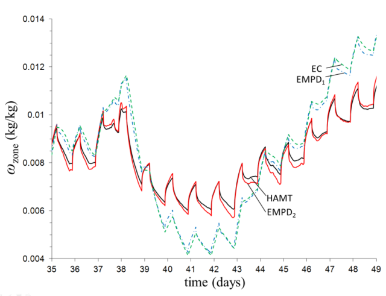
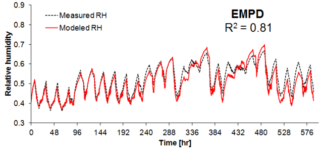

Effective Moisture Penetration Depth Improvements
=================================================

**Jason Woods and Noel Merket, NREL**

 - Original Date: 5 August 2015
 - Design Document: 2 November 2015

## Justification for New Feature ##

Moisture adsorption and desorption from materials has a significant effect on a building's humidity. One option for modeling this in EnergyPlus is the Effective Moisture Penetration Depth (EMPD) model, but the current implementation is limited in its accuracy. An improvement to this model is proposed, which solves the equations differently and includes a deep layer to account for longer-term moisture buffering. These two changes result in a significantly more accurate model, which has been demonstrated with a comparison to the more detailed Combined Heat and Moisture Transfer (HAMT) model in EnergyPlus, and a comparison to field test data.

## Overview ##

This New Feature will replace the existing implementation of the EMPD model in EnergyPlus. It requires some of the same inputs as the current EMPD model, but some additional inputs as well (which enable the higher accuracy).

The new EMPD model simulates the effect of the materials on the air humidity with two ficticious layers of material with uniform moisture content: a surface layer, which accounts for short-term moisture buffering, and a deep layer, which accounts for more slowly responding moisture buffering. The model calculates the moisture transfer between the air and the surface layer and between the surface layer and the deep layer. This moisture transfer impacts the zone temperature (through latent-to-sensible conversion) and humidity in the same manner as the existing EMPD model.

## Approach ##

This new feature will primarily affect MoistureBalanceEMPDManager.cc. The equations in CalcMoistureBalanceEMPD will be replaced by the equations outlined in the proposed Engineering Reference document. THe InitMoistureBalanceEMPD and UpdateMoistureBalanceEMPD subroutines will also be updated to include a few more variables. The interaction with other subroutines is primarily the same:

- CalcMoistureBalanceEMPD is called by CalcHeatBalanceInsideSurf {HeatBalanceSurfaceManager.cc}. This updates the material moisture content for each surface.
- A separate equation in CalcHeatBalanceInsideSurf calculates the amount of sensible heat released (moisture adsorption) or absorbed (moisture desorption) by the material and the corresponding new temperature of the material surface (Used in Conduction Transfer Function equations).
- The new material moisture content is used later in CalcHeatBalanceInsideSurf to calculate the mass transfer from each surface.
- The updated mass transfer rates are used to calculate the new indoor humidity ratio in CalcPredictedHumidityRatio (ZoneTempPredictorCorrector.cc)

While these steps are the same as the previous model, there is a bug that will be fixed in the mass transfer rate equations which is causing a small error that adds up over time. There was also a bug that can crash EnergyPlus during initialization that will be fixed in InitMoistureBalanceEMPD (MoistureBalanceEMPDManager.cc)


## Test files ##

The following test files will be updated to use the new EMPD inputs:

 - `1ZoneUncontrolledFourAlgorithms.idf`
 - `EMPD5ZoneWaterCooled_HighRHControl.idf`

## Model Validation and Data Sources ##

The figure below, from Woods et al., 2013, shows how the new implementation of the EMPD model (labeled EMPD2) matches the more rigorous HAMT model in EnergyPlus more accurately than the exiting EMPD model (labeled EMPD1).



The next figure, from Woods et al., 2014, shows good agreement between the new implementation of the EMPD model with data from a residential field test.



## Inputs Description ##

The inputs for the proposed EMPD model include the five for the existing model. As described in the current Input/Output Reference, the first input is the effective moisture penetration depth of the material layer. This will be changed to the "...penetration depth of the material *surface* layer" in the proposed model. The last four inputs (a,b,c, and d) are  coefficients to define the relationship between the material’s moisture content and the surface air relative humidity.

Four new inputs are required. The first is the moisture permeability of the material, which is input as a vapor diffusion resistance factor. The second is the moisture penetration depth of the material *deep* layer. The third and fourth are the thickness and diffusion resistance factor of any coating layer on the surface. Entering a thickness of 0 implies no coating.

## Outputs Description ##

The new model will have the following outputs:

 - Surface inside face water vapor density
 - Surface layer moisture content
 - Deep layer moisture content
 - Surface layer equivalent relative humidity
 - Deep layer equivalent relative humidity
 - Surface layer equivalent humidity ratio
 - Deep layer equivalent humidity ratio
 - Zone mass flux
 - Deep layer moisture flux

## Example File and Transition Changes ##

Inputs for the existing EMPD model are as follows:

```
  MaterialProperty:MoisturePenetrationDepth:Settings,
    MaterialName,         !- Name
    0.00,                 !- Moisture Penetration Depth {m}
    0.00,                 !- Moisture Equation Coefficient a {dimensionless}
    0.00,                 !- Moisture Equation Coefficient b {dimensionless}
    0.00,                 !- Moisture Equation Coefficient c {dimensionless}
    0.00;                 !- Moisture Equation Coefficient d {dimensionless}
```

The proposed EMPD model will *add* the following:

```
    0.00,                !- Vapor diffusion resistance factor (dimensionless)
    0.00,                !- Deep-layer Penetration Depth {m}
    0.00,                !- Coating layer thickness, m
    0.00,                !- Coating layer vapor diffusion resistance factor {dimensionless}
    
```

For older versions of the .idf, the deep-layer depth and coating thickness will be set to zero and the vapor resistance factor will be calculated based on the penetration depth and calculated slope of the moisture capacitance equation (derived from a-d coefficients), assuming a nominal temperature and humidity and 24 hours for the cycle period. See Janssen and Roels, 2009 (Eq. (5) and accompanying text) for details.

## References ##

Woods, J., Winkler, J, and Christensen, D. [*Evaluation of the Effective Moisture Penetration Depth Model for Estimating Moisture Buffering in Buildings*](http://www.nrel.gov/docs/fy13osti/57441.pdf), NREL/TP-5500-57441, 2013.

Woods, J., J. Winkler, D. Christensen, E. Hancock, [*Using Whole-House Field Tests to Empirically Derive Moisture Buffering Model Inputs*](http://www.nrel.gov/docs/fy14osti/62456.pdf). NREL/TP-5500-62456, 2014.

Janssen, H. and S. Roels, [*Qualitative and quantitative assessment of interior moisture buffering by enclosures*](http://www.sciencedirect.com/science/article/pii/S0378778808002387), Energ. Buildings. 41 (2009) 382-94.


