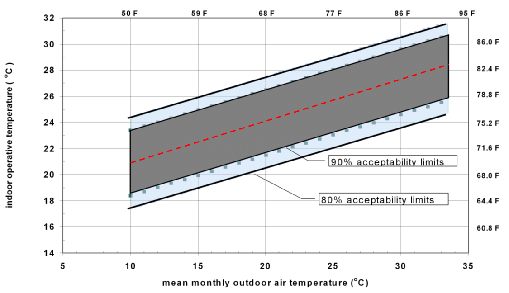
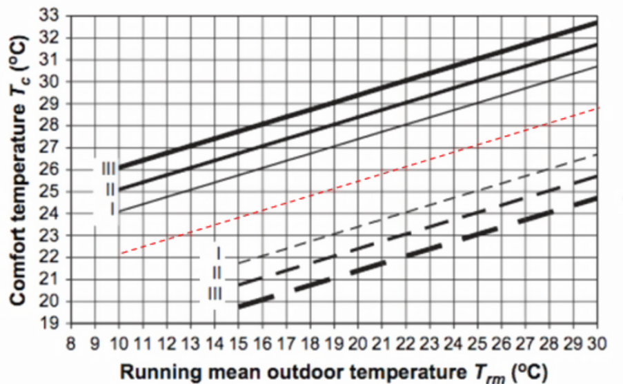

Thermostat Based-on Adaptive Thermal Comfort Models
================

 **Tianzhen Hong.**
 **Lawrence Berkeley National Laboratory**

 - Original Date: July 20, 2016
 - Revised Date: July 29, 2016; October 21, 2016

## Justification for New Feature ##

ASHRAE Standard 55-2010 and CEN 15251-2007 provide adaptive thermal comfort models for naturally ventilated buildings. The adaptive comfort models are getting used for mechanically cooled and ventilated buildings especially in hot climates to save energy. Users requested this feature.

## Introduction ##

ASHRAE Standard 55-2010, Thermal Environmental Conditions for Human Occupancy, introduces an adaptive thermal comfort model for spaces relying on occupants opening windows for natural ventilation and cooling. The adaptive comfort model relates the zone operative temperature setpoint to the outdoor air temperature, as a function defined in Figure 1. The adaptive comfort model only applies to cooling mode.

Figure 1. Acceptable operative temperature ranges based on the adaptive thermal comfort model of ASHRAE Standard 55-2010

The European standard CEN 15251-2007 has a similar adaptive comfort model as shown in Figure 2.

Figure 2. Acceptable operative temperature ranges based on CEN15251-2007

Basically during summer time in hot climates, the zone thermostat setting can be higher than the traditional thermostat setting based on the Fanger comfort theory, which results in energy savings of HVAC systems. The adaptive comfort model was originally developed for naturally ventilated buildings, but is now recommended for use with mechanically cooled and ventilated buildings, which may go into effect in future editions of ASHRAE Standard 55.
This NFP will implement a new zone thermostat based on the adaptive comfort models in ASHRAE Standard 55-2010 as well as CEN 15251-2007.

## E-mail and Conference Call Conclusions ##

N/A

## Overview ##

The adaptive comfort model has been adopted in EnergyPlus as one of the thermal comfort models of the People object, as well as one control strategy to operate windows in the Airflow Network model. The existing code will be reused as much as possible. We propose to enhance the existing ZoneControl:Thermostat:OperativeTemperature object to indicate the applicability of the adaptive comfort model with seven choices: 
- **None**. The adaptive comfort model is not applicable; 
- **AdaptiveASH55_CentralLine**. The central line of the acceptability limits of the ASHRAE Standard 55-2010 adaptive comfort model will be used as the zone operative temperature setpoint; 
- **AdaptiveASH55_80PercentUpperLine**. The upper line of the 80% acceptability limits of the ASHRAE Standard 55-2010 adaptive comfort model will be used as the zone operative temperature setpoint;
- **AdaptiveASH55_90PercentUpperLine**. The upper line of the 90% acceptability limits of the ASHRAE Standard 55-2010 adaptive comfort model will be used as the zone operative temperature setpoint; 
- **AdaptiveCEN15251_CentralLine**. The central line of the acceptability limits of the CEN Standard 15251-2007 adaptive comfort model will be used as the zone operative temperature setpoint;
- **AdaptiveCEN15251_CategoryIUpperLine**. The upper line of the Category I of the acceptability limits of the CEN Standard 15251-2007 adaptive comfort model will be used as the zone operative temperature setpoint; 
- **AdaptiveCEN15251_CategoryIIUpperLine**. The upper line of the Category II of the acceptability limits of the CEN Standard 15251-2007 adaptive comfort model will be used as the zone operative temperature setpoint; and 
- **AdaptiveCEN15251_CategoryIIIUpperLine**. The upper line of the Category III of the acceptability limits of the CEN Standard 15251-2007 adaptive comfort model will be used as the zone operative temperature setpoint;

When the adaptive comfort model is selected, the thermostat setpoint temperature schedule for space cooling will be overwritten with the calculated operative temperature based on the selected acceptability limits of the comfort model defined in ASHRAE 55-2010 or CEN 15251-2007. Such calculations have been implemented in EnergyPlus already. The ASHRAE adaptive comfort model is only applicable when the running average outdoor air temperature for the past 30 days is between 10.0 and 33.5°C; while the CEN 15251-2007 adaptive comfort model is only applicable when the running average outdoor air temperature for the past 7 days is between 10.0 and 30.0°C. 

## IDD Object (New) ##

N/A

## IDD Object(s) (Revised) ##

As the adaptive comfort models are based on space operative temperature, we propose to modify the ZoneControl:Thermostat:OperativeTemperature object by adding a field to indicate which adaptive comfort model to use. If an adaptive comfort model is chosen, the thermostat setpoint schedule of the ThermostatSetpoint object, referenced by the ZoneControl:Thermostat object, will be overwritten accordingly. 

<pre>
ZoneControl:Thermostat:OperativeTemperature,
       \memo This object can be used with the ZoneList option on a thermostat or with one
       \memo of the zones on that list (but you won't be able to use the object list to
       \memo pick only one of those zones.  Thermostat names are <Zone Name> <global Thermostat name> internally.
  A1,  \field Thermostat Name
       \note Enter the name of a ZoneControl:Thermostat object.
       \note This object modifies a ZoneControl:Thermostat object to add a
       \note radiative fraction.
       \required-field
       \type object-list
       \object-list ZoneControlThermostaticNames
  A2,  \field Radiative Fraction Input Mode
       \required-field
       \type choice
       \key Constant
       \key Scheduled
  N1,  \field Fixed Radiative Fraction
       \minimum 0.0
       \maximum< 0.9
  A3,  \field Radiative Fraction Schedule Name
       \note Schedule values of 0.0 indicate no operative temperature control
       \type object-list
       \object-list ScheduleNames
  <b>A4</b> ; \field Adaptive Comfort Model Type
       \type choice
       \key None
       \key AdaptiveASH55_CentralLine
       \key AdaptiveASH55_80PercentUpperLine
       \key AdaptiveASH55_90PercentUpperLine
       \key AdaptiveCEN15251_CentralLine
       \key AdaptiveCEN15251_CategoryIUpperLine
       \key AdaptiveCEN15251_CategoryIIUpperLine
       \key AdaptiveCEN15251_CategoryIIIUpperLine
       \default None
       \note the cooling setpoint temperature schedule of the referenced thermostat will be adjusted based on the selected adaptive comfort model type
    
</pre>

## IO Ref ##
To be developed.

## EngRef ##
The Engineering Reference already described the adaptive comfort models for ASHRAE Standard 55-2010 and CEN 15251-2007.

## Example File and Transition Changes ##

A new example will be created using the simple DOE small office reference model to demonstrate the new feature.

## Proposed Report Variables ##
None

## Proposed additions to Meters ##
None

## Transition changes ##
N/A

## Other documents ##
N/A

## Reference ##

ASHRAE Standard 55-2010. Thermal environment conditions for human occupancy. ASHRAE, Atlanta.

EN 15251 (2007) Indoor environmental input parameters for design and assessment of energy performance of buildings- addressing indoor air quality, thermal environment, lighting and acoustics. CEN, Brussels.

