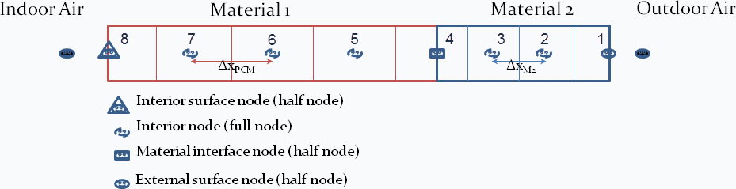

Conduction Finite Difference Node Heat Flux Reporting
================

**M.J. Witte, GARD Analytics, Inc.**

 - October 30, 2015
 - Revised November 18, 2015 - Plan B - Heat flux *at* each node rather than *between* nodes. Track half-nodes to accomplish this. Previous design did not meet the original objective which is to report the heat flux at the interface between two material layers.
 

## Justification for New Feature ##

The primary motivation for this work is to support experimental testing where heat flux meters are embedded within a wall. For example, when field testing envelope systems, often the heat flux transducers are installed on the interior surface of exterior envelopes and then covered with a piece of plywood. Therefore, the measured heat flux is at interface between the interior surface of the envelope and the piece of plywood. Reporting node heat flux is also useful for other work to show the flow of heat within material layers, especially for phase change material (PCM) applications.

## E-mail and  Conference Call Conclusions ##

*insert text*

## Overview ##

Currently, the conduction finite difference algorithm (HeatBalanceAlgorithm,ConductionFiniteDifference) reports the temperature at each node within a surface.  This will add reporting of the heat flux at each node.

## Approach ##

At the end of the conduction finite difference (CondFD) solution for each timestep, the surface inside face conduction heat flux and the node temperatures will be used to calculate the heat flux at each nodes.  The heat flux is defined as the heat flux across the plane which divides the two halves of the node.  The figure below illustrates the conduction finite difference node layout (from the Engineering Reference).




Figure 1. Node depiction for Conduction Finite Difference Model (Nodes are numbered from outside to outside face to inside face.  External surface node = 1, Interior surface node = 8)

The boundary volume for each node is divided into two parts which will be called the Inner Half-Node and Outer Half-Node.  There are four different types of nodes:

 - Interior surface node - This node has only an outer half-node which is the entire volume for this node. There is no inner half-node.
 - Interior node - The volume for this node is divided into two equal parts, and inner half-node and an outer half-node.
 - Material interface node - The volume for this node is divided into two parts, one for each type of material.
 - External surface node - This node has only an inner half-node which is the entire volume for this node. There is no outer half-node.

For every CondFD surface, the Surface Inside Face Conduction Heat Transfer Rate per Area is available as an output. Starting with this flux, the heat flux from the Interior surface node 8 to the inner half of node 7 is the Surface Inside Face Conduction Heat Transfer Rate per Area plus any change in heat storage in the material thickness associated with node 8.  Given the flux from node 8 to to inner half-node 7, then the next flux from inner half-node 7 to outer half-node 7 can be calculated - this is the flux *at* node 7.  The flux calculations then continue from one half-node to the next until the outside face flux is calculated.  This final flux calculation should match the Surface Outside Face Conduction Heat Transfer Rate per Area.

## Design ##

### Relevant variables ###

*Existing*
HeatBalFiniteDiffManager::SurfaceFD(surf).TDT(node) = new node temperature

DataHeatBalSurface::OpaqSurfInsFaceConductionFlux

*New*
HeatBalFiniteDiffManager::SurfaceFD(surf).CpDelXRhoS1(n) = Heat capacitance of Outer Half-Node n, Cp \* Rho \* delX (where delX is the thickness of the node)

HeatBalFiniteDiffManager::SurfaceFD(surf).CpDelXRhoS2(n) = Heat capacitance of Inner Half-Node n, Cp \* Rho \* delX (where delX is the thickness of the node)

HeatBalFiniteDiffManager::SurfaceFD(surf).QDreport(n) = Heat flux at Node n

HeatBalFiniteDiffManager::SurfaceFD(surf).TDpriortimestep(node) = old node temperature from previous timestep

### Relevant Functions ###
HeatBalFiniteDiffManager::
*Existing*
ExteriorBCEqns - Calculate outside surface face node
InteriorNodeEqns - Calculate inner nodes which are not at the interface between two materials
IntInterfaeNodeEqns - Calculate material interface nodes
InteriorBCEqns - Caclculate inside surface face node

*New*
CalcNodeHeatFlux - Calculate the heat flux at each node

### Method ###
1. There are multiple functions (listed above) which solve for the temperatures of the nodes.  These are within a time loop that subdivides the zone time step. Each one determines the properties for the materials in the various nodes, which could be just regular material, r-layer, phase change material, or a combination of two materials.
2. Within the various calc routines, store the applicable values for SurfaceFD(surf).CpDelXRhoS1(n and SurfaceFD(surf).CpDelXRhoS2(n). For R-materials this is zero.  For undefined half-nodes at the innter and outer faces, this is zero.
3. After the new temperatures have been solved, call CalcNodeHeatFlux to compute the heat fluxes for reporting.

```
		// SurfaceFD.QDreport( n ) is the flux at node n
		// When this is called TDT( NodeNum ) is the new node temp and TDpriortimestep( NodeNum ) holds the previous node temp
		// For the TDT and TDpriortimestep arrays, Node 1 is the outside face, and Node TotNodes+1 is the inside face

		// Last node is always the surface inside face.  Start calculations here because the outside face is not defined for all surfaces.
		// Note that TotNodes is the number of nodes in the surface including the outside face node, but not the inside face node
		// so the arrays are all allocated to Totodes+1

		// Heat flux at the inside face node (TotNodes+1)
		surfaceFD.QDreport( TotNodes + 1 ) = OpaqSurfInsFaceConductionFlux( Surf );

		// Heat flux for remaining nodes.
		for ( node = TotNodes; node >= 1; --node ) {
				// Start with inside face (above) and work outward, positive value is flowing towards the inside face
				// CpDelXRhoS1 is outer half-node heat capacity, CpDelXRhoS2 is inner half node heat capacity
			Real64 interNodeFlux; // heat flux at the plane between node and node+1 [W/m2]
			Real64 sourceFlux; // Internal source flux [W/m2]
			if ( surfaceFD.SourceNodeNum == node) {
				sourceFlux = surfaceFD.QSource;
			} else {
				sourceFlux = 0.0;
			}
			interNodeFlux = surfaceFD.QDreport( node + 1 ) + surfaceFD.CpDelXRhoS1( node + 1 )  * ( surfaceFD.TDT( node + 1 ) - surfaceFD.TDpriortimestep( node + 1 ) ) / TimeStepZoneSec;
			surfaceFD.QDreport( node ) = interNodeFlux - sourceFlux + surfaceFD.CpDelXRhoS2( node )  * ( surfaceFD.TDT( node ) - surfaceFD.TDpriortimestep( node ) ) / TimeStepZoneSec;
		}
```

## Testing/Validation/Data Sources ##

Steady-state fluxes should all be equal.

Other fluxes should balance over time.

## Input Output Reference Documentation ##


## Input Description ##

*No changes to input.*

### Conduction Finite Difference (CondFD) Outputs

#### CondFD Surface Heat Flux Node &lt;X&gt; [W/m2]

This will output heat flux at each node in surfaces being simulated with ConductionFiniteDifference. The key values for this output variable are the surface name. The nodes are numbered from outside to inside of the surface. The full listing will appear in the RDD file.

#### CondFD Surface Heat Capacitance Outer Half Node &lt;X&gt; [W/m2-K]
#### CondFD Surface Heat Capacitance Inner Half Node &lt;X&gt; [W/m2-K]

These will output the half-node heat capacitance in surfaces being simulated with ConductionFiniteDifference. The key values for this output variable are the surface name. The nodes are numbered from outside to inside of the surface. The full listing will appear in the RDD file. For this output, the heat capacitance is defined as the product of specific heat, density, and node thickness. Zero is reported for R-layer half-nodes and for undefined half-nodes.  There is no outer half-node for Node 1 which is the outside face of the surface, and there is no inner half-node for Node N which is the inside face of the surface.

## Engineering Reference ##

*See actual engineering ref doc changes.*

## Example File and Transition Changes ##

No transition required.  New outputs will be added to example file CondFD1ZonePurchAirAutoSizeWithPCM.

## References ##

*None.*
