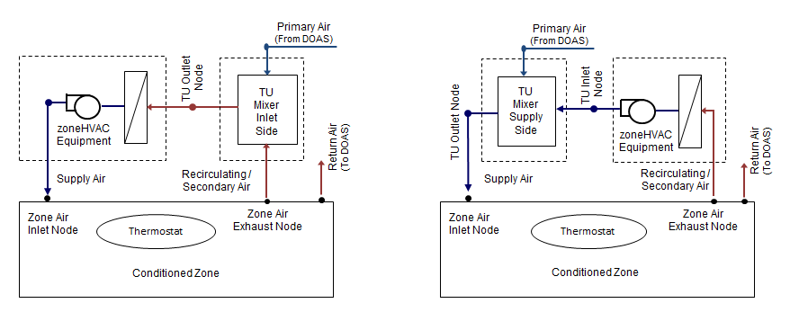

#Dedicated OA to supply and inlet side of zone HVAC units
##Design Document

FSEC, B. Nigusse, May 12, 2016

#Justification for Feature Update:
In its current form, EnergyPlus 8.5 allow a central dedicated outdoor air system (DOAS) to provide conditioned outdoor air directly to the supply or the inlet side of *ZoneHVAC:FourPipeFanCoil* and *ZoneHVAC:WaterToAirHeatPump* zoneHVAC equipment only. Such an arrangement is commonly used in current building design practices and should be extended to other zoneHVAC equipment in EnergyPlus. While there is a credible work-around in EnergyPlus version 8.5 that is thermodynamically similar to the supply side delivery arrangement described above, the OA from the central DOAS is delivered to the zone directly instead of being mixed with the supply air at supply node of the zoneHVAC equipment. This effort will extend such capability to ***ZoneHVAC:PackagedTerminalAirConditioner***, ***ZoneHVAC:PackagedTerminalHeatPump***, or ***ZoneHVAC:TerminalUnit:VariableRefrigerantFlow*** zoneHVAC equipment. The total airflow delivered to the zone is important to be established as it helps in sizing of the duct work and supply registers for the zone, and is also the more commonly used arrangement in practice. In addition to the total airflow, supply air and outdoor air conditions may also be set taking into account the mixing taking place upstream or downstream.   

##Conference Call Conclusions:
**Fred:** explained the context of this new feature evolution and addressed Neal's concerns of why limiting the task to three zoneHVAC objects only. Primarily, it was TRANE's request for such configuration. And the coding cannot be easily generalized as mixing calculation calling point is required in the ***calc routine*** for every zoneHVAC equipment at the inlet and supply side depending what type of mixing object is specified by user.

**Mike:** why not Unitary System is not included in the list as it is one of the most flexible HVAC object designed for various application? **Gu:** seconded Mike's request that the Unitary System being was designed with the intent to replace most of the zoneHVAC equipment in the long run.

**Bereket's Response**, Unitary system as a zone equipment will be considered in phase II implementation (the next funding cycle if approved).

**Richard:** In the current configuration there will be a higher pressure at the secondary air inlet node when the terminal air is on the supply side and may impart back pressure on the DOAS air loop.

**Neal:** suggested to include *ZoneHVAC:EnergyRecoveryVentilator* in the current implementation if budget and time allows.

The participants unanimously approved to implement the three ZoneHVAC objects in this cycle and if there is funding available expand to other zoneHVAC objects as needed. The participants also agreed to consolidate the two mixer objects into a new object and provide transition for each mixer type. Also the team will have a follow-up call after the implementation of the first three objects is complete.

###Other Conference Call Topics (not in scope of current proposal):

N/A

#Overview:
The arrangements shown in Figure 1 is supported in EnergyPlus version 8.5 for 4PipeFanCoil and WSPTHP ZoneHVAC equipment only. A central DOAS provides fresh air to the zone mixed either at the inlet or outlet of a local zoneHVAC equipment that conditions the recirculation air.

To allow for this configuration, the two terminal unit mixer existing objects, *AirTerminal:SingleDuct:SupplySideMixer* and *AirTerminal:SingleDuct:InletSideMixer* are used. These mixer objects can be used with all the ZoneHVAC type terminal unit objects from the group *Zone Forced Air Units* except for *ZoneHVAC:OutdoorAirUnit*, *ZoneHVAC:Dehumidifier:DX* and *ZoneHVAC:EnergyRecoveryVentilator*. The proposed task will add such capability to the following zoneHVAC equipment:

1. **ZoneHVAC:PackagedTerminalAirConditioner**
2. **ZoneHVAC:PackagedTerminalHeatPump**
3. **ZoneHVAC:TerminalUnit:VariableRefrigerantFlow**

#Approach:
Two existing terminal unit mixer objects ***AirTerminal:SingleDuct:SupplySideMixer*** and ***AirTerminal:SingleDuct:InletSideMixer*** in *Air Distribution Equipment* group will be consolidated into a single new terminal unit mixer object, ***AirTerminal:SingleDuct:Mixer.*** A new terminal unit mixer object provides the zoneHVAC equipment object type and object name, primary air inlet node name, secondary air inlet node name, an air outlet node name, and terminal units connection type. Each mixer object will sum the two air streams and average the air properties of the two incoming streams and deliver mixed air either to the zone supply node or the inlet of the local zoneHVAC equipment. The total supply air delivered to a zone is equal to the sum of the primary air and the recirculating air. The primary air flow is balanced with the zone return air flow to meet the DOAS airloop mass balance requirement. This is done automatically in the subroutine *CalcZoneMassBalance*, module *ZoneEqupmentManager*. These terminal units resemble the induction type terminal units: they mix supply air with recirculated zone air and deliver the mixed air into a zone. The mixer objects will contain a reference to the upstream or downstream allowed zoneHVAC equipment. If present, the mixers will be simulated and will be able to pass the zone *load met* taking into account the outdoor air conditions to the local zoneHVAC equipment calculation routines.     

In the *calc routine* where the **OutdoorAir:Mixer** object is simulated is, an option will be provided to simulate *AirTerminal:SingleDuct:Mixer*, if the later exists in the IDF, for each of the zoneHVAC equipment added. 

###Testing/Validation/Data Source(s):
The new feature will be compared against exiting model.

#Inputoutput Refeference (draft):

###AirTerminal:SingleDuct:Mixer 
This terminal unit mixer object is used to mix conditioned outdoor air (primary air) from DOAS air loop and recirculating (secondary air) and deliver it either to inlet and supply side of a local zoneHVAC equipment. The terminal unit mixer can be connected either to the inlet or supply side of the local zoneHVAC equipment and the connection type is specified by a user in the input field ***Terminal Unit Connection Type.*** If the *AirTerminal:SingleDuct:Mixer* object is connected to the supply side, a mix of conditioned outdoor air from a central dedicated outdoor air system (DOAS) with conditioned recirculation air from the local zoneHVAC equipment is supplied as a single stream to the conditioned zone at its inlet node or else if the *AirTerminal:SingleDuct:Mixer* object is connected to the inlet side, a mix of outdoor air from the a central dedicated outdoor air system (DOAS) with un-conditioned recirculation air from a zone exhaust node is supplied to the zoneHVAC equipment inlet node. The mixer will sum the two air streams and average the air properties of the two incoming streams. Currently, the *AirTerminal:SingleDuct:Mixer* is used with the *ZoneHVAC:FourPipeFanCoil* and *ZoneHVAC:WaterToAirHeatPump* objects. This effort will expand the capability to three zoneHVAC equipment. Since, the zoneHVAC equipment gets the outdoor air or ventilation air from central dedicated OA system, the design outdoor air flow rate input fields in the zoneHVAC equipment are set to zero and the OutdoorAir:Mixer object type and name input fields are left blank. 
   
**Field: Name**

Unique name for this air terminal mixer.

**Field: ZoneHVAC Terminal Unit Object Type**

The type of zoneHVAC equipment to which this terminal unit will be connected. This is a choice field. The choices are *ZoneHVAC:FourPipeFanCoil*, *ZoneHVAC:WaterToAirHeatPump*, ***ZoneHVAC:PackagedTerminalAirConditioner***, ***ZoneHVAC:PackagedTerminalHeatPump***, or ***ZoneHVAC:TerminalUnit:VariableRefrigerantFlow***.

**Field: ZoneHVAC Terminal Unit Name**

The name of the zoneHVAC equipment to which this air terminal unit will be connected.

**Field: Terminal Unit Outlet Node Name**

The name of the air outlet node of the mixer. This will be an inlet air node name of the conditioned zone if the connection type specified in the input field *Terminal Unit Connection Type* below is ***SupplySide.***  This will be an inlet air node of the zoneHVAC equipment if the connection type in the input field *Terminal Unit Connection Type* below is ***InletSide.***

**Field: Terminal Unit Primary Air Inlet Node Name**

The name of the primary air (outdoor air) inlet node of the mixer. This will be an outlet node of an AirLoopHVAC:ZoneSplitter, providing the connection to the DOAS system. 

**Field: Terminal Unit Secondary Air Inlet Node Name**
 
The name of the secondary air (recirculating air) inlet node of the mixer. This will be the outlet air node name of the zoneHVAC equipment if the connection type in the input field *Terminal Unit Connection Type* below is ***SupplySide,*** or else this will be exhaust air node name of the zone that is being conditioned if the connection type in the input field *Terminal Unit Connection Type* below is ***InletSide.***

**Field: Terminal Unit Connection Type**

This input field allows user to specify the terminal unit mixer connection type. Valid choices are *InletSide* or *SupplySide*. If the connection type selected is *InletSide*, then the terminal mixer is connected on the inlet side of the zoneHVAC equipment, else if the connection type selected is *SupplySide*, then the terminal mixer is connected at the outlet side of the zoneHVAC equipment.

The IDD entry for this object follows.

**AirTerminal:SingleDuct:Mixer,**

       \memo The mixer air terminal unit provides a means of supplying central system
       \memo air to the air inlet or outlet side of a zoneHAC equipment such as a four
       \memo pipe fan coil. Normally the central air would be ventilation air from a
       \memo dedicated outdoor air system (DOAS).

   A1, \field Name

       \required-field

   A2, \field ZoneHVAC Terminal Unit Object Type

       \required-field
       \type choice
       \key ZoneHVAC:FourPipeFanCoil
       \key ZoneHVAC:WaterToAirHeatPump
       \key ZoneHVAC:PackagedTerminalAirConditioner
       \key ZoneHVAC:PackagedTerminalHeatPump
       \key ZoneHVAC:TerminalUnit:VariableRefrigerantFlow

   A3, \field ZoneHVAC Terminal Unit Name

       \required-field
       \type object-list
       \object-list DOAToZonalUnit

   A4, \field Terminal Unit Outlet Node Name

       \required-field
       \type node

   A5, \field Terminal Unit Primary Air Inlet Node Name

       \required-field
       \type node

   A6, \field Terminal Unit Secondary Air Inlet Node Name

       \required-field
       \type node

   A7; \field Terminal Unit Connection Type

       \required-field
       \type choice
       \key InletSide
       \key SupplySide

An example is shown below.

**AirTerminal:SingleDuct:Mixer,**

    SPACE4-1 DOAS Air Terminal,         !- Name
    ZoneHVAC:PackagedTerminalAirConditioner,  !- ZoneHVAC Terminal Unit Object Type
    SPACE4-1 PTAC, 				        !- ZoneHVAC Terminal Unit Name
    SPACE4-1 Supply Inlet,			    !- Terminal Unit Outlet Node Name
    SPACE4-1 AT Mixer Primary Inlet,	!- Terminal Unit Primary Air Inlet Node Name
    SPACE4-1 Heat Pump Outlet,          !- Terminal Unit Secondary Air Inlet Node Name
    SupplySide;                         !- Terminal Unit Connection Type

**AirTerminal:SingleDuct:InletSideMixer,**

    SPACE1-1 DOAS Air Terminal,  	    !- Name
    ZoneHVAC:PackagedTerminalHeatPump,  !- ZoneHVAC Terminal Unit Object Type
    SPACE1-1 PTHP,      		        !- ZoneHVAC Terminal Unit Name
    SPACE1-1 Heat Pump Inlet,		    !- Terminal Unit Outlet Node Name
    SPACE1-1 ATMixer Primary Inlet,     !- Terminal Unit Primary Air Inlet Node Name
    SPACE1-1 ATMixer Secondary Inlet,   !- Terminal Unit Secondary Air Inlet Node Name
    InletSide;                          !- Terminal Unit Connection Type

Example of PTHP served with dedicated outdoor air system (DOAS). The Outdoor Air Mixer object type and name input fields are left blank.

 **ZoneHVAC:PackagedTerminalHeatPump,**

    SPACE1-1 Heat Pump,      !- Name
    FanAvailSched,           !- Availability Schedule Name
    SPACE1-1 Heat Pump Inlet,!- Air Inlet Node Name
    SPACE1-1 Supply Inlet,   !- Air Outlet Node Name
    ,                        !- Outdoor Air Mixer Object Type
    ,                        !- Outdoor Air Mixer Name
    Autosize,                !- Supply Air Flow Rate During Cooling Operation {m3/s}
    Autosize,                !- Supply Air Flow Rate During Heating Operation {m3/s}
    ,                        !- Supply Air Flow Rate When No Cooling or Heating is Needed {m3/s}
    Autosize,                !- Outdoor Air Flow Rate During Cooling Operation {m3/s}
    Autosize,                !- Outdoor Air Flow Rate During Heating Operation {m3/s}
    Autosize,                !- Outdoor Air Flow Rate When No Cooling or Heating is Needed {m3/s}
    Fan:OnOff,               !- Supply Air Fan Object Type
    SPACE1-1 Supply Fan,     !- Supply Air Fan Name
    Coil:Heating:DX:SingleSpeed,  !- Heating Coil Object Type
    SPACE1-1 HP Heating Mode,     !- Heating Coil Name
    0.001,                   !- Heating Convergence Tolerance {dimensionless}
    2.0,                     !- Minimum Outdoor Dry-Bulb Temperature for Compressor Operation {C}
    Coil:Cooling:DX:SingleSpeed,  !- Cooling Coil Object Type
    SPACE1-1 HP Cooling Mode,     !- Cooling Coil Name
    0.001,                   !- Cooling Convergence Tolerance {dimensionless}
    Coil:Heating:Gas,        !- Supplemental Heating Coil Object Type
    SPACE1-1 HP Supp Coil,   !- Supplemental Heating Coil Name
    50.0,                    !- Maximum Supply Air Temperature from Supplemental Heater {C}
    20.0,                    !- Maximum Outdoor Dry-Bulb Temperature for Supplemental Heater Operation {C}
    BlowThrough,             !- Fan Placement
    CyclingFanSch;           !- Supply Air Fan Operating Mode Schedule Name

###Proposed Report Variables:
N/A

###Proposed additions to Meters:
N/A

##Engineering Reference (draft):
The mass and energy conservation equations that are required for the terminal unit mixers. Mass conservation equations satisfy the zone and air loop mass balance requirements. The terminal unit mass conservation equation is given by:

ms = mpri + mrecir

Note that the air flow rate though the zoneHVAc equipment is fixed by the zone equipment.  Therefore, for terminal unit mixer connected on the inlet side of zoneHVAC equipment the recirculation (secondary) air mass flow rate is calculated by fixing the flow rate through the zoneHVAC equipment as follows: 

mrecir = max(0.0, ms - mpri)

The mixed air properties are calculated from energy and water mass balance equations as follows:

	hmix = ( mrecir * hrecir + mpri * hpri ) / mmix

	wmix = ( mrecir * wrecir + mpri * wpri ) / mmix

The mixed air temperature is determined using the following psychometric function:

	tmix = PsyTdbFnHW( hmix, wmix )

For the air loop mass flow balance calculation is performed in *CalcZoneMassBalance*, module *ZoneEqupmentManager*. The zone return air mass flow balances the primary air flow rate and is represented by:

mRet = mpri

###Example File and Transition changes:
New example files using both inlet and supply side OA mixing configurations will be provided for each ZoneHVAC equipment added. The existing two terminal air mixer objects will be consolidated into single new terminal mixing object, ***AirTerminal:SingleDuct:Mixer,*** and transition rules will be prepared for the two objects.

###Other documents:
None.
