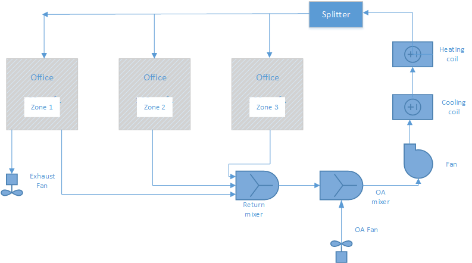

Pressure Control Through Pressure Controller
================

**Lixing Gu** 

**Florida Solar Energy Center**

**Fifth revision**
1/xx/16
Add more E-mail communications.

**Fourth revision**
1/15/16
Add design document.

**Third revision**
1/12/16
Revise NFP based on comments from the first review meeting.


**Second revision**
1/8/16
Allow pressure control by adjusting exhaust fan flow rate, as well as relief node flow rate in an OA mixer

**First revision**
1/6/16
Added a new object of AirflowNetwork:Distribution:Component:OutdoorAirFlow to handle OA flow rate

**Initial draft**
 - 12/23/15
 

## Justification for New Feature ##

The Airflow Network model currently implemented in EnergyPlus is used to accurately predict simulation conditions based on a pressure-network. This capability allows users to carefully define the pressure components in their building, and use this to resolve flow rates and infiltration rates.

One piece missing from the Airflow Network capabilities is the ability to control to a pressure setpoint within a space. The pressure control is able to let designers to control unintentional airflows through the building envelope and between spaces inside a building to prevent a number of adverse impacts of these airflows. In addition, pressure control is required for some special spaces, such as operation room and chemical lab. The new feature proposal adds this specific capability to the existing Airflow Network model in EnergyPlus.


## E-mail and Conference Call Conclusions ##

###E-mail communications

Tianzhen comments from E-mail on 12/23/15

Three quick questions:

1. Does it require or allow each zone to have its own exhaust fan? its own pressure setpoint? Or this only applies to a control zone for an air loop? I saw more common for office buildings is to use a central relief fan to control air pressure in the building.

2. Would the naming ZoneControl:PressureStat make more sense? As this only applies to AFN.

3. For leaky buildings, sometimes the only way to control pressure is to increase OA flow rate. 

Gu's reply on 12/28/15

1A: The proposal proposes an exhaust fan in a controlled zone for pressure control in an AirLoop. It is similar to temperature control to use a thermostat in a controlled zone. The pressure control only happens in the controlled zone. 

It is true that a central relief fan is also used to control building pressure. The existing EnergyPlus does not have an object for a central relief fan. In turn, the AirflowNetwork model does not also have the same object. That is why an exhaust fan is proposed.   

2A: The new object is applied to AFN only as proposed. I don’t have any strong opinions for the name of a new object. My intent is that the object may not be restricted to AFN. It is possible that E+ may also calculate zone pressure in other models in the future.  We can discuss it.

3A: It is also true to adjust OA for zone pressure control. If we allow to adjust both OA and exhaust flow rates, there is no unique solution. Therefore, exhaust flow rate is proposed. If pressure control can not be reached in leaky buildings, users can increase OA. I will add it in a warning message.  

A new addition on 1/8/16

A central relief control is added. It addresses one of Tianzhen's concerns.

###Review meeting

The first review meeting was held on 1/12/16. Michael Witte, Jason DeGraw, Tianzhen Hong and Lixing Gu attended the meeting.

The main concern is the object name of the PressureStat. The consensus conclusion is a new object name: AirflowNetwork:ZoneControl:PressureController to replace ZoneControl:PressureStat.

Another concern is to prevent circulation of OA flow and zone exhaust fan flow rate. The current practice is that when exhaust fan flow rate is greater than OA flow rate, the OA flow rate will increase to match exhaust fan flow rate. This concern will be considered during coding to avoid possible circulation of both airflow rates.  

###E-mail communications after submission of design document

Bereket on 1/21/16

I read the design document.  The intent and implementation are well described.  I have one question that came to my mind.  Does the pressure controlled zone have to be the same zone controlled by thermostat, or it can be any of the zones served by the air loop?
 
Gu's reply on 1/22/16

Since the zone name is a field of the AirflowNetwork:ZoneControl:PressureController object, one of any zones served by the same air loop is allowed, although I prefer to be the same zone with the thermostat.

## Overview ##

The pressure control could be achieved by changing either exhaust fan flow rate in a controlled zone or relief node flow rate in an OA mixer, when an AirLoop has two required components: an outdoor air mixer and an exhaust fan in a controlled zone. Figure 1 shows schematic of an AirLoop with required components. The proposed pressure control will be accomplished in the AirLoop. 

The outdoor flow rate is specified by the Controller:OutdoorAir object in the AirLoop. The first approach is to vary exhaust fan flow rate between zero and maximum flow rates to achieve pressure control in the controlled zone. The maximum flow rate of an exhaust fan is specified in the Fan:ZoneExhaust object. The relief node flow rate is zero. The second approach is to vary relief node flow rate in an OA mixer between zero flow rate and the OA flow rate specified by the Controller:OutdoorAir object. The exhaust fan flow rate will be fixed.   




Figure 1.  Simplified Schematic of an Airloop with an OA mixer and an exhaust fan in a zone


## Approach ##

The proposed approach adds three new objects and enhances outdoor air, relief air and exhaust fan handling in the AirflowNetwork model. The first new object is to provide pressure setpoint. The second one is to allow the AirflowNetwork model to adopt the outdoor air flow rate based on the Controller:OutdoorAir object. The third one is to set up adjustable relief air flow rate to meet the zone pressure setpoint.

###A new object of PressureController

A new object of AirflowNetwork:ZoneControl:PressureController will be proposed to allow a user to input pressure setpoint and a controlling component with adjustable airflow rate to meet the setpoint. The proposed component is either the Fan:ZoneExhaust object or the OutdoorAir:Mixer. A single choice is allowed. In other words, both Fan:ZoneExhaust and OutdoorAir:Mixer objects can not used together to perform pressure control.

Since the Fan:ZoneExhaust has the maximum flow rate field, there is no need to revise the existing object. 

Since the relief node flow rate change is based on the outdoor airflow rate specified by the Controller:OutdoorAir object, there is no need to have flow rate inputs.

###A new object of AirflowNetwork:Distribution:Component:OutdoorAirFlow

A new object of AirflowNetwork:Distribution:Component:OutdoorAirFlow will be proposed to allow a user to adopt the outdoor air flow rate based on the Controller:OutdoorAir object. When the outdoor air flow rate is zero, the model treats this component as a crack using a power law to specify relationship between pressure difference and mass flow rate.

It should be pointed out that the object does not have information on Controller:OutdoorAir object, because the AirflowNetwork model allows a single Controller:OutdoorAir object based on restriction of a single AirLoop. When multiple Airloops are allowed, the required optional inputs of Controller:OutdoorAir objects will be added.  

###A new object of AirflowNetwork:Distribution:Component:ReliefAirFlow

A new object of AirflowNetwork:Distribution:Component:ReliefAirFlow will be proposed to allow a user to set up the relief node flow in an OA mixer to perform pressure control. When the outdoor air flow rate is zero, the model treats this component as a crack using a power law to specify relationship between pressure difference and mass flow rate.

It should be pointed out that the object does not have information on the OA mixer object. The choice is provided in the PressureController object. 

### Outdoor air handling

There are two ways to treat an OA mixer in the existing AirflowNetwork model. The first way is that there is no link between an outdoor air node and an OA mixer, so that returning airflow rate is equal to the one at OA mixer outlet node. This is the same way to treat airflow rate for an OA mixer without using the AirflowNetwork model. The mixer outlet node conditions are calculated using the current code in MixedAir module. The advantage is that no mass flow rate adjustment is needed and the mixer outlet calculation results are applied to the mixer outlet. The disadvantage is the return flow rate is not treated in reality.   

The second way is to add a link between the outdoor air node and the OA mixer. However, the outdoor air flow rate is calculated based on linkage resistance and pressure difference across the link. In other words, the OA flow rate is not controlled precisely compared to the OA controller specification, and varies with time, since outdoor pressure changes with time.

The proposed approach is to have a link between the outdoor air node and the OA mixer and an associated new flow component. The new component will be a constant fan when the outdoor air flow from the Controller:OutdoorAir object is greater than zero, and a crack with zero outdoor flow rate.

In order to use a central relief airflow to preform pressure control, an additional link between the OA mixer and the outdoor air node is needed. The link is similar to the above link. The difference is that the orders of two distribution nodes are switched. The above link represent an OA fan, while the current link represents a central relief fan.      

### Exhaust fan handling

Since the new feature requires to vary exhaust fan flow rate to achieve the pressure control, following procedures will be performed:

1. The AirflowNetwork model will run twice with zero and maximum flow rates for the controlled zone exhaust fan. The controlled zone pressures are the return values.

	In general, the zero flow rate of either exhaust fan or relief node will generate the maximum zone pressure, while the maximum flow rate of either exhaust fan or relief nodewill produce the minimum zone pressure. 

2. If the setpoint pressure is between the maximum zone pressure caused by zero exhaust fan flow rate and the minimum zone pressure caused by maximum exhaust fan flow rate, The AirflowNetwork model will use Regula Falsi to find a solution with calculated zone exhaust fan flow rate. Otherwise, the pressure setpoint will not be met. 

3. If both maximum and minimum pressures are higher than the setpoint, the maximum exhaust flow rate will be forced. 

4. If both maximum and minimum pressures are lower than the setpoint, the zero exhaust flow rate will be forced.

### Relief air handling

The relief air handling is similar to exhaust air handling. The logic is the same. The difference is that relief air handling is based on a system, while exhaust air handling occurs in a controlled zone. 

## Testing/Validation/Data Sources ##

The simulation results will be compared to spread sheet results.

## Input Output Reference Documentation ##

This section describes inputs of three new object as AirflowNetwork:ZoneControl:PressureController, AirflowNetwork:Distribution:Component:OutdoorAirFlow and AirflowNetwork:Distribution:Component:ReliefAirFlow. 

### AirflowNetwork:ZoneControl:PressureController

The AirflowNetwork:ZoneControl:PressureController object is used to control a zone to a specified indoor level of pressure using the AirflowNetwork model. The specified pressure setpoint is used to calculate the required zone exhaust fan flow rate in a controlled zone or relief air flow rate in an AirLoop.

The object has the same performance as ZoneControl:Thermostat. When an AirLoop serves multiple zones, the controlled zone will reach the specific setpoint, while other zones will not be controlled precisely.

#### Field: Name

Unique identifying name for the AirflowNetwork:Distribution:Component:OutdoorAirFlow.

#### Field: Controlled Zone Name

Name of the zone that is being controlled.

#### Field: Control Object type

This field specifies the control type to be used for pressure control. Available control types are:
Fan:ZoneExhaust and OutdoorAir:Mixer.

#### Field: Control Name

The corresponding control type name. 

#### Field:Pressure Control Availability Schedule Name

This field contains the name of a schedule that determines whether or not the AirflowNetwork:ZoneControl:PressureController is available. When the schedule value is zero, the AirflowNetwork:ZoneControl:PressureController is bypassed (not available to operate). When the schedule value is greater than zero, the AirflowNetwork:ZoneControl:PressureController is available and will be used to calculate the required zone exhaust fan airflow rate to reach the pressure setpoint when an exhaust fan is used to preform pressure control. When an OutdoorAir:Mixer is entered, the required airflow is the central relief flow rate. If this field is left blank, the schedule has a value of 1 for all time periods. Schedule values must be between 0 and 1.

#### Field:Pressure Setpoint Schedule Name

This field contains the name of a schedule that contains the zone air pressure setpoint as a function of time. The units for pressure setpoint are Pascal. The setpoint values in the schedule must be between -50 and 100 Pascal. 

An IDF example is provided below:

```idf
   AirflowNetwork:ZoneControl:PressureController,
       Pressure Controller1,           !- Name
       EAST ZONE,                      !- Controlled Zone Name
	   Fan:ZoneExhaust,                !- Control Object type
	   East Zone Exhaust Fan,          !- Control Name
       PressureAvailSchedule,          !- Pressure Control Availability Schedule Name
       PressureSetpointSchedule;       !- Pressure Setpoint Schedule Name
```

###AirflowNetwork:Distribution:Component:OutdoorAirFlow

The AirflowNetwork:Distribution:Component:OutdoorAirFlow object is used to allow the AirflowNetwork model to adopt the amount of outdoor air flow rate. When the outdoor air mass flow rate is greater than zero, the airflow network model treats this object as a constant volume fan and the flow rate is provided by the Controller:OutdoorAir object. When there is not outdoor air flow rate, the model treats this object as a crack and a power law is assumed. 

####Field: Name

This is the name for this instance of the AirflowNetwork:Distribution:Component:OutdoorAirFlow object.

####Field: Air Mass Flow Coefficient When No Outdoor Air Flow at Reference Conditions

The value of the air mass flow coefficient,({C_Q}), in the crack air flow equation. It has units of kg/s at 1Pa. This value must be greater than zero. The value is used when the outdoor mass flow rate is zero from the Controller:OutdoorAir object.

####Field: Air Mass Flow Exponent When No Outdoor Air Flow

The value of the exponent,* n*, in the crack air flow equation. The valid range is 0.5 to 1.0, with the default value being 0.65. The value is used when the fan is off. The value is used when the outdoor mass flow rate is zero from the Controller:OutdoorAir object.

####Field: Reference Crack Conditions

The name of the AirflowNetwork:MultiZone:ReferenceCrackConditions object which specifies the conditions under which the air mass flow coefficient was measured. If the user omits this field and only one AirflowNetwork:MultiZone:ReferenceCrackConditions object is defined in the input data file, then those reference crack conditions will be used. If the user omits this field and either zero or more than one AirflowNetwork:MultiZone:ReferenceCrackConditions objects are defined in the input data file, then the default conditions for the AirflowNetwork:Multizone: Reference Crack Conditions object will be used.

IDF examples are provided below:

```idf

  AirflowNetwork:MultiZone:Component:OutdoorAirFlow,
    OAFlow,                  !- Name
    0.01,                    !- Air Mass Flow Coefficient When No Outdoor Air Flow at Reference Conditions {kg/s}
    0.667;                   !- Air Mass Flow Exponent When No Outdoor Air Flow {dimensionless}

  AirflowNetwork:Distribution:Node,
    OA System Node,          !- Name
    ,                        !- Component Name or Node Name
    AirLoopHVAC:OutdoorAirSystem,  !- Component Object Type or Node Type
    3.0;                     !- Node Height {m}

  AirflowNetwork:Distribution:Node,
    OA Inlet Node,           !- Name
    Outside Air Inlet Node,  !- Component Name or Node Name
    OAMixerOutdoorAirStreamNode,  !- Component Object Type or Node Type
    1.5;                     !- Node Height {m}

  AirflowNetwork:Distribution:Linkage,
    OASystemFanLink,       !- Name
    OA Inlet Node,           !- Node 1 Name
    OA System Node,          !- Node 2 Name
    OAFlow;      !- Component Name

```
###AirflowNetwork:Distribution:Component:ReliefAirFlow

The AirflowNetwork:Distribution:Component:ReliefAirFlow object is used to allow the AirflowNetwork model to perform pressure control by varying the amount of relief air flow rate. When the outdoor air mass flow rate is greater than zero, the airflow network model treats this object as a constant volume fan and the flow rate is varied to reach pressure control. When there is not outdoor air flow rate, the model treats this object as a crack and a power law is assumed. 

####Field: Name

This is the name for this instance of the AirflowNetwork:Distribution:Component:ReliefAirFlow object.

####Field: Air Mass Flow Coefficient When No Outdoor Air Flow at Reference Conditions

The value of the air mass flow coefficient,({C_Q}), in the crack air flow equation. It has units of kg/s at 1Pa. This value must be greater than zero. The value is used when the outdoor mass flow rate is zero from the Controller:OutdoorAir object.

####Field: Air Mass Flow Exponent When No Outdoor Air Flow

The value of the exponent,* n*, in the crack air flow equation. The valid range is 0.5 to 1.0, with the default value being 0.65. The value is used when the fan is off. The value is used when the outdoor mass flow rate is zero from the Controller:OutdoorAir object.

####Field: Reference Crack Conditions

The name of the AirflowNetwork:MultiZone:ReferenceCrackConditions object which specifies the conditions under which the air mass flow coefficient was measured. If the user omits this field and only one AirflowNetwork:MultiZone:ReferenceCrackConditions object is defined in the input data file, then those reference crack conditions will be used. If the user omits this field and either zero or more than one AirflowNetwork:MultiZone:ReferenceCrackConditions objects are defined in the input data file, then the default conditions for the AirflowNetwork:Multizone: Reference Crack Conditions object will be used.

IDF examples are provided below:

```idf
   AirflowNetwork:ZoneControl:PressureController,
     Pressure Controller1,           !- Name
     EAST ZONE,                      !- Controlled Zone Name
	 OutdoorAir:Mixer,               !- Control Object type
	 OA Mixing Box 1,                !- Control Name
     PressureAvailSchedule,          !- Pressure Control Availability Schedule Name
     PressureSetpointSchedule;       !- Pressure Setpoint Schedule Name

   AirflowNetwork:MultiZone:Component:ReliefAirFlow,
     ReliefFlow,                     !- Name
     0.01,                           !- Air Mass Flow Coefficient When No Outdoor Air Flow at Reference Conditions {kg/s}
     0.667;                          !- Air Mass Flow Exponent When No Outdoor Air Flow {dimensionless}

  AirflowNetwork:Distribution:Node,
    OA System Node,                  !- Name
    ,                                !- Component Name or Node Name
    AirLoopHVAC:OutdoorAirSystem,    !- Component Object Type or Node Type
    3.0;                             !- Node Height {m}

  AirflowNetwork:Distribution:Node,
    OA Inlet Node,                   !- Name
    Outside Air Inlet Node,          !- Component Name or Node Name
    OAMixerOutdoorAirStreamNode,     !- Component Object Type or Node Type
    1.5;                             !- Node Height {m}

  AirflowNetwork:Distribution:Linkage,
    OASystemFanLink,                !- Name
    OA System Node,                 !- Node 1 Name
    OA Inlet Node,                  !- Node 2 Name
    ReliefFlow;                     !- Component Name

```

## Input Description ##

This section describes inputs of three new object as AirflowNetwork:ZoneControl:PressureController,  AirflowNetwork:Distribution:Component:OutdoorAirFlow, and AirflowNetwork:Distribution:Component:ReliefAirFlow. 

### New objects

AirflowNetwork:ZoneControl:PressureController

	AirflowNetwork:ZoneControl:PressureController,
   		\memo Define the Pressures control settings for a zone or list of zones.
   		\memo If you use a ZoneList in the Zone or ZoneList name field then this definition applies
   		\memo to all the zones in the ZoneList.
  	A1 , \field Name
       \required-field
       \reference AirflowNetworkZoneControlPressureControllerNames
 	A2 , \field Zone Name
       \required-field
       \type object-list
       \object-list ZoneAndZoneListNames
  	A3 , \field Control Object Type
       \required-field
       \type choice
       \key Fan:ZoneExhaust
	   \note The current selection is Fan:ZoneExhaust only.
  	A4 , \field Control Name
       \note Control names are names of individual control objects 
       \required-field
       \type object-list
       \object-list ControlTypeNames
  	A5 , \field Pressure Control Availability Schedule Name
       \note Availability schedule name for pressure controller. Schedule value > 0 means the 
	   \note pressure controller is enabled. If this field is blank, then pressure controller is \note always enabled.
       \type object-list
       \object-list ScheduleNames
  	A6 ; \field Pressure Setpoint Schedule Name
      \type object-list
      \object-list ScheduleNames


AirflowNetwork:Distribution:Component:OutdoorAirFlow

	AirflowNetwork:Distribution:Component:OutdoorAirFlow
      \min-fields 3
      \memo This object adopts outdoor air flow based on Controller:OutdoorAir object
 	A1 , \field Name
       \required-field
       \reference AFNOutdoorAirFlowNames
 	N1 , \field Air Mass Flow Coefficient When No Outdoor Air Flow at Reference Conditions
      \required-field
      \type real
      \units kg/s
      \minimum> 0
      \note Enter the air mass flow coefficient at the conditions defined
      \note in the Reference Crack Conditions object.
      \note Defined at 1 Pa pressure difference. Enter the coefficient used in the following
      \note equation:
      \note Mass Flow Rate = Air Mass Flow Coefficient * (dP)^Air Mass Flow Exponent.
      \note Used only when no outdoor iar flow rate.
 	N2 , \field Air Mass Flow Exponent When No Outdoor Air Flow
      \units dimensionless
      \type real
      \minimum 0.5
      \maximum 1.0
      \default 0.65
      \note Enter the exponent used in the following equation:
      \note Mass Flow Rate = Air Mass Flow Coefficient * (dP)^Air Mass Flow Exponent.
      \note Used only when no outdoor iar flow rate.
 	A2 ; \field Reference Crack Conditions
      \type object-list
      \object-list ReferenceCrackConditions
      \note Select a AirflowNetwork:MultiZone:ReferenceCrackConditions name associated with
      \note the air mass flow coefficient entered above.

AirflowNetwork:Distribution:Component:ReliefAirFlow

	AirflowNetwork:Distribution:Component:ReliefAirFlow
      \min-fields 3
      \memo This object allows variation of air flow rate to perform pressure. 
 	A1 , \field Name
       \required-field
       \reference AFNReliefAirFlowNames
 	N1 , \field Air Mass Flow Coefficient When No Outdoor Air Flow at Reference Conditions
      \required-field
      \type real
      \units kg/s
      \minimum> 0
      \note Enter the air mass flow coefficient at the conditions defined
      \note in the Reference Crack Conditions object.
      \note Defined at 1 Pa pressure difference. Enter the coefficient used in the following
      \note equation:
      \note Mass Flow Rate = Air Mass Flow Coefficient * (dP)^Air Mass Flow Exponent.
      \note Used only when no outdoor iar flow rate.
 	N2 , \field Air Mass Flow Exponent When No Outdoor Air Flow
      \units dimensionless
      \type real
      \minimum 0.5
      \maximum 1.0
      \default 0.65
      \note Enter the exponent used in the following equation:
      \note Mass Flow Rate = Air Mass Flow Coefficient * (dP)^Air Mass Flow Exponent.
      \note Used only when no outdoor iar flow rate.
 	A2 ; \field Reference Crack Conditions
      \type object-list
      \object-list ReferenceCrackConditions
      \note Select a AirflowNetwork:MultiZone:ReferenceCrackConditions name associated with
      \note the air mass flow coefficient entered above.

## Outputs Description ##

This section presents outputs from a new object of AirflowNetwork:ZoneControl:PressureController.

### AirflowNetwork:ZoneControl:PressureController Outputs

The following output variables are available when the AirflowNetwork:ZoneControl:PressureController object is specified.

* HVAC,Average,Zone Air Pressure Setpoint [Pa]

* HVAC,Average,Zone Air Pressure Control Mass Flow Rate [kg/s]

####HVAC,Average,Zone Air Pressure Setpoint [Pa]

This is the current zone pressure setpoint in Pascal. If the pressure control is not available determined by the availability schedule value, then the value will be 0. This value is set at each zone timestep. Using the averaged value for longer reporting frequencies (hourly, for example) may not be meaningful in some applications.

####HVAC,Average,Zone Air Pressure Control Mass Flow Rate [kg/s]

This is the mass flow rate used to achieve the pressure control in kg/s. If the pressure control is not available, then the value will be 0. This value is set at each zone timestep. Using the averaged value for longer reporting frequencies (hourly, for example) may not be meaningful in some applications.

## Engineering Reference ##

A new section of Pressure Control will be added under the AirflowNetwork model.
 
###AirflowNetwork Model
...
####Pressure Control

The pressure control is achieved by varying either zone exhaust fan flow rate in a controlled zone or relief air flow rate in an AirLoop. It requires an AirLoop with an OA mixer and an exhaust fan in a controlled zone. The calculation logic is provide below:


1. The AirflowNetwork model will run twice with zero and maximum flow rates for either the controlled zone exhaust fan or relief air flow rate. The controlled zone pressures are the return values.

	In general, the zero flow rate of either exhaust fan or relief node will generate the maximum zone pressure, while the maximum flow rate of either exhaust fan or relief nodewill produce the minimum zone pressure. 

2. If the setpoint pressure is between the maximum zone pressure caused by zero exhaust fan or relief node flow rate and the minimum zone pressure caused by maximum exhaust fan flow rate or outdoor air flow rate, The AirflowNetwork model will use Regula Falsi to find a solution with calculated zone exhaust fan flow rate. Otherwise, the pressure setpoint will not be met. 

3. If both maximum and minimum pressures are higher than the setpoint, the maximum exhaust or outdoor flow rate will be forced. 

4. If both maximum and minimum pressures are lower than the setpoint, the zero flow rate will be forced.
  
## Example File and Transition Changes ##

A new example file will be created to demonstrate pressure control.

No transition is needed.

##Design Document##

This new feature will revise several modules: DataAirflowNetwork, AirflowNetworkBalanceManager, and AirfowNetworkSolver.

###DataAirflowNetwork###

The revision includes three new variables and two new structs. The three new variables allow data exchange among AirflowNetwork modules. Two new structs accommodate 3 new objects. It should be pointed out that  both AirflowNetwork:Distribution:Component:OutdoorAirFlow and AirflowNetwork:Distribution:Component:ReliefAirFlow objects have similar fields. They can be combined together as a single struct.   

#### PressureSetFlag

A new variable of PressureSetFlag will be added to show pressure control status.
 
	0: No pressure control;
	1: Use exhaust fan to perform pressure control
	2: Use a central relief flow to perform pressure control

####ExhaustFanMassFlowRate and ReliefMassFlowRate

Two new variables of mass flow rate are added to allow the model to access the variables to perform pressure control. The first variable represents the exhaust fan flow rate when PressureSetFlag = 1. The second variable represents the central relief flow rate when PressureSetFlag = 2. These two variables are used in Regula Falsi to reach pressure control. 

	Real64 ExhaustFanMassFlowRate( 0.0 ); // Exhaust fan flow rate used in PressureStat
	Real64 ReliefMassFlowRate( 0.0 ); // OA Mixer relief node flow rate used in PressureStat

####Struct of AirflowNetwork:ZoneControl:PressureController

The struct below shows members used to describe a PressureController object.

	struct PressureControllerProp
	{
		// Members
		std::string Name; // Provide a unique object name
		std::string ZoneName; // Name of the zone that is being controlled
		int ZoneNum; // Zone number
		std::string ControlObjectType; // The control type to be used for pressure control
		std::string ControlObjectName; // Corresponding control type name
		int AvailSchedPtr; // Availability schedule pointer
		int PresSetpointSchedPtr; // Pressure setpoint schedule pointer
	}

	extern Array1D< PressureControllerProp > PressureControllerData;

####Struct of AirflowNetwork:Distribution:Component:OutdoorAirFlow and AirflowNetwork:Distribution:Component:ReliefAirFlow

Since both objects have similar fields, they can share the same struct.

	struct MultizoneCompAirflowProp // Zone exhaust fan component
	{
		// Members
		std::string Name; // Name of exhaust fan component
		int SchedPtr; // Schedule pointer
		Real64 FlowCoef; // Air Mass Flow Coefficient
		Real64 FlowExpo; // Air Mass Flow exponent
		Real64 StandardT; // Standard temperature for crack data
		Real64 StandardP; // Standard borometric pressure for crack data
		Real64 StandardW; // Standard humidity ratio for crack data
		int InletNode; // Inlet node number
		int OutletNode; // Outlet node number
	}

Then, each new object has its own array:

	extern Array1D< MultizoneCompAirflowProp > MultizoneCompOutdoorAirData;
	extern Array1D< MultizoneCompAirflowProp > MultizoneCompReliefAirData;

###AirflowNetworkBalanceManager###

The revision includes modification of two existing function and addition of a new function. Two functions will be revised to accommodate the proposed changes. The first function is GetAirflowNetworkInput. A new section will be added to read three new objects. The second function is CalcAirflowNetworkAirBalance. A new section will allow iterations using the Regula Falsi method to find flow rate of either exhaust fan or relief node for zone pressure control. A new function will be created to apply the Regula Falsi method.

####Revision of GetAirflowNetworkInput function

A new section will be added to read inputs of three new objects: PressureControllerData, MultizoneCompOutdoorAirData, and MultizoneCompReliefAirData.

1.	Read inputs of PressureControllerData object
2.	Read inputs of MultizoneCompOutdoorAirData object
3.	Read inputs of MultizoneCompReliefAirData object

####Revision of CalcAirflowNetworkAirBalance function

Add a new section to allow iteration to find flow rate of either exhaust fan or relief node for zone pressure control:

		if ( PressureSetFlag == 0 ) {
			AIRMOV( );
		} else if ( PressureSetFlag == 1 ) { // Exhasut control
			ExhaustFanMassFlowRate = MinExhaustMassFlowrate;
			AIRMOV( );
			ZonePressure1 = AirflowNetworkNodeSimu( ControlledZoneNum ).PZ;
			if ( ZonePressure1 <= PressureSet ) {
				// The highet pressure due to minimum flow rate could not reach Pressure set, bypass pressureset calculation
				if ( !WarmupFlag ) {
					if ( ErrCountLowPre == 0 ) {
						++ErrCountLowPre;
						ShowWarningError( "The calculated pressure with minimum exhaust fan rate is lower than the pressure setpoint. The pressure control is unable to perform." );
						ShowContinueErrorTimeStamp( "Calculated pressure = " + RoundSigDigits( ZonePressure1, 2 ) + "[Pa], Pressure setpoint =" + RoundSigDigits( PressureSet, 2 ) );
					} else {
						++ErrCountLowPre;
						ShowRecurringWarningErrorAtEnd( AirflowNetworkNodeData( 3 ).Name + ": The AFN model continues not to perform pressure control due to lower zone pressure...", ErrIndexLowPre, ZonePressure1, ZonePressure1 );
					}
				}
			} else {
				ExhaustFanMassFlowRate = MaxExhaustMassFlowrate;
				AIRMOV( );
				ZonePressure2 = AirflowNetworkNodeSimu( ControlledZoneNum ).PZ;
				if ( ZonePressure2 >= PressureSet ) {
					// The lowest pressure due to maximum flow rate is still higher than Pressure set, bypass pressureset calculation
					if ( !WarmupFlag ) {
						if ( ErrCountHighPre == 0 ) {
							++ErrCountHighPre;
							ShowWarningError( "The calculated pressure with maximum exhaust fan rate is higher than the pressure setpoint. The pressure control is unable to perform." );
							ShowContinueErrorTimeStamp( "Calculated pressure = " + RoundSigDigits( ZonePressure2, 2 ) + "[Pa], Pressure setpoint = " + RoundSigDigits( PressureSet, 2 ) );
						} else {
							++ErrCountHighPre;
							ShowRecurringWarningErrorAtEnd( AirflowNetworkNodeData( 3 ).Name + ": The AFN model continues not to perform pressure control due to higher zone pressure...", ErrIndexHighPre, ZonePressure2, ZonePressure2 );
						}
					}
				} else {
					//					if ( ZonePressure1 > PressureSet && ZonePressure2 < PressureSet ) {
					Par( 1 ) = PressureSet;
					SolveRegulaFalsi( ErrorToler, MaxIte, SolFla, ExhaustFanMassFlowRate, AFNPressureResidual, MinExhaustMassFlowrate, MaxExhaustMassFlowrate, Par );
					if ( SolFla == -1 ) {
						if ( !WarmupFlag ) {
							if ( ErrCountVar == 0 ) {
								++ErrCountVar;
								ShowWarningError( "Iteration limit exceeded calculating DX unit speed ratio, for unit=" );
								//							ShowContinueErrorTimeStamp( "Speed ratio returned=[" + RoundSigDigits( SpeedRatio, 2 ) + "], Speed number =" + RoundSigDigits( SpeedNum ) );
							} else {
								++ErrCountVar;
								//							ShowRecurringWarningErrorAtEnd( MSHeatPump( MSHeatPumpNum ).Name + "\": Iteration limit warning exceeding calculating DX unit speed ratio continues...", MSHeatPump( MSHeatPumpNum ).ErrIndexVar, SpeedRatio, SpeedRatio );
							}
						}
					} else if ( SolFla == -2 ) {
						ShowFatalError( "DX unit compressor speed calculation failed: speed limits exceeded, for unit=" );
					}
				}
			}
		} else { // Relief flow control
			Real64 MinReliefMassFlowrate = 0.000;
			Real64 MaxReliefMassFlowrate = Node( OAinletNode ).MassFlowRate;
			ReliefMassFlowRate = MinReliefMassFlowrate;
			AIRMOV( );
			ZonePressure1 = AirflowNetworkNodeSimu( ControlledZoneNum ).PZ;
			if ( ZonePressure1 <= PressureSet ) {
				// The highet pressure due to minimum flow rate could not reach Pressure set, bypass pressureset calculation
				if ( !WarmupFlag ) {
					if ( ErrCountLowPre == 0 ) {
						++ErrCountLowPre;
						ShowWarningError( "The calculated pressure with minimum exhaust fan rate is lower than the pressure setpoint. The pressure control is unable to perform." );
						ShowContinueErrorTimeStamp( "Calculated pressure = " + RoundSigDigits( ZonePressure1, 2 ) + "[Pa], Pressure setpoint =" + RoundSigDigits( PressureSet, 2 ) );
					} else {
						++ErrCountLowPre;
						ShowRecurringWarningErrorAtEnd( AirflowNetworkNodeData( 3 ).Name + ": The AFN model continues not to perform pressure control due to lower zone pressure...", ErrIndexLowPre, ZonePressure1, ZonePressure1 );
					}
				}
			} else {
				ReliefMassFlowRate = MaxReliefMassFlowrate;
				AIRMOV( );
				ZonePressure2 = AirflowNetworkNodeSimu( 3 ).PZ;
				if ( ZonePressure2 >= PressureSet ) {
					// The lowest pressure due to maximum flow rate is still higher than Pressure set, bypass pressureset calculation
					if ( !WarmupFlag ) {
						if ( ErrCountHighPre == 0 ) {
							++ErrCountHighPre;
							ShowWarningError( "The calculated pressure with maximum exhaust fan rate is higher than the pressure setpoint. The pressure control is unable to perform." );
							ShowContinueErrorTimeStamp( "Calculated pressure = " + RoundSigDigits( ZonePressure2, 2 ) + "[Pa], Pressure setpoint = " + RoundSigDigits( PressureSet, 2 ) );
						} else {
							++ErrCountHighPre;
							ShowRecurringWarningErrorAtEnd( AirflowNetworkNodeData( 3 ).Name + ": The AFN model continues not to perform pressure control due to higher zone pressure...", ErrIndexHighPre, ZonePressure2, ZonePressure2 );
						}
					}
				} else {
					//					if ( ZonePressure1 > PressureSet && ZonePressure2 < PressureSet ) {
					Par( 1 ) = PressureSet;
					SolveRegulaFalsi( ErrorToler, MaxIte, SolFla, ReliefMassFlowRate, AFNPressureResidual, MinReliefMassFlowrate, MaxReliefMassFlowrate, Par );
					if ( SolFla == -1 ) {
						if ( !WarmupFlag ) {
							if ( ErrCountVar == 0 ) {
								++ErrCountVar;
								ShowWarningError( "Iteration limit exceeded calculating DX unit speed ratio, for unit=" );
								//							ShowContinueErrorTimeStamp( "Speed ratio returned=[" + RoundSigDigits( SpeedRatio, 2 ) + "], Speed number =" + RoundSigDigits( SpeedNum ) );
							} else {
								++ErrCountVar;
								//							ShowRecurringWarningErrorAtEnd( MSHeatPump( MSHeatPumpNum ).Name + "\": Iteration limit warning exceeding calculating DX unit speed ratio continues...", MSHeatPump( MSHeatPumpNum ).ErrIndexVar, SpeedRatio, SpeedRatio );
							}
						}
					} else if ( SolFla == -2 ) {
						ShowFatalError( "DX unit compressor speed calculation failed: speed limits exceeded, for unit=" );
					}
				}
			}
		}


####A new function to handle Regula Falsi

A new function of AFNPressureResidual will be generated to find a solution of exhaust fan flow rate for pressure control. The argument variable is ExFanMassFlowRate.  

	Real64 AFNPressureResidual (
		Real64 const PresCtrMassFlowRate, // compressor cycling ratio (1.0 is continuous, 0.0 is off)
		Array1< Real64 > const & Par // par(1) = Pressure setpoint
	)
	{
		PressureSet = Par( 1 );
		if ( PressureSetFlag == 1 ) {
			ExhaustFanMassFlowRate = PresCtrMassFlowRate;
		}

		if ( PressureSetFlag == 2 ) {
			ReliefMassFlowRate = PresCtrMassFlowRate;
		}

		AIRMOV( );

		ZonePressure = AirflowNetworkNodeSimu( AFNControlledZoneNum ).PZ;

		if ( PressureSet != 0.0 ) {
			AFNPressureResidual = ( ZonePressure - PressureSet ) / PressureSet;
		} else {
			AFNPressureResidual = ( ZonePressure - PressureSet );
		}
		return AFNPressureResidual;
	}


###AirflowNetworkSolver###

The revision involves modification of an existing function as AFEEXF and additions of two functions as AFEOAF and AFEREF.  

####A modified function of AFEEXF

The function is used to simulate an zone exhaust fan flow rate with a fixed airflow. The function will be modified to allow the variation of the fan flow rate to achieve the zone pressure control.

Here is a new section to handle exhaust fan flow rate for pressure control:

		if ( PressureSetFlag == 1 && AirflowNetworkFanActivated ) {
			NF = 1;
			F( 1 ) = ExhaustFanMassFlowRate;
			DF( 1 ) = 0.0;
			Node( InletNode ).MassFlowRate = F( 1 );
			return;
		}

####A new function AFEOAF

This function will simulate a fan to deliver outdoor air specified in an Controller:OutdoorAir. The mass flow rate provided in the OA controller will be forced in the AirflowNetwork model. When there is no outdoor air flow, this function performs like a crack.

		if ( PressureSetFlag == 0 ) {
			Crack flow rate calculation
		} else if ( PressureSetFlag == 1 ) {
			F( 1 ) = OA flow rate calculation
		}

####A new function AFEREF

This function will simulate a fan to deliver relief air. The mass flow rate will vary between 0 and outdoor air specified in an Controller:OutdoorAir to perform pressure control.  When there is no outdoor air flow, this function performs like a crack.


		if ( PressureSetFlag == 0 ) {
			Crack flow rate calculation
		} else if ( PressureSetFlag == 2 ) {
			F( 1 ) = ReliefMassFlowRate
		}

## References ##

insert text


