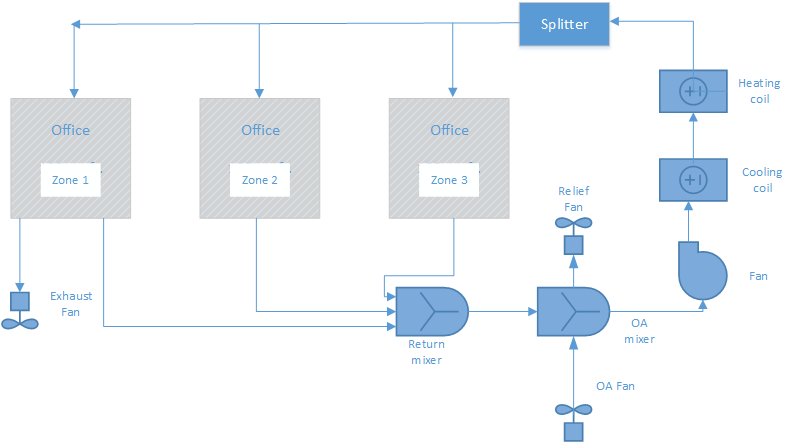

Pressure Control Through PressureStat
================

**Lixing Gu** 

**Florida Solar Energy Center**

**First draft**

 - 12/23/15
 - None
 

## Justification for New Feature ##

The Airflow Network model currently implemented in EnergyPlus is used to accurately predict simulation conditions based on a pressure-network. This capability allows users to carefully define the pressure components in their building, and use this to resolve flow rates and infiltration rates.

One piece missing from the Airflow Network capabilities is the ability to control to a pressure setpoint within a space. The pressure control is able to let designers to control unintentional airflows through the building envelope and between spaces inside a building to prevent a number of adverse impacts of these airflows. In addition, pressure control is required for some special spaces, such as operation room and chemical lab. The new feature proposal adds this specific capability to the existing Airflow Network model in EnergyPlus.


## E-mail and  Conference Call Conclusions ##

None

## Overview ##

The pressure control could be achieved by changing exhaust fan flow rate, when an AirLoop has two required components: an outdoor air mixer and an exhaust fan in a controlled zone. Figure 1 shows schematic of an AirLoop with required components. The proposed pressure control will be accomplished in the AirLoop. 

The outdoor flow rate is specified by the Controller:OutdoorAir object in the AirLoop. The proposed change is to vary exhaust fan flow rate between zero and maximum flow rates to achieve pressure control. The maximum flow rate of an exhaust fan is specified in the Fan:ZoneExhaust object.  




Figure 1.  Simplified Schematic of an Airloop with an OA mixer and an exhaust fan in a zone


## Approach ##

The proposed approach requires a new object to provide pressure setpoint, and enhances outdoor air handling and exhaust fan handling in the AirflowNetwork model.

###A new object

A new object of ZoneControl:PressureStat will be proposed to allow a user to input pressure setpoint and a controlling component with adjustable airflow rate to meet the setpoint. The proposed component is the Fan:ZoneExhaust object only (for the time being).

Since the Fan:ZoneExhaust has the maximum flow rate field, there is no need to revise the existing object.

### Outdoor air handling

There are two ways to treat an OA mixer in the existing AirflowNetwork model. The first way is that there is no link between an outdoor air node and an OA mixer, so that returning airflow rate is equal to the one at OA mixer outlet node. This is the same way to treat airflow rate for an OA mixer without using the AirflowNetwork model. The mixer outlet node conditions are calculated using the current code in MixedAir module. The advantage is that no mass flow rate adjustment is needed and the mixer outlet calculation results are applied to the mixer outlet. The disadvantage is the return flow rate is not treated in reality.   

The second way is to add a link between the outdoor air node and the OA mixer. However, the outdoor air flow rate is calculated based on linkage resistance and pressure difference across the link. In other words, the OA flow rate is not controlled precisely compared to the OA controller specification, and varies with time, since outdoor pressure changes with time.

The proposed approach is to have a link between the outdoor air node and the OA mixer and an associated flow component, assumed to be a constant fan internally, so that the flow rate can be the same as specification provided by the Controller:OutdoorAir object. This can be achieved by an internal fan component triggered by a new choice of OAMixerStreamNodeWithFlowRate in the AirflowNetwork:Distribution:Node object. The return flow rate at the entrance of the OA mixer is equal to the flow rate difference between the outlet node and OA inlet node. 

### Exhaust fan handling

Since the new feature requires to vary exhaust fan flow rate to achieve the pressure control, following procedures will be performed:

1. The AirflowNetwork model will run twice with zero and maximum flow rates for the controlled zone exhaust fan. The controlled zone pressures are the return values.

	In general, the zero exhaust flow rate will generate the maximum zone pressure, while the maximum exhaust flow rate will produce the minimum zone pressure. 

2. If the setpoint pressure is between the maximum zone pressure caused by zero exhaust fan flow rate and the minimum zone pressure caused by maximum exhaust fan flow rate, The AirflowNetwork model will use Regula Falsi to find a solution with calculated zone exhaust fan flow rate. Otherwise, the pressure setpoint will not be met. 

3. If both maximum and minimum pressures are higher than the setpoint, the maximum exhaust flow rate will be forced. 

4. If both maximum and minimum pressures are lower than the setpoint, the zero exhaust flow rate will be forced.
 

## Testing/Validation/Data Sources ##

The simulation results will be compared to spread sheet results.

## Input Output Reference Documentation ##

This section describes inputs of a new object as ZoneControl:Pressurestat and a modified object as AirflowNetwork:Distribution:Node. The revision of AirflowNetwork:Distribution:Node is to add a choice in the Component Object Type or Node Type field. 

### ZoneControl:Pressurestat

The ZoneControl:Pressurestat object is used to control a zone to a specified indoor level of pressure using the AirflowNetwork model. The specified pressure setpoint is used to calculate the required zone exhaust fan flow rate.

The object has the same performance as ZoneControl:Thermostat. When an AirLoop serves multiple zones, the controlled zone will reach the specific setpoint, while other zones will not be controlled precisely.

#### Field: Name

Unique identifying name for the ZoneControl:Pressurestat.

#### Field: Controlled Zone Name

Name of the zone that is being controlled.

#### Field: Control Object type

This field specifies the control type to be used for pressure control. Available control type is:
Fan:ZoneExhaust.

#### Field: Control Name

The corresponding control type name. 

#### Field:Pressure Control Availability Schedule Name

This field contains the name of a schedule that determines whether or not the ZoneControl:Pressurestat is available. When the schedule value is zero, the ZoneControl:Pressurestat is bypassed (not available to operate). When the schedule value is greater than zero, the ZoneControl:Pressurestat is available and will be used to calculate the required zone exhaust fan airflow rate to reach the pressure setpoint. If this field is left blank, the schedule has a value of 1 for all time periods. Schedule values must be between 0 and 1.

#### Field:Pressure Setpoint Schedule Name

This field contains the name of a schedule that contains the zone air pressure setpoint as a function of time. The units for pressure setpoint are Pascal. The setpoint values in the schedule must be between -50 and 100 Pascal. 

An IDF example is provided below:

```idf
   ZoneControl:Pressurestat,
       Pressure Controller1,           !- Name
       EAST ZONE,                      !- Controlled Zone Name
	   Fan:ZoneExhaust,                !- Control Object type
	   East Zone Exhaust Fan,          !- Control Name
       PressureAvailSchedule,          !- Pressure Control Availability Schedule Name
       PressureSetpointSchedule;       !- Pressure Setpoint Schedule Name
```

### AirflowNetwork:Distribution:Node

The AirflowNetwork:Distribution:Node object is used to represent air distribution system nodes for the AirflowNetwork model. The EnergyPlus nodes defined in an AirLoopHVAC are a subset of the nodes used to simulate the distribution system using the AirflowNetwork model. For example, the inlet node of a fan and the outlet node of a coil defined in an AirLoopHVAC must be defined as nodes using the AirflowNetwork:Distribution:Node object. A set of EnergyPlus Zone Equipment nodes is also a subset of the AirflowNetwork:Distribution:Nodes. For example, zone inlet and outlet nodes must be defined as nodes using the AirflowNetwork:Distribution: Node object. In addition, although mixers and splitters are defined as objects with inlet and outlet nodes within EnergyPlus, the AirflowNetwork:Distribution:Node object treats mixers and splitters as single nodes. The node objects are referenced by AirflowNetwork:Distribution:Linkage objects.

In summary, all nodes used to define an AirLoopHVAC (except splitters, mixers, and outdoor air systems which are treated as single nodes) and its connections to a thermal zone must be specified as AirflowNetwork:Distribution:Nodes. If distribution system air leaks are to be modeled, additional AirflowNetwork:Distribution:Nodes may be defined along with AirflowNetwork:Distribution:Components (e.g., leak or leak ratio) to define the air leakage characteristics.

Note: Supply and return leaks are not allowed in an AirLoopHVAC. They can only be modeled in the Zone Equipment Loop (i.e., return leaks may be modeled between the zone return node and the zone mixer inlet or the zone mixer outlet and the zone equipment loop outlet; and supply leaks may be modeled between the zone equipment loop inlet and the AirLoopHVAC:ZoneSplitter inlet node or the AirLoopHVAC:ZoneSplitter outlet node and the zone supply node).

#### Field: Name

The name of an air distribution system node. This node name is referenced by an AirflowNetwork:Distribution:Linkage and in the output listing. Each node should have a unique name within the AirflowNetwork:Distribution:Node objects (however, the node name may be used elsewhere as regular EnergyPlus node names such as the fan inlet node or coil outlet node).

#### Field:Component Name or Node Name

Designates node names defined in another EnergyPlus object, so that the AirflowNetwork:Distribution:Node object is able to get input parameters and node conditions from the associated EnergyPlus node or object. The actual node name is entered here and represents a node already defined in an AirLoopHVAC or zone equipment loop. This field is left blank if the EnergyPlus Node Type field below is entered as Mixer, Splitter, Outdoor air System, or Other.

#### Field: Component Object Type or Node Type

This choice field distinguishes the node type for the EnergyPlus node or object name defined above. Five node types are available:

- **AirLoopHVAC:ZoneMixer**: Represents an AirLoopHVAC:ZoneMixer object defined in EnergyPlus

- **AirLoopHVAC:ZoneSplitter**: Represents an AirLoopHVAC:ZoneSplitter object defined in EnergyPlus

- **AirLoopHVAC:OutdoorAirSystem**: Represents an AirLoopHVAC:OutdoorAirSystem object used in EnergyPlus

- **OAMixerOutdoorAirStreamNode**: Represents an external node name specified as an Outdoor Air Stream Node Name in the OutdoorAir:Mixer object when the AirLoopHVAC:OutdoorAirSystem object is used.

- **OAMixerStreamNodeWithFlowRate**:Represents an external node used in the OutdoorAir:Mixer with specified flow rate. This choice allows the outdoor air flow rate is the same rate specified by the Controller:OutdoorAir object.

- **OutdoorAir:NodeList**: Represents an external node name defined in the OutdoorAir:NodeList object when the AirLoopHVAC:OutdoorAirSystem object and an exhaust energy recovery system (air-to-air heat exchanger) are used.

- **OutdoorAir**: Represents an external node name defined in the OutdoorAir:Node object when the AirLoopHVAC:OutdoorAirSystem and an exhaust energy recovery system (air-to-air heat exchanger) are used.

- **Other**: Represents a type not already defined above.

Note: Both the OutdoorAir:NodeList and OutdoorAir:Node node types represent a node to outdoor air conditions. Either one of these node types can be used to represent an external node when an air-to-air heat exchanger is used to recover energy from the exhaust air stream as part of an AirLoopHVAC:OutdoorAirSystem object. Node type OAMixerOutdoorAirStreamNode does not represent an external node when an OutdoorAir:NodeList or OutdoorAir:Node object is specified. If no exhaust heat recovery system (i.e., air-to-air heat exchanger) is specified in the AirLoopHVAC:OutdoorAirSystem, the node type OAMixerOutdoorAirStreamNode represents an external node.

#### Field: Node Height

Designates the reference height in meters used to calculate relative pressure. The default value is 0 meters.

IDF examples are provided below:

```idf
AirflowNetwork:Distribution:Node,
    EquipmentInletNode,      !- Name
    Zone Equipment Inlet Node,  !- Component Name or Node Name
    Other,                   !- Component Object Type or Node Type
    3.0;                     !- Node Height {m}


AirflowNetwork:Distribution:Node,
    SupplyMainNode,          !- Name
    ,                        !- Component Name or Node Name
    Other,                   !- Component Object Type or Node Type
    3.0;                     !- Node Height {m}


AirflowNetwork:Distribution:Node,
    MainSplitterNode,        !- Name
    ,                        !- Component Name or Node Name
    AirLoopHVAC:ZoneSplitter,  !- Component Object Type or Node Type
    3.0;                     !- Node Height {m}


AirflowNetwork:Distribution:Node,
    MainSplitterNode,        !- Name of Node
    ,                        !- Name of Associated EnergyPlus Node or Object
    AirLoopHVAC:ZoneSplitter,  !- EnergyPlus Object or Node Type
    3.0;                     !- Node Height {m}
```

## Input Description ##

This section presents a new object of ZoneControl:Pressurestat and a revised object of AirflowNetwork:Distribution:Node by adding a new choice of OAMixerStreamNodeWithFlowRate in the "Component Object Type or Node Type" field.  

### New objects

I think an alternative name of ZoneControl:Pressurestat is ZoneControl:PressureController. The team may decide which one is better.

ZoneControl:Pressurestat

	ZoneControl:Pressurestat,
   		\memo Define the Pressurestat settings for a zone or list of zones.
   		\memo If you use a ZoneList in the Zone or ZoneList name field then this definition applies
   		\memo to all the zones in the ZoneList.
  	A1 , \field Name
       \required-field
       \reference ZoneControlPressurestatNames
 	A2 , \field Zone Name
       \required-field
       \type object-list
       \object-list ZoneAndZoneListNames
  	A3 , \field Control Object Type
       \required-field
       \type choice
       \key Fan:ZoneExhaust
	   \note The current selection is Fan:ZoneExhaust only.
  	A4 , \field Control Name
       \note Control names are names of individual control objects 
       \required-field
       \type object-list
       \object-list ControlTypeNames
  	A5 , \field Pressure Control Availability Schedule Name
       \note Availability schedule name for pressure controller. Schedule value > 0 means the 
	   \note pressure controller is enabled. If this field is blank, then pressure controller is \note always enabled.
       \type object-list
       \object-list ScheduleNames
  	A6 ; \field Pressure Setpoint Schedule Name
      \type object-list
      \object-list ScheduleNames


### Existing objects ###

Revisions to the IDD are noted as **<span style="color:red;">bold red</span>** non-blocked insertions at the appropriate location throughout the input data dictionary description. 

	AirflowNetwork:Distribution:Node,
      \min-fields 4
      \memo This object represents an air distribution node in the AirflowNetwork model.
 	A1 , \field Name
      \required-field
      \type alpha
      \reference AirflowNetworkNodeAndZoneNames
      \note Enter a unique name for this object.
 	A2 , \field Component Name or Node Name
      \type alpha
      \note Designates node names defined in another object. The node name may occur in air branches.
      \note Enter a node name to represent a node already defined in an air loop.
      \note Leave this field blank if the Node or Object Type field below is entered as
      \note AirLoopHVAC:ZoneMixer, AirLoopHVAC:ZoneSplitter, AirLoopHVAC:OutdoorAirSystem, or Other.
 	A3 , \field Component Object Type or Node Type
      \type choice
      \key AirLoopHVAC:ZoneMixer
      \key AirLoopHVAC:ZoneSplitter
      \key AirLoopHVAC:OutdoorAirSystem
      \key OAMixerOutdoorAirStreamNode
**<span style="color:red;">      \key OAMixerStreamNodeWithFlowRate </span>**

      \key OutdoorAir:NodeList
      \key OutdoorAir:Node
      \key Other
      \default Other
      \note Designates Node type for the Node or Component Name defined in the field above.
      \note AirLoopHVAC:ZoneMixer -- Represents a AirLoopHVAC:ZoneMixer object.
      \note AirLoopHVAC:ZoneSplitter -- Represents a AirLoopHVAC:ZoneSplitter object.
      \note AirLoopHVAC:OutdoorAirSystem -- Represents an AirLoopHVAC:OutdoorAirSystem object.
      \note OAMixerOutdoorAirStreamNode -- Represents an external node used in the OutdoorAir:Mixer
**<span style="color:red;">      \note OAMixerStreamNodeWithFlowRate -- Represents an external node used in the OutdoorAir:Mixer with specified flow rate</span>**

      \note OutdoorAir:NodeList -- Represents an external node when a heat exchanger is used before
      \note the OutdoorAir:Mixer
      \note OutdoorAir:Node -- Represents an external node when a heat exchanger is used before
      \note the OutdoorAir:Mixer
      \note Other -- none of the above, the Node name already defined in the previous field is part
      \note of an air loop.
 	N1 ; \field Node Height
      \type real
      \units m
      \default 0.0
      \note Enter the reference height used to calculate the relative pressure.

## Outputs Description ##

This section presents outputs from a new object of ZoneControl:Pressurestat.

### ZoneControl:Pressurestat Outputs

The following output variables are available when the ZoneControl:ContaminantController object is specified.

* HVAC,Average,Zone Air Pressure Setpoint [Pa]

* HVAC,Average,Zone Air Pressure Control Mass Flow Rate [kg/s]

####HVAC,Average,Zone Air Pressure Setpoint [Pa]

This is the current zone pressure setpoint in Pascal. If the pressure control is not available determined by the availability schedule value, then the value will be 0. This value is set at each zone timestep. Using the averaged value for longer reporting frequencies (hourly, for example) may not be meaningful in some applications.

####HVAC,Average,Zone Air Pressure Control Mass Flow Rate [kg/s]

This is the mass flow rate used to achieve the pressure control in kg/s. If the pressure control is not available, then the value will be 0. This value is set at each zone timestep. Using the averaged value for longer reporting frequencies (hourly, for example) may not be meaningful in some applications.

## Engineering Reference ##

A new section of Pressure Control will be added under the AirflowNetwork model.
 
###AirflowNetwork Model
...
####Pressure Control

The pressure control is achieved by varying zone exhaust fan flow rate. It requires an AirLoop with an OA mixer and an exhaust fan in a controlled zone. The calculation logic is provide below:


1. The AirflowNetwork model will run twice with zero and maximum flow rates for the controlled zone exhaust fan. The controlled zone pressures are the return values.

	In general, the zero exhaust flow rate will generate the maximum zone pressure, while the maximum exhaust flow rate will produce the minimum zone pressure. 

2. If the setpoint pressure is between the maximum zone pressure caused by zero exhaust fan flow rate and the minimum zone pressure caused by maximum exhaust fan flow rate, The AirflowNetwork model will use Regula Falsi to find a solution with calculated zone exhaust fan flow rate. Otherwise, the pressure setpoint will not be met. 

3. If both maximum and minimum pressures are higher than the setpoint, the maximum exhaust flow rate will be forced. 

4. If both maximum and minimum pressures are lower than the setpoint, the zero exhaust flow rate will be forced.
  
## Example File and Transition Changes ##

A new example file will be created to demonstrate pressure control.


## References ##

insert text


