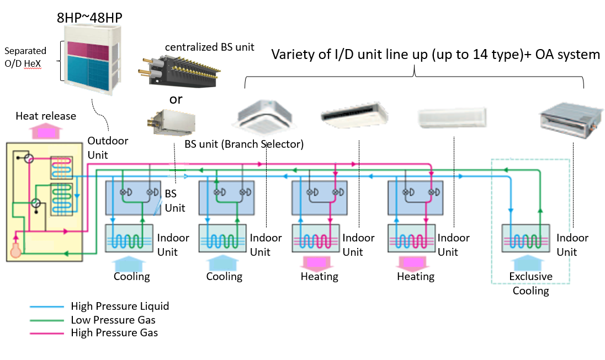
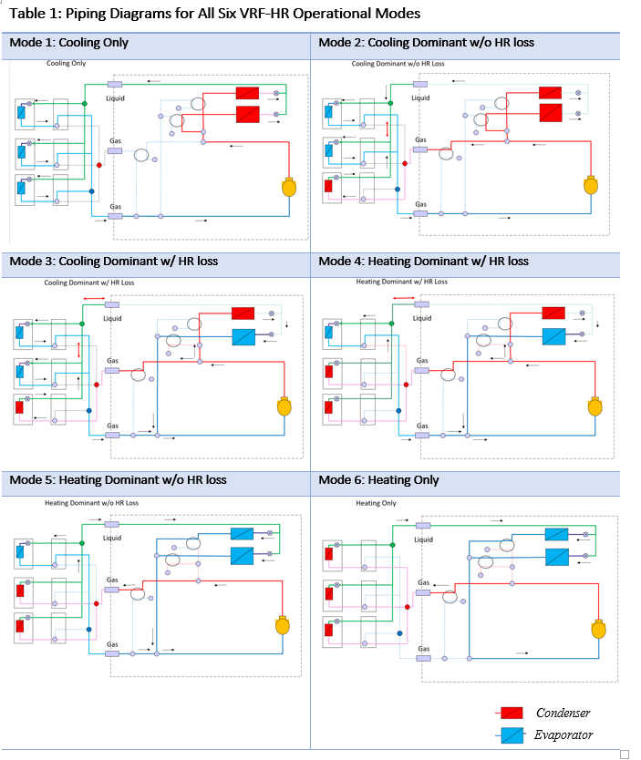
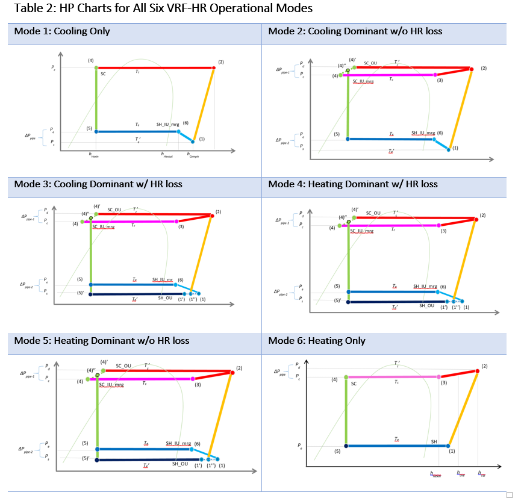
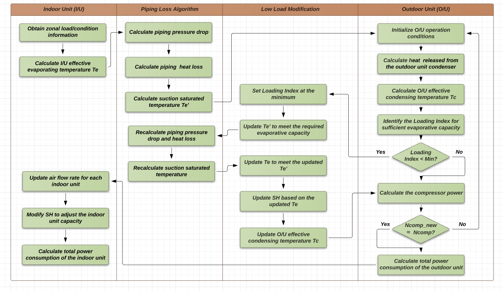

A New VRF Heat Recovery System Model
================

 **Rongpeng Zhang, Tianzhen Hong.**
 **Lawrence Berkeley National Laboratory**

 - Original Date: 01/16/2016
 - Revision Date: NA
 

## Justification for New Feature ##

The proposed new feature introduces a new model to simulate the energy performance of Variable Refrigerant Flow (VRF) systems in the heat recovery (HR) operation mode, which is capable to achieve heat recovery from cooling zones to heating zones and provide cooling and heating simultaneously. This feature is a continuation of the new VRF heat pump (HP) system model implemented in EnergyPlus V8.4.

Compared with the VRF-HP, the VRF-HR system is more complicated in terms of system configuration and operational controls. To enable simultaneous cooling and heating, complex refrigerant management loop is implemented and one more heat exchanger is added to the outdoor unit (OU). The two outdoor heat exchangers can work at different combination of evaporator/condenser mode to handle diverse and changing indoor heating/cooling load requirements. This leads to different refrigerant flow directions and control logics for different operational modes, and therefore specific algorithm is needed for every major operational mode.

The proposed new VRF-HR model inherits many key features of the newly implemented VRF-HP model. Compared with the existing system curve based VRF-HR model, the new model is more physics-based by simulating the refrigerant loop performance. It is able to consider the dynamics of more operational parameters, which is essential for the representation of the complex control logics (e.g., the adjustment of superheating degrees during low load operations). Furthermore, the proposed model implements component-level curves rather than the system-level curves, and thus requires much fewer curves as model inputs. These features considerably extend the modeling capabilities of the new VRF-HR model, including:

-	Allowing more accurate estimations of HR loss, a critical parameter in the VRF-HR operations, based on the dynamic refrigerant loop conditions.
-	Allowing variable evaporating and condensing temperatures in the indoor and outdoor units under various operational conditions.
-	Allowing variable fan speed based on the temperature and zone load in the indoor units (IU).
-	Allowing further modifications of operational parameters (e.g., evaporating temperature and superheating degrees) during low load conditions.
-	Allowing an enhanced physics-based model to calculate piping loss in the refrigerant piping network (varies with refrigerant flow rate, operational conditions, pipe length, and pipe and insulation materials) instead of a constant correction factor. 
-	Allowing the potential simulation of demand response of VRF systems by directly slowing down the speed of compressors in the outdoor units with invertor technology.

## E-mail and  Conference Call Conclusions ##

N/A

## Overview ##

The VRF-HR system has more complicated configurations than the VRF-HP system. Figure 1 shows the schematic chart of a 3-pipe VRF-HR system, a dominant system configuration in the VRF-HR market. As can be seen in the figure, there are two heat exchangers in the outdoor unit. They can work at different evaporator/condenser combination to generate various operational modes. Also note that there are a number of Four-Way Directional Valves (FWV) and Branch Selector (BS) Units in the system, which are used to create specific refrigerant piping connections for different operational mode. These features allow the system to provide simultaneous heating/cooling to address diverse space conditioning situations.

Figure 1. Schematic chart of a 3-pipe VRF-HR system

## Approach ##

Depending on the indoor cooling/heating requirements, the operations of the VRF-HR system can be divided into six modes:
-	Mode 1: Cooling load only. No heating load. Both OU heat exchangers perform as condensers.
-	Mode 2: Simultaneous heating and cooling. The sum of cooling loads and compressor heat is much larger than the heating loads. Both OU heat exchangers perform as condensers.
-	Mode 3: Simultaneous heating and cooling. The sum of cooling loads and compressor heat is slightly larger than the heating loads. One OU heat exchanger perform as condenser while the other performs as evaporator.
-	Mode 4: Simultaneous heating and cooling. The sum of cooling loads and compressor heat is slightly smaller than the heating loads. One OU heat exchanger perform as condenser while the other performs as evaporator.
-	Mode 5: Simultaneous heating and cooling. The sum of cooling loads and compressor heat is much smaller than the heating loads. Both OU heat exchangers perform as evaporators.
-	Mode 6: Heating load only. No cooling load. Both OU heat exchangers perform as evaporators.

The heat balance diagram for all the six operational modes are shown Figure 2.

Figure 2. Heat Balance Diagram for All Six VRF-HR Operational Modes

With the help of FWV and BS units, every operational mode has its own refrigerant piping connections for different refrigerant flow directions, as shown in Table 1. This leads to different refrigerant operations (HP charts shown in Table 2) and piping loss situations. The operational control logics for various modes are also different. Therefore, we need to design particular algorithm for every operational mode.

The holistic logic of the new VRF-HR algorithm (using Mode 1 as an example) is shown in Figure 3. Note that a number of calculation steps are coupled together, for instance, the piping loss calculation and the system performance calculation. More specifically, the piping loss changes the operating conditions of the compressor, which may lead to a different loading index and thus affects the amount of piping loss. This makes it difficult to obtain an analytical solution for a number of operational parameters (e.g., enthalpy of refrigerant entering the indoor unit), and therefore numerical iterations are employed to address this problem. The iteration design may be different in different operational modes.

More detailed description on the algorithm will be provided in DD.

Figure 3. Schematic chart of the new VRF-HR algorithm in Mode 1

## Testing/Validation/Data Sources ##

The model is validated with Daikin lab measurement data. More details will be provided in DD. 

## Input Output Reference Documentation ##

To be developed in DD.

## Input Description ##

To be developed in DD.

## Outputs Description ##

To be developed in DD.

## Engineering Reference ##

To be developed.

## Example File and Transition Changes ##

To be developed.

## References ##

Tianzhen Hong, Kaiyu Sun, Rongpeng Zhang, Oren Schetrit. Modeling, Field Test and Simulation of Energy Performance of Daikin VRF-S Systems in California Houses. LBNL Report, March 2015.

Handbook of Compact Heat Exchangers. Yu Sesimo, Masao Fujii. Tokyo, Japan, 1992.

