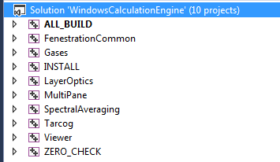
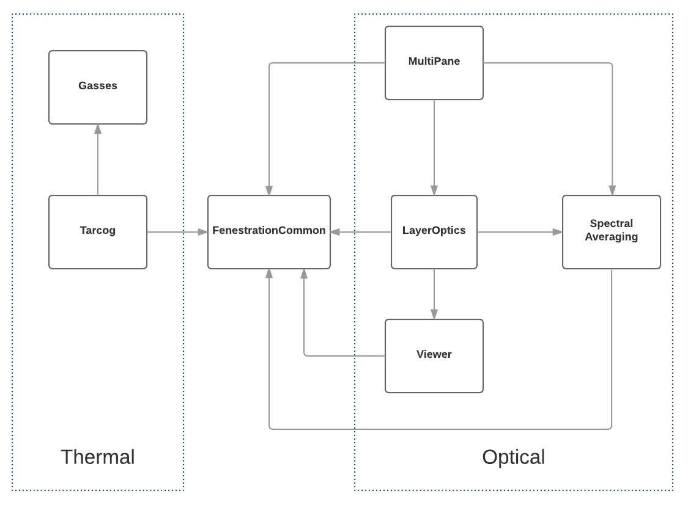
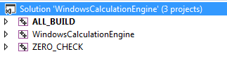

# Windows Calculation Engine Module

 **Simon Vidanovic, Charlie Curcija**

 **Lawrence Berkeley National Laboratory**
 
 - Original Date: April 15, 2016
 
## Justification for New Feature
There are three different calculation modules for the detailed calculation of thermal, solar and daylighting properties for fenestration systems:

<ol type="a">
	<li> Original window module implementation (referred as "Winkelmann" in this document)
	<li> Tarcog/BSDF
	<li> ASHWAT
</ol>

#Introduction

Calculation modules a) Winkelmann and b) Tarcog/BSDF use the same calculation standard (ISO 15099) and for specular systems, they produce very similar results (for surface temperatures and heat flows).
The Winkelmann calculation modules include optical calculations for both specular and lambertian, grey body diffuse reflectance of venetian blind slats and woven shade threads.
The Tarcog/BSDF calculation module, on the other hand, lacks optical calculations in EnergyPlus and relies on calculations in the WINDOW program and export of BSDF results to EnergyPlus for those calculations.
The calculation of lambertian, grey body diffuse venetian blind slats and woven shades produce somewhat different results in WINDOW, which is due to the more accurate implementation of the diffuse model.
The use of seemingly identical, but actually different calculation engines in EnergyPlus for the purpose of achieving the same results is confusing and does not provide for a sustainable long-term solution.
While the WINDOW optical engines are constantly enhanced and debugged, the Winkelmann calculation module in EnergyPlus has remained in the code without any maintenance for years now.
We know that some results are different and we know that WINDOW produces correct results, but no one has the time or funding to look at what the problem with the Winkelmann code is.
Additional problems in EnergyPlus can occur if a modeler uses different window modules in the same building model. In this case, some of calculations might be inaccurate due to the use of conflicting modeling methodologies.
This is true for solar and daylighting calculations where incoming solar radiation/daylight from one window is calculated and distributed differently in two models (split flux vs BSDF distribution).
The implementations of ASHWAT engine has contributed to further confusion, where yet another "similar but now quite the same" window calculation module has been implemented in EnergyPlus.
Window calculation engine (WCE) will consolidate all three models into one and this will be done through different stages.
This NFP is proposal of way of linking and integrating WCE into EnergyPlus.
In this stage of WCE consolidation (re-factoring) will include ISO 15099 thermal and optical routines. Later, WCE will include ASHWAT and EN standards as well (at this moment, they are lower priority).

## E-mail and Conference Call Conclusions
## E-mail communications
### Email 1
####Mike Witte comments and questions (May/31/2016)
<ol>
	<li> Several places in the NFP mention re-factoring.  Are you proposing that existing code be refactored with the dual method?  I may not be following the big picture here, but it seems better to leave the existing code as-is and write completely new code to drive the WCE method.
	<li> There may be some pushback about removing the ASHWAT (*:EquivalentLayer) method.  Can WCE model every combination of layers that are possible with ASHWAT?  A few more sentences to justify this would be  helpeful.
	<li> Regarding the current limitation of 10 layers in the Construction object, I don't know of any reason why this couldn't be made extensible with no limit on number of layers.  The current code already limits window constructions to 8 layers, so this check could remain in place when the existing window method is selected.
	<li> What is the proposed timetable?
</ol>

####Simon reply (May/31/2016)

<ol>
	<li> Big picture here is to move windows code into separate component, outside of core EnergyPlus code. Idea is that in first few stages we keep dual code so that user(s) can use both. After old code has been totally replaced we can consider removing it. That is why I want to put swich in IDF that will separate these modules.
	<li> No, I will not remove ASHWAT. It will be part of WCE. However, it is lower in priority list.
	<li> My comment was regarding to Construction object in IDD (IDF). Construction object in IDD is limited to 10 layers and if user wants to use more then IDD needs to be changed. As for the code, it can handle unlimited number of layers.
	<li> Timetable is that first three items (heat transfer - ISO15099, spectral averaging and optical properties of layers and IGU) will be done till August, 15th (when EnergyPlus is locked for October release) and if time allows I will try to put optical properties of shading devices.
</ol>

####Mike's reply (May/31/2016)

1. Big picture here is to move windows code into separate component, outside of core EnergyPlus code. Idea is that in first few stages we keep dual code so that user(s) can use both. After old code has been totally replaced we can consider removing it. That is why I want to put swich in IDF that will separate these modules.

Reply: The question is where inside EnergyPlus the duality happens - at a high level or at lower levels.  We can discuss in more detail on the review call (count me in).

2. No, I will not remove ASHWAT. It will be part of WCE. However, it is lower in priority list.

Reply: Please clarify that in the NFP.

3. My comment was regarding to Construction object in IDD (IDF). Construction object in IDD is limited to 10 layers and if user wants to use more then IDD needs to be changed. As for the code, it can handle unlimited number of layers.
</ol>

Reply: Just changing the IDD is not enough.  There has to be a least a change to  this line, and this can't simply be unlimited, without some major refactoring.  We could choose a value that we deem large enough initially, but at some point we need to add code to determine the max number of layers early and set this value before it gets used to allocate various arrays, or do some refactoring to be more flexible.

DataHeatBalance.cc
int const MaxLayersInConstruct( 11 ); // Maximum number of layers allowed in a single construction


####Tianzhen comments (May/31/2016)

I suggest a change to your IDD object:

New - 
```
WindowsCalculationEngine,
      \memo This object is used to switch algorithms between built in windows engine 
      \memo and windows engine as exterior component
  A1; \field Windows engine
      \type choice
      \key BuiltInWindowsModel
      \key ExternalWindowsModel
      \default BuiltInWindowsModel
```

Currently proposed - 
```
WindowsCalculationEngine,
      \memo This object is used to switch algorithms between built in windows engine 
      \memo and windows engine as exterior component
  A1; \field Windows engine
      \type choice
      \key BuiltInWindowsModel
```

####Simon's reply (May/31/2016)

only problem with this is that you will have to insert WindowsCalculationEngine object in every file. My idea was to insert object only when you want to use specific engine, otherwise it is default. Also, I did want to use external engine (WCE) as default and you have changed default to be current EnergyPlus windows code. Is that what you wanted?

####Mike's reply (May/31/2016)

There can be a default method without requiring the object to be present.  And I would lean towards making the current method the default initially.  Changing to WCE as the default should happen later.

####Simon's reply (May/31/2016)

Making it explicit is better. Here is what I see how it works: if there is no WindowsCalculationEngine object, use the built-in window code as currently in EnergyPlus; if there is the WindowsCalculationEngine object, use the user setting (if not specified default applies). 

Until we prove results between two approaches are close enough, we should keep existing built-in code as default for compatibility purpose.

####Neal's comment (May/31/2016)
I will also join the NFP review. I would also suggest that some members of the team attempt to interact with the WCE as a library to test it before integrating directly into EnergyPlus.

I would also like to see a more thorough description of the integration of ASHWAT. There are many capabilities in ASHWAT that are lacking in the other models. If I read this correctly, the goal of WCE is to incorporate the best features of all three models into a single model. I'd like to have a better idea which features are included and which are left out.

####Simon's reply (May/31/2016)
Thanks! I will update NFP regarding to ASHWAT. In short, it is not planned in first two stages and that is why I left it out. EnergyPlus actually have two window models, ASHWAT and ISO 15099 (I left out model that provides U-value, SHGC and VT). Original implementation that is done by Winkelmann is nothing else but old WINDOW code. As for BSDF models, that is also ISO 15099 but with improved optical calculation distribution (Klems BSDF). So in general I do plan to put all of that into WCE. In general, idea is to separate all calculations related to window properties in separate module (component) so that it can be used by others as well (WINDOW and OPTICS included). Depend on the time and funds in future.
As for WCE, it does have separate GitHub with unit tests hosted by LBNL. If you want something to implement there, unit tests are must to have. So before going into EnergyPlus, code will be tested separately.

###Conference call (June/9/2016)
Participants: Mike Witte, Daniel Macumber, Kyle Benne, Charlie Curcija, Simon Vidanovic

Comments and conclusions:

We have agreed to try new approach where WCE will be automatically downloaded from LBNLs GitHub.
It would have been nice to implement engine in a way so that it can be easily used from OpenStudio.
One possibility is to create separate library of routines within EnergyPlus itself and use it from there.

It would have been worth to remove number of layers limit from EnergyPlus while implementing this engine.

## Overview
WCE is currently hosted at LBNL's GitHub repository https://github.com/LBNL-ETA/Windows-CalcEngine as open source module that can calculate thermal and optical properties for fenestration systems. Engine exposes many so far "hidden" calculation procedures that now can be used and also customized/extended according to different user needs. Intention is that all future window and shading models are developed using this open source repository and then shared between different programs.

WCE has been built with support of makefiles with unit testing (using google test environment (gtest) which makes it compatible for use in EnergyPlus code).

### Content of Windows Calculation Engine (WCE)
Compilation of WCE will produce several libraries that include calculation routines for different models.



Main subdivision of window routines is between thermal and optical. Even so this is the main division, WCE library is divided into smaller modules that deal with certain set of algorithms.
<br><b>FenestrationCommon</b> library include common definitions and mathematical operations used along all WCE library components. It includes common structures such as matrix, series (for integration and interpolation), hemispherical 2D integrator, solver for system of linear equations, etc.
<br><b>Gases</b> is set of routines that calculates thermal properties of the gases and gas mixtures.
<br><b>Tarcog</b> is set of routines that calculates heat transfer through center of glass (applying different standards).
<br><b>LayerOptics</b> is set of routines that calculate optical properties for specular and shading layers. It also calculate BSDF properties for individual layers.
<br><b>MultiPane</b> routines calculate optical properties of multilayer windows. It handles multilayer BSDF matrices.
<br><b>SpectralAveraging</b> is set of routines that deal with spectral and angular material properties.
<br><b>Viewer</b> deals with two dimensional view factors and beam view factors that are used to calculate optical properties of venetian layers.



While the library is divided into these logical units and it can be compiled into separate libraries that can be separately linked, it is possible with simple selection in CMake file to produce single library.



This option will be used when compiling library as third party component for EnergyPlus.

## Integrating engine into EnergyPlus
Integration of WCE library into EnergyPlus will be performed in several smaller steps.

<ul>
  <li> Link to WCE library
  <li> Interface to WCE routines
  <ul>
    <li> Thermal routines (Gasses and Tarcog)
    <li> Spectral averaging
    <li> Single layer optical routines
    <li> Multilayer optical routines
  </ul>
</ul>

Changes to IDF in this stage will be minimal because we want to avoid additional complications during extraction of windows routines to WCE.

### Linking to WCE library
First step of implementation is to create link of WCE with EnergyPlus. One way of doing that can be accomplished by manually copying and merging source code from WCE into EnergyPlus third\_party directory and use it from there. This approach is possible, however, in practice it means that any future development and bug fixing is harder to apply back to EnergyPlus code.

Another approach is to link WCE library directly from GitHub. EnergyPlus would not contain WCE code directly, but through GitHub link as external project. 
This connection can simply be established in CMake files with following command:

```
ExternalProject_Add(
  Windows-CalcEngine
  GIT_REPOSITORY "https://github.com/LBNL-ETA/Windows-CalcEngine.git"
  GIT_TAG "EnergyPlus_Tag_12345"
  UPDATE_COMMAND ""
  PATCH_COMMAND ""
  SOURCE_DIR "${CMAKE_SOURCE_DIR}/3rdparty/Windows-CalcEngine"
  CMAKE_ARGS -DCMAKE_INSTALL_PREFIX=${GLOBAL_OUTPUT_PATH}/Windows-CalcEngine
  TEST_COMMAND ""
)
```

This CMake command specifies git repository and tag related to certain release (among other things). Tagging WCE library will ensure that current development of the library will not affect development of EnergyPlus. Once new version of WCE has been developed, tag number can be updated and all changes will be pulled up automatically on the next CMake build. This process can be very simple in case when engine contain only bug fixes and no interface changes. In case of any interface changes (which usually mean new features as well) interface in EnergyPlus itself would need to adopt as well.

This CMake operation can work in two different scenarios:

<ul>
  <li> During compilation
  <li> During CMake build
</ul>

<b>During compilation</b> means that program will check and download new version of the component during compilation time, while <b>During CMake build</b> would do same procedure only during building the project with CMake.
Second approach is a bit more appropriate because project compilation happens much more often than building project from CMake files. However, once external project has been updated (downloaded and compiled) it does not require a lot of time to recheck the files.

WCE library is already using google test as external project and it checks for google test folders during CMake build:

```
ExternalProject_Add(
  Windows-CalcEngine
  GIT_REPOSITORY "https://github.com/google/googletest.git"
  GIT_TAG "release-1.7.0"
  UPDATE_COMMAND ""
  PATCH_COMMAND ""
  SOURCE_DIR "${CMAKE_BINARY_DIR}/googletest-src"
  BINARY_DIR "${CMAKE_BINARY_DIR}/googletest-build"
  TEST_COMMAND ""
)
```

From this command it is clear what is the location of the project and what is the tag that it is using (release-1.7.0).

Advantage is that google test library code will not be shared together with WCE code. Since WCE and EnergyPlus both are using same test suite, including same code/components twice in different places would not work. CMake files in WCE are set not to download unit test suite in case WCE is used as third party component itself.

## Interface to WCE routines
Interface to WCE routines considers how object from IDF will be used and linked to WCE routines.
First stage of conversion would consider re-interfacing old routines to new one. This stage would assume no changes to current IDF objects and EnergyPlus will call routines from WCE instead of functions that are defined within existing EnergyPlus windows module.
Main purpose of this stage would be to "move" basic calculation routines from EnergyPlus into WCE. Note that "move" does not mean deletion of old routines, it just means that WCE will be new source of windows calculations, while still will be possible to use old ones.

First stage would include re-factoring of:

<ul>
  <li> heat transfer through glazing layers
  <li> spectral averaging and optical properties of layers
  <li> optical properties of IGU that contain only specular layers
</ul>

Second stage will include re-factoring of optical properties of IGU that contain shading layer.

By default, EnergyPlus will use newly integrated routines. However, it will be possible to call routines that are currently part of EnergyPlus windows module by inserting following IDF object:

<!-- SIMON: Not sure what would be the best word here. BuiltInWindowsModel does not sound good -->

```
WindowsCalculationEngine,
  BuiltInWindowsModel;
```

Some potential drawbacks with this approach would be limitation of current objects definitions. Some examples:
<ul>
  <li> Construction by default have only 10 layers which would limits window only to 5 layers. This limitation is embedded into IDD file and it will need to be changed manually by user(s).
  <li> Complex solar distribution (BSDF) for windows with shading layers will still be created outside of EnergyPlus (by using WINDOW software).
  <li> Use of different standards (ISO 15099, EN 673), calculation of deflection and vacuum will still be limited to Complex Fenestration.
</ul>

### Heat transfer through glazing layers
This part would include re-factoring routines that deal with heat transfer through solid and gas layers.
One of the major drawbacks in EnergyPlus related to window routines is limitation of number of layers that can be used in a window. Window heat transfer routines in EnergyPlus are limited to four layers.
In WCE that limit has been removed and number of layers can be set to any number (this of course depends on computer's memory).
In addition to this, heat transfer calculation will include updated version of gap airflow algorithm.

### Spectral averaging and optical properties of layers
WCE contain optical routines that are part of LBNL's OPTICS and WINDOW programs and are more detailed than one used in EnergyPlus.
Spectral averaging uses material spectral, solar radiation and photopic data.
Default values for solar radiation and photopic response data are currently hard-coded into EnergyPlus. It is possible to dynamically load custom data for solar radiation and photopic response by using Site:SolarAndVisibleSpectrum and Site:SptectrumData.
This is also supported by WCE which will now be used as main source of calculations for spectral averaging.
Angular properties for specular layers calculations will be moved to WCE in this stage since it is simple and does not require any additional changes in the input data.
Optical properties of shading layer are calculated for three different cases:

<ul>
  <li> Direct-direct
  <li> Direct-diffuse
  <li> Diffuse-diffuse (sky and ground)
</ul>

WCE is currently supporting following types of shading devices: 

<ul>
  <li> Venetian Blind
  <li> Woven Shade
  <li> Perforated Screen
  <li> Perfectly Diffuse Shading Layer
</ul>

All shading devices in the list are supported by WCE and they will be moved into WCE.

### Optical properties of IGU that contain only specular layers
Multipane calculations of specular layers that deal with inter-reflections and absorptances will be moved to WCE in this stage.
This includes wavelength by wavelength calculation for different angles of incidence. It also includes spectral integration and averaging over desired spectral range.

### Optical properties of IGU that contain shading layer
Handling optical properties for IGU with shading layers is done in two different ways.
<ul>
  <li> Simplified approach
  <li> BSDF approach
</ul>

Selection between different optical properties methodology can be achieved by inserting new IDF object.

#### Simplified approach
Simplified approach is calculation of optical properties for IGU at single incident direction and relying on diffuse outgoing distribution.
There are several limitations in current EnergyPlus model that are removed in WCE:
<ul>
  <li> Only one shade/screen/blind is allowed.
  <li> An interior screen is not allowed.
  <li> A between-glass screen is not allowed.
  <li> A between-glass shade/blind is allowed only for double and triple glazing.
  <li> A between-glass shade/blind must have adjacent gas layers of the same type and width.
  <li> For triple glazing the between-glass shade/blind must be between the two inner glass layers.
</ul>

While optical calculation for single shading layer are relatively simple, optical calculations for IGU with shading layer are divided into different systems of equations that depend on shading layer type. That again leads to code repetition. 
While this model can be transferred to WCE it would be better to do general re-factoring of multilayer equations so that it uses single setup for system of equations for any type of shading device.

#### BSDF approach
Second approach is to use BSDF properties of shading layer. In this case user supplies (through IDF) program with BSDF matrices which then will be used in solar optical calculations. 
Creation of BSDF matrices is currently not supported inside the EnergyPlus. It would be nice addition to the program that would require some additional changes to IDF and it is not planned for this stage of integration. Once WCE interface is connected to the EnergyPlus, BSDF creation can be easily enabled with additional IDF object(s) that will simply instruct EnergyPlus whether to use simple or complex solar/optical distribution from a windows.
This distribution is now determined by type of objects that are used in IDF. When using construction object to define IGU, that distribution is simple, while using Construction:ComplexFenestrationState that distribution is BSDF. As for current stage of integration, WCE will take over hemispherical integration over sky and ground that will produce corresponding optical properties and then in the next stage it will implement creation of BSDF.

## Input Output Reference Documentation

## IDD Objects (New)
We propose to create a new IDD object named WindowsCalculationEngine that will be a switch between new and old engine.

```
WindowsCalculationEngine,
      \memo This object is used to switch algorithms between built in windows engine 
      \memo and windows engine as exterior component
  A1; \field Windows engine
      \type choice
      \key BuiltInWindowsModel
      \key ExternalWindowsModel
      \default BuiltInWindowsModel
```

## IDD Objects (Revised)

N/A

## Outputs Description

N/A

## Engineering Reference

Additional reference will be provided for simplified diffuse method.

## Example Files and Transition Changes

N/A

## References

N/A
