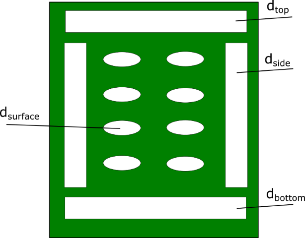
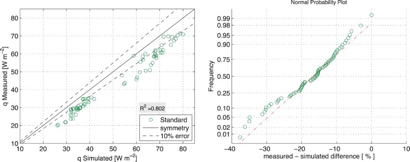
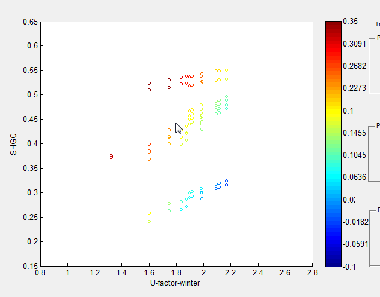

# Improvement to airflow algorithm to shading devices in BSDF window model

Simon Vidanovic, Charlie Curcija

Lawrence Berkeley National Laboratory

## Overview

In last couple of years LBNL has been working extensively on generating new procedure for window attachment ratings. In that process, WINDOW 7 and EnergyPlus calculation engines are used extensively to produce and analyze results. As outcome, couple of improvements are proposed and several bugs discovered:

- Edge to center of glass ratio is not taken into account when calculating for COG heat flow.
- Other shading device type is not considered for airflow calculations.
- Incorrect effective emissivity and surface temperature calculations when accounting for IR surface exchange.
- Shading gap airflow algorithm improvement.
- IR Transmittance throughout solid layer(s) incorrectly accounted for in heat balance equations.

## Justification for New Feature

The ISO 15099 ventilated window model determines surface convection coefficients based on the opening characteristics of layer adjacent to ventilated cavities. The model divides layer openings into four distinct categories: top, bottom, sides and surface (front) as shown in Figure 1.

*Figure 1. Illustration of ISO 15099 ventilated shade layer opening locations.*

The ISO 15099 model for ventilated cavities through perforated surfaces with connection to the indoor environment, such as solar screens, is shown to have poor accuracy in predicting heat flux as it is currently implemented in the EnergyPlus software program.

*Figure 2. Comparison of measured and simulated heat flux of shade system*

Correlation coefficients are proposed for the ISO 15099 algorithm that reduced the mean error between measured and simulated heat flux for typical solar screens from 16% to 3.5% and from 13% to 1% for horizontal blinds.

## E-mail and Conference Call Conclusions

## Approach

Current BSDF window model (tarcog) will be updated for proposed changes.

## Testing/Validation/Data Sources

Program will be tested against series of input files generated for AERC project. Test series will include representative subset of windows varied over shading device openness, IR transmittance and conductivity. Results will be compared for different IGU configurations. One example for such comparison is given in Figure 3.

*Figure 3. AERC Results*

Results need to show agreement between U-value, SHGC and energy use.

## Input Output Reference Documentation

No changes in Input/Output file.

## Engineering Reference

The correlations and their sources are defined in ISO 15099. Of specific interest for this work is the model presented for thermally driven ventilation. The model is based on introducing a modifier to the un-vented correlation to determine an adjusted average surface-to-air heat transfer coefficient for the cavity between-glass and shade layers. The modifying equations are physically based and incorporate several pressure drop principles for air through a channel including Bernoulli, Hagen–Poiseuille, and entrance/exit correlations.

The inlet and outlet pressure loss of a cavity open to the indoor room, $$ΔP_{z}$$, is calculated with following equations:

$$
ΔP_{z} = 0.5 \cdot \rho \cdot v^2(Z_{in} + Z_{out}) \\

Z_{in/out}=(\frac{A_{s}}{0.6 \cdot A_{eq,in/out}}-1) \\

A_{eq,in/out}=A_{top/bot}+\frac{1}{2} \frac{A_{bot/top}}{A_{bot}+A_{top}} (A_{l}+A_{r}+A_{h}) \\

A_{h}=d_{surface} \cdot W \cdot H \\

A_{s}=d_{gap} \cdot W
$$

where the use of in/out and top/bot are dependent on the direction of flow, as determined by the glass surface temperature relative to the indoor temperature.

To improve the simulation correlation, correlation coefficients are updated for five ventilated layer opening parameters defined in ISO 15099; $$A_{h}$$, $$A_{top}$$, $$A_{bot}$$, $$A_{l}$$ and $$A_{r}$$. Two types of correlations are derived: first set of correlations is derived for horizontal venetian blinds and second set of correlations is for group of shading devices (woven, perforated and homogeneous diffuse shade).

### Horizontal Venetian Blinds

Correlations for horizontal venetian blinds are:

$$
A_{h}=D_{1} \cdot [d_{surface} \cdot cos( \varphi)^{D_{2}}]^{D_{3}} \cdot A_{s} \\

d_{surface} = 1 - \frac{t}{cos(\varphi) \cdot (p-t)} \\

t^{*}=D_{4} \cdot \omega \cdot cos(\varphi) \\

k^{*} = d_{surface} \cdot k_{c} + (1-d_{surface}) \cdot k_{s} \\

d_{top}=0
$$

For outside mount:

$$
d_{left,right} = d_{gap} \\

d_{bottom}=d_{gap}
$$

For inside mount:

$$
d_{left,right} = 0 \\

d_{bottom} = 0
$$

Where:

$$
D_{1} = 0.016 \\

D_{2} = -0.63 \\

D_{3} = 0.53 \\

D_{4} = 0.043
$$

### Homogeneous Diffuse Shade, Perforated Screens and Woven Shade

Correlations for homogeneous diffuse shade, perforated screens and woven shade are:

$$
A_{h} =C_{1} \cdot (d_{surface})^{C_{2}} \cdot A_{s} \\

A_{l,r}^{*} = C_{3} \cdot A_{l,r} \\

A_{top, bot}^{*} = C_{4} \cdot A_{l,r} \\

k^{*} = d_{surface} \cdot k_{c}+(1-d_{surface}) \cdot k_{s}
$$

Where:

$$
C_{1} = 0.05 \\

C_{2} = 1.08 \\

C_{3} = 0.79 \\

C_{4} = 0.50
$$

## References

- Experimental validation and model development for thermal transmittances of porous window screens and horizontal louvred blind systems (http://www.tandfonline.com/doi/full/10.1080/19401493.2017.1323010)
- Validation of the Algorithms for Heat Transfer of Window Shading Systems with Perimeter Gaps
- Validation of the Algorithms for Thermal Transmittance of Windows with Cellular Shades
