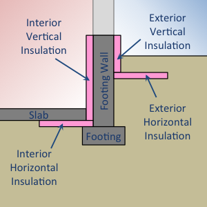
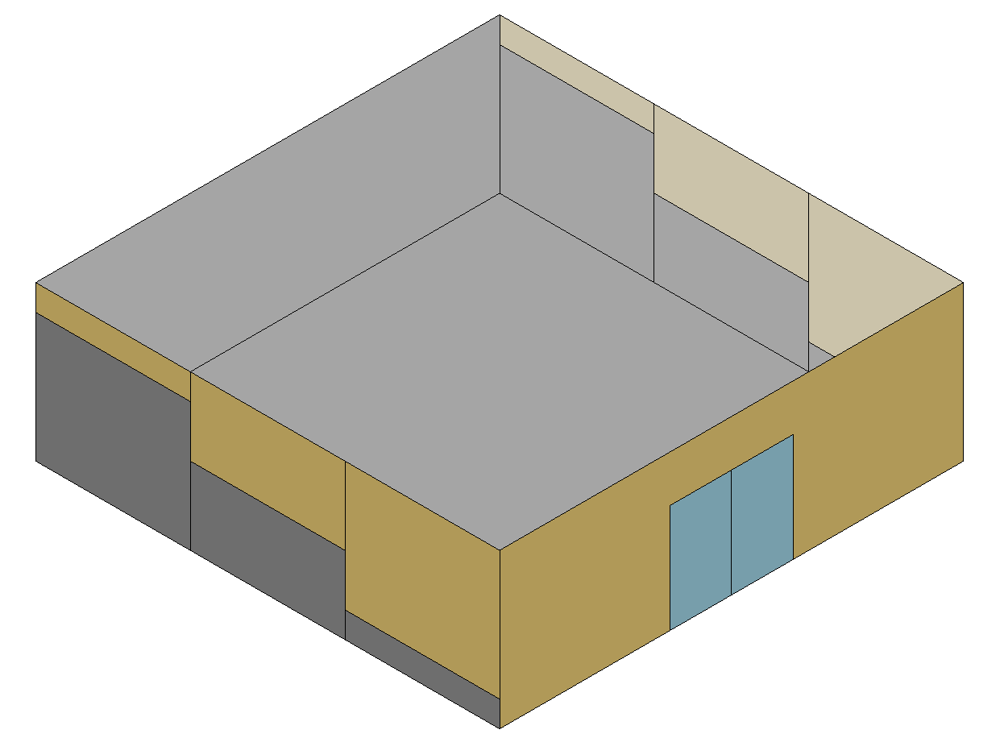
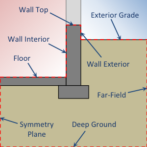
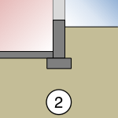

# Kiva(TM) integration for foundation heat transfer in EnergyPlus

## Justification for New Feature

Simulating the multi-dimensional heat flow around building foundations is a complicated problem that has been handled in many ways in EnergyPlus. Users are often confronted with choosing between fast or accurate methods. As a rule, the user experience for defining foundation surfaces should:

1. Require little-to-no additional effort than defining other surface boundary conditions.
2. Require little-to-no additional computation time than other conduction calculations (e.g. CTFs). Relatively speaking, it shouldn't be more than half the computation time for a six-surface, single-zone simulation.
3. Provide the capability to characterize common foundation design alternatives, namely interior and exterior, vertical and horizontal insulation placement, and whole-slab insulation.

Foundation heat transfer in EnergyPlus is currently characterized by defining one of four boundary conditions for below-grade surfaces:

- Ground
- OtherSideCoefficients (as a pre-processed schedule [this includes the expand objects versions of Ground Preprocessor boundary conditions]).
- OtherSideConditionsModel (referencing the SurfaceProperty:OtherSideConditionsModel, which references UndergroundPipingSystem [PipingSystem:\*] or GroundCoupledSurface [Site:GroundDomain\*] objects )
- GroundFCfactorMethod

Each of these methods suffers from one or more of the following issues, in that they are:

- inaccurate,
- slow,
- difficult to use, or
- lacking in capability.

Kiva is fast, accurate, and highly capable. Usability depends on how the input interface (i.e. the IDF objects) are designed. More intuitive input objects are also proposed here.

A comparison of Kiva to these other methods is shown below:

| Method:                                       | GroundTemperatures | GroundFCfactorMethod | GroundDomain | Kiva |
|-----------------------------------------------|:------------------:|:--------------------:|:------------:|:----:|
| Dimensions                                    |          1         |           1          |       3      |   2  |
| Computation Time (s)                          |     Negligible     |      Negligible      |     ~350     |  ~5  |
| Mesh Independent (within 3%)                  |         NA         |          NA          |      No      |  Yes |
| Pre-initialization                            |         NA         |          NA          |      No      |  Yes |
| Moisture Content                              |         NA         |          NA          |      Yes     |  No  |
| Single Domain (i.e., no artificial interface) |  No (preprocessed) |   No (preprocessed)  |      No      |  Yes |
| BESTESTed                                     |         No         |          No          |     Yes?     |  Yes |
| Thermal Bridging (around foundation wall)     |         No         |          No          |      No      |  Yes |
| Interior Horizontal                           |         No         |          No          |      Yes     |  Yes |
| Interior Vertical (a.k.a "Gap")               |         No         |          No          |      No      |  Yes |
| Exterior Horizontal                           |         No         |          No          |      No      |  Yes |
| Exterior Vertical                             |         No         |          No          |      Yes     |  Yes |
| Full Slab                                     |         Yes        |          No          |      Yes     |  Yes |

## Overview

Kiva is an open source C++ project developed by Big Ladder Software:

[http://bigladdersoftware.com/projects/kiva/](http://bigladdersoftware.com/projects/kiva/)

Kiva is the product of Neal Kruis's dissertation where he demonstrated that accurate foundation heat transfer calculations can be performed quickly (on the order of 5 seconds) without any noticeable loss of accuracy relative to a mesh-independent, fully three-dimensional simulation.

The computational core of Kiva can be compiled as an independent library and linked to the EnergyPlus executable.

## Modified Input Output Reference Documentation: Floor/Wall/BuildingSurface:Detailed

...

#### Field: Outside Boundary Condition

...

4\) **Outdoors** - ...

5\) **Foundation** - uses an alternative model (currently only the Kiva^TM^ model) to account for the multi-dimensional heat transfer of foundation surfaces. The Outside Boundary Condition Object will refer to the name of a Foundation:Kiva object (or be left blank to use the default foundation without extra insulation).

6\) **Ground** - The temperature on the outside of this surface will be the Site:GroundTemperature:Surface value for the month. For more information on ground contact surfaces, reference the Auxiliary Programs document section on "Ground Heat Transfer in EnergyPlus".
...

#### Field: Outside Boundary Condition Object

If neither Surface, Zone, Foundation, OtherSideCoefficients, or OtherSideConditionsModel are specified for the Outside Boundary Condition (previous field), then this field should be left blank.

...

\<Note on Zone\>

If the Outside Boundary Condition is "Foundation", then this field may either be left blank (to use the default foundation without extra insulation), or contain the name of a Foundation:Kiva object that defines a more detailed two-dimensional description of the foundation construction. Both options will simulate multi-dimensional heat transfer from the foundation surface.

Equally, if the Outside Boundary Condition is "OtherSideCoefficients", then...


## Input Output Reference Documentation: Foundation:Kiva

Foundation:Kiva objects describe boundary conditions for ground-coupled foundation surfaces. Surfaces with the "Outside Boundary Condition" defined as "Foundation", may also refer to a Foundation:Kiva object in the "Outside Boundary Condition Object" field (if unspecified, a default Foundation:Kiva object will be created and applied).

Limitations when using Foundation:Kiva objects include:

- Only floors and walls may use Foundation:Kiva objects as Outside Boundary Conditions.
- Exactly one floor surface must reference each Foundation:Kiva object. However, multiple floors may exist in the same thermal zone so long as they reference separate Foundation:Kiva objects.
- All foundation wall surfaces must be quadrilateral and connect to the floor surface along one edge.

The inputs from Foundation:Kiva objects are translated into Kiva's foundation heat transfer model. Kiva^TM^ generates a two-dimensional heat transfer calculation to represent heat flow between a zone and the adjacent ground. Foundation:Kiva surfaces do not use the same HeatBalanceAlgorithm (e.g., Conduction Transfer Functions) as the rest of the model.

Foundation:Kiva objects are used to describe the two-dimensional features that cannot be captured by the typical one-dimensional constructions used in EnergyPlus. Figure @fig:context illustrates Kiva's two-dimensional context for a basement where the basement slab and wall both refer to "Foundation" as the Outside Boundary Condition, the ceiling of the basement and the exterior wall of the zone above the basement refer to "Surface" (or "Zone") and "Outdoors", respectively. Note: Not all of the foundation wall surface needs to be below grade (see the "Wall Height Above Grade" field for this object). Any part above grade is modeled in Kiva's two-dimensional heat transfer calculations. The non-foundation surfaces are shown in Figure @fig:context for context, but are not part of the Kiva model.

{#fig:context}

This context allows for a finer description of the structural and insulation components of a foundation that impact heat transfer (Figure @fig:el).

{#fig:el}

Foundation:Kiva objects define only the aspects of the foundation that are not already defined by the one-dimensional constructions of the respective surfaces. That is, the footing wall and slab constructions and their relative dimensions are inferred from the respective Surface objects (see Figure @fig:surf).

{#fig:surf}

The depth of the foundation is defined by the hight of the wall surfaces that reference the Foundation:Kiva boundary condition object. For slab-on-grade foundations, a depth of zero is implied by having no associated wall surfaces. Figure @fig:ws shows a slab-on-grade foundation with whole slab insulation. Notice there are no walls referencing the "Foundation" Outside Boundary Condition. In this case, the under-slab insulation is modeled as part of the slab construction, while the edge/gap insulation is modeled using the interior vertical insulation fields of a Foundation:Kiva object. Note: Since there are no wall surfaces for slab foundations, the footing wall construction is defined within the Foundation:Kiva object (or defaulted to a 0.3m wide cast concrete wall).

{#fig:ws}

A walkout basement (with a variable grade along the sides; see Figure @fig:wo-r) must be modeled using discrete quadrilateral surfaces of stepped height for the walls as shown in Figure @fig:wo-s.

{#fig:wo-r}

{#fig:wo-s}

The width of the floor surface in the two-dimensional context is defined by the area and the exposed perimeter (see SurfaceProperty:ExposedFoundationPerimeter) of the floor surface object. Details on this calculation can be found in the Engineering Reference document.

Other components of the two-dimensional context are defined by the Foundation:Kiva:Settings object and applied uniformly for all instances of Foundation:Kiva objects. These components include:

- Far-Field width
- Deep Ground depth (and boundary type)
- Soil and ground surface thermal properties

### Example IDF

```
BuildingSurface:Detailed,
  Slab Floor,         !- Name
  Floor,              !- Surface Type
  Slab Construction,  !- Construction Name
  Living Room,        !- Zone Name
  Foundation,         !- Outside Boundary Condition
  Slab Details,       !- Outside Boundary Condition Object
  No,                 !- Sun Exposure
  No,                 !- Wind Exposure
  0.0,                !- View Factor to Ground
  4,                  !- Number of Vertices
  0.0, 0.0, 0.0,      !- Vertex 1
  0.0, 20.0, 0.0,     !- Vertex 2
  20.0, 20.0, 0.0,    !- Vertex 3
  20.0, 0.0, 0.0;     !- Vertex 4

Foundation:Kiva,
  Slab Details,              !- Name
  XPS,                       !- Interior Horizontal Insulation Material Name
  0.2,                       !- Interior Horizontal Insulation Depth
  0.6,                       !- Interior Horizontal Insulation Width
  XPS,                       !- Interior Vertical Insulation Material Name
  0.2,                       !- Interior Vertical Insulation Depth
  ,                          !- Exterior Horizontal Insulation Material Name
  ,                          !- Exterior Horizontal Insulation Depth
  ,                          !- Exterior Horizontal Insulation Width
  ,                          !- Exterior Vertical Insulation Material Name
  ,                          !- Exterior Vertical Insulation Depth
  0.2,                       !- Wall Height Above Grade
  0.3,                       !- Wall Depth Below Slab
  Slab Footer Construction;  !- Footing Wall Construction Name

Material,
  XPS,    !- Name
  Rough,  !- Roughness
  0.05,   !- Thickness
  0.029,  !- Conductivity
  28,     !- Density
  1450,   !- Specific Heat
  0.9,    !- Thermal Absorptance
  0.7,    !- Solar Absorptance
  0.7;    !- Visible Absorptance

Material,
  Concrete,  !- Name
  Rough,     !- Roughness
  0.3,       !- Thickness
  1.95,      !- Conductivity
  2400,      !- Density
  900,       !- Specific Heat
  0.9,       !- Thermal Absorptance
  0.7,       !- Solar Absorptance
  0.7;       !- Visible Absorptance

Construction,
  Slab Footer Construction,  !- Name
  Concrete;                  !- Outside Layer Name
```

<!-- TODO insert basement example -->

### Input Description

#### Field: Name

The unique identifier of the Foundation:Kiva object. Referenced by a the "Outside Boundary Condition Object" field in a surface object.

#### Field: Interior Horizontal Insulation Material Name

A reference to a material object associated with the interior horizontal insulation. If left blank, no interior horizontal insulation will be used. Default: blank.

The following two fields define the placement of this material within Kiva's two-dimensional context and are illustrated in Figure @fig:ihi.

{#fig:ihi}

#### Field: Interior Horizontal Insulation Depth

Distance from the wall top to the top of interior horizontal insulation, in m. Required if Interior Horizontal Insulation Material Name is defined.

#### Field: Interior Horizontal Insulation Width

Extent of insulation as measured from the wall interior to the edge of interior horizontal insulation, in m. Required if Interior Horizontal Insulation Material Name is defined.

#### Field: Interior Vertical Insulation Material Name

A reference to a material object associated with the interior vertical insulation. If left blank, no interior vertical insulation will be used. Default: blank.

The following field defines the placement of this material within Kiva's two-dimensional context and are illustrated in Figure @fig:ivi.

{#fig:ivi}

#### Field: Interior Vertical Insulation Depth

Extent of insulation as measured from the wall top to the bottom edge of the interior vertical insulation, in m. Required if Interior Vertical Insulation Material Name is defined.

#### Field: Exterior Horizontal Insulation Material Name

A reference to a material object associated with the exterior horizontal insulation. If left blank, no exterior horizontal insulation will be used. Default: blank.

The following two fields define the placement of this material within Kiva's two-dimensional context and are illustrated in Figure @fig:ehi.

{#fig:ehi}

#### Field: Exterior Horizontal Insulation Depth

Distance from the wall top to the top of exterior horizontal insulation, in m. Required if Exterior Horizontal Insulation Material Name is defined.

#### Field: Exterior Horizontal Insulation Width

Extent of insulation as measured from the wall exterior to the edge of exterior horizontal insulation, in m. Required if Exterior Horizontal Insulation Material Name is defined.

#### Field: Exterior Vertical Insulation Material Name

A reference to a material object associated with the exterior vertical insulation. If left blank, no exterior vertical insulation will be used. Default: blank

The following field defines the placement of this material within Kiva's two-dimensional context and are illustrated in Figure @fig:evi.

{#fig:evi}

#### Field: Exterior Vertical Insulation Depth

Extent of insulation as measured from the wall top to the bottom edge of the exterior vertical insulation, in m. Required if Exterior Vertical Insulation Material Name is defined.

#### Field: Wall Height Above Grade

Distance from the exterior grade to the wall top, in m. Default: 0.2 m

Figure @fig:2d-w illustrates the definition of both the "Wall Height Above Grade" and the following field, "Wall Depth Below Slab".

{#fig:2d-w}

#### Field: Wall Depth Below Slab

Distance from the slab bottom to the bottom of the foundation wall, in m. Default: 0.0 m

Extending the wall below the slab provides a coarse approximation of the foundation footing. Alternatively, one may use the the fields "Footing Material Name" and "Footing Depth" to explicitly model the footing. Note, that explicit modeling of the footing requires a higher spatial discretization and, therefore, longer computation times.

#### Field: Footing Wall Construction Name

Defines the construction of the foundation footing wall. This is required for slab foundations where the foundation wall is not exposed to the zone (and has no zone surface to explicitly assign a construction).

For foundations with below-grade walls, this construction must be the same construction as the wall surfaces (or left blank).

By default, this is the same construction as any associated below-grade wall surfaces, or a 0.3 m wide poured concrete wall (conductivity = 1.95 W/m-K, density = 2240 kg/m3, specific heat = 900 J/kg-K).

Note: all associated walls must have the same construction.

#### Field: Footing Material Name

A reference to a material object associated with the foundation footing (typically some form of concrete). The thickness of this material is used to determine the width of the footing. If left blank, no footing will be used. Default: blank

The following field defines the placement of this material within Kiva's two-dimensional context and are illustrated in Figure @fig:foot.

{#fig:foot}

#### Field: Footing Depth

Top-to-bottom dimension of the footing (not to be confused with its depth in the ground). The width of the footing is defined by the material's thickness. Default: 0.3 m.

#### Field: Custom Block \<x\> Material Name


A reference to a material object associated with a custom block in the two-dimensional foundation context. The thickness of this material determines the width of the block.

Custom blocks can be used to represent solid materials in the two-dimensional context that are not otherwise covered by the fields above. Examples of this might include interior finishings and insulation (Figure @fig:cw) or backfill soil with different thermal properties (Figure @fig:cf).

{#fig:cw}

{#fig:cf}

If two or more custom blocks overlap, the final properties are determined by the higher block number (e.g., Custom Block 4 in the input object supersedes properties defined by Custom Block 2). All custom blocks properties are superseded by the elements shown in Figure @fig:el.

The following fields defines the placement of this material within Kiva's two-dimensional context and are illustrated in Figure @fig:custom.

{#fig:custom}

#### Field: Custom Block \<x\> Depth

Top-to-bottom dimension of the block downward. The default is the depth from the wall top to the top of the slab to facilitate interior constructions. Default: Slab depth

#### Field: Custom Block \<x\> X Position

Position outward (+) or inward (-) relative to the foundation wall.

#### Field: Custom Block \<x\> Z Position

Position downward (+) relative to the foundation wall top. Default: Wall top

### Output Description

Output for surfaces with a Foundation boundary condition type will include all opaque surface output variables except:

- Surface Outside Face variables (since there is no "Outside Face")
- Surface Heat Storage variables (since this definition depends on an "Outside Face")
- Surface Internal Source Location Temperature (Kiva doesn't handle internal sources yet, but this is a possible future enhancement)

## Input Output Reference Documentation: Foundation:Kiva:Settings

This object defines settings applied across all Kiva foundation calculations. This object is not required. If it is not defined, all defaults will be applied.

### Input Description

#### Field: Soil Conductivity

The thermal conductivity of the soil, in W/m-K. Default: 1.73 W/m-K.

#### Field: Soil Density

The bulk density of the soil, in kg/m3. Default: 1842 kg/m3.

#### Field: Soil Specific Heat

The specific heat of the soil, in J/kg-K. Default: 419 J/kg-K

#### Field: Ground Solar Absorptivity

Solar absorptivity of the exterior grade surface. Default: 0.9.

#### Field: Ground Thermal Absorptivity

Long-wave absorptivity (emissivity) of the exterior grade surface. Default: 0.9.

#### Field: Ground Surface Roughness

The relief roughness of the exterior ground surface in m. Default: 0.03 m.

Estimates of surface roughnesses in m are shown below:

Example Surface | Roughness [m]
:-------------- | :-----------:
Concrete | 0.002
Brick | 0.003
Soil | 0.005
Gravel | 0.012
Grass | 0.030

#### Field: Far-Field Width

The distance from the wall interior to the zero horizontal heat flux (i.e., adiabatic) far-field boundary, in m. This distance represents either the distance halfway between this foundation and a similar foundation of a neighboring building, or a distance adequately far from the foundation such that it is isolated from the effects of the boundary (typically >= 40 m). Default: 40 m.

#### Field: Deep-Ground Boundary Condition

Defines the type of boundary condition to apply at the Deep-Ground Depth. Options are:

- ZeroFlux
- GroundWater
- Autocalculate

ZeroFlux applies a zero vertical heat flux (i.e. adiabatic) boundary condition. GroundWater applies a constant temperature boundary condition, with a temperature equal to the average outdoor air dry-bulb temperature from the environment(s). Auto applies either boundary condition depending on the elevation of the building site (Williams and Williamson, 1989):

$$d_{wt}=0.1022\cdot d_{elev}$$

If $d_{wt} \le$ 40 m., the GroundWater boundary is applied, otherwise a ZeroFlux boundary is applied at 40 m.

Default: Autocalculate.

#### Field: Deep-Ground Depth

The distance from the exterior grade to the deep ground boundary, in m. This distance represents either the distance to the ground water level, or a distance adequately far from the foundation such that it is isolated from the effects of the boundary (typically >= 40 m). Default 40 m, or the distance determined by the "Auto" Deep-Ground Boundary Condition.

#### Field: Minimum Cell Dimension

The minimum cell dimension, in m, used in the Kiva discretization. Default: 0.02 m.

#### Field: Maximum Cell Growth Coefficient

The maximum ratio of growth between neighboring cells in the direction away from the near-field area of interest. Default: 1.50.

#### Field: Simulation Timestep

This field allows the user to choose whether to calculate foundation loads on the zone timestep or at hourly intervals. Hourly intervals will allow for less overall computation time, but with less accuracy. Choices are "Hourly" and "Timestep". Default: Hourly


<!-- TODO Iinitialization?
#### Field: Initialization Method

Defines the method used to initialize the ground temperatures. Options are:

- Accelerated
- SteadyState
- Kusuda

Default: Accelerated

#### Field: Years of Warmup

Number of years to simulate the ground before beginning of the run period. This is before the warm-up period defined by the Building object. Default: 1 year.
-->

## Input Output Reference Documentation: SurfaceProperty:ExposedFoundationPerimeter

This object (currently only used in conjunction with Foundation:Kiva boundary conditions) defines the perimeter of a foundation floor that is exposed to the exterior environment through the floor. The user may either define the total exposed perimeter, the fraction of the total perimeter that is exposed, or individually define which segments of the floor surface perimeter are exposed. This object is optional. By default it is assumed that the entire perimeter of each foundation is exposed.

Figure @fig:ex illustrates how the exposed perimeter is determined from a floor plan of the foundation level.

Some buildings may have neighboring zones with different foundation types. For example, a crawlspace next to a garage with a slab (Figure @fig:ifw). The foundation wall in this case is NOT considered part of either floor's exposed perimeter, and should not reference a Foundation boundary condition. Kiva does not calculate heat flow between two zones through ground. In this case, it is best to approximate interior foundation wall using an Adiabatic Outside Boundary Condition.

{#fig:ex}

{#fig:ifw}

### Input Description

#### Field: Surface Name

Name of foundation floor surface.

#### Field: Total Exposed Perimeter

Total perimeter that is is exposed in m.

#### Field: Exposed Perimeter Fraction

Fraction of the total perimeter that is exposed. Default 1.0

#### Field: Surface Segment \<x\> Exposed

Surface Segment \<x\> is the perimeter between the \<x\>th and (\<x\>+1)th vertices. The default is "Yes", so users may elect to only enter "No" for segments that are not exposed and leave the others blank. Default: Yes

## Engineering Reference: Ground Heat Transfer Calculations using Foundation:Kiva

Kiva^TM^ is an open source foundation heat transfer calculation tool developed by Big Ladder Software.

[http://bigladdersoftware.com/projects/kiva/](http://bigladdersoftware.com/projects/kiva/)

Kiva is the product of Neal Kruis's dissertation where he demonstrated that accurate foundation heat transfer calculations can be performed quickly (on the order of 5 seconds) without any noticeable loss of accuracy relative to a mesh-independent, fully three-dimensional simulation.

### Approach

Within EnergyPlus, Kiva is used to perform two-dimensional finite difference heat transfer calculations. Each foundation is represented by a single floor and wall in Kiva, meaning that individual walls in EnergyPlus are mapped to a single representative wall in the two-dimensional context using an area weighted average for any non-uniform boundary conditions among the walls.

Kiva uses the boundary conditions from EnergyPlus:

- weather data,
- solar position, and
- zone temperatures (from previous timestep),
- zone radiation (solar, IR, etc.)

to calculate the resulting convective heat gains and surface temperatures for the floor and wall surfaces associated with a single Foundation:Kiva object. Because Kiva performs multi-dimensional finite difference calculations, the associated surfaces do not use the same HeatBalanceAlgorithm (e.g., Conduction Transfer Functions) as the rest of the model.

### Two-dimensional Approximation

The two-dimensional approximation method employed by Kiva relies on knowing the footprint shape, area, and exposed perimeter of each instance. The appropriate footprint shape, area, and exposed perimeter for each instance will be defined within the context of the overall geometry of the Foundation surfaces.

The general method is to define the width of the floor (the distance from the symmetry plane to the wall interior),$w$ in the two-dimensional context as:

$$ A/P_{exp} $$

where $A$ is the area of the foundation footprint, and $P_{exp}$ is the exposed perimeter of the foundation (See SurfaceProperty:ExposedFoundationPerimeter).

Kiva also has the capability to adjust this width to account for concave foundation footprint shapes (Note: this also relies on detailed input of the exposed foundation perimeter for each segment of the footprint polygon). This adjustment is based on the boundary layer adjustment method described by Kruis and Krarti (2017). The approach adjusts the exposed perimeter to account for interactions in heat flow within concave corners and narrow gaps between two exposed edges.

This approach allows for accurate representation of building foundation heat transfer without performing three-dimensional calculations. Because the two-dimensional context is symmetric, the domain can be divided in half to further reduce the number of calculations.

### Numerical Calculations

Kiva automatically discretizes the two-dimensional domain into rectangular cells. The size of each cell is defined by the Foundation:Kiva:Settings object's "Minimum Cell Dimension" and "Maximum Cell Growth Coefficient". The "Minimum Cell Dimension" defines the smallest possible dimension of a cell within the domain. Cells along a block boundary start at this size and grow geometrically away from the boundary according to the "Maximum Cell Growth Coefficient". This is evident from Figures @fig:ms and @fig:mb which show the discretization for a single foundation at close and far perspectives, respectively.

{#fig:ms}

{#fig:mb}

The discretized partial differential equations are solved using the Alternating Direction Implicit (ADI) finite difference time stepping scheme. This scheme provides relatively fast calculations with stable results as demonstrated by Kruis and Krarti (2015).

### Boundary Conditions

{#fig:bnd}

**Symmetry Plane:** Zero heat flux in the horizontal direction.

**Wall Top:** Zero heat flux in the vertical direction (assumes heat transfer through the exterior wall above is one-dimensional in the horizontal direction).

**Deep Ground:** Either constant temperature or zero vertical heat flux, depending on user input. Deep ground depth may be automatically calculated based on water table estimates using a method defined by Williams and Williamson (1989).

**Far-Field:** Zero heat flux in the horizontal direction. If this boundary is sufficiently far from the building, this will result in an undisturbed ground temperature profile.

**Interior Surfaces:**

- Convection is calculated according to the TARP method (see SurfaceConvectionAlgorithm:Inside).
- Long and short wave radiation is passed from EnergyPlus radiant exchange and interior solar distribution algorithms. Note: Kiva uses area weighted averages to define the radiation incident on walls in the two-dimensional context.

**Exterior Surfaces:**

- Convection is calculated according to the DOE-2 method (see SurfaceConvectionAlgorithm:Outside). Wind speeds along the exterior grade are calculated at the roughness height.
- Exterior long wave radiation is calculated using the same algorithms used for other EnergyPlus surfaces. Note: there is no explicit radiant exchange between the ground and building surfaces.
- Exterior solar incidence is uniform along the exterior grade surfaces. No shading is taken into account. Solar incidence along the wall exterior

### Multiple Kiva Instances

In some cases, a single Foundation boundary condition might require multiple Kiva instances:

**Multiple Zones:** If the surfaces in several zones reference the same Foundation:Kiva object, each zone will be calculated using separate Kiva instances.

**Walk-Out Basements:** Walkout basements are defined by using walls of different heights all referencing the same Foundation:Kiva object.

{#fig:wo-s2}

A separate Kiva instance will be run for any walls with different heights associated with the same Foundation:Kiva object. Figure @fig:wo-s2 shows how the grouping of walls by height based on the basement in Figure @fig:wo-w, including the portion that is only a slab.

{#fig:wo-w}

The resulting five two-dimensional contexts will look like Figures @fig:wo-1 - @fig:wo-5.

{#fig:wo-1}

{#fig:wo-2}

{#fig:wo-3}

{#fig:wo-4}

{#fig:wo-5}

Each Kiva instance with a different wall height will calculate different heat fluxes, convective coefficients and surface temperatures for both the wall and the floor. The heat flux through the associated floor will be weighted according to the fraction of the total exposed perimeter, $P_{exp,tot}$, represented by each segment of different height. The total heat flux through the walkout basement floor is:

$$\dot{q} = \sum^{N_{segs}}_i{\frac{P_{exp,i}}{P_{exp,tot}}}\cdot h_i \left(T_\infty - T_{floor,i} \right)$$

The weighted average convective coefficient for the walkout basement floor surface is:

$$\bar{h} = \sum^{N_{wall,segs}}_i{\frac{P_{exp,i}}{P_{exp,tot}}}\cdot h_i$$

The weighted average temperature for the floor surface is:

$$ \bar{T}_{floor} = T_\infty - \dot{q}/\bar{h} $$


**Multiple Floor Surfaces:** If a floor has multiple constructions (e.g., carpeted and bare) each surface must reference a separate Foundation:Kiva object, or be combined into a single equivalent construction.

### Core Zone Slabs

Because core zones have no exposed perimeter, they are assumed to exchange heat only with the deep ground boundary condition. This is calculated using a one-dimensional finite difference formulation. The associated Kiva instance will use only the description of the slab and the deep ground boundary condition to define the heat flux through the surface.

{#fig:cz}

{#fig:cz-1}

### Warm-Up

The traditional "warm-up" period in EnergyPlus (of repeating a single day) presents several challenges for foundation heat transfer calculations:

- As the ground can have time constants on the order of years, a single day is simply not long enough to adequately capture the thermal history of the ground.
- Any repetition of a single day would erase any pre-calculated thermal history and likely take much longer to converge.

In light of these limitations, the ground is initialized using a steady-state solution with the boundary conditions defined at the beginning of the year.

### Validation

Kiva has been tested against the BESTEST Ground coupled cases with accuracy within 3% of the reference solutions (Kruis and Krarti, 2015).

### References

[1] N. Kruis and M. Krarti, "Kiva^TM^: A Numerical Framework for Improving Foundation Heat Transfer Calculations," Journal of Building Performance Simulation, vol. 8, no. 6, pp. 449-468, 2015.

[2] N. Kruis and M. Krarti, "Three-dimensional accuracy with two-dimensional computation speed: using the Kiva^TM^ numerical framework to improve foundation heat transfer calculations," Journal of Building Performance Simulation, vol. 10, no. 2, pp. 161?182, 2017.

[3] N. Kruis and M. Krarti, "Three-Dimensional Accuracy with Two-Dimensional Computation Speed: Using the Kiva^TM^ Numerical Framework to Improve Foundation Heat Transfer Calculations," Journal of Building Performance Simulation, in-publication.

[4] T. Williams and A. Williamson, "Estimating Water-Table Altitudes for Regional Ground-Water Flow Modeling, U.S. Gulf Coast," Ground Water, vol. 27, no. 3, pp. 333-340, 1989.

## New Input Objects

```
Foundation:Kiva,
       \memo Refined definition of the foundation surface construction used to
       \memo infrom two-diemensional heat transfer calculated using the Kiva
       \memo ground heat transfer methodology.
       \extensible:4
  A1,  \field Name
       \required-field
       \type alpha
       \reference OutFaceEnvNames
  A2,  \field Interior Horizontal Insulation Material Name
       \type object-list
       \object-list MaterialName
  N1,  \field Interior Horizontal Insulation Depth
       \note Distance from the slab bottom to the top of interior horizontal
       \note insulation
       \units m
       \type real
       \minimum 0.0
       \default 0.0
  N2,  \field Interior Horizontal Insulation Width
       \note Extent of insulation as measured from the wall interior
       \units m
       \type real
       \minimum> 0.0
  A3,  \field Interior Vertical Insulation Material Name
       \type object-list
       \object-list MaterialName
  N3,  \field Interior Vertical Insulation Depth
       \note Extent of insulation as measured from the wall top to the bottom
       \note edge of the interior vertical insulation
       \units m
       \type real
       \minimum> 0.0
  A4,  \field Exterior Horizontal Insulation Material Name
       \type object-list
       \object-list MaterialName
  N4,  \field Exterior Horizontal Insulation Depth
       \note Distance from the exterior grade to the top of exterior horizontal
       \note insulation
       \units m
       \type real
       \minimum 0.0
  N5,  \field Exterior Horizontal Insulation Width
       \note Extent of insulation as measured from the wall exterior
       \units m
       \type real
       \minimum 0.0
       \default 0.0
  A5,  \field Exterior Vertical Insulation Material Name
       \type object-list
       \object-list MaterialName
  N6,  \field Exterior Vertical Insulation Depth
       \note Extent of insulation as measured from the wall top to the bottom
       \note edge of the exterior vertical insulation
       \units m
       \type real
       \minimum> 0.0
  N7,  \field Wall Height Above Grade
       \note Distance from the exterior grade to the wall top
       \units m
       \type real
       \minimum 0.0
       \default 0.2
  N8,  \field Wall Depth Below Slab
       \note Distance from the slab bottom to the bottom of the foundation wall
       \units m
       \type real
       \minimum 0.0
       \default 0.0
  A6,  \field Footing Wall Construction Name
       \note Defines the below-grade surface construction for slabs. Required
       \note if foundation wall is not exposed to the zone.
       \type object-list
       \object-list ConstructionNames
  A7,  \field Footing Material Name
       \type object-list
       \object-list MaterialName
  N9,  \field Footing Depth
       \note Top-to-bottom dimension of the footing (not to be confused with its
       \note depth in the ground). The width of the footing is defined by the
       \note material's thickness.
       \units m
       \type real
       \minimum> 0.0
       \default 0.3
  A8,  \field Custom Block 1 Material Name
       \begin-extensible
       \type object-list
       \object-list MaterialName
  N10, \field Custom Block 1 Depth
       \note Top-to-bottom dimension of the block downward.
       \units m
       \type real
       \minimum> 0.0
  N11, \field Custom Block 1 X Position
       \note Position outward (+) or inward (-) relative to the foundation wall
       \note interior
       \units m
       \type real
  N12, \field Custom Block 1 Z Position
       \note Position downward (+) relative to the foundation wall top
       \units m
       \type real
  A9,  \field Custom Block 2 Material Name
       \type object-list
       \object-list MaterialName
  N13, \field Custom Block 2 Depth
       \units m
       \type real
       \minimum> 0.0
  N14, \field Custom Block 2 X Position
       \units m
       \type real
  N15, \field Custom Block 2 Z Position
       \units m
       \type real
  A10, \field Custom Block 3 Material Name
       \type object-list
       \object-list MaterialName
  N16, \field Custom Block 3 Depth
       \units m
       \type real
       \minimum> 0.0
  N17, \field Custom Block 3 X Position
       \units m
       \type real
  N18, \field Custom Block 3 Z Position
       \units m
       \type real
  A11, \field Custom Block 4 Material Name
       \type object-list
       \object-list MaterialName
  N19, \field Custom Block 4 Depth
       \units m
       \type real
       \minimum> 0.0
  N20, \field Custom Block 4 X Position
       \units m
       \type real
  N21, \field Custom Block 4 Z Position
       \units m
       \type real
  A12, \field Custom Block 5 Material Name
       \type object-list
       \object-list MaterialName
  N22, \field Custom Block 5 Depth
       \units m
       \type real
       \minimum> 0.0
  N23, \field Custom Block 5 X Position
       \units m
       \type real
  N24, \field Custom Block 5 Z Position
       \units m
       \type real
  A13, \field Custom Block 6 Material Name
       \type object-list
       \object-list MaterialName
  N25, \field Custom Block 6 Depth
       \units m
       \type real
       \minimum> 0.0
  N26, \field Custom Block 6 X Position
       \units m
       \type real
  N27, \field Custom Block 6 Z Position
       \units m
       \type real
  A14, \field Custom Block 7 Material Name
       \type object-list
       \object-list MaterialName
  N16, \field Custom Block 7 Depth
       \units m
       \type real
       \minimum> 0.0
  N29, \field Custom Block 7 X Position
       \units m
       \type real
  N30, \field Custom Block 7 Z Position
       \units m
       \type real
  A15, \field Custom Block 8 Material Name
       \type object-list
       \object-list MaterialName
  N31, \field Custom Block 8 Depth
       \units m
       \type real
       \minimum> 0.0
  N32, \field Custom Block 8 X Position
       \units m
       \type real
  N33, \field Custom Block 8 Z Position
       \units m
       \type real
  A16, \field Custom Block 9 Material Name
       \type object-list
       \object-list MaterialName
  N34, \field Custom Block 9 Depth
       \units m
       \type real
       \minimum> 0.0
  N35, \field Custom Block 9 X Position
       \units m
       \type real
  N36, \field Custom Block 9 Z Position
       \units m
       \type real
  A17, \field Custom Block 10 Material Name
       \type object-list
       \object-list MaterialName
  N37, \field Custom Block 10 Depth
       \units m
       \type real
  N38, \field Custom Block 10 X Position
       \units m
       \type real
       \minimum> 0.0
  N39; \field Custom Block 10 Z Position
       \units m
       \type real

Foundation:Kiva:Settings,
       \memo Settings applied across all Kiva foundation calculations.
       \memo Object is not required. If not defined, defaults will applied.
  N1,  \field Soil Conductivity
       \type real
       \default 1.73
       \units W/m-K
       \minimum> 0.0
  N2,  \field Soil Density
       \type real
       \default 1842
       \units kg/m3
       \minimum> 0.0
  N3,  \field Soil Specific Heat
       \type real
       \default 419
       \units J/kg-K
       \minimum> 0.0
  N4,  \field Ground Solar Absorptivity
       \type real
       \default 0.9
       \units dimensionless
       \minimum 0.0
       \maximum 1.0
  N5,  \field Ground Thermal Absorptivity
       \type real
       \default 0.9
       \units dimensionless
       \minimum 0.0
       \maximum 1.0
  N6,  \field Ground Surface Roughness
       \type real
       \default 0.03
       \units m
       \minimum> 0.0
  N7,  \field Far-Field Width
       \type real
       \default 40
       \units m
       \minimum> 0.0
  A1,  \field Deep-Ground Boundary Condition
       \type choice
       \key ZeroFlux
       \key GroundWater
       \key Autocalculate
       \default Autocalculate
  N8,  \field Deep-Ground Depth
       \type real
       \default 40
       \units m
       \minimum> 0.0
       \autocalculatable
       \default autocalculate
  N9,  \field Minimum Cell Dimension
       \type real
       \default 0.02
       \units m
       \minimum> 0.0
  N10, \field Maximum Cell Growth Coefficient
       \type real
       \default 1.5
       \units dimensionless
       \minimum 1.0
  A2;  \field Simulation Timestep
       \type choice
       \key Hourly
       \key Timestep
       \default Hourly

SurfaceProperty:ExposedFoundationPerimeter,
       \memo Defines the perimeter of a foundation floor that is exposed to the
       \memo exterior environment through the floor. User may either define the
       \memo total exposed perimeter or individually define which segments of
       \memo the floor surface perimeter are exposed. This object is optional.
       \memo by default it is assumed that the entire perimeter of each
       \memo foundation is exposed.
       \extensible:1
  A1 , \field Surface Name
       \required-field
       \type object-list
       \object-list FloorSurfaceNames
  N1 , \field Total Exposed Perimeter
       \type real
       \units m
       \minimum> 0.0
  N2 , \field Exposed Perimeter Fraction
       \type real
       \units dimensionless
       \minimum 0.0
       \maximum 1.0
       \default 1.0
  A2 , \field Surface Segment 1 Exposed
       \note Surface Segment N is the perimeter between the Nth and (N+1)th
       \note vertices
       \begin-extensible
       \type choice
       \default Yes
       \key Yes
       \key No
  A3 , \field Surface Segment 2 Exposed
       \type choice
       \default Yes
       \key Yes
       \key No
  A4 , \field Surface Segment 3 Exposed
       \type choice
       \default Yes
       \key Yes
       \key No
  A5 , \field Surface Segment 4 Exposed
       \type choice
       \default Yes
       \key Yes
       \key No
  A6 , \field Surface Segment 5 Exposed
       \type choice
       \default Yes
       \key Yes
       \key No
  A7 , \field Surface Segment 6 Exposed
       \type choice
       \default Yes
       \key Yes
       \key No
  A8 , \field Surface Segment 7 Exposed
       \type choice
       \default Yes
       \key Yes
       \key No
  A9 , \field Surface Segment 8 Exposed
       \type choice
       \default Yes
       \key Yes
       \key No
  A10, \field Surface Segment 9 Exposed
       \type choice
       \default Yes
       \key Yes
       \key No
  A11; \field Surface Segment 10 Exposed
       \type choice
       \default Yes
       \key Yes
       \key No
```
