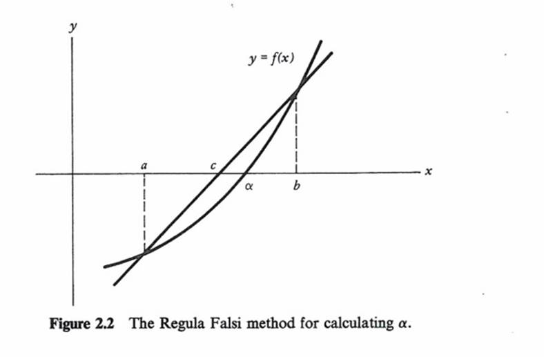

Allow multiple solvers to find a root
================

** Lixing Gu **

** Florida Solar Energy Center **

 - 5/4/17
 - Second revision based on E-mail communications
 - 5/3/17
 - First revision based on conversation with Rich
 - 4/6/17
 - Original NFP
 

## Justification for New Feature ##

The Regula Falsi method is used to find a root. The main application of root finding in EnergyPlus is to find a part load ratio or mass flow rate at given equipment/system load. The method assumes a general curve between two points of “a” and “b” as a straight line to find a root, and is the only method used in EnergyPlus internally. However, it may not reach convergence when the given equipment/system load is small. Ticket 6862 shows divergence with a small load. The main concern is that a straight line approach may fail to find a root within a small range. A good solution method is needed to avoid possible divergence.

  
## E-mail and  Conference Call Conclusions ##

### First revision
No comments were received. Therefore, no conference call was arranged. However, Rich and I had a talk about this new feature.

#### Rich's opinion 

Rich would like to start to use bisection method first. There is a section in the VRFTerminalUnitEquipment::ControlVRF_FluidTCtrl in the HVACVariableRefrigerantFlow.cc to narrow down the PLR range first before using the Regula Falsi method. He divides PLR into 10 sections with 0.1 increment. Then use a Do Loop to find a working range of PLR within 0.1 interval value that contains a solution. Finally, the Regula Falsi method is used to get a PLR solution.

In addition, he prefer do something internally without user involvement.

#### My reply

I will add new choices to let user select which algorithm is used.  

	HVACSystemRootFindingAlgorithm,
	  \memo Specifies a solving algorithm to find a root
      \unique-object
  	A1 , \field Algorithm
       \type choice
       \key RegulaFalsi
       \key Bisection
       \key BisectionThenRegulaFalsi
       \key RegulaFalsiThenBisection
       \default RegulaFalsi
  	N1 ; \field Number of Iteration Before Algorithm Switch
       \note This field is used when RegulaFalsiThenBisection or BisectionThenRegulaFalsi is 
       \note entered. When iteration number is greater than the value, algorithm switches.
       \type integer
       \default 0

The proposed object will be used for advanced users only. Although I can make algorithm switch internally, my internal code will not cover everything due to limited thoughts. For example, I would like to use Regula Falsi method first in general, while Rich would like to use the bisection first in some special cases as a developer. In order to meet advanced users' requirements and developers' requirements, I also suggest to add 3 more optional arguments in General::SolveRegulaFalsi:

	void
	SolveRegulaFalsi(
		Real64 const Eps, // required absolute accuracy
		int const MaxIte, // maximum number of allowed iterations
		int & Flag, // integer storing exit status
		Real64 & XRes, // value of x that solves f(x) = 0
		std::function< Real64( Real64 const ) > f,
		Real64 const X_0, // 1st bound of interval that contains the solution
		Real64 const X_1, // 2nd bound of interval that contains the solution
Optional_int AlgorithmTypeNum, // ALgorithm selection
Optional_double & XX_0, // Low bound obtained with maximum number of allowed iterations
Optional_double & XX_1, // Hign bound obtained with maximum number of allowed iterations

	);

If the optional argument of AlgorithmTypeNum, the algorithm will not be switched.   

The XX_0 argument is an output value at low bound with the maximum number of allowed iterations. The XX_1 argument is an output value at low bound with the maximum number of allowed iterations.

The advantage by adding 3 optional arguments is to allow the program to get new narrowed bounds that contain the solution. Then the new bounds will be used again as X_0 and X-1 to get a solution using RegulaFalsi.

The above change will meet advanced users requirements in general and special requirements for developers.

Note: Optional arguments may be changed by using polymorphism during coding.

### Second revision

More E-mail communications are included.

-----Original Message-----
From: Richard Raustad [mailto:rraustad@fsec.ucf.edu]
Sent: Wednesday, May 03, 2017 1:50 PM
To: Michael J Witte <mjwitte@gard.com>; Lixing Gu <gu@fsec.ucf.edu>; 'Lee, Edwin' <Edwin.Lee@nrel.gov>
Subject: Re: FW: NFP to allow multiple solvers to find a root in HVAC system simulations

I've made changes when RegulaFalsi can't find the solution for various reasons.

In FanCoils here: 
https://github.com/NREL/EnergyPlus/blob/develop/src/EnergyPlus/FanCoilUnits.cc#L2154
when very low water flow rates were needed, and in UnitarySystem (and other places) like this: 
https://github.com/NREL/EnergyPlus/blob/develop/src/EnergyPlus/HVACUnitarySystem.cc#L7458-L7531

I don't like doing this and think this new approach would eliminate any need for special cases.

On 5/3/2017 1:39 PM, Michael J Witte wrote:
> I agree with Rich on the new object - a necessary evil that user's 
> won't know what to do with.
>
> SolveRegulaFalsi should really be renamed to something more general, 
> like SolveRoot, or there should be a more general function that calls 
> SolveRegulaFalsi.  I realize this would mean changing every existing 
> call to SolveRegulaFalsi, but it should be a simple search/replace 
> across the code.
>
> Seems odd to put the new HVACSystemRootFindingAlgorithm variable into 
> DataHeatBalance and read the new object from HeatBalanceManager.  How 
> about putting it in DataHVACGlobals instead?
>
> Rich - didn't you already add code to switch gears like this somewhere 
> (fancoil unit?) to fix a bug due to tiny loads?
>
> Mike
>
>
> On 5/3/2017 10:29 AM, Richard Raustad wrote:
>> Regarding the use of a new object I would agree it's needed to get 0 
>> diff's during testing. How useful the new object is after that point 
>> is debatable (users won't know what to do with it).
>>
>> My only comments at this point is:
>> 1) a default value of 0 for Number of Iteration Before Algorithm 
>> Switch will never use both methods (unless iteration = 0 on first
>> pass) AND I assume this value will never be used for Algorithm choice 
>> of RegulaFalsi or Bisection. Since RegulaFalsi converges very fast 
>> (sometimes 1 or 2 iterations) I think a default of 5 would not be 
>> unreasonable. I'd be curious to see what diff's occur with a default 
>> of 5 using both BisectionThenRegulaFalsi and RegulaFalsiThenBisection 
>> and how each of these affects execution speed of the (annual?)test 
>> suite (I.e., multiple pull requests).
>> 2) when switching algorithms, I assume the new min and max found 
>> during the initial iteration loop will be used as the starting point 
>> for the next algorithm
>> 3) all this is done within the existing RegulaFalsi routine (i.e., no 
>> other change to existing code)
>>
>> min = 0
>> max = 1
>> SolveRegulaFalsi( Acc, MaxIte, SolFla, PLR, CalcResidual, min, max, 
>> Par );
>>
>> assuming the first algorithm converged to a narrow limit after a few 
>> iterations, switching algorithms should start at this tighter limit
>>
>> example:
>> min = 0.149
>> max = 0.153
>>
>> or
>>
>> min=0 (if min never got updated)
>> max = 0.153
>>
>> or
>>
>> min = 0.149
>> max = 1 (if max never got updated)
>>
>> continue solution using next algorithm
>>
>> Whether or not both min and max are always pulled to tighter limits 
>> during the first iteration loop using RegulaFalsi remains to be seen.
>> Using Bisection first would always tighten the min/max limits but 
>> might actually take longer to converge (ie., at least 2 or 3 
>> iterations to tighten the min/max limits using Bisection then 1, 2 or 
>> n more iterations using RegulaFalsi).
>>
>>
>>
>>
>> On 5/3/2017 10:25 AM, Lixing Gu wrote:
>>> All:
>>>
>>> After uploading an NFP two weeks ago, I have not received any 
>>> comments. However, Rich and I had a talk about this new feature 
>>> yesterday.
>>>
>>> The revised NFP based on conversation with Rich was uploaded a while 
>>> ago for further review and comments:
>>> https://github.com/NREL/EnergyPlus/blob/AllowMultipleSolversToFindARoot/design/FY2017/NFP-AllowMultipleSolvers.md. 
>>> I also added design document.
>>>
>>> Thanks.
>>>
>>> Gu
>>>

--
Richard Raustad
Florida Solar Energy Center
1679 Clearlake Road
Cocoa, FL 32922
Ph: (321)638-1454
http://www.fsec.ucf.edu/en/

Program Director
Electric Vehicle Transportation Center
http://evtc.fsec.ucf.edu/

-----Original Message-----
From: Lixing Gu [mailto:Gu@fsec.ucf.edu] 
Sent: Wednesday, May 03, 2017 1:49 PM
To: 'Michael J Witte' <mjwitte@gard.com>; 'Richard Raustad' <rraustad@fsec.ucf.edu>; 'Lee, Edwin' <Edwin.Lee@nrel.gov>
Subject: RE: FW: NFP to allow multiple solvers to find a root in HVAC system simulations

Mike:

I agree with your comments on the new object. The main reason is that I need inputs to provide triggers. This is an advanced object for us to play with.

SolveRegulaFalsi: I can change names with SolveRoot. The changes should be straight forward.

I will add a section in DataHVACGlobals to read the new object.

Thanks.

Gu 
 

-----Original Message-----
From: Michael J Witte [mailto:mjwitte@gard.com]
Sent: Wednesday, May 03, 2017 1:40 PM
To: Richard Raustad <rraustad@fsec.ucf.edu>; Lixing Gu <gu@fsec.ucf.edu>; 'Lee, Edwin' <Edwin.Lee@nrel.gov>
Subject: Re: FW: NFP to allow multiple solvers to find a root in HVAC system simulations

I agree with Rich on the new object - a necessary evil that user's won't know what to do with.

SolveRegulaFalsi should really be renamed to something more general, like SolveRoot, or there should be a more general function that calls SolveRegulaFalsi.  I realize this would mean changing every existing call to SolveRegulaFalsi, but it should be a simple search/replace across the code.

Seems odd to put the new HVACSystemRootFindingAlgorithm variable into DataHeatBalance and read the new object from HeatBalanceManager.  How about putting it in DataHVACGlobals instead?

Rich - didn't you already add code to switch gears like this somewhere (fancoil unit?) to fix a bug due to tiny loads?

Mike

-----Original Message-----
From: Lixing Gu [mailto:Gu@fsec.ucf.edu] 
Sent: Wednesday, May 03, 2017 1:42 PM
To: 'Richard Raustad' <rraustad@fsec.ucf.edu>; 'Michael J Witte' <mjwitte@gard.com>; 'Lee, Edwin' <Edwin.Lee@nrel.gov>
Subject: RE: FW: NFP to allow multiple solvers to find a root in HVAC system simulations

Rich:

Thanks for your quick response. 

Here are my replies to your comments:

1) Agree. I will set the default value at 5.
2) Yes. The values of last two optional arguments can be used in the next call by developers:

First call:

		General::SolveRegulaFalsi( ErrorToler, 3, SolFla, Frac, Residual, 0.0, 1.0, Bisection, TemMin, TemMax );

Second call

		General::SolveRegulaFalsi( ErrorToler, MaxIte, SolFla, Frac, Residual, TemMin, TemMax);

3) Yes. The changes occur in SolveRegulaFalsi. 

Thanks.

Gu

 
## Overview ##

The Regula Falsi method is a unique solver to find a root with given load in EnergyPlus. However, the method is unable to find a solution with small loads sometimes. A hybrid approach is proposed to combine Regula Falsi and bisection methods together. Regula Falsi method will be used first. If the given load is too small and the number of iterations is above a certain number, the bisection method will be used to find a solution. The proposed approach will provide a solution to reduce possibility of divergence. 

The proposed new feature will give user choices to select different solution algorithms from a new object, as well as provide alternative ways for developers to call the solver with special cases internally.  

## Approach ##

The proposed approach is to use a hybrid approach by combining Regula Falsi and bisection methods together. Although bisection method is slow in general, it finds a solution eventually. From a point of view of convergence, the bisection method is better than Regula Falsi. The proposed approach is to use the Regula Falsi method first to narrow the working range. If the given load is too small and the number of iteration is above the value given in the Number of Iteration Before Bisection field in the proposed new object of HVACSystemRootFindingAlgorithm, the bisection method will be used.  The hybrid approach will take advantage of Regula Falsi to narrow the working range first and fast, and find a root eventually at given small loads using the bisection method when the Regula Falsi method may not find a solution. 

A new object is proposed:

	HVACSystemRootFindingAlgorithm,
	  \memo Specifies a solving algorithm to find a root
      \unique-object
  	A1 , \field Algorithm
       \type choice
       \key RegulaFalsi
       \key Bisection
       \key BisectionThenRegulaFalsi
       \key RegulaFalsiThenBisection
       \default RegulaFalsi
  	N1 ; \field Number of Iteration Before Algorithm Switch
       \note This field is used when RegulaFalsiThenBisection or BisectionThenRegulaFalsi is 
       \note entered. When iteration number is greater than the value, algorithm switches.
       \type integer
       \default 5

### Note

It is possible to be hard-wired in the code without the new object. However, it may cause differences for every example file. In addition, the proposed object provides more flexibility for users to select which algorithm will be used. Furthermore, the new object may be expanded in the future, in case a new algorithm may be proposed and added.
  
## Testing/Validation/Data Sources ##

Compare simulation results using Regula Falsi only and multiple solvers.

It should be pointed out that differences are expected. The main check will be energy use during a simulation period.

## Input Output Reference Documentation ##

### HVACSystemRootFindingAlgorithm

The HVACSystemRootFindingAlgorithm object provides a way to select what type of solution
algorithm will be used to find a part load ratio or mass flow rate at given equipment/system load in HVAC system simulations. This object is an optional object. If the default algorithm is used, this object is not required in an input file.

#### Inputs

##### Field: Algorithm
Four choices are allowed to select which solution algorithm will be used: RegulaFalsi, Bisection,  BisectionThenRegulaFalsi, and RegulaFalsiThenBisection. The RegulaFalsi
selection is the default selection. Bisection selction will allow the program to use the bisection method to get a solution. The BisectionThenRegulaFalsi selection requires the program to apply the bisection method first. After the number of iteration is above the value defined in the next field, the RegulaFalsi algorithm will be applied. The RegulaFalsiThenBisection selection requires the program to apply the RegulaFalsi method first. After the number of iteration is above the value defined in the next field, the bisection algorithm will be applied.  

##### Field: Number of Iteration Before Algorithm Switch
This field is used when RegulaFalsiThenBisection or BisectionThenRegulaFalsi is entered. When iteration number is greater than the value, algorithm switches either from RegulaFalsi to Bisection or from Bisection to RegulaFalsi.

A default IDF example is shown below:

	HVACSystemRootFindingAlgorithm,
		RegulaFalsiThenBisection,
		20;

## Input Description ##

A new object is proposed.

	HVACSystemRootFindingAlgorithm,
	  \memo Specifies a solving algorithm to find a root
      \unique-object
  	A1 , \field Algorithm
       \type choice
       \key RegulaFalsi
       \key Bisection
       \key BisectionThenRegulaFalsi
       \key RegulaFalsiThenBisection
       \default RegulaFalsi
  	N1 ; \field Number of Iteration Before Algorithm Switch
       \note This field is used when RegulaFalsiThenBisection or BisectionThenRegulaFalsi is 
       \note entered. When iteration number is greater than the value, algorithm switches.
       \type integer
       \default 0

## Outputs Description ##

insert text

## Engineering Reference ##

insert text

## Example File and Transition Changes ##

An existing example file will be modified using the proposed approach.

No transition is needed.

## References ##

[Multiple solvers to find a root](https://github.com/NREL/EnergyPlusDevSupport/blob/master/DesignDocuments/EnhancementList/HVAC_General_2013_04.doc)

## Design Document

Three modules are revised: DataHVACGlobals, HeatBalanceManager, and General.

### DataHVACGlobals 

#### Create a struct to handle a new object of HVACSystemRootFindingAlgorithm 

	struct HVACSystemRootFindingAlgorithm
	{
		// Members
		std::string Algorithm;           // Choice of algorithm
		int TypeNum;                     // Type number: 1 RegulaFalsi; 2 Bisection; 3 RegulaFalsiThenBisection; 4 BisectionThenRegulaFalsi
		int NumOfIter;                   // Number of Iteration Before Algorithm Switch
		
		// Default Constructor
		HVACSystemRootFindingAlgorithm( ) :
			NumOfIter( 5 )
		{}

	};

#### Add 5 parameters for algorithm selection
 
	// Parameters for HVACSystemRootFindingAlgorithm
	int const RegulaFalsi( 1 );
	int const Bisection( 2 );
	int const BisectionThenRegulaFalsi( 3 );
	int const RegulaFalsiThenBisection( 4 );
	int const Alternation( 5 );
 
### HeatBalanceManager

#### Add a new section to read the new object of HVACSystemRootFindingAlgorithm in the GetProjectControlData function

		// A new object is added by L. Gu, 4/17
		CurrentModuleObject = "HVACSystemRootFindingAlgorithm";
		NumObjects = GetNumObjectsFound( CurrentModuleObject );
		if ( NumObjects > 0 ) {
			GetObjectItem( CurrentModuleObject, 1, AlphaName, NumAlpha, BuildingNumbers, NumNumber, IOStat, lNumericFieldBlanks, lAlphaFieldBlanks, cAlphaFieldNames, cNumericFieldNames );
			if ( NumAlpha > 0 ) {
				HVACSystemRootFinding.Algorithm = AlphaName( 1 );
				{ auto const SELECT_CASE_var( AlphaName( 1 ) );
				if ( ( SELECT_CASE_var == "REGULAFALSI" ) ) {
					HVACSystemRootFinding.TypeNum = RegulaFalsi;
				}
				else if ( SELECT_CASE_var == "BiSECTION" ) {
					HVACSystemRootFinding.TypeNum = Bisection;
				else if ( SELECT_CASE_var == "BISECTIONTHENREGULAFALSI" ) {
					HVACSystemRootFinding.TypeNum = BisectionThenRegulaFalsi;
				else if ( SELECT_CASE_var == "REGULAFALSITHENBISECTION" ) {
					HVACSystemRootFinding.TypeNum = RegulaFalsiThenBisection;
				} else {
					HVACSystemRootFinding.TypeNum = RegulaFalsi;
					ShowWarningError( CurrentModuleObject + ": Invalid input of " + cAlphaFieldNames( 1 ) + ". The default choice is assigned = " + AlphaName( 1 ) );
					ShowContinueError( "Valid choices are: RegulaFalsi, or RegulaFalsiThenBisection." );
				}}
			}
			if ( NumNumber > 0 ) {
				HVACSystemRootFinding.NumOfIter = BuildingNumbers( 1 );
			}
		}
		else {
			HVACSystemRootFinding.TypeNum = RegulaFalsi;
			HVACSystemRootFinding.Algorithm = "RegulaFalsi";
		}

		// Write Solution Algorithm to the initialization output file for User Verification
		gio::write( OutputFileInits, Format_726 );
		gio::write( OutputFileInits, Format_727 ) << AlphaName( 1 );

### General

#### Rename SolveRegulaFalsi as SolveRoot

#### Add a new section in the SolveRoot function

		if ( present(AlgorithmTypeNum) ) {
			if ( AlgorithmTypeNum == Bisection ) {
				// Bisection
				XTemp = ( X1 + X0 ) / 2.0;
			} else {
				// Regula Falsi
				XTemp = ( Y0 * X1 - Y1 * X0 ) / DY;
			}
		} else {
			if ( (HVACSystemRootFinding.TypeNum == Bisection) || 
				(HVACSystemRootFinding.TypeNum == RegulaFalsiThenBisection && NIte > HVACSystemRootFinding.NumOfIter) ||
				(HVACSystemRootFinding.TypeNum == BisectionThenRegulaFalsi && NIte <= HVACSystemRootFinding.NumOfIter)
				) {
				// Bisection
				XTemp = ( X1 + X0 ) / 2.0;
			} else if ( (HVACSystemRootFinding.TypeNum == RegulaFalsi) ||
				(HVACSystemRootFinding.TypeNum == BisectionThenRegulaFalsi && NIte > HVACSystemRootFinding.NumOfIter) ||
				(HVACSystemRootFinding.TypeNum == RegulaFalsiThenBisection && NIte <= HVACSystemRootFinding.NumOfIter) ) {
				// Regula Falsi
				XTemp = ( Y0 * X1 - Y1 * X0 ) / DY;
			}

		}
		....

		if ( present(AlgorithmTypeNum) ) {
			XX_0 = X_0;
			XX_1 = X_1;
		}
#### Add 3 new optional arguments in the SolveRoot function

	void
	SolveRoot(
		Real64 const Eps, // required absolute accuracy
		int const MaxIte, // maximum number of allowed iterations
		int & Flag, // integer storing exit status
		Real64 & XRes, // value of x that solves f(x) = 0
		std::function< Real64( Real64 const ) > f,
		Real64 const X_0, // 1st bound of interval that contains the solution
		Real64 const X_1, // 2nd bound of interval that contains the solution
		Optional_int AlgorithmTypeNum, // ALgorithm selection
		Optional_double & XX_0, // Low bound obtained with maximum number of allowed iterations
		Optional_double & XX_1, // Hign bound obtained with maximum number of allowed iterations

	);

