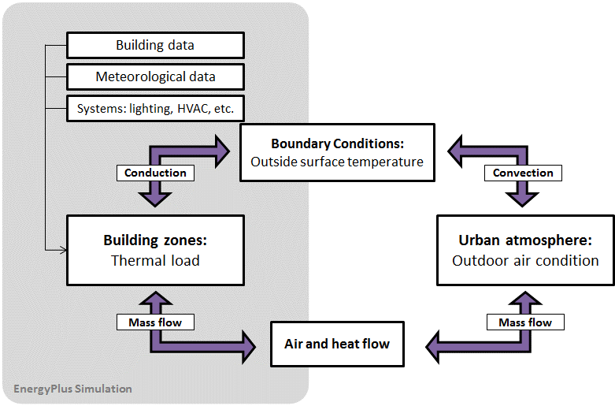

Enhancement for Simulation using Urban Microclimate Conditions
================
**Tianzhen Hong, Xuan Luo, LBNL**
**Original: June 27, 2017**

# Justification for New Feature 

With the global trend towards urbanization, energy use and the associated GHG emissions are growing significantly in cities. Reducing energy use in the building sector is a key strategy for cities to achieve their energy and environmental goals. The urban climate and microclimate can strongly affect the building energy demand. As air temperatures in urban areas are higher due to the urban heat island (UHI) effect and the wind speeds can be lower due to wind sheltering, the microclimate in urban areas differs significantly from the climate in rural areas. The proposed enhancement intends to enable EnergyPlus simulations to use the local ambient conditions, which can be from measurements or CFD simulation, including parameters of outdoor air velocity and direction, dry-bulb temperature and humidity.  

# Overview 
Urban energy modeling is an emerging field that seeks to model a group of buildings and the surrounding urban micro-climate. The microclimate around a building, established through the interactions with other buildings or the natural environment, is a significant factor influencing building energy consumption. On the one hand, the energy consumption of urban buildings is affected by the surrounding microclimate which differs from standard weather data, and the mutual obstructions between buildings which decrease sunlight and wind potentials for internal solar gains and passive cooling. On the other hand, the building construction itself affects both outdoor and indoor microclimate. As Figure 1 shows, the building model in EnergyPlus serves as the boundary condition in the urban atmosphere model, and the building exchanges mass (air flow) and heat with the surrounding environment, including exhaust air from fans, DX condensing units, cooling towers, boilers, etc. 

***Figure 1 EnergyPlus data exchange with urban microclimate model***

The current implementation of EnergyPlus assumes a default vertical temperature gradient. It does not provide a direct link to allow data exchange with urban microclimate models to override local environmental data at the zone and surface levels, such as the outdoor air temperature, humidity, wind velocity and direction. However, there are reportable surface and zone outdoor conditions tracked separately as:

	Zone,Average,Surface Outside Face Outdoor Air Drybulb Temperature [C]
	Zone,Average,Surface Outside Face Outdoor Air Wetbulb Temperature [C]
	Zone,Average,Surface Outside Face Outdoor Air Wind Speed [m/s]
	Zone,Average,Zone Outdoor Air Drybulb Temperature [C]
	Zone,Average,Zone Outdoor Air Wetbulb Temperature [C]
	Zone,Average,Zone Outdoor Air Wind Speed [m/s]

For a simple co-simulation case, it would be straightforward to add new EMS actuators for these six variables to override their values directly. We propose to add the Zone Outdoor Air Wind Direction [degree] as a new report variable at every time step. This would enable the co-simulation of the interaction between buildings and the urban micro-climate.

# Approaches 
We propose to add the Zone Outdoor Air Wind Direction [degree] report variable at every time step, and make the seven variables as new EMS actuators that can be set up for overriding the environmental variable fields. This enables data exchange with the local ambient air conditions at arbitrary nodes or coordinates by setting up FMUs for co-simulation (Figure 2).

 

***Figure 2 Local ambient air conditions at zone and surface level***

The local environmental conditions can be exchanged with or overwritten by external simulation or calculation results at each time step in run time.

# Testing/Validation/Data Sources

TBD

# Input Output Reference Documentation

TBD

# Engineering Reference

TBD

# Output Details and Examples

TBD

# Example Files and Transition Changes

No transition changes are envisioned as a result of the new features (but this can change based on feedback from the team). New example files will be developed to demonstrate the new features.

# References

n/a

# E-mail comments

**Lixing Gu <gu@fsec.ucf.edu> Thu, Jun 1, 2017** 

LocalOutdoorAir:Node
Since you require to input outdoor conditions, T, W, Wind Speed and direction, is it possible to add solar radiation treated as diffuse component?

> That can be added in future using the same approach, but we don’t see this as an immediate need to support urban energy modeling. A separate topic is to allow the calculated solar radiation (diffuse, direct or combined) to be an input for external surfaces, which is outside the scope of this proposal.

**Michael J Witte <mjwitte@gard.com> Mon, Jun 5, 2017** 

Rather than add the concept of outdoor air nodes with one-to-one correspondence with surfaces and zones, here it may be better to just add new EMS actuators.  Surface and zone outdoor conditions are already tracked separately, and they are reportable:
	Zone,Average,Surface Outside Face Outdoor Air Drybulb Temperature [C]
	Zone,Average,Surface Outside Face Outdoor Air Wetbulb Temperature [C]
	Zone,Average,Surface Outside Face Outdoor Air Wind Speed [m/s]
	Zone,Average,Zone Outdoor Air Drybulb Temperature [C]
	Zone,Average,Zone Outdoor Air Wetbulb Temperature [C]
	Zone,Average,Zone Outdoor Air Wind Speed [m/s]

So it would be straightforward to add new EMS actuators for these six variables to override these values directly.  The only thing missing is wind direction, which could be added to the same data structures.

> We agreed and adopted the approach. We also discussed this with the EnegryPlus ExternalInterface/FMI developer.

**Daniel Macumber <Daniel.Macumber@nrel.gov> Thu, Jun 1, 2017** 

Would these be given geometric locations and sizes?  Currently I think you can only specify the height in OutdoorAir:Node

I am not a fan of cosimulation at this scale, I think you can decouple these simulations or at least get to very loose coupling.  For co-simulation at this scale I think that fitting higher level models (e.g. regression models) of the detailed E+ simulations and co-simulating those will be more performant.

We should design solutions that can work both within co-simulation environments and also using static boundary conditions.  It may be cheaper to run a few iterations of the annual simulations until convergence than to co-simulate.

> Yes, the current OutdoorAir:Node has a default correlation between outdoor air temperature and height, which might not be accurate enough to consider the UHI effect. We intend to address this limitation by enabling the new seven EMS actuators, which can be calculated using EMS code or imported from results of external calculations through the co-simulation approach. This is a one-way data exchange, from local urban conditions to EnergyPlus simulation models for zones and/or exterior surfaces, no iteration is involved.

