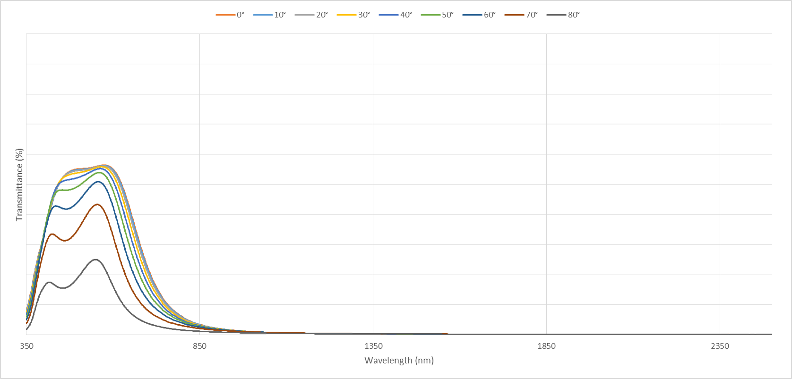

<head>
<script type="text/x-mathjax-config">
  MathJax.Hub.Config({
  extensions: ["tex2jax.js"],
  jax: ["input/TeX", "output/HTML-CSS"],
  tex2jax: {
   inlineMath: [ ['$','$'], ["\\(","\\)"] ],
   displayMath: [ ['$$','$$'], ["\\[","\\]"] ],
   processEscapes: true
  },
  "HTML-CSS": { availableFonts: ["TeX"] }
  });
</script>
  <script type="text/javascript"
   src="http://cdn.mathjax.org/mathjax/latest/MathJax.js?config=TeX-AMS-MML_HTMLorMML">
  </script>
</head>
# Add a New Functionality in EnergyPlus to Allow Window Properties as a Function of Incident Angles #

================

**Lixing Gu**

**Florida Solar Energy Center**

 - Fourth revision on April 17, 2017
 - Report test results based on the third revision and propose additional effort to implement this new feature in existing E+ (based on Winkelmann approach)
 - Third revision on Mar. 16, 2017
 - Add design document
 - Second revision on Feb. 15, 2017
 - Revised NFP based on discussion in the the first conference call on 2/14/17
 - First revision on Feb. 3, 2017
 - Received comments and made initial reply before the first conference call
 - Original: January 5, 2017
 - Submitted an NFP to the team
 

## Justification for New Feature ##

The current EnergyPlus allows user-defined spectral dependent glazing properties. The MaterialProperty:GlazingSpectralData object allows users to input transmittance, front reflectance, and back reflectance as a function of wavelength. In reality, these glazing properties are also a function of incident angle. AGC Glass Europe would like to add this new functionality. FSEC will help AGC to add the new functionality in EnergyPlus for public release.

## E-mail and  Conference Call Conclusions ##

###First revision

#### Comments ####
After submission of the NFP, here are comments received:

From: Timmermans Tanguy [mailto:Tanguy.Timmermans@eu.agc.com] 
Sent: Monday, January 23, 2017 4:45 AM
To: Tianzhen Hong <thong@lbl.gov>; Neal Kruis <neal.kruis@bigladdersoftware.com>
Cc: D. Charlie Curcija <dccurcija@lbl.gov>; Lixing Gu <gu@fsec.ucf.edu>; energyplusdevteam@googlegroups.com; Jonsson Jacob <JCJonsson@lbl.gov>; Simon Vidanovic <DVVidanovic@lbl.gov>
Subject: RE: [energyplusdevteam] NFP for glazing enhancements

Dear all,

In fact the BSDF would in theory allow to do the same as what is proposed here, however with several shortcomings:
-	Use a full system instead of a layer-by-layer approach like for every other constructions, making heavy pre-processing mandatory and evaluation of alternative solution where I only change one layer heavier.
-	The system do not interpolate between patches, and every sun ray that falls within a patch takes the optical value assigned to the center of the patch
-	Here we speak about specular materials, hence only the diagonal elements of the BSDF matrix are non-zero. The complex fenestration approach makes the input file unnecessarily big (especially if we increase the number of patches to overcome the previous shortcoming).
-	Using BSDF constructions slows the calculation down a big deal (especially if we have many patches in the basis) where it’s in practice not needed as we have a simple specular glazing that could be calculated exactly like any other glazing.

To answer Charlie’s comment "The existing EnergyPlus considers the glazing properties are a function of wavelength only". It’s true that EnergyPlus does consider the glazing properties as a function of angle as well, but it’s hard coded and users cannot specify the actual dependency themselves. It’s not even possible to choose which law to use (clear or bronze). The NPF could be reviewed to say that “EnergyPlus allow users to only specify the spectral dependency and not the angular one”.
Regarding the comment “there is no evidence that optical properties angle dependence is different at different wavelenghts“, you’ll find in attachment a graph showing the spectral-angular dependency of a sample we measured. It’s clear that the angular dependency is not the same at every wavelength. It’s also a well-known effect among manufacturer of advanced solar coatings that these coatings can have a color shift in reflection at high angle of incidence. On top of this, keeping both wavelength and angular dependency is needed if we want to work in a layer-by-layer approach where the solver compute the actual spectral dependency himself. The layer-by-layer definition also allows to keep the existing approach regarding blinds and shades definition.

Hopes this answer your comments, if you need additional details, let me know.

Tanguy Timmermans
Researcher, Physics of Products & Processes Department
AGC Glass Europe
 
AGC European R&D Centre
Postal address: Rue Louis Blériot, 12 – B-6041 Gosselies – Belgium
Visitors address: Rue Ernest-Oscar Tips – B-6041 Gosselies – Belgium
tel. +32 (0)2 409 12 55
tanguy.timmermans@eu.agc.com
www.agc-glass.eu



From: energyplusdevteam@googlegroups.com [mailto:energyplusdevteam@googlegroups.com] On Behalf Of Tianzhen Hong
Sent: Friday, January 20, 2017 10:42 PM
To: Neal Kruis <neal.kruis@bigladdersoftware.com>
Cc: D. Charlie Curcija <dccurcija@lbl.gov>; Lixing Gu <gu@fsec.ucf.edu>; energyplusdevteam@googlegroups.com; Timmermans Tanguy <Tanguy.Timmermans@eu.agc.com>; Jonsson Jacob <JCJonsson@lbl.gov>; Simon Vidanovic <DVVidanovic@lbl.gov>
Subject: Re: [energyplusdevteam] NFP for glazing enhancements


We looked at this enhancement (enabling user defined angle-dependency curves) several years ago, but it did not get implemented due to priority reason. 
Gu, I think it is good to add new and user configurable angle-dependency curves for non-BSDF glazing. 
Tianzhen


From: energyplusdevteam@googlegroups.com [mailto:energyplusdevteam@googlegroups.com] On Behalf Of Neal Kruis
Sent: Friday, January 20, 2017 4:58 PM
To: D. Charlie Curcija <dccurcija@lbl.gov>
Cc: Lixing Gu <gu@fsec.ucf.edu>; energyplusdevteam@googlegroups.com; Timmermans Tanguy <Tanguy.Timmermans@eu.agc.com>; Jonsson Jacob <JCJonsson@lbl.gov>; Simon Vidanovic <DVVidanovic@lbl.gov>
Subject: Re: [energyplusdevteam] NFP for glazing enhancements

I agree with Charlie regarding angle-dependency curves. The only angle dependencies for a typical window model (i.e., not complex fenestration) are hard coded for coated glass deep in the EnergyPlus source code. The ability to override these relationships as a user is important.


From: D. Charlie Curcija [mailto:dccurcija@lbl.gov] 
Sent: Friday, January 20, 2017 4:29 PM
To: Neal Kruis <neal.kruis@bigladdersoftware.com>
Cc: Lixing Gu <gu@fsec.ucf.edu>; energyplusdevteam@googlegroups.com; Timmermans Tanguy <Tanguy.Timmermans@eu.agc.com>; Jonsson Jacob <JCJonsson@lbl.gov>; Simon Vidanovic <DVVidanovic@lbl.gov>
Subject: Re: [energyplusdevteam] NFP for glazing enhancements

BSDF is used for complex glazing and shading materials, where light can scatter. If light does not scatter, which is what this NFP seems to be about, there is no evidence that optical properties angle dependence is different at different wavelenghts, which would indicate that this NFP is providing solution in a search of a problem. The NFP wrongly states that "The existing EnergyPlus considers the glazing properties are a function of wavelength only". Optical properties of specular glazing can be both spectrally and angle dependent in E+. For non-coated and non-tinted glass, Fresnel formula is used, while for all others "bronze" glass formula is used. The real need in this area is to implement number of other angle-dependency curves that were published from research conducted in the past couple of decades. They better describe different classes of coated and tinted products. However, I don't think that there is implication that we need curve for each wavelength, which is basically what this NFP is trying to implement.

Perhaps if Lixing can provide a clarification for the need for this feature, in light of my comments above, it would be good. 

Charlie

On Fri, Jan 20, 2017 at 12:01 PM, Neal Kruis <neal.kruis@bigladdersoftware.com> wrote:
Gu,

How does this relate to the existing BSDF inputs? I think there needs to be a description of how this is different from the BSDF optical input, and why it needs a different implementation. In my opinion, we should improve on the existing methodology rather than making a parallel approach. If possible, please reuse the Matrix objects established for BSDF or work with LBNL to come up with a consistent replacement. I am strongly opposed to adding the proposed objects and fields without further justification for the bifurcation.

Regards,

Neal

#### Lixing Gu reply

Tanguy Timmermans clearly addressed Neil and Charlie comments. As also indicated by Tianzhen, the proposed new feature enhances non-BSDF glazing properties. There is no need to make it as a part of complex BSDF. In addition, if data sets are red from table objects, the input changes are very minor by adding an additional choice of the 
Optical Data Type field in the WindowMaterial:Glazing object as SpectralAndIncidentAngle, and 3 new fields of optical dataset names to represent transmittance, front reflectance, and back reflectance, respectively.  

In addition, the proposed optical properties as a function of both wavelength and incident angle. The existing E+ hard-codes the properties as a function of incident angle. The proposed change will give user flexibility to input optical properties. 

I will make changes in NFP based on Tnaguy's comments.

I propose two choices to input optical datasets. The first choice is to add 3 new objects to read data, proposed earlier. The second choice is to use existing object of Table:TwoIndependentVariables. Minor modifications are needed. For example, two additional choice of the Input Unit Type field are added as wavelength (microns) and angle (degrees). The dimensionless of output unit type is available, there is no need to make any changes. An additional effort may be proposed to add an option to read datasets from an external file. The second choice is recommended, since no new objects will be created.  

By the way, the Matrix:TwoDimension object is used in BSDF input. The object allows two-dimentional matrix of values only. The proposed datasets are three-dimentional matrix of values. Therefore, the existing object needs to be revised. Fortunately, the existing Table:TwoIndependentVariables meets input requirements with minor modification. That is why we propose to use the Table:TwoIndependentVariables as an alternative input data holder. 

More E-mail communications on 2/14/17

Mike:

Thanks for your comments and suggestions.

1. New fields in WindowMaterial:Glazing

I like your suggestions to place 3 new dataset field names at the end of the object, so that no transitions are needed.

2. External File name

I think there may be 3 options.

1.	Existing data format from Table:MultiVariableLookup
The data format is not nice. If there are 3 independent variables, it specify values of independent variables one-by-one, then specify values of dependent variable. Therefore, data are not easily readable. 

    1,                       !- Number of Independent Variables
	 4,                       !- Number of Values for Independent Variable X1
     0.0,                     !- Field 1 Determined by the Number of Independent Variables
     0.5,                     !- Field 2 Determined by the Number of Independent Variables
     1.0,                     !- Field 3 Determined by the Number of Independent Variables
     1.5,                     !- <none>
     1.1552,                  !- <none>
     1.0712,                  !- <none>
     1.0,                     !- <none>
     0.9416;                  !- <none>

Rich and I had discussion. He suggested to use the proposed format (below).

2.	Proposed data format
Specify data one-by-one:
X1, y1, z1
X2, y2, z2,

The advantage is readable. However, the data format is fixed.

3.	New data:file object

As suggested by Mike, a new object, similar to Schedule:File to provide more flexibility. However, it requires a new object to handle. At least, Schedule:File name may not be proper.

We can discuss this issue in the conference call, although I prefer to use the second one without new objects.

Thanks.

Gu 
From: Michael J Witte [mailto:mjwitte@gard.com] 
Sent: Tuesday, February 14, 2017 10:43 AM
To: Lixing Gu <gu@fsec.ucf.edu>; 'Neal Kruis' <neal.kruis@bigladdersoftware.com>; Simon Vidanovic <dvvidanovic@lbl.gov>; D. Charlie Curcija <dccurcija@lbl.gov>; 'Tianzhen Hong' <thong@lbl.gov>; 'Lee, Edwin' <Edwin.Lee@nrel.gov>
Cc: 'Timmermans Tanguy' <Tanguy.Timmermans@eu.agc.com>
Subject: Re: Doodle: Link for poll "Discuss an NFP of glazing enhancements"

Gu:
Just one small suggestion we can discuss on today's call.
In WindowMaterial:Glazing, I'd rather see the new fields placed at (or near) the end of the object rather than adding infrequently used fields at the top.  (If I were to design the object today, I would put the spectral data set field to the end as well.)
Otherwise, this looks good to me.  I like using the existing table object, and I like adding the external file option.  I was going to suggest a more general table from file object (like Schedule:File) that lets you specify rows to skip at the top and which columns to grab data  from, but I see that Table:MultiVariableLookup already has an "External File Name" filed, so your proposal follows that pattern.
Mike

###Second revision
  
The first conference call was held on 2/14/17. The following people attended the conference call:

Michael J Witte, GARD
Neal Kruis, Big Ladder
Simon Vidanovic, LBNL
D. Charlie Curcija, LBNL
Tianzhen Hong, LBNL
Edwin Lee, NREL
Timmermans Tanguy, AGC Glass
Lixing Gu, FSEC 

Here is a summary based on discussion during the conference call

#### New feature justification

The new feature is needed based on following reasons:

1. AGC measured data shows that optical properties are a function of wavelength and incident angles. It may be described by curves. However, tabular inputs are also a good approach with direct inputs from measured data without curve-fitting effort. In addition, some properties may not be defined as a simple curve.  
2. Existing hard code to calculate optical properties is based on a single empirical curve. Tabular data input can provide more flexibility to users.
3. ASHRAE SPC205 (Standard Representation of Performance Simulation  Data for HVAC&R and Other Facility Equipment) favors to use tabular data to represent optical properties. The proposed approach meets SPC205 requirements
 

#### Table:TwoIndependentVariables to hold optical tabular data

The Table:TwoIndependentVariables object will be used to hold optical data with minor modifications. One of modifications is to add a new field as External File Name to read optical data from an external file. The data format of the external file will be the same as text inputs:

X1, Y1, Z1,

X2, Y2, Z2,

...

Xn, Yn, Zn;


#### Adjust positions of new fields in WindowMaterial:Glazing

The proposed 3 new fields will be placed at the end in the WindowMaterial:Glazing objects:

WindowMaterial:Glazing,
    \min-fields 14
    \memo Glass material properties for Windows or Glass Doors
    \memo Transmittance/Reflectance input method.
...
  N14, \field Poisson's ratio

  A5 , \field Window Glass Spectral and Incident Angle Transmittance Data Set Table Name

  A6 , \field Window Glass Spectral and Incident Angle Front Reflectance Data Set Table Name

  A7 ; \field Window Glass Spectral and Incident Angle Back Reflectance Data Set Table Name
 

#### Possible optional outputs 

This section provides possible efforts if time and money are left.
 
1. Possible optical outputs based on certain range of wavelengths

The certain ranges of wavelengths will include visible, infrared, and different colors.

2. Tabular data may include data range to simplify inputs

The proposed tabular input may meet data range requirement. The only restriction is linear interpolation is performed between two data points.

#### Future enhancements   

A new Data:File object   

A new data object may be similar to Schedule:File. The format may be similar. However, the Schedule:File varies with time with a single independent variable, while Data:File needs multiple independent variables and allows to vary with single or multiple independent variables.

I will write an item in the enhancement list. 

###Third revision

The third revision is to add design document based on existing WCE. 

### WCE Implementation 

After implementation of the proposed WCE addition based on design document, unit tests and whole building simulations are performed to ensure the code performs as expected.   

#### Unit tests

The unit tests were uploaded in the Lixing_Branch in https://github.com/LBNL-ETA/Windows-CalcEngine. 

1. Sample_AngularMeasurementsTest1

This unit test under SpectralAveraging_tests tests common wavelength operation when different optical property data sets have different values of wavelengths, and liner interpolation of optical properties when optical properties specified at certain incident angles are not given in the optical datasets.

Common wavelength operation is to create a new array of wavelength, containing all wavelength values from different datasets. In other words, wavelength values in different datasets are a subset of the new array. Then all datasets will be re-organized based on the wavelength values of the new array. New optical properties with new wavelength values (none exist in the original dataset) will be linearly interpolated.  
  
2. TestSpecularAngularLayerProperty_102

This unit test under SingleLayerOptics_tests tests optical properties integrated from a whole range of solar spectrum in a single layer at different incident angles. If a given angle matches one of dataset angles, optical properties are provided directly from the dataset. Otherwise, optical properties are linearly interpolated. In addition, results are compared based on each wavelength to ensure linear interpolation is performed correctly at each wavelength. 
   
3. EquivalentSpecularAngularLayer_102_103

This unit test under MultiLayerOptics_tests tests optical properties integrated from a whole range of solar spectrum in multiple layers at different angles. There are two layers in a window construction. The Optical Data Type is Spectral in the first layer, and SpectralAndAngle in the second layer with 4 incident angles at 0, 10, 40 and 90, respectively. If a given angle matches one of dataset angles, optical properties are provided directly from the dataset. Otherwise, optical properties are provided based on linear interpolation. Tested angles are 0, 10, 25, and 90. Output variables are optical properties of transmittance, reflectance and absorptance based on a whole range of sun spectrum. Summation testing is also performed to ensure a sum of transmittance, reflectance and absorptance is equal to 1.  

#### Whole building test

An example input file of AirflowNetwork_MultiZone_SmallOffice were revised as a whole building test file.

**Test cases**

1. Single layer with Optical Data Type = SpectralAndIncidentAngle in the WindowMaterial:Glazing object

2. Multiple layers with a layer at Optical Data Type = SpectralAndIncidentAngle, and the other layer at Optical Data Type = Spectral in the WindowMaterial:Glazing object.

  Construction,
    ELECTRO-CON-LIGHT,       !- Name
    ELECTRO GLASS LIGHT STATE,  !- Outside Layer as SpectralAndAngle
    WinAirGap,               !- Layer 2
    SPECTRAL GLASS INNER PANE;  !- Layer as Spectral

  Construction,
    ELECTRO-CON-DARK,        !- Name
    ELECTRO GLASS LIGHT STATE,  !- Outside Layer as SpectralAndAngle
    WinAirGap,               !- Layer 2
    SPECTRAL GLASS INNER PANE;  !- Layer as Spectral

This test case has two sub test cases by switching outside and inside layers.

#### Note ####

WCE is able to perform BSDF simulations only. The Winkelmann approach is not available.

###Fourth revision

This revision is to add the new functionality based on the Winkelmann approach.

#### Test results

If BSDFBasis::Small is used in CWCEBSDFLayerFactory::init(), the execution speed is compatible with existing one as Winkelmann approach. However, optical properties are calculated at every 3 or 4 hours.

It should be pointed out that four choices are available:

  	enum class BSDFBasis { Small, Quarter, Half, Full };

The current setting in the #2520943-WindowsCalc-Engine_Intergration branch in https://github.com/NREL/EnergyPlus is **BSDFBasis::Small**.

If BSDFBasis::Full is used in CWCEBSDFLayerFactory::init(), the execution speed is expected to be very slow, so that it is not practical to use this setup to perform simple straight forward simulations.

It should be pointed out that WCE version available in EnergyPlus branch is not updated to the latest version in https://github.com/LBNL-ETA/Windows-CalcEngine during the fourth revision writing. Tests failed with BSDFBasis::Full for simple testing.

LBNL just updated WCE branch today (4/21/17). I am going to test it to see what happens.

Based on current status mentioned above, WCE version may not be ready for AGC Glass to use right now. Adding this feature in the existing EnergyPlus based on the Winkelmann approach becomes necessary.   

#### Major changes

An empirical function of TransAndReflAtPhi in the WindowManager module is used to calculate transmittance and reflectance at an arbitrary angle of incidence based on given transmittance and reflectance at zero incidence angle for a single glazing layer. The existing code calculates optical properties at each 10 degree interval by calling this function, so that the number of incident angles is 10.

If SpectralAndAngle is entered, optical properties at different incident angles are either given or linearly interpolated. The empirical function will be by-passed. Since the number of incident angles are user input, it is assumed that the maximum number of incident angles = 20. All array sizes associated with incident angles in the WindowManager module are revised based on the max number.

The major revision to accommodate the new feature is a function of InitGlassOpticalCalculations() in the WindowManager module.

The code changes will be composed of 3 sections. The first section is data input, which is commonly required by both WCE and existing one (Winkelmann approach). The second section is used in WCE only. The third section will be used by existing one only based on Winkelmann approach.  

## Overview ##

Window glazing properties of transmittance, front reflectance, and back reflectance are a function of wavelength and incident angel. EnergyPlus allow users to only specify the spectral dependency and not the angular one. The optical properties are calculated based on an incident angle with hard code. The WindowMaterial:Glazing object has a field of Optical Data Type to allow users to select a choice of Spectral and enter Window Glass Spectral Data Set Name as a data set to input glazing data under the MaterialProperty:GlazingSpectralData object. The AGC Glass Europe found the glazing properties are not only a function of wavelength, as well as a function of incident angle, as shown in the above figure. These properties can be measured from testing. It is possible that these optical properties may not be covered by existing hard code as a function of incident angle. Therefore, the existing input structure can not simulate real performance using measured optical properties. A new functionality was proposed to enhance glazing properties as a function of both wavelength and incident angle. The added new functionality will improve window heat transfer calculations with more accurate prediction. 

The code modifications will be based on Window Calculation Engine (WCE) submitted by LBNL and Winkelmann approach in the existing structure (proposed in the fourth revision). 

## Approach ##

The proposed approach will revise the existing object of WindowMaterial:Glazing, and use existing object of Table:TwoIndependentVariables with minor modifications to input optical datasets.

### Revision of WindowMaterial:Glazing object ###

The WindowMaterial:Glazing object will be revised by adding an additional choice of the 
Optical Data Type field in the WindowMaterial:Glazing object as SpectralAndIncidentAngle, and 3 new fields of optical dataset or Table names to represent transmittance, front reflectance, and back reflectance, respectively. 

It is possible to combine all optical properties as a single dataset name. However, the dataset will contain 5 columns to be listed as:

Wavelength 1, Incident Angle 1, Transmittance 1, Front Reflectance 1, and Back Reflectance 1 ....

Therefore, the dataset becomes very large and not readable easily. It is better to have 3 datasets to represent transmittance, front reflectance, and back reflectance, respectively. It also provides flexibility to allow each optical property may have values at different wavelengths and incident angles. Each dataset set up 2 independent variables (wavelength and incident angle) and 1 dependent variable (optical property). 

In order to avoid transition, the three new optional fields will be placed at the end of the object.

### Modify existing object of Table:TwoIndependentVariables ###

The existing object of Table:TwoIndependentVariables will be modified slightly to meet input requirements:

1. Add two additional choices of Input Unit Type as wavelength (microns) and angle (degrees). 
2. Allow an external file as inputs

The existing object does not read data from an external file. An additional effort is proposed by adding an additional field as External File Name.    

### Calculation procedure ###

#### WCE based

The calculation procedure is expanded based on the Spectral choice defined in the  WindowMaterial:Glazing object. The main difference is that the Spectral choice calculates the optical properties at a given incident angle using empirical functions (getPropertyAtAngle), while the new choice of SpectralAndIncidentAngle will calculate the optical properties at a given incident angle via linear interpolation from given inputs.

1. Read input objects

Read inputs from Table:TwoIndependentVariables objects when the choice of SpectralAndIncidentAngle is entered in the WindowMaterial:Glazing object.

2. Convert table data into a WCE structure

The table data will be converted into a new class of CSingleAnugularMeasures, which contains spectral sample data based on each incident angle. The whole set of data, including all incident angles and associated spectral data, will be under a new class of CAngularMeasurements. The detailed structure will be shown in the Data Structure section in the Design Document.

It should be noted that the previous step was to integrate system properties with respect to wavelength for each angle of incidence. This step changes slightly. The integration will be performed inside WCE. There are two main reasons. The first reason is that there are many optical properties are presented at different wavelength ranges, such as entire solar ranges, visible and different colors. If integration occurs in the beginning, further process may not be performed based on wavelenght ranges. The second main reason is that the existing internal structure of WCE requires to read data with different wavelengths. In order to match existing structure, we will process integration internally, so that the proposed procedure will be consistent with existing structure and a lot of existing functions will be utilized effectively.

3. Create a new set of spectral data at a given incident angle

If a given incident angle is not listed in incident angle values, linear interpolation will be performed between two nearest angles given in the material properties to generate a new spectral data set.

4. Generate a new derived class of material to handle new spectral data

A new derived class of CMaterial as CMaterialMeasured will be created to handle optical properties for each layer.

5. The optical properties from linear interpolation will be fed to classes of Single or Multiple layer windows for further processing in the existing structure.

#### Winkelmann approach based

When revision is based on the Winkelmann approach, the function of  InitGlassOpticalCalculations() in the WindowManager module will be revised only.

## Testing/Validation/Data Sources ##

Optical properties from EnergyPlus will be compared with spread sheet calculation.

A possible validation for a single clear glass without coating will also be performed.

If input values of optical properties are provided with calculation results from the theory at different incident angles for a choice of SpectralAndIncidentAngle, the optical properties at different incident angles should be the same as ones based on a choice of Spectral, if the same theory is used to calculate optical properties on a choice of Spectral. 

## Input Output Reference Documentation ##

This section is divided into two sub-sections. The first sub-section provides documentation related to revised objects. Any revisions are highlighted in red. The second sub-section presents documentation of new objects.  

### Revised objects ###

The revised object is WindowMaterial:Glazing.

### WindowMaterial:Glazing

In the following, for exterior windows, “front side” is the side of the glass closest to the outside air and “back side” is the side closest to the zone the window is defined in. For interzone windows, “front side” is the side closest to the zone adjacent to the zone the window is defined in and “back side” is the side closest to the zone the window is defined in.

#### Field: Name

The name of the glass layer. It corresponds to a layer in a window construction.

#### Field: Optical Data Type

Valid values for this field are SpectralAverage, Spectral, <span style="color:red;">SpectralAndAngle</span>, BSDF.

If Optical Data Type = SpectralAverage, the values you enter for solar transmittance and reflectance are assumed to be averaged over the solar spectrum, and the values you enter for visible transmittance and reflectance are assumed to be averaged over the solar spectrum and weighted by the response of  the human eye. There is an EnergyPlus Reference Data Set for WindowMaterial:Glazing that contains spectral average properties for many different types of glass.

If Optical Data Type = Spectral, then, in the following field, you must enter the name of a spectral data set defined with the WindowGlassSpectralData object. In this case, the values of  solar and visible transmittance and reflectance in the fields below should be blank.

<span style="color:red;">If Optical Data Type = SpectralAndAngle, then, in the last 3 fields, you must enter the name of a spectral and angle data set defined with the Table:TwoIndependentVariables object. In this case, the Window Glass Spectral Data Set Name should be blank, and the values of solar and visible transmittance and reflectance in the fields below should be blank.</span>

If Optical Data Type = BSDF, the Construction:ComplexFenestrationState object must be used to define the window construction layers. The Construction:ComplexFenestrationState object contains references to the BSDF files which contain the optical properties of the Complex Fenestration layers. In this case,

#### Field: Window Glass Spectral Data Set Name

If Optical Data Type = Spectral, this is the name of a spectral data set defined with a WindowGlassSpectralData object.

#### Field: Thickness

The surface-to-surface thickness of the glass (m).

#### Field: Solar Transmittance at Normal Incidence

Transmittance at normal incidence averaged over the solar spectrum. Used only when Optical Data Type = SpectralAverage.

For uncoated glass, when alternative optical properties are available—such as thickness, solar index of refraction, and solar extinction coefficient—they can be converted to equivalent solar transmittance and reflectance values using the equations given in “Conversion from Alternative Specification of Glass Optical Properties.”)

#### Field: Front Side Solar Reflectance at Normal Incidence

Front-side reflectance at normal incidence averaged over the solar spectrum. Used only when Optical Data Type = SpectralAverage.

#### Field: Back Side Solar Reflectance at Normal Incidence

Back-side reflectance at normal incidence averaged over the solar spectrum. Used only when Optical Data Type = SpectralAverage.

#### Field: Visible Transmittance at Normal Incidence

Transmittance at normal incidence averaged over the solar spectrum and weighted by the response of the human eye. Used only when Optical Data Type = SpectralAverage.

For uncoated glass, when alternative optical properties are available—such as thickness, visible index of refraction, and visible extinction coefficient—they can be converted to equivalent visible transmittance and reflectance values using the equations given in “Conversion from Alternative Specification of Glass Optical Properties.”)

#### Field: Front Side Visible Reflectance at Normal Incidence

Front-side reflectance at normal incidence averaged over the solar spectrum and weighted by the response of the human eye. Used only when Optical Data Type = SpectralAverage.

#### Field: Back Side Visible Reflectance at Normal Incidence

Back-side reflectance at normal incidence averaged over the solar spectrum and weighted by the response of the human eye. Used only when Optical Data Type = SpectralAverage.

#### Field: Infrared Transmittance at Normal Incidence

Long-wave transmittance at normal incidence.

#### Field: Front Side Infrared Hemispherical Emissivity

Front-side long-wave emissivity.

#### Field: Back Side Infrared Hemispherical Emissivity

Back-side long-wave emissivity.

#### Field: Conductivity

Thermal conductivity (W/m-K).

#### Field: Dirt Correction Factor for Solar and Visible Transmittance

This is a factor that corrects for the presence of dirt on the glass. The program multiplies the fields “Solar Transmittance at Normal Incidence” and “Visible Transmittance at Normal Incidence” by this factor if the material is used as the outer glass layer of an exterior window or glass door.[[1]](#_ftn1) If the material is used as an inner glass layer (in double glazing, for example), the dirt correction factor is not applied because inner glass layers are assumed to be clean. Using a material with dirt correction factor &lt; 1.0 in the construction for an interior window will result in an error message.

Representative values of the dirt correction factor are shown in Table 7.

     Table 7. Dirt Correction Factors

<table class="table table-striped">
  <tr>
    <th rowspan="2">Type of Location</th>
    <th colspan="3">Angle of Glazing</th>
  </tr>
  <tr>
    <td>Vertical</td>
    <td>45</td>
    <td>Horizontal</td>
  </tr>
  <tr>
    <td>Non-industrial</td>
    <td>0.9</td>
    <td>0.8</td>
    <td>0.7</td>
  </tr>
  <tr>
    <td>Industrial</td>
    <td>0.7</td>
    <td>0.6</td>
    <td>0.5</td>
  </tr>
  <tr>
    <td>Very Dirty</td>
    <td>0.6</td>
    <td>0.5</td>
    <td>0.4</td>
  </tr>
</table>

From Appendix A, “Daylighting in Sports Halls, Report 2,” SportScotland, Nov. 2002
 (www.sportscotland.org.uk)

The default value of the dirt correction factor is 1.0, which means the glass is clean.

It is assumed that dirt, if present, has no effect on the IR properties of the glass.

#### Field: Solar Diffusing

Takes values No (the default) and Yes. If No, the glass is transparent and beam solar radiation incident on the glass is transmitted as beam radiation with no diffuse component. If Yes, the glass is translucent and beam solar radiation incident on the glass is transmitted as hemispherically diffuse radiation with no beam component.[[2]](#_ftn2) See Figure 10. Solar Diffusing = Yes should only be used on the *innermost* pane of glass in an exterior window; it does not apply to interior windows.

For both Solar Diffusing = No and Yes, beam is reflected as beam with no diffuse component (see Figure 10). Solar Diffusing cannot be used with Window Shading Control devices (except Switchable Glazing). When attempted, the window property will be set to No for Solar Diffusing. The Surface Details report will reflect the override.

If, in the Building object, Solar Distribution = FullInteriorAndExterior, use of Solar Diffusing = Yes for glass in an exterior window will change the distribution of interior solar radiation from the window. The result is that beam solar radiation that would be transmitted by a transparent window and get absorbed by particular interior surfaces will be diffused by a translucent window and be spread over more interior surfaces. This can change the time dependence of heating and cooling loads in the zone.

In a zone with Daylighting:Detailed, translucent glazing---which is often used in skylights---will provide a more uniform daylight illuminance over the zone and will avoid patches of sunlight on the floor.


Figure 10. Comparison between transmittance properties of transparent glass (Solar Diffusing = No) and translucent glass (Solar Diffusing = Yes).

#### Field: Young’s modulus

A measure of the stiffness of an elastic material.  It is defined as the ratio of the unaxial stress over the uniaxial strain in the range of stress in which Hooke’s Law holds. It is used only with complex fenestration systems defined through the Construction:ComplexFenestrationState object. The default value for glass is 7.2e10 Pa.

#### Field: Poisson’s ratio

The ratio, when a sample object is stretched, of the contraction or transverse strain (perpendicular to the applied load), to the extension or axial strain (in the direction of the applied load). This value is used only with complex fenestration systems defined through the Construction:ComplexFenestrationState object. The default value for glass is 0.22.

#### <span style="color:red;">Field: Window Glass Spectral and Incident Angle Transmittance Data Set Table Name</span>

<span style="color:red;">If Optical Data Type = SpectralAndAngle, this is the name of a spectral  and angle data set of transmittance defined with a Table:TwoIndependentVariables object.</span>

#### <span style="color:red;">Field: Window Glass Spectral and Incident Angle Front Reflectance Data Set Table Name</span>

<span style="color:red;">If Optical Data Type = SpectralAndAngle, this is the name of a spectral  and angle data set of front reflectance defined with a Table:TwoIndependentVariables object.</span>

#### <span style="color:red;">Field: Window Glass Spectral and Incident Angle Back Reflectance Data Set Table Name</span>

<span style="color:red;">If Optical Data Type = SpectralAndAngle, this is the name of a spectral  and angle data set of back reflectance defined with a Table:TwoIndependentVariables object.</span>


IDF examples of Spectral average and using a Spectral data set:

```idf
MATERIAL:WINDOWGLASS, GLASS - CLEAR SHEET 1 / 8 IN,
  SpectralAverage, !- Optical data type
  ,                    !- Spectral Data name
  0.003, !- Thickness {m} 1/8"
  0.850, !- Solar transmittance at normal incidence
  0.075, !- Solar reflectance at normal incidence: front side
  0.075, !- Solar reflectance at normal incidence: back side
  0.901, !- Visible transmittance at normal incidence
  0.081, !- Visible reflectance at normal incidence: front side
  0.081, !- Visible reflectance at normal incidence: back side
  0.0,   !- IR transmittance at normal incidence
  0.84,  !- IR hemispherical emissivity: front side
  0.84,  !- IR hemispherical emissivity: back side
  0.9;   !- Conductivity {W/m-K}


WindowMaterial:Glazing ,SPECTRAL GLASS INNER PANE, ! Material name
    Spectral, !- Optical data type {SpectralAverage or Spectral}
    TestSpectralDataSet, !- Name of spectral data set
    0.0099, !- Thickness {m}
    ,  !- Solar transmittance at normal incidence
    ,  !- Solar reflectance at normal incidence: front side
    ,  !- Solar reflectance at normal incidence: back side
    ,  !- Visible transmittance at normal incidence
    ,  !- Visible reflectance at normal incidence: front side
    ,  !- Visible reflectance at normal incidence: back side
    0.0,   !- IR transmittance at normal incidence
    0.84,  !- IR emissivity: front side
    0.84,  !- IR emissivity: back side
    0.798; !- Conductivity {W/m-K}
```
IDF example using a SpectralAndAngle data set:

```idf
WindowMaterial:Glazing ,SPECTRAL AND ANGLE GLASS INNER PANE, ! Material name
    SpectralAndAngle, ! Optical data type {SpectralAverage or Spectral}
    , !- Name of spectral data set

    0.0099, ! Thickness {m}
    ,  !- Solar transmittance at normal incidence
    ,  !- Solar reflectance at normal incidence: front side
    ,  !- Solar reflectance at normal incidence: back side
    ,  !- Visible transmittance at normal incidence
    ,  !- Visible reflectance at normal incidence: front side
    ,  !- Visible reflectance at normal incidence: back side
    0.0,   !- IR transmittance at normal incidence
    0.84,  !- IR emissivity: front side
    0.84,  !- IR emissivity: back side
    0.798, !- Conductivity {W/m-K}
    ,      !- Dirt Correction Factor for Solar and Visible Transmittance
    ,      !- Solar Diffusing
    ,      !- Young's modulus
    ,      !- Poisson's ratio
    TranmittanceDataSet,  !- Window Glass Spectral and Incident Angle Transmittance Data Set Table Name
    FrontReflectanceDataSet,      !- Window Glass Spectral and Incident Angle Front Reflectance Data Set Table Name
    BackReflectanceDataSet;      !- Window Glass Spectral and Incident Angle Back Reflectance Data Set Table Name
```

IDF example of Spectral Data Type = BSDF

```idf
WindowMaterial:Glazing,
  Glass_5012_Layer,        !- Layer name : CLEAR_6.PPG
  BSDF,                    !- Optical Data Type
  ,                        !- Spectral Data name
  0.005664,                !- Thickness
  ,                        !- Solar Transmittance
  ,                        !- Solar Front Reflectance
  ,                        !- Solar Back Reflectance
  ,                        !- Visible Transmittance
  ,                        !- Visible Front Reflectance
  ,                        !- Visible Back reflectance
  0.000000,                !- IR Transmittance
  0.840000,                !-Front Emissivity
  0.840000,                !-Back Emissivity
  1.000000,                !-Conductivity
  ,                        !-Dirt Correction Factor for Solar and Visible Transmittance
  ,                        !-Solar Diffusing
  7.2e10,                  !-Young’s modulus
  0.22;                    !-Poisson’s ratio
```

### Modify Table:TwoIndependentVariables object ###

\subsection{Table:TwoIndependentVariables}\label{tabletwoindependentvariables}

Input for the data table consists of a table name, the curve type, the interpolation method, and the data pairs representing the polynomial equation. Optional inputs for minimum and maximum values for the independent variable, and curve minimum and maximum may be used to limit the output of the table (e.g., limit extrapolation) when evaluating the regression curve instead of the tabular data. The polynomial equations currently represented by this table object are:

\begin{equation}
BiQuadratic\,\,Curve:\,\,\,\,Output = {C_1} + {C_2}x + {C_3}{x^2} + {C_4}y + {C_5}{y^2} + {C_6}xy
\end{equation}

\begin{equation}
QuadraticLinear\,\,Curve:\,\,\,\,Output = {C_1} + {C_2}x + {C_3}{x^2} + {C_4}y + {C_5}xy + {C_6}{x^2}y
\end{equation}

\subsubsection{Inputs}\label{inputs-1-029}

\paragraph{Field: Name}\label{field-name-1-028}

A unique user assigned name for an instance of a performance table. When a table is used, it is referenced by this name. The name of this table object may be used anywhere a valid performance curve object is allowed.

\paragraph{Field: Curve Type}\label{field-curve-type-1}

The form of the polynomial equation represented by the entered data. The only valid choices are \emph{BiQuadratic} and \emph{QuadraticLinear}. This field is used to determine if this table object is representative of the type of performance table (curve) allowed for a particular equipment model (i.e., if this type of polynomial is allowed to be used as the curve type for specific input fields). A minimum of 6 data pairs are required when selecting \emph{EvaluateCurveToLimits} in the following field. This input also specifies the number of interpolation points if the next field, Interpolation Method, is set to LagrangeInterpolationLinearExtrapolation.

\paragraph{Field: Interpolation Method}\label{field-interpolation-method-1}

The method used to evaluate the tabular data. Choices are \emph{LinearInterpolationOfTable, LagrangeInterpolationLinearExtrapolation,} and \emph{EvaluateCurveToLimits}. When \emph{LinearInterpolationOfTable} is selected, the data entered is evaluated within the limits of the data set and the following fields are used only within the boundary of the table limits (i.e., are only used to limit interpolation). A complete data set is required. For each X variable, entries must include all Y variables and associated curve output (i.e., a complete table, no gaps or missing data). Extrapolation of the data set is not allowed. When Lagrange\emph{InterpolationLinearExtrapolation} is selected, a polynomial interpolation routine is used within the table boundaries along with linear extrapolation. Given the valid equations above, the polynomial order is fixed at 2 which infers that 3 data points will be used for interpolation. When \emph{EvaluateCurveToLimits} is selected, the coefficients (i.e., C in the equations above) of the polynomial equation are calculated and used to determine the table output within the limits specified in the following fields. If the following fields are not entered, the limits of the data set are used. A complete table is not required when using this method, however, a minimum number of data is required to perform the regression analysis. The minimum number of data pairs required for this choice is 6 data pairs for both bi-quadratic and quadratic-linear curve types. If insufficient data is provided, the simulation reverts to interpolating the tabular data. The performance curve is written to the eio file when the output diagnostics flag DisplayAdvancedVariables is used (ref. Output:Diagnostics, DisplayAdvancedVariables).

<span style="color:red;">When the input data are optical properties, the LinearInterpolationOfTable choice is forced.</span>

\paragraph{Field: Minimum Value of X}\label{field-minimum-value-of-x-1-000}

The minimum allowable value of X. Values of X less than the minimum will be replaced by the minimum. This field can only limit extrapolation when the \emph{Interpolation Method} is selected as \emph{EvaluateCurveToLimits or LagrangeInterpolationLinearExtrapolation}. This field can be used to limit interpolation using any \emph{Interpolation Method}. If this field is left blank, the data set determines the limit.

\paragraph{Field: Maximum Value of X}\label{field-maximum-value-of-x-1-000}

The maximum allowable value of X. Values of X greater than the maximum will be replaced by the maximum. This field can only limit extrapolation when the \emph{Interpolation Method} is selected as \emph{EvaluateCurveToLimits or LagrangeInterpolationLinearExtrapolation}. This field can be used to limit interpolation using any \emph{Interpolation Method}. If this field is left blank, the data set determines the limit.

\paragraph{Field: Minimum Value of Y}\label{field-minimum-value-of-y-000}

The minimum allowable value of Y. Values of Y less than the minimum will be replaced by the minimum. This field can only limit extrapolation when the \emph{Interpolation Method} is selected as \emph{EvaluateCurveToLimits or LagrangeInterpolationLinearExtrapolation}. This field can be used to limit interpolation using any \emph{Interpolation Method}. If this field is left blank, the data set determines the limit.

\paragraph{Field: Maximum Value of Y}\label{field-maximum-value-of-y-000}

The maximum allowable value of Y. Values of Y greater than the maximum will be replaced by the maximum. This field can only limit extrapolation when the \emph{Interpolation Method} is selected as \emph{EvaluateCurveToLimits or LagrangeInterpolationLinearExtrapolation}. This field can be used to limit interpolation using any \emph{Interpolation Method}. If this field is left blank, the data set determines the limit.

\paragraph{Field: Minimum Table Output}\label{field-minimum-table-output-1}

The minimum allowable value of the table output. Values less than the minimum will be replaced by the minimum. This field can only limit extrapolation when the \emph{Interpolation Method} is selected as \emph{EvaluateCurveToLimits or LagrangeInterpolationLinearExtrapolation}. This field can be used to limit interpolation using any \emph{Interpolation Method}. If this field is left blank, the \emph{Minimum Value of X and Y} and \emph{Maximum Value of X and Y} determines the limit.

\paragraph{Field: Maximum Table Output}\label{field-maximum-table-output-1}

The maximum allowable value of the table output. Values greater than the maximum will be replaced by the maximum. This field can only limit extrapolation when the \emph{Interpolation Method} is selected as \emph{EvaluateCurveToLimits or LagrangeInterpolationLinearExtrapolation}. This field can be used to limit interpolation using any \emph{Interpolation Method}. If this field is left blank, the \emph{Minimum Value of X and Y} and \emph{Maximum Value of X and Y} determines the limit.

\paragraph{Field: Input Unit Type for X}\label{field-input-unit-type-for-x-000}

This field is used to indicate the kind of units that may be associated with the X values. It is used by IDF Editor to display the appropriate SI and IP units for the Minimum Value of X and Maximum Value of X. The unit conversion is not applied to the coefficients. The available options are shown below. If none of these options are appropriate, select \textbf{Dimensionless} which will have no unit conversion.

\begin{itemize}
\item
  Dimensionless
\item
  Temperature
\item
  VolumetricFlow
\item
  MassFlow
\item
  Distance
\item
  Power

<span style="color:red;">\item

<span style="color:red;">  Wavelength

<span style="color:red;">\item

<span style="color:red;">  Angle


\end{itemize}


\paragraph{Field: Input Unit Type for Y}\label{field-input-unit-type-for-y-000}

This field is used to indicate the kind of units that may be associated with the Y values. It is used by IDF Editor to display the appropriate SI and IP units for the Minimum Value of Y and Maximum Value of Y. The unit conversion is not applied to the coefficients. The available options are shown below. If none of these options are appropriate, select \textbf{Dimensionless} which will have no unit conversion.

\begin{itemize}
\item
  Dimensionless
\item
  Temperature
\item
  VolumetricFlow
\item
  MassFlow
\item
  Distance
\item
  Power

<span style="color:red;">\item

<span style="color:red;">  Wavelength

<span style="color:red;">\item

<span style="color:red;">  Angle

\end{itemize}

\paragraph{Field: Output Unit Type}\label{field-output-unit-type-1-000}

This field is used to indicate the kind of units that may be associated with the output values. It is used by IDF Editor to display the appropriate SI and IP units for the Minimum Curve Output and Maximum Curve Output. The unit conversion is not applied to the coefficients. The available options are shown below. If none of these options are appropriate, select \textbf{Dimensionless} which will have no unit conversion.

\begin{itemize}
\item
  Dimensionless
\item
  Capacity
\item
  Power
\end{itemize}

\paragraph{Field: Normalization Reference}\label{field-normalization-reference-1}

The normalization point for the data set. This field provides a method for automatically normalizing a set of data. Equipment performance data is typically normalized based on a specific operating condition. Both the output values and minimum/maximum curve limits are normalized as applicable. This normalization can be performed simply by entering the data at the reference point. If this field is left blank or a 1 is entered, the data set is assumed to be in the correct format.

<span style="color:red;">**Field: External File Name}\label{field-external-file-name}**<span>

<span style="color:red;">The name of an external file that represents the tabular data. This file would include all data after the Output Unit Type field below starting with the same format as idf: X1, Y1, Z1, X2, Y2, Z2, ..., Xn, Yn, Zn, and continuing until all input and output values have been entered. The tabular data may use either comma, space or tab delimited format. The field should include a full path with file name, for best results. The field must be \textless{} = 100 characters. The file name must not include commas or an exclamation point. A relative path or a simple file name should work with version 7.0 or later when using EP-Launch even though EP-Launch uses temporary directories as part of the execution of EnergyPlus. If using RunEPlus.bat to run EnergyPlus from the command line, a relative path or a simple file name may work if RunEPlus.bat is run from the folder that contains EnergyPlus.exe.

<span style="color:red;">When the External File Name is entered, the following input fields are ignored. 

\paragraph{Data Pairs}\label{data-pairs-1}

The following inputs describe the data set. Data pairs are entered as X, Y and Output pairs where X and Y are the independent variables (i.e., x and y in the equations above) and Output is the dependent variable (i.e., Output in the equation above). Any number of data pairs may be entered, however, a minimum number of data pairs must be entered and depends on the polynomial equation. BiQuadratic and QuadraticLinear (2\(^{nd}\) order with 2 independent variables) require a minimum of 6 data pairs. This minimum requirement is for performing a regression analysis, not interpolating the tabular data. If a regression analysis is not performed (i.e., only table interpolation is used), these minimum requirements are not enforced. If a regression analysis is performed and these minimum requirements are not met, the simulation will revert to table interpolation. These fields may be repeated as many times as necessary to define the tabular data.

\paragraph{Field: X Value \#n}\label{field-x-value-n-1}

The value of the first independent variable n (i.e., first independent variable values for data pair 1 to number of data pairs).

\paragraph{Field: Y Value \#n}\label{field-y-value-n}

The value of the second independent variable n (i.e., second independent variable values for data pair 1 to number of data pairs).

\paragraph{Field: Output Value \#n}\label{field-output-value-n-1}

The value of the dependent variable n (i.e., dependent variable values for data pair 1 to number of data pairs).

Following is an example input for a Table:TwoIndependentVariable object:

\begin{lstlisting}

Table:TwoIndependentVariables,
  CCOOLEIRFT,                        !- Name
  BiQuadratic,                       !- Curve Type
  EvaluateCurveToLimits,             !- Interpolation Type
  5.0,                               !- Minimum Value of x,
  60.0,                              !- Maximum Value of x,
  5.0,                               !- Minimum Value of y,
  70.0,                              !- Maximum Value of y,
  0.01,                              !- Minimum Table Output
  0.5,                               !- Maximum Table Output
  Temperature,                       !- Input Unit Type for x
  Temperature,                       !- Input Unit Type for y
  Dimensionless,                     !- Output Unit Type
  0.258266502,                       !- Normalization Point
  ,                                  !- External File Name
  17.2222222,18.3333333,0.18275919,  !-X Value #1,Y Value #1,Output #1
  17.2222222,23.8888889,0.207383768, !-X Value #2,Y Value #2,Output #2
  17.2222222,29.4444444,0.237525541, !-X Value #3,Y Value #3,Output #3
  17.2222222,35,0.274217751,         !-X Value #4,Y Value #4,Output #4
  17.2222222,40.5555556,0.318548624, !-X Value #5,Y Value #5,Output #5
  17.2222222,46.1111111,0.374560389, !-X Value #6,Y Value #6,Output #6
  19.4444444,18.3333333,0.172982816, !-X Value #7,Y Value #7,Output #7
  19.4444444,23.8888889,0.19637691,  !-X Value #8,Y Value #8,Output #8
  19.4444444,29.4444444,0.224789822, !-X Value #9,Y Value #9,Output #9
  19.4444444,35,0.258266502,         !-X Value #10,Y Value #10,Output #10
  19.4444444,40.5555556,0.299896794, !-X Value #11,Y Value #11,Output #11
  19.4444444,46.1111111,0.351242021, !-X Value #12,Y Value #12,Output #12
  21.6666667,18.3333333,0.164081122, !-X Value #13,Y Value #13,Output #13
  21.6666667,23.8888889,0.185603303, !-X Value #14,Y Value #14,Output #14
  21.6666667,29.4444444,0.211709812, !-X Value #15,Y Value #15,Output #15
  21.6666667,35,0.243492052,         !-X Value #16,Y Value #16,Output #16
  21.6666667,40.5555556,0.281757875, !-X Value #17,Y Value #17,Output #17
  21.6666667,46.1111111,0.331185659; !-X Value #18,Y Value #18,Output #18
\end{lstlisting}

\begin{lstlisting}

Table:TwoIndependentVariables,
  Trasmittance,                        !- Name
  BiQuadratic,                       !- Curve Type
  LinearInterpolationOfTable,             !- Interpolation Type
  0.2,                               !- Minimum Value of x,
  2.5,                              !- Maximum Value of x,
  0,                               !- Minimum Value of y,
  90.0,                              !- Maximum Value of y,
  0.00,                              !- Minimum Table Output
  1.0,                               !- Maximum Table Output
  Wavelength,                       !- Input Unit Type for x
  Angle,                       !- Input Unit Type for y
  Dimensionless,                     !- Output Unit Type
  ,                       !- Normalization Point
  ,                                  !- External File Name
  .025,0,0.0,  !-X Value #1,Y Value #1,Output #1
  0.31,0,0.7, !-X Value #2,Y Value #2,Output #2
 ....
\end{lstlisting}

\subsubsection{Outputs}\label{outputs-1-017}

\paragraph{Performance Curve Output Value {[]}}\label{performance-curve-output-value-1}

The current value of the performance table. Performance curves and tables use the same output variable. This value is averaged over the time step being reported. Inactive or unused performance curves will show a value of -999 (e.g., equipment is off, a specific performance curve is not required for this aspect of the equipment model at this time step, etc.). This value means that the performance curve was not called during the simulation and, therefore, not evaluated. This inactive state value is only set at the beginning of each environment. When averaging over long periods of time, this inactive state value may skew results. In this case, use a detaled reporting frequency (ref. Output:Variable object) to view results at each HVAC time step.

\paragraph{Performance Curve Input Variable 1 Value {[]}}\label{performance-curve-input-variable-1-value-1}

\paragraph{Performance Curve Input Variable 2 Value {[]}}\label{performance-curve-input-variable-2-value}

The current value of the first and second independent variable passed to the performance curve. The order of the independent variables is in the same order as the model equation represented by this performance curve object. This value is averaged over the time step being reported.

\begin{itemize}
\item
  HVAC,Average,Performance Curve Output Value {[]}
\item
  HVAC,Average,Performance Curve Input Variable 1 Value {[]}
\item
  HVAC,Average,Performance Curve Input Variable 2 Value {[]}
\end{itemize}

## Input Description ##

This section describes two revised objects: WindowMaterial:Glazing and Table:TwoIndependentVariables.

### WindowMaterial:Glazing object  

The WindowMaterial:Glazing object will be revised.

Any new additions will be highlighted in red.

	WindowMaterial:Glazing,
    \min-fields 14
    \memo Glass material properties for Windows or Glass Doors
    \memo Transmittance/Reflectance input method.
  	A1 , \field Name
       \required-field
       \type alpha
       \reference MaterialName
       \reference GlazingMaterialName
       \reference CFSGlazingName
 	A2 , \field Optical Data Type
       \required-field
       \type choice
       \key SpectralAverage
       \key Spectral
       \key BSDF
 <span style="color:red;">**\key, SpectralAndAngle**</span>

  	A3 , \field Window Glass Spectral Data Set Name
       \note Used only when Optical Data Type = Spectral
       \type object-list
       \object-list SpectralDataSets
   	N1 , \field Thickness
       \required-field
       \units m
       \type real
       \minimum> 0.0
       \ip-units in
  	N2 , \field Solar Transmittance at Normal Incidence
       \note Used only when Optical Data Type = SpectralAverage
       \type real
       \minimum 0.0
       \maximum 1.0
  	N3 , \field Front Side Solar Reflectance at Normal Incidence
       \note Used only when Optical Data Type = SpectralAverage
       \note Front Side is side closest to outdoor air
       \type real
       \minimum 0.0
       \maximum 1.0
  	N4 , \field Back Side Solar Reflectance at Normal Incidence
       \note Used only when Optical Data Type = SpectralAverage
       \note Back Side is side closest to zone air
       \type real
       \minimum 0.0
       \maximum 1.0
  	N5 , \field Visible Transmittance at Normal Incidence
       \note Used only when Optical Data Type = SpectralAverage
       \type real
       \minimum 0.0
       \maximum 1.0
  	N6 , \field Front Side Visible Reflectance at Normal Incidence
       \note Used only when Optical Data Type = SpectralAverage
       \type real
       \minimum 0.0
       \maximum 1.0
 	N7 , \field Back Side Visible Reflectance at Normal Incidence
       \note Used only when Optical Data Type = SpectralAverage
       \type real
       \minimum 0.0
       \maximum 1.0
  	N8 , \field Infrared Transmittance at Normal Incidence
       \type real
       \minimum 0.0
       \maximum 1.0
       \default 0.0
  	N9 , \field Front Side Infrared Hemispherical Emissivity
       \type real
       \minimum> 0.0
       \maximum< 1.0
       \default 0.84
  	N10, \field Back Side Infrared Hemispherical Emissivity
       \type real
       \minimum> 0.0
       \maximum< 1.0
       \default 0.84
  	N11, \field Conductivity
       \units W/m-K
       \type real
       \minimum> 0.0
       \default 0.9
  	N12, \field Dirt Correction Factor for Solar and Visible Transmittance
       \type real
       \minimum> 0.0
       \maximum 1.0
       \default 1.0 
   	A4 ,  \field Solar Diffusing
       \type choice
       \key No
       \key Yes
       \default No
  	N13, \field Young's modulus
       \note coefficient used for deflection calculations. Used only with complex
       \note fenestration when deflection model is set to TemperatureAndPressureInput
       \units Pa
       \type real
       \minimum> 0.0
       \default 7.2e10
  	N14, \field Poisson's ratio
       \note coefficient used for deflection calculations. Used only with complex
       \note fenestration when deflection model is set to TemperatureAndPressureInput
       \type real
       \minimum>  0.0
       \maximum<  1.0
       \default 0.22
<span style="color:red;">**A5 , \field Window Glass Spectral and Incident Angle Transmittance Data Set Table Name**</span>

       \note Used only when Optical Data Type = SpectralAndAngle
       \type object-list
       \object-list BiVariateTables
 <span style="color:red;">**A6 , \field Window Glass Spectral and Incident Angle Front Reflectance Data Set Table Name**</span>

       \note Used only when Optical Data Type = SpectralAndAngle
       \type object-list
       \object-list BiVariateTables
 <span style="color:red;">**A7 ; \field Window Glass Spectral and Incident Angle Back Reflectance Data Set Table Name**</span>

       \note Used only when Optical Data Type = SpectralAndAngle
       \type object-list
       \object-list BiVariateTables

###Revise Table:TwoIndependentVariables ###

Two more choices will be added in the fields of Input Unit Type for X and Input Unit Type for Y as Wavelength (microns) and Angle (Degrees). A new field will be added to read optical data sets from an external file. The data formats are the same as idf inputs.

	Table:TwoIndependentVariables,
       \extensible:3 repeat last three fields
       \min-fields 22
       \memo Allows entry of tabular data pairs as alternate input
       \memo for performance curve objects.
       \memo Performance curve objects can be created using these inputs.
       \memo BiQuadratic Table Equation: Output = a + bX + cX**2 + dY + eY**2 + fXY
       \memo BiQuadratic solution requires a minimum of 6 data pairs
       \memo QuadraticLinear Table Equation: Output = a + bX + cX**2 + dY + eXY + fX**2Y
       \memo QuadraticLinear solution requires a minimum of 6 data pairs
 	A1 , \field Name
       \required-field
       \type alpha
       \reference AllCurves
       \reference BiVariateTables
  	A2 , \field Curve Type
       \required-field
       \type choice
       \key BiQuadratic
       \key QuadraticLinear
  	A3 , \field Interpolation Method
       \type choice
       \key LinearInterpolationOfTable
       \key EvaluateCurveToLimits
       \key LagrangeInterpolationLinearExtrapolation
       \default LagrangeInterpolationLinearExtrapolation
  	N1 , \field Minimum Value of X
       \type real
       \unitsBasedOnField A4
  	N2 , \field Maximum Value of X
       \type real
       \unitsBasedOnField A4
  	N3 , \field Minimum Value of Y
       \type real
       \unitsBasedOnField A5
  	N4 , \field Maximum Value of Y
       \type real
       \unitsBasedOnField A5
  	N5 , \field Minimum Table Output
       \type real
       \note Specify the minimum value calculated by this table lookup object
       \unitsBasedOnField A6
  	N6 , \field Maximum Table Output
       \type real
       \note Specify the maximum value calculated by this table lookup object
       \unitsBasedOnField A6
  	A4,  \field Input Unit Type for X
       \type choice
       \key Dimensionless
       \key Temperature
       \key VolumetricFlow
       \key MassFlow
       \key Power
       \key Distance
 <span style="color:red;">**\key Wavelength**</span>

 <span style="color:red;">**\key Angle**</span>

       \default Dimensionless
  	A5,  \field Input Unit Type for Y
       \type choice
       \key Dimensionless
       \key Temperature
       \key VolumetricFlow
       \key MassFlow
       \key Power
       \key Distance
 <span style="color:red;">**\key Wavelength**</span>

 <span style="color:red;">**\key Angle**</span>

       \default Dimensionless
  	A6,  \field Output Unit Type
       \type choice
       \key Dimensionless
       \key Capacity
       \key Power
       \default Dimensionless
  	N7 , \field Normalization Reference
       \type real
       \note This field is used to normalize the following output data.
       \note The minimum and maximum table output fields are also normalized.
       \note If this field is blank or 1, the table data presented below will be used.

  <span style="color:red;">**A7 , \field External File Name**</span>

       \type alpha
       \retaincase
 	N8 , \field X Value #1
       \required-field
       \type real
       \begin-extensible
  	N9 , \field Y Value #1
       \required-field
       \type real
  	N10, \field Output Value #1
       \required-field
       \type real
  	N11, \field X Value #2
       \required-field
       \type real
  	N12, \field Y Value #2
       \required-field
       \type real
  	N13, \field Output Value #2
       \required-field
       \type real
  	N14, \field X Value #3
       \required-field
       \type real
  	N15, \field Y Value #3
       \required-field
       \type real
  	N16, \field Output Value #3
       \required-field
       \type real
  	N17, \field X Value #4
       \required-field
       \type real
  	N18, \field Y Value #4
       \required-field
       \type real
  	N19, \field Output Value #4
       \required-field
       \type real
	....

#### The number of fields increase

AGC requires the number of dataset = 1000. In order to accommodate 1000 data points, the number of numerical fields increases from existing N799 to N3099, the same size as one in Table:MultiVariableLookup.

## Outputs Description ##

insert text


## Engineering Reference ##

Revised section by adding description of optical properties as a function of wavelength and incident angle. The added portion is colored in red.

### Glazing System Properties

The optical properties of a glazing system consisting of *N* glass layers separated by nonabsorbing gas layers (Figure 77.  Schematic of transmission, reflection and absorption of solar radiation within a multi-layer glazing system.) are determined by solving the following recursion relations for *T<sub>i,j</sub>*, the transmittance through layers* i* to* j*; *R<sup>f</sup><sub>i,j</sub>* and *R<sup>b</sup><sub>i,j</sub>*, the front and back reflectance, respectively, from layers* i* to* j*; and *A<sub>j</sub>*, the absorption in layer* j*. Here layer 1 is the outermost layer and layer *N* is the innermost layer. These relations account for multiple internal reflections within the glazing system. Each of the variables is a function of wavelength.

<div>$${T_{i,j}} = \frac{{{T_{i,j - 1}}{T_{j,j}}}}{{1 - R_{j,j}^fR_{j - 1,i}^b}}$$</div>

<div>$$R_{i,j}^f = R_{i,j - 1}^f + \frac{{T_{i,j - 1}^2R_{j,j}^f}}{{1 - R_{j,j}^fR_{j - 1,i}^b}}$$</div>

<div>$$R_{j,i}^b = R_{j,j}^b + \frac{{T_{j,j}^2R_{j - 1,i}^b}}{{1 - R_{j - 1,i}^bR_{j,j}^f}}$$</div>

<div>$$A_j^f = \frac{{{T_{1,j - 1}}(1 - {T_{j,j}} - R_{j,j}^f)}}{{1 - R_{j,N}^fR_{j - 1,1}^b}} + \frac{{{T_{1,j}}R_{j + 1,N}^f(1 - {T_{j,j}} - R_{j,j}^b)}}{{1 - R_{j,N}^fR_{j - 1,1}^b}}$$</div>

In Eq. *T<sub>i,j</sub>* = 1 and *R<sub>i,j</sub>* = 0 if* i*&lt;0 or* j*&gt;*N*.


Figure 77.  Schematic of transmission, reflection and absorption of solar radiation within a multi-layer glazing system.

As an example, for double glazing (*N*=2) these equations reduce to

<div>$${T_{1,2}} = \frac{{{T_{1,1}}{T_{2,2}}}}{{1 - R_{2,2}^fR_{1,1}^b}}$$</div>

<div>$$R_{1,2}^f = R_{1,1}^f + \frac{{T_{1,1}^2R_{2,2}^f}}{{1 - R_{2,2}^fR_{1,1}^b}}$$</div>

<div>$$R_{2,1}^b = R_{2,2}^b + \frac{{T_{2,2}^2R_{1,1}^b}}{{1 - R_{1,1}^bR_{2,2}^f}}$$</div>

<div>$$A_1^f = (1 - {T_{1,1}} - R_{1,1}^f) + \frac{{{T_{1,1}}R_{2,2}^f(1 - {T_{1,1}} - R_{1,1}^b)}}{{1 - R_{2,2}^fR_{1,1}^b}}$$</div>

<div>$$A_2^f = \frac{{{T_{1,1}}(1 - {T_{2,2}} - R_{2,2}^f)}}{{1 - R_{2,2}^fR_{1,1}^b}}$$</div>

If the above transmittance and reflectance properties are input as a function of wavelength, EnergyPlus calculates “spectral average” values of the above glazing system properties by integrating over wavelength:

The spectral-average solar property is

<div>$${P_s} = \frac{{\int {P(\lambda ){E_s}(\lambda )d\lambda } }}{{\int {{E_s}(\lambda )d\lambda } }}$$</div>

The spectral-average visible property is

<div>$${P_v} = \frac{{\int {P(\lambda ){E_s}(\lambda )V(\lambda )d\lambda } }}{{\int {{E_s}(\lambda )V(\lambda )d\lambda } }}$$</div>

where <span>\({E_s}(\lambda )\)</span>is the solar spectral irradiance function and <span>\(V(\lambda )\)</span>is the photopic response function of the eye. The default functions are shown in Table 29 and Table 30. They can be overwritten by user defined solar and/or visible spectrum using the objects Site:SolarAndVisibleSpectrum and Site:SpectrumData. They are expressed as a set of values followed by the corresponding wavelengths for values.

<span style="color:red;">When a choice of Spectral is entered as optical data type, the correlations to store glazing system's angular performance are generated based on angular performance at 10 degree increments. When a choice of SpectralAndAngel is entered as optical data type, no correlations will be generated. The optical properties will be calculated by linear interpolation at a give incident angle.</span>
  
If a glazing layer has optical properties that are roughly constant with wavelength, the wavelength-dependent values of *T<sub>i,i</sub>* , *R<sup>f</sup><sub>i,i</sub>* and *R<sup>b</sup><sub>i,i</sub>* in Eqs. to can be replaced with constant values for that layer.

## Example File and Transition Changes ##

An example input file with the SpectralAndAngle choice will be delivered.

A transition of Table:TwoIndependentVariables is needed because an additional field of External File Name is added.

## References ##

insert text

## Design Document ##

I have got extensive help from Simon, LBNL, to develop this design document. Sincere thanks is expressed here.

This section describes code changes and additions in EnergyPlus in HeatBalanceManager, CurveManager, DataHeatBalance, WindowManagerExteriorData, WindowManagerExteriorOptical, and WCE. The WCE contains 3 main projects: SPectralAveraging, SingleLayerOptics, and MultipleLayerOptics.

The code changes will be composed of 3 sections. The first section is data input and commonly required by both WCE and existing one. The second section is used in WCE only. The third section will be used by existing one only. 


### DataHeatBalance (Common) ###

Four variables are added in the struct MaterialProperties: 

	bool GlassSpectralAndAngle; // if SpectralAndAngle is an entered chcoice
	int GlassSpecAngTransDataPtr; // Data set index of transmittance as a function of spectral and angle associated with a window glass material
	int GlassSpecAngFRefleDataPtr; // Data set index of front reflectance as a function of spectral and angle associated with a window glass material 
	int GlassSpecAngBRefleDataPtr; // Data set index of back reflectance as a function of spectral and angle associated with a window glass material 

The additions are mainly used to catch the changes in revised idd object: WindowMaterial:Glazing.

### HeatBalanceManager (Common) ###

A section of the GetMaterialData function in the HeatBalanceManager module will be revised to accommodate the idd changes. The changes also cover to get the table curve numbers for 3 optical properties.  

### CurveManager (Common) ###

The changes of this module include new and revised functions.

#### New functions ###

Three new functions will be created:

###### GetCurveInterpolationMethodNum ###

	int
	GetCurveInterpolationMethodNum( int const CurveIndex ); // index of curve in curve array

		return TableInterpolationMethodNum;

This function is called by GetMaterialData function in the HeatBalanceManager module and will return interpolation method to ensure the method should LinearInterpolationOfTable defined in the Interpolation Method field of the Table:TwoIndependentVariables object.   

##### ReadTableDataFromFile (Common) ###

	void
	ReadTableDataFromFile(
		int const CurveNum,
		std::string & CurrentModuleObject,
		std::string & FileName,
		bool IndVarSwitch,
		int & lineNum,
		bool & ErrorsFound
	);

This function allows user inputs of optical properties are from an external file. This is a new functionality of the Table:TwoIndependentVariables object, to provide a flexible way for users to input optical property data, either from an external file or from idf input file.

##### SetSameIndeVariableValues (Common) ####

	void
	SetSameIndeVariableValues(
		int const TransCurveIndex,
		int const FRefleCurveIndex,
		int const BRefleCurveIndex
	);

This new function is to get common wavelengths and incident angles from 3 optical data sets to represent transmittance, front reflectance and back reflectance. The common wavelengths and incident angles include all values from 3 datasets, unless differences are less than 1e-6. It is possible to allow users to input difference values of wavelengths and incident angles for each property. Due to requirements of WCE, the same discrete values of wavelengths and incident angles are needed for WCE to read and process. Any missing values of optical properties will be linearly interpolated among two nearest points based on common wavelengths and incident angles.   

### General ###

A new function will be created to split data from a string. The function is adopted from OpenStudio.

##### splitString ###
 
	std::vector <std::string> splitString( const std::string &string, char delimiter );

#### Revised functions ####

Two existing functions will be revised to accommodate the changes of the Table:TwoIndependentVariables object.

##### GetCurveInputData (Common)

A section to read inputs of the Table:TwoIndependentVariables object will be revised to read new fields and allow inputs from data files.

##### IsCurveInputTypeValid (Common)

Two more valid input types will be allowed in the function: WAVELENGTH and ANGLE.

### WindowManagerExteriorData (WCE) ###

This module has a new function only.

#### New function ###

##### getSpectralSample (WCE) 

	shared_ptr< CSpectralSampleData > CWCESpecturmProperties::getSpectralSample(  const int i, const int t_TransTablePtr, const int t_FRefleTablePtr, const int t_BRefleTablePtr ) {}

This new function will read optical data from Table:TwoIndependentVariables and assign to a data structure as CAngularMeasurements::CAngularMeasurements (discuss in WCE). This function is called by CWCESpecularMaterialsFactory::init() in the WindowManagerExteriorOptical module.

### WindowManagerExteriorOptical (WCE)###

This module revises an existing function.

#### Revised function ####

##### CWCESpecularMaterialsFactory::init() (WCE)

This function will be modified to to allow the third glass type as SpectralAndAngle.

    ///////////////////////////////////////////////////////////////////////////////
    //   CWCESpecularMaterialsFactory
    ///////////////////////////////////////////////////////////////////////////////
    CWCESpecularMaterialsFactory::CWCESpecularMaterialsFactory( const shared_ptr< MaterialProperties >& t_Material,
      const WavelengthRange t_Range ) : CWCEMaterialFactory( t_Material, t_Range ) {
      
    }

    void CWCESpecularMaterialsFactory::init() {
		int i = 0;
		int numOfIn;

	  shared_ptr< CSeries > aSolarSpectrum = CWCESpecturmProperties::getDefaultSolarRadiationSpectrum();
      shared_ptr< CSpectralSampleData > aSampleData = nullptr;
	  std::vector< std::shared_ptr< CSingleAngularMeasurement > > m_Measurements;
	  if (m_MaterialProperties->GlassSpectralDataPtr > 0) {
		  aSampleData = CWCESpecturmProperties::getSpectralSample( m_MaterialProperties->GlassSpectralDataPtr );
	  } else if ( m_MaterialProperties->GlassSpectralAndAngle ) {
		  numOfIn = TableLookup( PerfCurve( m_MaterialProperties->GlassSpecAngTransDataPtr ).TableIndex ).NumX1Vars;
		  for ( auto i = 1; i <= numOfIn; ++i ) {
			  auto TransTableData = TableData( PerfCurve( m_MaterialProperties->GlassSpecAngTransDataPtr ).TableIndex );
			  for ( auto i = 0; i < numOfIn; ++i ) {
				  double ia = TableLookup( PerfCurve( m_MaterialProperties->GlassSpecAngTransDataPtr ).TableIndex ).X1Var( i );
				  aSampleData = CWCESpecturmProperties::getSpectralSample( i, m_MaterialProperties->GlassSpecAngTransDataPtr, m_MaterialProperties->GlassSpecAngFRefleDataPtr, m_MaterialProperties->GlassSpecAngBRefleDataPtr );
				  shared_ptr< CSpectralSample > aSample = make_shared< CSpectralSample >( aSampleData, aSolarSpectrum );
				  shared_ptr< CSingleAngularMeasurement > aAngular = make_shared< CSingleAngularMeasurement >( aSample, ia );
				  m_Measurements.push_back( aAngular );
			  }
		  }
      } else {
        aSampleData = CWCESpecturmProperties::getSpectralSample( *m_MaterialProperties );
      }
      
      shared_ptr< CSpectralSample > aSample = make_shared< CSpectralSample >( aSampleData, aSolarSpectrum );

      MaterialType aType = MaterialType::Monolithic;
      CWavelengthRange aRange = CWavelengthRange( m_Range );
      double lowLambda = aRange.minLambda();
      double highLambda = aRange.maxLambda();

      if( m_Range == WavelengthRange::Visible ) {
        shared_ptr< CSeries > aPhotopicResponse = CWCESpecturmProperties::getDefaultVisiblePhotopicResponse();
		if ( !m_MaterialProperties->GlassSpectralAndAngle ) {
			aSample->setDetectorData( aPhotopicResponse );
		} else {
			for ( auto i = 0; i < numOfIn; ++i ) {
				m_Measurements[ i ]->getData( )->setDetectorData( aPhotopicResponse );
			}
		}
      }

      double thickness = m_MaterialProperties->Thickness;
	  if ( !m_MaterialProperties->GlassSpectralAndAngle ) {
		  m_Material = make_shared< CMaterialSample >( aSample, thickness, aType, lowLambda, highLambda );
	  } else {
		  shared_ptr< CAngularMeasurements > angularMeasurement = make_shared< CAngularMeasurements >( m_Measurements );
		  m_Material = make_shared< CMaterialMeasured >( angularMeasurement, thickness, aType, lowLambda, highLambda );
	  }
    }

### Window Calculation Engine

The engine revisions include data structure and new classes.

#### Data structure

##### Solar data: Wavelength (micron), Cpetral Irradiance (W/m2) 

    shared_ptr< CSeries >  aSolarRadiation = make_shared< CSeries >();

    // Full ASTM E891-87 Table 1
    aSolarRadiation->addProperty( 0.3000, 0.0 );
    aSolarRadiation->addProperty( 0.3050, 3.4 );
    aSolarRadiation->addProperty( 0.3100, 15.6 );

##### Optical properties at each given incident angle

Existing Data format: Wavelength (microns), Transmittance, Front Reflectance, Back Reflectance

    shared_ptr< CSpectralSampleData > aMeasurements40 = make_shared< CSpectralSampleData >();
    // incident angle = 40

    aMeasurements40->addRecord( 0.290, 0.10, 0.1, 0.1 );
    aMeasurements40->addRecord( 0.295, 0.15, 0.099, 0.099 );
    aMeasurements40->addRecord( 0.300, 0.20, 0.098, 0.098 );

##### Spectral Data

The existing data structure includes optical properties and solar radiation at each given incident angle

    shared_ptr< CSpectralSample > aSample40 = make_shared< CSpectralSample >( aMeasurements40, aSolarRadiation );

##### Spectral data with a corresponding incident angle angle

New data format: Spectral Data, Incident angle

    shared_ptr< CSingleAngularMeasurement > aAngular40 = make_shared< CSingleAngularMeasurement >( aSample40, 40 );

##### Spectral and angular data with common wavelength

New data format: Spectral and angular data, Common Wavelength

    m_Measurements = make_shared< CAngularMeasurements >( aAngular40, commonWavelengths );


#### New classes under SpectralAveraging namespace

##### CSingleAngularMeasurement (WCE)

This class processes optical data sets based on each incident angle. 

	class CSingleAngularMeasurement {
	public:
		CSingleAngularMeasurement( const std::shared_ptr< CSpectralSample > t_Data, const double t_Angle );
Constructor with arguments of Spectral Data and Incident Angle 

		double getAngle( ) const;
		std::shared_ptr< CSpectralSample > getData( ) const;
        std::shared_ptr< std::vector< double > > getWavelengthsFromSample() const;
		std::shared_ptr< CSpectralSample > Interpolate( const double t_Angle, const std::shared_ptr< CSpectralSample > t_Data1, const double t_Angle1, const std::shared_ptr< CSpectralSample > t_Data2, const double t_Angle2 ) const;
Interpolate optical properties linearly between two spectral data sets with two nearest angles based on a given incident angle.
 
		void interpolate( const std::vector< double >& t_Wavelengths );

Interpolate optical properties within a single spectral data linearly based on common wavelengths.
  
	private:
		std::shared_ptr< CSpectralSample > m_Data;
		double m_Angle;
	};

##### CAngularMeasurements (WCE)

This class handles all Spectral and angular data with common wavelength. 

	class CAngularMeasurements {
	public:
		// You want to provide different measurement and also you want to provide common wavelengths (set of points for interpolation)
		CAngularMeasurements( std::shared_ptr< CSingleAngularMeasurement > t_SingleMeasurement, const std::shared_ptr<
			std::vector< double > > t_CommonWavelengths );

Constructor with arguments of Combined Spectral Data and Angle, and Common Wavelengths 

		// then you add function that will accept measurements at different angles
		void addMeasurement( std::shared_ptr< CSingleAngularMeasurement > t_SingleMeasurement );
		// Now insert very important function here

Add new data set at difference angles by linear interpolation if the given incident angle is not available in existing data sets.

		std::shared_ptr< CSingleAngularMeasurement > getMeasurements( const double t_Angle );
		// Note that previous function (getMeasurements) needs to do interpolation if user asks for t_Angle that does not exist.So this is where you want to do your interpolation
			// work
		virtual void setSourceData( std::shared_ptr< FenestrationCommon::CSeries > t_SourceData );

A virtual function to set solar source data to spectral data for each angle. 

Retrieve data set at a given incident angle.

	private:
		// Do not forget storage for it
		std::shared_ptr< CSingleAngularMeasurement > m_SingleMeasurement;
		std::vector< std::shared_ptr< CSingleAngularMeasurement > > m_Measurements;
		std::shared_ptr< std::vector< double > > m_CommonWavelengths;
		std::shared_ptr< CSingleAngularMeasurement > m_Angle;

	}; 

#### new classes under SingleLayerOptics namespace

##### class CMaterialMeasured (WCE)

	class CMaterialMeasured : public CMaterial {

  	public:
	  CMaterialMeasured( const std::shared_ptr< SpectralAveraging::CAngularMeasurements >& t_Measurements,
		  const double minLambda, const double maxLambda );

	  CMaterialMeasured( const std::shared_ptr< SpectralAveraging::CAngularMeasurements >& t_Measurements,
		  const FenestrationCommon::WavelengthRange t_Range );

Two constructors. The differences are that the first one requires two additional arguments of minimum and maximum wavelength for solar spectrum, and the other requires an additional argument of wavelength range. 

	  virtual void setSourceData( std::shared_ptr< FenestrationCommon::CSeries > t_SourceData );

	  // In this case sample property is taken. Standard spectral data file contains T, Rf, Rb that is 
	  // measured at certain wavelengths.
	  double getPropertyAtAngle( const FenestrationCommon::Property t_Property,
		  const FenestrationCommon::Side t_Side, const double t_Angle ) const;

This function gets a single optical property for entire wavelength range at a given angle, side and property type. 
 
	  double getProperty( const FenestrationCommon::Property t_Property, const FenestrationCommon::Side t_Side ) const;

This function gets a single optical property for entire wavelength range at a normal angle (0), side and property type. 

	  // Get properties at each wavelength and at given incident angle
	  std::shared_ptr< std::vector< double > >
		  getBandPropertiesAtAngle( const FenestrationCommon::Property t_Property,
			  const FenestrationCommon::Side t_Side, const double t_Angle ) const;

This function gets a single optical property at each wavelength at a given angle, side and property type. 

	  std::shared_ptr< std::vector< double > >
		  getBandProperties( const FenestrationCommon::Property t_Property, const FenestrationCommon::Side t_Side ) const;

This function gets a single optical property at each wavelength at a normal angle (0 degree), side and property type. 

  	private:
	  std::shared_ptr< std::vector< double > > calculateBandWavelengths( );
	  std::shared_ptr< SpectralAveraging::CAngularMeasurements > m_AngularMeasurements;

  };

### InitGlassOpticalCalculations (Winkelmann)

The code will be modified by replacing a fixed number of incident angles at 10 by the total number of incident angle from input datasets.

The common incident angle operation, similar to common wavelength operation, will be performed in multiple layers to ensure all layers in the same construction will have the same values of incident angles. 