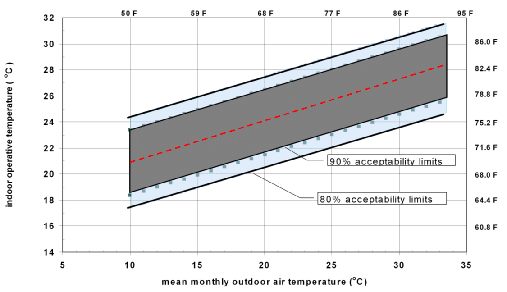

Hybrid Ventilation Controls Enhancements - CO_2 and adaptive temperatures
================

**Lixing Gu **
**Florida Solar Energy Center **

 - 11/21/16,  - Third Edition: Design Document
 - 11/15/16,  - Second Edition
 - 10/17/16  - Original Edition
 

## Justification for New Feature ##

The current EnergyPlus modeling capability for hybrid ventilation controls is based on indoor and outdoor conditions, such as dry bulb temperature, enthalpy, and dew point temperature. Adaptive temperature and carbon dioxide (CO2) levels are currently not available as control parameters for hybrid ventilation controls. The hybrid ventilation controls capabilities in EnergyPlus based on CO2 levels and adaptive temperatures are needed to provide more capabilities in hybrid ventilation controls.

Adaptive temperature can be used to determine acceptable thermal comfort conditions in naturally conditioned spaces, defined as operative temperature in ASHRAE Standard 55-2004. In addition, the adaptive temperature using the adaptive comfort standard may be used for thermal comfort control (Brager and Dear 2001). The main advantage is that occupants of naturally ventilated buildings prefer a wider range of conditions that more closely reflect outdoor climates (Santamouris 2006). It is also possible to use adaptive temperature criteria in hybrid ventilation controls.

One of two main hybrid ventilation applications is to control indoor air quality. Indoor CO2 level is the most promising indicator of air quality in buildings, as well as energy savings. CO2 sensors serve as a surrogate for occupant sensors, and provide the potential for more energy-efficient, demand-controlled ventilation in real buildings (Brager et al. 2007). It is also needed to include CO2 in hybrid ventilation.

## E-mail and  Conference Call Conclusions ##

###Tianzhen Hong###

11/3/16

Lixing,

A great new addition!

Do you plan to enable the 90% acceptability limits as well? Also, it will be good to have the EN adaptive comfort model options.

###Reply###

11/4/16

Tianzhen:

I will add an option for 90% acceptability limits, in addition to proposed 80% acceptability limits.

Thanks.

###Mike Witte###

On 11/10/2016 8:07 AM, Lixing Gu wrote:
> Mike:
>
> I like your suggestion and I also proposed this before. Obviously, this new capability is beyond the original scope. However, as long as time and budget allow, I definitely want to include this one. I don't want to make a promise in the beginning.
>
> I will add this as optional based on time and budget. I propose to add two new optional fields, similar fields available in the AirflowNetwork:OccupantVentilationControl object:
>
>    Nx, \field Minimum HVAC Operation Time
>        \type real
>        \units minutes
>        \minimum 0.0
>        \default 0.0
>    Nx, \field Minimum Ventilation Time
>        \type real
>        \units minutes
>        \minimum 0.0
>        \default 0.0
>
> What do you think?
>
> By the way, I have received comments from you and Tianzhen so far. It seems no major issues. I propose no conference call and would like to invite you as a reviewer assigned in both PivotalTracker and GitHub.
>
> Thanks.
>
> Gu
> -----Original Message-----
> From: Michael J Witte [mailto:mjwitte@gard.com]
> Sent: Wednesday, November 09, 2016 4:46 PM
> To: Lixing Gu <gu@fsec.ucf.edu>
> Subject: Re: [energyplusdevteam] RE: NFP to enhance hybrid ventilation controls - CO_2 and adaptive temperatures
>
> Gu:
>
> This will be useful.  Any chance you could add a field to specify the minimum time between on/off changes?  This would be a general addition that applies to any control mode.
>
> Mike
>

## Overview ##

Both operative temperature and CO2 controls through hybrid ventilation can be accomplished by adding more control options defined in the Ventilation Control Mode Schedule Name field. The operative temperature control is determined internally based on upper and lower 80% and 90% acceptability limits. The CO2 control is based on the CO2 setpoint.

Optional addition will specify the minimum HVAC operation and ventilation times, so that system and ventilation will be allowed to remain the same operation within the minimum operation time. The optional addition will be performed when time and budget allow.

## Approach ##

The acceptable operative temperature ranges using the 80% acceptability limits provided by ASHRAE Std 55-2010 will be used to determine whether either HVAC system or natural ventilation is on or off. 

Acceptable operative temperature ranges for naturally conditioned spaces are listed below.  The upper and lower 80% acceptability limits in degree of C are given in the following equations:

Upper 80 acceptability limit = 0.31 * t_{pma(out)} + 21.3 
Lower 80 acceptability limit = 0.31 * t_{pma(out)} + 14.3 

where t_{pma(out)} = the prevailing mean outdoor air temperature and can be calculated from available weather data. Both limits are available in the CalcThermalComfortAdaptiveASH55 function of the ThermalComfort module.

The upper and lower 90% acceptability limits in degree of C are given in the following equations:

Upper 80 acceptability limit = 0.31 * t_{pma(out)} + 20.3 
Lower 80 acceptability limit = 0.31 * t_{pma(out)} + 15.3

The control logic is that when the zone operative temperature is within the limits, HAVC operation is shut off, and natural ventilation is allowed, and vice versa.  

The CO2 control will check the CO2 level in the controlled zone first. If the CO2 level is above the CO2 setpoint, the control will check the availability of HVAC system (either AirLoop or a zone equipment). If HVAC system is available, the control will allow HVAC system operation first. If not available, natural ventilation is allowed. If the CO2 level is below the setpoint, no action will be taken. 

The control of the minimum HVAC operation and ventilation time will be accomplished by checking accumulated times of either system or ventilation first. When the accumulated time is less than the minimum time specified in the input, the previous control status will be forced, no matter what other conditions changes. In other words, the control will be applied to any control modes.
    
## Testing/Validation/Data Sources ##

Various combinations of test cases will be checked to ensure the outputs of hybrid ventilation control is performed as expected.

## Input Output Reference Documentation ##

\subsection{AvailabilityManager:HybridVentilation}\label{availabilitymanagerhybridventilation}

This availability manager is executed at the start of each HVAC system timestep, before EnergyPlus calculates airflows defined in the objects ZoneInfiltration:*, ZoneVentilation:*, ZoneMixing, and ZoneCrossMixing, and before the AirflowNetwork model calculates multizone airflows. It serves two purposes: 1) prevents simultaneous natural ventilation and HVAC system operation, and 2) allows users to examine various ventilation strategies to maximize natural ventilation in order to reduce heating/cooling loads. The natural ventilation objects controlled by this availability manager have two groups: simple airflow group and AirflowNetwork group. The simple airflow group consists of the ZoneVentilation;* and ZoneMixing objects. The AirflowNetwork group consists of AirflowNetwork:MultiZone:Component:DetailedOpening and AirflowNetwork:MultiZone:Component:SimpleOpening objects used in the AirflowNetwork model. These two groups are not allowed to work simultaneously (see restrictions in the Airflow Network model section). Basically, this object overrides the controls for these opening objects or ZoneVentilation:* and ZoneMixing objects, closing the openings or shutting off ventilation/mixing airflows under certain conditions and allowing the HVAC system (AirLoopHVAC) to operate. If the availability manager determines that conditions are favorable for natural ventilation, then the HVAC system (AirLoopHVAC) is disabled and the opening objects or ventilation/mixing objects are able to operate based on the controls specified for those objects.

Each AirLoopHVAC can have a corresponding hybrid ventilation availability manager. Each hybrid ventilation manager can control natural ventilation in the zones served by the AirLoopHVAC. The hybrid ventilation availability manager is triggered by zone air conditions for the controlled zone specified in an object input field. If there is no air loop, hybrid ventilation manager can still be applied to controlled zone specified in the object. To apply hybrid ventilation manager to the controlled zone not served by any air loop, the HVAC air loop name input field must be left blank. Currently, zone component objects such as unit heater, unit ventilator, packaged terminal air conditioner, packaged terminal heat pump, zone water source heat pump, window air conditioner, variable refrigerant flow, energy recovery ventilator, outdoor air unit, fan coil unit, and ventilated slab can individually use hybrid ventilation managers to make a decision regarding whether their fan should be on or off. Also, hybrid ventilation managers can be applied to zones served by ideal load zone components to turn them off when natural ventilation is active. Currently, hybrid ventilation manager is restricted to one per zone. It can either be applied through the air loop or directly to the zone. If hybrid ventilation manager is applied to an air loop and one of the zones served by the air loop also has hybrid ventilation manager, then zone hybrid ventilation manager is disabled. Presently, this availability manager must be used either with the ZoneVentilation:* and ZoneMixing objects or with the AirflowNetwork model.

The inputs for this availability manager consist of the name for the air loop (AirLoopHVAC) being controlled, the controlled zone name to determine which zone air conditions are used to determine system availability, a ventilation control mode schedule, maximum wind speed and rain indicator to determine whether natural ventilation is allowed or not, a low limit and high limit for dry-bulb temperature, enthalpy and dewpoint temperature to determine the hybrid ventilation control, and a minimum outdoor air ventilation schedule. The Opening Factor Function of Wind Speed Curve allows user to use a wind speed modifier to adjust openness when the AirflowNetwork opening objects are selected. The other inputs include how to control simple airflow objects and AirflowNetwork opening objects. **The operative temperature and zone air CO2 are also allowed to control natural ventilation. The minimum HVAC system operation and natural ventilation time fields will provide users with more flexibility to force any operation model to remain the same status within minimum time duration.**

The hybrid ventilation availability manager works independently of all other system availability manager objects, so this manager is not a valid system availability manager type in the AvailabilityManagerAssignmentList object.

\subsubsection{Inputs}\label{inputs-10-021}

\paragraph{Field: Name}\label{field-name-9-018}

A unique, user-assigned name for an instance of a hybrid ventilation availability manager. Other objects that use this availability manager will reference it by this name.

\paragraph{Field: HVAC Air Loop Name}\label{field-hvac-air-loop-name-000}

The name of the air loop (AirLoopHVAC object) to be controlled by this system availability manager. If this field is left blank, hybrid ventilation manager will be applied to the controlled zone specified in the field below.

\paragraph{Field: Control Zone Name}\label{field-controlled-zone-name}

The name of a controlled zone served by the air loop defined in the previous field. The air conditions in this zone are used to determine if natural ventilation should be provided.

\paragraph{Field: Ventilation Control Mode Schedule Name}\label{field-ventilation-control-mode-schedule-name}

The name of a schedule defined elsewhere in the input file. This schedule determines whether or not for a given time the hybrid ventilation control mode is to be applied. Schedule values equal to zero indicate no ventilation control, resulting in natural ventilation and HVAC system operation being performed based on their own controls. Schedule values equal to one denote temperature control for either cooling or heating, which is determined internally based on thermostat set point and temperature control type. The temperature control is restricted between the minimum and maximum outdoor temperatures provided in two additional input fields (below). Schedule values equal to two denote enthalpy control, which is restricted between minimum and maximum outdoor enthalpy values given in two additional input fields (below). Schedule values equal to three denote dewpoint control for either dehumidification or humidification. Schedule values equal to four represent outdoor ventilation air control. The outdoor ventilation air control works with AirflowNetwork opening objects only, and is not allowed to work with ZoneVentilation:* and ZoneMixing objects. **Schedule values equal to five represent operative temperature control using 80% acceptability limits. If the operative temperature is within the upper and lower 80% acceptability limits specified in ASHRAE Standard 55-2010, the natural ventilation is allowed, and HVAC operation is forced off. If the operative temperature is beyond the upper and lower limits, HVAC system operation is allowed, and the natural ventilation is shut off. Schedule values equal to six also represent operative temperature control using 90% acceptability limits. If the operative temperature is within the upper and lower 90% acceptability limits specified in ASHRAE Standard 55-2010, the natural ventilation is allowed, and HVAC operation is forced off. If the operative temperature is beyond the upper and lower limits, HVAC system operation is allowed, and the natural ventilation is shut off. 
Schedule values equal to seven represent carbon dioxide (CO_2) control. If the zone CO_2 level is above the setpoint, the program will check the HVAC system availability first. If available, HVAC operation will be allowed, and natural ventilation is shut off. If the system is not available, the natural ventilation will be allowed.**

The detailed control logic is given in the EnergyPlus Engineering Reference.

\paragraph{Field: Use Weather File Rain Indicators}\label{field-use-weather-file-rain-indicators-000}

This logical alpha field indicates whether or not the rain indicator is used to shut off natural ventilation or not. The valid choices for Rain Indicator are Yes and No, with the default being Yes. This can help simulate conditions where one would normally close windows to avoid rain penetration in a space. Any possible rain getting into a space will not be counted as a zone load.

\paragraph{Field: Maximum Wind Speed}\label{field-maximum-wind-speed-000}

This is the wind speed (m/s) above which hybrid ventilation is shut off. This can help simulate conditions where one would normally close windows to avoid wind problems in a space (papers blowing around, etc).

\paragraph{Field: Minimum Outdoor Temperature}\label{field-minimum-outdoor-temperature-000}

This is the outdoor temperature (in Celsius) below which hybrid ventilation is shut off when the ventilation control mode = 1 (Temperature). This lower temperature limit is intended to avoid overcooling a space, which could result in a heating load.

\paragraph{Field: Maximum Outdoor Temperature}\label{field-maximum-outdoor-temperature-000}

This is the outdoor temperature (in Celsius) above which hybrid ventilation is shut off when the ventilation control mode = 1 (Temperature). This upper temperature limit is intended to avoid overheating a space, which could result in a cooling load.

\paragraph{Field: Minimum Outdoor Enthalpy}\label{field-minimum-outdoor-enthalpy}

This is the outdoor enthalpy (in J/kg) below which hybrid ventilation is shut off when the ventilation control mode = 2 (Enthalpy).

\paragraph{Field: Maximum Outdoor Enthalpy}\label{field-maximum-outdoor-enthalpy}

This is the outdoor enthalpy (in J/kg) above which hybrid ventilation is shut off when the ventilation control mode = 2 (Enthalpy).

\paragraph{Field: Minimum Outdoor Dewpoint}\label{field-minimum-outdoor-dewpoint}

This is the outdoor dewpoint (in Celsius) below which hybrid ventilation is shut off when the ventilation control mode = 3 (Dewpoint). This lower dewpoint temperature limit is intended to avoid dehumidifying a space.

\paragraph{Field: Maximum Outdoor Dewpoint}\label{field-maximum-outdoor-dewpoint}

This is the outdoor dewpoint temperature (in Celsius) above which hybrid ventilation is shut off when the ventilation control mode = 3 (Dewpoint). This upper dewpoint temperature limit is intended to avoid humidifying a space.

\paragraph{Field: Minimum Outdoor Ventilation Air Schedule Name}\label{field-minimum-outdoor-ventilation-air-schedule-name}

The name of a schedule defined elsewhere in the input file. This field applies only if Ventilation Control Mode = 4 (Outdoor Ventilation Air Control). This schedule determines the minimum outdoor ventilation air for a given time in the units of air change per hour (ACH). The program calculates the natural (outdoor) ventilation in the controlled zone first and compares the amount of outdoor air introduced by opening windows or doors and other small openings to this minimum value. If the amount of outdoor air from natural ventilation is less than the minimum value, the natural ventilation is shut off (i.e., the window or door openings are closed) and the HVAC system may operate if needed. Otherwise, the natural ventilation is on and the HVAC system is shut off. The amount of outdoor ventilation air entering the controlled zone is determined as air from outdoors and not from other adjacent zones. Therefore, this option is only applied to a zone having a window or door exposed to outdoors.

\paragraph{Field: Opening Factor Function of Wind Speed Curve Name}\label{field-opening-factor-function-of-wind-speed-curve-name}

The name of a linear or quadratic performance curve (ref: Performance Curves) that parameterizes the variation of opening factor as a function of outdoor wind speed. The output of this curve is multiplied by the opening factor of opening objects to give the final openness. This field only works with the AirflowNetwork opening objects.

\paragraph{Field: AirflowNetwork Control Type Schedule Name}\label{field-airflownetwork-control-type-schedule-name}

The name of a schedule defined elsewhere in the input file. This field works with the AirflowNetwork opening objects only. This schedule determines for a given simulation timestep how the opening objects respond to the hybrid ventilation control when the hybrid ventilation control allows the objects to operate.

Schedule values equal to zero indicate individual ventilation control based on the control requirements specified for each individual AirflowNetwork opening object. Schedule values equal to one denote group control. The opening objects exposed to outdoors in the controlled zone served by the primary air loop (Ref. Field HVAC Air Loop Name ) will be considered as a master to provide group control.

\paragraph{Field: Simple Airflow Control Type Schedule Name}\label{field-simple-airflow-control-type-schedule-name}

The name of a schedule defined elsewhere in the input file. This field works with ZoneVentilation:* and ZoneMixing objects only. This schedule determines for a given simulation timestep how the ZoneVentilation:* and ZoneMixing objects respond to the hybrid ventilation control when the hybrid ventilation control allows the objects to operate.

Schedule values equal to zero indicate the individual ventilation control based on the control requirements from their own objects. Schedule values equal to one denote group control. The ZoneVentilation:* and ZoneMixing objects in the zones served by the primary air loop defined in a previous input field (Ref. Field HVAC Air Loop Name ) are controlled by a single object, whose name is provided in the following input field.

\paragraph{Field: ZoneVentilation Object Name}\label{field-zoneventilation-object-name}

The name of a ZoneVentilation:* object whose zone name is the controlled zone name defined in a previous input field for this availability manager object (Ref. Field Controlled Zone Name ). The controls defined for this specific ZoneVentilation:* object to enable ventilation air will be applied to other ZoneVentilation:* and ZoneMixing objects served by the air loop controlled by this availability manager, regardless of the controls defined for the other ZoneVentilation:* and ZoneMixing objects. In other words, when ventilation is enabled by this specific ZoneVentilation:* object, the other ZoneVentilation:* and ZoneMixing objects in the zones served by the primary air loop are also enabled.

\textbf{Note:} A \textbf{ZoneInfiltration:*} object indicates any one of \textbf{ZoneInfiltration:DesignFlowRate}, \textbf{ZoneInfiltration:EffectiveLeakageArea},and \textbf{ZoneInfiltration:FlowCoefficient} objects.A object of\textbf{ZoneVentilation:*} indicates any one of \textbf{ZoneVentilation:DesignFlowRate} and \textbf{ZoneVentilation:WindandStackOpenArea} objects.

####Minimum HVAC Operation Time ####
**
The field represents the minimum time that HVAC system operation will be allowed. If accumulated system operation time is less than this value, the system operation status will be forced regardless of other operation conditions, and natural ventilation will shut off.
**

####Minimum Ventilation Time ####
**
The field represents the minimum time that natural ventilation will remain. If accumulated ventilation time is less than this value, the natural ventilation will be forced regardless of other operation conditions.
**

An example of this object in an input file:

\begin{lstlisting}

AvailabilityManager:HybridVentilation,
  Hybrid ventilation controller 1,  !- Name
  Typical Terminal Reheat 1,  !- HVAC Air Loop Name
  NORTH ZONE,              !- Control Zone Name
  Hybrid Control Mode Schedule,  !- Ventilation Control Mode Schedule Name
  Yes,                     !- Use Weather File Rain Indicators
  40.0,                    !- Maximum Wind Speed {m/s}
  15.0,                    !- Minimum Outdoor Temperature {C}
  35.0,                    !- Maximum Outdoor Temperature {C}
  20000.0,                 !- Minimum Outdoor Enthalpy {J/kg}
  30000.0,                 !- Maximum Outdoor Enthalpy {J/kg}
  15.0,                    !- Minimum Outdoor Dewpoint {C}
  30.0,                    !- Maximum Outdoor Dewpoint {C}
  Outdoor air Schedule;    !- Minimum Outdoor Ventilation Air Schedule Name
\end{lstlisting}

\subsubsection{Outputs}\label{outputs-9-008}

The hybrid ventilation availability manager has two output variables.

HVAC,Average,Availability Manager Hybrid Ventilation Control Mode {[]}

HVAC,Average,Availability Manager Hybrid Ventilation Control Status {[]}

\paragraph{Availability Manager Hybrid Ventilation Control Mode {[]}}\label{availability-manager-hybrid-ventilation-control-mode}

This is the hybrid ventilation control mode given in the Ventilation Control Mode Schedule.

\paragraph{Availability Manager Hybrid Ventilation Control Status {[]}}\label{availability-manager-hybrid-ventilation-control-status}

This is the hybrid ventilation control status, which can have three integer values: 0, 1, and 2. A zero value indicates no hybrid ventilation control, corresponding to zero value defined in the previous output variable. A value of one indicates that natural ventilation is allowed. A value of two denotes that the natural ventilation is not allowed, so all window/door openings are closed.

## Input Description ##

	AvailabilityManager:HybridVentilation,
       \min-fields 13
       \memo Depending on zone and outdoor conditions overrides window/door opening controls
       \memo to maximize natural ventilation and turn off an HVAC system when ventilation control
       \memo conditions are met.
       \memo This object (zone ventilation object name) has not been instrumented to work with
       \memo global Zone or Zone List names option for Ventilation:DesignFlowRate.  In order to
       \memo use, you must enter the single <Ventilation:DesignFlowRate> name in that
       \memo field. If it is a part of a global ventilation assignment the name will be
       \memo <Zone Name> <global Ventilation:DesignFlowRate> name.
       \memo Currently, hybrid ventilation manager is restricted to one per zone. It can either be applied
       \memo through the air loop or directly to the zone. If hybrid ventilation manager is applied to an
       \memo air loop and one of the zones served by that air loop also has hybrid ventilation manager,
       \memo then zone hybrid ventilation manager is disabled.
  	A1 , \field Name
       \required-field
       \type alpha
       \reference SystemAvailabilityManagers
  	A2 , \field HVAC Air Loop Name
       \note Enter the name of an AirLoopHVAC or HVACTemplate:System:* object.
       \type object-list
       \object-list AirPrimaryLoops
       \object-list HVACTemplateSystems
       \note If this field is left blank, hybrid ventilation managers will be
       \note simulated for zone equipment control
  	A3 , \field Control Zone Name
       \required-field
       \type object-list
       \object-list ZoneNames
       \note the zone name should be a zone where a thermostat or humidistat is located
       \note served by an air primary loop.
  	A4 , \field Ventilation Control Mode Schedule Name
       \required-field
       \type object-list
       \object-list ScheduleNames
       \note The Ventilation control mode contains appropriate integer control types.
       \note 0 - uncontrolled (Natural ventilation and HVAC system are controlled by themselves)
       \note 1 = Temperature control
       \note 2 = Enthalpy control
       \note 3 = Dewpoint control
       \note 4 = Outdoor ventilation air control
**
       \note 5 = Operative temperature control with 80% acceptability limits
       \note 6 = Operative temperature control with 90% acceptability limits
       \note 7 = Carbon dioxide control
**

  	A5 , \field Use Weather File Rain Indicators
       \type choice
       \key Yes
       \key No
       \default Yes
       \note If Yes, ventilation is shutoff when there is rain
       \note If No, there is no rain control
 	N1 , \field Maximum Wind Speed
       \type real
       \units m/s
       \minimum 0.0
       \maximum 40.0
       \default 40.0
       \note this is the wind speed above which ventilation is shutoff
  	N2 , \field Minimum Outdoor Temperature
       \note this is the outdoor temperature below which ventilation is shutoff
       \units C
       \type real
       \minimum -100
       \maximum 100
       \default -100
  	N3 , \field Maximum Outdoor Temperature
       \note this is the outdoor temperature above which ventilation is shutoff
       \units C
       \type real
       \minimum -100
       \maximum 100
       \default 100
  	N4 , \field Minimum Outdoor Enthalpy
       \note this is the outdoor Enthalpy below which ventilation is shutoff
       \units J/kg
       \type real
       \minimum> 0.0
       \maximum< 300000.0
  	N5 , \field Maximum Outdoor Enthalpy
       \note this is the outdoor Enthalpy above which ventilation is shutoff
       \units J/kg
       \type real
       \minimum> 0
       \maximum< 300000.0
  	N6 , \field Minimum Outdoor Dewpoint
       \note this is the outdoor temperature below which ventilation is shutoff
       \units C
       \type real
       \minimum -100
       \maximum 100
       \default -100
       \note Applicable only if Ventilation Control Mode = 3
  	N7 , \field Maximum Outdoor Dewpoint
       \note this is the outdoor dewpoint above which ventilation is shutoff
       \units C
       \type real
       \minimum -100
       \maximum 100
       \default 100
       \note Applicable only if Ventilation Control Mode = 3
  	A6 , \field Minimum Outdoor Ventilation Air Schedule Name
       \type object-list
       \object-list ScheduleNames
       \note Used only if Ventilation Control Mode = 4
  	A7 , \field Opening Factor Function of Wind Speed Curve Name
       \type object-list
       \object-list LinearOrQuadraticCurves
       \object-list UniVariateTables
       \note linear curve = a + b*WS
       \note quadratic curve = a + b*WS + c*WS**2
       \note WS = wind speed (m/s)
  	A8 , \field AirflowNetwork Control Type Schedule Name
       \type object-list
       \object-list ScheduleNames
       \note The schedule is used to incorporate operation of AirflowNetwork large opening
       \note objects and HVAC system operation.
  	A9 , \field Simple Airflow Control Type Schedule Name
       \type object-list
       \object-list ScheduleNames
       \note The schedule is used to incorporate operation of simple airflow objects and HVAC
       \note system operation.
       \note The simple airflow objects are Ventilation and Mixing only
  	A10, \field ZoneVentilation Object Name
       \note This field has not been instrumented to work with
       \note global Zone or Zone List names option for Ventilation:DesignFlowRate.  In order to
       \note use, you must enter the single <Ventilation:DesignFlowRate> name in this field.
       \note If it is a part of a global ventilation assignment the name will be
       \note <Zone Name> <global Ventilation:DesignFlowRate> name.
       \type object-list
       \object-list VentilationNames
       \note The other ZoneVentilation:* and ZoneMixing objects controlled in the same AirLoopHVAC
       \note will work in the same way as this ventilation object.
**
    N8 , \field Minimum HVAC Operation Time**

        \type real
        \units minutes
        \minimum 0.0
        \default 0.0
**
    N9 ; \field Minimum Ventilation Time **

        \type real
        \units minutes
        \minimum 0.0
        \default 0.0

## Outputs Description ##

NA

## Engineering Reference ##

\subsection{Hybrid Ventilation Control}\label{hybrid-ventilation-control}

The input object AvailabilityManager:HybridVentilation serves two purposes: 1) it prevents simultaneous natural ventilation and HVAC system operation, and 2) it allows users to examine various strategies to maximize natural ventilation in order to reduce heating/cooling loads. This availability manager works with either the AirflowNetwork model or the simple airflow objects to provide controlled natural ventilation. The controlled natural ventilation objects referred to here are either AirflowNetwork:Multizone:ComponentDetailedOpening and AirflowNetwork:Multizone:ComponentSimpleOpening objects, or ZoneVentilation and ZoneMixing objects. The simple airflow objects are not allowed to work with the AirflowNetwork objects simultaneously. If there is no air loop, this availability manager can still be applied to controlled zone specified in the object. In order to apply hybrid ventilation manager to the controlled zone not served by any air loop, the HVAC air loop name input field must be left blank. Currently, zone component objects such as unit heater, unit ventilator, packaged terminal air conditioner, packaged terminal heat pump, zone water source heat pump, window air conditioner, variable refrigerant flow, energy recovery ventilator, outdoor air unit, fan coil unit, and ventilated slab can individually use hybrid ventilation managers to make a decision regarding whether their fan should be on or off. Also, hybrid ventilation manager can be applied to zones served by the ideal load zone component to turn them off when natural ventilation is active. Currently, hybrid ventilation manager is restricted to one per zone. It can either be applied through the air loop or directly to the zone. If hybrid ventilation manager is applied to an air loop and one of the zones served by the air loop also has hybrid ventilation manager, then zone hybrid ventilation manager is disabled. This availability manager performs somewhat differently from the other availability managers:

n~This availability manager is called before the program estimates (predicts) the cooling or heating load that needs to be met by the cooling/heating systems for the simulation time step. On the other hand, the other availability managers are called after the system cooling/heating load prediction. The main reason for calling AvailabilityManager:HybridVentilation early is that this manager determines whether natural ventilation is allowed or not, and the loads from natural ventilation are used to predict system loads.

n~This availability manager has its own control schedule and does not work in tandem with \emph{AvailabilityManager:Scheduled}.

n~AvailabilityManager:HybridVentilation works completely independent of the other system availability managers, so this manager is not a valid system availability manager type in the AvailabilityManagerAssignmentList object.

\subsubsection{Control logic}\label{control-logic-000}

The control logic for each ventilation control mode is described below.

\subsubsection{Temperature control}\label{temperature-control}

This control mode checks whether the outdoor air dry-bulb temperature is between the Minimum Outdoor Temperature and Maximum Outdoor Temperature specified. If the outdoor temperature is between the two values then natural ventilation is allowed, else natural ventilation is not allowed.

When natural ventilation is allowed, the control then checks the temperature difference between the zone temperature and the temperature setpoint(s) in the controlled zone based on the specified temperature control type (four available temperature control types) to make a final decision:

\emph{Single Heating Setpoint:}

If the zone temperature is below the setpoint, then the initial decision is overridden and natural ventilation is not allowed. This is intended to avoid overcooling a space, which could result in additional heating load.

\emph{Single Cooling Setpoint:}

If the zone temperature is above the setpoint, then the initial decision is overridden and natural ventilation is not allowed. This is intended to avoid overheating a space, which could result in additional cooling load.

\emph{Single Heating Cooling Setpoint:}

Since this temperature control type requires only a single setpoint, natural ventilation is not allowed. A recurring warning message is issued.

\emph{Dual Setpoint with DeadBand:}

If the zone temperature is beyond the deadband, the initial decision is overridden and natural ventilation is not allowed. This is intended to avoid either overcooling a space, which could result in additional heating load when the zone temperature is below the heating setpoint, or overheating a space, which could result in additional cooling load when the zone temperature is above the cooling setpoint.

\subsubsection{Enthalpy control}\label{enthalpy-control}

This control mode checks whether the outdoor air enthalpy is between the Minimum Outdoor Enthalpy and Maximum Outdoor Enthalpy specified. If the outdoor enthalpy is between the two values then natural ventilation is allowed, else natural ventilation is not allowed.

When natural ventilation is allowed, the control then checks the temperature difference between the zone temperature and the temperature setpoint(s) in the controlled zone based on the specific temperature control type to make a final decision. This procedure is the same as defined above for the temperature control mode.

\emph{Single Heating Setpoint:}

If the zone temperature is below the setpoint, then the initial decision is overridden and natural ventilation is not allowed. This is intended to avoid overcooling a space, which could result in additional heating load.

\emph{Single Cooling Setpoint:}

If the zone temperature is above the setpoint, then the initial decision is overridden and natural ventilation is not allowed. This is intended to avoid overheating a space, which could result in additional cooling load.

\emph{Single Heating Cooling Setpoint:}

Since this temperature control type requires only a single setpoint, natural ventilation is not allowed. A recurring warning message is issued.

\emph{Dual Setpoint with DeadBand:}

If the zone temperature is beyond the deadband, then the initial decision is overridden and natural ventilation is not allowed. This is intended to avoid either overcooling a space, which could result in additional heating load when the zone temperature is below the heating setpoint, or overheating a space, which could result in additional cooling load when the zone temperature is above the cooling setpoint.

\subsubsection{Dew-Point Control}\label{dew-point-control}

This control mode checks whether the outdoor air dewpoint temperature is between the Minimum Outdoor Dew-Point and Maximum Outdoor Dew-Point specified. If the outdoor dewpoint temperature is between the two values then natural ventilation is allowed, else national ventilation is not allowed.

When natural ventilation is allowed and a humidistat is available in the controlled zone, the control then checks the humidity ratio difference between the zone air humidity ratio and humidistat setpoint in the controlled zone to make a final decision. It should be pointed out that the humidistat object provides the setpoint of relative humidity, the value of relative humidity has to be converted into the setpoint of humidity ratio using the actual zone air temperature for comparison. Since the humidistat only provides a single value for relative humidity, there are two possible scenarios:

If the actual zone air humidity ratio is below the humidity ratio setpoint and the controlled zone needs humidification as the first scenario, then the initial decision is overridden and natural ventilation is not allowed. This is intended to avoid dehumidifying a space, which could result in additional humidification load.

If the actual zone air humidity ratio is above the humidity ratio setpoint and the controlled zone needs dehumidification as the second scenario, then the initial decision is overridden and natural ventilation is not allowed. This is intended to avoid humidifying a space, which could result in additional dehumidification load.

**
\subsubsection{Operative Temperature Control with 80% Acceptability Limits}\label{operative-temperature-control-with-80-acceptability-limits}**

**
This control mode checks whether the zone air operative temperature is between the lower and upper 80% acceptability limits or not. If the zone air operative temperature is between the lower and upper limits, then natural ventilation is allowed, else natural ventilation is not allowed.
**

**
\subsubsection{Operative Temperature Control with 90% Acceptability Limits}\label{operative-temperature-control-with-90-acceptability-limits}**

**
This control mode checks whether the zone air operative temperature is between the lower and upper 90% acceptability limits or not. If the zone air operative temperature is between the lower and upper limits, then natural ventilation is allowed, else natural ventilation is not allowed.
**

**
\subsubsection{CO2 control}\label{co2-control}
**

**
This control mode checks whether the zone air CO2 concentration level is above the CO2 setpoint or not. If the zone air CO2 concentration level is above the setpoit, the control checks availability of HVAC system. If available, The available status will be ForceOn. If not available, natural vential will be allowed. 
**

\subsubsection{Outdoor ventilation air control}\label{outdoor-ventilation-air-control}

This control mode does not require any additional checks. The control only works with Airflow Network opening objects only, and is not allowed to work with ZoneVentilation and ZoneMixing objects.

\subsubsection{Availability Status}\label{availability-status}

After the hybrid ventilation control determines whether natural ventilation is allowed or not, the availability status flag is set as follows:

If \emph{Natural Ventilation} then

\emph{AvailStatus} = \emph{CycleOn}

Else

\emph{AvailStatus = ForceOn}

## Example File and Transition Changes ##

No transition is required.

An existing example file will be modified to accommodate the proposed enhancements. 

## References ##

ASHRAE, Standard 55-2010, Thermal Environmental Conditions for Human Occupancy

Brager, G., S. Borgeson, & Y. S. Lee, 2007, “Summary Report: Control Strategies for Mixed-Mode Buildings,” Center for the Built Environment, University of California, Berkeley

Santamouris, M, 2006, “Adaptive Thermal Comfort and Ventilation,” Ventilation Information Paper, n 12, AIVC, June, 2006

Brager, G.S., and R.J. de Dear, 2001. “Climate, Comfort & Natural Ventilation: A new adaptive comfort standard for ASHRAE Standard 55.” Proceedings, Moving Thermal Comfort Standards into the 21st Century, Windsor, UK, April 2001.

##Design Document ##

This new feature will revise SystemAvailabilityManager module.

### Add 4 members in struct DefineHybridVentSysAvailManager

Four members will be added in the struct DefineHybridVentSysAvailManager:

		Real64 MinOperTime( 0.0 ); // Minimum HVAC Operation Time
		Real64 MinVentTime( 0.0 ); // Minimum Ventilation Time
		Real64 TimeOperDuration( 0.0 ); // Time duration with continuous HVAC operation
		Real64 TimeVentDuration( 0.0 ); // Time duration with continuous ventilation
 

### GetHybridVentilationInputs

A section will be revised to handle new choices form the Ventilation Control Mode Schedule Name field and read two more optional fields. Error checks will be performed.    

### InitHybridVentSysAvailMgr

#### Update two variables 

TimeOperDuration and TimeVentDuration are updated based on time duration at every time step. The update procedures are very similar to OpenElapsedTime and CloseElapsedTime in the occupant ventilation control in the AirflowNetworkBalanceManager module.

#### Check minimum time operation to determine if the previous status remains or not  

If either of TimeOperDuration or TimeVentDuration is less than the minimum time, the status at the previous time step will be kept and No call to CalcHybridVentSysAvailMgr is needed.     

### CalcHybridVentSysAvailMgr

#### Operative temperature check

When the schedule value of Ventilation Control Mode Schedule is equal to either 5 or 6, operative temperature will be checked. If the operative temperature is between the low and high acceptability limits, natural ventilation will be allowed. Otherwise, HVAC system operation is allowed.

#### CO2 check

When the schedule value of Ventilation Control Mode Schedule is equal to 7, CO2 check will be performed. If the CO2 level is less than the CO2 setpoint, no action will be taken. Otherwise, either HVAC operation or natural ventilation will be allowed. 
