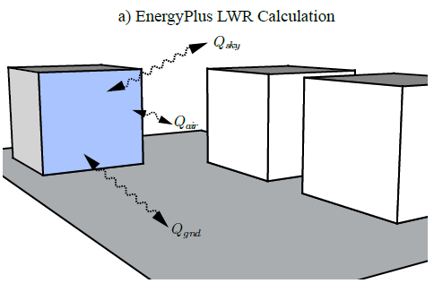
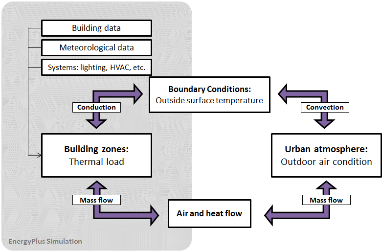
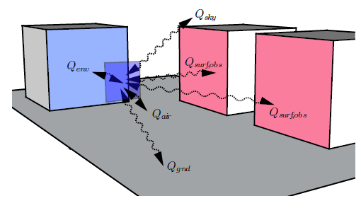
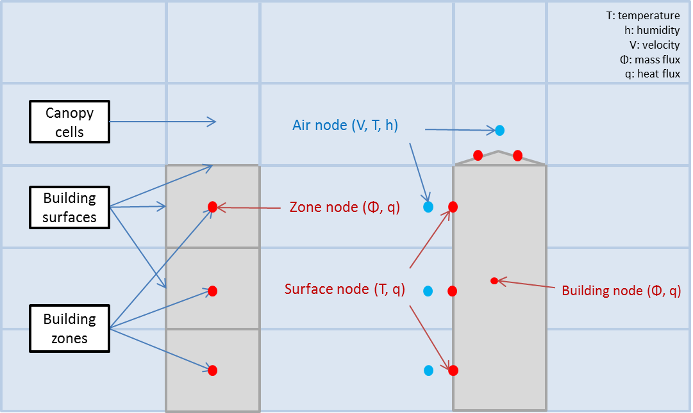

Improving Building Energy Simulation in an Urban Context
================
**Tianzhen Hong, Xuan Luo, LBNL**

**Original: May 23, 2017**

**Revision 1: July 18, 2017**

**Revision 2: July 25, 2017**

**Revision 3: July 26, 2017**

# Justification for New Feature 

Building energy efficiency is getting greater attention in urban planning and city GHG emissions reduction. Energy performance in buildings affects the development of energy standards and policies that address energy-related issues at urban scales. In an urban context, the urban climate and microclimate can strongly affect the building energy demand. The urban microclimate is determined by (i) local air velocity, temperature and humidity; (ii) solar irradiation and specular and diffuse reflections; (iii) surface temperatures of building and ground, and the respective long-wave radiation exchange, also with the sky. As more urban context data related to the basic building information, mutual shading, and microclimate are collected and synthesized in the GIS platforms, allowing the community to city scale building energy modeling and simulation, the simulation engine itself also requires enhancements in terms of accuracy and performance to suit simulations in an urban context. 

We propose enhancements in several areas to improve the use of EnergyPlus for urban scale building energy modeling and simulation, including (1) external shading, (2) heat exchange between buildings, (3) urban micro-climate. The proposed enhancement intends to enable external links of EnergyPlus simulations to support importing local environmental data from external calculations.  

# Team Discussion so far

The EnergyPlus development team has provided constructive comments on methodology and implementation details over several rounds of discussions, as summarized in the Email Comments. A conference call was conducted on July 13, 2017, to discuss the NFP focusing on the design of IDD objects and consistency of implementation.

# Overview 

Urban energy modeling is an emerging field that seeks to model a group of buildings and the surrounding urban context. As justified, we propose this new feature to focus on three tasks.

### Task 1 - Enhancement for External Shading Calculation

Solar shading affects energy use in a building by reducing the solar heat gains received by opaque surfaces or the transmitted and absorbed solar radiation of windows. External shading also influences daylighting level in a room and the view to the exterior. Accurate calculation of solar shading on building exterior surfaces is of great importance in whole building energy simulation. Modeling a building in the urban context may involve many shading surfaces from adjacent buildings for a target building, which can significantly slow down EnergyPlus simulations due to the currently implemented shading calculation algorithms. Furthermore, for urban building energy simulation which involves many buildings, there can be more efficient ways to do the shading calculations than the current way of doing shading calculations for every building separately in EnergyPlus. There is also the potential of using GPU and other parallel computing techniques for building shading calculations.

Various simulation tools, such as Radiance and Daysim, employing state-of-the-art ray-tracing simulation techniques, can be used to pre-calculate the shading fractions for each exterior building surface. However, in the current implementation, EnergyPlus doesn’t allow overriding exterior shading calculations with external data either by EMS or co-simulation interface. Considering a large amount of information and the complexity of calculating the dynamic shading in EnergyPlus, allowing this external input would enable a huge potential to speed up EnergyPlus in urban-scale simulations. Another benefit is to enable reusing the shading results for parametric runs which usually do not change external shading. Adding this feature to EnergyPlus would also allow OpenStudio to run radiance simulations before the EnergyPlus simulation and to reuse the radiance calculations for shading. 

### Task 2 - Modeling Long-wave Radiant Heat Exchange between Buildings

Heat exchange between buildings is one key factor in understanding energy flows at the urban scale, including the long-wave radiant heat exchange between exterior surfaces of buildings, and between exterior surfaces of buildings and shades. However, these heat exchanges are over-simplified in EnergyPlus, causing potential under or over-estimate of exterior surface temperature. In EnergyPlus, the long-wave radiant heat exchange for a surface is calculated through the summation of the long-wave radiation gain from the ground, sky, and air (Figure 1). A major assumption of this approach is that the modeled building's surfaces and those of adjacent buildings are at a uniform temperature and the long-wave radiant exchange is negligible – an oversimplification in an urban context where urban canyon effect can be significant. 

***Figure 1 Illustration of EnergyPlus long-wave radiation heat exchange calculation***

We propose to modify the heat balance of the building’s exterior surfaces to explicitly consider their long-wave radiant heat exchange. The long-wave radiant exchange between a building’s exterior surfaces and shading surfaces can also be considered if their temperatures are known (user input).

Computational Fluid Dynamic (CFD) tools, simulating urban micro-climate, would need inputs of the building surface temperatures as boundary conditions. Thus CFD-based urban climate tools can be coupled with EnergyPlus for an integrated energy simulation. This is a very important subject in urban building energy modeling, considering the urban canyon effect and urban heat island effect, which also influences the building’s energy demand and indoor occupant thermal comfort.

### Task 3 - Enhancement for Simulation using Urban Microclimate Conditions

The microclimate around a building, established through the interactions with other buildings or the natural environment, is a significant factor influencing building energy consumption. On the one hand, the energy consumption of urban buildings is affected by the surrounding microclimate which differs from standard weather data, and the mutual obstructions between buildings which decrease sunlight and wind potentials for internal solar gains and passive cooling. On the other hand, the building construction itself affects both outdoor and indoor microclimate. As Figure 2 shows, the building model in EnergyPlus serves as the boundary condition in the urban atmosphere model, and the building exchanges mass (air flow) and heat with the surrounding environment, including exhaust air from fans, DX condensing units, cooling towers, boilers, etc. 

***Figure 2 EnergyPlus data exchange with urban microclimate model***

The current implementation of EnergyPlus assumes a default vertical temperature gradient. It does not provide a direct link to allow data exchange with urban microclimate models to override local environmental data at the zone and surface levels, such as the outdoor air temperature, humidity, wind speed and direction. We propose to modify the existing implementation of External Node in EnergyPlus to allow inputs and outputs of these local environmental variables. This would enable the co-simulation of the interaction between buildings and the urban micro-climate using Schedule inputs or EMS actuators.

Please note this new feature proposal enables the local outdoor air conditions used for the calculations of heat and mass balances at the exterior surfaces and zones level, as well as for the air system calculations (e.g., outdoor air entering the AHUs). 

# Approaches 

Throughout the EnergyPlus implementation, we could extend external links to support importing local environmental data from external calculations at surface and zone levels. To allow this, we would add a new surface property object **SurfaceProperty:LocalEnvironment** to the EnergyPlus IDD file, which links to a surface object **Surface:Detailed**. We would also add a zone property **ZoneProperty:LocalEnvironment** which links to a zone object. The surface and zone property objects can be defined when there’s a need to calculate local environmental data externally and import them into the simulation to override existing environmental data, including external solar shading fractions, local air velocity, temperature and humidity, and surrounding surface temperatures and view factors.

	New IDD objects proposed:

	SurfaceProperty:LocalEnvironment
	   A1, \field Name
	       \required-field
	       \type alpha
	       \reference SurfaceLocalEnvironmentNames
	   A2, \field Exterior Surface Name
	       \type object-list
	       \object-list SurfaceNames
	       \note Enter the name of an exterior surface object
	   A3, \field External Shading Fraction Schedule Name
	       \type object-list
	       \object-list ScheduleNames
	       \note Enter the name of a Schedule object
	   A4, \field Surrounding Surfaces Object Name
	       \type object-list
	       \object-list SurroundingSurfacesNames
	       \note Enter the name of a SurfaceProperty:SurroundingSurfaces object
	   A5; \field Outdoor Air Node Name
	       \type object-list
	       \object-list OutdoorAirNodeNames
	       \note Enter the name of an OutdoorAir:Node object
	
	ZoneProperty:LocalEnvironment
	   A1, \field Name
	       \required-field
	       \type alpha
	       \reference ZoneLocalEnvironmentNames
	   A2, \field Zone Name
	       \type object-list
	       \object-list ZoneNames
	       \note Enter the name of a zone object
	   A3; \field Outdoor Air Node Name
	       \type object-list
	       \object-list OutdoorAirNodeNames
	       \note Enter the name of an OutdoorAir:Node object

The **SurfaceProperty:LocalEnvironment** object links to three optional objects including a **Schedule:File** object declared by **Field: External Shading Fraction Schedule Name**, a **SurfaceProperty:SurroundingSurfaces** object declared by **Field: Surrounding Surfaces Object Name**, and an **OutdoorAir:Node** object declared by **Field: Outdoor Air Node Name**. The two new property objects provide inputs to calculate shading, solar radiation, zone air balance and surface exterior heat balance. The detailed implementation and calculation methods are illustrated as follows.

The **ZoneProperty:LocalEnvironment** object links to an optional **OutdoorAir:Node** object declared by **Field: Outdoor Air Node Name**. The reference local outdoor air node provides ambient conditions for the calculation of infiltration and ventilation at the zone level.

### (1)	External Shading Fraction Schedule for external shading calculation

We propose to set a global flag of external shading calculation and manage the data reading and writing at one time. We would add three fields to the existing **ShadowCalculation** object as listed below. The new A4 **Field: External Shading Calculation Method** has two options, namely **ScheduledShadingand InternalCalculation**. The field indicates whether the external shading is pre-calculated and imported as schedules, which overwrite the EnergyPlus calculated array *SunlitFrac*. If **ScheduledShading** is chosen, all external shading calculation would be performed externally (EnergyPlus internal calculations of external shading will be turned off) and be imported during the initialization of an EnergyPlus run. If some exterior surfaces do not have their **SurfaceProperty:LocalEnvironment** objects, we assume no shading on those exterior surfaces. The default choice is **InternalCalculation**, indicating EnergyPlus will do the external shading calculations and no external results will be used (i.e., the current behavior).

The second new field A5, **Output External Shading Calculation Results**, indicates whether or not to save internal shading calculation results to an external CSV file, which can be imported back as needed. The default choice is No, maintaining the current behavior of EnergyPlus.

The third new field A6, **External Shading Results File Name**, specifies the name of an external CSV file that is used to store the EnergyPlus calculated external shading results. The default file name is *eplusshading.csv*.

It should be noted that the surface external shading fraction (*SunlitFrac*) we are overwriting accounts for the shading of both direct and sky diffuse solar radiation caused by all exterior shadowing surfaces. In this case, shadow patterns on exterior surfaces caused by detached shading, side-fins, overhangs, and exterior surfaces of all zones are overwritten. The interior shading devices, such as window shades and blinds, should be further calculated and applied after the importing.

	Modified existing IDD object:
	
	ShadowCalculation,
	       \unique-object
	       \memo This object is used to control details of the solar, shading, and daylighting models
	  A1 , \field Calculation Method
	  N1 , \field Calculation Frequency
	  N2 , \field Maximum Figures in Shadow Overlap Calculations
	  A2 , \field Polygon Clipping Algorithm
	  A3 , \field Sky Diffuse Modeling Algorithm
	  A4 , \field External Shading Calculation Method
	       \type choice
	       \key ScheduledShading
	       \key InternalCalculation
	       \default InternalCalculation
	       \note If ScheduledShading is chosen, the External Shading Fraction Schedule Name is required.
	  A5 , \field Output External Shading Calculation Results
	       \type choice
	       \key Yes
	       \key No
	       \default No
	       \note If Yes is chosen, the calculated external shading fraction results will be saved to an external CSV file with surface names as the column headers.
	  A6 ; \field External Shading Results File Name
	       \type alpha
	       \note optional
	       \note If A5 is set to Yes, this field specifies a file name to store the calculated shading results. The default file name is eplusshading.csv.

As mentioned, the name of the schedule is defined in the **Field: External Shading Fraction Schedule Name** of the **SurfaceProperty:LocalEnvironment** object. However, all schedule objects for every surface are likely to be imported from a single CSV text file which has all the shading fraction values in multiple columns. For each column, the text contains 8760-8784 hours of external shading fraction data for a surface. To alleviate the I/O burden of importing the data surface by surface, all **Schedule:File** objects that point to the same CSV file will be loaded altogether by reading the CSV file once and transferring all columns one at a time to the corresponding schedule objects. This batch mode reading will be done through a new routine in EnergyPlus, rather than using a new IDD object that creates a new layer of complexity.

As the **SurfaceProperty:LocalEnvironment** object points to **Schedule:File** objects, the reference schedule data can be loaded at run-time or overwritten through co-simulation.

### (2)	Surrounding surface properties for long-wave radiation calculation between buildings

Apart from long-wave radiation from sky and ground currently considered in EnergyPlus, for building energy modeling at a community or city scale with multiple buildings, the long-wave radiation from other building surfaces should also be considered (Figure 3). 

 

***Figure 3 Long-wave radiation calculation considering surrounding surfaces***

The energy balance of an exterior building surface from the sky, the ground, and its surrounding surfaces can be written as:

$$q_{LWR}= \epsilon\sigma[F_{sky}(T_{sky}^4-T_{surf}^4)+F_{s1}(T_{s1}^4-T_{surf}^4)+F_{s2}(T_{s2}^4-T_{surf}^4)+...+ F_{sn}(T_{sn}^4-T_{surf}^4)+F_{g}(T_{g}^4-T_{surf}^4)]$$

where,

ε=longware emittance of the surface,

σ=Stefan-Boltzmann constant,

$$T_{surf}$$=Outside surface temperature of the exterior surface,

$$T_{sky}$$=Sky temperature,

$$F_{sky}$$=View factor of surrounding surface i to the exterior surface.

$$T_{si}$$=View factor of the sky,

$$F_{si}$$=View factor of surrounding surface i to the exterior surface.

$$T_{g}$$=Ground temperature,

$$F_{g}$$=View factor of the ground,

Note that $$F_{sky}+ F_{s1}+⋯+ F_{sn}+ F_{g}=1$$

However, to avoid the complexity of iteratively calculating the long-wave radiation between building surfaces, we would simplify the case by using the pre-calculated surface temperature at the last time step for the current time step surface heat balance calculation. Considering the temperature of building exterior surfaces would not change too much between the last and current time steps, this simplification may sacrifice accuracy to a certain degree but significantly improve the computing performance. To enable this, in *Energy+.idd*, we would add an object **SurfaceProperty:SurroundingSurfaces** to define the properties of the surrounding surfaces. The property object declares a list of single surrounding surfaces which has a name, a field of view factor, and another field **Temperature Schedule Name** referencing a schedule containing the temperature of the surrounding surface, which can be overwritten at each time step in EnergyPlus run time through co-simulation. View factors are assumed to be constant values. View factors are assumed to be constant values. 

We will add an EMS actuator for the surrounding surface temperature to enable overwriting in run time.
	
	New IDD objects proposed:

	SurfaceProperty:SurroundingSurfaces
	       \min-fields 8
	       \memo This object defines a list of surrounding surfaces for an exterior surface.
	       \extensible: -- duplicate last set of surrounding surface properties (the last three fields), remembering to remove ; from "inner" fields.
	   A1, \field Name
	       \required-field
	       \type alpha
	       \reference SurroundingSurfacesNames
	   N1, \field Sky View Factor
	       \minimum 0.0
	       \maximum 1.0
	       \default 0.5
	       \note optional
	   N2, \field Sky Temperature Schedule Name
	       \type object-list
	       \object-list ScheduleNames
	       \note Schedule values are real numbers, -100.0 to 100.0, units C
	       \note optional
	   N3, \field Ground View Factor
	       \minimum 0.0
	       \maximum 1.0
	       \default 0.5
	       \note optional
	   N4, \field Ground Temperature Schedule Name
	       \type object-list
	       \object-list ScheduleNames
	       \note Schedule values are real numbers, -100.0 to 100.0, units C
	       \note optional
	   A2, \field Surrounding Surface 1 Name   
	       \required-field
	       \type alpha 
	   N5, \field Surrounding Surface 1 View Factor
	       \required-field
	       \minimum 0.0
	       \maximum 1.0
	       \default 0.0
	   A3, \field Surrounding Surface 1 Temperature Schedule Name
	       \required-field
	       \type object-list
	       \object-list ScheduleNames
	       \note Schedule values are real numbers, -100.0 to 100.0, units C
		… 

### (3)	Local Outdoor Air Node for co-simulation with urban micro-climate

We propose to modify the current outdoor air node object **OutdoorAir:Node** to EnergyPlus IDD to enable the optional schedule inputs of local ambient air conditions, including dry-bulb temperature, wet-bulb temperature, wind velocity, and wind direction. We also propose to make the schedule variables as new EMS actuators that can be set up for overriding the environmental variables. 

New IDD object proposed:

	OutdoorAir:Node,
	    \min-fields 2
	    \memo This object sets the temperature and humidity conditions
	    \memo for an outdoor air node.  It allows the height above ground to be
	    \memo specified.  This object may be used more than once.
	    \memo The same node name may not appear in both an OutdoorAir:Node object and
	    \memo an OutdoorAir:NodeList object.
	    \memo This object defines local outdoor air environmental conditions.
	    A1 , \field Name
	         \required-field
	         \type node
	         \reference OutdoorAirNodeNames
	    N1 , \field Height Above Ground
	         \note A value less than zero indicates that the height will be ignored and the weather file conditions will be used.
	         \type real
	         \units m
	         \default -1.0
	    A2 , \field Drybulb Temperature Schedule Name
	         \type object-list
	         \object-list ScheduleNames
	         \note Schedule values are real numbers, -100.0 to 100.0, units C 
	    A3 , \field Wetbulb Schedule Name
	         \type object-list
	         \object-list ScheduleNames
	         \note Schedule values are real numbers, -100.0 to 100.0, units C
	    A4 , \field Wind Speed Schedule Name
	         \type object-list
	         \object-list ScheduleNames
	         \note Schedule values are real numbers, 0.0 to 40.0, units m/s
	    A5 ; \field Wind Direction Schedule Name 
	         \type object-list
	         \object-list ScheduleNames
	         \note Schedule values are real numbers, 0.0 to 360.0, units degree

Since each surface and zone property can be linked to a local outdoor air node, this implementation enables the use of local ambient air conditions at arbitrary nodes or coordinates for co-simulation (Figure 4).

 

***Figure 4 Local ambient air conditions at zone and surface level***

The overwritten schedules would be used in the EnergyPlus calculations for: 

#### (i)	Convection coefficients used in the exterior surface heat balance

Currently, the subroutine to calculate exterior surface heat balance determines the outside convection coefficient for a particular surface based on surface properties, surface level outdoor dry-bulb temperature, humidity ratio and wind speed. However, the current implementation still uses the global wind direction. We propose to add the Surface Outdoor Air Wind Direction [degree] as a new report variable at the surface level and to use the local wind direction for calculation. If the user declares a local outdoor air node to overwrite the surface level environmental data, the convection coefficients would be calculated based on the local outdoor air node data accordingly. 

#### (ii)	Zone air infiltration and simple ventilation

The zone infiltration and ventilation are currently calculated within the subroutine which calculates the air component of the heat balance at the zone level. The current implementation uses global barometric pressure, air temperature, and humidity ratio to calculate zone infiltration, and uses global outdoor air temperature, humidity ratio, enthalpy, wind speed and direction to calculate zone ventilation. We propose to use the zone level environmental variables in these subroutines. If the user declares a local outdoor air node to overwrite zone level environmental data, the corresponding global variables used in the subroutines would be overwritten accordingly. 

#### (iii)	External air nodes used in the AirFlowNetwork

The EnergyPlus airflow network consists of a set of nodes linked by airflow components. The node variable is pressure and the linkage variable is airflow rate. The nodes consist of zone node, surface node, equipment component node, and external nodes. In the airflow network calculation, currently, EnergyPlus uses external node data to represent outdoor air conditions, and each surface node links to a specific external node:

	AirflowNetwork:MultiZone:Surface,
	      \min-fields 4
	      \memo This object specifies the properties of a surface linkage through which air flows.
	      \memo Airflow Report: Node 1 as an inside face zone;
	      \memo Node 2 as an outside face zone or external node.
	  A1, \field Surface Name
	      \note Enter the name of a heat transfer surface.
	  A2, \field Leakage Component Name
	  A3, \field External Node Name
	      \type object-list
	      \object-list ExternalNodeNames
	      \object-list OutdoorAirNodeNames
	      \note Used if Wind Pressure Coefficient Type = Input in the AirflowNetwork: SimulationControl object,
	      \note Or if an outdoor air node is defined for the surface.
	      \note otherwise this field may be left blank.
	…

During initialization, the global outdoor wind pressure is either explicitly defined by External Nodes or calculated with a simplified model. To use the local environmental condition in the airflow network simulation at the surface and zone levels for co-simulation with urban micro-climate, the External Node referrenced by the AirflowNetwork:MultiZone:Surface object points to an **AirflowNetwork:MultiZone:ExternalNode** object or a local **OutdoorAir:Node** object.

Moreover, EMS actuators have already been set for the listed five variables in the current implementation:

	Surface,Outdoor Air Dryblub Temperature [C] 
	Surface,Outdoor Air Humidity Ratio [kgWater/kgDryAir] 
	Surface,Outdoor Air Wind Speed [m/s] 
	Node,Outdoor Air Drybulb Temperature [C]
	Node,Outdoor Air Wetbulb Temperature [C]

We also propose to add new EMS actuators as listed below to allow co-simulation with micro-climate in run time.

	Surface,Outdoor Air Wind Direction [degree]
	Node,Outdoor Air Wind Speed [m/s]
	Node,Outdoor Air Wind Direction [degree]

# Testing/Validation/Data Sources

Compare outputs manually. Design some special test cases with known results.

# Input Output Reference Documentation

Update the IORef to correspond with the IDD changes shown in the next section.

# Engineering Reference

Update the exterior surface long-wave radiant heat exchange calculations.

# Output Details and Examples

N/A

# Example Files and Transition Changes

No transition changes are envisioned as a result of the new features. New example files will be developed to demonstrate the new features.

# References

N/A
