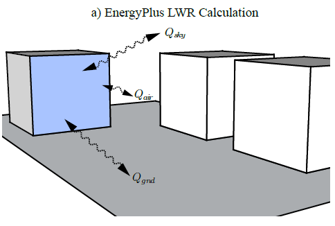

Modeling Long-wave Radiant Heat Exchange between Buildings
================
**Tianzhen Hong, Xuan Luo, LBNL**

**Original: May 30, 2017**

**Revised: June 27, 2017**

# Justification for New Feature 

Thermal simulation at urban scale aims at understanding and efficiently directing energy flows between different subsystems, for example, how to reduce impact of nearby buildings on energy performance of a target building. Within common thermal network models, the longwave radiation heat fluxes on wall surfaces can be considered at different levels of detail. However, the long-wave radiant heat exchange between exterior surfaces of nearby buildings is over-simplified in EnergyPlus, causing under or over-estimate of exterior surface temperature. We propose to modify the heat balance of the building’s exterior surfaces to explicitly consider their long-wave radiant heat exchange with other exterior surfaces (which can include surfaces of shading objects if their temperatures are known) of the same buildings or nearby buildings.   

# Team Discussion so far

Michael Witte, Lixing Gu, Daniel Macumber and Jason Glazer provided suggestions on input details and calculation methods.

# Overview 

Heat exchange between buildings is one key factor in understanding energy flows at the urban scale, including the long-wave radiant heat exchange between exterior surfaces of buildings, and between exterior surfaces of buildings and shades. However, these heat exchanges are over-simplified in EnergyPlus, causing potential under or over-estimate of exterior surface temperature. In EnergyPlus, the long-wave radiant heat exchange for a surface is calculated through the summation of the long-wave radiation gain from the ground, sky, and air (Figure 1). A major assumption of this approach is that the modeled building's surfaces and those of adjacent buildings are at a uniform temperature and the long-wave radiant exchange is negligible – an oversimplification in an urban context where urban canyon effect can be significant. 

***Figure 1 Illustration of EnergyPlus long-wave radiation heat exchange calculation***

We propose to modify the heat balance of the building’s exterior surfaces to explicitly consider their long-wave radiant heat exchange. The long-wave radiant exchange between a building’s exterior surfaces and shading surfaces can also be considered if their temperatures are known (user input).

Computational Fluid Dynamic (CFD) tools, simulating urban micro-climate, would need inputs of the building surface temperatures as boundary conditions. Thus CFD-based urban climate tools can be coupled with EnergyPlus for an integrated energy simulation. This is a very important subject in urban building energy modeling, considering the urban canyon effect and urban heat island effect, which also influences the building’s energy demand and indoor occupant thermal comfort.

# Approaches 

Throughout the EnergyPlus implementation, we could extend external links to support importing surface temperature data from external calculations. Apart from long-wave radiation from sky and ground currently considered in EnergyPlus, for building energy modeling at a community or city scale with multiple buildings, the long-wave radiation from other building surfaces should also be considered (Figure 2). 

 

***Figure 2 w Long-wave radiation calculation considering surrounding surfaces***

The energy balance of an exterior building surface from the sky, the ground, and its surrounding surfaces can be written as:

$$q_{LWR}= \epsilon\sigma[F_{sky}(T_{sky}^4-T_{surf}^4)+F_{s1}(T_{s1}^4-T_{surf}^4)+F_{s2}(T_{s2}^4-T_{surf}^4)+...+ F_{sn}(T_{sn}^4-T_{surf}^4)+F_{g}(T_{g}^4-T_{surf}^4)]$$

where,

ε=longware emittance of the surface,

σ=Stefan-Boltzmann constant,

$$T_{surf}$$=Outside surface temperature of the exterior surface,

$$T_{sky}$$=Sky temperature,

$$F_{sky}$$=View factor of surrounding surface i to the exterior surface.

$$T_{si}$$=View factor of the sky,

$$F_{si}$$=View factor of surrounding surface i to the exterior surface.

$$T_{g}$$=Ground temperature,

$$F_{g}$$=View factor of the ground,

Note that $$F_{sky}+ F_{s1}+⋯+ F_{sn}+ F_{g}=1$$

However, to avoid the complexity of iteratively calculating the long-wave radiation between building surfaces, we would simplify the case by using the pre-calculated surface temperature at the last time step for the current time step surface heat balance calculation. Considering the temperature of building exterior surfaces would not change too much between the last and current time steps, this simplification may sacrifice little accuracy but significantly improve the computing performance. To enable this, in Energy+.idd, we would add a variable Field: Calculate long-wave radiant heat exchange with surrounding surfaces in the object BuildingSurface:Detailed to indicate whether the heat exchange with surrounding surfaces is considered in the calculation. We would add an object SurfaceProperty:ViewFactors defining the view factors and another new object SurfaceProperty:SurroundingSurfaceTemperatures defining the outside surface temperature of these surrounding surfaces. View factors are assumed to be constant values, which can be overwritten in the EnergyPlus initialization stage by reading the calculation results of the external LWR calculation tool. The outside surface temperature can be exchanged with the external tool and be overwritten at each time step in EnergyPlus run time. In the building surface object, we use the Field: Surrounding Surfaces View Factor Name and Field: Surrounding Surfaces Temperature Name to link these objects. 

	BuildingSurface:Detailed,
	       \memo Allows for detailed entry of building heat transfer surfaces.  Does not include subsurfaces such as windows or doors.
	       \extensible:3 -- duplicate last set of x,y,z coordinates (last 3 fields), remembering to remove ; from "inner" fields.
	       \format vertices
	       \min-fields 19
	  A1 , \field Name
	  …
	  N1,  \field View Factor to Ground
	       \type real
	       \note From the exterior of the surface
	       \note Unused if one uses the "reflections" options in Solar Distribution in Building input
	       \note unless a DaylightingDevice:Shelf or DaylightingDevice:Tubular object has been specified.
	       \note autocalculate will automatically calculate this value from the tilt of the surface
	       \autocalculatable
	       \minimum 0.0
	       \maximum 1.0
	       \default autocalculate
	  A9,  \field Calculate long-wave radiant heat exchange with surrounding surfaces
	       \type choice
	       \key yes
	       \key no
	       \default no
	       \note when yes, A10 and A11 are required. 
	  A10, \field Surrounding Surfaces View Factor Name
	       \type object-list
	       \object-list SurroundingSurfacesViewFactorNames
	       \note 
	  A11, \field Surrounding Surfaces Temperature Name
	       \type object-list
	       \object-list SurroundingSurfaceTemperatures
	       \note 
	  N2 , \field Number of Vertices
	  …
	
	SurfaceProperty:ViewFactors,
	       \extensible:1 - repeat last field, remembering to remove ; from "inner" fields.
	       \min-fields 3
	       \memo used by the SurfaceProperty:SurroundingSurfaceTemperatures
	  A1,  \field Name
	       \required-field
	  A2,  \field SurfaceName
	       \required-field
	       \type object-list
	       \object-list SurfaceNames
	  N1,  \field Sky View Factor
	       \required-field
	       \minimum 0.0
	       \maximum 1.0
	       \default 0.5
	  N2,  \field Ground View Factor
	       \required-field
	       \minimum 0.0
	       \maximum 1.0
	       \default 0.5
	  N3,  \field Surrounding Surface 1 View Factor
	       \minimum 0.0
	       \maximum 1.0
	       \default 0.0
	  N4,  \field Surrounding Surface 2 View Factor 
	       \minimum 0.0
	       \maximum 1.0
	       \default 0.0
	  N5,  \field Surrounding Surface 3 View Factor
	       \minimum 0.0
	       \maximum 1.0
	       \default 0.0
	  …
	
	
	SurfaceProperty:SurroundingSurfaceTemperatures,
	      \extensible:1 - repeat last field, remembering to remove ; from "inner" fields.
	      \min-fields 4
	  A1, \field Name
	      \required-field
	  A2, \field SurfaceName
	      \required-field
	      \type object-list
	      \object-list SurfaceNames
	  A3, \field Sky Temperature Schedule Name
	      \type object-list
	      \object-list ScheduleNames
	      \note Schedule values in deg C
	  A4, \field Ground Temperature Schedule Name
	      \type object-list
	      \object-list ScheduleNames
	      \note Schedule values in deg C
	  A5, \field Surrounding Surface 1 Temperature Schedule Name
	      \type object-list
	      \object-list ScheduleNames
	      \note Schedule values in deg C
	  A6, \field Surrounding Surface 2 Temperature Schedule Name
	      \type object-list
	      \object-list ScheduleNames
	      \note Schedule values in deg C
	  A7, \field Surrounding Surface 3 Temperature Schedule Name
	      \type object-list
	      \object-list ScheduleNames
	      \note Schedule values in deg C
	  …

# Testing/Validation/Data Sources

TBD

# Input Output Reference Documentation

TBD

# Engineering Reference

TBD

# Output Details and Examples

TBD

# Example Files and Transition Changes

Need transition changes due to the insert of three new fields (A9 to A11) between N1 and N2 fields for the object BuildingSurface:Detailed. A new example file will be developed to demonstrate the new feature.

# References

n/a

# E-mail comments

**Jason Glazer <jglazer@gard.com> Wed, May 31, 2017**

Concerning the long-wave radiation from other buildings, how well does EnergyPlus estimate roof temperatures now? When I looked into this issue in the past, it seems like simulation tools were still regularly underestimating how hot they were compared to the literature based on data collected on cool roof vs regular roof. If that is the case, the long-wave radiation between buildings will underestimate the amount of heat transfer. I do think this is an important effect, anyone walking past a west facing wall of a concrete building an hour past sunset can attest to it.

> The proposed enhancement will enable EnergyPlus to simulate more accurately the exterior surface temperature. Such effect can then be evaluated under various scenarios. 

**Lixing Gu <gu@fsec.ucf.edu> Thu, Jun 1, 2017** 

    BuildingSurface:Detailed，

You propose new field to address inputs for surrounding radiation exchange. I am wondering how to perform input validation, such as view factors. Do you force these values to be summed as 1.0?

> Yes, along with the sky and ground view factors. We declared this in the revised version.

**Daniel Macumber <Daniel.Macumber@nrel.gov> Thu, Jun 1, 2017** 

Not sure what types of shades you are talking about; other buildings modeled as shading or actual fin/overhang shading?  Could we make the assumption that other buildings are the same temperature as the current building? 
Would this include ground cover like parking lots and parks?  Can a parking lot or street be modeled thermally in E+? How about a park with transpiration?  What about a lake or body of water?

> They all can be considered as surrounding surfaces as long as their temperatures and view factors are provided.

**Michael J Witte <mjwitte@gard.com> Mon, Jun 5, 2017** 

Surface long-wave radiation from other buildings - I agree with Dan's comment that the view factors should be input using a separate object.  After the move to JSON it would be feasible to have multiple sets of extensible fields in the same object, but we can't do that in idf.

I would also suggest that the external surface view factors and temperatures be two separate input objects. One type of object to establish the view factors, and another to assign the external surface temperatures. 

> Agreed. We revised the approach and redesigned the input objects.

