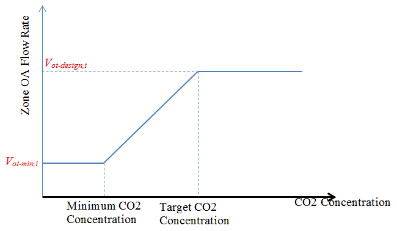

<head>

  
</head>

Proportional Demand Control Ventilation (DCV) Enhancements
================

### Lixing Gu

### Florida Solar Energy Center

 - Second revision
 - 5/4/17
 - Added more E-mail communications
 - First revision
 - 4/24/17
 - Added E-mail communications and change a new field name from "Base Ventilation Flow Rate" to "Proportional Control Minimum Outdoor Air Flow Rate" in the DesignSpecification:OutdoorAir object.
 - The original version
 - 4/3/17

 

## Justification for New Feature ##

When the indoor CO_{2} concentration is between C_{s - min} and C_{s - design}, a controller should adjust outdoor air intake flow V_{ot} proportionally between V_{ot - min} and V_{ot - design} (eq (17.90) in the Engineering Reference):

 $V_{ot} = V_{ot-min} + (V_{ot-design} - V_{ot-min}) \frac{(C_{s-actual} - C_{s-min})}{(C_{s-design} - C_{s-min})} $ 

C_{s - design} = CO\(_{2}\) concentration in the space for the design conditions, ppm

C_{s - min}= Minimum CO\(_{2}\) concentration in the space, ppm

C_{s - actual} = Actual CO\(_{2}\) concentration in the space, ppm

V_{ot - design} = Required intake of outdoor air flow rate at C_{s - design} , (m\(^{3}\)/s)

V_{ot - min} = Required intake of outdoor air flow rate at C_{s - min} , (m\(^{3}\)/s)

V_{ot}= Required intake of outdoor air flow rate at C_{s - actual} , (m\(^{3}\)/s)

This NFP addresses 2 requests from Carrier. The first request is to use direct inputs of design zone ventilation flow rate as V_{ot - design} and zone based ventilation flow rate V_{ot - min} to calculate proportional demand controlled ventilation rate as V_{ot}. The existing approaches use design occupancy, or occupancy schedule to determine required V_{ot - design} and V_{ot - min} OA flow rate. This new feature will allow users to select direct inputs of OA rates as a new option. 

The second request is to use the setpoint schedule value as C_{s - design}, in addition to existing calculation based on Eq. (15.759) in Engineering reference. It provides a new option to use a given value as C_{s - design}.  

## E-mail and  Conference Call Conclusions ##

### First revision

-----Original Message-----
From: Michael J Witte [mailto:mjwitte@gard.com] 
Sent: Friday, April 21, 2017 3:02 PM
To: Lixing Gu <gu@fsec.ucf.edu>
Cc: 'Wu, Tiejun UTC CCS' <Tiejun.Wu@utc.com>
Subject: Re: [energyplusdevteam] NFP to enhance Proportional Demand Control Ventilation (DCV)

I see.  I'm ok then with the new schedule in the contaminant controller.

Mike

On 4/21/2017 1:58 PM, Lixing Gu wrote:
> Mike:
>
> Thanks for providing valuable comments to me.
>
> Carbon Dioxide Setpoint Schedule Name
>
> Carrier proposed to use the setpoint as C_design. The current program has its own way to calculate C_design. In order to trigger E+ to use the setpoint as C_design, I need an input to tell me. A new field is an input trigger. I talked to Tiejun before and he agreed with me.
>
> However, I may not use the new field, if the new choice of ProportionalControlBasedOnDesignOARate is used to set up 3 values:
>
> V_ot_min, V_ot_design and C_design.
>
> Since V_ot calculation and C_design are from 2 enhancement items, I assume V_ot and C_design can be independent.
>
> I am open to anyway.
>
> Thanks.
>
> Gu
>
> -----Original Message-----
> From: Michael J Witte [mailto:mjwitte@gard.com]
> Sent: Friday, April 21, 2017 12:05 PM
> To: Lixing Gu <gu@fsec.ucf.edu>
> Cc: Wu, Tiejun UTC CCS <Tiejun.Wu@utc.com>
> Subject: Re: [energyplusdevteam] NFP to enhance Proportional Demand 
> Control Ventilation (DCV)
>
> Gu:
>
> I'll review.
>
> For the first part "Proportional DCV with user specified design zone ventilation flow rate and base ventilation flow rate" we need to be careful about the use of "Outdoor Air Schedule Name".  The way it is currently describe is that it multiplies the result of any OA calculation method, so the use of the "Base Ventilation Air Flow Rate"
> field should not be dependent on this schedule.
>
> Rather, the specs for "Base Ventilation Flow Rate" (actually, I'd suggest a more explicit name, see below) should be completely independent of what's input for the OA Schedule.
>
> I could see a group of fields for this, but maybe this is overkill:
>
> "Proportional Control Minimum Outdoor Air Flow Rate Input Method"
> (FractionOfDesignFlowRate, SpecifiedFlowRate)
>
> "Proportional Control Minimum Outdoor Air Fraction" (used when 
> FractionOfDesignFlowRate is specified above)
>
> "Proportional Control Minimum Outdoor Air Flow Rate" (used when 
> SpecifiedFlowRate is specified above)
>
> "Proportional Control Minimum Outdoor Air Flow Rate Schedule" (applied 
> to the flow rate specified above)
>
> Tiejun:  Comments?  If this it too flexible, then we could stick with one field for "Proportional Control Minimum Outdoor Air Flow Rate"  Or we could even make it more flexible and replicate all of the design OA flow rate fields (method, flow/person, flow/area, flow, and schedule).
>
>
> And back to Gu:
>
> For the second part, why did you propose adding a new schedule for Max
> CO2 rather than use the existing input for "Carbon Dioxide Setpoint Schedule Name"?
>
> Mike
>
>
>
> On 4/19/2017 8:26 AM, Lixing Gu wrote:
>> Team:
>>
>> An NFP to enhance Proportional Demand Control Ventilation (DCV) is available on github.
>>
>> https://github.com/NREL/EnergyPlus/blob/ProportionalDCVEnhancements/d
>> e sign/FY2017/NFP-ProportionalDCVEnhancements.md
>>
>> Comments are welcome via e-mail or github.  Please let me know if you wish to be a reviewer for this task.
>>
>> Thanks.
>>
>> Gu
>>
>>

### Second revision

From: Lixing Gu [mailto:Gu@fsec.ucf.edu] 
Sent: Thursday, May 04, 2017 1:37 PM
To: 'Michael J Witte' <mjwitte@gard.com>; 'Lee, Edwin (NREL)' <edwin.lee@nrel.gov>
Cc: 'Wu, Tiejun UTC CCS' <Tiejun.Wu@utc.com>
Subject: RE: [energyplusdevteam] NFP to enhance Proportional Demand Control Ventilation (DCV)

Mike:

I like your point. The existing Outdoor Air Schedule should not be used to calculate V_{ot-min}. I also talked to Tiejun this morning. Here is what we agreed. Although the item lists two choices to calculate V_{ot-min}, it will use a single choice to calculate V_{ot-min} only with a new field: "Proportional Control Minimum Outdoor Air Flow Rate Schedule Name" in the DesignSpecification:OutdoorAir object.

V_{ot-min} = DesignOAFloeRate * "Proportional Control Minimum Outdoor Air Flow Rate Schedule Value"

Here is the DesignSpecification:OutdoorAir object in idd

DesignSpecification:OutdoorAir,
      \min-fields 1
      \memo This object is used to describe general outdoor air requirements which
      \memo are referenced by other objects.
      A1, \field Name
      \required-field
      \type alpha
      \reference DesignSpecificationOutdoorAirNames
      A2, \field Outdoor Air Method
      \type choice
      \key Flow/Person
      \key Flow/Area
      \key Flow/Zone
      \key AirChanges/Hour
      \key Sum
      \key Maximum
      \default Flow/Person
      \note Flow/Person => Outdoor Air Flow per Person * Occupancy = Design Flow Rate,
      \note Flow/Area => Outdoor Air Flow per Zone Floor Area * Zone Floor Area = Design Flow Rate,
      \note Flow/Zone => Outdoor Air Flow per Zone = Design Flow Rate,
      \note AirChanges/Hour => Outdoor Air Flow Air Changes per Hour * Zone Volume adjusted for m3/s = Design Flow Rate
      N1, \field Outdoor Air Flow per Person
      \type real
      \units m3/s-person
      \default 0.00944
      \minimum 0
      \note 0.00944 m3/s is equivalent to 20 cfm per person
      \note This input is only used if the field Outdoor Air Method is Flow/Person, Sum, or Maximum
      \note For sizing, the design number of occupants is used. For outdoor air flow control, the use
      \note of design occupants or current occupants depends on the component and DCV options.
      \note AirTerminal:SingleDuct:VAV:NoReheat, AirTerminal:SingleDuct:VAV:Reheat use the DCV flag specified in Controller:MechanicalVentilation
      \note AirTerminal:DualDuct:VAV:OutdoorAir and ZoneHVAC:IdealLoadsAirSystem have their own DCV control input.
      \note ZoneHVAC:FourPipeFanCoil always uses current occupants.
      N2, \field Outdoor Air Flow per Zone Floor Area
      \units m3/s-m2
      \default 0.0
      \minimum 0
      \note This input is only used if the field Outdoor Air Method is Flow/Area, Sum, or Maximum
      N3, \field Outdoor Air Flow per Zone
      \type real
      \units m3/s
      \default 0.0
      \minimum 0
      \note This input is only used if the field Outdoor Air Method is Flow/Zone, Sum, or Maximum
      N4, \field Outdoor Air Flow Air Changes per Hour
      \units 1/hr
      \type real
      \default 0.0
      \minimum 0
      \note This input is only used if the field Outdoor Air Method is AirChanges/Hour, Sum, or Maximum
      A3, \field Outdoor Air Schedule Name
      \type object-list
      \object-list ScheduleNames
      \note Schedule values are multiplied by the Outdoor Air Flow rate calculated using
      \note the previous four inputs. Schedule values are limited to 0 to 1. If left blank, the schedule defaults to 1.0.
      \note This schedule is ignored during sizing.  All other components which reference this design specification
      \note use the current schedule value to calculate the current outdoor air requirement. This includes
      \note AirTerminal:SingleDuct:VAV:NoReheat, AirTerminal:SingleDuct:VAV:Reheat, AirTerminal:DualDuct:VAV:OutdoorAir, 
      \note ZoneHVAC:FourPipeFanCoil, and ZoneHVAC:IdealLoadsAirSystem.
      \note This schedule will also be applied by Controller:MechanicalVentilation for all System Outdoor Air Methods.
New One
      A4; \field Proportional Control Minimum Outdoor Air Flow Rate Schedule Name
      \type object-list
      \object-list ScheduleNames
      \note This input is only used to calculate the minimum outdoor air flow rate when the field 
      \note System Outdoor Air Method = ProportionalControlBasedOnDesignOARate in
      \note Controller:MechanicalVentilation, 
I am going to update NFP.

Thanks.

Gu
From: Michael J Witte [mailto:mjwitte@gard.com] 
Sent: Wednesday, May 03, 2017 5:14 PM
To: Lixing Gu <gu@fsec.ucf.edu>; 'Lee, Edwin (NREL)' <edwin.lee@nrel.gov>
Cc: 'Wu, Tiejun UTC CCS' <Tiejun.Wu@utc.com>
Subject: Re: [energyplusdevteam] NFP to enhance Proportional Demand Control Ventilation (DCV)

See comments below.

On 5/3/2017 3:38 PM, Lixing Gu wrote:
Mike:
 
Thanks for more valuable comments.
 
1.  The description for new field "Proportional Control Minimum Outdoor Air Flow Rate" says:
I said it not clear and found a mistake. It should be
 
"This field specifies the value of the minimum outdoor air flow rate used in the proportional demand controlled ventilation (DCV) control. This input is only used when the field System Outdoor Air Method = ProportionalControlBasedOnDesignOARate in Controller:MechanicalVentilation, and the schedule value of the Outdoor Air Schedule Name field is zero."
This is what Tiejun defined in an enhancement item.

On re-reading the enhancement item, I disagree with using the existing Outdoor Air Schedule for calculating the minimum flow.  The schedule value is currently multiplied times all of the design level inputs (oa/person, oa/area, oa/zone) regardless of the OA control method.
See CalcMechVentController
https://github.com/NREL/EnergyPlus/blob/cecaea1295fd603c9ae24d89a63339bd45fb454e/src/EnergyPlus/MixedAir.cc#L3780-L3802

So it is already modifying the design level OA flow for proportional control.  It is already included in ZoneOAArea, ZoneOAPeople, ZoneOABZ, etc. 

If we want to be able to schedule the min flow for proportional control, then we need a new schedule field "Proportional Control Minimum Outdoor Air Flow Rate Schedule Name".  If we follow the enhancement item, then this would be multiplied times the design OA flow, not times the new Proportional Control Minimum Outdoor Air Flow Rate - they would be either/or - so there should be a warning if both are entered and pick one to be ignored.

Mike

2. This impacts the design section also.
This is a field in the DesignSpecification:OutdoorAir object and specified in Tiejun’s item.
3. Maximum Carbon Dioxide Concentration Schedule Name
Done.
I am going to incorporate the above changes in NFP.
 
Thanks.
 
Gu
 
 
 
 
 
 
From: Michael J Witte [mailto:mjwitte@gard.com] 
Sent: Wednesday, May 03, 2017 1:03 PM
To: Lixing Gu <gu@fsec.ucf.edu>; 'Lee, Edwin (NREL)' <edwin.lee@nrel.gov>
Cc: 'Wu, Tiejun UTC CCS' <Tiejun.Wu@utc.com>
Subject: Re: [energyplusdevteam] NFP to enhance Proportional Demand Control Ventilation (DCV)
 
Gu:
1.  The description for new field "Proportional Control Minimum Outdoor Air Flow Rate" says:
"This field specifies the value of the minimum outdoor air flow rate used in the proportional demand controlled ventilation (DCV) control. This input is only used when the field System Outdoor Air Method = ProportionalControlBasedonOccupancySchedule or ProportionalControlBasedOnDesignOccupancy or ProportionalControlBasedOnDesignOARate in Controller:MechanicalVentilation, and the value of above schedule is zero."
You should delete "and the value of the above schedule is zero".  Correct?  

2. This impacts the design section also.  The presence of the "Outdoor Air Schedule Name" should not be part of this.  It should multiply whatever the final OA calculation result is regardless of OA control type.

3.  The description for new field "Maximum Carbon Dioxide Concentration Schedule Name" should say that this field is optional and say what happens when it is left blank.  Same for "Proportional Control Minimum Outdoor Air Flow Rate".
Mike

 
On 4/27/2017 3:10 PM, Lixing Gu wrote:
All:
 
The NFP was updated based on comments. I also added design document. Please review it (https://github.com/NREL/EnergyPlus/blob/ProportionalDCVEnhancements/design/FY2017/NFP-ProportionalDCVEnhancements.md) and give me your feedback.
 
Thanks.
 
Gu
 
-----Original Message-----
From: Lixing Gu [mailto:Gu@fsec.ucf.edu] 
Sent: Friday, April 21, 2017 3:50 PM
To: 'Michael J Witte' <mjwitte@gard.com>
Cc: 'Wu, Tiejun UTC CCS' <Tiejun.Wu@utc.com>
Subject: RE: [energyplusdevteam] NFP to enhance Proportional Demand Control Ventilation (DCV)
 
Mike:
 
To your first comment, my vote is "Proportional Control Minimum Outdoor Air Flow Rate". I prefer that each filed has its own special meaning and don't allow too much flexibility.
 
Thanks.
 
Gu
 

## Overview ##

This NFP addresses two enhancements. The first enhancement allow additional calculation of the proportional demand controlled ventilation based on design zone ventilation flow rate and zone base ventilation flow rate (m^3/s, or percentage of design zone ventilation flow rate) from input. The second enhancement enables the proportional demand controlled ventilation features to take maximum zone CO_2 concentration as input available in the “ZoneControl:ContaminantController” object as C_{s - design}.

## Approach ##

### New choice of design and minimum outdoor air flow rate ###

A new key choice will be added in the System Outdoor Air Method field of the Controller:MechanicalVentilation object as ProportionalControlBasedOnDesignOARate. The following steps will be taken to calculate V_{ot - design} and V_{ot - min}:

1. Take any input specified in the “DesignSpecification:OutdoorAir” object to calculate the design outdoor air flow rate.

2. If a user provides a schedule in the “OutdoorAirFlowRateFractionSchedule” field, use that schedule multiply the design outdoor air flow rate as the base ventilation flow rate.

These two parameters are highlighted as red in Figure 1.

**Figure 1 Relevant Parameters in Zone Outdoor Air Flow Calculation for Proportional DCV**

Equation (15.757) becomes:
V_(ot-design)=  (DesignOAFlowRate)/E 

Equation (15.758) becomes:
V_(ot-min)=  (DesignOAFlowRate * OAFlowRateFractionScheduleValue)/E 

The DesignOAFlowRate can be calculated with whatever inputs user specified in the “DesignSpecification:OutdoorAir” object.

Another approach to #2 is to let user specify a base ventilation flow rate in unit of m^3/s. Which requires to add an input field named “Proportional Control Minimum Outdoor Air Flow Rate (m^3/s)”  to object “DesignSpecification:OutdoorAir”.

If a user does not specify “OutdoorAirFlowRateFractionSchedule” and “Proportional Control Minimum Outdoor Air Flow Rate (m^3/s)” , and has zero values for fields “Outdoor Air Flow per Person” and “Outdoor Air Flow per Floor Area”, then throw an error.

### New choice of design zone CO2 concentration

In order to trigger a new choice, a new field in the ZoneControl:ContaminantController object as Maximum Carbon Dioxide Concentration Schedule Name. If this field is blank, existing calculation will be performed. If this field is entered, the schedule value will be used as C_{s - design}.   

## Testing/Validation/Data Sources ##

Compare outputs with spread sheet calculations.

## Input Output Reference Documentation ##

Three objects will be modified: Controller:MechanicalVentilation, DesignSpecification:OutdoorAir, and ZoneControl:ContaminantController.

Any revisions are highlighted in red.

### Controller:MechanicalVentilation ####

A new choice will be added in the System Outdoor Air Method field to specify V_{ot - design} and V_{ot - min}

\subsection{Controller:MechanicalVentilation}\label{controllermechanicalventilation}

This object is used in conjunction with an outdoor air controller (Ref. Controller:OutdoorAir, Field: Mechanical Ventilation Controller Name) to establish the minimum outdoor air flow rate provided by a mixed air box.

Ventilation standards provide guidance on appropriate levels of outdoor ventilation air required for acceptable indoor air quality. The Ventilation Rate Procedure (VRP) of ASHRAE Standard 62.1-2007/2010 (\href{http://www.ashrae.org}{www.ashrae.org}) requires outdoor ventilation rates to be determined based on the floor area of each occupied zone plus the number of people in each zone and considers the zone air distribution effectiveness and system ventilation efficiency. The outdoor air ventilation rate can be reset dynamically as operating conditions change (e.g., variations in occupancy). The Controller:MechanicalVentilation object implements the VRP for calculating these outdoor air ventilation requirements and resetting them based on varying occupancy levels and zone diversification. This is particularly useful for large air distribution systems that serve a number of different zone types with varying occupancy levels. This object can also be used to model the Indoor Air Quality Procedure (IAQP) as defined in Standard 62.1

The first five inputs for this object are the name, the availability schedule, the zone outdoor air method, the system outdoor air method, and the zone maximum outdoor air fraction. The next three input fields define the zone name (or zone list name), the design specification outdoor air object name, and the design specification zone air distribution object name to be applied to this zone (or zone list). The last three fields are extensible

\subsubsection{Inputs}\label{inputs-2-007}

\paragraph{Field: Name}\label{field-name-2-006}

The unique user assigned name for an instance of mechanical ventilation. Any other object referencing this mechanical ventilation object will use this name.

\paragraph{Field: AvailabilitySchedule Name}\label{field-availabilityschedule-name}

The name of a schedule whose values are greater than 0 when mechanical ventilation, as calculated by this object, is desired. If the schedule s value is 0.0, then mechanical ventilation is not available and flow will not be requested. If the schedule s value is \textgreater{} 0.0 (usually 1 is used), mechanical ventilation is available. If this field is blank, the schedule has values of 1 for all time periods. This schedule is useful for purging the building of contaminants prior to occupancy (i.e., ventilation rate per unit floor area will be provided even if the occupancy is zero).

\paragraph{Field: Demand Controlled Ventilation}\label{field-demand-controlled-ventilation}

This field indicates whether the air loop is capable of doing demand controlled ventilation (DCV) to vary the amount of outdoor air based on actual number of occupants in spaces. Two choices: Yes and No. Default is No.

\paragraph{Field: System Outdoor Air Method}\label{field-system-outdoor-air-method}

The method used to calculate the system minimum outdoor air flow. Several choices are allowed: \textbf{ZoneSum}, \textbf{VentilationRateProcedure,} \textbf{IndoorAirQualityProcedure, ProportionalControlBasedonOccupancySchedule,} \textbf{ProportionalControlBasedonDesignOccupancy,}   \textbf{ProportionalControlBasedOnDesignOARate,}  and \textbf{IndoorAirQualityProcedureGenericContaminant}. ZoneSum sums the outdoor air flows across all zones served by the system. VentilationRateProcedure (VRP) uses the multi-zone equations defined in 62.1-2007 to calculate the system outdoor air flow. VRP considers zone air distribution effectiveness and zone diversification of outdoor air fractions. IndoorAirQualityProcedure (IAQP) is the other procedure defined in ASHRAE Standard 62.1-2007 for calculate the amount of outdoor air necessary to maintain the levels of indoor air carbon dioxide at or below the setpoint defined in the ZoneControl:ContaminantController object. Appendix A of the ASHRAE 62.1-2010 user's manual discusses another method for implementing CO\(_{2}\)-based DCV in a single zone system. This method (Proportional Control) calculates the required outdoor air flow rate which varies in proportion to the percentage of the CO\(_{2}\) signal range and has two choices to calculate occupancy-based outdoor air rate. The ProportionalControlBasedonOccupancySchedule choice uses the real occupancy at the current time step to calculate outdoor air rate, while the ProportionalControlBasedonDesignOccupancy uses the design occupancy level to calculate outdoor air rate. The former choice is a good approach to estimate outdoor air rate. However, for practical applications, the zone controller usually does not have the real time occupancy information, and the design occupancy level is assumed. The latter choice is used in the design stage.  The ProportionalControlBasedOnDesignOARate uses design outdoor air flow rate to calculate demand outdoor air flow rate.  The IndoorAirQualityProcedure-GenericContaminant method calculates the amount of outdoor air necessary to maintain the levels of indoor air generic contaminant at or below the setpoint defined in the ZoneControl:ContaminantController object.

Note: When System Outdoor Air Method = IndoorAirQualityProcedure or IndoorAirQualityProcedureGenericContaminant is specified, only the Zone \textless{}x\textgreater{} Name fields are used. The other field inputs described below are not used.

\paragraph{Field: Zone Maximum Outdoor Air Fraction}\label{field-zone-maximum-outdoor-air-fraction}

This positive numeric input is the zone maximum outdoor air fraction. For VAV systems, when a zone requires outdoor air higher than the user specified Zone Maximum Outdoor Air Fraction, the zone supply air flow will be increased (if damper not fully open yet) to cap the outdoor air fraction at the maximum value. This allows the system level outdoor air flow to be reduced while the total supply air flow increases to meet zone outdoor air requirement. Valid values are from 0 to 1.0. Default is 1.0 which indicates zones can have 100\% outdoor air maintaining backward compatibility. This inputs work for single and dual duct VAV systems.

\paragraph{Field Set (Zone Name, Design Specification Outdoor Air Object Name, and Design Specification Zone Air Distribution Object Name)}\label{field-set-zone-name-design-specification-outdoor-air-object-name-and-design-specification-zone-air-distribution-object-name}

The following three fields are needed to define the parameters for the ventilation. This object is extensible by duplicating these three fields.

\paragraph{Field:Zone \textless{}x\textgreater{} Name}\label{fieldzone-x-name}

The zone name or zone list to apply the ventilation rates specified in the DesignSpecification:OutdoorAir object.

\paragraph{Field: Design Specification Outdoor Air Object Name \textless{}x\textgreater{}}\label{field-design-specification-outdoor-air-object-name-x}

The name of the DesignSpecification:OutdoorAir object, defining the amount of outdoor air, that applies to the zone or zone list. If this field is blank, the corresponding DesignSpecification:OutdoorAir object for the zone will come from the DesignSpecification:OutdoorAir object referenced by the Sizing:Zone object for the same zone. If no such zone match is found, default values from the IDD will be used for the DesignSpecification:OutdoorAir object which is 0.0094 m3/s-person. 

If an Outdoor Air Schedule Name is specified in the DesignSpecification:OutdoorAir object, the schedule will be applied to all types of outdoor air calculations for the corresponding zone, regardless of the System Outdoor Air Method selected. If the schedule value is zero, then the zone will be completely removed from the system outdoor air calcaulations.

\paragraph{Field: Design Specification Zone Air Distribution Object Name \textless{}x\textgreater{}}\label{field-design-specification-zone-air-distribution-object-name-x}

The name of the DesignSpecification:ZoneAirDistribution object, defining the air distribution effectiveness and secondary recirculation air fraction, that applies to the zone or zone list. If this field is blank, the corresponding DesignSpecification:ZoneAirDistribution object for the zone will come from the DesignSpecification:ZoneAirDistribution object referenced by the Sizing:Zone object for the same zone. If no such zone match is found, default values from the IDD will be used for the DesignSpecification:ZoneAirDistribution object which are effectiveness = 1.0 and recirculation = 0.0.

As described previously, the Controller:MechanicalVentilation object works in conjunction with Controller:OutdoorAir. As such, the minimum quantity of outdoor air delivered via the mixed air box will be the greater of:

\begin{itemize}
\item
  the minimum outdoor air flow rate calculated by the fields Minimum Outdoor Air Flow Rate, Minimum Limit and Minimum Outdoor Air Schedule Name in the associated Controller:OutdoorAir object, or
\item
  the outdoor air flow rate calculated by this object.
\end{itemize}

The actual outdoor air flow rate may be higher than the minimum if free cooling is available. Regardless, the outdoor air flow rate will not exceed the Maximum Outdoor Air Flow Rate specified in the associated Controller:OutdoorAir object or the Maximum Fraction of Outdoor Air Schedule (if specified) times the current system supply air flow rate.

An example input for this object is shown below:

\begin{lstlisting}

Controller:MechanicalVentilation,
  VentObject,                             !- Name
  VentSchedule,                         !- Availability Schedule Name
  VentilationRateProcedure, !- System Outdoor Air Method
  1.0,                                           !- Zone Maximum Outdoor Air Fraction
  Resistive Zone,                     !- Zone 1 Name
  DSOA1,                                       !- Design Specification Outdoor Air Object Name 1
  DSZADO1,                                   !- Design Specification Zone Air Distribution Object Name 1
  DCV Zone List,                       !- Zone 2 Name
  DSO_ZList,                               !- Design Specification Outdoor Air Object Name 2
  ;                                                !- Design Specification Zone Air Distribution Object Name 2

  ZoneList,
  DCV Zone List,                       !- Zone List Name
  East Zone,                               !- Zone Name 1
  North Zone;                             !- Zone Name 2

  DesignSpecification:OutdoorAir,
  DSOA1,                                     !- Name
  SUM,                                         !- Outdoor Air Method
  0.00236,                                 !- Outdoor Air Flow per Person
  0.000305,                               !- Outdoor Air Flow per Zone Floor Area
  0.0,                                         !- Outdoor Air Flow per Zone
  0.0,                                         !- Outdoor Air Flow Air Changes per Hour
  ;                                               !- Outdoor Air Flow Rate Fraction Schedule Name

  DesignSpecification:ZoneAirDistribution,
  DSZADO1,                                 !- Name
  1.2,                                         !- Zone Air Distribution Effectiveness in Cooling Mode
  1.0,                                         !- Zone Air Distribution Effectiveness in Heating Mode
  ,                                               !- Zone Air Distribution Effectiveness Schedule Name
  0.3;                                         !- Zone Secondary Recirculation Fraction
\end{lstlisting}

### DesignSpecification:OutdoorAir

A new optional field will be added to allow users to specify the Base Ventilation Air Flow Rate to calculate required outdoor airflow rate for proportional DCV control.

\subsection{DesignSpecification:OutdoorAir}\label{designspecificationoutdoorair}

This object allows for the outdoor air requirements to be defined in a common location for use by other objects. This object may be referenced by name from other objects (e.g., VAV terminal units) as required to identify an outdoor air quantity for use by that object. Note that a zone name Is not included as an input to this zone outdoor air definition and the number of people in a zone, zone floor area, and zone volume can only be determined after this object has been referenced by another. A single zone outdoor air definition may be referenced by multiple objects to specify that the same outdoor air requirements are used by those objects \emph{or} multiple zone outdoor air objects may be defined and referenced by other objects as needed. If multiple zone outdoor air definitions are used, each outdoor air definition must have a unique name.

\subsubsection{Inputs}\label{inputs-012}

\paragraph{Field: Name}\label{field-name-011}

Unique identifying name. Any reference to this name by other objects will denote that the following outdoor air requirements will be used.

\paragraph{Field: Outdoor Air Method}\label{field-outdoor-air-method}

The input must be either \emph{Flow/Person}, \emph{Flow/Area}, \emph{Flow/Zone, AirChanges/Hour}, \emph{Sum}, or \emph{Maximum}. \emph{Flow/Person} means the program will use the input from the field \emph{Outdoor Air Flow per Person} and the actual zone occupancy to calculate a zone outdoor air flow rate. \emph{Flow/Area} means that the program will use the input from the field \emph{Outdoor Air Flow per Zone Floor Area} and the actual zone floor area as the zone outdoor air flow rate. \emph{Flow/Zone} means that the program will use the input of the field \emph{Outdoor Air Flow per Zone} as the zone outdoor air flow rate. \emph{AirChanges/Hour} means that the program will use the input from the field \emph{Air Changes per Hour} and the actual zone volume (divided by 3600 seconds per hour) as the zone outdoor air flow rate. \emph{Sum} means that the flows calculated from the fields \emph{Outdoor Air Flow per Person,} \emph{Outdoor Air Flow per Area, Outdoor Air Flow per Zone}, and \emph{Air Changes per Hour} (using the associated conversions to m\(^{3}\)/s for each field) will be added to obtain the zone outdoor air flow rate. \emph{Maximum} means that the maximum flow derived from \emph{Outdoor Air Flow per Person,} \emph{Outdoor Air Flow per Area, Outdoor Air Flow per Zone,} and \emph{Air Changes per Hour} (using the associated conversions to m\(^{3}\)/s for each field) will be used as the zone outdoor air flow rate. The default is \emph{Flow/Person}.

\paragraph{Field: Outdoor Air Flow per Person}\label{field-outdoor-air-flow-per-person}

The design outdoor air volume flow rate per person for this zone in cubic meters per second per person. The default is 0.00944 (20 cfm per person). An outdoor air flow rate is calculated based on the total number of people for all People statements assigned to the zone. Occupancy schedule values \emph{are not} applied during sizing calculations and \emph{are} applied during the remainder of the simulation. This input is used if \emph{Outdoor Air Method} is one of \emph{Outdoor Air Flow per Person}, \emph{Sum}, or \emph{Maximum}.

\paragraph{Field: Outdoor Air Flow per Zone Floor Area}\label{field-outdoor-air-flow-per-zone-floor-area}

The design outdoor air volume flow rate per square meter of floor area (units are m\(^{3}\)/s-m\(^{2}\)). This input is used if \emph{Outdoor Air Method} is \emph{Flow/Area, Sum} or \emph{Maximum}. The default value for this field is 0.

\paragraph{Field: Outdoor Air Flow per Zone}\label{field-outdoor-air-flow-per-zone}

The design outdoor air flow rate for this zone in cubic meters per second. This input field is used if \emph{Outdoor Air Method} is \emph{Flow/Zone, Sum} or \emph{Maximum}. The default value for this field is 0.

\paragraph{Field: Outdoor Air Flow Changes per Hour}\label{field-outdoor-air-flow-changes-per-hour}

The design outdoor air volume flow rate in air changes per hour. This factor is used along with the Zone Volume and converted to cubic meters per second. This input field is used if \emph{Outdoor Air Method} is \emph{AirChanges/Hour, Sum} or \emph{Maximum}. The default value for this field is 0.

\paragraph{Field: Outdoor Air Schedule Name}\label{field-outdoor-air-schedule-name}

This field is the name of schedule that defines how outdoor air requirements change over time. The field is optional. If left blank, the schedule defaults to 1.0. If used, then the schedule values are multiplied by the outdoor air flow rate defined by the previous fields. The schedule values must be between 0 and 1, inclusive.  

If this DesignSpecification:OutdoorAir object is referenced by a Controller:MechanicalVentilation object (either directly or indirectly through Sizing:Zone), the schedule will be applied to all types of outdoor air calculations for the corresponding zone, regardless of the System Outdoor Air Method selected. If the schedule value is zero, then the zone will be completely removed from the system outdoor air calculations.

 	A4; \field Proportional Control Minimum Outdoor Air Flow Rate Schedule Name
\paragraph{Field: Proportional Control Minimum Outdoor Air Flow Rate }\label{field-base-ventilation-air-flow-rate-schedule-name}

 This field is the name of schedule that defines how minimum outdoor air requirements change over time. The field is optional. If left blank, the schedule defaults to 1.0. If used when the field System Outdoor Air Method = ProportionalControlBasedOnDesignOARate in Controller:MechanicalVentilation, then the schedule values are multiplied by the outdoor air flow rate. The schedule values must be between 0 and 1, inclusive.

An IDF example:

\begin{lstlisting}

DesignSpecification:OutdoorAir
      ZoneOAData,            !- Name
      Sum,                   !- Outdoor Air Method
      0.00944,               !- Outdoor Air Flow per Person {m3/s}
      0.00305,               !- Outdoor Air Flow per Zone Floor Area {m3/s-m2}
      ,                      !- Outdoor Air Flow per Zone {m3/s}
      ,                      !- Outdoor Air Flow Air Changes per Hour
      OARequirements Sched;  !- Outdoor Air Schedule Name

  Schedule:Compact,
      OARequirements Sched,    !- Name
      Any Number,              !- Schedule Type Limits Name
      Through: 12/31,          !- Field 1
      For: Weekdays SummerDesignDay WinterDesignDay,  !- Field 2
      Until: 24:00, 1.0,       !- Field 4
      For: AllOtherDays,       !- Field 5
      Until: 24:00, 0.5;       !- Field 7
\end{lstlisting}

### ZoneControl:ContaminantController

A new field will be added to allow users to specify the design CO2 concentration level, in addition to existing calculation.

\subsection{ZoneControl:ContaminantController}\label{zonecontrolcontaminantcontroller}

The ZoneControl:ContaminantController object is used for any of the following two purposes based on the system outdoor air method specified in the Controller:MechanicalVentilation.

\begin{enumerate}
\def\labelenumi{\arabic{enumi})}
\item
  To control a zone to a specified indoor level of contaminants. When this zone is served by an AirLoopHVAC, the other zones served by the same AirLoopHVAC will have the same specified indoor level, if no objects in the other zones served by the same AirLoop are specified. Currently, the available contaminant controls are carbon dioxide and generic contaminant controls. The specified carbon dioxide setpoint is used to calculate the required outdoor airflow rate through the HVAC system to reach the setpoint. The AirLoopHVAC system outdoor flow rate is realized by the Controller:MechanicalVentilation object with System Outdoor Air Method = IndoorAirQualityProcedure.The specified generic contaminant setpoint is used to calculate the required outdoor airflow rate through the HVAC system to reach the setpoint. The AirLoopHVAC system outdoor flow rate is realized by the Controller:MechanicalVentilation object with System Outdoor Air Method = IndoorAirQualityProcedure-GenericContaminant.
\item
  To specify minimum  or  maximum  CO2 concentration schedule name for a zone. The AirLoopHVAC system outdoor flow rate is realized by the Controller:MechanicalVentilation object with System Outdoor Air Method = ProportionalControlBasedonOccupancySchedule, or ProportionalControlBasedOnDesignOccupancy, or ProportionalControlBasedOnDesignOARate. Carbon Dioxide Control Availability Schedule Name determines the availability of ProportionalControl .
\end{enumerate}

For the first purpose above, when multiple zones are served by an AirLoop, those zones that do not have a contaminant controller object specified in the input data file are automatically assigned a carbon dioxide setpoint. Zone objects entered in the input data file are internally assigned an index number from 1 to n (first defined Zone object = 1, next Zone object defined in the input file = 2, etc.). For zones served by an AirLoop that do not have a contaminant controller specified, the zone s carbon dioxide setpoint will be the same as the zone with the next highest zone index number that has a contaminant controller specified. If a zone with a higher index number and contaminant controller specified does not exist, then the zone with the next lowest zone index number that has a contaminant controller specified will be used. For example, assume an AirLoop serves zones 1 through 5, but one ZoneControl:ContaminantController object is specified for zone 2, a second ZoneControl:ContaminantController object is specified for zone 4, and no ZoneControl:ContaminantController objects are specified for zones 1, 3 and 5. In this case, zone 1 will be assigned the carbon dioxide setpoint schedule that was specified for zone 2, and zones 3 and 5 will be assigned the carbon dioxide setpoint schedule that was specified for zone 4.

\subsubsection{Inputs}\label{inputs-14-017}

\paragraph{Field: Name}\label{field-name-12-013}

Unique identifying name for the ZoneControl:ContaminantController.

\paragraph{Field: Zone Name}\label{field-controlled-zone-name-000}

Name of the zone that is being controlled.

\paragraph{Field:Carbon Dioxide Control Availability Schedule Name}\label{fieldcarbon-dioxide-control-availability-schedule-name}

This field contains the name of a schedule that determines whether or not the ZoneControl:ContaminantController is available. When the schedule value is zero, the ZoneControl:ContaminantController is bypassed (not available to operate). When the schedule value is greater than zero, the ZoneControl:ContaminantController is available and will be used to calculate the required outdoor airflow rate to reach the carbon dioxide setpoint. If this field is left blank, the schedule has a value of 1 for all time periods. Schedule values must be between 0 and 1.

\paragraph{Field:Carbon Dioxide Setpoint Schedule Name}\label{fieldcarbon-dioxide-setpoint-schedule-name}

This field contains the name of a schedule that contains the zone carbon dioxide concentration setpoint as a function of time. The units for carbon dioxide setpoint are ppm. The setpoint values in the schedule must be between 0 and 2000 ppm. This field is used when the field System Outdoor Air Method = IndoorAirQualityProcedure in the Controller:MechanicalVentilation object.

\paragraph{Field:Minimum Carbon Dioxide Concentration Schedule Name}\label{fieldminimum-carbon-dioxide-concentration-schedule-name}

This field contains the name of a schedule that contains the minimum zone carbon dioxide concentration setpoint as a function of time. The units for carbon dioxide setpoint are ppm. The field is optional. If left blank, the default values are set to outdoor CO2 levels. This field is used when the field System Outdoor Air Method = ProportionalControlBasedonOccupancySchedule or ProportionalControlBasedOnDesignOccupancy, or ProportionalControlBasedOnDesignOARate in the Controller:MechanicalVentilation object. 

 \paragraph{Field:Maximum Carbon Dioxide Concentration Schedule Name}\label{fieldmaximum-carbon-dioxide-concentration-schedule-name}

This field contains the name of a schedule that contains the maximum zone carbon dioxide concentration as a function of time and is used to calculate design CO2 concentration level in the proportional ventilation control. The units for carbon dioxide setpoint are ppm. The field is optional. If left blank, the default values are set to outdoor CO2 levels. This field is used when the field System Outdoor Air Method = ProportionalControlBasedonOccupancySchedule, or ProportionalControlBasedOnDesignOccupancy, or ProportionalControlBasedOnDesignOARate in the Controller:MechanicalVentilation object. 

\paragraph{Field: Generic Contaminant Control Availability Schedule Name}\label{field-generic-contaminant-control-availability-schedule-name}

This field contains the name of a schedule that determines whether or not the ZoneControl:ContaminantController is available. When the schedule value is zero, the generic contaminant control will not be performed. When the schedule value is greater than zero, the ZoneControl:ContaminantController is available and will be used to calculate the required outdoor airflow rate to reach the generic contaminant setpoint. If this field is left blank, the schedule has a value of 1 for all time periods. Schedule values must be between 0 and 1.

\paragraph{Field: Generic Contaminant Setpoint Schedule Name}\label{field-generic-contaminant-setpoint-schedule-name}

This field contains the name of a schedule that contains the zone generic contaminant concentration setpoint as a function of time. The units for generic contaminant setpoint are ppm. The setpoint values in the schedule must be\textgreater{} = 0.

An IDF example is provided below:

\begin{lstlisting}

ZoneControl:ContaminantController,
  CO2 Controller1,                 !- Name
  EAST ZONE,                             !- Zone Name
  CO2AvailSchedule,               !- Carbon Dioxide Control Availability Schedule Name
  CO2SetpointSchedule,         !- Carbon Dioxide Setpoint Schedule Name
  ,                                               !- Minimum Carbon Dioxide Concentration Schedule Name
  ,                                               !- Maximum Carbon Dioxide Concentration Schedule Name 
  GCAvailSchedule,                 !- Generic Contaminant Control Availability Schedule Name
  GCSetpointSchedule;           !- Generic Contaminant Setpoint Schedule Name
\end{lstlisting}

## Input Description ##

This section has three revised objects: ZoneControl:ContaminantController, Controller:MechanicalVentilation, and DesignSpecification:OutdoorAir.

### ZoneControl:ContaminantController

	ZoneControl:ContaminantController,
       \memo Used to control a zone to a specified indoor level of CO2 or generic contaminants, or
       \memo to specify minimum CO2 concentration schedule name for a zone.
       \min-fields 4
  	A1 , \field Name
       \required-field
  	A2 , \field Zone Name
       \required-field
       \type object-list
       \object-list ZoneNames
  	A3 , \field Carbon Dioxide Control Availability Schedule Name
       \note Availability schedule name for CO2 controller. Schedule value > 0 means the CO2
       \note controller is enabled. If this field is blank, then CO2 controller is always enabled.
       \type object-list
       \object-list ScheduleNames
  	A4 , \field Carbon Dioxide Setpoint Schedule Name
       \type object-list
       \object-list ScheduleNames
       \note Schedule values should be carbon dioxide concentration in parts per million (ppm)
  	A5 , \field Minimum Carbon Dioxide Concentration Schedule Name
       \type object-list
       \object-list ScheduleNames
       \note Schedule values should be carbon dioxide concentration in parts per
       \note million (ppm)
       \note This field is used when the field System Outdoor Air Method =
       \note ProportionalControlBasedonOccupancySchedule or ProportionalControlBasedOnDesignOccupancy  
 or ProportionalControlBasedOnDesignOARate 

       \note in Controller:MechanicalVentilation
  	A6 , \field Maximum Carbon Dioxide Concentration Schedule Name 

       \type object-list
       \object-list ScheduleNames
       \note Schedule values should be carbon dioxide concentration in parts per
       \note million (ppm)
       \note This field is used when the field System Outdoor Air Method =
       \note ProportionalControlBasedonOccupancySchedule or ProportionalControlBasedOnDesignOccupancy or ProportionalControlBasedOnDesignOARate.

  	A7 , \field Generic Contaminant Control Availability Schedule Name
       \note Availability schedule name for generic contaminant controller. Schedule value > 0 means
       \note the generic contaminant controller is enabled. If this field is blank, then generic
       \note contaminant controller is always enabled.
       \type object-list
       \object-list ScheduleNames
  	A8 ; \field Generic Contaminant Setpoint Schedule Name
       \type object-list
       \object-list ScheduleNames
       \note Schedule values should be generic contaminant concentration in parts per
       \note million (ppm)
       \note This field is used when the field System Outdoor Air Method =
       \note IndoorAirQualityProcedureGenericContaminant in Controller:MechanicalVentilation

### Controller:MechanicalVentilation

	Controller:MechanicalVentilation,
        \memo This object is used in conjunction with Controller:OutdoorAir to specify outdoor
        \memo ventilation air based on outdoor air specified in the DesignSpecification:OutdoorAir object
        \memo The Controller:OutdoorAir object is associated with a specific air loop, so the
        \memo outdoor air flow rates specified in Controller:MechanicalVentilation correspond to the zones
        \memo attached to that specific air loop.
        \min-fields 8
        \extensible:3 - repeat last three fields, remembering to remove ; from "inner" fields.
        \memo Duplicate groups of Zone name, Design Specification Outdoor Air Object Name,
        \memo and Design Specification Zone Air Distribution Object Name to increase allowable number of entries
   	A1,  \field Name
        \required-field
        \type alpha
        \reference ControllerMechanicalVentNames
   	A2,  \field Availability Schedule Name
        \note If this field is blank, the controller uses the values from the associated Controller:OutdoorAir.
        \type object-list
        \object-list ScheduleNames
        \note Schedule values greater than 0 indicate mechanical ventilation is enabled
   	A3,  \field Demand Controlled Ventilation
        \type choice
        \key Yes
        \key No
        \default No
   	A4,  \field System Outdoor Air Method
        \type choice
        \key ZoneSum
        \key VentilationRateProcedure
        \key IndoorAirQualityProcedure
        \key ProportionalControlBasedOnDesignOccupancy
        \key ProportionalControlBasedonOccupancySchedule
        \key IndoorAirQualityProcedureGenericContaminant
        \key IndoorAirQualityProcedureCombined

 \key ProportionalControlBasedOnDesignOARate 

        \default VentilationRateProcedure
   	N1,  \field Zone Maximum Outdoor Air Fraction
        \type real
        \default 1.0
        \minimum> 0.0
        \units dimensionless
   	A5,  \field Zone 1 Name
        \begin-extensible
        \required-field
        \type object-list
        \object-list ZoneAndZoneListNames
        \note A zone name or a zone list name may be used here
   	A6,  \field Design Specification Outdoor Air Object Name 1
        \note If left blank, the name will be taken from the Sizing:Zone object for this zone.
        \note If no specification is found for this zone, then the default of 0.00944 m3/s-person will be used.
        \type object-list
        \object-list DesignSpecificationOutdoorAirNames
   	A7,  \field Design Specification Zone Air Distribution Object Name 1
        \note If left blank, the name will be taken from the Sizing:Zone object for this zone.
        \note If no specification is found for this zone, then effectivness will be 1.0 and
        \note and secondary recirculation will be zero.
        \type object-list
        \object-list DesignSpecificationZoneAirDistributionNames
   	A8,  \field Zone 2 Name
        \type object-list
        \object-list ZoneAndZoneListNames
        \note A zone name or a zone list name may be used here
   	A9,  \field Design Specification Outdoor Air Object Name 2
        \type object-list
        \object-list DesignSpecificationOutdoorAirNames
   	A10, \field Design Specification Zone Air Distribution Object Name 2
        \type object-list
        \object-list DesignSpecificationZoneAirDistributionNames
   	A11, \field Zone 3 Name
        \type object-list
        \object-list ZoneAndZoneListNames
        \note A zone name or a zone list name may be used here
   	A12, \field Design Specification Outdoor Air Object Name 3
        \type object-list
        \object-list DesignSpecificationOutdoorAirNames
   	A13, \field Design Specification Zone Air Distribution Object Name 3
        \type object-list
        \object-list DesignSpecificationZoneAirDistributionNames
   	A14, \field Zone 4 Name
        \type object-list
        \object-list ZoneAndZoneListNames
        \note A zone name or a zone list name may be used here
   	A15, \field Design Specification Outdoor Air Object Name 4
        \type object-list
        \object-list DesignSpecificationOutdoorAirNames
   	A16, \field Design Specification Zone Air Distribution Object Name 4
        \type object-list
        \object-list DesignSpecificationZoneAirDistributionNames
   	A17, \field Zone 5 Name
        \type object-list
        \object-list ZoneAndZoneListNames
        \note A zone name or a zone list name may be used here
   	A18, \field Design Specification Outdoor Air Object Name 5
        \type object-list
        \object-list DesignSpecificationOutdoorAirNames
   	A19, \field Design Specification Zone Air Distribution Object Name 5
        \type object-list
        \object-list DesignSpecificationZoneAirDistributionNames
   	A20, \field Zone 6 Name
        \type object-list
        \object-list ZoneAndZoneListNames
        \note A zone name or a zone list name may be used here
   	A21, \field Design Specification Outdoor Air Object Name 6
        \type object-list
        \object-list DesignSpecificationOutdoorAirNames
   	A22, \field Design Specification Zone Air Distribution Object Name 6
        \type object-list
        \object-list DesignSpecificationZoneAirDistributionNames
   	A23, \field Zone 7 Name
        \type object-list
        \object-list ZoneAndZoneListNames
        \note A zone name or a zone list name may be used here
   	A24, \field Design Specification Outdoor Air Object Name 7
        \type object-list
        \object-list DesignSpecificationOutdoorAirNames
   	A25, \field Design Specification Zone Air Distribution Object Name 7
        \type object-list
        \object-list DesignSpecificationZoneAirDistributionNames
 	....

###	DesignSpecification:OutdoorAir

	DesignSpecification:OutdoorAir,
  	\min-fields 1
  	\memo This object is used to describe general outdoor air requirements which
  	\memo are referenced by other objects.
  	A1, \field Name
      \required-field
      \type alpha
      \reference DesignSpecificationOutdoorAirNames
  	A2, \field Outdoor Air Method
      \type choice
      \key Flow/Person
      \key Flow/Area
      \key Flow/Zone
      \key AirChanges/Hour
      \key Sum
      \key Maximum
      \default Flow/Person
      \note Flow/Person => Outdoor Air Flow per Person * Occupancy = Design Flow Rate,
      \note Flow/Area => Outdoor Air Flow per Zone Floor Area * Zone Floor Area = Design Flow Rate,
      \note Flow/Zone => Outdoor Air Flow per Zone = Design Flow Rate,
      \note AirChanges/Hour => Outdoor Air Flow Air Changes per Hour * Zone Volume adjusted for m3/s = Design Flow Rate
  	N1, \field Outdoor Air Flow per Person
      \type real
      \units m3/s-person
      \default 0.00944
      \minimum 0
      \note 0.00944 m3/s is equivalent to 20 cfm per person
      \note This input is only used if the field Outdoor Air Method is Flow/Person, Sum, or Maximum
      \note For sizing, the design number of occupants is used. For outdoor air flow control, the use
      \note of design occupants or current occupants depends on the component and DCV options.
      \note AirTerminal:SingleDuct:VAV:NoReheat, AirTerminal:SingleDuct:VAV:Reheat use the DCV flag specified in Controller:MechanicalVentilation
      \note AirTerminal:DualDuct:VAV:OutdoorAir and ZoneHVAC:IdealLoadsAirSystem have their own DCV control input.
      \note ZoneHVAC:FourPipeFanCoil always uses current occupants.
  	N2, \field Outdoor Air Flow per Zone Floor Area
      \units m3/s-m2
      \default 0.0
      \minimum 0
      \note This input is only used if the field Outdoor Air Method is Flow/Area, Sum, or Maximum
  	N3, \field Outdoor Air Flow per Zone
      \type real
      \units m3/s
      \default 0.0
      \minimum 0
      \note This input is only used if the field Outdoor Air Method is Flow/Zone, Sum, or Maximum
  	N4, \field Outdoor Air Flow Air Changes per Hour
      \units 1/hr
      \type real
      \default 0.0
      \minimum 0
      \note This input is only used if the field Outdoor Air Method is AirChanges/Hour, Sum, or Maximum
  	A3, \field Outdoor Air Schedule Name
      \type object-list
      \object-list ScheduleNames
      \note Schedule values are multiplied by the Outdoor Air Flow rate calculated using
      \note the previous four inputs. Schedule values are limited to 0 to 1. If left blank, the schedule defaults to 1.0.
      \note This schedule is ignored during sizing.  All other components which reference this design specification
      \note use the current schedule value to calculate the current outdoor air requirement. This includes
      \note AirTerminal:SingleDuct:VAV:NoReheat, AirTerminal:SingleDuct:VAV:Reheat, AirTerminal:DualDuct:VAV:OutdoorAir, 
      \note ZoneHVAC:FourPipeFanCoil, and ZoneHVAC:IdealLoadsAirSystem.
      \note This schedule will also be applied by Controller:MechanicalVentilation for all System Outdoor Air Methods.

  A4; \field Proportional Control Minimum Outdoor Air Flow Rate Schedule Name

      \type object-list
      \object-list ScheduleNames
      \note This input is only used to calculate the minimum outdoor air flow rate when the field 
      \note System Outdoor Air Method = ProportionalControlBasedOnDesignOARate in
      \note Controller:MechanicalVentilation, 
 
## Outputs Description ##

insert text

## Engineering Reference ##

\subsection{Proportional Control}\label{proportional-control}

The control has three choices: ProportionalControlBasedonOccupancySchedule, ProportionalControlBasedonDesignOccupancy, and  ProportionalControlBasedOnDesignOARate . The difference is occupancy level in the first two choices. The former uses real time occupancy, while the latter uses design occupancy level. The third choice is used to calculate the ourdoor airflow rate based on design outdoor air flow rate, specified in the DesignSpecification:OutdoorAir object.  Like Ventilation Rate Procedure and the Indoor Air Quality Procedure, the following three objects must be included in the input data file in order to model CO\(_{2}\)-based DCV with Proportional Control:

\begin{itemize}
  \item \textbf{AirLoopHVAC:OutdoorAirSystem} to simulate the mixed air box of the air loop
  \item \textbf{Controller:MechanicalVentilation} to determine the minimum outside air flow rate to be provided by the mixed air box
  \item \textbf{Controller:OutdoorAir} to control the outside air flow rate introduced via the mixed air box
\end{itemize}

For the i-th zone, the outdoor air mass flow rate provided by the air loop is calculated as below:

1)~~~The required intake flow of outdoor air for the design zone population, \emph{P\(_{z,i}\)}

\begin{equation}
{V_{ot - design,i}} = \frac{{\left( {{R_{p,i}}.{P_{z,i}} \times {SchedFrac_i}} \right) + ({R_{a,i}}.{A_{z,i}} \times {SchedFrac_i})}}{{{E_i}}}
\end{equation}

 if ProportionalControlBasedOnDesignOARate is specified, the required intake flow rate will be revised as:

 \begin{equation}
{V_{ot - design,i}} = \frac{Design OutDoor Air Flow Rate_i} {E_i}
\end{equation}

 
2)~~~The required intake flow of outdoor air when the zone is unoccupied i.e.~ \emph{P\(_{z,i}\)} = 0

\begin{equation}
{V_{ot - min,i}} = \frac{{({R_{a,i}}.{A_{z,i}} \times {SchedFrac_i})}}{{{E_i}}}
\end{equation}

 if ProportionalControlBasedOnDesignOARate is specified, the required intake flow rate will be revised as:

 \begin{equation}
{V_{ot - design,i}} = \frac{ {Design OutDoor Air Flow Rate_i} \times {PropCtrSchedFrac_i} } {E_i}
\end{equation}

 

3)~~~The target indoor CO\(_{2}\) concentration at \({V_{ot - design,i}}\)

\begin{equation}
{C_{s - design,i}} = {C_o} + \frac{N}{{\left( {{V_{ot - design,i}}/{P_{z,i}}} \right)}}
\end{equation}

 When the field of Maximum Carbon Dioxide Concentration Schedule Name is entered, the schedule value is set to {C_{s - design,i}}. 

4)~~~The target indoor CO\(_{2}\) concentration at \({V_{ot - min}}\) ~is either a user input in the object ZoneControl:ContaminantController or equal to the outdoor CO\(_{2}\) concentration. The default is outdoor CO\(_{2}\) concentration.

\begin{equation}
{C_{s - min,i}} = {C_o}
\end{equation}

When the indoor CO\(_{2}\) concentration equals \({C_{s - design,i}}\) , \({V_{ot}}\) ~should equal \({V_{ot - design,i}}\) . When the indoor CO\(_{2}\) concentration equals \({C_{s - min,i}}\) , \({V_{ot}}\) ~should equal \({V_{ot - min,i}}\) . When the indoor CO\(_{2}\) concentration is between \({C_{s - min,i}}\) ~and \({C_{s - design,i}}\) , a controller should adjust outdoor air intake flow \({V_{ot}}\) ~proportionally between \({V_{ot - min,i}}\) ~and \({V_{ot - design,i}}\) :

\begin{equation}
{V_{ot,i}} = {V_{ot - min,i}} + ({V_{ot - design,i}} - {V_{ot - min,i}})\frac{{({C_{s - actual,i}} - {C_{s - min,i}})}}{{({C_{s - design,i}} - {C_{s - min,i}})}}
\end{equation}

Where,

\({R_{p,i}}\) ~ = Required outdoor air flow rate per person, (m\(^{3}\)/s)/person

\({R_{a,i}}\) ~ = Required outdoor air flow rate per unit area, (m\(^{3}\)/s)/m\(^{2}\)

\({P_{z,i}}\) ~ = Design zone population, number of people

\({SchedFrac_i}\) ~ = the Outdoor Air Schedule value for the zone, if specified in the corresponding DesignSpecification:OutdoorAir object (defaults to 1.0)

When ProportionalControlBasedonDesignOccupancy is specified, number of people = design occupancy * current schedule value. When ProportionalControlBasedonDesignOccupancy is specified, number of people = design occupancy.

\({PropCtrSchedFrac_i}\) ~ = the Outdoor Air Schedule value for the zone, if specified in the Proportional Control Minimum Outdoor Air Flow Rate Schedule Name field in the corresponding DesignSpecification:OutdoorAir object (defaults to 1.0)

\({A_{z,i}}\) ~ = Zone floor area, m\(^{2}\)

\({E_i}\) ~ = The zone air distribution effectiveness

\(N\) ~ = CO\(_{2}\) generation rate, (m\(^{3}\)/s)/person (Specified in the People object)

\({C_o}\) ~ = CO\(_{2}\) concentration in the outdoor air, ppm

\({C_{s - design,i}}\) ~ = CO\(_{2}\) concentration in the space for the design conditions, ppm

\({C_{s - min,i}}\) ~ = Minimum CO\(_{2}\) concentration in the space, ppm

\({C_{s - actual,i}}\) ~ = Actual CO\(_{2}\) concentration in the space, ppm

\({V_{ot - design,i}}\) ~ = Required intake of outdoor air flow rate at \({C_{s - design}}\) , (m\(^{3}\)/s)

\({V_{ot - min,i}}\) ~ = Required intake of outdoor air flow rate at \({C_{s - min}}\) , (m\(^{3}\)/s)

\({V_{ot,i}}\) ~ = Required intake of outdoor air flow rate at \({C_{s - actual}}\) , (m\(^{3}\)/s)

Except \({C_{s - min,i}}\) ~above, all other variables are already available in EnergyPlus (See Eng. Reference for ``Ventilation Rate Procedure'' above for further details). \({C_{s - min}}\) ~can be specified in the ZoneControl:ContaminantController object as a schedule. If~ \({C_{s - min}}\) ~is not specified in the ZoneControl:ContaminantController object, then outdoor air CO2 concentration will be used as the minimum. In order for ``ProportionalControl'' to be active, the following conditions must be met, otherwise default ``VentilationProcedure'' will be modeled and a warning will be issued during runtime:

1)~~~``Carbon Dioxide Control Availability Schedule Name'' input field in the ZoneControl:ContaminantController object must be greater than zero.

2)~~~CO2 gain from people in the zone must be greater than zero.

3)~~~``Outdoor air flow per person'' and ``Outdoor air flow per zone floor area'' in the corresponding ``DesignSpecification:OutdoorAir'' object must be greater than zero.

## Example File and Transition Changes ##

An existing example file will be modified to show this new feature.

A transition change is needed for the ZoneControl:ContaminantController object, because a new field is proposed.

## References ##

Enhancement items from Carrier

1. [4-ModifyProportionalDCVFeatures-1-Carrier.docx] (https://energyplus.uservoice.com/forums/258860-energyplus/suggestions/14747307-proportional-dcv-with-user-specified-design-zone-v)
2. [5-ModifyProportionalDCVFeatures-2-Carrier.docx] (https://energyplus.uservoice.com/forums/258860-energyplus/suggestions/14747292-proportional-dcv-with-user-specified-target-co2-co) 

## Design Document

The new feature does not create any new modules. Instead, it modifies 6 modules listed below

MixedAir
DataSizing
SizingManager
DataContaminantBalance
DataHeatBalance
ZoneContaminantPredictorCorrector

### DataSizng

#### New global variable

A new variable to define a new choice of Outdoor Air Method as ProportionalControlBasedOnDesignOARate

	extern int const SOAM_ProportionalControlDesOARate; // Calculate the system level outdoor air flow rates based on design OA rate

#### New variables in Struct OARequirementsData

The struct OARequirementsData represents an object of DesignSpecification:OutdoorAir. A new variable is added as OAPropCtlMinRate to represent the field input of Proportional Control Minimum Outdoor Air Flow Rate.

	struct OARequirementsData
	{
		// Members
		std::string Name;
		int OAFlowMethod; // - Method for OA flow calculation
		//- (Flow/Person, Flow/Zone, Flow/Area, FlowACH, Sum, Maximum)
		Real64 OAFlowPerPerson; // - OA requirement per person
		Real64 OAFlowPerArea; // - OA requirement per zone area
		Real64 OAFlowPerZone; // - OA requirement per zone
		Real64 OAFlowACH; // - OA requirement per zone per hour
		int OAFlowFracSchPtr; // - Fraction schedule applied to total OA requirement

int OAPropCtlMinRateSchPtr; // - Fraction schedule applied to calculation of the Proportional Control Minimum Outdoor Air Flow Rate 

### SizingManager

The ProcessInputOARequirements function in the SizingManager module reads inputs of DesignSpecification:OutdoorAir. A new section will be added to read the new field of A new field of Proportional Control Minimum Outdoor Air Flow Rate. 

		if ( NumAlphas > 3 ) {
			OARequirements( OAIndex ).OAPropCtlMinRateSchPtr = = GetScheduleIndex( Alphas( 4 ) );;
		}

### DataContaminantBalance

Two new variables will be added in the struct ZoneContControls to represent the ZoneControl:ContaminantController object to accommodate a new input filed of Maximum Carbon Dioxide Concentration Schedule Name.  

		std::string ZoneMaxCO2SchedName; // Name of the schedule which determines maximum CO2 concentration
		int ZoneMaxCO2SchedIndex; // Index for this schedule

### DataHeatBalance

A new variable will be added as ZoneMaxCO2SchedIndex in the struct ZoneData to represent the Zone object. The variable is used to store an index of ZoneMaxCO2SchedIndex in the ZoneContControls. 

		int ZoneMaxCO2SchedIndex; // Index for the schedule the schedule which determines maximum CO2 concentration

### ZoneContaminantPredictorCorrector

A new section of the function GetZoneContaminanSetPoints will be created to read a new field of Maximum Carbon Dioxide Concentration Schedule Name.

		if ( NumAlphas > 5 ) {
			ContaminantControlledZone( ContControlledZoneNum ).ZoneMaxCO2SchedName = cAlphaArgs( 6 );
			ContaminantControlledZone( ContControlledZoneNum ).ZoneMaxCO2SchedIndex = GetScheduleIndex( cAlphaArgs( 6 ) );
			if ( ContaminantControlledZone( ContControlledZoneNum ).ZoneMaxCO2SchedIndex > 0 ) {
				// Check validity of control types.
				ValidScheduleType = CheckScheduleValueMinMax( ContaminantControlledZone( ContControlledZoneNum ).ZoneMaxCO2SchedIndex, ">=", 0.0, "<=", 2000.0 );
				if ( !ValidScheduleType ) {
					ShowSevereError( cCurrentModuleObject + "=\"" + cAlphaArgs( 1 ) + "\" invalid range " + cAlphaFieldNames( 6 ) + "=\"" + cAlphaArgs( 6 ) + "\"" );
					ShowContinueError( "..contains values outside of range [0,2000 ppm]." );
					ErrorsFound = true;
				}
				else {
					Zone( ContaminantControlledZone( ContControlledZoneNum ).ActualZoneNum ).ZoneMaxCO2SchedIndex = ContaminantControlledZone( ContControlledZoneNum ).ZoneMaxCO2SchedIndex;
				}
			}
		}

### MixedAir

#### Add new variables in the struct VentilationMechanicalProps to represent  the Controller:MechanicalVentilation object

The first two variables are used in reccursive warnings when maximum OA rate is less than minimum OA rate. The min value will be reset to the max value. Simulation still continues.

The last variable stores the value of the Proportional Control Minimum Outdoor Air Flow Rate field at each zone.

		int OAMaxMinLimitErrorCount; // Counter when max OA < min OA for SOAM_ProportionalControlDesOARate
		int OAMaxMinLimitErrorIndex; // Index for max OA < min OA recurring error message for SOAM_ProportionalControlDesOARate
		Array1D< Real64 > OAPropCtlMinRate; // Outdoor design OA flow rate from DesignSpecification:OutdoorAir

#### Modify the GetOAControllerInputs function to 

1. Read a new choice of ProportionalControlBasedOnDesignOARate

				} else if ( SELECT_CASE_var == "PROPORTIONALCONTROLBASEDONDESIGNOARATE" ) { // Proportional Control based on design OA rate
					thisVentilationMechanical.SystemOAMethod = SOAM_ProportionalControlDesOARate;
					if ( !Contaminant.CO2Simulation ) {
						ShowSevereError( CurrentModuleObject + "=\"" + AlphArray( 1 ) + "\" valid " + cAlphaFields( 2 ) + "=\"" + AlphArray( 2 ) + "\" requires CO2 simulation." );
						ShowContinueError( "The choice must be Yes for the field Carbon Dioxide Concentration in ZoneAirContaminantBalance" );
						ErrorsFound = true;
					}

2. Throw an error 

If a user does not specify “OutdoorAirFlowRateFractionSchedule” and “Proportional Control Minimum Outdoor Air Flow Rate (m^3/s)” , and has zero values for fields “Outdoor Air Flow per Person” and “Outdoor Air Flow per Floor Area”, then throw an error.
 
						thisVentilationMechanical.OAPropCtlMinRate( ventMechZoneNum ) = curOARequirements.OAPropCtlMinRate;						
						if ( thisVentilationMechanical.SystemOAMethod == SOAM_ProportionalControlDesOARate ) {
							if ( thisVentilationMechanical.ZoneOASchPtr( ventMechZoneNum ) == 0 ) {
								if ( thisVentilationMechanical.OAPropCtlMinRate( ventMechZoneNum ) == 0.0 && thisVentilationMechanical.ZoneOAPeopleRate( ventMechZoneNum ) == 0.0 && thisVentilationMechanical.ZoneOAAreaRate( ventMechZoneNum ) == 0.0 ) {
									ShowSevereError( RoutineName + CurrentModuleObject + "=\"" + thisVentilationMechanical.Name + "\", invalid input with System Outdoor Air Method = ProportionalControlBasedOnDesignOARate." );
									ShowContinueError( " When fields of Outdoor Air Schedule Name and Base Ventilation Air Flow Rate are blank in DesignSpecification:OutdoorAir = " + curOARequirements.Name + ", " );
									ShowContinueError( " the values of Outdoor Air Flow per Person and Outdoor Air Flow per Zone Floor Area in the same object can not be zero." );
									ErrorsFound = true;
								}
							}
						}

3. Write input choice in .eio

				} else if ( VentilationMechanical( VentMechNum ).SystemOAMethod == SOAM_ProportionalControlDesOARate ) {
					{ IOFlags flags; flags.ADVANCE( "NO" ); gio::write( OutputFileInits, fmtA, flags ) << "ProportionalControlBasedOnDesignOARate,"; }

#### Modify VentilationMechanicalProps::CalcMechVentController

Check min and max zone OA values. If min is greater than max, it min value will be reset to the max value, reccursive warnings will be provided and simulation continues.

							if ( this->SystemOAMethod == SOAM_ProportionalControlDesOARate ) {
										ZoneOAMax = ZoneOABZ / ZoneEz;
										if ( this->ZoneOASchPtr( ZoneIndex ) > 0.0 ) {
											ZoneOAMin = ZoneOAMax * GetCurrentScheduleValue( this->OAPropCtlMinRateSchPtr( ZoneIndex ) );
										}
										if ( ZoneOAMax <= ZoneOAMin ) {
											ZoneOAMin = ZoneOAMax;
											++this->OAMaxMinLimitErrorCount;
											if ( this->OAMaxMinLimitErrorCount < 2 ) {
												ShowSevereError( RoutineName + CurrentModuleObject + " = \"" + this->Name + "\"." );
												ShowContinueError( "For System Outdoor Air Method = ProportionalControlBasedOnDesignOARate, maximum zone outdoor air rate (" + RoundSigDigits( ZoneOAMax, 4 ) + "), is not greater than minimum zone outdoor air rate (" + RoundSigDigits( ZoneOAMin, 4 ) + ")." );
												ShowContinueError( " The minimum zone outdoor air rate is set to the maximum zone outdoor air rate. Simulation continues..." );
												ShowContinueErrorTimeStamp( "" );
											}
											else {
												ShowRecurringWarningErrorAtEnd( CurrentModuleObject + " = \"" + this->Name + "\", For System Outdoor Air Method = ProportionalControlBasedOnDesignOARate, maximum zone outdoor air rate is not greater than minimum zone outdoor air rate. Error continues...", this->OAMaxMinLimitErrorIndex );
											}
										}
									}

#### Other minor modifications when this->SystemOAMethod == SOAM_ProportionalControlDesOARate

1. Get ZoneMaxCO2 from a schedule, defined as the Maximum Carbon Dioxide Concentration Schedule Name field in the ZoneControl:ContaminantController objects
