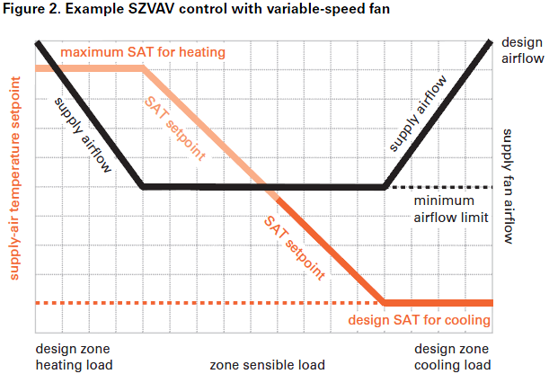
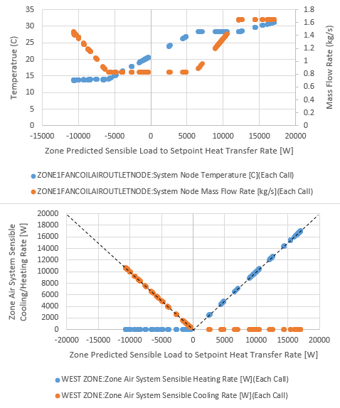
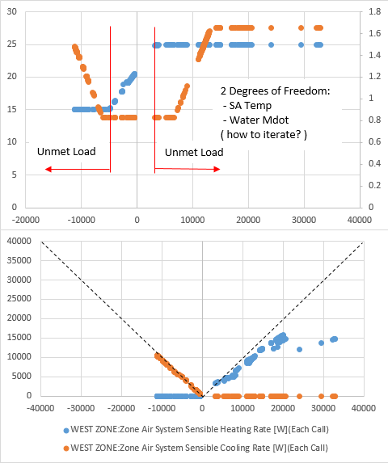

<head>

  
</head>

4.1.1. Single-Zone Variable Air Volume (SZVAV) Controls for Other Zone-Level Equipment
================

**Richard Raustad, Florida Solar Energy Center**

 - NFP Initial draft submitted November 8, 2016
 - 
 

## Justification for New Feature ##

New feature added to ZoneHVAC:FourPipeFanCoil object in V8.6. Users request similar control for other zone equipment types. The next logical equipment type would be packaged air conditioners or heat pumps. This control requires two-speed or variable speed coils and fans. The ZoneHVAC:PackagedTerminalAirConditioner or ZoneHVAC:PackagedTerminalHeatPump both allow variable speed coils with corresponding adjustments to air flow rate.

ASHRAE Standard 90.1 requirements for capacity and fan speed control as well as provision of minimum outdoor air requirements based on Standard 62.1.

    Section 6.4.3.10 (“Single Zone Variable-Air-Volume Controls”) of ASHRAE Standard 90.1-2010. HVAC systems shall have variable airflow controls as follows:
    (a) Air-handling and fan-coil units with chilled-water cooling coils and supply fans with motors
        greater than or equal to 5 hp shall have their supply fans controlled by two-speed motors or
        variable-speed drives. At cooling demands less than or equal to 50%, the supply fan controls
        shall be able to reduce the airflow to no greater than the larger of the following:
        • One-half of the full fan speed, or
        • The volume of outdoor air required to meet the ventilation requirements of Standard 62.1.
    (b) Effective January 1, 2012, all air-conditioning equipment and air-handling units with direct
        expansion cooling and a cooling capacity at AHRI conditions greater than or equal to 110,000
        Btu/h that serve single zones shall have their supply fans controlled by two-speed motors or
        variable-speed drives. At cooling demands less than or equal to 50%, the supply fan controls
        shall be able to reduce the airflow to no greater than the larger of the following:
        • Two-thirds of the full fan speed, or
        • The volume of outdoor air required to meet the ventilation requirements of Standard 62.1.
        
*Note from the author: In part (a) above, the phrase, “At cooling demands less than or equal to 50%…” may be confusing, so the Standard 90.1 User’s Manual clarifies by stating the following:*

        “The term ‘cooling demand’ refers to the zone sensible cooling load.That is, when the zone
        sensible cooling load decreases to 50% of the design sensible cooling load for the zone, the
        supply fan controls shall have reduced airflow to the threshold described.”
        In addition, the User’s Manual clarifies that the supply fan can be controlled by either a
        two-speed motor, an electronically commutated motor (ECM), or a variable-frequency drive (VFD).

## E-mail and  Conference Call Conclusions ##

E-mail notes: na

## Overview ##

The Trane Engineers Newsletter describes various control strategies for single-zone equipment. This proposal is closely based on that description. This document is located in the EnergyPlusDevSupport\DesignDocuments\Proposals folder for review as necessary.

Based on the ASHRAE Standard 90.1 description in Section 6.4.3.10, the control of zone equipment, specifically fan speed, is accomplished through modulation of the supply air temperature. In EnergyPlus, capacity regulation is primarily based on water flow rate modulation, and secondarily based on air flow modulation through fan speed adjustment (either single speed, two-speed, or variable-speed). In addition, EnergyPlus zone equipment uses a load-based control approach where supply air temperature is a result of the control, not a primary mechanism for control.

To allow zone equipment to maintain a constant minimum flow rate up to 50% of the **design zone load**, the supply air temperature must be adjusted to meet the zone load and zone air temperature set point while maintaining a fixed minimum equipment flow rate. Since it is possible to control both water and DX coils to a temperature set point, it is proposed that a new control method be added to zone equipment, specifically Fan Coils. This new control method can then be added to other equipment models. Special care will be used to develop a portable model that can easily be applied to other equipment models. The level of effort needed for this task will dictate if this new model can be applied to other equipment models within the time frame and budget allotted for this task.

This example depicts quite well the intended result of the new control method. Maintain a fixed minimum supply air flow rate for all loads within 50% of the design zone load while modulating supply air temperature to meet the zone load. When the zone load exceeds 50% of the design zone load, the supply air flow rate is increased while maintaining a maximum SAT for heating and minimum SAT for cooling.

As shown in the figure, there are 3 distinct air flow control scenarios:

  - minimum fan flow where coil capacity is modulated to meet the zone load (center of figure)
  - modulated air flow and/or coil capacity to meet the zone load (increasing air flow rates on left and right side of figure)
  - maximum fan flow were coil capacity is again modulated to meet the zone load (upper left and right of figure)

To accomplish this control method, a new key was added to the four pipe fan coil Capacity Control Method field to specify this new ASHRAE90.1 control method.

    ZoneHVAC:FourPipeFanCoil,
    A3 , \field Capacity Control Method
         \required-field
         \type choice
         \key ConstantFanVariableFlow
         \key CyclingFan
         \key VariableFanVariableFlow
         \key VariableFanConstantFlow
         \key MultiSpeedFan
         \key ASHRAE90VariableFan

The maximum and minimum fan flow threshold is determined using existing inputs for Maximum Supply Air Flow Rate and Low Speed Supply Air Flow Ratio fields. 

    ZoneHVAC:FourPipeFanCoil,
    N1 , \field Maximum Supply Air Flow Rate
         \required-field
         \autosizable
         \units m3/s
    N2 , \field Low Speed Supply Air Flow Ratio
         \type real
         \minimum> 0.0
         \default 0.33

This allows modeling of two-speed and variable-speed fans. The medium speed supply air flow ratio input field is not used at this time. The 2nd degree of freedom is the range of zone loads to be met. As described in the Standard, a portion of the **zone design sensible load** is used as the critical point. Using existing model inputs, the Low Speed Supply Air Flow Ratio input field will be used to denote this threshold. For water coils, a value of 50% is typically used. For DX equipment, a value of 67% is typically used. 

Finally, based on conference call feedback, two additional input fields were added to the end of the fan coil object such that the user could control the temperature limits and also avoid the need for autosizing. Units are missing in these fields "\units C".

    N11, \field Minimum Supply Air Temperature in Cooling Mode
      \note For Capacity Control Method = ASHRAE90VariableFan, enter the minimum air temperature in cooling mode.
      \note Leave this field blank or enter 0 to control to the zone load per ASHRAE 90.1. In this case, a zone sizing simulation is required.
      \type real
      \minimum 0.0
    N12; \field Maximum Supply Air Temperature in Heating Mode
      \note For Capacity Control Method = ASHRAE90VariableFan, enter the maximum air temperature in heating mode.
      \note Leave this field blank or enter 0 to control to the zone load per ASHRAE 90.1. In this case, a zone sizing simulation is required.
      \type real
      \minimum 0.0

The result of this effort provides a water coil model that closely replicates the expected control.

Model inputs:

    ZoneHVAC:FourPipeFanCoil,
      Zone1FanCoil,            !- Name
      ASHRAE90VariableFan,     !- Capacity Control Method
      autosize,                !- Maximum Supply Air Flow Rate {m3/s}
      0.5,                     !- Low Speed Supply Air Flow Ratio
      0.5,                     !- Medium Speed Supply Air Flow Ratio
      autosize,                !- Maximum Outdoor Air Flow Rate {m3/s}
      autosize,                !- Maximum Cold Water Flow Rate {m3/s}
      0.0,                     !- Minimum Cold Water Flow Rate {m3/s}
      autosize,                !- Maximum Hot Water Flow Rate {m3/s}
      0.0,                     !- Minimum Hot Water Flow Rate {m3/s}
      ,                        !- Minimum Supply Air Temperature in Cooling Mode
      ,                        !- Maximum Supply Air Temperature in Heating Mode

 
Figure - ASHRAE 90.1 SZVAV Fan Control in V8.6

The simulation results when using the new temperature control inputs is shown in the following figure. 

Apparently, this aspect of the model fell short of perfection. Although the temperature limits are enforced, the fan coil air flow rate does not increase until the load threshold is exceeded. We may consider increasing supply air flow rate once the supply air temperature reaches the limits. 
 

## Approach ##

The team will:

 - Investigate temperature limits using ASHRAE90.1 control method for ZoneHVAC:FourPipeFanCoil
 - Add new ASHRAE90.1 control for Packaged Terminal Air Conditioners and Heat Pumps

## Known Issues ##

- Controlling supply air temperature **AND** air flow rate may prove troublesome
- DX coils must adhere to a flow/capacity relationship to avoid freezing the cooling coil

## Testing/Validation/Data Sources ##

Compare simulation results with existing equipment models. Document comparison of outlet temperature and humidity ratio and power consumption. 

## Input Description ##

Limited changes to IDD and IO Reference documents as described herein. A single key field is added to the IDD for the PTAC/PTHP and reflected in the IO Reference document.

## Outputs Description ##

No change to output reporting

## IDD - Input Data Dictionary ##

Similar changes to ZoneHVAC:PackagedTerminalHeatPump. 
(Hint: no changes to existing object, new inputs are at end)

    ZoneHVAC:PackagedTerminalAirConditioner,
         \memo Packaged terminal air conditioner (PTAC).  Forced-convection heating-cooling unit
         \memo with supply fan, direct expansion (DX) cooling coil, heating coil (gas, electric, hot
         \memo water, or steam) and fixed-position outdoor air mixer.
         \min-fields 18
    A1,  \field Name
         \required-field
         \type alpha
         \reference DOAToZonalUnit
         \note Unique name for this packaged terminal air conditioner object.
    A2,  \field Availability Schedule Name
         \note Availability schedule name for this system. Schedule value > 0 means the system is available.
         \note If this field is blank, the system is always available.
         \type object-list
         \object-list ScheduleNames
         \note Schedule values of 0 denote the unit is off.
    A3 , \field Air Inlet Node Name
         \required-field
         \type node
         \note Air inlet node for the PTAC must be a zone air exhaust Node.
    A4 , \field Air Outlet Node Name
         \required-field
         \type node
         \note Air outlet node for the PTAC must be a zone air inlet node.
    A5,  \field Outdoor Air Mixer Object Type
         \type choice
         \key OutdoorAir:Mixer
         \note Currently only one OutdoorAir:Mixer object type is available.
         \note This field should be left blank if the PTAC is connected to central
         \note dedicated outdoor air through an AirTerminal:SingleDuct:Mixer object.
    A6 , \field Outdoor Air Mixer Name
         \type object-list
         \object-list OutdoorAirMixers
         \note If this field is blank, the OutdoorAir:Mixer is not used.
         \note This optional field specifies the name of the OutdoorAir:Mixer object.
         \note When used, this name needs to match name of the OutdoorAir:Mixer object.
         \note This field should be left blank if the PTAC is connected to central
         \note dedicated outdoor air through an AirTerminal:SingleDuct:Mixer object.
    N1 , \field Cooling Supply Air Flow Rate
         \required-field
         \type real
         \units m3/s
         \minimum> 0.0
         \autosizable
         \note Must be less than or equal to fan size.
    N2 , \field Heating Supply Air Flow Rate
         \required-field
         \type real
         \units m3/s
         \minimum> 0.0
         \autosizable
         \note Must be less than or equal to fan size.
    N3 , \field No Load Supply Air Flow Rate
         \type real
         \units m3/s
         \minimum 0
         \autosizable
         \note Must be less than or equal to fan size.
         \note Only used when supply air fan operating mode schedule values specify continuous fan
         \note (schedule values greater than 0 specify continuous fan operation).
         \note This air flow rate is used when no heating or cooling is required and the cooling or
         \note heating coil is off. If this field is left blank or zero, the supply air flow rate
         \note from the previous on cycle (either cooling or heating) is used.
    N4 , \field Cooling Outdoor Air Flow Rate
         \required-field
         \type real
         \units m3/s
         \minimum 0
         \autosizable
         \note Must be less than or equal to supply air flow rate during cooling operation.
         \note This field is set to zero flow when the PTAC is connected to central
         \note dedicated outdoor air through air terminal single duct mixer object.
    N5 , \field Heating Outdoor Air Flow Rate
         \required-field
         \type real
         \units m3/s
         \minimum 0
         \autosizable
         \note Must be less than or equal to supply air flow rate during heating operation.
         \note This field is set to zero flow when the PTAC is connected to central
         \note dedicated outdoor air through air terminal single duct mixer object.
    N6 , \field No Load Outdoor Air Flow Rate
         \type real
         \units m3/s
         \minimum 0
         \autosizable
         \note Only used when supply air fan operating mode schedule values specify continuous fan
         \note (schedule values greater than 0 specify continuous fan operation).
         \note This air flow rate is used when no heating or cooling is required and the cooling or
         \note heating coil is off. If this field is left blank or zero, the outdoor air flow rate
         \note from the previous on cycle (either cooling or heating) is used.
         \note This field is set to zero flow when the PTAC is connected to central
         \note dedicated outdoor air through air terminal single duct mixer object.
    A7 , \field Supply Air Fan Object Type
         \required-field
         \type choice
         \key Fan:OnOff
         \key Fan:ConstantVolume
         \note Fan:ConstantVolume only works when continuous fan operation is used the entire
         \note simulation (all supply air fan operating mode schedule values are greater than 0).
         \note If any fan operating mode schedule values are 0 a Fan:OnOff object must be used.
    A8 , \field Supply Air Fan Name
         \required-field
         \type object-list
         \object-list FansCVandOnOff
         \note Needs to match in the fan object.
    A9 , \field Heating Coil Object Type
         \required-field
         \type choice
         \key Coil:Heating:Fuel
         \key Coil:Heating:Electric
         \key Coil:Heating:Water
         \key Coil:Heating:Steam
         \note Select the type of heating coil.
    A10 , \field Heating Coil Name
         \required-field
         \type object-list
         \object-list HeatingCoilName
         \note Needs to match in the heating coil object.
    A11, \field Cooling Coil Object Type
         \required-field
         \type choice
         \key Coil:Cooling:DX:SingleSpeed
         \key Coil:Cooling:DX:VariableSpeed
         \key CoilSystem:Cooling:DX:HeatExchangerAssisted
         \note Select the type of Cooling Coil.
         \note Only works with Coil:Cooling:DX:SingleSpeed or
         \note CoilSystem:Cooling:DX:HeatExchangerAssisted or
         \note Coil:Cooling:DX:VariableSpeed.
    A12, \field Cooling Coil Name
         \required-field
         \type object-list
         \object-list CoolingCoilsDXSingleSpeed
         \object-list CoolingCoilsDXVariableSpeed
         \note Needs to match a DX cooling coil object.
    A13, \field Fan Placement
         \type choice
         \key BlowThrough
         \key DrawThrough
         \default DrawThrough
         \note Select fan placement as either blow through or draw through.
    A14, \field Supply Air Fan Operating Mode Schedule Name
         \type object-list
         \object-list ScheduleNames
         \note Enter the name of a schedule that controls fan operation. Schedule Name values of 0 denote
         \note cycling fan operation (fan cycles with cooling or heating coil). Schedule Name values greater
         \note than 0 denote constant fan operation (fan runs continually regardless of coil operation).
    A15, \field Availability Manager List Name
         \note Enter the name of an AvailabilityManagerAssignmentList object.
         \type object-list
         \object-list SystemAvailabilityManagerLists
    A16, \field Design Specification ZoneHVAC Sizing Object Name
         \note Enter the name of a DesignSpecificationZoneHVACSizing object.
         \type object-list
         \object-list DesignSpecificationZoneHVACSizingName

    New Inputs:
    A17, \field Capacity Control Method
         \type choice
         \key None
         \key ASHRAE90VariableFan
         \default None
    N7 , \field Minimum Supply Air Temperature in Cooling Mode
         \note For Capacity Control Method = ASHRAE90VariableFan, enter the minimum air temperature in cooling mode.
         \note Leave this field blank or enter 0 to control to the zone load per ASHRAE 90.1. In this case, a zone sizing simulation is required.
         \type real
         \minimum 0.0
         \autosizable
         \default autosize
    N8 ; \field Maximum Supply Air Temperature in Heating Mode
         \note For Capacity Control Method = ASHRAE90VariableFan, enter the maximum air temperature in heating mode.
         \note Leave this field blank or enter 0 to control to the zone load per ASHRAE 90.1. In this case, a zone sizing simulation is required.
         \type real
         \minimum 0.0
         \autosizable
         \default autosize

Question: Add to end of object or insert at a more appropriate place (e.g., before or after air flow fields)?

## Input Output Reference Documentation ##

Add new field descriptions.

## Engineering Reference ##

Add model calculations.

## Example File and Transition Changes ##

No transition required unless fields are inserted within existing object fields.

## References ##

NA

