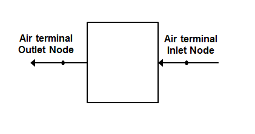

Task: 4.1.1 Single Duct Constant Volume Air Terminal Without Reheat 

Single Duct Constant Volume Air Terminal NoReheat New Object
================

**Bereket Nigusse, Florida Solar Energy Center**

 - November 20, 2017 (submitted initial NFP)
 - December 4, 2017 (submitted Final NFP)


## Justification for New Feature ##

The existing AirTerminal:SingleDuct:Uncontrolled object is different from all other terminal units in EnergyPlus and has the following limitations:

- It only has a single node and it is implemented directly on the zone equipment list instead of being referenced by a ZoneHVAC:AirDistributionUnit object. This causes problem to interface developers.
- Prevents this terminal unit from using the simple duct-leakage model in ZoneHVAC:AirDistributionUnit.

The new air terminal object will solve these problems.


## E-mail and  Conference Call Conclusions ##
N/A

## Overview ##

The scope of work for this new feature is:

- add new EnergyPlus object AirTerminal:SingleDuct:ConstantVolume:NoReheat
- will have inlet and outlet air nodes.
- allow the new object to be referenced by ZoneHVAC:AirDistributionUnit
- will have capabilities of AirTerminal:SingleDuct:Uncontrolled object.
 
The expectation is that the AirTerminal:SingleDuct:ConstantVolume:NoReheat will replace AirTerminal:SingleDuct:Uncontrolled object.

## Approach ##

- creates the new object AirTerminal:SingleDuct:ConstantVolume:NoReheat and adds to the ADU equipment list 
- the new object will have inlet and outlet air node (see below the new IDD and idf objects)
- adds new get input section in GetSysInput() function under SingleDuct.cc module
- adds new sim function for air terminal Single Duct CV No Reheat object
- simulated by calling from "SimulateSingleDuct" function
- allow all capabilities of AirTerminal:SingleDuct:Uncontrolled in this new object
- update reference documentations as needed
- the AirTerminal:SingleDuct:Uncontrolled object will be marked as deprecated

## Testing/Validation/Data Sources ##

Compare outputs with the AirTerminal:SingleDuct:Uncontrolled object. Transitioned Example files are not expected to show diffs.

## Input Output Reference Documentation ##

Add a section for this new object in the Input Output Reference under Group - Air Distribution Equipment

The *AirTerminal:SingleDuct:ConstantVolume:NoReheat* object creates the capability of supplying central system air directly to a zone without any zone level thermostat control. The supply air temperature is controlled by the central system controller. It is typically used with an AirLoopHVAC running as a constant-volume and variable-temperature system. This object allows the program to know what zone this branch of the air system is attached to, and input fields for availability schedule, air inlet and outlet nodes, the maximum air flow rate, and other two optional input fields. The air inlet node should be the same as one of the *AirLoopHVAC:ZoneSplitter* object outlet nodes. The air outlet node name should be same as zone air inlet node name and the air distribution unit air outlet node name. The last two optional input fields: *Design Specification Outdoor Air Object Name*, and *Per Person Ventilation Rate Mode* are used for modulating the outdoor air requirement of an air terminal unit depending on the method.



                         Figure 1 Air terminal single duct constant volume without reheat


## IDD - Input Data Dictionary ##
This new IDD object has all input fields of the *AirTerminal:SingleDuct:Uncontrolled* IDD object except that the *Design Specification Air Terminal Sizing Object Name* input field. The value for the later input field can be obtained from the parent object, ZoneHVAC:AirDistributionUnit. Also unlike the *Uncontrolled* object the new object has an inlet and an outlet air nodes input fields. Proposed idd object is shown below.

```

AirTerminal:SingleDuct:ConstantVolume:NoReheat,

       \memo Central air system terminal unit, single duct, constant volume, without reheat coil

  A1 , \field Name

       \required-field
       \reference AirTerminalUnitNames

  A2 , \field Availability Schedule Name

       \note Availability schedule name for this system. Schedule value > 0 means the system is available.
       \note If this field is blank, the system is always available.
       \type object-list
       \object-list ScheduleNames

  A3,  \field Air Outlet Node Name

       \required-field
       \type node
       \note This is an air outlet node from the air distribution unit. This node name should be one of the 
       \note supply air inlet node names of a zone served by this component.

  A4,  \field Air Inlet Node Name

       \required-field
       \type node
       \note The air-inlet node name that connects the air splitter to the individual zone air distribution 
       \note unit. This node should also be one of the outlet air node of an AirLoopHVAC:ZoneSplitter component.

  N1,  \field Maximum Air Flow Rate

       \required-field
       \units m3/s
       \minimum 0.0
       \autosizable

   A5, \field Design Specification Outdoor Air Object Name

       \type object-list
       \object-list DesignSpecificationOutdoorAirNames
       \note When the name of a DesignSpecification:OutdoorAir object is entered, the terminal
       \note unit will adjust flow to meet this outdoor air requirement and no more. Load is still "Uncontrolled."
       \note If Outdoor Air Flow per Person is non-zero, then the outdoor air requirement will
       \note be computed based on the current number of occupants in the zone, as for demand controlled ventilation.
       \note At no time will the supply air flow rate exceed the value for Maximum Air Flow Rate.
       \note If this field is blank, then the terminal unit will not be controlled for outdoor air flow.

   A6; \field Per Person Ventilation Rate Mode

       \type choice
       \key CurrentOccupancy
       \key DesignOccupancy
       \default CurrentOccupancy
       \note CurrentOccupancy models demand controlled ventilation using the current number of people
       \note DesignOccupancy uses the total Number of People in the zone and is constant

```

## Input Description ##

### Inputs

#### Field: Name

A unique user assigned name for each AirTerminal:SingleDuct:ConstantVolume:NoReheat component. Any other component that needs to use this terminal air component will refer to it by this name.

#### Field: Availability Schedule Name

The name of the schedule (ref: Schedule) that denotes whether the component can run during a given time period. A schedule value greater than 0 (usually 1 is used) indicates that the component can be on during the time period. A value less than or equal to 0 (usually 0 is used) denotes that the component must be off for the time period. If this field is blank, the schedule has values of 1 for all time periods.

#### Field: Air Outlet Node Name

This is an air outlet node from the air distribution unit. This node name should be one of the supply air inlet node names of a zone served by this component.

#### Field: Air Inlet Node Name

The air-inlet node name that connects the air splitter to the individual zone air distribution unit. This node should also be one of the outlet air node of an AirLoopHVAC:ZoneSplitter component.

#### Field: Maximum Air Flow Rate

The design maximum volume flow rate~ (m\(^{3}\)/sec) specified for the AirTerminal:SingleDuct:ConstantVolume:NoReheat object.  This field is autosizable.

#### Field: Design Specification Outdoor Air Object Name

This field allows modifying the behavior of this air terminal so that it is modulated to supply the required outdoor air to the zone.  This field is optional. When the name of an DesignSpecification:OutdoorAir object is entered, the model is changed to adjust the flow rate to provide the volume of outdoor air described by that object.  This feature allows modeling demand controlled ventilation on a zone-by-zone basis using the Outdoor Air Flow per Person rate (specified in the DesignSpecification:OutdoorAir object) and the number of occupants (specified in the People object schedules).  If the outdoor air fraction of the supply air is 1.0, as for a dedicated outdoor air system, the air flow rate will match the outdoor air requirement.  When the outdoor air fraction is less than 1.0, as for a recirculating air system, the terminal air flow will be modulated upward to account for the increased total air flow needed to provide the required flow rate of outdoor air.   The total air flow rate will not exceed the Maximum Air Flow Rate specified above. The volume flow rate is converted to mass flow rate using the standard density of air at Pressure = 101325 Pa, Temperature = 20C, and Humidity Ratio = 0.0.

#### Field: Per Person Ventilation Rate Mode

This field specifies how the outdoor air ventilation rates are calculated when based on a rate per person. It can be either based on the current number of people as affected by time-varying occupancy schedules, or on the constant value for the maximum number of people.  Enter the key CurrentOccupancy for the former and DesignOccupancy for the later.


## New idf object based on the proposed IDD object.

#### AirTerminal:SingleDuct:ConstantVolume:NoReheat New Object

```
AirTerminal:SingleDuct:ConstantVolume:NoReheat,

      NoReheat Zone 1,                !- Name of System
      AlwaysOnFanAvailSched,          !- Availability Schedule Name
      Zone 1 Unit Air Outlet Node,    !- Air Outlet Node Name
      Zone 1 Unit Air Inlet Node,     !- Air Inlet Node Name
      0.60,                           !- Maximum Air Flow Rate {m3/s}
      ,                               !- Design Specification Outdoor Air Object Name
      ;                               !- Per Person Ventilation Rate Mode


```

## Outputs Description ##

  HVAC,Sum,Zone Air Terminal Sensible Heating Energy {[}J{]}

  HVAC,Sum,Zone Air Terminal Sensible Cooling Energy {[}J{]}

  HVAC,Average,Zone Air Terminal Sensible Heating Rate {[}W{]}

  HVAC,Average,Zone Air Terminal Sensible Cooling Rate {[}W{]}


Zone Air Terminal Sensible Heating Energy 

Zone Air Terminal Sensible Heating Rate

These outputs are the sensible heating energy and heating rate provided to the zone by the air terminal single duct constant volume no reheat object.

Zone Air Terminal Sensible Cooling Energy

Zone Air Terminal Sensible Cooling Rate

These outputs are the sensible cooling energy and cooling rate provided to the zone by the air terminal single duct constant volume no reheat object.

## Engineering Reference ##

The input object AirTerminal:SingleDuct:ConstantVolume:NoReheat is used to pass conditioned or treated central supply air directly into a zone without any reheat. This terminal air equipment allows to supply central system air directly to a zone without any zone level control or tempering. The supply air temperature is controlled by the central system to meet the load in a controlled zone. This object is configured for use with a constant volume central air system or Furnace and variable supply air temperature. This unit allows the program to know what zone this branch of the air system is attached to, air inlet and outlet nodes, an input field for the maximum air flow rate, and other two optional input fields. The air inlet node should be the same as one of the AirLoopHVAC:ZoneSplitter object outlet nodes. The air outlet node name should be same as zone air inlet node name and the air distribution unit air outlet node name. The last two input fields: *Design Specification Outdoor Air Object Name*, and *Per Person Ventilation Rate Mode* are used for calculating the outdoor air requirement of an air terminal unit. This component is typically used with an AirLoopHVAC running as a constant-volume and variable-temperature system.

## Example File and Transition Changes ##

New example file will be added if needed. Transition option will be investigated.

## References ##

N/A

