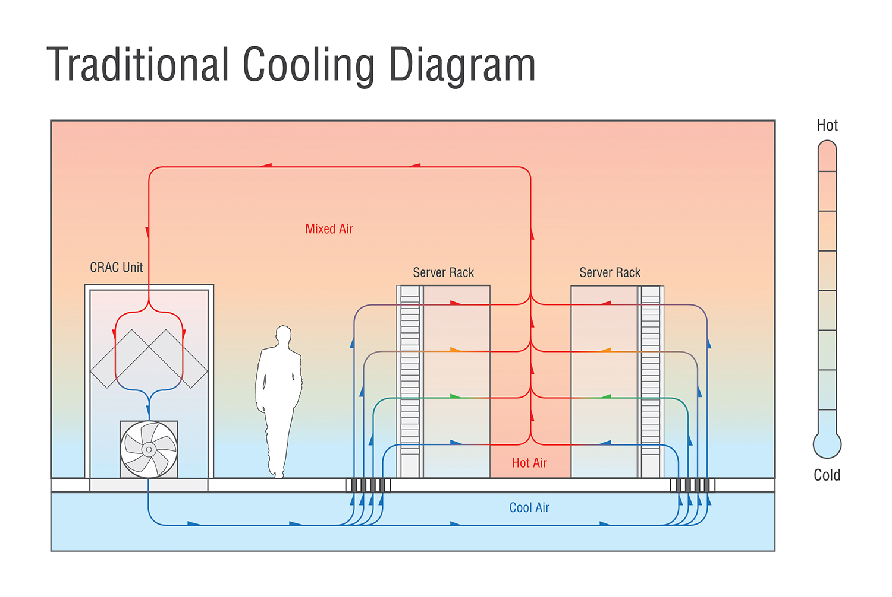
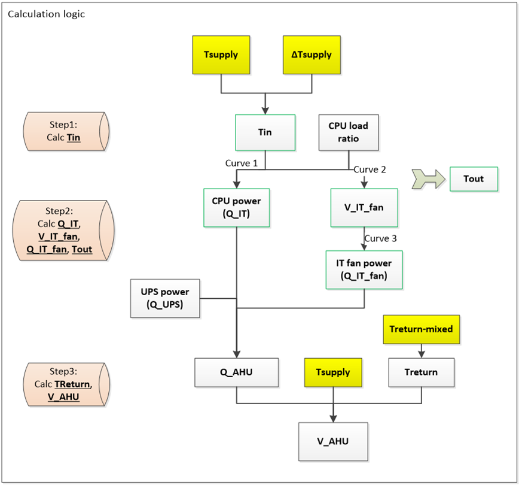

Enhancements to Improve Modeling of Data Centers
================

**Kaiyu Sun, Tianzhen Hong, Lawrence Berkeley National Laboratory**

 - May 15, 2017

## Justification for New Feature ##

Data centers in the United States consumed about 2% of the nation’s electricity power, and its energy use is growing faster than other building sectors. The proposed enhancements build upon existing capabilities of EnergyPlus to model energy performance of data centers (the ITE object) by enabling more flexibility to consider impact of air flow configurations and management strategies in data centers. The proposed enhancements were derived from discussions with members of the ASHRAE Standard 90.1/90.4, Technical Committee 9.9 and LBNL’s data center researchers.

## E-mail and  Conference Call Conclusions ##

No team call yet.

## Overview ##

The existing ITE object in EnergyPlus addressed some critical needs of modeling data centers. We propose enhancements to consider airflow containment configuration in data centers, which supports energy efficiency design of data centers and activities under ASHRAE Standard 90.4 and TC 9.9. The enhancements introduce a concept of two temperature differences to represent the air flow management (air bypass, recirculation, mixing) of data centers for the purpose of energy calculation.
Based on discussions with data center experts and manufacturers, data centers are different from normal well-mixed zones due to the uneven air distribution (Figure 1): The IT inlet temperature differs from AHU supply air temperature, and the actual AHU return air temperature differs from the regular return air temperature if the zone is well mixed. We propose two indices to represent the deviation: (1) **Supply approach temperature (∆Tsupply)** and (2) **Return approach temperature (∆Treturn)**. The two temperature differences indicate to what degree the air flow management of data centers affects the air distribution, and how much they deviate from the regular well-mixed zone scenario.

$$\Delta T_{supply}=\Delta T_{in}-\Delta T_{supply}$$

$$\Delta T_{return}=\Delta T_{return}-\Delta T_{return-mixed</sub}$$

Where, 

Tin: IT equipment inlet temperature

Tsupply : AHU supply air temperature

Treturn : The actual AHU return air temperature

Tairzone : The calculated zone air temperature (or return air temperature) if the room is well-mixed

The two approach temperatures can be calculated by CFD tools for typical IT load levels and air flow management of data centers, or provided by measurement data or lookup tables. 

This document describes the simulation algorithm, as well as the proposed modifications to the existing ITE object in EnergyPlus. 

**Figure 1 Illustrative diagram of air flow and tempaerature profile in typical data centers**

## Approach ##

We propose a calculation logic as shown in Figure 2. Detailed calculation steps are as follows:
(Note: inputs marked with stars (*) are already in the existing ITE object in EnergyPlus)

+ **Step 1**: 
	Calculate IT inlet temperature (Tin):

	$$T_{in}=T_{supply}+\Delta T_{supply}$$
	- Input:
		- Tsupply*: AHU supply air temperature	
		- ∆Tsupply: Supply approach temperature
	- Output：
		- Tin: IT inlet temperature

+ **Step 2**:
	Calculate CPU power (Q\_IT), IT fan air flow rate (V\_IT\_fan), IT fan power (Q\_IT\_fan), and IT outlet temperature (Tout).
	
	$$Q_{IT}=f1(T_{in},SchCPULoading)$$	

	$$V_{ITfan}=f2(T_{in},SchCPULoading)$$	

	$$Q_{ITfan}=f3(V_{ITfan} )$$	

	$$T_{out}=T_{in}+(Q_{IT}+Q_{ITfan})/V_{ITfan}$$
	- Input:
		- SchCPULoading*: Scheduled fraction of CPU loading, namely CPU load ratio
		- Tin: IT equipment inlet temperature
		- Curve f1*: CPU Power Function of Loading and Air Temperature
		- Curve f2*: Air Flow Function of Loading and Air Temperature
		- Curve f3*: Fan Power Function of Air Flow Rate
	- Output:
		- QIT: CPU power
		- VITfan: IT fan air flow rate
		- QITfan: IT fan power
		- Tout: IT outlet temperature

+ **Step 3**:
	Calculate AHU return air temperature (Treturn) and AHU air flow rate (V\_AHU).
	
	$$T_{return}=\Delta T_{return}+T_{return-mixed}$$

	$$Q_{AHU}=Q_{IT}+Q_{ITfan}+Q_{UPS}$$

	$$V_{AHU}=Q_{AHU}/(T_{return}-T_{supply})$$
	- Input:
		- Treturn-mixed: The calculated AHU return air temperature if air is well-mixed. This is the simulated result from the last time step based on the zone setpoint in EnergyPlus
		- ∆Treturn: Return approach temperature
		- QUPS*: UPS load
	- Output:
		- Treturn: actual AHU return air temperature
		- VAHU: AHU air flow rate

The calculated AHU air flow rate V\_AHU will be used to overwrite the calculated supply air flow rate for the terminal units serving the data center zone.

**Figure 2 Calculation logic**

## Testing/Validation/Data Sources ##

An example file will be developed to demonstrate the use of the new feature. Simulation results will be manually checked/benchmarked using excel spreadsheet with input and output from EnergyPlus runs.

## IDD Object (New) ##

To be developed in DD.

## IDD Object(s) (Revised) ##

We will modify the existing ITE object, keeping its current function and inputs, to implement the two new calculation methods. The proposed modifications require transition changes of existing IDF files.

Fields to add:

1.	Calculation Method (type: object-list)
	
	a. FlowFromSystem(Default, same as the current function)

	b. FlowControlWithApproachTemperatures 

2.	Supply Approach Temperature (required if choosing b @Calculation Method)
3.	Supply Approach Temperature Schedule (optional, always 1 if leave blank)
4.	Return Approach Temperature (required if choosing b @Calculation Method)
5.	Return Approach Temperature Schedule (optional, always 1 if leave blank)

Fields to modify:

The following existing fields of the ITE object are not required if choosing b @Calculation Method (field 1 above), just add extra description in these fields:

1.	Air Inlet Connection Type
2.	Design Recirculation Fraction
3.	Recirculation Function of Loading and Supply Temperature Curve Name

All the other fields remain the same. 

## Proposed additions to Meters: ##
N/A

## Proposed Report Variables: ##
N/A

## IO Ref (draft): ##
To be developed.

## EngRef (draft): ##
To be developed.

## Example File  ##
To be developed.

## E-mail comments ##

Mike Witte, April 19, 2017

I think I follow the proposed method.  Some questions/concerns:

1.  Are fixed values for the approach temperature *differences* adequate?  Should these be a curve or schedule?  Or at least implement them with EMS actuators to allow them to be varied.

	> Adding a schedule is a good idea enabling time-changing values or calculated values by other tools either through pre-calculation or real-time co-simulation.

2.  The supply approach temperature difference is essentially what the existing recirculation fraction is intended to model. It's just defined differently and the current bulk zone temperature comes into play.  This option seems to be useful with both calculation methods, so you may want to consider adding a third option to Air Inlet Connection Type: SupplyTemperatureDifference, SupplyWithRecirculation, RoomAirModel.

	> The new proposed method is indicated by a new choice of the new field “Air Flow Management Type”. We don’t plan to change the existing field “Air Inlet Connection Type”.  The reason is the new method uses two temperature differences, one for the supply and the other for the return, while the field “Air Inlet Connection Type” only indicates the supply side.

	MJW -  Having the option to specify a simple difference with the current algorithm seems useful to me, but it may be too confusing to add that flexibility.

	> Agree. Instead of adding field “Air Flow Management Type”, we’ll add field “Calculation Method” (options: FlowFromSystem, FlowControlWithApproachTemperatures) to differentiate the new method from the existing one. The IDD objects are modified accordingly.

3.  If I am following correctly, the new "Calculation Algorithm" could be named "System Flow Control Type" or something similar since the goal in both methods is to calculate the supply flow rate.

	> We propose to name it “Air Flow Management Type” with two choices: (1) RecirculationFraction, (2) TemperatureDifferences. Choice 1 is the current method, set as the default choice. Choice 2 is the new proposed method which requires users to input the supply and return temperature differences.

	MJW – This isn’t really any better, because the existing method works with or without recirculation fraction depending on the choice for Air Inlet Connection Type.  So, without any changes to the Air Inlet Connection Type field, your original propose field name here is more clear.  Sorry to go backwards on this. But maybe the choices can better communicate what’s happening
	Calculation Method
		FlowFromSystem
		FlowControlWithApproachTemperatures
	Perhaps you can suggest better names, but the change in method alters both the ITE inlet temperature and whether the system airflow rate is used directly or is controlled by this object.  

	> Agree

4.  The main challenge will be communicating the supply flow rate to the terminal unit that is serving the zone.  Have you thought about how to do that?  It may require modifying one or more terminal units or finding a way to adjust the current zone load values so that the terminal unit calculates the same flow rate. 

	> Indeed there needs to overwrite the calculated supply air flow rate for the terminal units serving the data center zone.
	
	MJW – Then you will need a field for Controlled Supply Inlet Node or NodeList Name, so you know which node(s) to act on.  Or maybe just allow one supply inlet node to be controlled?  I don’t know that you can safely assume that you’ll be able to figure out the node name unless you restrict this to zones with only a single inlet node (i.e. no other forced air equipment in that zone).

	> Great point. We will limit to zones with only a single inlet node.

5.  There are also some questions about time lags in the zone mixed temperature.  Will you use the temperature from the end of the last timestep?

	> We will use the zone mixed temperature from the last timestep (due to no better data to justify otherwise).
