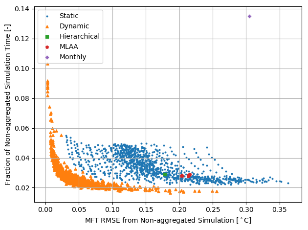
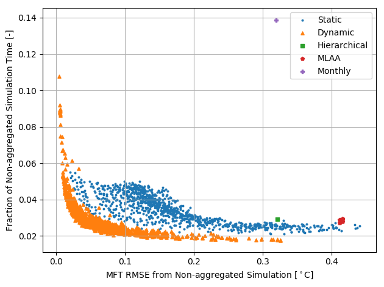
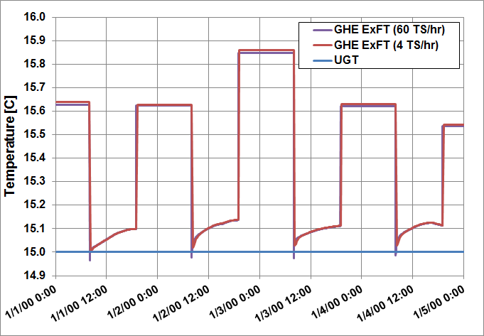
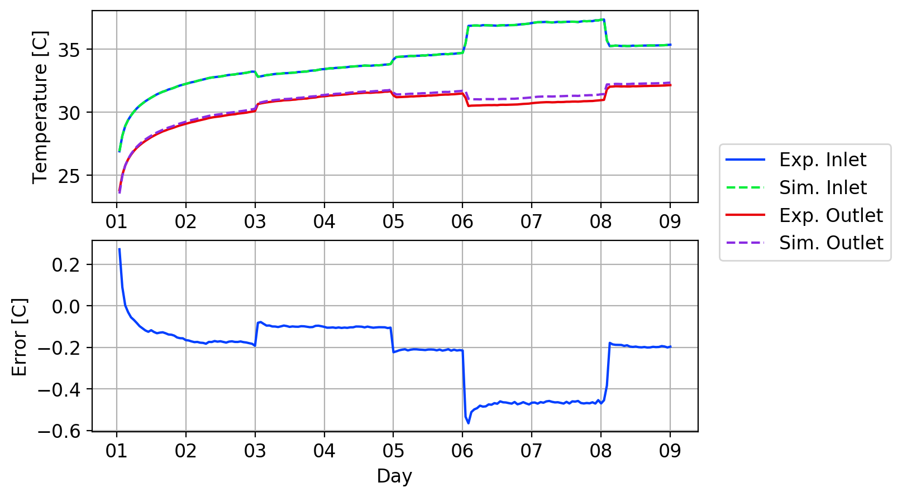
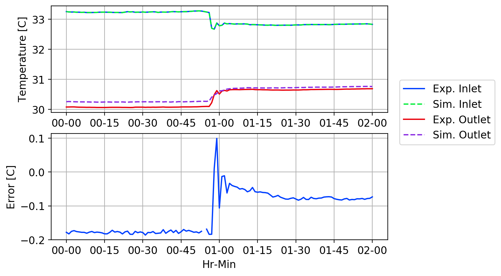
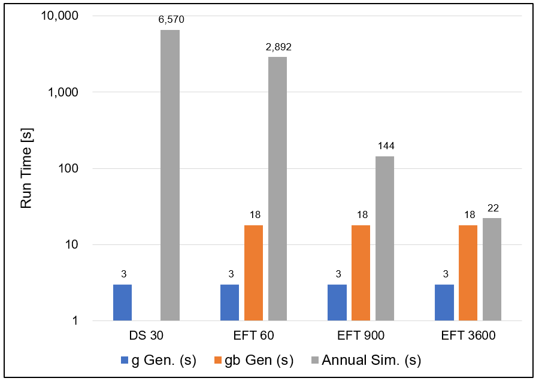

Enhanced Load Aggregation Method for Ground Heat Exchangers
===========================================================

**Matt Mitchell, OSU**

- Original Date: 2018-10-03
- Revised Date: 2018-10-24
- Revised Date: 2019-07-12

## Justification for New Feature ##

The EnergyPlus ground heat exchanger (GHE) model is based on a response factor approach which relies on a series of pre-computed response factors--a.k.a. "g-functions"--to compute the GHE temperature response. To compute the the GHE temperature response at any given timestep, the response factors along with the GHE load history are combined together as indicated in the equation below.

$$
T_f = T_g + \sum_{i=1}^n \frac{q_{i} - q_{i-1}}{2 \cdot \pi \cdot k_g} \cdot g\left(\frac{t_n - t_{i-1}}{t_s}\right) +  q_n \cdot R_b
$$

where:

$T_f$ is the current GHE mean-fluid temperature

$T_g$ is the ground temperature

$q_i$ is the $i^{th}$ GHE heat transfer rate normalized based on GHE length. i.e Btu/h-ft, W/m 

$t_i$ is the $i^{th}$ timestep

$t_s$ is the GHE time constant $\frac{H^2}{9\cdot\alpha_g}$

$R_b$ is the borehole thermal resistance

$g$ is the g-function response factors, which are generates previously by EnergyPlus or third-party tools.

Conduction can be evaluated using linear partial differential equations. Because no non-linear terms exist, the principle of superposition can be applied to conduction problems. GHE response factor models take advantage of this and apply the principle of superposition to compute the GHE temperature response by using the GHE load history. This series of heat pulses, when superimposed and combined using the response factors, can lead to an accurate calculation of the current GHE temperature response.

A practical issue that arises from this superpostion approach, however, is the fact that the number of superposition calculations grows with the square of the number of timesteps. Therefore, this approach greatly affects simulation runtime. Attempting to simulate, say, for example for annual or multi-year simulations may be impractical without some way to reduce the number of computations required.

In order to reduce runtime, load aggregation procedures have been developed which will reduce then number of superposition calculations, which in turn results in reduced runtime. The method currently implemented in EnergyPlus relies on the original load aggregation method developed by Yavuzturk & Spitler (1999), however, since this method's development and implementation a number of more advanced methods have been developed.

This project proposes to test the currently available methods and implement the best approach.

## E-mail and Conference Call Conclusions

- Mike Witte asked for additional clarification regarding which parameters were varied during the parametric study. He also suggested we check how variations in soil parameters affect the results. These clarifications and results have been incorporated into the NFP.

## Overview

Development of EnergyPlus must necessarily be considerate of simulation runtime. Many thousands of users download and use the program each year. These users, as well as additional third-party tools rely on EnergyPlus be and not only accurate but as fast as possible.

This project proposes to test, validate, and implement load aggregation methods for the ground heat exchanger model with the aim of improving accuracy and reducing model runtime.

## Approach

The code for this project has been prototyped, developed, optimized, and tested outside of the EnergyPlus repository.  The prototype code can be found here: https://github.com/mitchute/GLHE

The code was developed in Python to simplify the implementation and prototyping process. All of the load aggregation methods which were tested are described below. A parametric study was performed using the Cowboy Cluster at OSU, which is supported by NSF MRI award OCI-1126330.

#### Yavuzturk & Spitler 1999

Yavuzturk & Spitler (1999) were the first to develop a load aggregation procedure to reduce simulation runtime. The method described by Yavuzturk & Spitler (1999) relies on using "monthly" heat pulses to aggregate the loads. The method retains 192 hourly heat pulses for the most recent 192 simulation hours. Once the first 922 (192 + 730) hours have passed, the 730 hours which are farthest from the current simulation time are aggregated into monthly blocks. Once another 730 hours have passed the next 730 hours are aggregated into another monthly block. This process is repeated for the duration of the simulation.

Once a simulation is initiated the GHE hourly load history begins to be stored. For example, once 922 (192 + 730) simulated hours have passed, the hourly loads from hour 729 to 0 are aggregated together into a single block. The mean value of the loads over this period is computed and the 730 individual hourly loads are removed and replaced with a single value. This single value represents the average load over this 730 hour period. As the simulation continues for another 730 hours until hour 1652, the hourly loads from hours 1459 to 730 are aggregated together again into another monthly block.

This method forms the basis for what is termed the "static" method. The method is characterized by smaller load blocks which collapse into larger blocks once a sufficient number of the smaller blocks have been created. This was illustrated in the above example when the smaller hourly load blocks collapsed into the larger 730 hour blocks after a sufficient number of smaller blocks had been created. However, the the optimum number and duration of each block has yet to be determined. 

The method could loosely be thought of as similar to the Lagrangian approach which, in the case of fluid flow characterizations, tracks individual particles or packets of fluid, rather than tracking a fixed control volume through which fluid flows. In our case, however, we are concerned with tracking individual loads, or load blocks which are formed from previously aggregated smaller blocks.

The Yavuzturk & Spitler method is labeled as "Monthly" in the subsequent plots.

Data sets identified as "Static" apply the same logic, but the parameters regarding the minimum number of bins and the size of each bin are varied systematically in a parametric study.

#### Bernier et al. (2004)

The method developed by Bernier et al. (2004) is another approach which is very similar to the Yavuzturk & Spitler (1999) method, however the number and duration of the load aggregation intervals is different. 

In this case, the authors describe using 12 single hours for the 12 most recent hours of the simulation. After that, the loads begin to aggregate into 48, 168, and 360 hour blocks.

This method is labeled as "MLAA" in the subsequent plots. 

#### Liu (2005)

Liu (2005) developed another method which he called the "Hierarchical" method. This method represents a single case within the overarching "static" method. The minimum number and duration of each bin is outlined below.

- A minimum of 12 most recent hourly load values.
- Hourly loads are aggregated into 24 hours blocks.
- Once eight, 24 hour blocks have been created the 5 which are most-distant from the current simulation time are aggregated into a single block. The remaining three blocks are kept aggregated at the 24 hour level.
- Once 103, 120 hour (24 x 5) blocks have been created, the 73 which are most distant from the current simulation time are aggregated into a single block. This process is repeated as required.

This method is labeled as "Hierarchical" in the subsequent plots.

#### Claeson & Javed (2012)

The method developed by Claesson & Javed (2012) is the most recent load aggregation method which has been developed. The method, as opposed to the "static" method described previously, follows what could be characterized as a Eulerian approach. In a fluid flow application, the flow through a fixed control volume is assessed rather than individual packets or particles of fluid.

In our case, we predefine the bins and allow energy (GHE loads) to move through the bins.  This is illustrated in the table below, which is an example taken from Claesson & Javed (2012).

In the table the values of the GHE loads for each timestep within each bin is represented. Horizontally, the bin widths are are given as h or 2h, where h represent the length of the timestep. The most recent load is always in the first bin. See the following example description.

- At timestep 1, a value of 1 is placed in the Bin 1. 
- At timestep 2, h  x 1/h x Bin 1 is moved from Bin 1 to Bin 2. In other words, the timestep length, times the inverse of the current bin width, times the value of the energy in bin itself is moved from Bin 1 to Bin 2. In this case, the timestep is h, the bin width is h, and the value of the energy in Bin 1 is 1, so 100% of the energy (1) is moved from Bin 1 to Bin 2.  Energy is conserved and since the bins have the same width (meaning they represent the same time interval), the new value of Bin 2 is 1.
- At timestep 3, the same process is repeated. h x 1/h x 1 is the value of energy which is moved from Bin 2 to Bin 3. However, Bin 3 has a width of 2h, so the magnitude of the energy represented by the Bin is now 1/2. Again, energy is conserved but the original pulse of 1 is now assumed to have occurred over a 2h time interval. This process is repeated for all remaining timesteps.

Table 1: Dynamic method example.

|              | Bin 1 | Bin 2 | Bin 3 | Bin 4 | Bin 5 | Bin 6 | Bin 7 |
| ------------ | ----- | ----- | ----- | ----- | ----- | ----- | ----- |
| Timestep $n$ | h     | h     | 2h    | 2h    | 2h    | 2h    | 2h    |
| 1            | 1     |       |       |       |       |       |       |
| 2            | 0     | 1     |       |       |       |       |       |
| 3            | 0     | 0     | 1/2   |       |       |       |       |
| 4            | 0     | 0     | 1/4   | 1/4   |       |       |       |
| 5            | 0     | 0     | 1/8   | 2/8   | 1/8   |       |       |
| 6            | 0     | 0     | 1/16  | 3/16  | 3/16  | 1/16  |       |
| 7            | 0     | 0     | 1/32  | 4/32  | 6/32  | 4/32  | 1/32  |

This method is labeled as "Dynamic" in the subsequent plots.

## Testing/Validation

The methods were tested by performing a parametric study which swept a wide range of variations for the input parameters. The input parameters which are varied can be described using two questions: how much time should each bin represent, and how many bins a given aggregation period should be used. The two primary methods being tested are the dynamic and static method. The Liu (2015), Bernier et al. (2004), and Yavuzturk & Spitler (1999) methods are subsets of the static method.

EnergyPlus was used to generate two sets of annual loads. One load set consists of balanced heating and cooling loads, and the other set consists of imbalanced heating and cooling loads.  The simulations were also ran for 1 and 5 years for each of the load cases, resulting in a total of four simulations for each variation of the parametric study.

The simulations were compared against simulations for each of the four load and simulation variations using a "no-aggregation" method which kept all hourly loads from the entire simulation. The results from these simulations gives the baseline for comparing the results of the parametric runs.

Figures 1 and 2 below show the single-year balanced and imbalanced simulation results. The plots show the fraction of the non-aggregated simulation time on the vertical axis. The root-mean squared error of the mean GHE fluid temperature is plotted on the horizontal axis.

In both cases, the dynamic method out-performs the static method in terms of simulation time reduction and in terms of accuracy. 

Figure 1: 1-year balanced load parametric results.

Figure 2: 1-year imbalanced load parametric results.

Figures 3 and 4 show the results for the balanced and imbalanced load parametric studies using for a 5-year simulation.

Figure 3: 5-year balanced parametric results

Figure 4: 5-year imbalanced load parametric results

In all cases, the dynamic method outperforms the static method. Based on the above results, implementation of the dynamic method is proposed. The specific parameters for the dynamic method have yet to be determined. However, in any case, these are three integer-valued parameters which can be altered easily after implementation. 

Further description of how the parameters are being chosen is given in the draft paper related to this work. Contact me if you are interested and I can provide a working copy of the paper.

Update: this paper has been accepted for publication, and can be found [here.](https://www.dropbox.com/s/15n6xp43ai6dt94/Main_Document_Final_Submission.docx?dl=0)

## I/O Reference Documentation

No changes

## Engineering Reference Documentation

A few paragraphs describing the selected enhanced load aggregation procedure. A paper will be drafted regarding the work which should also be referenced here.

## Transition/Changes

None

## Update: 2019-07-11 --- Model Changes

Issue [#6777](<https://github.com/NREL/EnergyPlus/pull/6777>) is not related to this work, but will required the GHE model be refactored to correct the problem. As a result, this load aggregation work will be implemented at the same time as the correction to that issue. The following is a report which summarizes the changes required to correct the issue.

### Introduction

The ground heat exchanger model (GHE) in EnergyPlus is known to produce non-physical behavior when
simulating sudden loads at short time steps. An example of this is seen in Figure 5, where the GHE exiting fluid temperature (ExFT) is shown to dip below the undisturbed ground temperature (UGT) for a simulation using 60 time steps per hour after a step load is applied. The same behavior is not observed for the simulation with 4 time steps per hour.

Figure 5: current EnergyPlus GHE temperature response to step load.

Testing revealed that the fundamental assumptions upon which the current EnergyPlus model is based
requires quasi-steady conditions for the current response factor model to produce physical results. This cannot be accomplished at time steps which approach or that are smaller than the transit time of the GHE. The GHE transit time is the time required for the circulating fluid to pass from the GHE inlet to its outlet. Several corrections have been proposed and tested. Models for more accurately predicting the GHE mean fluid temperature will correct for short-circuiting effects, but the non-physical, sub-transit time effects cannot be corrected by this method alone. The addition of pipe models has also been tested, but the results have not been acceptable up to this point. Therefore, in order to correct for this behavior, a dynamic model needs to be implemented.

### Method

Two approaches were proposed to address this. These are outlined here.

**Direct Simulation using a Thermal Resistance-Capacity Model**: TRCM are dynamic  heat transfer models of borehole heat exchangers. The models are formulated in a fashion which is analogous to an RC-electric circuit network. The resulting differential equations for each temperature node are solved simultaneously
using a time integration scheme. The model can be used to directly simulate the GHE at short time steps, and could potentially be used to simulate at long time steps as well, though numerical stability must be ensured. The because the TRCM is only a model of the borehole itself, the model relies on a borehole wall
boundary temperature which is set by the response factor model periodically. 

**Exiting Fluid Temperature Response Factor Generation:** The TRCM can be used to generate a different type of response factor (commonly referred to as “g-function”) which computes the GHE exiting fluid temperature directly. Once these g-functions have been generated, they can be reused for subsequent simulations without needing to be regenerated, provided the GHE configuration has not changed.

### Recommendation

Both approaches described above have been investigated and tested, and the second approach is
recommended. TRCM models will produce accurate dynamic results, however, they suffer from a few significant disadvantages. The models are relatively slow to compute since they likely will need short time steps in order to ensure numerical stability. A recent paper was published claiming accurate results
with time steps of up to 1 hour, however, this has not been tested. TRCM are also quite complicated to implement, and they often require spare matrix solvers to compute a solution efficiently. Additionally, no data from previous simulation can be reused for subsequent simulations to speed up the computations, as do the response factor-type models.

Therefore, the exiting fluid temperature response factor approach is recommended. The approach also relies on a TRCM to compute EWT g-function values. However, it has been shown that using the EWT g-function approach using a simple four-node TRCM can give results that are generally around 5% error
when compare to experimental data. Figure 6 shows results from the proposed EWT response factor model compared against experimental temperature response test data. The error shown is the GHE exiting fluid temperature error compared to the experimental exiting fluid temperature. The simulation was driven with the GHE inlet conditions from the experiment and simulated with a 1-hour time step.

Figure 6: Multi-flow rate thermal response test data for 1-hour time step.

Figure 7: dynamic response of multi-flow rate thermal response test for 60 s. time step.

Figure 7  shows the dynamic response of the exiting fluid temperature prediction using the enhanced
model with a 60-second time step. In the figure, a step change in flow is shown which results in a step change in the temperature difference. The model shows a good dynamic response and the errors remain quite low. Additionally, note that no non-physical behavior is observed as occurred when using the previous
response factor model.

The current GHE response factor model is well-suited for EnergyPlus due to its computational efficiency.
The proposed model requires that the current model be modified slightly to account for the dynamic response. One of the results of this is that all the enhancements which have been added to the EnergyPlus GHE model recently (such as the ability to generate g-functions, or improvements to the load aggregation algorithms) will all be preserved and utilized in the updated model.

Another major benefit is that g-function values computed from one simulation can be reused for
subsequent simulations, assuming the GHE configuration has not changed. g-function values must be computed once, but once that has occurred the computational expense does not need to happen again. This would not occur if the model were to use a TRCM for the entire simulation, and thus would need to perform all computations over again.

Figure 8: simulation time for the direct simulation and exiting fluid temperature methods.

Run time results comparing the methods is given in Figure 8. The “DS 30” method is the direct
simulation method using a TRCM with a 30 second time step. The “EFT” methods are the exiting fluid temperature response factor approach for time steps of 60, 900, and 3600 s. “g Gen” and “gb Gen” data show the run time required for computing the standard g-function values, and the exiting fluid temperature
g-function values, respectively.

The plot is intended to show simulation time trends, and not focus on the absolute values of the
simulation time. The model is currently in a prototype state and programmed in the Python programming language. Therefore absolute values for simulation run time are expected to decrease significantly once implemented in EnergyPlus, since the updated response factor model is very similar to the one currently
implemented in EnergyPlus.

Additional details regarding the method can be found in the Chapter 3 of the author's draft dissertation, [here.](https://www.dropbox.com/s/h7htfc2kgqlzt45/_3_Final_Draft.pdf?dl=0)

## References

Bernier, M. A., P. Pinel, R. Labib and R. Paillot. 2004. 'A multiple load aggregation algorithm for annual hourly simulations of GCHP systems.' *HVAC&R Research*, 10:4, 471--487.

Claesson, G. and Saqib Javed. 2012. 'A load-aggregation method to calculate extraction temperatures of borehole heat exchangers.' In proceedings of the ASHRAE Winter Conference, Chicago, IL.

Liu. X. 2005. Development and experimental validation of simulation of hydronic snow melting systems for bridges. Ph.D. Thesis. Oklahoma State University, Stillwater, OK.

Yavuzturk, C. and J. D. Spitler. 1999. 'A short time step response factor model for vertical ground loop heat exchangers.' *ASHRAE Transactions*, 105:2, 475--485.

