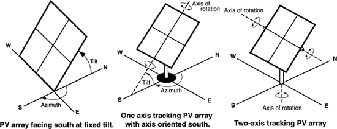

PVWatts
=======

**Noel Merket, NREL**

 - Original Date: 2017-12-12
 - Revision Date

## Justification for New Feature ##

The PVWatts calculator is a web application and API developed by NREL to estimate the electricity production of a grid-connected photovoltaic system based on a few simple inputs.[1](#pvwattsmanual) The tool is the de-facto standard for estimating PV output for rooftop solar systems, especially in residential applications, and is used extensively in the industry.

Including it in EnergyPlus will provide simple, yet complete model that will allow modeling of rooftop solar with input complexity somewhere in between the currently available `PhotovoltaicPerformance:Simple` and `PhotovoltaicPerformance:Sandia` efficiency models.

## E-mail and  Conference Call Conclusions ##

None yet.

## Overview ##

PVWatts is a simple yet complete solar photovoltaic model extensively used in industry. This new feature will include that model in EnergyPlus so those calculations can be performed as part of a whole building energy simulation. Currently, to use PVWatts with EnergyPlus results it has to be modeled separately in NREL's System Advisor Model (SAM) or through the web API and combined with EnergyPlus results in a post processing step. This will include it as a new `Generator` type to be used in a `ElectricLoadCenter:Distribution`.

## Approach ##

As mentioned above this will be developed as a new `Generator` type with AC output to attach to an `ElectricLoadCenter:Distribution`. While initially it would appear that it would fit better as a new `PhotovoltaicPerformance:*` object, the model has a larger scope which includes system losses and the inverter (hence the AC output). Additionally, the details of inputs in the `Generator:Photovoltaic` model are more complex than what PVWatts uses. Creating a new Generator type will allow the inputs between the SAM version of PVWatts, the web API, and the EnergyPlus implementation to be aligned and easy to understand and transfer between.

The [calculation methodology](#pvwattsmanual) will strive to match the version of PVWatts developed for SAM and may reuse some of the source code as is reasonable. (They recently released their source as open source. NREL authored the license which should ease the process if a unique licensing arrangement is required.)

## Testing/Validation/Data Sources ##

The EnergyPlus implementation of PVWatts will be validated against the [PVWatts API](https://developer.nrel.gov/docs/solar/pvwatts-v5/), which was validated against measured PV performance data (see section 15 in the [PVWatts Manual](#pvwattsmanual)).

## Input Output Reference Documentation ##

The model object will be called `Generator:Photovoltaic:PVWatts5`. (I am ambivalent about the naming of it. If someone has a better name or one more consistent with EnergyPlus idioms, speak up.)

The `Generator:Photovoltaic:PVWatts5` model acts as an AC generator (the inverter is included in the model) which can be connected to an electric load center by listing it in a `ElectricLoadCenter:Generator` object.

## Input Description ##

### Field: Name

This field is a unique name for the PV array.

### Field: System Capacity

DC nameplace capacity of the system in kW.

### Field: Module Type

One of:

 - `Standard` - typical poly- or mono-crystalline silicon modules with efficiencies in the range of 14-17%
 - `Premium` - high efficiency (18-20%) monocrystalline silicon modules that have anti-reflective coatings and lower temperature coefficients
 - `ThinFilm` - low efficiency (11%) and a significantly lower temperature coefficient which is representative of most installed thin film modules

### Field: Array Type

One of:

 - `FixedOpenRack` - use for ground mounted arrays, assumes air flows freely around the array.
 - `FixedRoofMounted` - use for typical residential arrays mounted on the roof, assumes limited airflow around the modules
 - `OneAxis` - tilt and azimuth are fixed, the panels can rotate as shown below
 - `OneAxisBacktracking` - Backtracking is a tracking algorithm that rotates the array toward the horizontal during early morning and late evening hours to reduce the effect of self shading. The one-axis tracking algorithm assumes a rotation limit of ±45 degrees from the horizontal.
 - `TwoAxis` - tilt and azimuth track the sun

### Field: System Losses

Fraction of the system output lost due to losses in a real system that are not explicitly calculated by the PVWatts model equations.

Default: 0.14.

### Field: Tilt

The tilt angle is the angle from horizontal of the photovoltaic modules in the array. For a fixed array, the tilt angle is the angle from horizontal of the array where 0° = horizontal, and 90° = vertical. For arrays with one-axis tracking, the tilt angle is the angle from horizontal of the tracking axis. The tilt angle does not apply to arrays with two-axis tracking.

Default: 20°

### Field: Azimuth

For a fixed array, the azimuth angle is the angle clockwise from true north describing the direction that the array faces. An azimuth angle of 180° is for a south-facing array, and an azimuth angle of zero degrees is for a north-facing array.

For an array with one-axis tracking, the azimuth angle is the angle clockwise from true north of the axis of rotation. The azimuth angle does not apply to arrays with two-axis tracking.

Default: 180°

### Field: DC to AC Size ratio

The DC to AC size ratio is the ratio of the inverter's AC rated size to the array's DC rated size. Increasing the ratio increases the system's output over the year, but also increases the array's cost. The default value is 1.10, which means that a 4 kW system size would be for an array with a 4 DC kW nameplate size at standard test conditions (STC) and an inverter with a 3.63 AC kW nameplate size.

For a system with a high DC to AC size ratio, during times when the array's DC power output exceeds the inverter's rated DC input size, the inverter limits the array's power output by increasing the DC operating voltage, which moves the array's operating point down its current-voltage (I-V) curve. PVWatts models this effect by limiting the inverter's power output to its rated AC size.

The default value of 1.10 is reasonable for most systems. A typical range is 1.10 to 1.25, although some large-scale systems have ratios of as high as 1.50. The optimal value depends on the system's location, array orientation, and module cost.

Default: 1.10

### Field: Inverter Efficiency

The inverter's nominal rated DC-to-AC conversion efficiency, defined as the inverter's rated AC power output divided by its rated DC power output.

Default: 0.96

### Field: Ground Coverage Ratio

The ground coverage ratio (GCR) applies only to arrays with one-axis tracking, and is the ratio of module surface area to the area of the ground or roof occupied by the array. A GCR of 0.5 means that when the modules are horizontal, half of the surface below the array is occupied by the array. An array with wider spacing between rows of modules has a lower GCR than one with narrower spacing. A GCR of 1 would be for an array with no space between modules, and a GCR of 0 for infinite spacing between rows. Typical values range from 0.3 to 0.6.

Default: 0.4

## Outputs Description ##

 - HVAC,Average,Generator Produced DC Electric Power [W]
 - HVAC,Average,Generator Produced DC Electric Energy [J]
 - HVAC,Average,Generator Produced AC Electric Power [W]
 - HVAC,Average,Generator Produced AC Electric Energy [J]
 - HVAC,Average,Plane of Array Irradiance [W/m^2]
 - HVAC,Average,Beam Normal Irradiance [W/m^2]
 - HVAC,Average,Diffuse Irradiance [W/m^2]
 - HVAC,Average,Module Temperature [C]

**Why HVAC?**

## Engineering Reference ##

A short paragraph that will refer them to the [PVWatts Technical Manual](#pvwattsmanual) for more details.

## Example File and Transition Changes ##

An example file will be created. No others will be modified No transition changes will be needed.

## References ##

 - <a name="pvwattsmanual" href="https://www.nrel.gov/docs/fy14osti/62641.pdf">PVWatts Version 5 Manual</a>
 - <a name="ssc" href="https://github.com/NREL/ssc">SAM Simulation Core GitHub repository</a>
