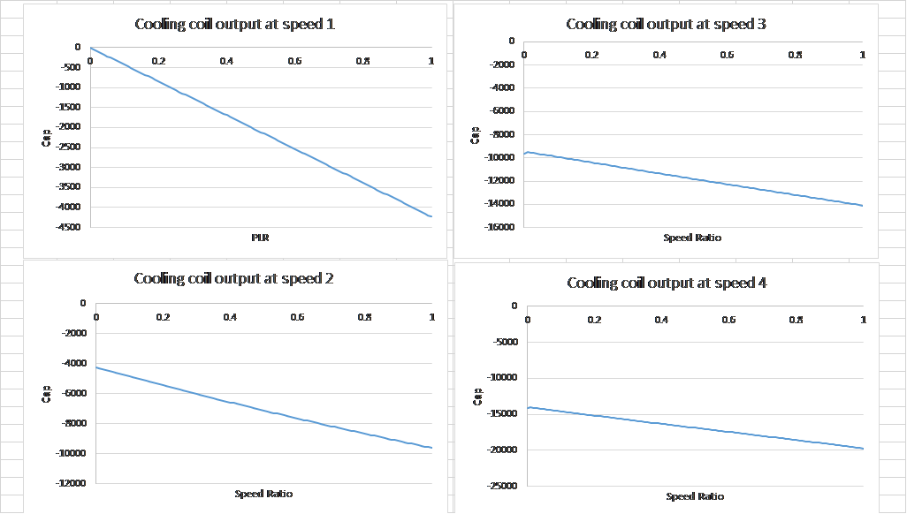

Improve/simplify coupling/iteration between HVAC systems and zones
================

**Lixing**

**Florida Solar Energy Center**

 - Original date: 2/12/2019
 - Revision Date: None
 

## Justification for New Feature ##

The significant consuming section in EnergyPlus is HVAC system simulation. In order to calculate part load ratios (PLR) for single speed coils and speed ratios (SR) for multispeed coils, the Regula Falsi method is used to get a solution via iterations. In general, it takes three to five iterations to reach a solution for each system call. We propose to apply for a direct solution, so that iteration approach using Regula Falsi can be eliminated to speed up HVAC system simulations. 

## E-mail and  Conference Call Conclusions ##

None

## Overview ##

I used an example file of MultispeedHeatPump.idf to test cooling and heating coil performance. By varying part load ratio at speed 1 and speed ratio at speed > 1 with 0.01 increment, the relationship between cooling coil sensible capacity or heating coil capacity and part load ratio or speed ratio was obtained at given inlet conditions.   

**Figure 1. Sensible cooling capacity vs cycle or speed ratio at 4 different speeds with fan operation mode of constant volume fan and cycling coil**

Figure 1 shows sensible cooling capacity vs. cycle or speed ratio at 4 different speeds using constant volume fan operation mode and latent degradation. It is clear that the linear relationships are shown with speed > 1. When speed = 1, two connected piecewise straight lines with different slopes are shown. This is caused by latent degradation. When small part load ratios are applied, the SHR is equal to 1.0, corresponding to the first straight line, while when part load ratio increases, the SHR becomes less than 1.0 and varies with part load ratio. This forms the second line with different slope from the first line due to SHR variation.  

The following table lists linear regression results at 4 different speeds. It contains values of slope, intercept, and r2. The values of r2 at speeds 2 - 4 are 1, while the value is slightly less than 1 at Speed 1, due to two piecewise straight lines with different slopes.

|           | Speed 1  | Speed 2  | Speed 3  | Speed 4  |
|-----------|----------|----------|----------|----------|
| Slope     | -3402.01 | -5195.27 | -4330.42 | -5412.3  |
| Intercept | -748.988 | -4079.57 | -9275.09 | -13605.5 |
| r2        | 0.984689 | 1        | 1        | 1        |

**Figure 2. Sensible cooling capacity vs cycle or speed ratio at 4 different speeds with fan operation mode of cycling fan and cycling coil**

Figure 2 shows sensible cooling capacity vs. cycle or speed ratio at 4 different speeds using cycling fan and cycling coil. It is clear that the linear relationships are shown with all speeds.   

The following table lists linear regression results at 4 different speeds. It contains values of slope, intercept and r2. The values of r2 at all speeds are 1 or very close to 1.

|           | Speed 1  | Speed 2  | Speed 3  | Speed 4  |
|-----------|----------|----------|----------|----------|
| Slope     | -4232.2  | -5383.44 | -4641.11 | -5684.35 |
| Intercept | 1.86961  | -4362.73 | -9475.19 | -14034.5 |
| r2        | 1        | 0.99853  | 0.999817 | 0.999939 |

**Figure 3. Sensible cooling capacity vs cycle or speed ratio at 4 different speeds with fan operation mode of constant volume fan and cycling coil by removing latent degradation**

Figure 3 shows sensible cooling capacity vs. cycle or speed ratio at 4 different speeds using constant volume fan operation mode and cycling coil, and without latent degradation. It is clear that the linear relationships are shown with all speeds.   

The following table lists linear regression results at 4 different speeds. It contains values of slope, intercept and r2. The values of r2 at all speeds are 1 or very close to 1.

|           | Speed 1  | Speed 2  | Speed 3  | Speed 4  |
|-----------|----------|----------|----------|----------|
| Slope     | -3864.8  | -5195.27 | -4330.42 | -5412.3  |
| Intercept | -208.799 | -4079.57 | -9275.09 | -13605.5 |
| r2        | 0.999994 | 1        | 1        | 1        |

Based on above observation, the cooling coil performs linear relationship between cycle or speed ratio and sensible capacity with no latent degradation. Therefore, the approach is valid in cooling operation with multiple speeds and two set fan operation modes (constant volume and cycling).

The next two figures show heating coil performance with two different fan operation modes.

**Figure 4. Sensible heating capacity vs cycle or speed ratio at 4 different speeds with fan operation mode of constant volume fan and cycling coil**

Figure 4 shows sensible heating capacity vs. cycle or speed ratio at 4 different speeds using constant volume fan and cycling coil. It is clear that the linear relationships are shown with all speeds.   

The following table lists linear regression results at 4 different speeds. It contains values of slope, intercept and r2. The values of r2 at all speeds are 1.

|           | Speed 1  | Speed 2  | Speed 3  | Speed 4  |
|-----------|----------|----------|----------|----------|
| Slope     | 2909.972 | 3027.975 | 1874.699 | 2342.797 |
| Intercept | -1408.76 | 1501.222 | 4529.198 | 6403.896 |
| r2        | 1        | 1        | 1        | 1        |
    

**Figure 5. Sensible heating capacity vs cycle or speed ratio at 4 different speeds with fan operation mode of cycling fan and cycling coil**

Figure 5 shows sensible heating capacity vs. cycle or speed ratio at 4 different speeds using cycling fan and cycling coil. It is clear that the linear relationships are shown with all speeds.   

The following table lists linear regression results at 4 different speeds. It contains values of slope, intercept and r2. The values of r2 at all speeds are 1 or very close to 1.
|           | Speed 1  | Speed 2  | Speed 3  | Speed 4  |
|-----------|----------|----------|----------|----------|
| Slope     | 1349.446 | 2876.506 | 1723.328 | 2153.583 |
| Intercept | 4.812044 | 1349.883 | 4226.387 | 5949.715 |
| r2        | 0.999971 | 1        | 1        | 1        |

The multispeed heat pump has a supplemental heater. Since the heater does not require iteration, the existing code can be kept.

**Theoretically, the proposed approach provides more accurate or exact solution. The iteration approach provides approximated solution within convergence limit. In addition, the proposed approach will not have any divergence issues with very small load, while the iteration approach may get divergence.** 

**Furthermore, the proposed approach will eliminate a section of code to handle iteration about 10 - 20%.**

## Approach ##

We propose that the iterations may be eliminated by calculating part load ratios and speed ratios directly. Specifically, for a single speed coil, the system load has to be met by a coil:

Load = PLR * ( SysCap at full load – SysCap at PLR=0 )

The same calculation procedure is used at the lowest speed for a multiple speed. For a multispeed coil, the system load has to be met by a coil:

Load = SysCap1 at full load * SR + SysCap2 at full load * (1 – SR)

The above two equations show a linear relationship between SysCap and PLR or SR. Therefore, PLR and SR can be calculated directly as long as system full capacities are given. If a proposed solution strategy is applied, it should speed up EnergyPlus calculations dramatically.

The above section shows the approach is workable, because the relationship between coil capacity and cycle or speed ratio is approved to be linear.

The HAVCMultiSpeedHeatPump module will be used to test the proposed approach. The code modification occurs in the ControlMSHPOutput function of the HVACMultiSpeedHeatPump module.

The Pseudocode is shown below:

1. Get SysCap at PLR = 0 at Speed 1 (SysCap0)
2. Get SysCap at PLR = 1 at Speed 1 (SysCap1)
3. If (SysCap0 < QZnReq < SysCap1), then PLR = Load / (SysCap1 - SysCap0), and return
4. Get SysCap at SpeedRatio(SR) = 1 at Speed2
5. If (SysCap1 < QZnReq < SysCap2), then SR = Load / (SysCap2 - SysCap1), and return
6. Get SysCap at SpeedRatio(SR) = 1 at Speed3
7. If (SysCap2 < QZnReq < SysCap3), then SR = Load / (SysCap3 - SysCap2), and return
8. Get SysCap at SpeedRatio(SR) = 1 at Speed4
9. If (SysCap3 < QZnReq < SysCap4), then SR = Load / (SysCap4 - SysCap3), and return
10. If (QZnReq > SysCap4), then SR=1, and return

It should be pointed out that when coil inlet conditions are changed, the values of slope and intercept are also changed accordingly. That is why we need to recalculate values at each time step (or each HVAC global iteration).

A new field of DirectSolution will be added in the AirLoopHVAC:UnitaryHeatPump:AirToAir:MultiSpeed object as a last field. Therefore, no transition is needed.
  
## Testing/Validation/Data Sources ##

Simulation results with simplified approach will be compared to the results with iteration approach.

## Input Output Reference Documentation ##

The new field and associated description are highlighted in red.

\subsection{AirLoopHVAC:UnitaryHeatPump:AirToAir:MultiSpeed}\label{airloophvacunitaryheatpumpairtoairmultispeed}

The multispeed air-to-air heat pump is a ``virtual'' component that consists of a fan component (On/Off or ConstVolume), a DX multispeed cooling coil component, a DX multispeed heating coil component, and a Gas or Electric supplemental heating coil component. This system also includes the option to use available waste energy to heat water. A schematic diagram of the air-to-air multispeed heat pump is shown below. The component connection sequence for the blow through option (shown below) from inlet to outlet is fan, cooling coil, heating coil, and supplemental heater. The connection sequence for the draw through option is cooling coil, heating coil, fan, and supplemental heater.

The main difference between this heat pump object and other EnergyPlus heat pump objects is that this object allows from two to four discrete compressor speeds for heating and cooling operation (instead of a single speed for each mode). The lowest speed is called Speed 1, and the highest speed is called Speed n (2, 3 or 4 as specified in the input syntax). This object allows a different number of speeds for cooling and heating, and each speed has an associated airflow rate. The airflow rates for the various heating speeds can be different from the airflow rates for the cooling speeds. In addition, the airflow rate when no cooling or heating is needed can also be defined. The number of cooling and heating speeds defined by the user in this heat pump object must equal the number of speeds defined in the associated coils (child objects). For example, the number of speeds for cooling defined in this heat pump object must be equal to the number of speeds defined in the associated cooling coil object.

Links to the fan, DX multispeed cooling coil, DX multispeed heating coil, and supplementary heating coil specifications are provided in the heat pump's input data syntax. In addition, the control zone name and airflow rates at the corresponding compressor speeds are specified by the heat pump syntax.

If the ZoneControl:Thermostat:StagedDualSetpoint object and other zone control thermostat and humidistat are assigned to the same controlled zone in the Controlling Zone or Thermostat Location field, the ZoneControl:Thermostat:StagedDualSetpoint object takes precedence and the stage number provided by the the ZoneControl:Thermostat:StagedDualSetpoint object is used to set the speed number.

\begin{figure}[hbtp] % fig 119
\centering
\includegraphics[width=0.9\textwidth, height=0.9\textheight, keepaspectratio=true]{media/image301.png}
\caption{Schematic of EnergyPlus Unitary Air-to-Air Multi Speed Heat Pump \protect \label{fig:schematic-of-energyplus-unitary-air-to-air}}
\end{figure}

\subsubsection{Inputs}\label{inputs-4-036}

\paragraph{Field: Name}\label{field-name-5-027}

This alpha field contains the identifying name for the multispeed heat pump.

\paragraph{Field: Availability Schedule Name}\label{field-availability-schedule-name-4-006}

This alpha field contains the schedule name (ref. Schedule objects) that contains information on the availability of the heat pump to operate. A schedule value greater than 0 (usually 1 is used) indicates that the unit can be on during the time period. A value less than or equal to 0 (usually 0 is used) denotes that the unit must be off for the time period. If this field is left blank, the schedule has a value of 1 for all time periods.

\paragraph{Field: Air Inlet Node Name}\label{field-air-inlet-node-name-1-005}

This alpha field contains the name of the HVAC system node from which the heat pump draws its inlet air.

\paragraph{Field: Air Outlet Node Name}\label{field-air-outlet-node-name-1-004}

This alpha field contains the name of the HVAC system node to which the heat pump sends its outlet air.

\paragraph{Field: Controlling Zone or Thermostat Location}\label{field-controlling-zone-or-thermostat-location-4}

This alpha field contains the identifying zone name where the thermostat controlling the multispeed heat pump is located.

\paragraph{Field: Supply Air Fan Object Type}\label{field-supply-air-fan-object-type-1}

This alpha field contains the identifying type of supply air fan specified for the heat pump. Fan type must be Fan:OnOff or Fan:ConstantVolume. Fan:ConstantVolume can only be used when the supply air fan operating mode is continuous (see field `Supply air fan operating mode schedule name).

\paragraph{Field: Supply Air Fan Name}\label{field-supply-air-fan-name-1}

This alpha field contains the identifying name given to the heat pump supply air fan, and should match the name specified in the corresponding fan object.

\paragraph{Field: Supply Air Fan Placement}\label{field-supply-air-fan-placement}

This alpha field has two choices: \textbf{BlowThrough} or \textbf{DrawThrough}. The first choice stands for ``blow through fan''. This means that the unit consists of a fan followed by a DX multispeed cooling coil, DX multispeed heating coil, and a supplemental heating coil. The fan ``blows through'' the cooling and heating coils. The second choice stands for ``draw through fan''. This means that the unit consists of the DX cooling and heating coils followed by a fan, with the supplemental heater located at the outlet of the fan.~ The fan ``draws'' air through the DX coils.

\textbf{Note}: the multispeed heat pump's supply air fan, cooling coil, heating coil and supplemental heating coil must be connected according to the configuration shown above (Figure~\ref{fig:schematic-of-energyplus-unitary-air-to-air}) for the `blow through' fan configuration. For the `draw through' fan configuration the fan must be located between the DX heating coil and the supplemental heater, whose outlet node is the system outlet node. In addition, the DX cooling coil and DX heating coil operation mode must be specified consistently with the heat pump's supply air fan operating mode (e.g., with the heat pump's supply air fan set to cycle on and off with the cooling/heating load, the DX cooling and heating coil operation mode must be CyclingFanAndCompressor). If the operation modes in the parent (heat pump) and child (coil) objects are specified differently, the operation mode in the parent object prevails.

\paragraph{Field: Supply Air Fan Operating Mode Schedule Name}\label{field-supply-air-fan-operating-mode-schedule-name-1}

This alpha field contains the schedule name (ref. Schedule objects) that contains information to control the supply air fan. Schedule values of zero mean that the supply air fan will cycle off if there is no cooling or heating load in the control zone. Non-zero schedule values mean that the supply air fan will operate continuously even if there is no cooling or heating load in the control zone. If this field is left blank, the supply air fan will operate continuously for the entire simulation period.

\paragraph{Field: Heating Coil Object Type}\label{field-heating-coil-object-type-4}

This alpha field contains the identifying type of heating coil specified in the heat pump.~ Allowable choices for Heating coil type~ are \textbf{Coil:Heating:DX:MultiSpeed}, \textbf{Coil:Heating:Electric:MultiStage}, \textbf{Coil:Heating:Gas:MultiStage}, \textbf{Coil:Heating:Water}, and~ \textbf{Coil:Heating:Steam}.

\paragraph{Field: Heating Coil Name}\label{field-heating-coil-name-4}

This alpha field contains the identifying name given to the DX heating coil, and should match the name specified in the corresponding DX heating coil object.

\paragraph{Field: Minimum Outdoor Dry-Bulb Temperature for Compressor Operation}\label{field-minimum-outdoor-dry-bulb-temperature-for-compressor-operation-000}

This numeric field defines the outdoor air dry-bulb temperature below which the DX heating coil turns off.~ If this input field is left blank, the default value is -8 C. This temperature should match the minimum compressor operating temperature specified for the multispeed heat pump's DX heating coil. This field is only needed when Heating Coil Object Type above is \textbf{Coil:Heating:DX:MultiSpeed}.

\paragraph{Field: Cooling Coil Object Type}\label{field-cooling-coil-object-type-4}

This alpha field contains the identifying type of cooling coil specified in the heat pump.~ Cooling coil type must be Coil:Cooling:DX:MultiSpeed.

\paragraph{Field: Cooling Coil Name}\label{field-cooling-coil-name-4}

This alpha field contains the identifying name given to the heat pump cooling coil, and should match the name specified in the corresponding DX cooling coil object.

\paragraph{Field: Supplemental Heating Coil Object Type}\label{field-supplemental-heating-coil-object-type-2}

This alpha field contains the identifying type of supplemental heating coil specified in the heat pump. The hot water and steam heating coils require specifying plant loop, branches, and connectors objects to support the heating coils, and are placed on the demand side of the plantloop. The hot water flow modulation through the supplemental heating coil does not require additional controller or Controller:WaterCoil object. The parent object (Unitary MultiSpeed Air to Air Heat Pump) itself provides the ``controller'' function of modulating water flow. Heating coil type must be:

\begin{itemize}
\item
  Coil:Heating:Electric
\item
  Coil:Heating:Fuel
\item
  Coil:Heating:Water
\item
  Coil:Heating:Steam
\end{itemize}

\paragraph{Field: Supplemental Heating Coil Name}\label{field-supplemental-heating-coil-name-2}

This alpha field contains the identifying name given to the heat pump supplemental heating coil, and should match the name specified in the corresponding heating coil object.

\paragraph{Field: Maximum Supply Air Temperature from Supplemental Heater}\label{field-maximum-supply-air-temperature-from-supplemental-heater-1}

This numeric field defines the maximum allowed supply air temperature (in degrees C) exiting the heat pump supplemental heating coil. If the calculated supply air temperature exiting the supplemental heater exceeds this value, then it is reset to this maximum temperature. This field is autosizable.

\paragraph{Field: Maximum Outdoor Dry-Bulb Temperature for Supplemental Heater Operation}\label{field-maximum-outdoor-dry-bulb-temperature-for-supplemental-heater-operation-2}

This numeric field defines the outdoor air dry-bulb temperature above which the heat pump supplemental heating coil is disabled.~ The temperature for this input field must be less than or equal to 21 C. If this input field is left blank, the default value is 21 C.

\paragraph{Field: Auxiliary On-Cycle Electric Power}\label{field-auxiliary-on-cycle-electric-power}

This field defines auxiliary electrical power (W) consumed during the on-cycle period (i.e., when the cooling or heating coil is operating). The model assumes that this auxiliary power does not contribute to heating the supply air. The minimum value for this field is 0.0, and the default value is also 0.0 if the field is left blank.

\paragraph{Field: Auxiliary Off-Cycle Electric Power}\label{field-auxiliary-off-cycle-electric-power}

This field defines auxiliary electrical power (W) consumed during the off-cycle period (i.e., when the cooling and heating coil are not operating). The model assumes that this auxiliary power does not contribute to heating the supply air. The minimum value for this field is 0.0, and the default value is also 0.0 if the field is left blank.

\paragraph{Field: Design Heat Recovery Water Flow Rate}\label{field-design-heat-recovery-water-flow-rate-1-001}

This optional input field defines the design water flow rate used if the heat recovery option is being simulated. If this value is greater than 0.0 then a heat recovery loop must be specified and attached to the multispeed heat pump using the next 2 node fields. To determine how the heat recovery algorithm works, refer to the EnergyPlus Engineering Reference in the AirLoopHVAC:UnitaryHeatPump:AirToAir:MultiSpeed with Heat Recovery section. The units for this input value are cubic meters per second.

\paragraph{Field: Maximum Temperature for Heat Recovery}\label{field-maximum-temperature-for-heat-recovery-1}

This field sets the maximum temperature (in degrees C) that this heat pump can produce for heat recovery. The idea behind this field is that the current models do not take temperatures into account for availability and they just pass Q's around the loop without a temperature limit. This temperature limit puts an upper bound on the recovered heat and limits the max temperature leaving the component.

As temperatures in the loop approach the maximum temperature, the temperature difference between the entering water and the surfaces in the piece of equipment becomes smaller. For the given heat recovery flow rate and that temperature difference the amount of heat recovered will be reduced, and eventually there will be no heat recovered when the entering water temperature is equal to the maximum temperature specified by the user in this field. The reduced amount of heat recovered will diminish if the temperature of the loop approach is the maximum temperature, and this will show up in the reporting. This allows the user to set the availability or the quality of the heat recovered for usage in other parts of the system or to heat domestic hot water supply.

\paragraph{Field: Heat Recovery Water Inlet Node Name}\label{field-heat-recovery-water-inlet-node-name-1-000}

This alpha field contains the identifying name for the heat recovery side inlet node.

\paragraph{Field: Heat Recovery Water Outlet Node Name}\label{field-heat-recovery-water-outlet-node-name-1-000}

This alpha field contains the identifying name for the heat recovery side outlet node.

\paragraph{Field: No Load Supply Air Flow Rate}\label{field-no-load-supply-air-flow-rate-4-000}

This numeric field defines the supply air flow rate leaving the heat pump in cubic meters per second when neither cooling nor heating is required (i.e., DX coils and supplemental heater are off but the supply air fan operates). This field is only used when the heat pump supply air fan is scheduled to operate continuously regardless of DX coil operation (ref. field ``Supply Air Fan Operating Mode Schedule). Values must be greater than or equal to zero, or this field is autosizable. If the heat pump supply air fan is scheduled to operate continuously and the input value for this field is set to zero or this field is left blank, then the model assumes that the supply air flow rate when no cooling/heating is needed is equal to the supply air flow rate when the compressor was last operating (for cooling operation or heating operation).

\paragraph{Field: Number of Speeds for Heating}\label{field-number-of-speeds-for-heating-1}

This field defines the number of heating speeds for the heat pump, and must match the number of heating speeds defined in the associated heating coil. The value for this input field defines the number of airflow rates that must be defined for heating in the field below. The minimum value for this field is one and the maximum value is four. If the Heating Coil Object Type above are \textbf{Coil:Heating:Water} or \textbf{Coil:Heating:Steam}, then this field should be 1.

\paragraph{Field: Number of Speeds for Cooling}\label{field-number-of-speeds-for-cooling-1}

This field defines the number of cooling speeds for the heat pump, and must match the number of cooling speeds defined in the associated DX cooling coil. The value for this input field defines the number of airflow rates that must be defined for cooling in the field below. The minimum value for this field is two and the maximum value is four.

\paragraph{Field: Heating Speed 1 Supply Air Flow Rate}\label{field-heating-speed-1-supply-air-flow-rate}

This required numeric field defines the supply air flow rate leaving the heat pump in cubic meters per second when the DX heating coil and/or supplemental heater are operating at Speed 1 (lowest speed). Values must be greater than 0 or this field is autosizable.

\paragraph{Field: Heating Speed 2 Supply Air Flow Rate}\label{field-heating-speed-2-supply-air-flow-rate}

This required numeric field defines the supply air flow rate leaving the heat pump in cubic meters per second when the DX heating coil and/or supplemental heater are operating at Speed 2. Values must be greater than 0 or this field is autosizable. If not autosized, the entered value must be greater or equal to the flow rate specified for heating Speed 1.

\paragraph{Field: Heating Speed 3 Supply Air Flow Rate}\label{field-heating-speed-3-supply-air-flow-rate}

This numeric field defines the supply air flow rate leaving the heat pump in cubic meters per second when the DX heating coil and/or supplemental heater are operating at Speed 3. Values must be greater than 0 or this field is autosizable. If not autosized, the entered value must be greater or equal to the flow rate specified for heating Speed 2. If the `Number of Speeds for Heating' is less than 3, then this field can be left blank.

\paragraph{Field: Heating Speed 4 Supply Air Flow Rate}\label{field-heating-speed-4-supply-air-flow-rate}

This numeric field defines the supply air flow rate leaving the heat pump in cubic meters per second when the DX heating coil and/or supplemental heater are operating at Speed 4 (high speed). Values must be greater than 0 or this field is autosizable. If not autosized, the entered value must be greater or equal to the flow rate specified for heating Speed 3. If the `Number of Speeds for Heating' is less than 4, then this field can be left blank.

\textbf{Note}: When autosizable is selected for any of the supply air volumetric flow rate fields, all supply air flow fields at the different speeds must be specified as autosizable. Otherwise, a fatal error will be issued and the simulation will terminate.

\paragraph{Field: Cooling Speed 1 Supply Air Flow Rate}\label{field-cooling-speed-1-supply-air-flow-rate}

This required numeric field defines the supply air flow rate leaving the heat pump in cubic meters per second when the DX cooling coil is operating at Speed 1 (lowest speed). Values must be greater than 0 or this field is autosizable.

\paragraph{Field: Cooling Speed 2 Supply Air Flow Rate}\label{field-cooling-speed-2-supply-air-flow-rate}

This required numeric field defines the supply air flow rate leaving the heat pump in cubic meters per second when the DX cooling coil is operating at Speed 2. Values must be greater than 0 or this field is autosizable. If not autosized, the entered value must be greater or equal to the flow rate specified for cooling Speed 1.

\paragraph{Field: Cooling Speed 3 Supply Air Flow Rate}\label{field-cooling-speed-3-supply-air-flow-rate}

This numeric field defines the supply air flow rate leaving the heat pump in cubic meters per second when the DX cooling coil is operating at Speed 3. Values must be greater than 0 or this field is autosizable. If not autosized, the entered value must be greater or equal to the flow rate specified for cooling Speed 2. If the `Number of Speeds for Cooling' is less than 3, then this field can be left blank.

\paragraph{Field: Cooling Speed 4 Supply Air Flow Rate}\label{field-cooling-speed-4-supply-air-flow-rate}

This numeric field defines the supply air flow rate leaving the heat pump in cubic meters per second when the DX cooling coil is operating at Speed 4 (highest speed). Values must be greater than 0 or this field is autosizable. If not autosized, the entered value must be greater or equal to the flow rate specified for cooling Speed 3. If the `Number of Speeds for Cooling' is less than 4, then this field can be left blank.

**\paragraph{Field: Direct Solution}\label{field-DirectSolution}**

We may have two choices for this new field.

##### either Yes or No choices

Input is Yes or No. The default is No. If Yes, the part load ratio or speed ratio will be calculated directly based on a linear relationship between ratio and sensible capacity. If No, the part load ratio or speed ratio will be calculated via existing iteration.

##### Or 3 choices

This alpha field has three choices: \textbf{DirectSolution}, \textbf{NarrowInterval}, or \textbf{Iteration}. The first choice calculates part load ratios or speed ratios directly based on a linear relationship between ratio and sensible capacity. The second choice calculates part load or speed ratio first, similar to the first choice. Then set the interval range for iteration between Ratio - 0.01 and Ratio + 0.01. Therefore, due to the narrow internal range, the number of iteration is much less than existing approach using Regular Falsi. The third choice uses exiting approach by setting interval range between 0.0 and 1.0 as default.

Following is an example input for the object and its associated components.

\begin{lstlisting}

	AirLoopHVAC:UnitaryHeatPump:AirToAir:MultiSpeed,
	  DXAC Heat Pump 1,        !- Name of multispeed heat pump
	  FanAndCoilAvailSched,    !- Availability schedule
	  Mixed Air Node,          !- Heat pump air inlet node name
	  Air Loop Outlet Node,    !- Heat pump air outlet node name
	  East Zone,               !- Controlling zone or thermostat location
	  Fan:OnOff,               !- Supply air fan type
	  Supply Fan 1,            !- Supply air fan name
	  BlowThrough,             !- Supply air fan placement
	  FanModeSchedule,         !- Supply air fan operating mode schedule name
	  Coil:Heating:DX:MultiSpeed, Heat Pump DX Heating Coil 1,  !- Heating coil type & name
	  -8.0,                    !- Minimum outdoor dry-bulb temperature for compressor operation
	  Coil:Cooling:DX:MultiSpeed, Heat Pump ACDXCoil 1,    !- Cooling coil type & name
	  Coil:Heating:Fuel,        !- Supplemental heating coil type
	  Supp Gas Heating Coil 1, !- Supplemental heating coil name
	  50.0,                    !- Maximum supply air temperature from supplemental heater
	  21,                      !- Maximum outdoor dry-bulb temperature for supplemental heater operation
	  0,                       !- Auxiliary On-Cycle Electric Power {W}
	  0,                       !- Auxiliary Off-Cycle Electric Power {W}
	  0.00,                    !- Design Heat Recovery Water Flow Rate {m3/s}
	  80.0,,,                    !- Maximum Temp for Heat Recovery {C} & Node names (none)
	  0.2,                     !- Supply air volumetric flow rate when no cooling or heating is needed
	  4,                       !- Number of speeds for heating
	  4,                       !- Number of speeds for cooling
	  0.4,                     !- Heating Speed 1 Supply Air Flow Rate
	  0.8,                     !- Heating Speed 2 Supply Air Flow Rate
	  1.2,                     !- Heating Speed 3 Supply Air Flow Rate
	  1.7,                     !- Heating Speed 4 Supply Air Flow Rate
	  0.4,                     !- Cooling Speed 1 Supply Air Flow Rate
	  0.8,                     !- Cooling Speed 2 Supply Air Flow Rate
	  1.2,                     !- Cooling Speed 3 Supply Air Flow Rate
	  1.7;                     !- Cooling Speed 4 Supply Air Flow Rate

  	Coil:Heating:DX:MultiSpeed,
      Heat Pump DX Heating Coil 1,  !- Name of heat pump heating coil
      FanAndCoilAvailSched,    !- Availability Schedule
      Heating Coil Air Inlet Node,  !- Coil Air Inlet Node
      SuppHeating Coil Air Inlet Node,  !- Coil Air Outlet Node
      CyclingFanAndCompressor,           !- Supply Air Fan Operation Mode
      -8.0,                    !- Minimum Outdoor Dry-bulb Temperature for Compressor Operation {C}
      200.0,                   !- Crankcase Heater Capacity {W}
      10.0,                    !- Maximum Outdoor Dry-bulb Temperature for Crankcase Heater
                           !- Operation {C}
      HPACDefrostCAPFT,        !- Defrost energy input ratio modifier curve (temperature)
      7.22,                    !- Maximum Outdoor Dry-bulb Temperature for Defrost Operation
      reverse-cycle,           !- Defrost Strategy
      timed,                   !- Defrost Control
      0.058333,                !- Defrost Time Period Fraction
      2000.0,                  !- Resistive Defrost Heater Capacity {W}
      No,                      !- Apply Part Load Fraction to Speeds greater than 1
      NaturalGas,              !- Fuel type
      4,                       !- Number of speeds
      7500,                    !- Rated Total Heating Capacity, Speed 1 {W}
      2.75,                    !- Rated COP, Speed 1
      0.45,                    !- Rated Air Volume Flow Rate, Speed 1 {m3/s}
      HPACHeatCapFT Speed 1,   !- Total Heating Capacity Modifier Curve, Speed 1 (temperature)
      HPACHeatCapFF Speed 1,   !- Total Heating capacity modifier curve, Speed 1 (flow fraction)
      HPACHeatEIRFT Speed 1,   !- Energy input ratio modifier curve, Speed 1 (temperature)
      HPACHeatEIRFF Speed 1,   !- Energy input ratio modifier curve, Speed 1 (flow fraction)
      HPACHeatPLFFPLR Speed 1, !- Part load fraction correlation, Speed 1 (part load ratio)
      0.2,                     !- Rated waste heat fraction of power input, Speed 1
      HAPCHeatWHFT Speed 1,    !- Waste heat modifier curve, Speed 1 (temperature)
      17500,                   !- Rated Total Heating Capacity, Speed 2 {W}
      2.75,                    !- Rated COP, Speed 2
      0.85,                    !- Rated Air Volume Flow Rate, Speed 2 {m3/s}
      HPACHeatCapFT Speed 2,   !- Total Heating Capacity Modifier Curve, Speed 2 (temperature)
      HPACHeatCapFF Speed 2,   !- Total Heating capacity modifier curve, Speed 2 (flow fraction)
      HPACHeatEIRFT Speed 2,   !- Energy input ratio modifier curve, Speed 2 (temperature)
      HPACHeatEIRFF Speed 2,   !- Energy input ratio modifier curve, Speed 2 (flow fraction)
      HPACHeatPLFFPLR Speed 2, !- Part load fraction correlation, Speed 2 (part load ratio)
      0.2,                     !- Rated waste heat fraction of power input, Speed 2
      HAPCHeatWHFT Speed 2,    !- Waste heat modifier curve, Speed 2 (temperature)
      25500,                   !- Rated Total Heating Capacity, Speed 3 {W}
      2.75,                    !- Rated COP, Speed 3
      1.25,                    !- Rated Air Volume Flow Rate, Speed 3 {m3/s}
      HPACHeatCapFT Speed 3,   !- Total Heating Capacity Modifier Curve, Speed 3 (temperature)
      HPACHeatCapFF Speed 3,   !- Total Heating capacity modifier curve, Speed 3 (flow fraction)
      HPACHeatEIRFT Speed 3,   !- Energy input ratio modifier curve, Speed 3 (temperature)
      HPACHeatEIRFF Speed 3,   !- Energy input ratio modifier curve, Speed 3 (flow fraction)
      HPACHeatPLFFPLR Speed 3, !- Part load fraction correlation, Speed 3 (part load ratio)
      0.2,                     !- Rated waste heat fraction of power input, Speed 3
      HAPCHeatWHFT Speed 3,    !- Waste heat modifier curve, Speed 3 (temperature)
      35500,                   !- Rated Total Heating Capacity, Speed 4 {W}
      2.75,                    !- Rated COP, Speed 4
      1.75,                    !- Rated Air Volume Flow Rate, Speed 4 {m3/s}
      HPACHeatCapFT Speed 4,   !- Total Heating Capacity Modifier Curve, Speed 4 (temperature)
      HPACHeatCapFF Speed 4,   !- Total Heating capacity modifier curve, Speed 4 (flow fraction)
      HPACHeatEIRFT Speed 4,   !- Energy input ratio modifier curve, Speed 4 (temperature)
      HPACHeatEIRFF Speed 4,   !- Energy input ratio modifier curve, Speed 4 (flow fraction)
      HPACHeatPLFFPLR Speed 4, !- Part load fraction correlation, Speed 4 (part load ratio)
      0.2,                     !- Rated waste heat fraction of power input, Speed 4
      HAPCHeatWHFT Speed 4;    !- Waste heat modifier curve, Speed 4 (temperature)

    COIL:Cooling:DX:MultiSpeed,
      Heat Pump ACDXCoil 1,    !- Coil Name
      FanAndCoilAvailSched,    !- Availability Schedule
      DX Cooling Coil Air Inlet Node,  !- Coil Air Inlet Node
      Heating Coil Air Inlet Node,  !- Coil Air Outlet Node
      CyclingFanAndCompressor,           !- Supply Air Fan Operation Mode
      Outdoor Condenser Air Node, !- Condenser Air Inlet Node Name
      AirCooled,              !- Condenser Type
      ,                        !- Name of Water Storage Tank for Supply
      ,                        !- Name of Water Storage Tank for Condensate Collection
      No,                      !- Apply Part Load Fraction to Speeds greater than 1
      No,                      !- Apply Latent Degradation to Speeds greater than 1
      200.0,                   !- Crankcase Heater Capacity {W}
      10.0,                    !- Maximum Outdoor Dry-bulb Temperature for Crankcase Heater Operation {C}
      NaturalGas,              !- Fuel type
      4,                       !- Number of speeds
      7500,                    !- Rated Total Cooling Capacity, Speed 1 (gross) {W}
      0.75,                    !- Rated SHR, Speed 1
      3.0,                     !- Rated COP, Speed 1
      0.40,                    !- Rated Air Volume Flow Rate, Speed 1 {m3/s}
      HPACCoolCapFT Speed 1,   !- Total Cooling Capacity Modifier Curve, Speed 1 (temperature)
      HPACCoolCapFF Speed 1,   !- Total Cooling Capacity Modifier Curve, Speed 1 (flow fraction)
      HPACCOOLEIRFT Speed 1,   !- Energy Input Ratio Modifier Curve, Speed 1 (temperature)
      HPACCOOLEIRFF Speed 1,   !- Energy Input Ratio Modifier Curve, Speed 1 (flow fraction)
      HPACCOOLPLFFPLR Speed 1, !- Part Load Fraction Correlation, Speed 1 (part load ratio)
      1000.0,                  !- Nominal Time for Condensate Removal to Begin, Speed 1 {s}
      1.5,                     !- Ratio of Initial Moisture Evaporation Rate and Steady-state Latent Capacity, Speed 1 {dimensionless}
      3.0,                     !- Maximum ON/OFF Cycling Rate, Speed 1 {cycles/hr}
      45.0,                    !- Latent Capacity Time Constant, Speed 1 {s}
      0.2,                     !- Rated waste heat fraction of power input, Speed 1 {dimensionless}
      HAPCCoolWHFT Speed 1,    !- Waste heat modifier curve, Speed 1 (temperature)
      0.9,                     !- Evaporative Condenser Effectiveness, Speed 1 {dimensionless}
      0.05,                    !- Evaporative Condenser Air Volume Flow Rate, Speed 1 {m3/s}
      50,                      !- Evaporative Condenser Pump Rated Power Consumption, Speed 1 {W}
      17500,                   !- Rated Total Cooling Capacity, Speed 2 (gross) {W}
      0.75,                    !- Rated SHR, Speed 2
      3.0,                     !- Rated COP, Speed 2
      0.85,                    !- Rated Air Volume Flow Rate, Speed 2 {m3/s}
      HPACCoolCapFT Speed 2,   !- Total Cooling Capacity Modifier Curve, Speed 2 (temperature)
      HPACCoolCapFF Speed 2,   !- Total Cooling Capacity Modifier Curve, Speed 2 (flow fraction)
      HPACCOOLEIRFT Speed 2,   !- Energy Input Ratio Modifier Curve, Speed 2 (temperature)
      HPACCOOLEIRFF Speed 2,   !- Energy Input Ratio Modifier Curve, Speed 2 (flow fraction)
      HPACCOOLPLFFPLR Speed 1, !- Part Load Fraction Correlation, Speed 2 (part load ratio)
      1000.0,                  !- Nominal Time for Condensate Removal to Begin, Speed 2 {s}
      1.5,                     !- Ratio of Initial Moisture Evaporation Rate and Steady-state Latent Capacity, Speed 2 {dimensionless}
      3.0,                     !- Maximum ON/OFF Cycling Rate, Speed 2 {cycles/hr}
      45.0,                    !- Latent Capacity Time Constant, Speed 2 {s}
      0.2,                     !- Rated waste heat fraction of power input, Speed 2 {dimensionless}
      HAPCCoolWHFT Speed 2,    !- Waste heat modifier curve, Speed 2 (temperature)
      0.9,                     !- Evaporative Condenser Effectiveness, Speed 2 {dimensionless}
      0.1,                     !- Evaporative Condenser Air Volume Flow Rate, Speed 2 {m3/s}
      60,                      !- Evaporative Condenser Pump Rated Power Consumption, Speed 2 {W}
      25500,                   !- Rated Total Cooling Capacity, Speed 3 (gross) {W}
      0.75,                    !- Rated SHR, Speed 3
      3.0,                     !- Rated COP, Speed 3
      1.25,                    !- Rated Air Volume Flow Rate, Speed 3 {m3/s}
      HPACCoolCapFT Speed 3,   !- Total Cooling Capacity Modifier Curve, Speed 3 (temperature)
      HPACCoolCapFF Speed 3,   !- Total Cooling Capacity Modifier Curve, Speed 3 (flow fraction)
      HPACCOOLEIRFT Speed 3,   !- Energy Input Ratio Modifier Curve, Speed 3 (temperature)
      HPACCOOLEIRFF Speed 3,   !- Energy Input Ratio Modifier Curve, Speed 3 (flow fraction)
      HPACCOOLPLFFPLR Speed 1, !- Part Load Fraction Correlation, Speed 3 (part load ratio)
      1000.0,                  !- Nominal Time for Condensate Removal to Begin, Speed 3 {s}
      1.5,                     !- Ratio of Initial Moisture Evaporation Rate and Steady-state Latent Capacity, Speed 3 {dimensionless}
      3.0,                     !- Maximum ON/OFF Cycling Rate, Speed 3 {cycles/hr}
      45.0,                    !- Latent Capacity Time Constant, Speed 3 {s}
      0.2,                     !- Rated waste heat fraction of power input, Speed 3 {dimensionless}
      HAPCCoolWHFT Speed 3,    !- Waste heat modifier curve, Speed 3 (temperature)
      0.9,                     !- Evaporative Condenser Effectiveness, Speed 3 {dimensionless}
      0.2,                     !- Evaporative Condenser Air Volume Flow Rate, Speed 3 {m3/s}
      80,                      !- Evaporative Condenser Pump Rated Power Consumption, Speed 3 {W}
      35500,                   !- Rated Total Cooling Capacity, Speed 4 (gross) {W}
      0.75,                    !- Rated SHR, Speed 4
      3.0,                     !- Rated COP, Speed 4
      1.75,                    !- Rated Air Volume Flow Rate, Speed 4 {m3/s}
      HPACCoolCapFT Speed 4,   !- Total Cooling Capacity Modifier Curve, Speed 4 (temperature)
      HPACCoolCapFF Speed 4,   !- Total Cooling Capacity Modifier Curve, Speed 4 (flow fraction)
      HPACCOOLEIRFT Speed 4,   !- Energy Input Ratio Modifier Curve, Speed 4 (temperature)
      HPACCOOLEIRFF Speed 4,   !- Energy Input Ratio Modifier Curve, Speed 4 (flow fraction)
      HPACCOOLPLFFPLR Speed 1, !- Part Load Fraction Correlation, Speed 4 (part load ratio)
      1000.0,                  !- Nominal Time for Condensate Removal to Begin, Speed 4 {s}
      1.5,                     !- Ratio of Initial Moisture Evaporation Rate and Steady-state Latent Capacity, Speed 4 {dimensionless}
      3.0,                     !- Maximum ON/OFF Cycling Rate, Speed 4 {cycles/hr}
      45.0,                    !- Latent Capacity Time Constant, Speed 4 {s}
      0.2,                     !- Rated waste heat fraction of power input, Speed 4 {dimensionless}
      HAPCCoolWHFT Speed 4,    !- Waste heat modifier curve, Speed 4 (temperature)
      0.9,                     !- Evaporative Condenser Effectiveness, Speed 4 {dimensionless}
      0.3,                     !- Evaporative Condenser Air Volume Flow Rate, Speed 4 {m3/s}
      100;                     !- Evaporative Condenser Pump Rated Power Consumption, Speed 4 {W}

  	Coil:Heating:Fuel,
      Supp Gas Heating Coil 1,  !- Coil Name
      FanAndCoilAvailSched,    !- Availability Schedule Name
      NaturalGas,              !- Fuel Type
      0.8,                     !- Gas Burner Efficiency of the Coil
      45000,                   !- Nominal Capacity of the Coil {W}
      SuppHeating Coil Air Inlet Node,  !- Coil\_Air\_Inlet\_Node
      Air Loop Outlet Node;    !- Coil\_Air\_Outlet\_Node

  	Fan:OnOff,
      Supply Fan 1,            !- Fan Name
      FanAndCoilAvailSched,    !- Availability Schedule Name
      0.7,                     !- Fan Total Efficiency
      300.0,                   !- Delta Pressure {Pa}
      1.7,                     !- Max Flow Rate {m3/s}
      0.9,                     !- Motor Efficiency
      1.0,                     !- Motor In Airstream Fraction
      Mixed Air Node,          !- Fan\_Inlet\_Node
      DX Cooling Coil Air Inlet Node;  !- Fan\_Outlet\_Node

  	AirTerminal:SingleDuct:Uncontrolled,
      Zone1DirectAir,                  ! direct air unit name
      FanAndCoilAvailSched,            ! schedule name for on/off schedule
      Zone 1 Inlet Node,               ! zone supply air node name
      0.612;                           ! maximum air flow rate, m3/s

  	AirTerminal:SingleDuct:Uncontrolled,
      Zone2DirectAir,                  ! direct air unit name
      FanAndCoilAvailSched,            ! schedule name for on/off schedule
      Zone 2 Inlet Node,               ! zone supply air node name
      0.476;                           ! maximum air flow rate, m3/s

  	AirTerminal:SingleDuct:Uncontrolled,
      Zone3DirectAir,                  ! direct air unit name
      FanAndCoilAvailSched,            ! schedule name for on/off schedule
      Zone 3 Inlet Node,               ! zone supply air node name
      0.612;                           ! maximum air flow rate, m3/s
\end{lstlisting}

## Input Description ##

	AirLoopHVAC:UnitaryHeatPump:AirToAir:MultiSpeed,
	  DXAC Heat Pump 1,        !- Name of multispeed heat pump
	  FanAndCoilAvailSched,    !- Availability schedule
	  Mixed Air Node,          !- Heat pump air inlet node name
	  Air Loop Outlet Node,    !- Heat pump air outlet node name
	  East Zone,               !- Controlling zone or thermostat location
	  Fan:OnOff,               !- Supply air fan type
	  Supply Fan 1,            !- Supply air fan name
	  BlowThrough,             !- Supply air fan placement
	  FanModeSchedule,         !- Supply air fan operating mode schedule name
	  Coil:Heating:DX:MultiSpeed, Heat Pump DX Heating Coil 1,  !- Heating coil type & name
	  -8.0,                    !- Minimum outdoor dry-bulb temperature for compressor operation
	  Coil:Cooling:DX:MultiSpeed, Heat Pump ACDXCoil 1,    !- Cooling coil type & name
	  Coil:Heating:Fuel,        !- Supplemental heating coil type
	  Supp Gas Heating Coil 1, !- Supplemental heating coil name
	  50.0,                    !- Maximum supply air temperature from supplemental heater
	  21,                      !- Maximum outdoor dry-bulb temperature for supplemental heater operation
	  0,                       !- Auxiliary On-Cycle Electric Power {W}
	  0,                       !- Auxiliary Off-Cycle Electric Power {W}
	  0.00,                    !- Design Heat Recovery Water Flow Rate {m3/s}
	  80.0,,,                    !- Maximum Temp for Heat Recovery {C} & Node names (none)
	  0.2,                     !- Supply air volumetric flow rate when no cooling or heating is needed
	  4,                       !- Number of speeds for heating
	  4,                       !- Number of speeds for cooling
	  0.4,                     !- Heating Speed 1 Supply Air Flow Rate
	  0.8,                     !- Heating Speed 2 Supply Air Flow Rate
	  1.2,                     !- Heating Speed 3 Supply Air Flow Rate
	  1.7,                     !- Heating Speed 4 Supply Air Flow Rate
	  0.4,                     !- Cooling Speed 1 Supply Air Flow Rate
	  0.8,                     !- Cooling Speed 2 Supply Air Flow Rate
	  1.2,                     !- Cooling Speed 3 Supply Air Flow Rate
	  1.7,                     !- Cooling Speed 4 Supply Air Flow Rate
either 

	  Yes;                     !- Direct Solution
or

	  DirectSolution;                     !- Direct Solution

## Outputs Description ##

insert text

## Engineering Reference ##

insert text

## Example File and Transition Changes ##

No transition is needed. We will either create a new example file or revise an existing example file. 

## References ##

insert text

