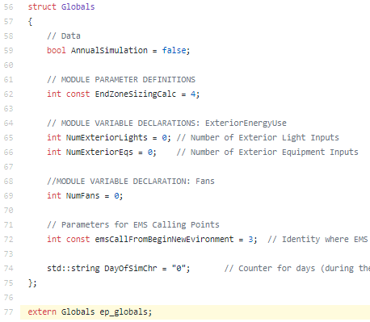
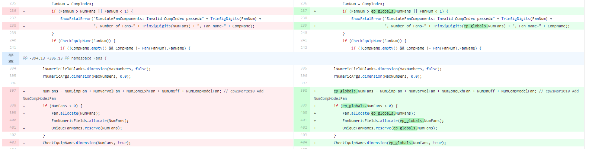
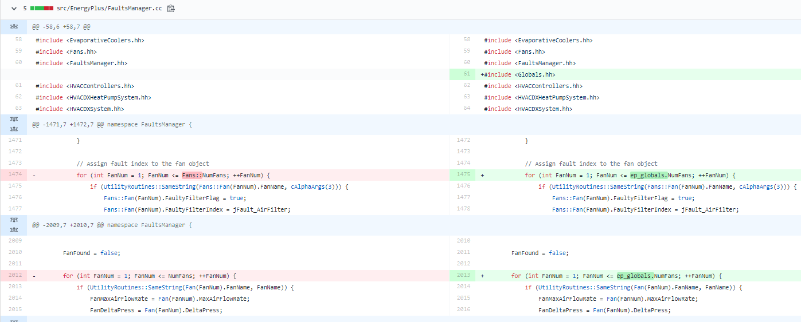
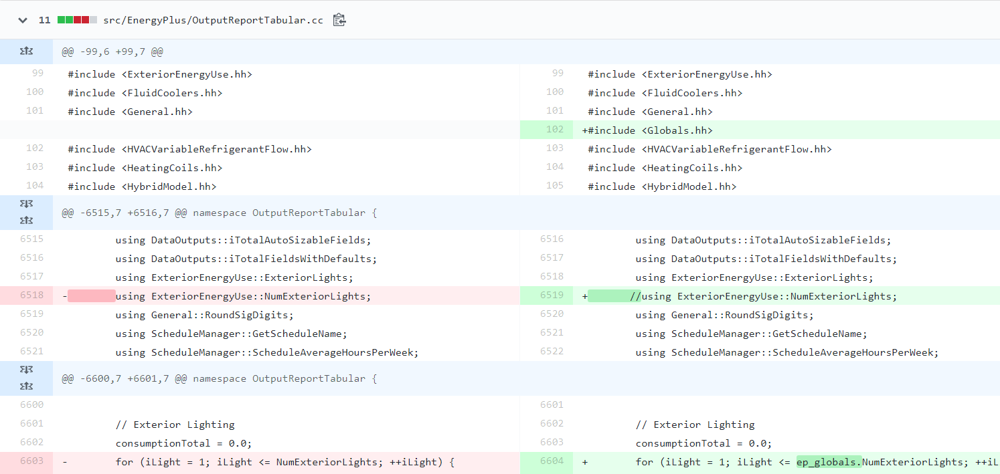

NFP: Refactor Global Variables
================

**Brian Ball, Edwin Lee, Matt Mitchell, Kyle Bene NREL**

 - 1 Aug 2019 

## Justification for New Feature ##

As EnergyPlus approaches a convergence with next-generation Spawn tools, some aspects of EnergyPlus are expected to be retained and refactored to avoid re-developing those for the new simulation ecosystem. The global variable state in EnergyPlus is a problem to current researchers and developers, and will be a major factor in that new ecosystem. This new feature will more easily allow starting/resetting/saving the state of EnergyPlus. 

## Overview ##

Global variables are currently used throughout the code and makes running simultaneous and concurrent EnergyPlus runs difficult to impossible as well as identifying the existing state of a simulation run (i.e., all the variable values of the simulation at a specified date and time.). To facilitate the resetting of states and variables in EnergyPlus, a new struct called "Globals" in EnergyPlus will be created and all the existing global variables will be moved to this struct, as illustrated in Figure 1.  In this test example, two global variables from the ExteriorEnergyUse object, an EMS calling point variable and a simulation control variable were moved to the global struct.

**Figure 1. New Struct of all Global Variables.**

The existing variable references in the code will also be changed to have a fully qualified name to the global struct.  In some cases, just the addition of the prefix "ep_globals." is sufficient, as illustrated in Figure 2.

**Figure 2. Github commit diff illustrating the use of a fully qualified variable name that will now be required.**

In other cases, the existing NameSpace reference will be replaced with reference to the global struct, as illustrated in Figures 3.

**Figure 3. Github commit diff illustrating that NameSpace variable usage will also change to use the global struct name.**

The use of namespaces will also be reduced and replaced with direct variable references to the global struct.  This should make the codebase more readable since the code will explicitly use fully qualified variable names from the struct (i.e., 'ep_globals.NumExteriorLights') and it should be clearer where the variable comes from, as illustrated in Figure 4.

**Figure 4. Github commit diff illustrating the replacement of a NameSpace usage to the use of the global struct name.**

## Approach ##

The current global state of EnergyPlus is already partially documented through the use of "clear_state" functions that were added throughout the EnergyPlus code to enable unit tests to execute with a fresh simulation state.  In addition, the use of the Clang refactoring tool (https://github.com/kbenne/clang-refactor) can easily identify all global variables and provide a programatic way to implement changes to the code base.

Several variables have already been converted in a test branch and typical replacement patterns are being analysed with the end goal of creating hueristics from which the Clang refactoring tool can be used to auto-replace existing names with the new fully qualified names.  This is necessary since there are thousands of existing global variables and hand replacement would be rather time consuming.  In addition, thought must be given to how existing and short term future pull requests are to be handled since this feature will be a large change to the code base.  Therefore, an automated / quick way to make these changes and get the pull request accepted is desirable.

## Testing/Validation/Data Sources ##

The regression tests will be run through the CI infrastructure to verify that the test models still produce the same results.  The tests run on the 7 test variables were successful, which suggests that this is a viable path.
