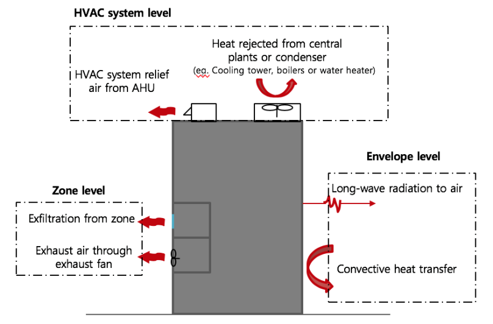
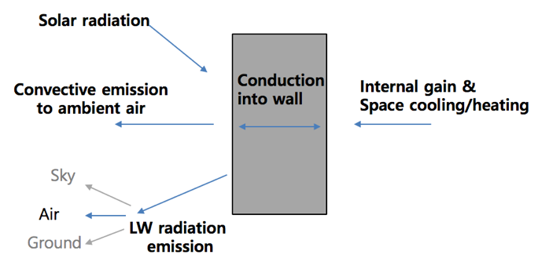

# Heat Emissions from Buildings to Ambient

Xuan Luo, Tianzhen Hong

Lawrence Berkeley National Laboratory

October 26, 2018 

## Justification for Feature Update

Heat emissions from buildings are a crucial component influencing climate change and urban microclimate, e.g., urban heat island effect. We propose to calculate heat emissions from buildings in EnergyPlus with a bottom-up approach and report them using new output variables as well as new tables in the current tabular summary reports. The heat emissions from a building include heat releases from three levels of building systems: building envelope, zone/space, and HVAC systems. The feature would allow users to quantify the dynamic behavior of heat emissions, and analyze their influencing factors including building use type, vintage, and climate. This feature directly supports DOE’s multi-year effort of enhancing EnergyPlus to support urban scale building modeling.

## Overview

Quantifying heat emissions from buildings and its spatiotemporal distribution have significant implications on urban environment and climate studies. Knowing how much heat is released into atmosphere can help quantify the magnitude of its impact on urban microclimate, e.g., urban heat island effect and climate change. Spatial and temporal distribution of heat emissions can serve to locate hot spots in space and time, therefore useful for prioritizing recourse to mitigate heat emissions from buildings.

We propose a bottom-up approach to calculate heat emissions from buildings with any building energy modeling programs. The scope is restricted to report the buildings’ heat directly discharged to their ambient air. As illustrated in Figure 1, we propose to include heat releases from three levels of building components: (1) building envelope - exterior surface convection and radiative heat transfer to the ambient air, (2) zone - exhaust air or exfiltration to ambient, (3) HVAC system - relief/exhaust air from AHUs, and (4) HVAC system - heat rejected by air-cooled condensers or central plants, including cooling towers of water-cooled chillers, gas-fired boilers, furnaces and water heaters. It should be noted that any under-ground zone or envelope is excluded, since heat from those spaces is rejected to ground instead of to ambient air. 

The heat emission we calculate and report measures the heat transfer from buildings to their ambient environment, and can have both positive and negative values. The positive values indicate the building injects heat to the environment, while the negative values indicate the building extracts heat from the environment.

For heat transfer via air flow, we calculate and report both the sensible and latent heat emissions.

**Figure 1. Building released heat compositions**

**1.	Heat emission from building envelope**

Exterior surfaces emit heat to ambient air in the form of convection and long-wave radiation, which could be absorbed by particles and gas molecules in air. Figure 2 illustrates the heat balance of an exterior surface. The internal sources modify the outside surface temperature through envelope conduction, along with incident solar radiation, which triggers the heat exchange with the ambient air. _Surface Outside Face Convection Heat Gain Rate_ and _Surface Outside Face Thermal Radiation to Air Heat Transfer Coefficient_ have already been reported. We would calculate the _Surface Outside Face Thermal Radiation to Air Heat Transfer Rate_ as:

Qlwr, surf = Hr * A * (Tsurf - Tout) &nbsp;&nbsp; Eq. (1),

where **Hr** is the surface outside face thermal radiation to air heat transfer coefficient, **A** is the surface area, **Tsurf** and **Tout** are the surface and outdoor air temperature.

**Figure 2. Building envelope exterior surface heat balance**

**2.	Heat emission from zones**

Discharge air carries heat to ambient at the zone level from exfiltration and exhaust fan. Exfiltration is unintended airflow to outside through envelope cracks, as opposite to infiltration. Zones such as restroom, kitchen and laundry room may be equipped with exhaust fans for active venting. These items can be quantified by:

Qexf, zone = mexf(hzone - hout) &nbsp;&nbsp; Eq. (2),

Qexh, zone = mexh(hzone - hout) &nbsp;&nbsp; Eq. (3),

where **mexf** is the exfiltration air flow rate, **mexh** is the zone exhaust air flow rate from the zone exhaust node, **hzone** and **hout** are the zone and outdoor air enthalpy. Among these, the sensible parts are:

Qexf, zone, sensible = mexf * c * (Tzone - Tout) &nbsp;&nbsp; Eq. (4),

Qexh, zone, sensible = mexh * c * (Tzone - Tout) &nbsp;&nbsp; Eq. (5),

where **c** is the specific heat of air, **Tzone** and **Tout** are the zone and outdoor air temperature. And the latent parts are determined by taking the difference between the total and the sensible rate. For each zone, we calculate its exfiltration rate by solving a mass flow balance on the zone including infiltration, ventilation, outdoor air mixing, zone-to-zone mixing, and all of the zone inlet, exhaust, and return nodes.

This part of zone exhaust only includes the exhaust heat at the zone level (defined by _Fan:ZoneExhaust_ or _AirflowNetwork:MultiZone:Component:ZoneExhaustFan_). For each zone, we aggregated this part by searching its exhaust fans. The exhaust heat from Zone HVAC system nodes is included in the next item. Besides, other part of air exchange with outdoors at system node level, balanced along with AirLoopHVAC, is considered in the next item.

**3.	Heat emission from HVAC systems through relief air**

HVAC systems relieve heat from system outdoor air relief nodes, and the total and sensible emission rate are calculated as:

Qexh, sys = mexh(hzone - hout) &nbsp;&nbsp; Eq. (6),

Qexh, sys, sensible = mexh * c * (Tzone - Tout) &nbsp;&nbsp; Eq. (7).

And the latent parts are determined by taking the difference between the total and sensible rate.

The air exchange with outdoor is represented with an _OutdoorAir:Mixer_ object in the  _AirLoopHVAC:OutdoorAirSystem_ object. We aggregate and report this part by each 　_Controller:OutdoorAir_ object.

**4.	Heat rejection from HVAC system equipment**

HVAC system equipment also directly exchanges heat with ambient air via refrigeration cycle and its energy usage. For example, for gas-fired boilers/heaters, waste heat is exhausted to outside together with combustion byproduct. For space cooling, heat is removed from indoors and dumped to outdoor at the condenser side or corresponding cooling equipment, such as cooling tower. In addition, energy consumed by outdoor equipment will directly dissipate to the ambient air, such as compressors and fans in packaged DX systems. In general, we assume the heat rejection is due to gas-powered combustion and condensers of any type, and we calculated these items based on the system type:

(1)	Gas-powered combustion unit: Fuel generated heat - fuel heat supply

(2)	Condensing unit:

a.	Air-cooled: cooling rate + electric power of condenser fan and compressor

b.	Water-cooled: total heat transfer rate with outdoor air

Detailed calculation of HVAC rejected heat varies with different HVAC object groups and component types, as summarized in Table 1.

**Table 1. Heat rejection calculation for different HVAC component types**

Object Group | Component | Calculation Methods
-------------  | -------------  | -------------
Coils | Chilled water cooling coil    | Emit heat in condensing unit defined in Condenser Equipment
 |  | Heating coil (fuel heated)      | Fuel Consumed + Heating Coil Defrost Electric Consumption + Heating Coil Crankcase Heater Electric Consumption – Heating Coil Total Heating Energy
 |  | Hot water/steam heating coil    | Emit heat in plant source defined in Plant Heating and Cooling Equipment
 |  | DX cooling coil (air-cooled)    | Cooling Coil Source Side Heat Transfer Rate + Cooling Coil Electric Power + Cooling Coil Crankcase Heater Electric Energy + Fuel Waste Heat
 |  | DX cooling coil (Evaporatively-cooled)     | Evaporative Cooler Condenser Pump Electricity Consumption + Cooling Coil Basin Heater Electric Energy + Evaporative Cooler Water Volume * rho * evaporation heat of water (∆Hwe)
 |  | DX VRF cooling coil             | Emit heat in condensing unit defined in Variable Refrigerant Flow Equipment
 |  | DX heating coil (air-cooled)    | Heating Coil Electric Power / Fuel Consumed + Heating Coil Defrost Electric Power + Heating Coil Crankcase Heater Electric Power – Heating Coil Total Heating Rate
 |  | Water to air heat pump (cooling / heating) | Emit heat in condensing unit defined in Condenser Equipment
 |  | DX VRF cooling /heating coil               | Emit heat in condensing unit defined in Variable Refrigerant Flow Equipment
Evaporative Coolers	|                 | Evaporative Cooler Condenser Pump Electricity Consumption + Cooling Coil Basin Heater Electric Energy + Evaporative Cooler Water Volume * rho * evaporation heat of water (∆Hwe)
Variable Refrigerant Flow Equipment   | VRF air-to-air heat pump condensing unit (air-cooled) | VRF Heat Pump Total Cooling Rate + VRF Heat Pump Total Electric Power (cooling mode) VRF Heat Pump Total Heating Electric Power / Fuel Rate - VRF Heat Pump Total Heating Rate (heating mode)
 |  | VRF air-to-air heat pump condensing unit (evaporative-cooled) | Evaporative Cooler Condenser Pump Electricity Consumption + Cooling Coil Basin Heater Electric Energy + Evaporative Cooler Water Volume * rho * evaporation heat of water (∆Hwe)
 |  | VRF air-to-air heat pump condensing unit (water-cooled) | VRF Heat Pump Condenser Heat Transfer Rate
Plant Heating and Cooling Equipment | Hot water/Steam boiler | Boiler <Fuel Type> Rate + Boiler Ancillary Electric Energy - Boiler Heating Rate
 |  | Chiller water-cooled | Emit heat in Condenser Equipment
 |  | Chiller air-cooled / evap-cooled   | Chiller Condenser Heat Transfer Rate
Condenser Equipment | Cooling Tower | Cooling Tower Heat Transfer Rate + Cooling Tower Fan Electric Power
Water Heaters and Thermal Storage | Water heater | Water Heater <Fuel Type> Rate - Water Heater Heating Rate
Zone HVAC Forced Air Units | Window air conditioner / Packaged terminal air conditioner (PTAC) / Packaged terminal heat pump (PTHP); Energy recovery ventilator (ERV); Unit ventilator/heater; Zone outdoor air unit | <unit type> Total Cooling Rate + <unit type> Electric Energy (cooling mode) <unit type> Heating Electric Power / Fuel Rate + <unit type> Electric Power - <unit type> Total Heating Rate (heating mode)
 |  | Water-to-air heat pump | Emit heat in condensing unit defined in Condenser Equipment
 |  | Zone evaporative cooler | Emit heat in condensing unit defined in Evaporative Coolers
 |  | Hybrid Unitary HVAC | System dependent; Calculated according to the equipment specification as above

There are several parts of heat rejection that the system are not clear defined, and we do not consider the following part into calculation:
1.	User defined systems have a variety of possible sources of heat emission including outdoor air relief for exhaust or a condenser outlet for heat rejection. These parts can be counted by tracing the condensing unit linked to the air connection inlet and outlet (for user defined zone HVAC and plant component). 
2.	For user defined coil, this part depends on how the coil is designed and equipped. We do not count this in report.
3.	ThermalStorage:Ice:* do not indicate where losses go, so we neglect this.

By summing up these components, we can calculate and report the heat emissions from buildings by systems and components as well as in total.

## Approach

The heat emission calculation results will be summarized in two tables (annual and monthly) and added to the existing tabular report.

Report: **Annual Heat Emissions Summary**

For: **Entire Facility**

Components | Envelope Convection | Zone Exfiltration | Zone Exhaust Air | HVAC Relief Air | HVAC Reject Heat | Total
---------  | ------------------  | ----------------  | ---------------  | --------------  | ---------------  | -----
Heat Emissions [GJ] | ---------  | ----------------  | ---------------  | --------------  | ---------------  | -----

A new monthly report will be created also:

Report: **HEAT EMISSIONS SUMMARY**

For: **Entire Facility**

Timestamp: **YYYY-MM-DD HH:MM:SS**

**Heat Emissions Monthly Report**

ENVELOPE CONVECTION [GJ] | ZONE EXFILTRATION [GJ] | ZONE EXHAUST AIR [GJ] | HVAC RELIEF AIR [GJ] | HVAC REJECT HEAT [GJ]
-------------  | -------------  |-------------  | -------------  | -------------  
January	 | | | | 
February | | | | 				
March	 | | | | 				
April	 | | | | 				
May		 | | | | 			
June	 | | | | 				
July	 | | | | 				
August	 | | | | 				
September| | | | 					
October	 | | | | 				
November | | | | 					
December | | | | 					 					
Annual Sum or Average | | | | 					
Minimum of Months	  | | | | 				
Maximum of Months	  | | | | 

## Testing/Validation/Data Source(s):

Two example files (the DOE reference small office and the large office models) will be modified to demonstrate the use of the new feature. Simulation results will be manually checked/benchmarked using excel spreadsheet with input and output from EnergyPlus runs.

## IDD Object (New):       

N/A

## IDD Object(s) (Revised):

The _Output:Table:SummaryReports_ object will be modified to take two new keys as the choice:

- **HeatEmissionsSummary** for annual heat emissions from buildings to ambient
- **HeatEmissionsReportMonthly** for monthly heat emissions from buildings to ambient

## Proposed additions to Meters:

N/A

## Proposed Report Variables:

The following new report variables will be added:

- Surface, Average, Surface Outside Face Thermal Radiation to Air Heat Transfer Rate
- Surface, Average, Surface Outside Face Heat Emission to Air Rate
- Zone, Average, Zone Exfiltration Heat Transfer Rate
- Zone, Average, Zone Exfiltration Sensible Heat Transfer Rate
- Zone, Average, Zone Exfiltration Latent Heat Transfer Rate
- Zone, Average, Zone Exhaust Air Heat Transfer Rate
- Zone, Average, Zone Exhaust Air Sensible Heat Transfer Rate
- Zone, Average, Zone Exhaust Air Latent Heat Transfer Rate
- HVAC, Average, HVAC Relief Air Heat Transfer Rate
- HVAC, Average, HVAC Relief Air Sensible Heat Transfer Rate
- HVAC, Average, HVAC Relief Air Latent Heat Transfer Rate
- HVAC, Average, HVAC Heat Rejection Rate
- HVAC, Average, HVAC Heat Rejection Sensible Rate
- HVAC, Average, HVAC Heat Rejection Latent Rate
- HVAC, Sum, Environmental Impact Heat Emissions

## IO Ref (draft):

To be developed.

## EngRef (draft):

To be developed.

## Example Files:

The existing DOE reference small office and large office models will be modified to add the report variables of heat emissions from buildings.

## E-mail comments

## Appendix

N/A
