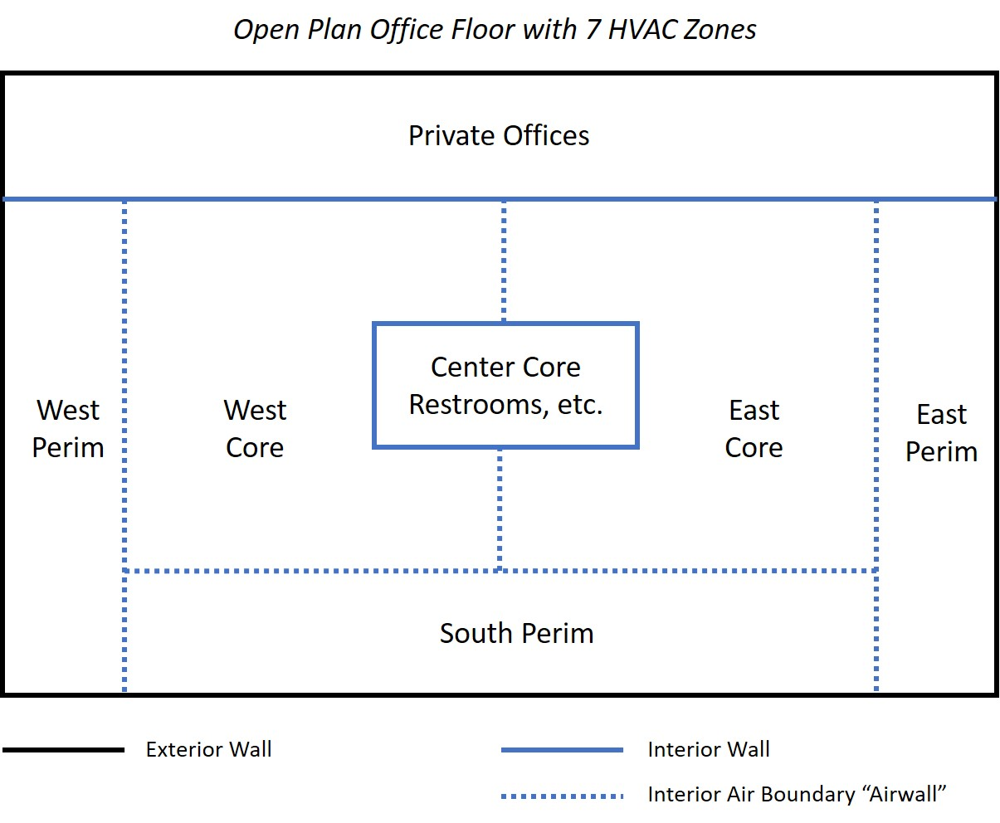

Air Thermal Boundary - aka Interzone Air Wall
================

**Michael J. Witte, GARD Analytics, Inc.**

 - Original May 8, 2019
 - Revision June 4, 2019
     - Drop "AirWall" as a surface type.
     - Add "Construction:AirBoundary" with input fields to control attributes such as air mixing and grouping
     - Drop the term "superzone", speak of grouping zones for calculations
     - Add discussion of internal view factors
     - Add discussion of interior solar distribution
     - Add options to discuss for simple airflow
 - Final NFP Revision June 10, 2019
     - Change *MRTSurface* to *IRTSurface* for Radiant Exchange Method
     - Add more discussion of output variables
 - Draft Final Design June 12, 2019
 

## Table of Contents ##

[Justification for New Feature](#justification-for-new-feature)

[E-mail and  Conference Call Conclusions](#e-mail-and-conference-call-conclusions)

[Approach](#approach)

[Testing/Validation/Data Sources](#testingvalidationdata-sources)

[Input Output Reference Documentation](#input-output-reference-documentation)

[Engineering Reference](#engineering-reference)

[Example File and Transition Changes](#example-file-and-transition-changes)

[References](#references)

[Design](#design)

## Justification for New Feature ##

Open boundaries between thermal zones occur frequently in buildings. Examples include:
 - Open plan offices with core and perimeter zones.
 - Open doorway from one space to another, e.g. hallway opening into a larger space.
 - Service opening, e.g. serving window between kitchen and dining area.
 - High spaces where the occupied zone is conditioned differently from the rest, e.g. atrium or auditorium

Open thermal boundaries allow the following heat transfer to occur:
 - Solar gains and daylighting to pass through as if there is no boundary
 - Radiant exhange between building surfaces as if there is no boundary.
 - Distribute radiant internal  gains as if there is no boundary.
 - Allow airflow and/or mixing to occur between the adjacent zones

This type of boundary occurs frequently in energy models, and is often called an "air wall." 
EnergyPlus has no direct way to model such a boundary. Common workarounds include some 
combination of the following:
 - Near-perfect interzone window
 - Surface using `Material:InfraredTransparent`
 - Surface using a very thin highly conductive material
 - `ZoneMixing` and `ZoneCrossMixing`
 - AirflowNetwork openings

All of these options have serious limitations, especially the lack of solar/daylight penetration and 
no direct radiant exchange across the boundary. 

## E-mail and  Conference Call Conclusions ##

### Questions and Comments Received through June 1 ##
 - Discussion whether superzone should be explicitly described in input
 - Can you have AirWalls with no adjacent surface? 
 - Can it be self-adjacent? 
 - What about zone multipliers? 
 - Can you have subsurfaces on an AirWall? 
 - Zone mixing or airflow network in addition to the airwall?
 - Should you be using airwalls if you don't have fully enclosed geometry?
 - Might consider an input value for Air Changes Per Hour for the opening. I usually recommend 1 ACH based on 
 the volume of the smaller zone as a basis for determining input for an airflow rate in zone mixing objects. 
 This might be automated to make it easier for the user with an ACH input to scale, such as higher for horizontal orientation. 
 - I guess this would lead to an air wall construction object that gets referenced. There might be other inputs that might go into 
 a Construction:AirWall object.
 - OpenStudio has an airwall material, but Construction:AirWall would also work
 - I'm not a fan of automating the "simple mixing models" or attaching it to the material. Construction, maybe, but shouldn't the air transfer be based on physics?
 - The nonconvex issue seems to be one that would make the superzone approach not work well.
 - I'm just imagining two simple rectangular zones next to each other. Between them, half is a regular wall and half is an airwall. 
 Something as simple as the radiant distribution of heat from equipment or a person in one of the zones is no longer as easy since 
 you can't assume all the radiant heat just gets fully distributed in that zone. The position of the equipment or person is now relevant 
 to determine how much of the radiant heat goes to the other zone. Maybe it is just as much of an assumption as it ever was but it seems 
 unintuitive to me. I kept expecting some additional inputs in your NFP that describe the assumptions of how heat, light, and air is 
 being flung around.
  - Seems funny to call it AirWall in the fenestration object. Use "AirWindow" instead?
  - Not sure why air exchange should be more complicated, since there's an easy solution - just disallow exchange and lump everything 
  together. That should be fine as long as the zone conditions aren't super different, and that's something we can warn about if it happens. 
  For AirflowNetwork it could easily be optional to treat the zones separately or lumped together (provided that there's something to attach 
  a node to).
  - Since we seem to have ramped up end-user-usage of the airflow network, special emphasis should be given there to ensure this works well with that.
  - The internal view factor algorithm is definitely going to have trouble with the geometries that will result here. View3D should not, but it 
  would make sense to add a script or two to simplify that calculation.
  - For very large openings with airflownetwork - Using the superzone approach is the way to go, or at least make it an option. It's going to 
  come down to which representation is best, and with large openings there's a higher probability of two-way flows. I don't think this is 
  something that a new element is going to fix.
  - The air wall helps on grouping (geometry side) multiple rooms or open spaces into a zone or larger room. 
  - Air walls are heat transparent - they don't receive solar radiation or internal radiant heat or participate in the long-wave radiation exchange. 
  - One tricky thing is to model the free-form air flow across the air wall. It would be good to provide some guidance (on using zone mixer to model the air exchange). 
  - There are places to skip the air walls, e.g., calculation of surface view factors need to skip the air walls.
  - what the implications of "air walls" are for interior solar distribution.
  
### Responses/Clarifications through June 1 ###
 - The AirWall must have an adjacent surface.
 - The AirWall cannot be self-adjacent. I suppose it could be allowed but that wouldn't accomplish anything - it would have zero impact on the simulation. 
 The whole idea is to have an opening that lets two zones transmit solar and radiant between them.
 - The intent is that the grouped zones (formerly superzones) would be determined simply by looking at the airwall surfaces which must all be an interzone surface. 
 The zone which holds the airwall and the zone which holds it's adjacent surface would be grouped together.
 - Zone multipliers? Good question. The only way this could work would be if all of the zones grouped together had the same multiplier.
 - The airwall as proposed wouldn't do any mixing itself, so yes, zone mixing and/or airflow network are required to move air between the zones.
 - No subsurfaces on an AirWall.
 - Perhaps an AirWall subsurface should be handled differently than an AirWall base surface to prevent the entire building from being connected into a single grouped zone. 
 - Maybe the new choice for fenestration objects (subsurfaces) should be "Opening" and it would behave as an interzone window with perfect transmittance. Something to consider.

### Conference Call Conclusions June 5 ###
 - For Radiant Exchange Method, replace *MRTSurface* with *IRTSurface* using a similar method as `Material:InfraredTransparent` for long-wave radiant energy.
 - For surface outputs, only create relevant output variables for the air boundary surfaces.
 - New outputs at the grouped zone level may be necessary to allow energy balances to be shown.
 
## Approach ##

The proposed approach is to remove the air boundary surface entirely from most of the heat transfer calculations
and group zone surfaces together for solar, daylighting, and radiant exchange calculations. For air exchange, 
specify mixing flows or group the zone air masses together for airflow network calculations. See Figure 1 for
an example application.

**Figure 1. Example Application - Open Plan Office**

### Radiant Exchange ###
For surface-to-surface radiant exchange, two options are proposed:

  **GroupedZones** - All surfaces in the zones connected by air boundaries will be grouped together
 for the radiant exchange calculations. Radiant gains from lights, people, HVAC equipment, etc. will 
be distributed to all surfaces in the group. Referring to the example in Figure 1, the four walls bounding the open
office area and the four walls bounding the center core would all be grouped together as in a single zone for the radiant
exchange balance. The same approximate view factor rules that are used within a single zone would be used here for the group.

  **InteriorWindow** - The air boundary will be modeled as a perfectly transmitting interior window. The inside face surface temperature
  will be set equal to the mean radiant temperature (MRT) of the  zone to approximate radiant exchange across the boundary.
  The inside face temperature will be set equal to the MRT of the adjacent zone.

#### Pitfalls ####
 - Radiant exchange calculations become very slow for zones with a large number of surfaces. This approach
 will exaggerate that problem.
 - Within the grouped zones it is likely that many surfaces will not have a direct view to all of the surfaces
 in the combined zone. Presently there is no algorithm to exclude certain views. View factors could be determined
 external to EnergyPlus and imported using `ZoneProperty:UserViewFactors:BySurfaceName` which may require some
 changes to allow view factors to be specified for surface pairs that are in different zones.
 - Input processing will need to allow view factors (for radiant HVAC equipment) to cross zone boundaries.
 - Re-simulation for radiant HVAC equipment will involve all surfaces in the group, causing extra computation time.
 - Reporting for zone-level radiant gains may be confusing. For example, radiant gains which have a source in Zone A
 may be distributed to other zones as well as Zone A. Even though the source of the gain is Zone A, the other zones
 should be reporting their share of the distributed gain.
 
### Solar Gains and Daylighting ###
For solar distribution and daylighting calculations, two options are proposed:

**GroupedZones** - The zones connected by air boundaries will be grouped into a
single zone. Referring to the example in Figure 1, the entire open plan office area would be grouped into a single
zone for solar and daylighting calculations. This allows sunlight entering a window on the south wall, for example, to 
penetrate into the other zones in the open office group.

  **InteriorWindow** - The air boundary will be modeled as a perfectly transmitting interior window.

#### Pitfalls ####
 - For `FullInteriorAndExterior` solar distribution options, the convex zone limitation will likely be tripped
 by the combined zones. The ultimate goal would be to crack this nut once and for all for any situation (airwalls or not).
 - One fallback option is to figure out a way to trap excess solar that has made it past an interior obstruction and
 remove it - if possible.
  - Another fallback option is to allow the grouped zones to revert to FullExterior (direct solar goes to the floor) while
  allowing other non-grouped zones to use FullInteriorAndExterior.
 - Reporting for solar gains may be confusing. For example, window heat gain calculations will need to
 account for transmitted solar which passes through to another zone (and the reverse).

### Air Exchange ###
For simple air exchange (not AirflowNetwork) three options are proposed:

1. Add `ZoneMixing` or `ZoneCrossMixing` objects, otherwise there is no exchange.
2. Add inputs fields to Construction:AirBoundary to control air exchange - with defaults.
3. Lump the air volumes together (essentially full mixing of the connected zones).
    
For simulations using AirflowNetwork, the air boundary may be handled differently depending on the size of the opening: 

1. For smaller openings, such as open doorways, the current `AirflowNetwork:MultiZone:Component:DetailedOpening`, 
`AirflowNetwork:MultiZone:Component:SimpleOpening` and `AirflowNetwork:MultiZone:Component:HorizontalOpening`
objects should be adequate. 
2. For very large openings (horizontal and vertical) another approach will be required. One
possibility is to use a lumped zone for the AirflowNetwork calculations. 
3. Or perhaps a new opening type could be developed to approximate the connection.

#### Pitfalls ####
 - It's unclear what the values should be for the simple mixing models across an open boundary.
 - AirflowNetwork reporting may be confusing if a lumped zone approach is used.
 
## Testing/Validation/Data Sources ##

Energy balances and comparisons with simlations using detailed zoning and combined zones will be used to confirm
that the results are reasonable. Various levels of reporing including design component loads will all need to
be consistent with each other.

## Input Output Reference Documentation ##

The proposed input mechanism is to modify the `BuildingSurface:Detailed` and `FenestrationSurface:Detailed` objects to allow a new
choice of *AirWall* for Surface Type. When this is selected, the Construction input is left blank (or ignored with a warning).
 Also, the only allowed choices for Outside Boundary Condition will be *Surface* and *Zone*.

## Input Description ##

### *New object* - Construction:AirBoundary ###

Construction:AirBoundary indicates an open boundary between two zones. It may be used for base surfaces and fenestration surfaces.
When this construction type is used, the Outside Boundary Condition of the surface (or the base surface of a fenestration surface)
must be either *Surface* or *Zone*. A base surface with Construction:AirBoundary cannot hold any fenestration surfaces.

*Field: Name*
The name of the construction.

*Field: Solar and Daylighting Method*
This field controls how the surface is modeled for solar distribution and daylighting calculations. There are two
choices:

  **GroupedZones** - The two zones separated by this air boundary will be grouped together into a combined zone. If a given zone has
  and air boundary with more than one zone, then all of the connected zones will be grouped together. For example, if there is an air
  boundary between zones A and B, and another air boundary between zones B and C, all three zones A, B, and C will be grouped into a
  single zone for solar distribution and daylighting.

  **InteriorWindow** - The air boundary will be modeled as a perfectly transmitting interior window. As with other interior windows,
  all direct solar passing through the interior window will be diffuse in the adjacent zone.

*Field: Radiant Exchange Method*
This field controls how the surface is modeled for radiant exchange calculations. There are two
choices:

  **GroupedZones** - The two zones separated by this air boundary will be grouped together into a combined zone. If a given zone has
  and air boundary with more than one zone, then all of the connected zones will be grouped together. For example, if there is an air
  boundary between zones A and B, and another air boundary between zones B and C, all three zones A, B, and C will be grouped into a
  single zone for radiant exchange. Normal default simplified view factors will apply unless detailed view factors are specified using
  ZoneProperty:UserViewFactors:BySurfaceName.

  **IRTSurface** - The air boundary will be modeled as blackbody surface between the adjacent zones (similar, but not exactly the same 
  as `Material:InfraredTransparent`. The surface participates in
  the radiant exchange within each zone and receives long-wave radiant energy from internal sources. The surface does not absorb any
  visible or solar radiation, has no thermal resistance, and has zero convective heat transfer coefficients on both sides.

*Field: Air Exchange Method*

  **GroupedZones** - The zone air temperature and humidity will be a volume-weighted average of the connected zones.
  
  **None** - There will be no air exchange modeled across this surface. Other objects, such as ZoneMixing
  and ZoneCrossMixing or AirflowNetwork openings may be specified if desired.
  
  **SimpleMixing** - For each pair of zones connected by Construction:AirBoundary, a pair of ZoneMixing objects will created automatically.
  These mixing objects may be automatically adjusted to balance HVAC system flows using the ZoneAirMassFlowConservation object.

*Field: Simple Mixing Air Changes per Hour*
If the Air Exchange Method is *SimpleMixing* then this field specifies the air change rate [1/hr] using the volume of the smaller zone
as the basis. The default is 0.5. If an AirflowNetwork simulation is active this field is ignored.

*Field: Simple Mixing Schedule Name*
If the Air Exchange Method is *SimpleMixing* then this field specifies the schedule name for the air mixing across this boundary. If this field
is blank, then the schedule defaults to always 1.0. If an AirflowNetwork simulation is active this field is ignored.

### *Modified object* - ZoneProperty:UserViewFactors:BySurfaceName ###

The method of entering user view factors is to enter each surface name and its view factor value to other
surfaces in a zone or group of zones connected by air boundaries (see Construction:AirBoundary).

*Field: ~Zone~ Enclosure Name*

An enclosure may be a single zone, or a group of zones connected by one or more air boundaries.
Enter the applicable surface pairs with non-zero view factors. Any omitted surface pair is assumed to have a zero view factor.

*Field: From Surface 1*

This field specifies the name of the "from surface". All other surfaces in this object must be within the 
same enclosure at this surface. If the zone for this surface has no air boundaries (Construction:AirBoundary) with 
Radiant Exchange Method = GroupedZones, then all other surfaces must be within the same zone. If there are one or more
 GroupedZone air boundaries, then all other surfaces must be within the connected group of zones.

## Outputs Description ##

Various output descriptions may need notes to explain what happens when energy crosses an airwall boundary.
For surface outputs, only relevant output variables will be instantiated for the air boundary surfaces. This will vary
depending on the options selected for Solar and Daylighting Method and Radiant Exchange Method. If *GroupedZone* is
selected for both of these methods, then no surface output variables will be instantiated.

 - For Solar and Daylighting Method = InteriorWindow the relevant window output variables will be instantiated, the same
 as for a normal interior window.
 - For Raidant Exchange Method = IRTSurface, the relevant opaque surface output variables will be instantiated, the same
 as for a normal interzone surface (i.e. no outside face surface temperature will be instantiated).
 
New outputs at the grouped zone level may be necessary to allow energy balances to be shown, because it will be impossible
to track solar and radiant energy which travels from one zone to another across an air boundary. 

## Engineering Reference ##

TBD

## Example File and Transition Changes ##

One or more example files will be developed which use air boundaries in various ways.

## References ##

None.

## Design ##
The overall plan is to tackle radiant exchange first, then solar/daylighting, then air exchange.

### New object Construction:AirBoundary ###
In `HeatBalanceManager::GetConstructData` add code to process Construction:AirBoundary objects in a new
function `CreateAirBoundaryConstructions`.

In `DataHeatBalance` add new fields to struct `ConstructionData`:

    bool TypeIsAirBoundarySolar(false) // true for Construction:AirBoundary with grouped zones for solar and daylighting
    bool TypeIsAirBoundaryInteriorWindow(false) // true for Construction:AirBoundary with InteriorWindow for solar and daylighting
    bool TypeIsAirBoundaryRadiant(false) // true for Construction:AirBoundary with grouped zones for radiant
    bool TypeIsAirBoundaryIRTSurface(false) // true for Construction:AirBoundary with IRTSurface for radiant
    bool TypeIsAirBoundaryLumpedAirMass(false) // true for Construction:AirBoundary with grouped zones for air exchange
    bool TypeIsAirBoundaryMixing(false) // true for Construction:AirBoundary with SimpleMixing for air exchange

For the *IRTSurface* option, use existing `TypeIsIRT` as a guide, but there will be some differences for `TypeIsAirBoundaryIRTSurface`.
For the *InteriorWindow* option, will likely use existing `TypeIsWindow` in combination with `TypeIsAirBoundaryInteriorWindow`.

*I must say I'm not sure I want to add to the long list of `TypeIs...` variables in `ConstructionData`, but they get the job done.
Several are used only for error checking, some are used only for inits, others are used in the simulation loops (primarily to skip a surface with `continue`. 
In fact, the entire `ConstructionData` struct is full of stuff that's only used for one type of construction or another. There's some common stuff,
but lots of extra baggage. I'm open to suggestions.*

### IRTSurface for Radiant Exchange ###
When *IRTSurface* is specified, then the surface will be modeled the same way that the existing `Material:InfraredTransparent` is used, but the convection
coefficients will automatically be set to zero rather than expecting user inputs for that.

### InteriorWindow for Solar Distribution and Daylighting ###
When *InteriorWindow* is specified, then the surface will be set up like any other interior window, except it will have perfect transmittance and will
not participate in any other heat exchange. It will likely need a flag variable that can be checked to skip it for certain calculations. For example,
any window optical calculations can be skipped and simply transmit all of the incident solar.

### Simple Mixing for Air Exchange ###
When *SimpleMixing* is specified for a surface, a pair of ZoneMixing objects will be created between the two zones, using the specified
air change rate based on the smaller of the two zone volumes. Checks will be required to prevent duplicate sets of mixing objects between the same
zone pair. These will likely be set up in `HeatBalanceAirManager::GetSimpleAirModelInputs` along with the user-specified ZoneMixing objects by looping
through all of the surfaces. 

### Grouped Zones for Radiant Exchange ###

In [PR #7267](https://github.com/NREL/EnergyPlus/pull/7267/files) "Streamline ManageSurfaceHeatBalance - Part 1,"
new lists of surfaces have been added to streamline loops in `HeatBalanceSurfaceManager::CalcHeatBalanceInsideSurf`:

    DataSurfaces::AllHTSurfaceList // List of all heat transfer surface
    DataSurfaces::AllIZSurfaceList
    DataHeatBalance::Zone(ZoneToResimulate).ZoneHTSurfaceList // List of HT surfaces related to this zone (includes adjacent interzone surfaces)
    DataHeatBalance::Zone(ZoneToResimulate).ZoneIZSurfaceList // List of interzone surfaces in this zone

For radiant exchange, similar surface lists and related data already exist in `DataViewFactorInformation.hh struct ZoneViewFactorInformation`:  

    std::string Name;           // Zone name
    int NumOfSurfaces;          // Number of surfaces in the zone
    Array2D<Real64> F;          // View Factors
    Array2D<Real64> ScriptF;    // Hottel's Script F //Tuned Transposed
    Array1D<Real64> Area;       // Surface area
    Array1D<Real64> Emissivity; // Surface emissivity
    Array1D<Real64> Azimuth;    // Azimuth angle of the surface (in degrees)
    Array1D<Real64> Tilt;       // Tilt angle of the surface (in degrees)
    Array1D_int SurfacePtr;     // Surface ALLOCATABLE (to Surface derived type)
    Array1D_string Class;       // Class of surface (Wall, Roof, etc.)

`DataViewFactorInformation::ZoneInfo(ZoneNum).SurfacePtr` is a 1d array analagous to `DataHeatBalance::Zone(ZoneToResimulate).ZoneHTSurfaceList`.
`ZoneInfo` is populated in `HeatBalanceIntRadExchange::InitInteriorRadExchange` for the heat transfer surfaces in a given zone. `ZoneInfo.F` is
also used for interior solar diffuse distribution in `SolarShading::CalcWinTransDifSolInitialDistribution` and `CalcInteriorWinTransDifSolInitialDistribution.`

Initial thoughts are to change `ZoneInfo` to `RadiantEnclosure` and add `SolarEnclosure`. `RadiantEnclosure` would be used exactly the same way 
that `ZoneInfo` is used, except the included surfaces would differ depending on the presence of Construction:AirBoundary surfaces with *GroupedZone* radiant
exchange. In that case, all of the surfaces within the connected grouped zones would be in the same `RadiantEnclosure` list. In this case, the number of
radiant enclosures would be less than the number of zones. 

When `HeatBalanceIntRadExchange::CalcInteriorRadExchange` is called without the optional `ZoneToResimulate`
argument, then it will simply loop through the members of `RadiantEnclosure` to cover all zones or groups. When `ZoneToResimulate` is used, then a new variable in the `Zone` struct will
point to the `RadiantEnclosure` associated with that zone. `ZoneToResimulate` is used when there is radiant heating/coooling equipment in a zone. If there is
radiant equipment in more than one zone within the same enclosure, this will result in the entire enclosure being solved multiple times as each zone's
radiant system updates. The calls to resimulate will be examined to see if this duplication can be avoided.

### Distribution of Internal Radiant Gains with Grouped Zones ###
`HeatBalanceSurfaceManager::ComputeIntThermalAbsorpFactors` "computes the fractions of long-wave radiation from lights, equipment and people 
that is absorbed by each zone surface". Visible gains from lights are tracked separately.

Pertinent variables (*inferring units from usage - not documented - grrr*):

  `DataHeatBalance::TMULT` [1/m2?] - Zone multiplier - essentially 1/Sum(Area*ThermalAbsorptance) in the zone
  `DataHeatBalance::QL` [W?] - Total thermal radiation added to a zone
  `DataHeatBalance::QS` [W?] - Zone short-wave flux density
  `DataHeatBalance::QSLights` [W?] - Like QS, but Lights short-wave only.
  `DataHeatBalance::QSDifSol` [W?] - Like QS, but diffuse solar short-wave only.
  
  
Pertinent functions:

  `HeatBalanceSurfaceManager::InitIntSolarDistribution`
  `HeatBalanceSurfaceManager::ComputeIntThermalAbsorpFactors`
  `HeatBalanceSurfaceManager::GatherComponentLoadsSurfAbsFact`
  `InternalHeatGains::InitInternalHeatGains`

Initial thought is to keep `QL` and `TMULT` as-is per zone and add new `QLEnclosure` and `TMULTEnclosure` which are for the grouped zone enclosures.
Similar for `QS`.

### Grouped Zones for Solar Distribution and Daylighting ###

For diffuse interior solar distribution, `SolarShading::CalcWinTransDifSolInitialDistribution` and `CalcInteriorWinTransDifSolInitialDistribution.`
will use the new `DataViewFactorInformation::SolarEnclosure` surface lists instead of the current `ZoneInfo` lists.

For direct solar, searching the code for `FullnteriorExterior` points to the following functions that will need modifications to use the new 
`SolarEnclosure` surface lists and to skip air boundary surfaces:

  * `SolarShading::ComputeIntSolarAbsorpFactors` - When not using FullInterior solar distribution, this function calculates the factors to distribute
direct solar entering a zone; to the floor(s) if present, otherwise distribute evenly. 
  * `SolarShading::DetermineShadowingCombinations` - This function calculates possible shadow combinations. It has a different path for FullInterior.
  Once these combinations are set here, then the rest of the solar shading calculations should flow directly without any other changes, because
  the shadow combinations will already include or exclude the appropriate combinations within the solar enclosures.
  * `SolarShading::CalcInteriorSolarDistributionWCESimple` - Calculates various zone solar output variables such as "Zone Exterior Windows Total Transmitted Beam Solar Radiation Rate".
  Some of these outputs will be fine as-is even for grouped zones, because the source surfaces are still associated with their respective zones. Others may
  require modifications to allocate the solar energy correctly among the grouped zones.
  
For daylighting, pretty much every function will need to be converted to use the `SolarEnclosure` surface lists instead of the current 
approach of `for (ISurf = Zone(ZoneNum).SurfaceFirst; ISurf <= Zone(ZoneNum).SurfaceLast; ++ISurf) {`.

### Grouped Zones for Air Exchange ###
It's not clear how go about this conceptually. There are so many calculations that depend on the zone air temperature - inside surface heat balances,
infiltration and mixing, HVAC system operation. It won't be correct to simply average the zone air masses together at the end of a time step, for example.
Using a single air mass for the entire group would require that any HVAC controls in the group of zones are all working towards the same setpoint which
defeats the whole purpose of the separate zones in the first place. So, punting this one until the end. It may ultimately be removed as an option.

### Reporting ###
Various zone and surface outputs will be reviewed to determine their relevance and the proper accounting of 
solar and radiant gains. Irrelevant output variables will be suppressed for air boundary surfaces (dependent on the options specified
for radiant, solar, and air exchange) and grouped zones. Reporting at the grouped zone level has been considered, but if at all 
possible, it would be preferable to keep reporting at the original zone level only.
