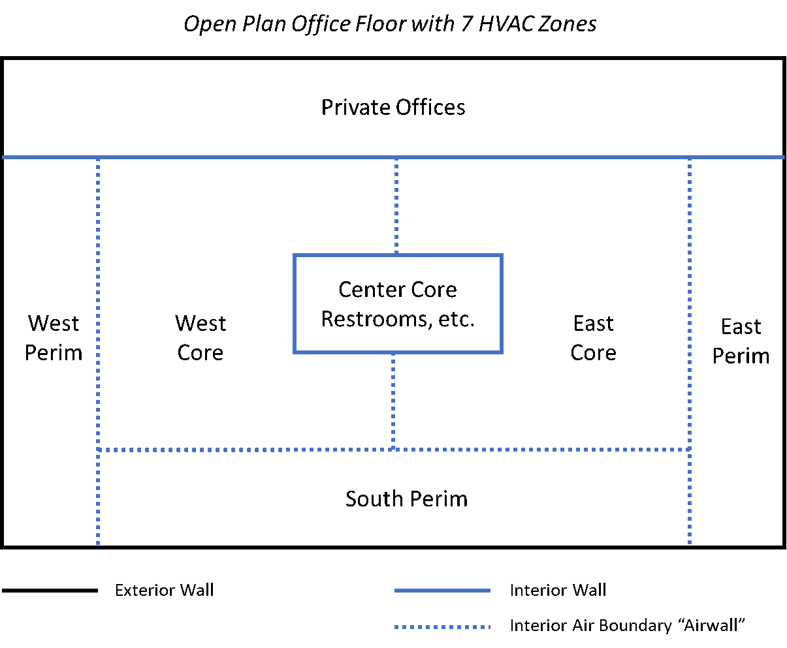

Air Thermal Boundary - aka Interzone Air Wall
================

**Michael J. Witte, GARD Analytics, Inc.**

 - Original May 8, 2019
 - Revision June 2, 2019
     - Drop "AirWall" as a surface type.
     - Add "Construction:AirBoundary" with input fields to control attributes such as air mixing and grouping
     - Drop the term "superzone", speak of grouping zones for calculations
     - Add discussion of internal view factors
     - Add discussion of interior solar distribution
     - Add options to discuss for simple airflow

## Table of Contents ##

[Justification for New Feature](#justification-for-new-feature)

[E-mail and  Conference Call Conclusions](#e-mail-and-conference-call-conclusions)

[Approach](#approach)

[Testing/Validation/Data Sources](#testingvalidationdata-sources)

[Input Output Reference Documentation](#input-output-reference-documentation)

[Engineering Reference](#engineering-reference)

[Example File and Transition Changes](#example-file-and-transition-changes)

[References](#references)

[Design](#design)

## Justification for New Feature ##

Open boundaries between thermal zones occur frequently in buildings. Examples include:
 - Open plan offices with core and perimeter zones.
 - Open doorway from one space to another, e.g. hallway opening into a larger space.
 - Service opening, e.g. serving window between kitchen and dining area.
 - High spaces where the occupied zone is conditioned differently from the rest, e.g. atrium or auditorium

Open thermal boundaries allow the following heat transfer to occur:
 - Solar gains and daylighting to pass through as if there is no boundary
 - Radiant exhange between building surfaces as if there is no boundary.
 - Distribute radiant internal  gains as if there is no boundary.
 - Allow airflow and/or mixing to occur between the adjacent zones

This type of boundary occurs frequently in energy models, and is often called an "air wall." 
EnergyPlus has no direct way to model such a boundary. Common workarounds include some 
combination of the following:
 - Near-perfect interzone window
 - Surface using `Material:InfraredTransparent`
 - Surface using a very thin highly conductive material
 - `ZoneMixing` and `ZoneCrossMixing`
 - AirflowNetwork openings

All of these options have serious limitations, especially the lack of solar/daylight penetration and 
no direct radiant exchange across the boundary. 

## E-mail and  Conference Call Conclusions ##

### Questions and Comments Received through June 1 ##
 - Discussion whether superzone should be explicitly described in input
 - Can you have AirWalls with no adjacent surface? 
 - Can it be self-adjacent? 
 - What about zone multipliers? 
 - Can you have subsurfaces on an AirWall? 
 - Zone mixing or airflow network in addition to the airwall?
 - Should you be using airwalls if you don't have fully enclosed geometry?
 - Might consider an input value for Air Changes Per Hour for the opening. I usually recommend 1 ACH based on 
 the volume of the smaller zone as a basis for determining input for an airflow rate in zone mixing objects. 
 This might be automated to make it easier for the user with an ACH input to scale, such as higher for horizontal orientation. 
 - I guess this would lead to an air wall construction object that gets referenced. There might be other inputs that might go into 
 a Construction:AirWall object.
 - OpenStudio has an airwall material, but Construction:AirWall would also work
 - I'm not a fan of automating the "simple mixing models" or attaching it to the material. Construction, maybe, but shouldn't the air transfer be based on physics?
 - The nonconvex issue seems to be one that would make the superzone approach not work well.
 - I'm just imagining two simple rectangular zones next to each other. Between them, half is a regular wall and half is an airwall. 
 Something as simple as the radiant distribution of heat from equipment or a person in one of the zones is no longer as easy since 
 you can't assume all the radiant heat just gets fully distributed in that zone. The position of the equipment or person is now relevant 
 to determine how much of the radiant heat goes to the other zone. Maybe it is just as much of an assumption as it ever was but it seems 
 unintuitive to me. I kept expecting some additional inputs in your NFP that describe the assumptions of how heat, light, and air is 
 being flung around.
  - Seems funny to call it AirWall in the fenestration object. Use "AirWindow" instead?
  - Not sure why air exchange should be more complicated, since there's an easy solution - just disallow exchange and lump everything 
  together. That should be fine as long as the zone conditions aren't super different, and that's something we can warn about if it happens. 
  For AirflowNetwork it could easily be optional to treat the zones separately or lumped together (provided that there's something to attach 
  a node to).
  - Since we seem to have ramped up end-user-usage of the airflow network, special emphasis should be given there to ensure this works well with that.
  - The internal view factor algorithm is definitely going to have trouble with the geometries that will result here. View3D should not, but it 
  would make sense to add a script or two to simplify that calculation.
  - For very large openings with airflownetwork - Using the superzone approach is the way to go, or at least make it an option. It's going to 
  come down to which representation is best, and with large openings there's a higher probability of two-way flows. I don't think this is 
  something that a new element is going to fix.
  - The air wall helps on grouping (geometry side) multiple rooms or open spaces into a zone or larger room. 
  - Air walls are heat transparent - they don't receive solar radiation or internal radiant heat or participate in the long-wave radiation exchange. 
  - One tricky thing is to model the free-form air flow across the air wall. It would be good to provide some guidance (on using zone mixer to model the air exchange). 
  - There are places to skip the air walls, e.g., calculation of surface view factors need to skip the air walls.
  - what the implications of "air walls" are for interior solar distribution.
  
### Responses/Clarifications through June 1 ###
 - The AirWall must have an adjacent surface.
 - The AirWall cannot be self-adjacent. I suppose it could be allowed but that wouldn't accomplish anything - it would have zero impact on the simulation. 
 The whole idea is to have an opening that lets two zones transmit solar and radiant between them.
 - The intent is that the grouped zones (formerly superzones) would be determined simply by looking at the airwall surfaces which must all be an interzone surface. 
 The zone which holds the airwall and the zone which holds it's adjacent surface would be grouped together.
 - Zone multipliers? Good question. The only way this could work would be if all of the zones grouped together had the same multiplier.
 - The airwall as proposed wouldn't do any mixing itself, so yes, zone mixing and/or airflow network are required to move air between the zones.
 - No subsurfaces on an AirWall.
 - Perhaps an AirWall subsurface should be handled differently than an AirWall base surface to prevent the entire building from being connected into a single grouped zone. 
 - Maybe the new choice for fenestration objects (subsurfaces) should be "Opening" and it would behave as an interzone window with perfect transmittance. Something to consider.
 - 
## Approach ##

The proposed approach is to remove the air boundary surface entirely from most of the heat transfer calculations
and group zone surfaces together for solar, daylighting, and radiant exchange calculations. For air exchange, 
specify mixing flows or group the zone air masses together for airflow network calculations. See Figure 1 for
an example application.



**Figure 1. Example Application - Open Plan Office**


### Radiant Exchange ###
For surface-to-surface radiant exchange, two options are proposed:

  **GroupedZones** - All surfaces in the zones connected by air boundaries will be grouped together
 for the radiant exchange calculations. Radiant gains from lights, people, HVAC equipment, etc. will 
be distributed to all surfaces in the group. Referring to the example in Figure 1, the four walls bounding the open
office area and the four walls bounding the center core would all be grouped together as in a single zone for the radiant
exchange balance. The same approximate view factor rules that are used within a single zone would be used here for the group.

  **InteriorWindow** - The air boundary will be modeled as a perfectly transmitting interior window. The inside face surface temperature
  will be set equal to the mean radiant temperature (MRT) of the  zone to approximate radiant exchange across the boundary.
  The inside face temperature will be set equal to the MRT of the adjacent zone.

#### Pitfalls ####
 - Radiant exchange calculations become very slow for zones with a large number of surfaces. This approach
 will exaggerate that problem.
 - Within the grouped zones it is likely that many surfaces will not have a direct view to all of the surfaces
 in the combined zone. Presently there is no algorithm to exclude certain views. View factors could be determined
 external to EnergyPlus and imported using `ZoneProperty:UserViewFactors:bySurfaceName` which may require some
 changes to allow view factors to be specified for surface pairs that are in different zones.
 - Input processing will need to allow view factors (for radiant HVAC equipment) to cross zone boundaries.
 - Re-simulation for radiant HVAC equipment will involve all surfaces in the group, causing extra computation time.
 - Reporting for zone-level radiant gains may be confusing. For example, radiant gains which have a source in Zone A
 may be distributed to other zones as well as Zone A. Even though the source of the gain is Zone A, the other zones
 should be reporting their share of the distributed gain.
 
### Solar Gains and Daylighting ###
For solar distribution and daylighting calculations, two options are proposed:

**GroupedZones** - The zones connected by air boundaries will be grouped into a
single zone. Referring to the example in Figure 1, the entire open plan office area would be grouped into a single
zone for solar and daylighting calculations. This allows sunlight entering a window on the south wall, for example, to 
penetrate into the other zones in the open office group.

  **InteriorWindow** - The air boundary will be modeled as a perfectly transmitting interior window.

#### Pitfalls ####
 - For `FullInteriorAndExterior` solar distribution options, the convex zone limitation will likely be tripped
 by the combined zones. The ultimate goal would be to crack this nut once and for all for any situation (airwalls or not).
 - One fallback option is to figure out a way to trap excess solar that has made it past an interior obstruction and
 remove it - if possible.
  - Another fallback option is to allow the grouped zones to revert to FullExterior (direct solar goes to the floor) while
  allowing other non-grouped zones to use FullInteriorAndExterior.
 - Reporting for solar gains may be confusing. For example, window heat gain calculations will need to
 account for transmitted solar which passes through to another zone (and the reverse).

### Air Exchange ###
For simple air exchange (not AirflowNetwork) three options are proposed:

1. Add `ZoneMixing` or `ZoneCrossMixing` objects, otherwise there is no exchange.
2. Add inputs fields to Construction:AirBoundary to control air exchange - with defaults.
3. Lump the air volumes together (essentially full mixing of the connected zones).
    
For simulations using AirflowNetwork, the air boundary may be handled differently depending on the size of the opening: 

1. For smaller openings, such as open doorways, the current `AirflowNetwork:MultiZone:Component:DetailedOpening`, 
`AirflowNetwork:MultiZone:Component:SimpleOpening` and `AirflowNetwork:MultiZone:Component:HorizontalOpening`
objects should be adequate. 
2. For very large openings (horizontal and vertical) another approach will be required. One
possibility is to use a lumped zone for the AirflowNetwork calculations. 
3. Or perhaps a new opening type could be developed to approximate the connection.

#### Pitfalls ####
 - It's unclear what the values should be for the simple mixing models across an open boundary.
 - AirflowNetwork reporting may be confusing if a lumped zone approach is used.
 
## Testing/Validation/Data Sources ##

Energy balances and comparisons with simlations using detailed zoning and combined zones will be used to confirm
that the results are reasonable. Various levels of reporing including design component loads will all need to
be consistent with each other.

## Input Output Reference Documentation ##

The proposed input mechanism is to modify the `BuildingSurface:Detailed` and `FenestrationSurface:Detailed` objects to allow a new
choice of *AirWall* for Surface Type. When this is selected, the Construction input is left blank (or ignored with a warning).
 Also, the only allowed choices for Outside Boundary Condition will be *Surface* and *Zone*.

## Input Description ##

### *New object* - Construction:AirBoundary ###

Construction:AirBoundary indicates an open boundary between two zones. It may be used for base surfaces and fenestration surfaces.
When this construction type is used, the Outside Boundary Condition of the surface (or the base surface of a fenestration surface)
must be either *Surface* or *Zone*. A base surface with Construction:AirBoundary cannot hold any fenestration surfaces.

*Field: Name*
The name of the construction.

*Field: Solar and Radiant Modeling Method*
This field controls how the surface is modeled for solar distribution, daylighting, and radiant exchange calculations. There are two
choices:

  **GroupedZones** - The two zones separated by this air boundary will be grouped together into a combined zone. If a given zone has
  and air boundary with more than one zone, then all of the connected zones will be grouped together. For example, if there is an air
  boundary between zones A and B, and another air boundary between zones B and C, all three zones A, B, and C will be grouped into a
  single zone for solar, daylighting, and radiant exchange.

  **InteriorWindow** - The air boundary will be modeled as a perfectly transmitting interior window. The inside face surface temperature
  will be set equal to the mean radiant temperature (MRT) of the  zone to approximate radiant exchange across the boundary.
  The inside face temperature will be set equal to the MRT of the adjacent zone.

*Field: Air Exchange Method*

  **GroupedZones** - The zone air temperature and humidity will be a volume-weighted average of the connected zones.
  
  **None** - There will be no air exchange modeled across this surface. Other objects, such as ZoneMixing
  and ZoneCrossMixing or AirflowNetwork openings may be specified if desired.
  
  **SimpleMixing** - For each pair of zones connected by Construction:AirBoundary, a pair of ZoneMixing objects will created automatically.

*Field: Simple Mixing Air Changes per Hour*
If the Air Exchange Method is *SimpleMixing* then this field specifies the air change rate [1/hr] using the volume of the smaller zone
as the basis. The default is 0.5. If an AirflowNetwork simulations is active this field is ignored.

*Field: Simple Mixing Schedule Name*
If the Air Exchange Method is *SimpleMixing* then this field specifies the schedule name for the air mixing across this boundary. If this field
is blank, then the schedule defaults to always 1.0. If an AirflowNetwork simulations is active this field is ignored.

### *Modified object* - ZoneProperty:UserViewFactors:bySurfaceName ###

The method of entering user view factors is to enter each surface name and its view factor value to other
surfaces in a zone or group of zones connected by air boundaries (see Construction:AirBoundary).

*Field: ~Zone~ Enclosure Name*

An enclosure may be a single zone, or a group of zones connected by one or more air boundaries.
Enter the applicable surface pairs with non-zero view factors. Any omitted surface pair is assumed to have a zero view factor.

*Field: From Surface 1*

This field specifies the name of the “from surface”. All other surfaces in this object must be within the 
same enclosure at this surface. If there are no air boundaries in the simulation with Solar and Radiant Modeling Method = GroupedZones,
 then that all of the surfaces must be within the same zone. If there are GroupedZone air boundaries, then all of the surfaces must be
 within the connected group of zones.

## Outputs Description ##

Various output descriptions may need notes to explain what happens when energy crosses an airwall boundary.

## Engineering Reference ##

TBD

## Example File and Transition Changes ##

One or more example files will be developed which use air boundaries in various ways.

## References ##

None.

## Design ##
*The design will be more fully developed after the NFP conference call.*

The overall plan is to tackle radiant exchange first, then solar/daylighting, then air exchange.

### Grouped Zones ###
For the grouped zone concept, a second zone number field will be added to the surface data
structure(s). For solar, daylighting, and radiant exchange, the alternate grouped zone number will
be used to determine which surfaces to use and how they interact.

Will this work? Probably not initially. There are places that assume all of the surfaces in a
zone are adjacent to each other in the `Surface` data structure. e.g.

```
        for (ISurf = Zone(ZoneNum).SurfaceFirst; ISurf <= Zone(ZoneNum).SurfaceLast; ++ISurf) {
```

This example is from daylighting, so it will need to be changed. Other examples of this usage occur
in convection coefficients and other places where the current method will not be impacted. 
This can be addressed by using zone-level lists of surface numbers (which is already being 
developed in a separate effort).

### Reporting ###
Various zone-level outputs will be reviewed to determine the proper accounting of 
solar and radiant gains. Reporting at the grouped zone level has been considered, but if at all 
possible, it would be preferable to keep reporting at the original zone level only.
