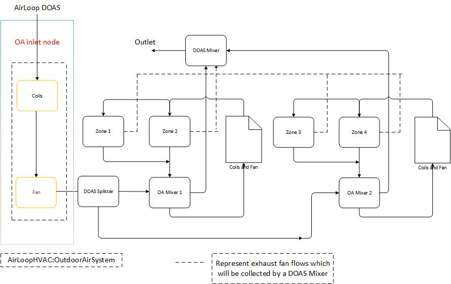

# **Model DOAS Supplying Air to Inlets of Multiple AHUs**

## Lixing Gu
## Floirda Solar Energy Center

### Third revision 4/10/19

Revise NFP and Design Document based on discussion in a conference call on 4/10/19  

### Second revision 4/5/19

Revise NFP based on communications from Edwin and Tianzhen and Add Design Document  

### First revision 3/29/19

Revised based on E-mail communications and a conference call on 3/27/19.
 
### First draft: 3/11/19

### **Justification for Feature Update:**

This new feature will allow EnergyPlus to model an outside air system supplying ventilation air to multiple air handlers.

Currently a DOAS (dedicated outdoor air system) in EnergyPlus is a normal AirLoopHVAC (aka air loop)  object with the recirculated air flow set to zero. In EnergyPlus the air loops are independent of each other: one air loop can not provide air to another. Outside air is provided to each air system by the AirLoopHVAC:OutdoorAirSystem object. Each outdoor air system can supply only one air loop. All this means that EnergyPlus can't simulate a common HVAC layout: a single multi-floor DOAS serving, through an air shaft, multiple single floor air handling units.

FSEC will implement the new feature based on request shown below:

#### Modal DOAS to Multiple Air Handling Units

o	This feature develops the modeling and simulation approach for a dedicated outdoor air system (DOAS) connected to multiple air handling units (AHUs). Many buildings have a separate DOAS system that feeds outdoor air directly to individual AHUs on each building floor. Currently EnergyPlus can only model a DOAS delivering outdoor air directly to zones or to the inlet or outlet of zone equipment acting as terminal units. This feature will allow a single DOAS to supply air to the outdoor air inlet of multiple air systems.

o	Ability to attach one DOAS to multiple AirLoopHVAC objects would be helpful to model: DOAS connected to multiple rooftop units (or) multiple SZVAV/SZCV units

o	This feature will develop the modeling and simulation approach for a dedicated outdoor air system (DOAS) connected to multiple air handling units (AHUs). Many buildings have a separate DOAS system that feeds outdoor air directly to individual AHUs on each building floor. Currently EnergyPlus can only model a DOAS delivering outdoor air directly to zones or to the inlet or outlet of some zone equipment acting as terminal units. This feature will allow a single DOAS to supply air to the outdoor air inlet of multiple air systems.

### **Conference Call Conclusions**

####Rich provide comments on 3/18/19 from GitHun pull request

Zone equipment already allow DOAS connected to inlets. It would be better for GUIs if the same object was used to connect to air loop equipment. The object is AirTerminal:SingleDuct:Mixer/Splitter. There are existing functions that calculate the mixing and other functions used for component sizing. The functions are in SingleDuct.cc and at the bottom of ReportSizingManager. The existing functions in SingleDuct.cc could be used by all equipment models. Also, we already have AirloopHVAC that can act as DOAS and don't need another dedicated object.

####My reply on 3/19/19

@rraustad Thanks for your comment with quick feedback. The proposed new feature will have a central DOAS to serve multiple AirLoops. The name of AirTerminal:* may not be appropriated. I think any names with AirLoop are better. That is what is proposed. In addition, the proposed feature is a high level management to provide enough inputs to map required configurations. The detailed calculations will use existing functions. For example, any OA calculations will call existing OA controllers.

The proposed object is similar with the AirLoop object with two main differences. The first difference is that the proposed object requires two nodes: inlet and outlet only, while the AirLoopHVAC object requires two pairs of node based supply and demand sides. In addition, the proposed object requires more inputs, such as setpoint manager, AirLoopHVAC:DedicatedOutdoorAirSystem:Mixer, and AirLoopHVAC:DedicatedOutdoorAirSystem:Splitter.

The second difference is that AirLoopHVAC is used to serve multiple zones, while the proposed object is used to serve multiple AirLoops. Since difference purposes are specified, it should use different names to specify how to use these objects properly. In addition, we have issues with zone mass balance in an AirLoopHVAC. The proposed object deals with multiple AirLoops only and there is no potential mass balance issue. That is why I propose a new object name for a central DOAS system.

####E-mail communications between Jason and Lixing between 3/22/19 and 3/25/19

Jason:

Thanks for your feedback. I understand your concern that we should have flexibility to allow different zone configurations.

The proposed new feature has a central DOAS system to take a sum of outdoor air flow rates from served AirLoops as its own flow rate, and does not deal with zones directly. If an AirLoop allows this type configuration, it will accept as is, as long as an OA mixer has a balance flow between an OA inlet node and a relief node.

If the outdoor airflow rate is greater than the relief flow rate, as long the a sum of all incoming flow rates is equal to a sum of all outgoing flow rates, the central DOAS will use the sum of outdoor airflow rates for this loop.

Thanks.

Gu 

-----Original Message-----
From: Jason Glazer [mailto:jglazer@gard.com] 
Sent: Friday, March 22, 2019 10:13 AM
To: Lixing Gu <gu@fsec.ucf.edu>
Cc: Mike Witte <mjwitte@gard.com>
Subject: Re: [energyplusdevteam] Model DOAS Supplying Air to Inlets of Multiple AHUs

Gu

It is great that you are working on this important missing feature. A lot of people will use this feature.

I am no expert but did not see anything wrong with your proposed approach.

If I am understanding correctly, the list of zones that exhaust to the DOAS can be different than the list of zones that it supplies? That is important.

Jason

####E-mail communications between Brent and Lixing between 3/22/19 and 3/27/19

Brent:

Here are my replies under your responses.

Thanks.

Gu

From: Brent Griffith [mailto:Brent.Griffith@EnergyArchmage.com] 
Sent: Wednesday, March 27, 2019 10:26 AM
To: 'Lixing Gu' <gu@fsec.ucf.edu>
Cc: 'Lawrence Scheier' <lscheier@sei-associates.com>; 'Michael J Witte' <mjwitte@gard.com>; 'Richard Raustad' <rraustad@fsec.ucf.edu>; 'Edwin Lee' <leeed2001@gmail.com>; 'Spielbauer, Jim' <JSPIELBAUER@trane.com>; 'Chidambaram, Nagappan' <Nagappan.Chidambaram@trane.com>
Subject: RE: Sizing, etc. call Wed / Agenda item DOAS-to-Mult-AHU's

HI gu

I have added some responses below

From: Lixing Gu [mailto:gu@fsec.ucf.edu] 
Sent: Wednesday, March 27, 2019 10:12 AM
To: 'Brent Griffith' <Brent.Griffith@EnergyArchmage.com>
Cc: 'Lawrence Scheier' <lscheier@sei-associates.com>; 'Michael J Witte' <mjwitte@gard.com>; 'Richard Raustad' <rraustad@fsec.ucf.edu>; 'Edwin Lee' <leeed2001@gmail.com>; 'Spielbauer, Jim' <JSPIELBAUER@trane.com>; 'Chidambaram, Nagappan' <Nagappan.Chidambaram@trane.com>
Subject: RE: Sizing, etc. call Wed / Agenda item DOAS-to-Mult-AHU's

Brent:

Thanks for your comments. Here are my thoughts under your comments.

Gu
From: Brent Griffith [mailto:Brent.Griffith@EnergyArchmage.com] 
Sent: Wednesday, March 27, 2019 9:46 AM
To: 'Lixing Gu' <gu@fsec.ucf.edu>
Cc: 'Lawrence Scheier' <lscheier@sei-associates.com>; 'Michael J Witte' <mjwitte@gard.com>; 'Richard Raustad' <rraustad@fsec.ucf.edu>; 'Edwin Lee' <leeed2001@gmail.com>; 'Spielbauer, Jim' <JSPIELBAUER@trane.com>; 'Chidambaram, Nagappan' <Nagappan.Chidambaram@trane.com>
Subject: RE: Sizing, etc. call Wed / Agenda item DOAS-to-Mult-AHU's

Hi Gu, 

It will be great to have this feature!  Here are some comments from reviewing the proposal. 

AirLoopHVAC:DedicatedOutdoorAirSystem:Mixer  and AirLoopHVAC:DedicatedOutdoorAirSystem:Splitter could just name OutdoorAir:Mixer, or AirLoopHVAC, objects instead of nodes.  And the mixer object should be able to include a list of exhaust fans (or exhaust fan outlet nodes) not just relief from OutdoorAir:Mixer.

A: What I need is to have a list of AirLoops to be served, If the list is provided in the AirLoopHVAC:OutdoorAirSystem. The assumption is that each AirLoop has an OutdoorAir:Mixer only. The current structure does not restrict user to input multiple OA mixers. Is my understand correct?  In addition, in order to make connection between central DOAS (proposed new object) and served AirLoops, I need Mixer and Splitter to map required configurations. If I don’t have proposed Mixer and Splitter, how can I map these connections?

BG: OF course you need a list in new Mixer and Splitter objects, I am just saying instead of nodes, you could name the OutdoorAir:Mixer objects and then use GetMyOAInletNode()  and GetMyReliefOutletNode() functions from the OutdoorAir:Mixer.  It takes some burden off the user to get repeated node names to match.

Gu: Thanks for clarification. I will modify input fields of AirLoopHVAC:DedicatedOutdoorAirSystem:Mixer  and AirLoopHVAC:DedicatedOutdoorAirSystem:Splitter to list object names of OutdoorAir:Mixer. However, how do I define outlet of Mixer and inlet of Splitter?

AirLoopHVAC:DedicatedOutdoorAirSystem does not seem to add much to AirLoopHVAC:OutdoorAirSystem and its equipment list.  Fred's final old proposal was to add splitter and mixer references to the end of AirLoopHVAC:OutdoorAirSystem rather than create another new object.  There is a lot of code in MixedAir.cc and it needs to be reused as much as possible to be practical.  I am not sure adding another code module on top of MixedAir makes sense.

A: The proposed object of AirLoopHVAC:DedicatedOutdoorAirSystem has some input requirement AirLoopHVAC:OutdoorAirSystem does not have. For example, the proposed object requires inputs of inlet node and outlet node. If the relief node mass is less than the outdoor air inlet mass, I can add make up at the inlet node to make mass flow conservative.

BG: But the AirLoopHVAC:OutdoorAirSystem will have an AirLoopHVAC:OutdoorAirSystem:EquipmentList in there will be an OutdoorAir:Mixer.  The inlet and outlet nodes you mention can come from that OutdoorAir:Mixer.  Otherwise are the nodes names just repeated?

Gu: See my concern to define outlet of Mixer and inlet of Splitter. 

There is also the notion of individual AirLoopHVAC units economizing directly, not drawing excess OA all the way thru the DOAS.  For that it seems there needs to be an additional OA node added to OutdoorAir:Mixer and changes to support direct OA economizing. This doesn’t show on your line diagram. 

A: The above answer may cover a partial answer. My understanding is that the proposed new object collects all OA inlet node mass as its own mass flow rate. If a sum of relief node mass flow rate is less than the collected mass flow rate, I will add makeup mass flow at the inlet node. That is one of reason I proposed a new object as AirLoopHVAC:DedicatedOutdoorAirSystem. 

BG:  DOAS system is for ventilation.  Airside economizing is for energy efficiency when OA is cool enough and involves larger quantities of OA than are required for ventilation.  They don’t make DOAS system so huge as to provide sufficient air flow for economizing and the pressure drop would defeat.  So the idea is that the DOAS serving multiple AHUs is sometimes bypassed and direct economizing air is introduced into individual AHUs.  The DOAS system doesn’t provide all the air for economizing, so an additional path for OA to enter the individual AHUs is needed, hence an new node in the OutdoorAir:Mixer. 

Gu: I may ask you a simple question. Is there a flag to define an economizer works as economizing mode? If yes, should I assign the OA rate for this AirLoop as zero?

Brent

From: Lawrence Scheier [mailto:lscheier@sei-associates.com] 
Sent: Monday, March 25, 2019 11:40 AM
To: Brent Griffith <Brent.Griffith@EnergyArchmage.com>; 'Michael J Witte' <mjwitte@gard.com>; 'Richard Raustad' <rraustad@fsec.ucf.edu>; 'Edwin Lee' <leeed2001@gmail.com>; 'Spielbauer, Jim' <JSPIELBAUER@trane.com>; 'Chidambaram, Nagappan' <Nagappan.Chidambaram@trane.com>; 'Lixing Gu' <gu@fsec.ucf.edu>; 'Tianzhen Hong' <thong@lbl.gov>; 'Roth, Amir' <Amir.Roth@ee.doe.gov>; 'Jason Turner' <jason@emptycrate.com>; 'jason.degraw' <jason.degraw@gmail.com>; Lawrence Scheier <lscheier@sei-associates.com>
Subject: Sizing, etc. call Wed / Agenda item DOAS-to-Mult-AHU's

Team: just a heads up that one of the agenda items will be Gu's DOAS-to-MulipleAHU's NFP per his email below.

Lawrence Scheier
SEI Associates

On Monday, March 25, 2019, 9:23:03 AM MDT, Lixing Gu <gu@fsec.ucf.edu> wrote:

Larry:
 
As you may know, I will implement a new feature to Model DOAS Supplying Air to Inlets of Multiple AHUs. The NFP was uploaded in https://github.com/NREL/EnergyPlus/blob/Model-DOAS-to-Multiple-Air-Handling-Units/design/FY2019/NFP-DOAS_MultiAHUs.md. The approach I proposed is a slight modification Fred proposed before. My guess (not sure) is that the Fred’s proposal was discussed in the sizing meeting before. I also know you are interested in this topic. Is it possible to discuss the NFP in the sizing meeting as an agenda item this Wed.?
 
Thanks.
 
Gu

On Monday, March 25, 2019, 6:53:49 AM MDT, Lawrence Scheier <lscheier@sei-associates.com> wrote: 

Team: Just a reminder that we will have the "Sizing, etc." call this Wed at the usual time. 

To join the online meeting.
http://www.joingotomeeting.com/
Meeting ID: 777-359-649
or:
https://www3.gotomeeting.com/join/777359649
 
Use your microphone and speakers (VoIP) - a headset is recommended.
Or, call in using your telephone.
Dial +1 (786) 358-5413
Access Code: 777-359-649
Audio PIN: Shown after joining the meeting
Meeting ID: 777-359-649 

Enclosed is figure from Brent to clarify two point for his comments: add additional inputs for AirLoopHVAC:Mixer to catch unbalance flows from exhaust fans, and add an additional inlet node for OutdoorAir:Mixer to catch direct economizer operation.

####A conference call on 3/27/19

The conference call was held in a regular sizing meeting.

Attendees: Brent Griffith; Michael J Witte; Richard Raustad; Lixing Gu; Lawrence Scheier; Kristin Filed-Macumber

The conference call discussed the NFP by continuing E-mail communications between Brent and Gu. Here is a consensus:

##### Rename two proposed new objects

The new object names of AirLoopHVAC:DedicatedOutdoorAirSystem:Mixer and AirLoopHVAC:DedicatedOutdoorAirSystem:Splitter will be renamed as AirLoopHVAC:Mixer and AirLoopHVAC:Splitter. They are simpler and may be used for other purposes.

##### Remove proposed new fields in AirLoopHVAC:OutdoorAirSystem 

Additional new fields were proposed to revise AirLoopHVAC:OutdoorAirSystem: The number of AirLoops and a list of AirLoop Names to be served by AirLoopHVAC:DedicatedOutdoorAirSystem. These fields will be added in the AirLoopHVAC:DedicatedOutdoorAirSystem object, so that input mapping is much clear from a single object. There is no need to revise the AirLoopHVAC:OutdoorAirSystem object.  

##### Remove 3 fields in the proposed new object AirLoopHVAC:DedicatedOutdoorAirSystem

1 Remove a field of SetpoinManager:OutdoorAirPreTreat

Since AirLoopHVAC:OutdoorAirSystem allows to use setpoint managers to control each individual coil, there is no need to repeat the same process to pre-treat outdoor air. It is better to use existing capability.

2 Remove inlet node and outlet nodes

The AirLoopHVAC:OutdoorAirSystem inputs have its own inlet and outlet nodes, defined in the AirLoopHVAC:OutdoorAirSystem:EquipmentList object implicitly. These nodes can be found based on component object type and name. The inlet node in the first component will be assigned to the outlet node of AirLoopHVAC:Mixer. The outlet node in the last component will be assigned to the inlet node of AirLoopHVAC:Splitter.

Therefore, removing these inputs will reduce user's input effort.

#####Sizing

In order to calculate sizing correctly, the mass flow rate should be provided. The current structure may not have a clear pathway to find required mass flow rate. More effort will be needed to finalize the sizing mass flow rate. For the time being, the decision is to implement code first with hard sizes for each pre-treated OA coils, listed in the AirLoopHVAC:OutdoorAirSystem:EquipmentList object.

Note: It is proposed to use ventilation requirements as autosize. Economizer free operation may not need to turn on coils listed in AirLoopHVAC:OutdoorAirSystem.

##### Additional inlet node of OutdoorAir:Mixer for economizer operation

Although the current code (Function CalcOAController in MixedAir) calculates outdoor airflow rate from both ventilation requirement and economizer operation to provide free cooling (through Function CalcOAEconomizer in MixedAir), the OA rate is finalized in the same function with given logic, and is assigned to the same outdoor air inlet node in an OutdoorAir:Mixer. It will be better to add a new OA inlet node for economizer use only. Therefore, the OA flow from ventilation requirement will be assigned to existing outdoor air inlet node, and the OA flow from economizer operation will be assigned to the new additional OA node. The final OA rate will be maximum values from both OA flows.

Note: This effort is beyond the current scope. If time and budget allow, I will try to implement this new addition.       

####Additional thought

#####Option 1

1. Block an OutdoorAir:Mixer in the inputs of AirLoopHVAC:OutdoorAirSystem

An OutdoorAir:Mixer, available in the AirLoopHVAC:OutdoorAirSystem object, will not be used, since the OA flow rate is provided by AirLoops served by the AirLoopHVAC:DedicatedOutdoorAirSystem object. 

2. Add an additional OA inlet node in AirLoopHVAC:Mixer 

It is possible to have unbalanced flow rate between OA inlet node and relief node for each OutdoorAir:Mixer. Therefore, the sum of flow rates from each OutdoorAir:Mixer OA inlet node may be different from the sum of flow rates from each OA mixer relief node. The additional OA inlet will provide makeup OA rate to ensure the mass is balanced in the AirLoopHVAC:DedicatedOutdoorAirSystem loop. This addition address one of Brent's concern: add additional inputs for AirLoopHVAC:Mixer to catch unbalance flows from exhaust fans    

#####Option 2

Removed.

Note: Option 2 is removed and the AirLoopDOAS loop will be kept for possible additional capability, which will be investigated during implementation of this new feature in order to allow a central relief or a central exhaust system for a central heat recovery. A careful mapping is needed. If a heat recovery is used in an AirLoop, the relief air can not be used twice. Therefore, the central relief will be carefully configured to catch all unused relief air. 

########## Need more addition

#### Github communications with Edwin on 4/1/19

This section provide communications between Edwin and Gu.
#####Edwin comments

I was reviewing this offline while flying, so my apologies that these notes are not more integrated with the changes themselves. I can refine if needed:

I like the current state of objects and connections
My biggest concern when tying together systems that are not currently "coupled" is the flow imbalance, and it looks like that has been rigored over by Rich and Brent, and the design looks satisfactory
"Hope no iteration is needed" seems optimistic - it would be nice to have some commentary about possible solutions if it starts to be problematic
AirLoopHVAC:Mixer and Splitter objects - extensible comment with (Change numbering, please) is not quite right - remember users cannot modify the IDD and have it make an impact now.

##### Gu's reply

@Myoldmopar Here are my answers to your concerns.

"Hope no iteration is needed" seems optimistic
As mentioned in the NFP, a possible call will be at the end of SolveAirLoopControllers in the SimAirServingZones module after AirLoopHVAC is looped to get OA flows from all OutdoorAir:Mixers. After OA is pre-treated from the proposed new feature, I expect to iterate 2 - 3 times among all served AirLoopHVAC and the proposed new feature until air properties of the inlet nodes from all OutdoorAir:Mixers are the same as ones after pre-treated air from the proposed new feature.
If successful, I will try to eliminate iteration to see what happens. If working, hope no iteration (this is what I mean). If not, use iteration approach already implemented in the beginning.

Extensible fields
I am not aware of no change of IDD. Thanks for letting me know this restriction in the beginning. Do we allow extensible fields? If Yes, could you let me know how to do it. If not, I will use 500 node name, similar configuration of AirLoopHVAC:ZoneMixer. Please advise.   

#### E-mail communications with Tianzhen on 4/2/19

Thanks for the further clarification.

Tianzhen

On Wed, Apr 3, 2019 at 10:29 AM Lixing Gu <gu@fsec.ucf.edu> wrote:
Tianzhen:
 
Thanks for quick feedback. Here are my answers.
 
3. DOAS OA flow rate 
The DOAS will provide the OA flow rate as a sum of all OA flow rates from served AirLoops, no matter what mode operation for each AirLoop, either economizer or ventilation requirements, in order to keep mass conservation. That is a consensus from a conference call on 3/27/19.
 
4. Supply air property reset.
 
The flow rate is determined by OA flow rates from served AirLoops as passive operation. The supply air properties, such as temperature and humidity, can be pre-treated by setpoint managers, such as schedule or constant, using existing functionality.
 
Hoe my answers address your concerns.
 
Thanks.
 
Gu 
 
 
From: Tianzhen Hong [mailto:thong@lbl.gov] 
Sent: Wednesday, April 03, 2019 11:51 AM
To: Lixing Gu <gu@fsec.ucf.edu>
Cc: Mike Witte <MJWitte@gard.com>; Xuan Luo <xuanluo@lbl.gov>
Subject: Re: [energyplusdevteam] Model DOAS Supplying Air to Inlets of Multiple AHUs
 
Lixing,
 
On 3 and 4, can you clarify further?
 
3. Would the DOAS provide the needed OA rate for all serving AHUs operating in the economizer mode (which can be up to 100% of supply air)? Or the DOAS only provides the ventilation rate needed by the serving AHUs and assuming they can get remaining OA rate from separate air duct? This relates to how the duct system is designed and air flow control.
 
4. I meant the supply air temperature and humidity from the DOAS. Are they constant or can be reset?
 
These questions are what I discussed with Fred a while back.
 
Thanks,
Tianzhen
 
 
On Wed, Apr 3, 2019 at 7:04 AM Lixing Gu <gu@fsec.ucf.edu> wrote:
Tianzhen:
 
Thanks for your comments. I know this new feature was due a long time ago. Thanks for giving us a chance to start. Here are my answers to your questions and comments.
 
1.       Central heat recovery
Yes. You are correct. The central heat recovery will not be accomplished unless we have central relief or central exhaust.  A careful mapping is required. For example, an AirLoop has its own heat recovery. The amount of relief air can not be used in the central recovery. A central relief should catch all unused relief air. It seems the capability is beyond the current scope. I will think of it during new feature implementation and propose a realistic approach to accomplish it. 
2.       Central OA distribution
Mass conservation in the AirLoop DOAS has number 1 priority. I don’t expect this will happen. If this happens, I will write a warning message and distribute OA rate proportionally as you suggest. 
3.       Economizer
An economizer is allowed for each served AHU as existing capability. However, the coils used to pre-treat OA in the AirLoop DOAS will be sized for ventilation requirement only. The main purpose to use an economizer is to provide free cooling. At this point, the pre-treated OA is not needed.
4.       DOAS supply air provides its own flow rate
No. The current scope is to let the proposed AirLoop DOAS provide OA rate determined by all served AHUs. It will not have any distribution issues. If the AirLoop DOAS provides its own flow rate, it will required distribution fraction for each served AHU. This will be a good new feature for future.
 
Hope I address your questions and comments. Please let me know what you think.
 
Thanks.
 
Gu
 
From: Tianzhen Hong [mailto:thong@lbl.gov] 
Sent: Tuesday, April 02, 2019 4:31 PM
To: Lixing Gu <gu@fsec.ucf.edu>
Cc: Mike Witte <MJWitte@gard.com>; Xuan Luo <xuanluo@lbl.gov>
Subject: Re: [energyplusdevteam] Model DOAS Supplying Air to Inlets of Multiple AHUs
 
Lixing,
 
This will be an exciting feature (Fred has been hoping to get this done before his retirement :).
 
Couple questions/comments:
 
1. The proposed AirLoopHVAC:DedicatedOutdoorAirSystem would not allow heat recovery from exhaust/relief air of the serving multiple AHUs/Air loops as there is no central exhaust or relief air. Am I correct?
2. The air flow of the AirLoopHVAC:DedicatedOutdoorAirSystem is calculated as the sum of the OA flow rates needed by the serving multiple AHUs/Air loops, which can be a constant or varying with time. In an ideal control, the DOAS provides exactly the OA needed by those AHUs. What happens if DOAS provides more or less OA? Would each AHU get proportional OA from the DOAS?
3. What happens if some or all the serving AHUs have air economizers? Would the DOAS be sized to meet that requirement? Or this type of DOAS configuration rules out air economizer for the serving AHUs?
4. Would the DOAS supply air conditions (e.g., temperature) be constant/fixed or can be reset?
 
Best,
Tianzhen
 
On Mon, Mar 18, 2019 at 10:07 PM Tianzhen Hong <thong@lbl.gov> wrote:
Lixing,
 
Great to know you are doing this. I will review and provide feedback.
 
Tianzhen
 
On Mon, Mar 18, 2019 at 8:38 AM Lixing Gu <gu@fsec.ucf.edu> wrote:
Team:

An NFP to Model DOAS Supplying Air to Inlets of Multiple AHUs.

https://github.com/NREL/EnergyPlus/blob/Model-DOAS-to-Multiple-Air-Handling-Units/design/FY2019/NFP-DOAS_MultiAHUs.md.

Comments are welcome via e-mail or github.  Please let me know if you wish to be a reviewer for this task.

Thanks.

Gu

####A conference call on 4/10/19

Attendees: Brent Griffith; Michael J Witte; Richard Raustad; Lixing Gu; Lawrence Scheier; Edwin Lee; Kristin Filed-Macumber; Jim Spielbauer; Napappan Chidambaram; Jason DeGraw

The second revision of NFP and Design Document were discussed in a regular sizing meeting on 4/10/19. Here are issues discussed and addressed.

#####Extensible fields

The current structure does not allow users to change IDD directly. However, it is possible to make fields extensible. The fixed number will be used first. I will get help to implement extensible fields later.

#####Sizing 

A new sizing function will be created to handle all sizing requirements.

#####Airflow mismatch between supply fan listed in AIrLoopDOAS and OA required flow rate from all OA mixers 

If a supply fan flow rate defined in the AirLoopHVAC:DedicatedOutdoorAirSystem object is below (or not equal to) the OA flow rate requested from a sum of OA mixers, a possible mismatch occurs. Two possible actions may be taken: 1) Stop simulation with a fatal error; and 2) Increase the fan flow rate to match OA requirements and provide a warning message, so that simulation can continue. 

#####Remove an argument in SimAirLoopHAVCDOAS

An argument of AirLoopHAVCDOASNum will be removed, in order to make function arguments consistent with other modules.

#####AirLoopHVAC:Mixer Configuration

AirLoopHVAC:Mixer will collect not only all air flows of OA Mixer relief nodes from served AirLoops, but also air flows of all zone exhaust fans served by each AirLoop defined in the AirLoopHVAC:DedicatedOutdoorAirSystem object. The outlet node will not be connected to the inlet node in the AirLoopHVAC:DedicatedOutdoorAirSystem object. Instead, the outlet node is either connected to outdoor air to relief or connected to a heat exchanger listed in the AirLoopHVAC:OutdoorAirSystem object as a component to pre-treat outdoor air. 
  
### **Overview**

We propose 3 new objects to accomplish the goal. 

####New objects

The proposed new objects are AirLoopHVAC:DedicatedOutdoorAirSystem, AirLoopHVAC:Mixer, and AirLoopHVAC:Splitter.

#####AirLoopHVAC:DedicatedOutdoorAirSystem

The first new object is AirLoopHVAC:DedicatedOutdoorAirSystem. It will take a sum of outdoor air from multiple AirLoopHAVC outdoor units as mass flow rate, pre-treat it through cooling and heating coils, and deliver pre-treated air to outdoor air inlets of each OutdoorAir:Mixer, served by the object. The object has following components:

	Object Name	
	Modified AirLoopHVAC:OutdoorAirSystem Object Name
	AvalaibilityManager name
	AirLoopHVAC:DedicatedOutdoorAirSystem:Mixer name
	AirLoopHVAC:DedicatedOutdoorAirSystem:Splitter Name
	Number of AirLoopHVAC served by AirLoopHVAC:DedicatedOutdoorAirSystem
	AirLoopHVAC 1 name
	AirLoopHVAC 2 name
	....

The structure of the new object does not require inputs of nodes, because the object inlet and outlet nodes can be found at an associated AirLoopHVAC:OutdoorAirSystem:EquipmentList. The object has input configuration to map served AirLoops.  

#####AirLoopHVAC:Mixer

The object has a single outlet node and multiple inlet nodes. The outlet node is a stand-alone node and will not be connected to the inlet node in the AirLoopHVAC:DedicatedOutdoorAirSystem object. Instead, the outlet node is either connected to outdoor air to relief or connected to a heat exchanger listed in the AirLoopHVAC:OutdoorAirSystem object. The multiple inlet nodes are the relief nodes from Multiple AirLoopHAVC OutdoorAir:Mixer. In addition, the Mixer will collect exhaust airflows in all zoned served by AirLoops defined in the AirLoopHVAC:DedicatedOutdoorAirSystem object internally. The air properties at the outlet node will be calculated based on air properties of all inlet nodes weighted by incoming flow rates.  

#####AirLoopHVAC:Splitter

The object has a single inlet node and multiple outlet nodes. The inlet node is the outlet node of the last component of the AirLoopHVAC:DedicatedOutdoorAirSystem object. The multiple outlet nodes are the OA inlet nodes from Multiple AirLoopHAVC OutdoorAir:Mixer.

####Possible calculation procedure

Here is a possible calculation procedure:

1. Loop AirLoopHVAC to calculate mass flow rate at each OutdoorAir:Mixers served by AirLoopHVAC:DedicatedOutdoorAirSystem
2. Assign a sum of OA mass flow rate into AirLoopHVAC:DedicatedOutdoorAirSystem as the object mass flow rate
3. Calculate outlet node conditions based on setpoint manager assigned to each individual coil required in the AirLoopHVAC:OutdoorAirSystem object to pre-treat outdoor air. 
4. Assign outlet node conditions into OA inlet conditions of each AirLoop OutdoorAir:Mixer via AirLoopHVAC:Splitter
5. Loop AirLoopHVAC again using air properties at each OA inlet node from Step 4
6. Check air property differences at the outlet node from AirLoopHVAC:DedicatedOutdoorAirSystem and OA inlet nodes of all AirLoop OutdoorAir:Mixer.
7. If converged, continue. Otherwise, go to Step 3.  

Note: Since the AirLoopHVAC:OutdoorAirSystem object is listed as a component of AirLoopHVAC:DedicatedOutdoorAirSystem, the object will allow an economizer to setup the mass flow rate, then distribute airflow into served OutdoorAir:Mixers, in addition to a sum of OA systems of multiple AirLoopHVAC. Due to the limited time and budget, this feature is not implemented and will be developed later. 

 

### **Approach**

A new module will be created as SimAirLoopDOAS to handle 3 new objects: AirLoopHVAC:DedicatedOutdoorAirSystem, AirLoopHVAC:Mixer, and AirLoopHVAC:Splitter. 

At the same time, other modules will be modified to make proposed new feature work successfully.

####SimAirLoopDOAS

It contains following common functions:

#####SimAirLoopDOAS

A driver for this module with external connection

#####GetInput

Read input file and assign inputs to variables and structs

#####Init

Initialize values without changes at the current iteration before calculation. At the same time, 

#####CalcAirLoopDOAS

Calculate outputs by calling SimOAComponent function in the MixedAir module.
   
#####Sizing

Calculate sizes based on outdoor air conditions and setpoint manager using existing equipment listed in validOASysEquipmentNames.

#####Other support functions

The other functions will be added to meet iteration requirements.

The code format will be similar with the UnitarySystem module or other module.

In addition, the AirLoopHVAC:OutdoorAirSystem will handle OA rate based on needs from AirLoopHVAC objects and may not have economizer functions for the time being.

####Other revisions

#####OutdoorAir:Mixer

The MixedAir module will be modified to allow OutdoorAir:Mixer OA inlet nodes to accept pre-treated air conditions distributed by AirLoopHVAC:Splitter.

####Calling

SimAirLoopDOAS will be looped at the end of SolveAirLoopControllers (preferred) or SimAirLoops in the SimAirServingZones module. A additional convergence check will be performed to ensure each OAcontroller gets proper OA flow rates and inlet conditions after calling SimAirLoopDOAS. Then, I will test if iteration is needed or not.

## Testing/Validation/Data Sources ##

A test file with multiple AirLoops and a single AirLoopHVAC:DedicatedOutdoorAirSystem will be created to ensure DOAS Supplying Air to Inlets of Multiple AHUs will work properly. 

## Input Output Reference Documentation ##

###New objects
AirLoopHVAC:DedicatedOutdoorAirSystem

AirLoopHVAC:Mixer

AirLoopHVAC:Splitter

###Revised object
OutdoorAir:Mixer

## Input Description ##

###New objects
AirLoopHVAC:DedicatedOutdoorAirSystem

	AirLoopHVAC:DedicatedOutdoorAirSystem,
       \min-fields 7
       \memo Defines a central forced air system to provide dedicated outdoor air to multiple
       \memo AirLoopHVACs.
   	A1, \field Name
       \required-field
       \type alpha
       \reference DOASAirLoops
   	A2, \field AirLoopHVAC:OutdoorAirSystem Name
       \note Enter the name of an AirLoopHVAC:OutdoorAirSystem object.
       \type object-list
       \object-list validBranchEquipmentNames
   	A3, \field Availability Manager List Name
       \note Enter the name of an AvailabilityManagerAssignmentList object.
       \type object-list
       \object-list SystemAvailabilityManagerLists
   	A4, \field AirLoopHVAC:Mixer Name
       \note Name of AirLoopHVAC:Mixer.
       \object-list AirLoopHVACMixerNames
       \required-field
   	A5; \field AirLoopHVAC:Splitter Name
       \note Name of AirLoopHVAC:Splitter.
       \object-list AirLoopHVACSplitterNames
       \required-field
	N1, \field Number of AirLoopHVAC
       \type integer
       \note Enter the number of the AirLoopHAVC served by AirLoopHVAC:DedicatedOutdoorAirSystem
   	A6, \field AirLoopHVAC 1 Name
      \note The rest of fields are extensible. It requires AirLoopHVAC names served by   
      \note an AirLoopHVAC:DedicatedOutdoorAirSystem.
      \begin-extensible
       \type AirLoopHVAC name
   	A7, \field AirLoopHVAC 2 Name
       \type AirLoopHVAC name
   	A8, \field AirLoopHVAC 3 Name
       \type AirLoopHVAC name
   	A9, \field AirLoopHVAC 4 Name
       \type AirLoopHVAC name
   	A10, \field AirLoopHVAC 5 Name
       \type AirLoopHVAC name
   	A11, \field AirLoopHVAC 6 Name
       \type AirLoopHVAC name
    ......

Note: If extensible is not available, the fixed number of 20 will be used to define the maximum number of AirLoopHVACs served by the proposed object.

AirLoopHVAC:Mixer

	AirLoopHVAC:Mixer,
       \extensible:1 Just duplicate last field and comments (changing numbering, please)
       \memo Mix N inlet air streams from Relief Air Stream Node in OutdoorAir:Mixer objects 
       \memo served by AirLoopHVAC objects listed in AirLoopHVAC:DedicatedOutdoorAirSystem into one 
       \memo (currently 10 as default, but extensible). Node names cannot
       \memo be duplicated within a single mixer list.
   	A1, \field Name
       \required-field
       \reference AirLoopHVACMixerNames
   	A2, \field Outlet Node Name
       \required-field
       \type node
  	A3, \field Inlet 1 Node Name
       \begin-extensible
       \required-field
       \type node
   	A4, \field Inlet 2 Node Name
       \type node
   	A5, \field Inlet 3 Node Name
       \type node
   	A6, \field Inlet 4 Node Name
       \type node
   	A7, \field Inlet 5 Node Name
       \type node
   	A8, \field Inlet 6 Node Name
       \type node
   	A9, \field Inlet 7 Node Name
       \type node
   	A10, \field Inlet 8 Node Name
        \type node
   	A11, \field Inlet 9 Node Name
        \type node
   	A12; \field Inlet 10 Node Name
        \type node

Note: If extensible is not available, the fixed number of 50 will be used to define the maximum number of inlet nodes.

AirLoopHVAC:Splitter

	AirLoopHVAC:Splitter,
       \extensible:1 Just duplicate last field and comments (changing numbering, please)
       \memo Split one air stream from AirLoopHVAC:DedicatedOutdoorAirSystem outlet node into N \memo outlet streams (currently 10 as default, but extensible).  Node names
       \memo should be Outdoor Air Stream Node Name in OutdoorAir:Mixer objects served by
       \memo AirLoopHVAC objects listed in AirLoopHVAC:DedicatedOutdoorAirSystem.
   	A1, \field Name
       \required-field
       \reference AirLoopHVACSplitterNames
   	A2, \field Inlet Node Name
       \required-field
       \type node
   	A3, \field Outlet 1 Node Name
       \begin-extensible
       \required-field
       \type node
   	A4, \field Outlet 2 Node Name
       \type node
   	A5, \field Outlet 3 Node Name
       \type node
   	A6, \field Outlet 4 Node Name
       \type node
   	A7, \field Outlet 5 Node Name
       \type node
   	A8, \field Outlet 6 Node Name
       \type node
   	A9, \field Outlet 7 Node Name
       \type node
   	A10, \field Outlet 8 Node Name
       \type node
   	A11, \field Outlet 9 Node Name
       \type node
   	A12, \field Outlet 10 Node Name
       \type node

Note: If extensible is not available, the fixed number of 200 will be used to define the maximum number of outlet nodes.

###Revised objects

	OutdoorAir:Mixer,
      \memo Outdoor air mixer. Node names cannot be duplicated within a single OutdoorAir:Mixer
      \memo object or across all outdoor air mixers.
  	A1, \field Name
      \required-field
      \type alpha
      \reference OutdoorAirMixers
      \reference-class-name validOASysEquipmentTypes
      \reference validOASysEquipmentNames
  	A2, \field Mixed Air Node Name
      \note Name of Mixed Air Node
      \required-field
      \type node
  	A3, \field Outdoor Air Stream Node Name
      \note Name of Outdoor Air Stream Node
      \required-field
      \type node
      \note If this object is served by AirLoopHVAC:DedicatedOutdoorAirSystem, the mass flow rate
      \note will remain as is. The node conditions will be revised as pre-treated air conditions.
  	A4, \field Relief Air Stream Node Name
      \note Name of Relief Air Stream Node
      \required-field
      \type node
  	A5; \field Return Air Stream Node Name
      \note Name of Return Air Stream Node
      \required-field
      \type node

## Outputs Description ##

insert text

## Engineering Reference ##

insert text

## Example File and Transition Changes ##

An example file will be created to have all proposed new objects.

Since there is no modification of existing objects, no transition is expected. 

## References ##

Reference: DesDoc_OASysToMultAirHandlers2.md by Fred.

## Design Document

The design document addresses a new module of AirLoopHAVCDOAS and changes of two modules mainly: MixedAir and SimAirServingZones.

###AirLoopHAVCDOAS

This new module has several functions and 3 main structs to cover 3 new proposed objects.

#### Constructor and Destructor

    public:
        AirLoopHAVCDOAS(); // constructor

        ~AirLoopHAVCDOAS() // destructor
        {
        }

    struct AirLoopDOAS
    {
    }

    struct AirLoopMixer
    {
    }

    struct AirLoopSplitter
    {
    }

####SimAirLoopHVACDOAS

A driver for this module with external connection. It contains following common functions for calls:

    void SimAirLoopHVACDOAS
			(std::string const &CompName,   // Name of the unitary engine driven heat pump system
                       bool const FirstHVACIteration, // TRUE if 1st HVAC simulation of system time step
                       int &CompIndex                 // Index to AirLoopHAVCDOAS
    )

#####GetAirLoopDOASInput

Read an input file and assign inputs of 3 new proposed objects to variables and structs.

        static void getAirLoopDOASInput();

#####InitAirLoopDOAS

Initialize values without changes at each time step before calculation. At the same time, this function will process some data only once, when some information is not available during input process by calling GetAirLoopDOASInput.   

        static void initAirLoopDOAS();

#####CalcAirLoopDOAS

Calculate outputs by calling SimOAComponent function in the MixedAir module.

    void CalcAirLoopDOAS(
         int const     AirLoopDOASNum,       // 
         bool const FirstHVACIteration, 
    );

#####UpdateAirLoopDOAS

    void UpdateAirLoopDOAS(
         int const     AirLoopDOASNum,       // 
    );

#####ReportAirLoopDOAS

    void ReportAirLoopDOAS(
         int const     AirLoopDOASNum,       // 
     );

#####Sizing

Calculate sizes based on outdoor air conditions and setpoint manager using existing equipment listed in validOASysEquipmentNames.

The outdoor air flow rates are available after calling OAControllerProps::SizeOAController. A possible way is to collect outdoor air flow rate after calling SizeOAController, so that sizing of each coil can be accomplished. The coil sizing calculation will be based on ventilation requirements, while fan sizing may be based on the maximum value of both economizer operation and ventilation requirements. The detailed logic will be determined during implementation.  

    static void SizingAirLoopDOAS(
         int const     AirLoopDOASNum,       // 
     );

#####Other possible functions will be determined during implementation

        static void initAirLoopMixers();
        static void initAirLoopSplitters();
        static void CalcAirLoopMixers();
        static void CalcAirLoopSplitters();

###SimAirServingZones

The SolveAirLoopControllers function will be revised by adding a loop after existing AirLoop loop:

Existing loop
        for (int AirLoopControlNum = 1; AirLoopControlNum <= PrimaryAirSystem(AirLoopNum).NumControllers; ++AirLoopControlNum) {
        }
The above loop calls SimAirLoopComponents(...->SimOAController in the MixedAir module) to get all required outdoor air flow rate. Here is a proposed loop following the existing loop:

        for (int AirLoopDOASNum = 1; AirLoopDOASNum <= NumberOfAirLoopDOAS; ++AirLoopDOASNum) {
           Assing air properties at outlet node, and to all OA nodes at each served AirLoop via an AirLoopHVAC:Splitter 
        } 

Then an additional AirLoop loop will be called to ensure the inlet OA air properties are the same as AirLoopDOAS outlet  

        for (int AirLoopControlNum = 1; AirLoopControlNum <= PrimaryAirSystem(AirLoopNum).NumControllers; ++AirLoopControlNum) {
			Check differences of air properties
        }
 If not converged, iteration will be needed to iterate both loops of AirLoop and AirLoopDOAS.

###MixedAir

Air properties of OA mixer inlet nodes are determined by System Nodes from a section code in the InitOAMixer (extracted):

        OAMixer(OAMixerNum).OATemp = Node(InletNode).Temp;
        OAMixer(OAMixerNum).OAHumRat = Node(InletNode).HumRat;
        OAMixer(OAMixerNum).OAEnthalpy = Node(InletNode).Enthalpy;
        OAMixer(OAMixerNum).OAPressure = Node(InletNode).Press;
        OAMixer(OAMixerNum).OAMassFlowRate = Node(InletNode).MassFlowRate;

If OA inlet node values are assigned by the AirLoopDOAS loop correctly, it may not need to revise MixedAir module. The modification will be determined during implementation. 

The AirLoopHVAC:OutdoorAirSystem object requires the OutdoorAir:Mixer object as the last OA component. Since the proposed feature will not need the OutdoorAir:Mixer, the restriction will be removed. In other words, the AirLoopHVAC:OutdoorAirSystem object will work without OutdoorAir:Mixer under this new feature only. 

# **Reference: DesDoc_OASysToMultAirHandlers2.md**

# **Dedicated OA System Serving Multiple Air Handlers**
## **Fred Buhl LBNL 1/20/2016**
### **Justification for Feature Update:**
This new feature will allow EnergyPlus to model an outside air system supplying ventilation air to multiple air handlers.

Currently a DOAS (dedicated outdoor air system) in EnergyPlus is a normal AirLoopHVAC (aka air loop)  object with the recirculated air flow set to zero. In EnergyPlus the air loops are independent of each other: one air loop can not provide air to another. Outside air is provided to each air system by the AirLoopHVAC:OutdoorAirSystem object. Each outdoor air system can supply only one air loop. All this means that EnergyPlus can't simulate a common HVAC layout: a single multi-floor DOAS serving, through an air shaft, multiple single floor air handling units.

### **Conference Call Conclusions**
#### **Jan 06, 2016**
*  Should the DOAS serving multiple air handlers be modeled on the AirLoopHVAC object or the AirLoopHVAC:OutdoorAirSystem? Consensus seemed to be on the AirLoopHVAC:OutdoorAirSystem. 
*  The DOAS will be supplying ventilation air. To allow economizer action, each  AirLoopHVAC:OutdoorAirSystem it connects to will need 2 outside air inlets. One for the DOAS connection and one for direct access to outside air for economizer action.
*  Should the DOAS have branches or just in/out nodes like OutdoorAirSystem? I favor directly replicating OutdoorAirSystem.
#### **June 25, 2016**
* Contacted Fred W. Porter at NORESCO. Here are his comments
 * The DOAS AHU mostly needs to control discharge air temps, preheat, dehumidify, possibly w/reheat, and these days utilize energy recovery. The OA flow to each AHU may vary based on DCV and AHU scheduling and so the OA through the DOAS needs to vary at the same time.  The exhaust to the DOAS will almost always include toilet exhaust and may include some relief air. EA back to the DOAS will usually be 20% less than the OA so this has a very significant effect on performance. These units are sometimes the same as the unit supplying OA to zonal fan coils, etc, or directly to a few zones, so the solution should really be a flexible extension of that DOAS representation I think. DOAS units for AHUs typically won’t try to achieve “neutral” DAT however, so usually won’t have reheat coils, wraparound heat pipes, or passive dehumidification wheels. (As soon as I say  typically or usually, I get some design with the exact opposite within a week.) They almost always deliver the air to  the “inlet,” i.e. the mixed air plenum of the recirc AHU.
* Larry Scheier confirmed that TRACE allows economizers on the AHU's in DOAS to AHU configurations. This means we will definitely need to add another outside air node (the economizer node) to the OutdoorAir:Mixer.  Brent Griffith suggested that we add it at the end of the input fields, allowing existing input files to work as is. 
* From Fred W. Porter's comments, it is clear that many DOA systems feed zones and zone equipment directly  as well as air handling units. Brent suggested handling this by defining a separate air loop (AirLoopHVAC plus zone demand side) to handle this. This seems like a good solution to me.

### **Overview**
#### Configurations

Given the feedback in the comments section, we will be attempting to simulate a dierct outside air system (DOAS), typically on the building's roof, serving multiple air handling units (AHUs), typically on separate floors. The DOAS can also serve some zones directly. Each AHU will be able to operate in economizer mode by using an additional outside air node for the economizer air (equivalent to an outside air damper that can fully close.

#### EnergyPlus description
We will use the existing EnergyPlus object AirLoopHVAC:OutdoorAirSystem to describe the DOAS serving multiple air handlers. Let's call this use of AirLoopHVAC:OutdoorAirSystem an Outdoor Air System to Multiple Air Handlers (OAStoMAH) vs Outdoor Air System in Single Air Loop (OASinSAL). Just as  AirLoopHVAC:OutdoorAirSystem can currently supply treated outdoor air to a single AirLoopHVAC the new use of  AirLoopHVAC:OutdoorAirSystem will supply treated outdoor air to multiple AirLoopHVAC's. This would correspond in the real world to a DOAS supplying multiple air handlers. In the EnergyPlus model each AirLoopHVAC will still need an AirLoopHVAC:OutdoorAirSystem. But additionally an AirLoopHVAC:OutdoorAirSystem can connect to each AirLoopHVAC through the outdoor air inlet of the OutdoorAir:Mixer contained in its AirLoopHVAC:OutdoorAirSystem.

Since the OAStoMAH will supply multiple AirLoopHVAC's, we need a splitter to divide its output among the AirLoopHVAC's. Similarly we will need to use a mixer to combine the relief air coming from the AirLoopHVAC's and send it to the OAStoMAH. We will borrow from AirLoopHVAC:ZoneSplitter and AirLoopHVAC:ZoneMixer but will define new objects AirLoopHVAC:OutdoorAirSystem:Mixer and AirLoopHVAC:OutdoorAirSystem:Splitter. As noted above, we will add an additional outside air node to Outdoor:AirMixer to allow for economizer action.

### **Approach**
The demand side (the AirLoopHVAC's) will set the ventilation air flow rate for the OAStoMAH. The OAStoMAH can't be simulated without knowing how much ventilation air the AirLoopHVAC's need. On the other hand the AirLoopHVAC's can't be simulated without knowing the temperature and humidity ratio of the ventilation air being supplied to them. This appears to be a situation that requires iteration between the OAStoMAH and the AirLoopHVAC's that it is supplying, with an accompanying impact on solution complexity and run time.

*For simple ventilation air calculations*, including basic demand control ventilation, it is possible to separate the ventilation air flow demand calculation from the AirLoopHVAC simulation. This calculation currently resides in the subroutine *CalcOAController* in the module *MixedAir*. The calculation takes place when the *AirLoopHVAC:OutdoorAirSystem* is simulated during the simulation of the air loop. We propose to separate this calculation out of CalcOAController and place it in a separate module. The plan is then to:

1. calculate the ventilation demand from all the zones served by the air loops that are served by each  OAStoMAH;
2. Simulate the OAStoMAH;
3. simulate the AirLoopHVAC's pretty much as is done currently;

Note that the calculation of the zone exhaust air flow rate will need to be "moved up" in the simulation sequence since the zone exhaust can set a hard lower limit on the ventilation air flow rate for an air loop. This provides an opportunity to move the zone exhaust air into the function *CalcAirFlowSimple* (invoked from *ManageHVAC* and elsewhere). The zone exhaust air flow could then be balanced against infiltration and simple ventilation air flow for all the zones in an air loop. If the zone exhaust exceeds the total of zone infiltration, simple zone ventilation, and air loop ventilation air flow induced infiltration could be apportioned to the zones in the air loop *before* the actual HVAC simulation takes place. This would eliminate the nagging problem of unbalanced zone exhaust flow. **Note:** *isn't this already being done or partially done?*

*For more complex ventilation demand calculations*, such as the system-based ventilation rate procedure, the ventilation demand depends on knowing the system supply air flow rate, which requires simulating the air loop and zone equipment. There are several ways to proceed:

1. use the last HVAC time step values in the ventilation rate procedure calculation;
2. use the last time step values for the air loop ventilation air inlet conditions, simulate the air loops, simulate the OutdoorAirSystemHVAC, then simulate the air loops again;
3. create some general iterative procedure.

Here we will start seeing some impact on run time. Our proposal is to use method 1 to start with

*In summary* there will need to be considerable rearranging of the current high-level HVAC simulation code, but with considerable benefit in increased capability and modest increase on run time or solution complexity. We hope to be able to reuse much of the code currently used for simulating AirLoopHVAC:OutdoorAirSystem's.

*Sizing:* we propose to use the existing *Sizing:System* object for  OAStoMAHs. The OAStoMAHs will be sized to the sum of its air loop design minimum ventilation air flow rates.
### **Implementation**
#### High Level Scheme
* Simulate AirLoopHVAC:OutdoorAirSystem:Mixer's. Call the data array OASysMixer. 
  1.  Loop over the AirLoopHVAC:OutdoorAirSystem:Mixer's
       * Loop over the inlet nodes (air loop OA mixer relief nodes). Combine the inlet flows, temperatures, humidity ratios etc. and put the results on the outlet node (an OAStoMAH return node.
* Loop over AirLoopHVAC:OutdoorAirSystem's. If it is a OAStoMAH, simulate it. If it is a OASinSAL, skip.
  1. Loop over PrimaryAirSystem's served by each OAStoMAH.
      * Call SimOAController().
  2. Sum the AirLoopFlow().MinOutAir flows and place on the inlet node of the OAStoMAH.
  3. Simulate the OAStoMAH. Place the outlet node results on the corresponding inlet node of the AirLoopHVAC:OutdoorAirSystem:Splitter or the outside air node of a DOAS air loop.
  4. Simulate the AirLoopHVAC:OutdoorAirSystem:Splitter.
       * Pass the conditions ( temperature, humidity ratio, etc.) on to the outlet nodes. Split the flow according to the AirLoopFlow().MinOutAir flows already calculated.

We're done! Now we move on to the existing calculation.

Except there are some issues.

1. As noted before, we're going to have to precalculate  exhaust air. The AirLoopHVAC:OutdoorAirSystem:Splitter will be able to accept air flow from exhaust fans. And SimOAController() needs to know the exhaust flow.
2. The current AirLoopHVAC:OutdoorAirSystem simulation doesn't simulate Controller:WaterCoil's. Instead it "moves them up" to to the encompassing air loop's controller list. It puts them first in the list so they are simulated first, so all is well. Obviously this won't work for OAStoMAH's, although we can retain it for OASinSAL's. We will need to call the Controller:WaterCoil iteration scheme in order to control the water coils. This adds some complexity to the use of AirLoopHVAC:OutdoorAirSystem's, but should not be too difficult.
#### Schematic Input

    OutdoorAirSysHVAC
      Name
      Controller List Name
      Equipment List Name
      Availability Manager List Name
      Splitter Name
      Mixer Name

    OutdoorAirSysHVAC:Mixer
      Name
      List of Air Loops

    OutdoorAirSysHVAC:Splitter
      List of Air Loops

*Question*: Do we need "List of Air Loops" twice? Aren't the the same? Then it could go at the end of OutdoorAirSysHVAC and we could automatically generate the splitter and mixer. This would mess up auto-drawing the configuration? Notice we are already auto-generating all node connections. Nodes would not occur as input in this scheme. They would be extracted from the components and the air loops. This means that every component that could occur in a DOAS would need a *GetMyOutletAirNode* function. Is this the route that we are going? Otherwise we will need some node name inputs. Note that AirLoopHVAC:ZoneSplitter etc. have node inputs. Should we just copy them for consistency? Connector:Splitter and Connector:Mixer use branches, which OutdoorAirSysHVAC doesn't have.

*Answer* The lists in the Mixer and Splitter might not be the same. For instance, we might want to add exhaust fan flow to the mixer. Then it would be a list of air loops and exhaust fans. It was agreed that use of node names in the input should be deprecated.

*Question*: What about DOAS direct to zone? You've only mentioned air loops.

*Answer* These will zones need to be lumped into a "do nothing" air loop by the user. I suspect component Duct will come in handy.

#### Schematic Input: 2nd try
Instead of defining a new OutAirSysHVAC object, I've decided to reuse AirLoopHVAC:OutdoorAirSystem. We will add 2 optional fields on the end for the splitter and mixer. We will distinguish the 2 types (serving 1 air loop or serving multiple air loops) in a type field in the data structure. Our input will now look like:

    AirLoopHVAC:OutdoorAirSystem
      Name
      Controller List Name
      Equipment List Name
      Availability Manager List Name
      Splitter Name
      Mixer Name

    AirLoopHVAC:OutdoorAirSystem:Splitter
      Name
      List of Air Loops

    AirLoopHVAC:OutdoorAirSystem:Mixer
      Name
      List of Air loops and exhaust fan outlet nodes

### **Testing/Validation Source(s):**
Creating an example / test file for this new capability will be a major task in itself. We will most likely start with RefBldgMediumOfficeNew2004_Chicago. Once we have this file, we will use it to compare a "do nothing" OutdoorAirSystemHVAC with the case where there is no OutdoorAirSystemHVAC. We can also compare cases where the ventilation air conditioning is done within the air loop versus where it is done by an OutdoorAirSystemHVAC. 

### **IO Ref (draft)**

We propose a new object which will be similar to AirLoopHVAC:OutdoorAirSystem. Also new objects OutdoorAirSystemHVAC:Mixer and OutdoorAirSystemHVAC:Splitter.

#### **Proposed Repart Variable Names:**

#### **Proposed additions to meters:**

### **EngRef (draft)**
We aren't far enough along yet to do this. The *Air Loop* and *Air Loop Simulation* sections will need extensive revising.

### **Example file and Transition changes:**

### **Other documents:**

