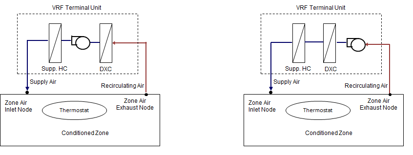

Add Supplemental Heating Coil to ZoneHVAC:TerminalUnit:VariableRefrigerantFlow
=================================================================

**Bereket Nigusse, FSEC**

 - 20 March 2019 - Original NFP
 - N/A - Revision

## Justification for New Feature ##

ZoneHVAC:TerminalUnit:VariableRefrigerantFlow currently does not support supplemental heating coils. Some VRF technologies support supplemental heating coils in their terminal units. Besides, it is provides flexibility for users to model a self contained VRF systems to meet heating demand instead of specifying standalone zone heating equipment.


## E-mail and  Conference Call Conclusions ##
N/A


## Overview and Approach ##

The arrangements shown in Figure 1 is supplemental heating coil placement for draw-though and blow-through supply fan placement configuration in VRF air terminal unit.



Below is sample ZoneHVAC:TerminalUnit:VariableRefrigerantFlow object in EnergyPlus. This object will be modified to support supplemental heating coil.

```
  ZoneHVAC:TerminalUnit:VariableRefrigerantFlow,
    TU 1,                    !- Zone Terminal Unit Name
    VRFAvailSched,           !- Terminal Unit Availability Schedule
    TU 1 Inlet Node,         !- Terminal Unit Air Inlet Node Name
    TU 1 Outlet Node,        !- Terminal Unit Air Outlet Node Name
    autosize,                !- Cooling Supply Air Flow Rate {m3/s}
    autosize,                !- No Cooling Supply Air Flow Rate {m3/s}
    autosize,                !- Heating Supply Air Flow Rate {m3/s}
    autosize,                !- No Heating Supply Air Flow Rate {m3/s}
    autosize,                !- Cooling Outdoor Air Flow Rate {m3/s}
    autosize,                !- Heating Outdoor Air Flow Rate {m3/s}
    autosize,                !- No Load Outdoor Air Flow Rate {m3/s}
    VRFFanSchedule,          !- Supply Air Fan Operating Mode Schedule Name
    drawthrough,             !- Supply Air Fan Placement
    Fan:ConstantVolume,      !- Supply Air Fan Object Type
    TU 1 VRF Supply Fan,     !- Supply Air Fan Object Name
    OutdoorAir:Mixer,        !- Outside Air Mixer Object Type
    TU 1 OA Mixer,           !- Outside Air Mixer Object Name
    COIL:Cooling:DX:VariableRefrigerantFlow,  !- Cooling Coil Object Type
    TU 1 VRF DX Cooling Coil,!- Cooling Coil Object Name
    COIL:Heating:DX:VariableRefrigerantFlow,  !- Heating Coil Object Type
    TU 1 VRF DX Heating Coil,!- Heating Coil Object Name
    30,                      !- Zone Terminal Unit On Parasitic Electric Energy Use {W}
    20,                      !- Zone Terminal Unit Off Parasitic Electric Energy Use {W}
    ,                        !- Rated Heating Capacity Sizing Ratio
    ,                        !- Availability Manager List Name
    ;                        !- Design Specification ZoneHVAC Sizing Object Name
```

Four new input fields: "Supplemental Heating Coil Object Type", "Supplemental Heating Coil Object Name", "Maximum Supply Air Temperature from Supplemental Heater", and "Maximum Outdoor Dry-Bulb Temperature for Supplemental Heater Operation" will be added to the existing VRF air terminal unit object. Electric, Gas, hot water, and steam heating coils will be supported.  These four new input fields will be optional and are:

```
  A17, \field Supplemental Heating Coil Object Type
       \type choice
       \key Coil:Heating:Fuel
       \key Coil:Heating:Electric
       \key Coil:Heating:Water
       \key Coil:Heating:Steam
       \note works with gas, electric, hot water and steam heating coil.
  A18, \field Supplemental Heating Coil Name
       \type object-list
       \object-list HeatingCoilName
       \note Needs to match in the supplemental heating coil object. 
  N11, \field Maximum Supply Air Temperature from Supplemental Heater
       \type real
       \units C
       \autosizable   
  N12; \field Maximum Outdoor Dry-Bulb Temperature for Supplemental Heater Operation
       \type real
       \maximum 21.0
       \default 21.0
       \units C
       \note Supplemental heater will not operate when outdoor temperature exceeds this value. 
```

When there is remaining heating load not met by the DX heating coil of a VRF Air Terminal Unit, then the supplemental heating coil will run to meet the remaining heating load. Below is a modified sample ZoneHVAC:TerminalUnit:VariableRefrigerantFlow object with the four optional new input fields added.

```
  ZoneHVAC:TerminalUnit:VariableRefrigerantFlow,
    TU 1,                    !- Zone Terminal Unit Name
    VRFAvailSched,           !- Terminal Unit Availability Schedule
    TU 1 Inlet Node,         !- Terminal Unit Air Inlet Node Name
    TU 1 Outlet Node,        !- Terminal Unit Air Outlet Node Name
    autosize,                !- Cooling Supply Air Flow Rate {m3/s}
    autosize,                !- No Cooling Supply Air Flow Rate {m3/s}
    autosize,                !- Heating Supply Air Flow Rate {m3/s}
    autosize,                !- No Heating Supply Air Flow Rate {m3/s}
    autosize,                !- Cooling Outdoor Air Flow Rate {m3/s}
    autosize,                !- Heating Outdoor Air Flow Rate {m3/s}
    autosize,                !- No Load Outdoor Air Flow Rate {m3/s}
    VRFFanSchedule,          !- Supply Air Fan Operating Mode Schedule Name
    drawthrough,             !- Supply Air Fan Placement
    Fan:ConstantVolume,      !- Supply Air Fan Object Type
    TU 1 VRF Supply Fan,     !- Supply Air Fan Object Name
    OutdoorAir:Mixer,        !- Outside Air Mixer Object Type
    TU 1 OA Mixer,           !- Outside Air Mixer Object Name
    COIL:Cooling:DX:VariableRefrigerantFlow,  !- Cooling Coil Object Type
    TU 1 VRF DX Cooling Coil,!- Cooling Coil Object Name
    COIL:Heating:DX:VariableRefrigerantFlow,  !- Heating Coil Object Type
    TU 1 VRF DX Heating Coil,!- Heating Coil Object Name
    Coil:Heating:Electric,   !- Supplemental Heating Coil Object Type
    TU 1 VRF Supp HeatCoil,  !- Supplemental Heating Coil Name
    30,                      !- Zone Terminal Unit On Parasitic Electric Energy Use {W}
    20,                      !- Zone Terminal Unit Off Parasitic Electric Energy Use {W}
    ,                        !- Rated Heating Capacity Sizing Ratio
    ,                        !- Availability Manager List Name
    ,                        !- Design Specification ZoneHVAC Sizing Object Name
    Coil:Heating:Electric,   !- Supplemental Heating Coil Object Type
    TU1 Supp Heating Coil,   !- Supplemental Heating Coil Name
    autosize,                !- Maximum Supply Air Temperature from Supplemental Heater
    ;                        !- Maximum Outdoor Dry-Bulb Temperature for Supplemental Heater Operation
```

## Testing/Validation/Data Sources ##

Create example files and review results.

## Input Output Reference Documentation ##

Zone terminal units with variable refrigerant flow DX coils are used exclusively with variable refrigerant flow (VRF) air conditioning systems (Ref. \hyperref[airconditionervariablerefrigerantflow]{AirConditioner:VariableRefrigerantFlow} objects). The zone terminal units are connected to a zone using the inlet and exhaust node names specified in a \hyperref[zonehvacequipmentconnections]{ZoneHVAC:EquipmentConnections} object. The zone exhaust node has the same name as the terminal unit air inlet node. The zone inlet node has the same name as the terminal unit air outlet node. The zone terminal unit is also listed in a zone's equipment list and will typically be the first equipment operating for both cooling and heating (i.e., Sequence = 1 in the \hyperref[zonehvacequipmentlist]{ZoneHVAC:EquipmentList}). Other ZoneHVAC equipment may be used in the same zone and should be sequenced to operate after the zone terminal units (i.e., sequence = 2 or higher)

The terminal units operate to satisfy a heating or cooling load in a zone based on a zone thermostat temperature set point. A direct-expansion (DX) cooling and/or DX heating coil is specified depending on the operating mode required. Both a DX cooling and DX heating coil will typically be installed in the terminal unit, however only one may be used if desired. An optional supplemental heating coil can be used to meet remaining heating load when the main DX heating coil cannot meet the entire heating load of a zone during cold outdoor conditions. Outdoor ventilation air is modeled with the use of an optional outside air mixer object. Outside air may be provided to the zone only when the coil is operating or can be supplied continuously even when the coil is not operating.

A supply air fan is also required and can be modeled as either draw through or blow through. The Supply Air Fan Object Type must be \hyperref[fansystemmodel]{Fan:SystemModel}, \hyperref[fanonoff]{Fan:OnOff}, or \hyperref[fanconstantvolume]{Fan:ConstantVolume} if \hyperref[airconditionervariablerefrigerantflow]{AirConditioner:VariableRefrigerantFlow} is used to model the VRF outdoor unit. The Supply Air Fan Object Type must be \hyperref[fansystemmodel]{Fan:SystemModel} or \hyperref[fanvariablevolume]{Fan:VariableVolume} if AirConditioner:VariableRefrigerantFlow:\-FluidTemperatureControl or AirConditioner:VariableRefrigerantFlow:\-FluidTemperatureControl:HR is used to model the VRF outdoor unit.

```
ZoneHVAC:TerminalUnit:VariableRefrigerantFlow,
        \memo Zone terminal unit with variable refrigerant flow (VRF) DX cooling and heating coils
        \memo (air-to-air heat pump). The VRF terminal units are served by an
        \memo AirConditioner:VariableRefrigerantFlow or 
        \memo AirConditioner:VariableRefrigerantFlow:FluidTemperatureControl:* system.
        \min-fields 19
  A1 ,  \field Zone Terminal Unit Name
        \required-field
        \type alpha
        \reference ZoneTerminalUnitNames
        \reference DOAToZonalUnit
        \reference ZoneEquipmentNames
  A2 ,  \field Terminal Unit Availability Schedule
        \type object-list
        \object-list ScheduleNames
        \note The unit is available the entire simulation if this field is left blank
        \note Schedule values of 0 denote the unit is off.
  A3 ,  \field Terminal Unit Air Inlet Node Name
        \required-field
        \type node
        \note the inlet node to the terminal unit
  A4 ,  \field Terminal Unit Air Outlet Node Name
        \required-field
        \type node
        \note the outlet node of the terminal unit
  N1 ,  \field Cooling Supply Air Flow Rate
        \type real
        \units m3/s
        \minimum> 0.0
        \autosizable
  N2 ,  \field No Cooling Supply Air Flow Rate
        \type real
        \units m3/s
        \minimum 0.0
        \autosizable
  N3 ,  \field Heating Supply Air Flow Rate
        \type real
        \units m3/s
        \minimum> 0.0
        \autosizable
  N4 ,  \field No Heating Supply Air Flow Rate
        \type real
        \units m3/s
        \minimum 0.0
        \autosizable
  N5 ,  \field Cooling Outdoor Air Flow Rate
        \type real
        \units m3/s
        \minimum 0.0
        \autosizable
        \note This field is set to zero flow when the VRF terminal unit is connected to
        \note central dedicated outdoor air through air terminal single duct mixer object.
  N6 ,  \field Heating Outdoor Air Flow Rate
        \type real
        \units m3/s
        \minimum 0.0
        \autosizable
        \note This field is set to zero flow when the VRF terminal unit is connected to
        \note central dedicated outdoor air through air terminal single duct mixer object.
  N7 ,  \field No Load Outdoor Air Flow Rate
        \type real
        \units m3/s
        \minimum 0.0
        \autosizable
        \note This field is set to zero flow when the VRF terminal unit is connected to
        \note central dedicated outdoor air through air terminal single duct mixer object.
  A5 ,  \field Supply Air Fan Operating Mode Schedule Name
        \required-field
        \type object-list
        \object-list ScheduleNames
  A6 ,  \field Supply Air Fan Placement
        \type choice
        \key BlowThrough
        \key DrawThrough
        \default BlowThrough
        \note Select fan placement as either blow through or draw through.
  A7 ,  \field Supply Air Fan Object Type
        \type choice
        \key Fan:SystemModel
        \key Fan:OnOff
        \key Fan:ConstantVolume
        \key Fan:VariableVolume
        \note Supply Air Fan Object Type must be Fan:SystemModel, Fan:OnOff, or Fan:ConstantVolume
        \note if AirConditioner:VariableRefrigerantFlow is used to model VRF outdoor unit
        \note Supply Air Fan Object Type must be Fan:SystemModel or Fan:VariableVolume if
        \note AirConditioner:VariableRefrigerantFlow:FluidTemperatureControl or
        \note AirConditioner:VariableRefrigerantFlow:FluidTemperatureControl:HR
        \note is used to model VRF outdoor unit
        \default Fan:ConstantVolume
  A8 ,  \field Supply Air Fan Object Name
        \required-field
        \type object-list
        \object-list FansCVandOnOffandVAV
  A9 ,  \field Outside Air Mixer Object Type
        \type choice
        \key OutdoorAir:Mixer
        \note Currently only one type OutdoorAir:Mixer object is available.
        \note If this field is blank, and outside air mixer is not used.
        \note This field should be left blank if the VRF terminal unit is connected to
        \note central dedicated outdoor air through an AirTerminal:SingleDuct:Mixer object.
  A10,  \field Outside Air Mixer Object Name
        \type object-list
        \object-list OutdoorAirMixers
        \note If this field is blank, the OutdoorAir:Mixer is not used.
        \note This optional field specifies the name of the OutdoorAir:Mixer object.
        \note When used, this name needs to match name of the OutdoorAir:Mixer object.
        \note This field should be left blank if the VRF terminal unit is connected to
        \note central dedicated outdoor air through an AirTerminal:SingleDuct:Mixer object.
  A11,  \field Cooling Coil Object Type
        \type choice
        \key Coil:Cooling:DX:VariableRefrigerantFlow
        \key Coil:Cooling:DX:VariableRefrigerantFlow:FluidTemperatureControl
        \note Cooling Coil Type must be Coil:Cooling:DX:VariableRefrigerantFlow
        \note if AirConditioner:VariableRefrigerantFlow is used
        \note to model VRF outdoor unit
        \note Cooling Coil Type must be
        \note Coil:Cooling:DX:VariableRefrigerantFlow:FluidTemperatureControl
        \note if AirConditioner:VariableRefrigerantFlow:FluidTemperatureControl or
        \note if AirConditioner:VariableRefrigerantFlow:FluidTemperatureControl:HR
        \note is used to model VRF outdoor unit
        \note This field may be left blank if heating-only mode is used
  A12,  \field Cooling Coil Object Name
        \type object-list
        \object-list CoolingCoilsDXVarRefrigFlow
        \object-list CoolingCoilsDXVarRefrigFlowFluidTemperatureControl
        \note Cooling Coil Type must be Coil:Cooling:DX:VariableRefrigerantFlow
        \note This field may be left blank if heating-only mode is used
  A13,  \field Heating Coil Object Type
        \type choice
        \key Coil:Heating:DX:VariableRefrigerantFlow
        \key Coil:Heating:DX:VariableRefrigerantFlow:FluidTemperatureControl
        \note Heating Coil Type must be Coil:Heating:DX:VariableRefrigerantFlow
        \note if AirConditioner:VariableRefrigerantFlow is used
        \note to model VRF outdoor unit
        \note Heating Coil Type must be
        \note Coil:Heating:DX:VariableRefrigerantFlow:FluidTemperatureControl
        \note if AirConditioner:VariableRefrigerantFlow:FluidTemperatureControl or
        \note if AirConditioner:VariableRefrigerantFlow:FluidTemperatureControl:HR
        \note is used to model VRF outdoor unit
        \note This field may be left blank if cooling-only mode is used
  A14,  \field Heating Coil Object Name
        \type object-list
        \object-list HeatingCoilsDXVarRefrigFlow
        \object-list HeatingCoilsDXVarRefrigFlowFluidTemperatureControl
        \note Heating Coil Type must be Coil:Heating:DX:VariableRefrigerantFlow
        \note This field may be left blank if cooling-only mode is used
  N8 ,  \field Zone Terminal Unit On Parasitic Electric Energy Use
        \type real
        \units W
        \minimum 0
        \default 0
  N9 ,  \field Zone Terminal Unit Off Parasitic Electric Energy Use
        \type real
        \units W
        \minimum 0
        \default 0
  N10, \field Rated Heating Capacity Sizing Ratio
       \type real
       \units W/W
       \minimum 1.0
       \default 1.0
       \note If this terminal unit's heating coil is autosized, the heating capacity is sized
       \note to be equal to the cooling capacity multiplied by this sizing ratio.
       \note This input applies to the terminal unit heating coil and overrides the sizing
       \note ratio entered in the AirConditioner:VariableRefrigerantFlow object.
  A15, \field Availability Manager List Name
       \note Enter the name of an AvailabilityManagerAssignmentList object.
       \type object-list
       \object-list SystemAvailabilityManagerLists
  A16, \field Design Specification ZoneHVAC Sizing Object Name
       \note Enter the name of a DesignSpecificationZoneHVACSizing object.
       \type object-list
       \object-list DesignSpecificationZoneHVACSizingName
  A17, \field Supplemental Heating Coil Object Type
       \type choice
       \key Coil:Heating:Fuel
       \key Coil:Heating:Electric
       \key Coil:Heating:Water
       \key Coil:Heating:Steam
       \note works with gas, electric, hot water and steam heating coil.
  A18, \field Supplemental Heating Coil Name
       \type object-list
       \object-list HeatingCoilName
       \note Needs to match in the supplemental heating coil object. 
  N11, \field Maximum Supply Air Temperature from Supplemental Heater
       \type real
       \units C
       \autosizable   
  N12; \field Maximum Outdoor Dry-Bulb Temperature for Supplemental Heater Operation
       \type real
       \maximum 21.0
       \default 21.0
       \units C
       \note Supplemental heater will not operate when outdoor temperature exceeds this value.
```

The DX heating coil outlet node name will be the supplemental heating coil air inlet node name if the Supply Air Fan Placement is blow-through. If the Supply Air Fan Placement is draw-through, then the supply fan outlet node name will be the supplemental coil air inlet node name. The supplemental heating coil air outlet node name must be the zone air inlet node name if either the VRF terminal unit is not placed on air terminal mixer object, or the VRF terminal unit is placed on the inlet-side an air terminal mixer. If the VRF terminal unit is placed on supply side of an air terminal mixer, then the supplemental heating coil air outlet node name must be inlet node of the air terminal mixer.


### New Input Fields

#### Field: Supplemental Heating Coil Object Type

This alpha field defines the type of supplemental heating coil to be used by this VRF terminal unit. The input requirements for these heating coil objects are described elsewhere in this document. The hot water and steam heating coils require specifying plant loop, branches, and connector objects to support the heating coils, and are placed on the demand side of the plantloop. The hot water flow modulation through the supplemental heating coil does not require additional controller or Controller:WaterCoil object. The parent object (VRF terminal unit) itself provides the “controller” function of modulating water flow. Allowable heating coil types are:

- Coil:Heating:Electric
- Coil:Heating:Fuel
- Coil:Heating:Water
- Coil:Heating:Steam

#### Field: Supplemental Heating Coil Name

This alpha field defines the name of the supplemental heating coil used by this VRF terminal unit, and this name should match the name specified in the corresponding heating coil object. 

#### Field: Maximum Supply Air Temperature from Supplemental Heater

This numeric field defines the maximum supply air temperature in degrees Celsius leaving the VRF terminal unit supplemental heater coil. The supplemental heater will be controlled so that its supply air temperature does not exceed this value. This field is autosizable.

#### Field: Maximum Outdoor Dry-Bulb Temperature for Supplemental Heater Operation

This numeric field defines the maximum outdoor dry-bulb temperature in degrees Celsius for this VRF terminal unit supplemental heater operation. The supplemental heater will not operate when the outdoor dry-bulb temperature is above this value. The maximum value must be less than or equal to 21°C. If this field is left blank, the default value is 21°C.


Add documentation source changes as needed.

## Engineering Reference ##

Add documentation source changes as needed.

## Example File and Transition Changes ##

Proposed example file:

 - Modify existing example file or create new example file if needed.

Transition rule is not required for `ZoneHVAC:TerminalUnit:VariableRefrigerantFlow` if the proposed four new input fields are added as optional input fields.


## References ##

- N/A.


