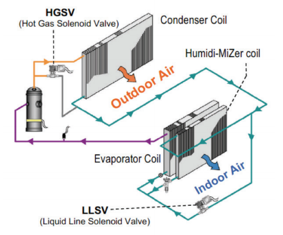

Condenser hot gas reheat model for DX Cooling Coil System
================

**Lixing Gu**

**Florida Solar Energy Center**

 - Nineth edition
 - Revised design document based on the comments from Mike 
 - Revision Date: 12/11/19
 - Eighth edition
 - Revised design document based on the conference call and discussion with Rich on 12/11/19 
 - Revision Date: 12/11/19
 - Seventh edition
 - Revised design document based on the conference call on 12/4/19 
 - Revision Date: 12/5/19
 - Sixth edition
 - Revised design document based on new coil model 
 - Revision Date: 12/2/19
 - Fifth edition
 - Add idd change and design document based on new coil model 
 - Revision Date: 11/27/19
 - Foruth Edition
 - Add design document
 - Revision Date: 10/29/19
 - Third Draft
 - Discussed in the sizing conference call. No more comments
 - Revision Date: 10/24/19
 - Second Draft
 - Add Conference call discussion and E-mail communications from Brent. Also add simulation logic for multispeed coils
 - Revision Date: 10/14/19
 - First Draft 
 - Original Date: 9/24/19
 

## Justification for New Feature ##

Many equipment manufacturers offer dehumidification reheat using condenser hot gas in rooftop, split direct expansion air handling units (DX AHU), and direct expansion dedicated outdoor air system (DX DOAS) products.

In applications where active humidity control is used to control either discharge air or space air relative humidity, dehumidification reheat is required to prevent sensible overcooling. Dehumidification by conventional means such as electric resistance or fossil fuel combustion heaters is costly and energy-inefficient. To confront this challenge manufacturers have developed schemes to take heat from the DX refrigeration system condenser and use it to provide what is "free" reheat. These schemes are typically referred to as "hot gas reheat". Beyond simply using hot gas for reheat, some manufacturers have devised controls to allow dehumidification and hot gas reheat at times of high sensible load, low sensible load, or no sensible load.

Currently EnergyPlus does not provide modeling capabilities for hot gas reheat. Addition of this feature to EnergyPlus would allow engineers to evaluate the energy-efficient humidity control options. An EnergyPlus model for this feature would need to model not just the use of hot gas for free reheat, but also controls for these  dehumidification modes. 

## E-mail and  Conference Call Conclusions ##

###Address comments from Mike on 12/13/19

Mike:

Thanks for your comments. I am going to incorporate your suggestions. For Comment1, I will select OperatingMode.

Gu

From: Michael J Witte <mjwitte@gard.com> 
Sent: Friday, December 13, 2019 11:04 AM
To: Lixing Gu <gu@fsec.ucf.edu>; 'Lawrence Scheier' <lscheier@sei-associates.com>; 'Brent Griffith' <brent.griffith@energyarchmage.com>; 'Richard Raustad' <rraustad@fsec.ucf.edu>; 'Edwin Lee' <leeed2001@gmail.com>; 'Spielbauer, Jim' <jspielbauer@trane.com>; 'Chidambaram, Nagappan' <nagappan.chidambaram@trane.com>; 'Tianzhen Hong' <thong@lbl.gov>; 'Roth, Amir' <amir.roth@ee.doe.gov>; 'Jason Turner' <jason@emptycrate.com>; 'jason.degraw' <jason.degraw@gmail.com>
Subject: Re: Sizing, etc. call this Wednesday

Gu,
A couple of comments.

2. ModeStage might get confuse with Multi-stage operation. Perhaps just Mode or OperatingMode or ModeNumber?

3. Excellent to use an argument instead of a (bad) global variable! But for LoadSHR, a default of 1.0 may be hard to distinguish from a valid SHR of 1.0. A default of zero may be better.

Mike

### Conference call on 12/11/19

Tianzhen rasied an issue to report waste heat receovery when the Reheat mode is used.

Answer:

I will add two new report variables to catch waster heat recovery in the struct CoilCoolingDX as 

    Real64 recoeredHeatEnergy = 0.0;
    Real64 recoeredHeatEnergyRate = 0.0;

The receovered waste heat energy is estimated in the equation below after discussion with Carrier:
 
recoeredHeatEnergy = (SensibleEnergy_NormalOperation - SensibleEnergy_ReheatMode) * ModeRatio

In addition, I will add two more output variables to catch operation mode and mode raio:

    Real64 ModeRatio = 0.0; // Mode ratio
    int ModeStage = 1; // 1 Normal; 2 Subcool; 3 Reheat

### Discussion with Rich on 12/11/19

We had discussion this morning regarding autosize of SHR.

Although different SHRs in different operation modes are expected, the same sizing code will be used to autosize the same SHR will be used, until we find a better algorithm to autosie SHR in different operation modes.

In addition, an optional aurgument will be added as LoadSHR  

    CoilCoolingDX::simulate(int useAlternateMode, Real64 PLR, int speedNum, Real64 speedRatio, int fanOpMode, Real64 LoadSHR = 1.0);

The loadSHR is provided from the parent object, such as unitary system, because the coil model does not know the required loadSHR, whihc is used to determine the coil operation mode.

	LoadSHR = ZoneLoad / (ZoneLoad + MoistureLoad * hg) 

When LoadSHR is passed to CoilCoolingDX, the coil model can perform ModeStage determination and ModeRatio calculcation internally, so that external call will be perfromaed as a single function call. In addition, a global variable will not be used instead.

###Conference Call on 12/4/19

People attended:

Lawrence Scheier; Michael Witte; Ricahrd Raustad; Edwind Lee; Nagappan Chidambaram; Jason DeGraw; Brent Griffith

Mike suggested to remove an additional argument as ModeRatio. The Moderatio may be calculated inside the module, similar process as SpeedRatio.

ModeRatio will be used inside the new coil module and will not be used as an argument.

###Conference Call on 10/23/19

People attended:

Lawrence Scheier; Michael Witte; Ricahrd Raustad; Edwind Lee; Jim Spielbauer; Nagappan Chidambaram; Tiejun Wu, Jason DeGraw

No more comments

###Conference Call on 10/09/19

People attended:

Lawrence Scheier; Michael Witte; Ricahrd Raustad; Edwind Lee; Jim Spielbauer; Nagappan Chidambaram; Tiejun Wu

The proposed simulation logic covers a single speed coil only. The logic should also cover multispeed coils.

The existing coil object may be revised to accomodate 3 operation modes by adding new fields or modifying existing fields, when the new coil object is available. 

###E-mail communication between Brent and me

####My response

Brent:

Thanks for your comments. Here are my answers to your questions.

1.	Coil:Heating:Desuperheater

Luis raised the same question in August. Tiejun made a reply, available in https://github.com/NREL/EnergyPlus/issues/7421. Since the reply has figures, it is better for you to take a look over there, if you have not read it.

The NFP was written later. I assume the reply justified new object needs already, so that I did not want to repeat it again in the NFP.

2.	New generation DX coil model

As discussed in the conference call, the new model will be built on the new generation DX coil model. The coil object may be revised later.

3.	Next generation humidity control

I agree. We may need to add fields in the existing object of ZoneHVAC:EquipmentList with priority and fraction. I think this issue is beyond the new feature and we can discuss it for future development.

4.	Was there any discussion of water coil controller
No discussion of water coil controller.

Thanks.

Gu

####Brent's comments

From: Brent Griffith <Brent.Griffith@EnergyArchmage.com> 
Sent: Monday, October 14, 2019 11:33 AM
To: 'Lixing Gu' <gu@fsec.ucf.edu>; 'Lawrence Scheier' <lscheier@sei-associates.com>; 'Michael J Witte' <mjwitte@gard.com>; 'Richard Raustad' <rraustad@fsec.ucf.edu>; 'Edwin Lee' <leeed2001@gmail.com>; 'Spielbauer, Jim' <JSPIELBAUER@trane.com>; 'Chidambaram, Nagappan' <Nagappan.Chidambaram@trane.com>
Subject: RE: Sizing, etc. call this Wednesday

Sorry I missed the call last week.

Gu, I was surprised the NFP makes no mention of the existing Coil:Heating:Desuperheater model and its approach.  I guess it is too simplified but I would think the NFP should discuss its shortcomings and why a new object is needed. 

What about the new generation DX coil model, shouldn’t this build off of that work?

As an aside, I think next generation humidity control systems will also need improved humidity setpoint managers based on zone moisture loads.  The current ones are accurate only when there is a one air system inlet node into the zone and 100% of the air entering the zone is from the central air handler.  For more complex zone configurations, such as PIU air terminals, combined Zone HVAC and DOAS, more than one air system, etc., the central air humidity setpoints are not being calculated correctly because the primary air flow rate is much lower than the total air system inlet flows into a zone. 

Was there any discussion of water coil controller?

Brent

## Overview ##

The goal of this new feature is to provide a DX cooling coil capability to meet all possible demand with different sensible and latent loads by using different mode opeation in a single cooling coil. In  other words, the coil itself can meet sensible and latent loads simultaneously wihtout any additional help.
 
Using a simple space thermostat and humidistat input, the Humidi-MiZer Adaptive Dehumidification system (shown in Figure 1) changes the refrigerant flow by adjusting the position of the refrigerant solenoid valves. There are three modes of operation: Normal, Sub-Cooling and Hot Gas ReHeat.

### Operation modes ###

Normal Mode (HGSV closed, LLSV open)

When there is a call for cooling only, the dehumidification system is inactive and the refrigerant circulates per a
typical packaged system.

Sub-Cooling Mode (HGSV closed, LLSV closed)

During part load conditions when the room temperature and humidity are above the setpoint, the unit will initiate
the sub-cooling mode of operation; a call for cooling and dehumidification. The end result is a conditioned space
that is cooled and significantly more dehumidified, but not over-cooled. This also helps eliminate short cycling
of the rooftop unit and improves space temperature and humidity control.

Hot Gas ReHeat Mode 
(HGSV open, LLSV closed)

When there is a call for dehumidification without a call for cooling, a portion of the hot gas from the compressor
bypasses the condenser coil and is fed into the liquid line. The air is cooled and dehumidified as it flows across the evaporator and is then reheated to neutral conditions by the Humidi-MiZer coil. When used on an Applied Rooftop
unit the Humidi-MiZer® System becomes modulating. 

**Figure 1 Schematic of dehumidimizer operation modes (Extracted from Carrier 2)**

### Operation Algorithm

We will create 3 sets of performance curves. The first set repesents normal operation mode, which is the same as existing DX cooling coil. The second set represents subcooling operation with LLSV fully closed. The third set represents hot gas reheat mode with HGSV full open.

#### Subcooling operation

When requested system load SHR is between normal operation SHR and subcooling operation SHR, the coil will operate a portion of the time at two modes to meet the request. The linear iterperation of opening ratio between two modes is applied, so that coil will act as an ideal coil to provide exactly requested sensible and latent outputs to ensure zone is controlled at given thermal and humidity setpoints. The opening ratio is equivalent to openess of liquid line solenoid valve.   

#### Reheat operation

When requested system load SHR is between normal operation SHR and reheat mode operation SHR, the coil will operation a portion of the time at two modes to meet the request. The linear iterperation of opening ratio between two modes is applied, so that coil will act as an ideal coil to provide exactly requested sensible and latent outputs to ensure zone is controlled at given thermal and humidity setpoints. The opening ratio is equivalent to  openess of hot gas solenoid valve.

## Approach ##

### A new coil object

Coil:Cooling:DX:AdaptiveDehumidifcation

The new object is close to Coil:Cooling:DX:TwoStageWithHumidityControlMode. It requires 3 sets of performance curves corresponding to 3 operation modes, respectively. Since Reheat Mode works in a narrow operation range, it has a field with maximum outdoor dry-bulb temperature to restrict the reheat mode operation. The minimum outdoor air dry-bulb temperature should be the thermal setpoint. Since this value is available, there is no need to be as input. 

This new object will be called by two parent objects: CoilSystem:Cooling:DX and AirLoopHVAC:UnitarySystem. 

### Pseudocode

The new object will require 3 performance curve sets to represent coil performance: normal operation, subcool operation and reheat mode.

Note: There are 3 objects of CoilPerformance:DX:Cooling to provide coil performance data, including performance curves. Here are proposed requirement for 3 objects.

1. Normal operation

This operation does not require special inputs. Operation SHR is calculated based on rated SHR and ADT method. There is no need to input SHR function names.

2. Subcooling operation at LLSV fully closed 

This operation requires inputs of SHR functions of temperature and flow fraction with Fields A9 and A10.

3. Reheat mode at HGSV fully open

This operation also requires inputs of SHR functions of temperature and flow fraction with Fields A9 and A10.

### Control logic

####Nomenclatures

SenLoad = System sensible load

LatLoad = System latent load

SenOut_{Normal} = System sensible output at normal operation at full capacity

LatOut_{Normal} = System latent output at normal operation at full capacity

SenOut_{Sub} = System sensible output at subcooling operation at full capacity with LLSV fully closed

LatOut_{Sub} = System latent output at subcooling operation at full capacity with LLSV fully closed

SenOut_{Reheat} = System sensible output at reheat operation at full capacity with HGSV fully open

LatOut_{Reheat} = System latent output at reheat operation at full capacity with HGSV fully open

SHR_{Load} = System load SHR as Sensible load / (Sensible load + Latent Load)

SHR_{Normal} = System output SHR at normal operation

SHR_{Sub} = System output SHR at subcooling operation with LLSV fully closed

SHR_{Reheat} = System ouput SHR at normal operation with HGSV fully closed

r_{Sub} = Subcooling ratio between subcooling and normal operation

r_{Reheat} = Reheat ratio between hot gas reheat and normal operation

Tdb_{max} = Maximum Outdoor Dry-Bulb Temperature for Reheat Mode Operation

####Simulation logic

1.	No latent control

Perform normal operation with SHR_{Normal}

2.	Latent control

Calculate coil load SHR_{load} = Sensible load / (Sensible load + Latent load)

	a.	If SHR_{Load} >= SHR_{Normal}

	Perform normal operation to meet sensible load, adjusted by PLR for a single capacity equipment or at Speed 1 for a multispeed coil

	SenLoad = SenOut * PLR

    If SenOut < SenLoad, go to existing multispeed coil operation

	b.	Else if (SHR_{Normal} > SHR_{Load} >= SHR_{Sub})

	Perform combination between normal and subcooling operation

	SHR_{Load} = SHR_{Sub} * r_{Sub} + SHR_{Normal} * (1 - r_{Sub})

	SenLoad = [SenOut_{Sub} * r_{Sub} + SenOut_{Normal} * (1 - r_{Sub})] * PLR

    If SenLoad > [SenOut_{Sub} * r_{Sub} + SenOut_{Normal} * (1 - r_{Sub})], go to "Multispeed subcooling operation"

	c.	Else // Case SHR_{Load} < SHR_{Sub}

	if (TdbOut <= Tdb_max) Then

		Perform combination between normal and reheat operation

		SHR_{Load} = SHR_{Reheat} * r_{Reheat} + SHR_{Normal} * (1 - r_{Reheat})

		SenLoad = [SenOut_{Reheat} * r_{Reheat} + SenOut_{Normal} * (1 - r_{Reheat})] * PLR

	Else
		Perform subcooling operation

		SenLoad = SenOut_{Sub} * PLR
   
        If SenLoad > SenOut_{Sub}, go to "Multispeed reheat operation"

	End IF

#####Multispeed subcooling operation

The same SHR_{Load} will be applied to both speeds first. Then combined capacities between subcooling and normal operation will be calculated to ensure sensible load is met.

Set SHR_{load} for two consecutive speeds: i and i+1

	SHR_{Load} = SHR_{Sub_i} * r_{Sub_i} + SHR_{Normal_i} * (1 - r_{Sub_i})

	SHR_{Load} = SHR_{Sub_{i+1}} * r_{Sub_{i+1}} + SHR_{Normal_{i+1}} * (1 - r_{Sub_{i+1}})

Set Combined sensible capacity for two consecutive speeds: i and i+1

	SenOut_{CombSub_i} = [SenOut_{Sub_i} * r_{Sub_i} + SenOut_{Normal_i} * (1 - r_{Sub_i})]

	SenOut_{CombSub_{i+1}} = [SenOut_{Sub_{i+1}} * r_{Sub_{i+1}} + SenOut_{Normal_{i+1}} * (1 - r_{Sub_{i+1}})]

Perform calculation

if SenOut_{CombSub_i} < SenLoad <= SenOut_{CombSub_{i+1}} Then

	SenLoad = SenOut_{CombSub_{i+1}} * SpeedRatio_{i+1} + SenOut_{CombSub_i} * [ 1 - SpeedRatio_{i+1} ]

Else

	Go to next speed

End If

#####Multispeed reheat operation

The same SHR_{Load} will be applied to both speeds first. Then combined capacity between reheat mode and normal operationwill be calculated to ensure sensible load is met.

Set SHR_{load} for two consecutive speeds: i and i+1

	SHR_{Load} = SHR_{Reheat_i} * r_{Reheat_i} + SHR_{Normal_i} * (1 - r_{Reheat_i})

	SHR_{Load} = SHR_{Reheat_{i+1}} * r_{Reheat_{i+1}} + SHR_{Normal_{i+1}} * (1 - r_{Reheat_{i+1}})

Set Combined sensible capacity for two consecutive speeds: i and i+1

	SenOut_{CombReheat_i} = [SenOut_{Reheat_i} * r_{Reheat_i} + SenOut_{Normal_i} * (1 - r_{Reheat_i})]

	SenOut_{CombReheat_{i+1}} = [SenOut_{Reheat_{i+1}} * r_{Reheat_{i+1}} + SenOut_{Normal_{i+1}} * (1 - r_{Reheat_{i+1}})]

Perform calculation

if SenOut_{CombReheat_i} < SenLoad <= SenOut_{CombReheat_{i+1}} Then

	SenLoad = SenOut_{CombReheat_{i+1}} * SpeedRatio_{i+1} + SenOut_{CombReheat_i} * [ 1 - SpeedRatio_{i+1} ]

Else

	Go to next speed

End If

### Implementation

We will revise 3 module for this new feature.

####DXCoils

Modify an existing function of GetCoilsInput

	Read new coil object

Creat a new function of CalcAdaptiveHumification

	Calcualte coil output based on system load and input conditions

####UnitarySystem

	Modify existing function to call DXCoils

####HVACDXSystems

	Modify existing function to call DXCoils

###Sizing

There are 3 fields with autosize choices in CoilPerformance:DX:Cooling

####Normal operation

Gross Rated Total Cooling Capacity: Use existing method

Gross Rated Sensible Heat Ratio: Use existing method

Rated Air Flow Rate: Use existing method
 
####Subcooling operation at LLSV fully closed 

Gross Rated Total Cooling Capacity: Use existing method

Gross Rated Sensible Heat Ratio: Select SHR from input curve objects with rated conditions

Rated Air Flow Rate: Use existing method

####Reheat mode at HGSV fully open

Gross Rated Total Cooling Capacity: Use existing method

Gross Rated Sensible Heat Ratio: Select SHR from input curve objects with rated conditions

Rated Air Flow Rate: Use existing method

## Testing/Validation/Data Sources ##

Unit test will be performed to ensure numerical values are calculated properly.

## Input Output Reference Documentation ##

Examples to use the nex coil object

CoilSystem:Cooling:DX,

  	CoilSystem:Cooling:DX,
    DOAS DX Cooling System,  !- Name
    ,                        !- Availability Schedule Name
    DOAS Supply Fan Outlet,  !- DX Cooling Coil System Inlet Node Name
    DOAS Cooling Coil Outlet,!- DX Cooling Coil System Outlet Node Name
    DOAS Cooling Coil Outlet,!- DX Cooling Coil System Sensor Node Name
    Coil:Cooling:DX:AdaptiveDehumidifcation,  !- Cooling Coil Object Type
    DOAS Cooling Coil,       !- Cooling Coil Name
    Multimode,               !- Dehumidification Control Type
    Yes,                     !- Run on Sensible Load
    Yes;                     !- Run on Latent Load

Coil:Cooling:DX:AdaptiveDehumidifcation,

  	Coil:Cooling:DX:AdaptiveDehumidifcation,
    DehumidiMizer Cooling Coil,       !- Name
    ,                        !- Availability Schedule Name
    DehumidiMizer Supply Fan Outlet,  !- Air Inlet Node Name
    DehumidiMizer Cooling Coil Outlet,!- Air Outlet Node Name
    ,                        !- Crankcase Heater Capacity {W}
    ,                        !- Maximum Outdoor Dry-Bulb Temperature for Crankcase Heater Operation {C}
    CoilPerformance:DX:Cooling,  !- Normal Operation Coil Performance Object Type
    DehumidiMizer Standard Perf,    !- Normal Operation Coil Performance Name
    CoilPerformance:DX:Cooling,  !- Subcooling Operation Coil Performance Object Type
    DehumidiMizer Subcooled Perf,  !- Subcooling Operation Coil Coil Performance Name
    CoilPerformance:DX:Cooling,  !- Reheat Mode Coil Performance Object Type
    DehumidiMizer Reheat Perf,     !- Reheat Mode Coil Performance Name
    28.0,  !- Maximum Outdoor Dry-Bulb Temperature for Reheat Mode Operation
    ,                        !- Supply Water Storage Tank Name
    ,                        !- Condensate Collection Water Storage Tank Name
    0;                       !- Minimum Outdoor Dry-Bulb Temperature for Compressor Operation {C}

 CoilPerformance:DX:Cooling,

  	CoilPerformance:DX:Cooling,
    DehumidiMizer Standard Perf,    !- Name
    autosize,                !- Gross Rated Total Cooling Capacity {W}
    autosize,                !- Gross Rated Sensible Heat Ratio
    3,                       !- Gross Rated Cooling COP {W/W}
    autosize,                !- Rated Air Flow Rate {m3/s}
    0.5,                     !- Fraction of Air Flow Bypassed Around Coil
    DehumidiMizer Std Cap-FT, !- Total Cooling Capacity Function of Temperature Curve Name
    DehumidiMizer Std Cap-FF,     !- Total Cooling Capacity Function of Flow Fraction Curve Name
    DehumidiMizer Std EIR-FT, !- Energy Input Ratio Function of Temperature Curve Name
    DehumidiMizer Std EIR-FF,     !- Energy Input Ratio Function of Flow Fraction Curve Name
    DehumidiMizer Std PLF,        !- Part Load Fraction Correlation Curve Name
    ,                        !- Nominal Time for Condensate Removal to Begin {s}
    ,                        !- Ratio of Initial Moisture Evaporation Rate and Steady State Latent Capacity {dimensionless}
    0;                       !- Maximum Cycling Rate {cycles/hr}

  	CoilPerformance:DX:Cooling,
    DehumidiMizer Subcooled Perf,    !- Name
    autosize,                !- Gross Rated Total Cooling Capacity {W}
    autosize,                !- Gross Rated Sensible Heat Ratio
    2.8,                       !- Gross Rated Cooling COP {W/W}
    autosize,                !- Rated Air Flow Rate {m3/s}
    0.5,                     !- Fraction of Air Flow Bypassed Around Coil
    DehumidiMizer Subcool Cap-FT, !- Total Cooling Capacity Function of Temperature Curve Name
    DehumidiMizer Subcool Cap-FF,     !- Total Cooling Capacity Function of Flow Fraction Curve Name
    DehumidiMizer Subcool EIR-FT, !- Energy Input Ratio Function of Temperature Curve Name
    DehumidiMizer Subcool EIR-FF,     !- Energy Input Ratio Function of Flow Fraction Curve Name
    DehumidiMizer Subcool PLF,        !- Part Load Fraction Correlation Curve Name
    ,                        !- Nominal Time for Condensate Removal to Begin {s}
    ,                        !- Ratio of Initial Moisture Evaporation Rate and Steady State Latent Capacity {dimensionless}
    0,                       !- Maximum Cycling Rate {cycles/hr}
    ,                        !- Latent Capacity Time Constant
    ,                        !- Condenser Air Inlet Node Name
    ,                        !- Evaporative Condenser Effectiveness
    ,                        !- Evaporative Condenser Air Flow Rate
    ,                        !- Evaporative Condenser Pump Rated Power Consumption
    DehumidiMizer Subcool SHR Temp Curve Bame,  !- Sensible Heat Ratio Function of Temperature Curve Name
    DehumidiMizer Subcool SHR Flow Curve Bame;  !- Sensible Heat Ratio Function of Flow Fraction Curve Name

  	CoilPerformance:DX:Cooling,
    DehumidiMizer Reheat Perf,    !- Name
    autosize,                !- Gross Rated Total Cooling Capacity {W}
    autosize,                !- Gross Rated Sensible Heat Ratio
    2.5,                       !- Gross Rated Cooling COP {W/W}
    autosize,                !- Rated Air Flow Rate {m3/s}
    0.5,                     !- Fraction of Air Flow Bypassed Around Coil
    DehumidiMizer Reheat Cap-FT, !- Total Cooling Capacity Function of Temperature Curve Name
    DehumidiMizer Reheat Cap-FF,     !- Total Cooling Capacity Function of Flow Fraction Curve Name
    DehumidiMizer Reheat EIR-FT, !- Energy Input Ratio Function of Temperature Curve Name
    DehumidiMizer Reheat EIR-FF,     !- Energy Input Ratio Function of Flow Fraction Curve Name
    DehumidiMizer Reheat PLF,        !- Part Load Fraction Correlation Curve Name
    ,                        !- Nominal Time for Condensate Removal to Begin {s}
    ,                        !- Ratio of Initial Moisture Evaporation Rate and Steady State Latent Capacity {dimensionless}
    0,                       !- Maximum Cycling Rate {cycles/hr}
    ,                        !- Latent Capacity Time Constant
    ,                        !- Condenser Air Inlet Node Name
    ,                        !- Evaporative Condenser Effectiveness
    ,                        !- Evaporative Condenser Air Flow Rate
    ,                        !- Evaporative Condenser Pump Rated Power Consumption
    DehumidiMizer Reheat SHR Temp Curve Bame,  !- Sensible Heat Ratio Function of Temperature Curve Name
    DehumidiMizer Reheat SHR Flow Curve Bame;  !- Sensible Heat Ratio Function of Flow Fraction Curve Name

## Input Description ##

The secition includes a new object and modified 2 objects shown in the idd, and input samples shown in the idf. 

### Coil:Cooling:DX:AdaptiveDehumidifcation in the idd

	Coil:Cooling:DX:AdaptiveDehumidifcation,
        \memo Direct expansion (DX) cooling coil and condensing unit (includes electric compressor
        \memo and condenser, heat exchanger, and fan), single stage with humidity control mode (e.g. sub-cool or hot gas
        \memo reheat). Optional inputs for moisture evaporation from wet coil when compressor
        \memo cycles off with continuous fan operation. Requires three sets of performance
        \memo data, see CoilPerformance:DX:Cooling, to represent conventional cooling, sub-cooling with heat exchanger and hot gas reheat, respectrively.
  	\min-fields 10
  	A1 , \field Name
       \required-field
       \type alpha
       \reference CoolingCoilsDX
       \reference CoolingCoilsDXMultiModeOrSingleSpeed
       \reference DesuperHeatingCoilSources
       \reference AFNCoilNames
  	A2 , \field Availability Schedule Name
       \note Availability schedule name for this system. Schedule value > 0 means the system is available.
       \note If this field is blank, the system is always available.
       \type object-list
       \object-list ScheduleNames
  	A3 , \field Air Inlet Node Name
       \required-field
       \type node
  	A4 , \field Air Outlet Node Name
       \required-field
       \type node
  	N1 , \field Crankcase Heater Capacity
       \type real
       \minimum 0.0
       \default 0.0
       \units W
       \ip-units W
  	N2 , \field Maximum Outdoor Dry-Bulb Temperature for Crankcase Heater Operation
       \type real
       \minimum 0.0
       \default 10.0
       \units C
       \default 1
  	A5 , \field Normal Operation Coil Performance Object Type
       \required-field
       \type choice
       \key CoilPerformance:DX:Cooling
  	A6 , \field Normal Operation Coil Performance Name
       \required-field
       \type object-list
       \object-list CoilPerformanceDX
  	A7 , \field Subcooling Operation Coil Performance Object Type
       \type choice
       \key CoilPerformance:DX:Cooling
  	A8 , \field Subcooling Operation Coil Coil Performance Name
       \type object-list
       \object-list CoilPerformanceDX
  	A9 , \field Reheat Mode Coil Performance Object Type
       \type choice
       \key CoilPerformance:DX:Cooling
  	A10, \field Reheat Mode Coil Performance Name
       \type object-list
       \object-list CoilPerformanceDX
  	N3,  \field Maximum Outdoor Dry-Bulb Temperature for Reheat Mode Operation
       \type real
       \default 25.0
       \units C 
  	A11, \field Supply Water Storage Tank Name
       \type object-list
       \object-list WaterStorageTankNames
  	A12, \field Condensate Collection Water Storage Tank Name
       \type object-list
       \object-list WaterStorageTankNames
  	N4,  \field Minimum Outdoor Dry-Bulb Temperature for Compressor Operation
       \type real
       \default -25.0
       \units C
  	N5,  \field Basin Heater Capacity
       \type real
       \units W/K
       \minimum 0.0
       \default 0.0
       \note This field is only used for Condenser Type = EvaporativelyCooled and for periods
       \note when the basin heater is available (field Basin Heater Operating Schedule Name).
       \note For this situation, the heater maintains the basin water temperature at the basin heater
       \note setpoint temperature when the outdoor air temperature falls below the setpoint temperature.
       \note The basin heater only operates when the DX coil is off.
  	N6,  \field Basin Heater Setpoint Temperature
       \type real
       \units C
       \minimum 2.0
       \default 2.0
       \note This field is only used for Condenser Type = EvaporativelyCooled.
       \note Enter the outdoor dry-bulb temperature when the basin heater turns on.
  	A15; \field Basin Heater Operating Schedule Name
       \type object-list
       \object-list ScheduleNames
       \note This field is only used for Condenser Type = EvaporativelyCooled.
       \note Schedule values greater than 0 allow the basin heater to operate whenever the outdoor
       \note air dry-bulb temperature is below the basin heater setpoint temperature.
       \note If a schedule name is not entered, the basin heater is allowed to operate
       \note throughout the entire simulation.

### Revised CoilSystem:Cooling:DX and AirLoopHVAC:UnitarySystem

A new choice of cooling coil type will be added to allow these two parent objects can call the proposed new cooling coil. The new choice will be highlighted in red

####CoilSystem:Cooling:DX

	CoilSystem:Cooling:DX,
        \memo Virtual container component that consists of a DX cooling coil and its associated
        \memo controls. This control object supports several different types of DX cooling coils
        \memo and may be placed directly in an air loop branch or outdoor air equipment list.
        \min-fields 7
   	A1 , \field Name
        \required-field
        \reference CoolingCoilSystemName
        \type alpha
        \reference-class-name validBranchEquipmentTypes
        \reference validBranchEquipmentNames
        \reference-class-name validOASysEquipmentTypes
        \reference validOASysEquipmentNames
	....
   	A6,  \field Cooling Coil Object Type
        \type choice
        \required-field
        \key Coil:Cooling:DX:SingleSpeed
        \key CoilSystem:Cooling:DX:HeatExchangerAssisted
        \key Coil:Cooling:DX:TwoSpeed
        \key Coil:Cooling:DX:TwoStageWithHumidityControlMode
        \key Coil:Cooling:DX:VariableSpeed
        \key Coil:Cooling:DX:SingleSpeed:ThermalStorage
\key Coil:Cooling:DX:AdaptiveDehumidifcation

   	A7,  \field Cooling Coil Name
        \required-field
        \type object-list
        \object-list CoolingCoilsDX
        \object-list CoolingCoilsDXVariableSpeed
	.....

####AirLoopHVAC:UnitarySystem

	AirLoopHVAC:UnitarySystem,
       \memo AirloopHVAC:UnitarySystem is a generic HVAC system type that allows any
       \memo configuration of coils and/or fan. This object is a replacement of other
       \memo AirloopHVAC objects. This object can be used in outdoor air systems,
       \memo outdoor air units, air loops, and as zone equipment if desired.
       \min-fields 14
  	A1,  \field Name
       \required-field
       \type alpha
       \reference DOAToZonalUnit
       \note Unique name for the Unitary System.
       \reference-class-name validBranchEquipmentTypes
       \reference validBranchEquipmentNames
       \reference-class-name validOASysEquipmentTypes
       \reference validOASysEquipmentNames
       \reference ZoneEquipmentNames
	.....
  	A14, \field Cooling Coil Object Type
       \type choice
       \key Coil:Cooling:DX:SingleSpeed
       \key Coil:Cooling:DX:TwoSpeed
       \key Coil:Cooling:DX:MultiSpeed
       \key Coil:Cooling:DX:VariableSpeed
       \key Coil:Cooling:DX:TwoStageWithHumidityControlMode
       \key Coil:Cooling:DX:SingleSpeed:ThermalStorage
       \key CoilSystem:Cooling:DX:HeatExchangerAssisted
       \key Coil:Cooling:WaterToAirHeatPump:ParameterEstimation
       \key Coil:Cooling:WaterToAirHeatPump:EquationFit
       \key Coil:Cooling:WaterToAirHeatPump:VariableSpeedEquationFit
       \key Coil:Cooling:Water
       \key Coil:Cooling:Water:DetailedGeometry
       \key CoilSystem:Cooling:Water:HeatExchangerAssisted
       \key Coil:UserDefined
\key Coil:Cooling:DX:AdaptiveDehumidifcation

       \note Enter the type of cooling coil if included in the unitary system.
 	A15, \field Cooling Coil Name
       \type object-list
       \object-list CoolingCoilsDX
       \object-list CoolingCoilsDXMultiSpeed
       \object-list CoolingCoilsDXVariableSpeed
       \object-list CoolingCoilsWaterToAirHP
       \object-list CoolingCoilsWaterToAirVSHP
       \object-list CoolingCoilsWater
       \object-list UserDefinedCoil
       \note Enter the name of the cooling coil if included in the unitary system.
	......

## Input Description based on new coil model ##

When the new coil model as Coil:Cooling:DX is used, all modifications will be made based on the new coil model.

### Coil:Cooling:DX ###

No change

### Coil:Cooling:DX:CurveFit:Performance ###

An addiitonal option field is proposed as A7 to provide 3 operation modes. The existing structure only allows two operation modes.

	Coil:Cooling:DX:CurveFit:Performance,
       \memo DX cooling coil performance specification referencing one or more
       \memo operating modes. Mode 1 is always the base design operating mode.
       \memo Additional modes are optional states such as subcool reheat for humidity control.
       \min-fields 11
       ....

 	  A6, \field Alternative Operating Mode 1
       \note The alternative operating mode is used for enhanced dehumidification.
       \note If this is blank, the coil will always operate in the base operating mode.
       \note If an alternate mode is defined here, the coil will use the enhanced mode as needed.
       \type object-list
       \object-list DXCoolingOperatingModeNames

	   A7; \field Alternative Operating Mode 2
       \note The alternative operating mode is used for enhanced dehumidification.
       \note If this is blank, the coil will always operate in the base operating mode.
       \note If both Alternative Operating Mode 1 and Alternative Operating Mode 2 are defined here, 
       \note the coil will perform both Subcool and Reheat modes for enhance dehumidification.
       \note Alternative Operating Mode 1 is used as Subcool mode, and Alternative Operating Mode 2 
       \note is used as Reheat mode. 
       \type object-list
       \object-list DXCoolingOperatingModeNames

## Outputs Description ##

insert text

## Engineering Reference ##

insert text

## Example File and Transition Changes ##

An example file will be created.

No transition is needed.

## References ##

[Carrier-1, HUMIDI-MIZER® ADAPTIVE DEHUMIDIFICATION SYSTEM FOR APPLIED ROOFTOP UNITS](https://www.utcccs-cdn.com/hvac/docs/1001/Public/01/04-581048-01.pdf)

[Carrier-2, Humid-Mizer Adaptive Dehumidification System](https://www.utcccs-cdn.com/hvac/docs/1001/Public/02/04-811-70007.pdf)

## Design Document ##

The new feature will revise several modules, listed below: 

HVACDXSystem

DataHVACGlobals

UnitarySystem

DXCoils

### HVACDXSystem ###

The modifiacation is to add a new coil type as a choice. 

####A new parameter will be created to represent a new coil type

    int const DehumidControl_SubCoolReheat(3);

####Modify GetDXCoolingSystemInput 

The function of GetDXCoolingSystemInput will be modified to read a new coil type

####ControlDXSystem

Call a new function GetSenCapacityfromHumidimizer to get full sensible capacity

If (CoilSenCap > SensibleLoad) Then

	Call a new function CalcHumidimizerDXCoilCooling in DXCoils to get system outputs based on given PartLoadFrac for a single speed coil via iteration 

Else

	Full sensible capacity to be delivered
	Return

End If

### DataHVACGlobals ###

Add a new parameter to represent a new coil type

    int const CoilDX_SubcoolReheat(33);

Note: This new coil type will be used in UnitarySystem. Although the new parameter can be used in HVACDXSystem, it is better for HVACDXSystem to use its own coil type, to be consistent with others.  

### UnitarySystem ###

The modification consists of reading inputs and calling a new coil type for coil simulations.

####Modify GetDXCoolingSystemInput 

The function of GetDXCoolingSystemInput will be modified to read a new coil type

Asign a new coil type as 
thisSys.m_CoolingCoilType_Num = CoilDX_SubcoolReheat

#### controlUnitarySystemOutput

Modify the code to call a new coil function in DXCoils. 

### DXCoils ###

The following modifications will be performed:

Add more variable in the DXCoil struct to handle a new coil inputs
Modify GetDXCoil to read new coil inputs
Create a new function to calculate output based on either PartLoadRatio or SpeedRatio
Create a new function to output coil sensible full capacity with given sensible and latent load

####Add more variables in the DXCoil struct to handle new coil

CoilPerfType_Normal: Hold performance object type at Normal operation

CoilPerfNum_Normal: Performance object number at Normal operation

CoilPerfType_Subcool: Hold performance object type at Subcool operation

CoilPerfNum_Subcool: Performance object number at Subcool operation

CoilPerfType_Reheat: Hold performance object type at Rehat operation

CoilPerfNum_Reheat: Performance object number at Reheat operation

MaxReheatOBD: Maximum Outdoor Dry-Bulb Temperature for Reheat Mode Operation 

The existing variables can be used to cover other inputs.

####GetDXCoils####

Modify the function to read a new coil object and assign inputs to existing and new variables for simulation use.

####Create a new function CalcHumidimizerDXCoilCooling

A new function will be created to perform coil simulations with possible arguments. 

    void CalcHumidimizerDXCoilCooling(int const DXCoilNum,     // the number of the DX heating coil to be simulated
                                     Real64 const SpeedRatio, // = (CompressorSpeed - CompressorSpeedMin) / (CompressorSpeedMax - CompressorSpeedMin)
                                     Real64 const CycRatio,   // cycling part load ratio
                                     int const SpeedNum,      // Speed number
                                     int const FanOpMode,     // Sets fan control to CycFanCycCoil or ContFanCycCoil
                                     int const CompOp        // Compressor on/off; 1=on, 0=off
                                    )

It should be pointed out that this function will handle both single speed and multispeed DX cooling coils. The trigger is SpeedNum. If SoeedNum = 1, the function treats the coil as a single speed or the first speed of the multispeed coling coil. When the SpeedNum is greater than 1, the function will handle it as a multispeed coil. The algorithms for single speed and multispeed coils are provided above. The code will be written in the same way.

####Create a new function GetCapacityfromHumidimizer

    void GetSenCapacityfromHumidimizer(int const DXCoilNum,     // the number of the DX heating coil to be simulated
                                     Real64 const SensibleLoad, 
                                     Real64 const LatentLoad,   // cycling part load ratio
                                     int const SpeedNum,      // Speed number
                                     int const FanOpMode,     // Sets fan control to CycFanCycCoil or ContFanCycCoil
                                     int const CompOp        // Compressor on/off; 1=on, 0=off
                                    )

The function outputs coil capacity based on sensible and latent loads, and SpeedNum. Here is a possible calculation procedure:

1. Determines operation mode with given load ratio as SHR
2. Calculate either subcooling ratio or reheat ratio (mode ratio) based on operation mode
3. Calculate coil capacity with the mode ratio
4. Output sensible capacity 

### CoilCoolingDX (New coil model) ###

The modifications are made to CoilCoolingDX::simulate().

#### Change argument type from bool to int

The argument type of useAlternateMode is changed from bool to int to represent 3 operation modes, instead of two operation modes.

useAlternateMode

=0 Normal
 
=1 Enhanced

=2 SubcoolReheat mode (new)

#### Add one more optional arguments in simulate() 

The new optional argument will be used to represent Mode ratio either between Normal and Subcool or between Normal and Reheat.

Current:

    void simulate(bool useAlternateMode, Real64 PLR, int speedNum, Real64 speedRatio, int fanOpMode);

Proposed:

Two additional option argument are added to allow SubcoolReheatCoil cooling

    void simulate(
int useAlternateMode, Real64 PLR, int speedNum, Real64 speedRatio, int fanOpMode, 
Real64 LoadSHR);

ModeRatio: A mode ratio with the same SHR between subcooling or reheat and normal operation. The SHR is determined by the system sensible and latent loads. 

### CoilCoolingDXCurveFitOperatingMode ###

The modification is made to GetInput(). 

#### CoilCoolingDXCurveFitOperatingMode ####

Read a new fields as cAlphaArgs(7)

### CoilCoolingDXCurveFitPerformance ###

The modifications are made to struct CoilCoolingDXCurveFitPerformance and simulate() and calculate() by adding one more optional argument for each function. 

#### struct CoilCoolingDXCurveFitPerformance

Current

    CoilCoolingDXCurveFitOperatingMode normalMode;
    bool hasAlternateMode = false;
    CoilCoolingDXCurveFitOperatingMode alternateMode; // enhanced dehumidifcation

Proposed

    CoilCoolingDXCurveFitOperatingMode normalMode;
    int hasAlternateMode = 1; // 1 = Normal; 2 = Enhanced; 3 = SubcoolReheat
    CoilCoolingDXCurveFitOperatingMode alternateMode; // enhanced dehumidifcation
    CoilCoolingDXCurveFitOperatingMode alternateMode2; // SubcoolReheat coil

#### simulate ####

Current:

void CoilCoolingDXCurveFitPerformance::simulate(const DataLoopNode::NodeData &inletNode,
                                                DataLoopNode::NodeData &outletNode,
                                                bool useAlternateMode,
                                                Real64 &PLR,
                                                int &speedNum,
                                                Real64 &speedRatio,
                                                int &fanOpMode,
                                                DataLoopNode::NodeData &condInletNode,
                                                DataLoopNode::NodeData &condOutletNode)
{

    if (useAlternateMode) {
        this->calculate(this->alternateMode, inletNode, outletNode, PLR, speedNum, speedRatio, fanOpMode, condInletNode, condOutletNode);
    } else {
        this->calculate(this->normalMode, inletNode, outletNode, PLR, speedNum, speedRatio, fanOpMode, condInletNode, condOutletNode);
    }

}

Proposed:

An aurment (useAlternateMode) type is changed from bool to int and an additional option arguments are added. These two arguments are available from CoilCoolingDX::simulate()

void CoilCoolingDXCurveFitPerformance::simulate(const DataLoopNode::NodeData &inletNode,
                                                DataLoopNode::NodeData &outletNode,
                        int useAlternateMode,
                                                Real64 &PLR,
                                                int &speedNum,
                                                Real64 &speedRatio,
                                                int &fanOpMode,
                                                DataLoopNode::NodeData &condInletNode,
                                                DataLoopNode::NodeData &condOutletNode,

                                                Real64 LoadSHR)

{

	if (useAlternateMode == 2) {
            if (Normal Mode) {
        		this->calculate(this->normalMode, inletNode, outletNode, PLR, speedNum, speedRatio, fanOpMode, condInletNode, condOutletNode);
			else if (Subcool Mode) {
        		this->calculate(this->normalMode, inletNode, outletNode, PLR, speedNum, speedRatio, fanOpMode, condInletNode, condOutletNode);
        		this->calculate(this->alternateMode, inletNode, outletNode, PLR, speedNum, speedRatio, fanOpMode, condInletNode, condOutletNode);
				Combine bot modes together to get mode ratio with the same SHR as LoadSHR
				Combine node outputs with mode ratio
			} else // Reheat mode
        		this->calculate(this->normalMode, inletNode, outletNode, PLR, speedNum, speedRatio, fanOpMode, condInletNode, condOutletNode);
        		this->calculate(this->alternateMode2, inletNode, outletNode, PLR, speedNum, speedRatio, fanOpMode, condInletNode, condOutletNode);
				Combine bot modes together to get mode ratio with the same SHR as LoadSHR
				Combine node outputs with mode ratio
			}

        	this->calculate(this->alternateMode2, inletNode, outletNode, PLR, speedNum, speedRatio, fanOpMode, condInletNode, condOutletNode); 

	} else  if (useAlternateMode == 1) {
        	this->calculate(this->alternateMode, inletNode, outletNode, PLR, speedNum, speedRatio, fanOpMode, condInletNode, condOutletNode);
    } else {
        	this->calculate(this->normalMode, inletNode, outletNode, PLR, speedNum, speedRatio, fanOpMode, condInletNode, condOutletNode);
	}

}

#### New output variables

##### New water heat recovery outputs

    Real64 recoeredHeatEnergy = 0.0;
    Real64 recoeredHeatEnergyRate = 0.0;

The receovered waste heat energy is estimated in the equation below after discussion with Carrier:
 
recoeredHeatEnergy = (SensibleEnergy_NormalOperation - SensibleEnergy_ReheatMode) * ModeRatio

##### Report SubcoolReheat coil performance

    Real64 ModeRatio = 0.0; // Mode ratio

ModeRatio is a ratio between either subcool and normal operation or reheat mode and normal operation to keep combined output with the same SHR as load SHR

    int OperatingMode = 1; // 1 Normal; 2 Subcool and Normal; 3 Reheat and Normal

OperatingMode is a stage to show which mode is operated at the current time

        SetupOutputVariable("SubcooReheat Cooling Coil Operation Mode",
                            OutputProcessor::Unit::None,
                            this->performance.OperatingMode,
                            "System",
                            "Average",
                            this->name);
        SetupOutputVariable("SubcooReheat Cooling Coil Operation Mode Ratio", 
                            OutputProcessor::Unit::None, 
                            this->performance.ModeRatio, 
                            "System", 
                            "Average", 
                            this->name);

### UnitarySystem ####

There are multiple HACKATHON example files available. The example files are based on UnitarySystem. Therefore, the present feature are limited to the UnitarySystem object as parent.

The pseudo code in the UnitarySystem will be based on Simulation Logic provide above.

In order to make UnitarySystem recognize that the cooling coil type is SubcoolReheatCoil, the module will call CoilCoolingDX to check the coil type.

If 3 fields are not empty(), the coil type is SubcoolReheatCoil as

NotEmpty(base_operating_mode_name && alternate_operating_mode_name && alternate_operating_mode2_name)  

#####Calculate LoadSHR 

The loadSHR is provided from the parent object, such as unitary system, because the coil model does not know the required loadSHR, whihc is used to determine the coil operation mode.

	LoadSHR = ZoneLoad / (ZoneLoad + MoistureLoad * hg) 
 

