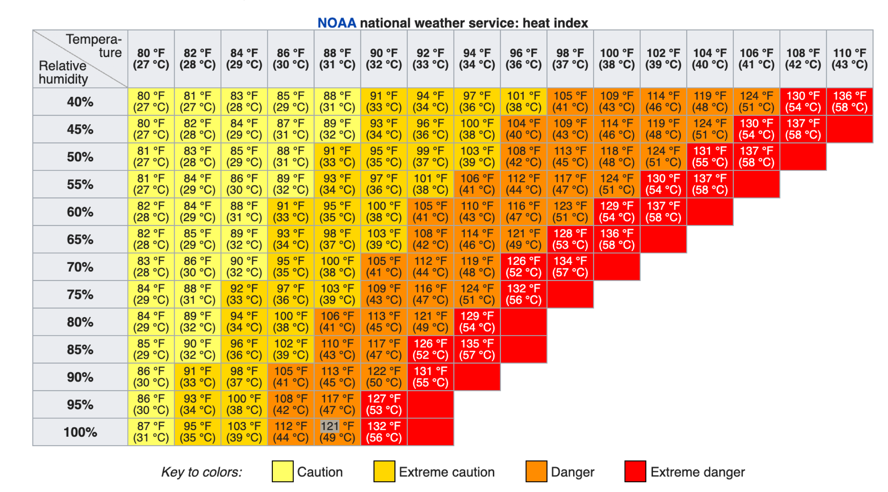
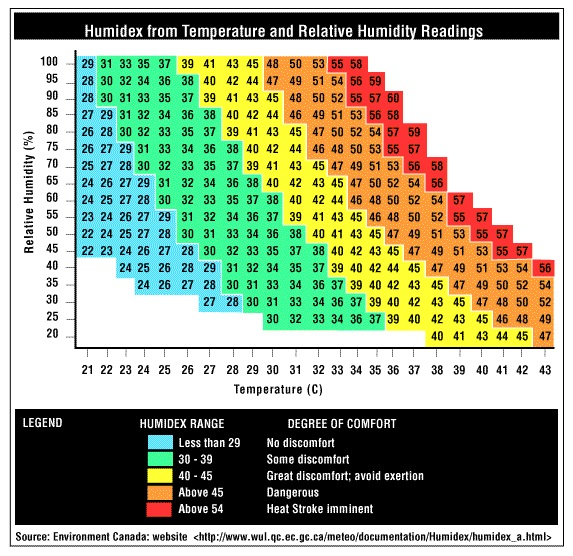

Resilience Metrics Reporting
================

**Xuan Luo, Tianzhen Hong**

**Lawrence Berkeley National Laboratory**

 - Original Date: May 19, 2020
 - Updated Date: May 31, 2020

## Justification for New Feature ##

With increasing frequency and severity of extreme weather events (e.g., heat waves), it is crucial to ensure urban buildings and infrastructure are resilient to provide critical services to preserve human life and properties during natural disasters. Building resilience has the opportunity to become an additional value proposition for technologies and systems if it can be reliably quantified, valued, and trusted by stakeholders. Metrics or an assessment of potential vulnerability, likelihood, and consequence for each risk would help to prioritize further consideration of these risk factors of building resilience [1]. There is a need to measure the resilience of buildings to help owners make better decisions and protect their assets, to better assess the built environment resilience of larger geographic units such as communities and cities, and to complement existing assessments of building sustainability. Building performance simulation is a powerful tool to quantify building’s resilience and vulnerability under extreme weather events.

EnergyPlus currently calculates at each time-step a set of variables (e.g., zone/space air dry-bulb temperature, relative humidity, CO2 concentration, illuminance level) that can be further processed to generate reports on resilience metrics for thermal performance, visual performance, and indoor air quality (IAQ). For the spatial resolution, the reporting needs to consider both the entire building for aggregated results and individual spaces for detailed and worst case results. For the temporal resolution, the reporting needs to consider the aggregated and average results as well as the worst-case results (e.g., maximum or minimum values at specific time, worst day, worst week) in summer, winter and the whole year. The resilience metrics target occupants’ health and wellbeing during extreme weather events. Therefore, the metrics involve the aggregations across space (occupants in the space) and time (e.g., X occupant·hours (Y%) with Heat Index between certain range for Zone Z). Post-processing to generate these reports requires EnergyPlus models to produce lots of time-step report variables, which can be time consuming and can require significant storage. Hence, we propose to add a list of resilience related tabular reports in EnergyPlus to provide a consistent and convenient path for users of resilience analysis through modeling and simulation.

## Overview ##

We reviewed literature on resilience metrics [1] and propose to add the following metrics in EnergyPlus on thermal, visual, and indoor air quality - CO2 resilience as optional report variables and summary tables. Each metric can be calculated and reported when users declare it as an input. The selected resilience metrics (e.g., thermal metrics: Heat Index, Humidex, and SET) are well defined, calculable, and have been adopted by government agency and industry.

1. Thermal Resilience

1.1	Heat Index

The heat index (HI) is an index that combines air temperature and relative humidity (Steadman 1979), in shaded areas, to posit a human-perceived equivalent temperature, as how hot it would feel if the humidity were some other value in the shade. The HI measures the temperature feels like to the human body when relative humidity is combined with the air temperature. HI is widely used in the United States. The Occupational Safety and Health Administration (OSHA) uses HI as an indicator to assess heat stress [2]. This has important considerations for the human body's comfort.  When the body gets too hot, it begins to perspire or sweat to cool itself off.  If the perspiration is not able to evaporate, the body cannot regulate its temperature. When the atmospheric moisture content (i.e. relative humidity) is high, the rate of evaporation from the body decreases.  In other words, the human body feels warmer in humid conditions.  The opposite is true when the relative humidity decreases because the rate of perspiration increases.  

Table 1 developed by U.S. National Oceanic and Atmospheric Administration (NOAA) is used to look up the heat index by temperature (°C) and relative humidity (%). The HI effects on human health are categorized at five levels: Safe, Caution, Extreme caution, Danger and Extreme danger, defined in Table 2 and color coded in Table 1.

**Table 1. Heat Index lookup table**

**Table 2. Definition of four levels of Heat Index**
|Heat Index in Celsius|Heat Index in Fahrenheit|Heat Index Level                                                                                                   |
|---------------------|------------------------|-------------------------------------------------------------------------------------------------------------------|
|Less than 26.7 °C    |Less than 80 °F         |Safe: no risk of heat hazard                                                                                       |
|26.7 - 32.2 °C       |80–90 °F                |Caution: fatigue is possible with prolonged exposure and activity. Continuing activity could result in heat cramps.|
|32.2 - 39.4 °C       |90–103 °F               |Extreme caution: heat cramps and heat exhaustion are possible. Continuing activity could result in heat stroke.    |
|39.4 - 51.7 °C       |103–125 °F              |Danger: heat cramps and heat exhaustion are likely; heat stroke is probable with continued activity.               |
|over 51.7 °C         |over 124 °F             |Extreme danger: heat stroke is imminent.  
                                                                         
The computation of the heat index is a refinement of a result obtained by multiple regression analysis carried out by Lans P. Rothfusz and described in a 1990 National Weather Service (NWS) Technical Attachment (SR 90-23). The calculation is based on degree Fahrenheit.

The regression equation of Rothfusz is

HI = c1 + c2T + c3R + c4TR + c5T2 + c6R2 + c7T2R + c8TR2 + c9T2R2 &nbsp;&nbsp; Eq. (1)

where

HI = heat index (expressed as an apparent temperature in degrees Fahrenheit),

T = ambient dry-bulb temperature (in degrees Fahrenheit),

R = relative humidity (percentage value between 0 and 100),

c1 = -42.379,

c2 = 2.04901523,

c3 = 10.14333127,

c4 = .22475541,

c5 = .00683783,

c6 = .05481717,

c7 = .00122874,

c8 = .00085282,

c9 = .00000199.

If the RH is less than 13% and the temperature is between 80 and 112 degrees F, then the following adjustment is subtracted from HI:

HI = (13 - R) / 4 * (17 - |T - 95|)^{0.5}; &nbsp;&nbsp; Eq. (2)

Otherwise, if the RH is greater than 85% and the temperature is between 80 and 87 degrees F, then the following adjustment is added to HI:

HI = (R - 85) / 10 * (87 - T) / 5;  &nbsp;&nbsp; Eq. (3)

The Rothfusz regression is not appropriate when conditions of temperature and humidity warrant a heat index value below about 80 degrees F. In those cases, a simpler formula is applied to calculate values consistent with Steadman's results:

HI = 0.5 * (T + 61.0 + (T - 68.0) * 1.2 + (RH * 0.094));  &nbsp;&nbsp; Eq. (4)

In practice, the simple formula is computed first and the result averaged with the temperature. If this heat index value is 80 degrees F or higher, the full regression equation along with any adjustment as described above is applied.

The Rothfusz regression is not valid for extreme temperature and relative humidity conditions beyond the range of data considered by Steadman.

For HI, we propose to:

(1) Calculate the time-step HI in EnergyPlus for each zone and add a report variable as one of the thermal comfort criteria.

(2) Adopt the above criteria and provide optional tabular reports of Hours (accumulated hours for a space) and OccupantHours (accumulated hours for the sum of all occupants in a space) of each level for each zone and the whole building.

1.2	Humidex

The humidex (short for humidity index) is an index number used by Canadian meteorologists to describe how hot the weather feels to the average person, by combining the effect of heat and humidity. The term humidex was first coined in 1965 [6]. The humidex is a nominally dimensionless quantity (though generally recognized by the public as equivalent to the degree Celsius) based on the dew-point temperature [7].

The Humidex effects on human health are categorized at five levels: Little to no discomfort, Some discomfort, Great discomfort; avoid exertion, Dangerous and Heat stroke imminent, defined in Table 3 and color coded in Table 4.

**Table 3. Humidex lookup table**

**Table 4. Definition of five levels of Humidex**
|Humidex Value  |Humidex Level  |
|---------------|---------------|
|Below 29       |Little to no discomfort|
|29 to 40       |Some discomfort|
|40 to 45       |Great discomfort; avoid exertion|
|45 to 50       |Dangerous|
|Above 50       |Heat stroke imminent|

The humidex (H) formula is:

$H = T_{air} + \frac{5}{9}(6.11 * exp^{5417.7530 * (\frac{1}{273.16} - \frac{1}{273.15 + T_{dew}})} - 10)$ &nbsp;&nbsp; Eq. (5)

Where,

H = the Humidex,

Tair = the air temperature in °C,

Tdew = the dew-point temperature in °C,

exp = 2.71828.

We propose to:

(1) Calculate the time-step humidex in EnergyPlus for each zone and add a report variable as one of the thermal comfort criteria.

(2) Adopt the above criteria and provide optional tables of Hours and OccupantHours of each level for each zone and the whole building.

1.3	Standard Effective Temperature Hours

Standard Effective Temperature (SET) is a model of human response to the thermal environment. Developed by A.P. Gagge and accepted by ASHRAE in 1986, SET is also referred to as the Pierce Two-Node model [8]. Its calculation is similar to PMV because it is a comprehensive comfort index based on heat-balance equations that incorporate personal factors of clothing and metabolic rate. Its fundamental difference is it takes a two-node method to represent human physiology in measuring skin temperature and skin wettedness. ASHRAE 55-2010 defines SET as "the temperature of an imaginary environment at 50% relative humidity, <0.1 m/s [0.33 ft/s] average air speed, and mean radiant temperature equal to average air temperature, in which total heat loss from the skin of an imaginary occupant with an activity level of 1.0 met and a clothing level of 0.6 clo is the same as that from a person in the actual environment, with actual clothing and activity level" [9].

LEED Pilot Credit IPpc100 - Passive Survivability and Back-up Power During Disruptions - defines “Livable conditions” as SET between 54°F and 86°F. The credit requires buildings to maintain safe thermal conditions in the event of an extended power outage or loss of heating fuel, or provide backup power to satisfy critical loads. Accumulated SET-days and SET-hours are metrics to measure thermal safety and temperatures. The SET-days and SET-hours are degree-days and degree-hours in Celsius/Fahrenheit degrees based on the indoor SET.
LEED Passive Survivability defines the Thermal Safety Temperatures for Path 2 using the SET:

- Cooling: Not to exceed 9 °F SET-days (216 °F SET-hours) above 86°F SET for residential buildings. (Metric: Not to exceed 5°C SET-days (120 °C SET-hours) above 30°C SET for residential buildings.)
- Cooling: Not to exceed 18 °F SET-days (432°F SET-hours) above 86°F SET for non-residential buildings. (Metric: Not to exceed 10°C SET-days (240 °C SET-hours) above 30°C SET for non-residential buildings.)
- Heating: Not to exceed 9 °F SET-days (216 °F SET-hours) below 54° SET for all buildings. (Metric: Not to exceed 5°C SET-days (120 °C SET-hours) below 12°C SET for all buildings.)

EnergyPlus calculates and reports SET as a time-step report variable. We propose to calculate the aggregated the SET-Hours and the SET-OccupantHours (at zone level) for both cooling and heating as one of the tabular reports for thermal resilience. We would also report the longest continuous unmet time duration in hours and the time of their occurrences.

2. Indoor Air Quality - CO2

For indoor air quality, we chose to use CO2 concentration at the zone level as an indicator. CO2 at very high concentrations (e.g., greater than 5,000 ppm) can pose a health risk, referring to Appendix D Summary of Selected Air Quality Guidelines in ASHRAE Standard 62.1-2016, "Ventilation for Acceptable Indoor Air Quality". At concentrations above 15,000 ppm, some loss of mental acuity has been noted. The Occupational Safety and Health Administration (OSHA) of the US Department of Labor defined the Permissible Exposure Limits (PEL) and Short-Term Exposure Limit (STEL) of CO2 level to be 5,000 ppm and 30,000 ppm accordingly [10].

CO2 increases in buildings with higher occupant densities, and is diluted and removed from buildings with outdoor air ventilation. High CO2 levels may indicate a problem with overcrowding or inadequate outdoor air ventilation. Thus, maintaining a steady-state CO2 concentration in a space no greater than about 700 ppm above outdoor air levels will indicate that a substantial majority of visitors entering a space will be satisfied with respect to human bio-effluents (body odor). With outdoor CO2 concentration varies from 350 to 500 ppm, we assume 1000 ppm is the safe threshold of indoor CO2 concentration.

EnergyPlus calculates and reports the Zone Air CO2 Concentration [ppm] as a report variable, and we propose to add the thresholds defined in Table 4 and calculate the Hours and OccupantHours of each level for each zone and the whole building.

**Table 4. Indoor CO2 levels required at various health conditions**
|Indoor CO2 Concentration    |CO2 Level      |
|---------------------------------------|--------------------------|
|<= 1000 ppm                            |Normal                    |
|<= 5,000 ppm and > 1000 ppm            |Caution                   |
|> 5,000 ppm                            |Hazard                    |

To activate the CO2 concentration calculation in EnergyPlus, the ZoneAirContaminantBalance object needs to be specified and with the field “Carbon Dioxide Concentration” set to Yes. Users can define a schedule of outdoor air CO2 concentration in the field “Outdoor Carbon Dioxide Schedule Name”. CO2 generation rate at the zone level can be specified using the ZoneContaminantSourceAndSink:CarbonDioxide object.

3. Illuminance Level

Adequate indoor lighting level is crucial for occupant safety, health and productivity. The 10th edition of The Lighting Handbook published by IESNA recommends illuminance levels for various types of spaces in a building. The US General Services Administration provides lighting levels for US Government buildings (Table 5), which can be used as a guide for other types of buildings. The required light levels are indicated in a range because different tasks, even in the same space, require different amounts of light. In general, low contrast and detailed tasks require more light while high contrast and less detailed tasks require less light.

**Table 5. GSA recommended lighting levels**
|Room Type                     |Light Level (Foot Candles)|Light Level (Lux)|
|------------------------------|--------------------------|-----------------|
|Bedroom - Dormitory           |20-30 FC                  |200-300 lux      |
|Cafeteria - Eating            |20-30 FC                  |200-300 lux      |
|Classroom - General           |30-50 FC                  |300-500 lux      |
|Conference Room               |30-50 FC                  |300-500 lux      |
|Corridor                      |5-10 FC                   |50-100 lux       |
|Exhibit Space                 |30-50 FC                  |300-500 lux      |
|Gymnasium - Exercise / Workout|20-30 FC                  |200-300 lux      |
|Gymnasium - Sports / Games    |30-50 FC                  |300-500 lux      |
|Kitchen / Food Prep           |30-75 FC                  |300-750 lux      |
|Laboratory (Classroom)        |50-75 FC                  |500-750 lux      |
|Laboratory (Professional)     |75-120 FC                 |750-1200 lux     |
|Library - Stacks              |20-50 FC                  |200-500 lux      |
|Library - Reading / Studying  |30-50 FC                  |300-500 lux      |
|Loading Dock                  |10-30 FC                  |100-300 lux      |
|Lobby - Office/General        |20-30 FC                  |200-300 lux      |
|Locker Room                   |10-30 FC                  |100-300 lux      |
|Lounge / Breakroom            |10-30 FC                  |100-300 lux      |
|Mechanical / Electrical Room  |20-50 FC                  |200-500 lux      |
|Office - Open                 |30-50 FC                  |300-500 lux      |
|Office - Private / Closed     |30-50 FC                  |300-500 lux      |
|Parking - Interior            |5-10 FC                   |50-100 lux       |
|Restroom / Toilet             |10-30 FC                  |100-300 lux      |
|Retail Sales                  |20-50 FC                  |200-500 lux      |
|Stairway                      |5-10 FC                   |50-100 lux       |
|Storage Room - General        |5-20 FC                   |50-200 lux       |
|Workshop                      |30-75 FC                  |300-750 lux      |

For resilience reporting purpose, we chose three thresholds: a bit dark - less than 100 lux, dim – 100 to 300 lux, adequate – 300 to 500 lux, bright – more than 500 lux.

•	100 lux – This level of light is sufficient for lifts, corridors and stairs. Areas that are transitory for occupants and don’t require any detailed work. Warehouse areas and bulk stores will also require this minimal light level.
•	300 lux – Assembly Areas, like village halls require at least 300 lux
•	500 lux – Retail spaces should have this as a minimum light level, as should general office spaces. This level should be suitable for prolonged work on computers, machinery and reading.
•	More than 500 lux – If you have an area where intricate work is being carried out, then very high lux values may be needed. Where fine detailed work is being carried out, anything up to 2,000 lux can be used – this is usually only necessary in fairly unusual circumstances.

To activate the indoor illuminance calculation in EnergyPlus, users need to define the Daylighting:Controls and the Daylighting:ReferencePoint objects, even if no daylighting controls are actually implemented in the building simulation model.

## Approach ##

The resilience reports will be represented as three tabular summary reports (Thermal Resilience Summary, Indoor Air Quality Resilience Summary, and Visual Resilience Summary) and can be requested as part of the existing tabular reports.

Report: **Thermal Resilience Summary**

For: **Entire Facility**

**Heat Index Hours**

|          |Safe (≤ 26.7°C) [Hours] |Caution (26.7, 32.2°C] [Hours] |Extreme Caution (32.2, 39.4°C] [Hours] |Danger (39.4, 51.7°C] [Hours] |Extreme Danger (> 51.7°C) [Hours]|
|----------|------|------|------|------|------|
|Space_1   |      |      |      |      |      |
|…         |      |      |      |      |      |
|Space_N   |      |      |      |      |      |
|Min       |      |      |      |      |      |
|Max       |      |      |      |      |      |
|Average   |      |      |      |      |      |
|Sum       |      |      |      |      |      |

**Heat Index OccupantHours**

|          |Safe (≤ 26.7°C) [OccupantHours] |Caution (26.7, 32.2°C] [OccupantHours] |Extreme Caution (32.2, 39.4°C] [OccupantHours] |Danger (39.4, 51.7°C] [OccupantHours] |Extreme Danger (> 51.7°C) [OccupantHours]|
|----------|------|------|------|------|------|
|Space_1   |      |      |      |      |      |
|…         |      |      |      |      |      |
|Space_N   |      |      |      |      |      |
|Min       |      |      |      |      |      |
|Max       |      |      |      |      |      |
|Average   |      |      |      |      |      |
|Sum       |      |      |      |      |      |

**Humidex Hours**

|          |Little to No Discomfort (≤ 29) [Hours] |Some Discomfort (29, 40] [Hours] |Great Discomfort; Avoid Exertion (40, 45] [Hours] |Dangerous (45, 50] [Hours] |Heat Stroke Quite Possible (> 50) [Hours] |
|----------|------|------|------|------|------|
|Space_1   |      |      |      |      |      |
|…         |      |      |      |      |      |
|Space_N   |      |      |      |      |      |
|Min       |      |      |      |      |      |
|Max       |      |      |      |      |      |
|Average   |      |      |      |      |      |
|Sum       |      |      |      |      |      |

**Humidex OccupantHours**

|          |Little to No Discomfort (≤ 29) [OccupantHours] |Some Discomfort (29, 40] [OccupantHours] |Great Discomfort; Avoid Exertion (40, 45] [OccupantHours] |Dangerous (45, 50] [OccupantHours] |Heat Stroke Quite Possible (> 50) [OccupantHours] |
|----------|------|------|------|------|------|
|Space_1   |      |      |      |      |      |
|…         |      |      |      |      |      |
|Space_N   |      |      |      |      |      |
|Min       |      |      |      |      |      |
|Max       |      |      |      |      |      |
|Average   |      |      |      |      |      |
|Sum       |      |      |      |      |      |

**Heating SET Hours**

|          |SET ≤ 12.2°C Hours (°C)|SET ≤ 12.2°C OccupantHours (°C)|Longest SET ≤ 12.2°C Duration [Hours] |Start Time of the Longest SET ≤ 12.2°C Duration|
|----------|------|------|------|------|
|Space_1   |      |      |      |      |
|…         |      |      |      |      |
|Space_N   |      |      |      |      |
|Min       |      |      |      |      |
|Max       |      |      |      |      |
|Average   |      |      |      |      |

**Cooling SET Hours**

|          |SET > 30°C Hours (°C)|SET > 30°C OccupantHours (°C)|Longest SET > 30°C Duration [Hours] |Start Time of the Longest SET > 30°C Duration|
|----------|------|------|------|------|
|Space_1   |      |      |      |      |
|…         |      |      |      |      |
|Space_N   |      |      |      |      |
|Min       |      |      |      |      |
|Max       |      |      |      |      |
|Average   |      |      |      |      |

Report: **Indoor Air Quality Resilience Summary**

For: **Entire Facility**

**CO2 Level Hours**

|          |Safe (<= 1000 ppm) [Hours] |Caution (1000, 5000 ppm] [Hours] |Hazard (> 5000 ppm) [Hours] |
|----------|------|------|------|
|Space_1   |      |      |      |
|…         |      |      |      |
|Space_N   |      |      |      |
|Min       |      |      |      |
|Max       |      |      |      |
|Average   |      |      |      |
|Sum       |      |      |      |

**CO2 Level OccupantHours**

|          |Safe (<= 1000 ppm) [OccupantHours] |Caution (1000, 5000 ppm] [OccupantHours] |Hazard (> 5000 ppm) [OccupantHours] |
|----------|------|------|------|
|Space_1   |      |      |      |
|…         |      |      |      |
|Space_N   |      |      |      |
|Min       |      |      |      |
|Max       |      |      |      |
|Average   |      |      |      |
|Sum       |      |      |      |

Report: **Visual Resilience Summary**

For: **Entire Facility**

**Illuminance Level Hours**

|          |A Bit Dark (<= 100 lux) [Hours] |Dim (100, 300 lux] [Hours] |Adequate (300, 500 lux] [Hours] |Bright (>500 lux) [Hours] |
|----------|------|------|------|------|
|Space_1   |      |      |      |      |
|…         |      |      |      |      |
|Space_N   |      |      |      |      |
|Min       |      |      |      |      |
|Max       |      |      |      |      |
|Average   |      |      |      |      |
|Sum       |      |      |      |      |

**Illuminance Level OccupantHours**

|          |A Bit Dark (<= 100 lux) [OccupantHours] |Dim (100, 300 lux] [OccupantHours] |Adequate (300, 500 lux] [OccupantHours] |Bright (>500 lux) [OccupantHours] |
|----------|------|------|------|------|
|Space_1   |      |      |      |      |
|…         |      |      |      |      |
|Space_N   |      |      |      |      |
|Min       |      |      |      |      |
|Max       |      |      |      |      |
|Average   |      |      |      |      |
|Sum       |      |      |      |      |

## Testing/Validation/Data Source(s) ##

Two example files (the DOE reference small office and the one zone uncontrolled model) will be modified to demonstrate the use of the new feature. Simulation results will be manually checked/benchmarked using excel spreadsheet with input and output from EnergyPlus runs.

## Input Output Reference Documentation ##

To be developed.

## Input Description ##

The `Output:Table:SummaryReports` object will be modified to take three new keys as the choice:
- **ThermalResilienceSummary** for indoor thermal resilience unmet hours & occupant·hours summary report
- **CO2ResilienceSummary** for indoor air quality - CO2 resilience unmet hours & occupant·hours summary report
- **VisualResilienceSummary** for indoor illuminance resilience unmet hours & occupant·hours summary report

## Outputs Description ##

The following new report variables will be added:
- Zone, Average, Zone Heat Index [°C]
- Zone, Average, Zone Humidity Index []

## Engineering Reference ##

To be developed.

## Example Files and Transition Changes ##

The existing DOE reference small office model will be modified to report resilience metric tables.

No transition change is required.

## E-mail and  Conference Call Conclusions ##

**May 2020**
- *From Paul Mathew*:

I took a quick look and I think these are good metrics to add to E+ reports. Couple things:
1. I think it's good that you have occupant hours, but I think some people may just want hours, so perhaps that could be a report option.
2. Is there a reason that SET is reported in hours? All the others are occ hours.

> Reply:

> On 1 - Indeed. We will see how to add this option.

> On 2 - SET-hours are targeted for LEED passive survivability, so we chose not to use occhours. This relates to Point 1. It makes sense to add an option.

- *From Jessica Granderson*:

Are nighttime ignored for the illuminance calc? And is the thought that these metrics get generated just when doing a ‘resilience run’ with reduced services, as opposed to a general run for a building?

> Reply: Good point. When we use OccupantHours, hours with no occupancy would not increase the aggregated values. However, there can be a need to just count the daytime or occupied hours. Depending on building use type, there may be occupied hours at night.

> Users/modelers would need to request these summary reports for EnergyPlus to produce them, which makes sense when they are doing resilience related runs.

- *From Kaiyu Sun*:

I suggest we use “contaminant concentration” rather than “CO2 concentration” to be more general that can cover potentially more resilience scenarios like wild fire. The simulation method would be the same by assigning the contaminant concentration schedule. CO2 can be a good example for demonstrating the implementation and application.

> Reply: Indeed, CO2 is a proxy/indicator of IAQ. It does not apply to cases when IAQ issue is caused by specific contaminants such as ozone and/or PM2.5 due to outdoor pollution or wildfire events. However, modeling CO2 is more straightforward in EnergyPlus with input data broadly available. To model other contaminants, users can still use EnergyPlus but need to provide necessary input of outdoor air contaminant concentration and indoor contaminant generation rate.

- *From Liam O'Brien*:

If I understand correctly, the building is being tested under normal circumstances or by using extreme climate files. However, I recommend consider adding power failure scenarios (I suppose this could simply be tested by not allowing HVAC). In our work, we tried two things: 1) no HVAC all year (free-running) and 2) kill the HVAC at the worst possible times (extreme weeks).

> Reply: Modeling thermal resilience depends upon details of the extreme weather events (e.g., heatwave, cold snaps, strong wind, flooding) and how specific buildings and systems operate (complete power outage, partial power loss to HVAC, or only limited power for critical services). We leave the definition and modeling details (creation of EnergyPlus IDF files) to the users, while focusing on reporting the resilience metrics (that cover 80% of use cases). Tools like CityBES or OpenStudio can provide a GUI to help users define extreme events and choose a specific epw weather file.

In the documentation for SET-hours, the table is a bit confusing because it switches from C to F

> Reply: Most EnergyPlus reports are easily converted bewteen SI and IP units. The SET-hours report is a bit tricky for conversion. So we think of including both units.

A major gap in the literature we found was on choosing appropriate weather files, e.g., considering extreme events, climate change, etc. There is some recent work on this, but no consensus.

> Reply: Indeed, choice of weather data (from historical, TMY, or future) is crucial for a resilience study as it determines the frequency and severity of the extreme weather events. It is a risk and probability issue.

I recommend reading the LEED RELI documentation (not perfect, but interesting).

> Reply: We read LEED's passive survibability - I think it has rooms to improve. It is very different between comfort (a small range around neutral temperature and humidity) and stretched health risk (e.g., heat index of danger or extreme dangerous conditions). Most of ASHRAE Standard 55 would not apply to thermal resilience.

- *From Clint Andrews*:

Regarding the importance of being able to model the effects on indoor conditions due to electricity outages.

> Reply: See the response to Liam.

In a residential context, it is the long-duration nighttime temperatures that cause the most health problems for occupants. Think of the frog sitting in the slowly warming pot of water. I suggest reporting the temporal profile of indoor thermal conditions in a way that acknowledges the duration of high temperatures and not only the magnitude of the peak.

> Reply: This is a great point. We currently plan to report accumulated hours or occupant-hours. But sometimes as you pointed out, the longest continuous duration can be the critical metrics. This is especially true for the nighttime sleep indoor environment. We will think of another metric for this.

In case studies, we have seen that the competence of the building operator is a crucial determinant of building resilience. EnergyPlus has always assumed optimal building operations, but perhaps the time is right to allow modelers to assume some non-optimizing, satisficing operating decisions?

> Reply: Modelers have to consider ways to model resilience scenarios by modifying the EnergyPlus models/files. In our case study, a hurricane caused power loss to the HVAC systems, and because windows cannot be open, the indoor heat accumulated leading to much higher indoor temperature than outdoor.

Today's interest in resilience and adaptability replays a prior debate about robustness and flexibility. EnergyPlus so far helps mostly to model resilience/robustness, when the superior risk management strategy is often adaptability/flexibility. The attached shows how I adapted a similar type of engineering-economic model (for power systems) to handle such strategies, long ago.

> Reply: Thanks for sharing your studies. We will learn from them in our coming project on resilience.

## Acknowledgments ##

We thank Paul Mathew, Ronnen Levinson, Lino Sanchez, and Jessica Granderson of LBNL, Liam O'Brien of Carleton University, and Clinton Andrews of Rutgers University for providing some valuable references.

## References ##

[1]	K. Sun, M. Specian, T. Hong, Nexus of thermal resilience and energy efficiency in buildings: A case study of a nursing home, Build. Environ. 177 (2020) 106842. doi:10.1016/j.buildenv.2020.106842.

[2]	M.E. Kiersma, Occupational Safety and Health Administration, Encycl. Toxicol. Third Ed. (2014) 642. doi:10.1016/B978-0-12-386454-3.00344-4.

[3]	G. Brooke Anderson, M.L. Bell, R.D. Peng, Methods to calculate the heat index as an exposure metric in environmental health research, Environ. Health Perspect. 121 (2013) 1111–1119. doi:10.1289/ehp.1206273.

[4]	R.G. Steadman, The assessment of sultriness. Part I. A temperature-humidity index based on human physiology and clothing science., J. Appl. Meteorol. 18 (1979) 861–873. doi:10.1175/1520-0450(1979)018<0861:TAOSPI>2.0.CO;2.

[5]	L.P. Rothfusz, N.S.R. Headquarters, The heat index equation (or, more than you ever wanted to know about heat index), Fort Worth, Texas Natl. Ocean. Atmos. Adm. Natl. Weather Serv. Off. Meteorol. (1990) 23–90. papers://c6bd9143-3623-4d4f-963f-62942ed32f11/Paper/p395.

[6]	F.R. JM Masterton, Humidex: a method of quantifying human discomfort due to excessive heat and humidity, Print book, Environment Canada, Atmospheric Environment, 1979.

[7]	R. Rana, B. Kusy, R. Jurdak, J. Wall, W. Hu, Feasibility analysis of using humidex as an indoor thermal comfort predictor, Energy Build. 64 (2013) 17–25. doi:10.1016/j.enbuild.2013.04.019.

[8]	L.G. Gagge, A. P., Fobelets, A. P. and Berglund, A standard predictive Index of human reponse to thermal enviroment, Am. Soc. Heating, Refrig. Air-Conditioning Eng. (1986) 709–731.

[9]	ASHRAE, ASHRAE STANDARD 55-2010: Thermal Environmental Conditions for Human Occupancy, 2013.

[10] ACGIH, Threshold Limit Values (TLVs) and Biological Exposure Indices (BEIs), 2012. doi:10.1073/pnas.0703993104.
