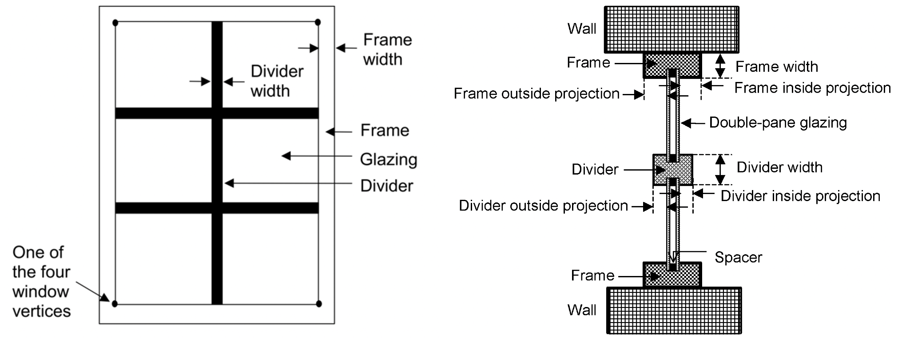
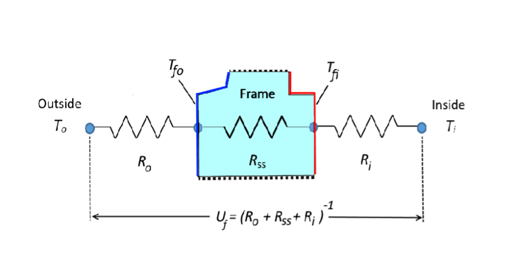
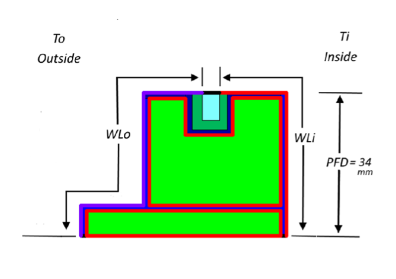
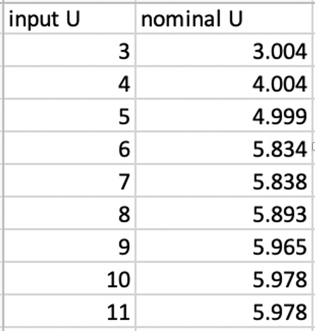

Enhancement to the Simple Window Model for Highly-Conducting Window Frames
================

**Xuan Luo, Tianzhen Hong**

**Lawrence Berkeley National Laboratory**

 - Original Date: February 19, 2021
 - Modified Date: March 16, 2021

## Justification for New Feature ##
The EnergyPlus simple window model has an upper limit of around 1.0 (Btu/h·ft2·F) or 5.8 (W/m2·K) for U-factor, but windows/skylights can have overall U-factors (including glazing, frame and other supporting parts of a fenestration assembly) that are significantly higher. For example, ASHRAE Handbook of Fundamentals list windows with U-factor up to 1.3 (Btu/h·ft2·F) and skylights up to 2.0 (Btu/h·ft2·F). The issue is caused by window frames with two-and three-dimensional heat transfer, whereas EnergyPlus surface film coefficients are based on one-dimensional heat transfer. Since EnergyPlus cannot accurately model these inefficient windows/skylights, savings are underestimated for window upgrades of existing buildings with these products. These upgrades are important for DOE’s Home Energy Score, ResStock, Weatherization Assistant, etc. 

An IBPSA paper published in 2017 [1] presents a simple method for correcting surface heat transfer coefficients in building simulation models by using the length of frame normal to frame cross-section plane to account for the "wetted" length of the frame. We purpose to use the concept of the "wetted length" of frames to enhance the current logic in calculating heat balance using simple glazing system model, in order to allow considering highly conducting metal frames in simple window models in EnergyPlus.

## Overview ##

Window-frame film coefficients, both exterior and interior, are typically larger than the film coefficients applying toWindow-frame film coefficients, both exterior and interior, are typically larger than the film coefficients applying to the same window’s parent wall. This is because window frames and other complex 2-D shapes exhibit increased convective and radiative heat transfer, similar to a finned heat sink or on the cooling fins of an air-cooled engine. This “fin effect” can result in very large film coefficients, both outdoors and indoors. At present it is not computationally feasible to perform 2-D, heat transfer modeling on every framing element in a building, for all 8760 hours of the year. A paper by Lyons and Curcija (2017) presents a simplified method to estimate the real-world, frame film coefficients based on knowledge of the frame geometry, and use these “fin-inflated” coefficients to calculate the true frame heat flow, rather than using standard 1-D coefficients applied to the parent wall.

To calculate the “fin-inflated” film coefficients, the total length of the outside face and the total length of the inside face are used as the outside and inside wetted lengths. These dimensions are complemented by the “projected frame dimension”, PFD. The PFD is projected onto the plane parallel to the glass and is currently used in EnergyPlus as the frame width.
 
With derivation detailed in the feature proposal, adding an adjustment factor to the frame coefficients would allow considering the fin-inflated film coefficient for both indoor and outdoor sides. For simple window models considering the glazing and frame together in heat transfer calculations, this is equivalent to adding an adjustment factor to the inside and outside convective coefficients of the whole glazing system. We propose to add film coefficient adjustment ratios for fenestration objects in EnergyPlus.
 the same window’s parent wall. This is because window frames and other complex 2-D shapes exhibit increased convective and radiative heat transfer, similar to a finned heat sink or on the cooling fins of an air-cooled engine. This "fin effect" can result in very large film coefficients, both outdoors and indoors. At present it is not computationally feasible to perform 2-D, heat transfer modeling on every framing element in a building, for all 8760 hours of the year. The paper [1] presents a simplified method to estimate the real-world, frame film coefficients based on knowledge of the frame geometry, and use these "fin-inflated" coefficients to calculate the true frame heat flow, rather than using standard 1-D coefficients applied to the parent wall.

Figure 1 shows the front view and cross section of a window frame.

 Figure 1. Front view and cross section of a window frame.

The methods and its derivation are as follows.  Figure 2 shows the thermal circuit for a window frame (light blue area in the figure). The arbitrary, asymmetric frame in Figure 2 is depicted notionally as a window sill, but could be any framing element in a fenestration system. The upper and lower surfaces, shown by dotted lines, are assumed to be adiabatic. The exterior, cold left face of the frame is shown in dark blue, while the interior, right, warm face is shown in red.

 Figure 2. Thermal circuit for window frame. 

The frame U-factor, Uf, including air films in Figure 1 is calculated as by

Uf  =  1/(1/ho  + Rss  + 1/hi) &nbsp;&nbsp; Eq. (1)

where Rss is the surface-to-surface thermal resistance of the frame, excluding its air films. ho and hi represent the outside and inside total (convective and radiative) heat transfer coefficient, respectively. 
To calculate the "fin-inflated" film coefficients, the total length of the outside blue face (denoted WLo), and the total length of the inside red face (denoted WLi) are used as the outside and inside wetted lengths. These dimensions are complemented by the "projected frame dimension", PFD. The PFD is projected onto the plane parallel to the glass and is currently used in EnergyPlus as the frame width. The length-weighted, average frame outside and inside surface temperatures are noted as Tfo and Tfi respectively, and the outdoor and indoor air temperatures are noted as To and Ti. Figure 3 shows an example of the WLo and WLi of a frame.

 Figure 3. Cross section wetted lengths of a frame. 

If the constant heat transfer coefficient is applied to frame surfaces, the heat flux from the outside frame surface to the exterior environment is

Qo  = ho WLo x(Tfo-To) &nbsp;&nbsp; Eq. (2)

where x is the length of frame normal to frame cross-section plane.	
Similarly, the heat flux from the inside frame surface to the interior environment is

Qi  = hi WLi x(Ti-Tfi) &nbsp;&nbsp; Eq. (3)

From conservation of energy, assuming negligible thermal mass of the frame,

Qi - Qo = 0 &nbsp;&nbsp; Eq. (4)

The outdoor heat flux can also be expressed as

Qo = Uf PFDx(Ti-To) &nbsp;&nbsp; Eq. (5)

where Qo is expressed in terms of heat flow through the interior projected frame surface, rather than the exterior surface.

The indoor heat flux can be expressed as

Qi  = Uf PFDx(Ti-To )

which is the same as (5). Equating (3) and (5) yields

(hi WLi x(Ti-Tfi )) / (Uf PFDx(Ti-To )) = 1 

where for a given frame length, the x terms are common and cancel out.

Thus

Uf  = Hi  (Ti-Tfi)/(Ti-To )

where the general, corrected, fin-inflated  film coefficient is given by

Hi  =[WLi/PFD]·hi &nbsp;&nbsp; Eq. (6)

Equating (2) and (5) yields

(ho WLo x(Tfo-To )  )/(Uf PFDx(Ti-To ) )  = 1 

where for a given frame length, the x terms are common and cancel out.

Thus

Uf  = Ho  (Tfo-To)/(Ti-To )

where the general, corrected, fin-inflated outdoor film coefficient is given by

Ho  =[WLo/PFD]∙ho &nbsp;&nbsp; Eq. (7)

Hence, adding an adjustment factor to the frame coefficients would allow considering the fin-inflated film coefficient for both indoor and outdoor sides. For simple window models considering the glazing and frame together in heat transfer calculations, this is equivalent to adding an adjustment factor to the inside and outside convective coefficients of the whole glazing system. 

Based on the above justifications, we propose to add film coefficient adjustment ratios for fenestration objects in EnergyPlus.

## Approach ##

The simple window model in EnergyPlus is accessed through the WindowMaterial:SimpleGlazingSystem input object and converts the simple indices into an equivalent single layer window. Once the model generates the properties for the layer, the program reuses the bulk of the layer-by-layer model for subsequent calculations. In this model, user input window U-values include interior and exterior surface heat transfer coefficients. The resistance of the bare window product, or glass-to-glass resistance is augmented by these film coefficients so that,

U =  1/(1/(hOutRad+hcout) + Rbare + 1/(hInRad+hcin)) &nbsp;&nbsp; Eq. (8)

Where,

hcout is the exterior film coefficient under standard winter conditions in units of W/m2·K. 
hcin is the interior film coefficient under standard winter conditions in units of W/m2·K.
hOutRad is the radiative conductance of outside airfilm in units of W/m2·K.
hInRad is the radiative conductance of inside airfilm in units of W/m2·K.
Rbare is the nominal center-of-glass resistance without air films in units of m2·K/W.

In the current implementation, because the window model in EnergyPlus is for flat geometry, the model is not necessarily applicable to low-performance projecting products, such as single-pane windows with uninsulated aluminum frame. The model cannot support glazing systems with a U higher than 6.0 because the thermal resistance of the film coefficients alone can provide this level of performance and none of the various resistances can be negative.

 Figure 4. Comparison of input U and computed nominal U (nominal conductance in winter) before applying the adjustment ratio. 

In order to remove this restriction to model simple glazing windows with high conductive frames, we will introduce the concept of film coefficient adjustment ratio to hcout, hcin. The adjustment ratio α to both inside and outside is computed iteratively. In each iteration, the nominal (or effective) U is
re-evaluated, and the adjustment ratio at the current iteration is computed as
a ratio between the input U and nominal U at the current iteration. The iterative
process stops when the input U and the nominal U is close enough (with a less than
0.01 W/m\(^{2}\)\(\cdot\)K difference). This method essentially finds the solutions 
for the following quadratic equations in Equation (9).

Uinput = 1/(1/(hOutRad+α∙hcout) + Rbare + 1/(hInRad+α∙hcin)) &nbsp;&nbsp; Eq. (9)

During the simulation, when final hcout and hcin are calculated for window objects using simple window models, these factors will be applied back to adjust hcout and hcin as αhcout and αhcin, accordingly. Since the derived Rbare is neglectable when U > 7.0, we don’t apply the α back to the window glazing layer.

## Testing/Validation/Data Source(s): ##

A new example file built upon the existing file, *RefBldgSmallOfficeNew2004_Chicago.idf*, will be created to demonstrate the use of the new feature. Simulation results will be manually checked/benchmarked with the paper introducing the methods.

## IDD Object (New): ##

N/A

## IDD Object(s) (Revised): ##

N/A

## Proposed additions to Meters: ##

N/A

## Proposed Report Variables: ##

N/A

## Email Discussion ##

The feature and implementation details were discussed in one of the EnergyPlus Technicality calls.

## References ##

[1]	P.R. Lyons, D.C. Curcija, A New Method of Representing Highly-Conducting Window Frames in Building Simulation Models, in: Proc. 15th IBPSA Conf., San Francisco, CA, USA, 2017: pp. 1728–1731. doi:https://doi.org/10.26868/25222708.2017.456.
