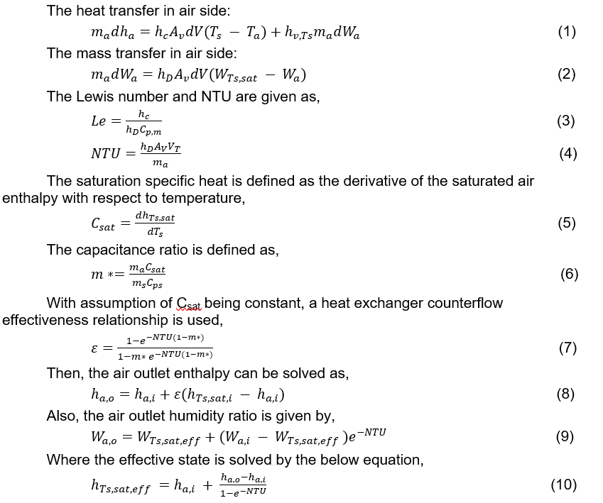

# Liquide Desiccant Dehumidification Coil

**Jian Sun and Bo Shen, ORNL**

- February 17, 2021 - Initial Draft

## Justification for Feature Update
Various building technologies have been integrated into grid responsive control strategies in building flexibility studies. There is increase need for E+ to model and simulation these technologies and integrate them into system and control simulation to evaluate the building equipment flexibility. The present E+ lacks simulation model for liquid desiccant dehumidification. E+ needs to add the features. 

## Overview
A simple liquid desiccant dehumidification model (Coil: LiquidDesiccant: Simple) is developed to simulate the performance of an liquid desiccant dehumidification/storage. The model leverages the modeling structure of exist water cooling coil model (object name: Coil:Cooling:Water). 

This liquid desiccant dehumidification model is using heat and mass transfer effectiveness-NTU model [1][2], which combines the heat and mass transfer balance of both fluid and liquid desiccant solution, and the mass transfer is driven by a difference between the partial pressure of the water vapor in the air and the vapor pressure of a liquid. This model provides a good prediction of air and solution outlet conditions with requiring the detailed geometric inputs. The input required to the model includes only a set of thermodynamic design inputs, which require no specific manufacture’s data. The model calculates the mass transfer coefficients (hdAvVt) and assumes counterflow operation. 

## Model Description

Coil:LiquidDesiccant:Simple

The models (object name Coil: LiquidDesiccant: Simple) simulate performances of a liquid desiccant dehumidification coil. The details of this object are described as following, 

The model includes two blocks: design block and operating block. The design block calculates the design hdAvVT value in the initialization process, which will be used for simulating the operation conditions performance in operating block. This design hdAvVT value is estimated based on the design states and latent load through logarithmic mean enthalpy difference method. The design and operating inputs are list as below:

Table 1: Design Inputs (User Inputs)

| Input Field     | Description |
| ----------- | ----------- |
| DesWaterVolFlowRate      | Design Solution Flow Rate      |  	            
| DesAirVolFlowRate	        |        Design Air Flow Rate|
|DesInletWaterTemp	         |       Design Inlet Solution Temperature|
|DesInletAirTemp	           |     Design Inlet Air Temperature |
|DesOutletAirTemp	            |    Design Outlet Air Temperature |
 |DesInletAirHumRat	            |    Design Inlet Air Humidity Ratio|
|DesOutletAirHumRat	         |   Design Outlet Air Humidity Ratio |
|DesInletSolnConcentration	 |    Design Inlet Solution Concentration|
|DesRegenFanPower	         |       Design Regeneration Fan Power |
|DesPumpPower	             |       Design Pump Power|
|DesEffectNom	                    Design effectiveness |
|DesignSlnDeltaConcentration	|    Design Liquid Desiccant Concentration Difference|

Table 2: Operating Conditions (From Nodes – not user inputs)

| Input Field     | Description |
| ----------- | ----------- |
|InletWaterMassFlowRate|	Entering Solution Mass Flow Rate |
|InletWaterTemp	|Inlet Solution Temperature |
|InletAirMassFlowRate	|Entering Air Mass Flow Rate|
|InletAirTemp	|Inlet Air Temperature|
|InletAirHumRat|	Entering Air Humidity Ratio|
|OutdoorAirVolFlowRate|	Outdoor Air Flow Rate|

Operation Block Calculation 

The Coil: LiquidDesiccant: Simple object is modeled with a effectiveness -NTU method to calculate the heat and mass transfer between liquid desiccant solution and fluid (air). 

Design block Calculation 

The design block is to calculate the liquid desiccant dehumidification overall mass transfer coefficient hdAvVT value required by operating block. Heat transfer in a liquid desiccant dehumidification model is based on enthalpy rather than temperature to take into account latent effects. The design input variables for calculating the overall heat transfer coefficient are design solution mass flow rate ms_des , design solution inlet temperature Tsi_des, design solution inlet concentration Xsi_des, design solution outlet temperature Tso_des, design solution outlet concentration Xso_des, design air inlet mass flow rate ma and design effectiveness at normal condition εdes . 
With these input design conditions, the specific heat Csat and Cps can be calculated. Then the capacitance ratio is given by eq.(6). With given design effectiveness εdes and eq.(7), the NTU will be determined. Finally, the eq.(4) will be used to back calculated hdAvVT.

Internal Operation Logic

Two variables LiqDesiccantOptMode and  LiqDesiccantAirSource  are defined to determine the operation modes ( dehumidification mode or regeneration mode) and air source types ( zone air source or outdoor air source). 
When air source type is zone air source, the air inlet conditions will retrieve from upstream air node.  Otherwise the air source type is outdoor air source, the air inlet conditions will give by outdoor conditions defined in DataEnvironment object.        
When the operation mode is dehumidification mode, if the calculated outlet air humidity is less than inlet air humidity, air and solution outlet conditions will be updated with the calculated results. Otherwise, the air flow is turned off and the air and solution outlet conditions are updated with air and solution inlet conditions. 
Similarly, When the operation mode is regeneration mode, if the calculated outlet solution concentration is larger than inlet solution concentration, air and solution outlet conditions will be updated with the calculated results. Otherwise, the air flow is turned off and the air and solution outlet conditions are updated with air and solution inlet conditions. 

## Testing

One new example file has been added to demonstrate the new features, "5ZoneAirCooledConvCoefLiquidDesiccant.idf".

## Documentation

Some inline code documentation has been added, and additional documentation will be added later.

## IDD Changes and Transition

Input example is shown below. 

  Coil:LiquidDesiccant:Simple,

    RegenLDCoil,     !- Name
    PlantHPWHSch,   !- Availability Schedule Name
    autosize,                !- Design Water Flow Rate {m3/s}
    autosize,                !- Design Air Flow Rate {m3/s}
    autosize,                !- Design Inlet Water Temperature {C}
    autosize,                !- Design Inlet Air Temperature {C}
    autosize,                !- Design Outlet Air Temperature {C}
    autosize,                !- Design Inlet Air Humidity Ratio {kgWater/kgDryAir}
    autosize,                !- Design Outlet Air Humidity Ratio {kgWater/kgDryAir}
    autosize,                !- Design Inlet Solution Concentration
	55.0,                      !- Design fan power per unit mass flow rate
	autosize,                !- Outdoor Air Flow Rates {m3/s}
	75.0,                      !- Design pump power 
	0.9,                      !- Design peffectiveness
    HPOutdoorWaterOutletNode,  !- Water Inlet Node Name
    Regen Out,               !- Water Outlet Node Name
    Regen OA In,                        !- Air Inlet Node Name
    Regen OA Out,                        !- Air Outlet Node Name
    RegenerationMode,        !- Type of Operation Mode: 1- RegenerationMode, 2-DehumidificationMode
    OutdoorAirSource,        !- air source: 1-OutdoorAirSource 2-ZoneAirSource (default)
	LiCl;                    !-  material

IDD Objects (New):

Coil:LiquidDesiccant:Simple,

       \memo Liduid desiccant dehumidification coil, NTU-effectiveness model, with inputs for design entering
       \memo and leaving conditions.
       \min-fields 20
    A1 , \field Name
        \required-field
        \reference CoolingCoilName
        \reference CoolingCoilsWater
        \reference CoolingCoilsWaterNoHX
        \reference AFNCoilNames
        \reference SimpleCoils
        \reference-class-name validBranchEquipmentTypes
        \reference validBranchEquipmentNames
        \reference-class-name validOASysEquipmentTypes
        \reference validOASysEquipmentNames
    A2 , \field Availability Schedule Name
        \note Availability schedule name for this system. Schedule value > 0 means the system is available.
        \note If this field is blank, the system is always available.
        \type object-list
        \object-list ScheduleNames
    N1 , \field Design Water Flow Rate
        \units m3/s
        \autosizable
        \default autosize
        \minimum 0
        \ip-units gal/min
    N2 , \field Design Air Flow Rate
        \units m3/s
        \autosizable
        \default autosize
        \minimum 0
    N3 , \field Design Inlet Water Temperature
        \units C
        \autosizable
        \default autosize
        \minimum> 0
    N4 , \field Design Inlet Air Temperature
        \units C
        \autosizable
        \default autosize
        \minimum> 0
    N5 , \field Design Outlet Air Temperature
        \units C
        \autosizable
        \default autosize
        \minimum> 0
    N6 , \field Design Inlet Air Humidity Ratio
        \units kgWater/kgDryAir
        \autosizable
        \default autosize
        \minimum 0
    N7 , \field Design Outlet Air Humidity Ratio
        \units kgWater/kgDryAir
        \autosizable
        \default autosize
        \minimum 0
    N8 , \field Design Inlet Solution Concentration
        \units dimensionless
        \autosizable
        \default autosize
        \minimum 0
    N9 , \field Design fan power per unit mass flow rate
        \type real
        \units watt
        \autosizable
        \default 50
        \minimum 0
    N10 , \field Outdoor Air Flow Rates
        \type real
        \units m3/s
        \autosizable
        \default autosize
        \minimum 0
    N11 , \field Design pump power 
        \type real
        \units watt
        \autosizable
        \default 100
        \minimum 0
    N12 , \field Design effectiveness at normal condition
        \type real
        \units watt
        \autosizable
        \default 1.0
        \minimum 0.1
    A3 , \field Water Inlet Node Name
        \required-field
        \type node
    A4 , \field Water Outlet Node Name
        \required-field
        \type node
    A5 , \field Air Inlet Node Name
        \required-field
        \type node
    A6 , \field Air Outlet Node Name
        \required-field
        \type node
    A7 , \field Type of operation mode
        \type choice
        \key RegenerationMode
        \key DehumidificationMode
        \default DehumidificationMode
    A8 , \field air source
        \type choice
        \key OutdoorAirSource
        \key ZoneAirSource
        \default ZoneAirSource
    A9 , \field material
        \type choice
        \key LiCl
        \key LiBr
        \default LiCl
    A10,  \field Condensate Collection Water Storage Tank Name
        \type object-list
        \object-list WaterStorageTankNames
    N13 ; \field Design Liqud Desiccant Concentration Difference
        \type real
        \units dimensionless
        \minimum> 0.0
        \note This input field is optional. If specified, it is used for sizing the Design Water Flow Rate.
        \note If blank or omitted, the Loop Design Temperature Difference value specified in Sizing:Plant
        \note object is used for sizing the Design Water Flow Rate.

## References:
[1] Dawne Stevens, 1988, Analysis of liquid-desiccant systems and component modeling, Master of Science, University of Wisconsin – Madison

[2] Zhiyao Yang, Ming Qu, 2015, Sorption simulation software v1.0 user’s guide and reference, ORNL Report, US DOE
