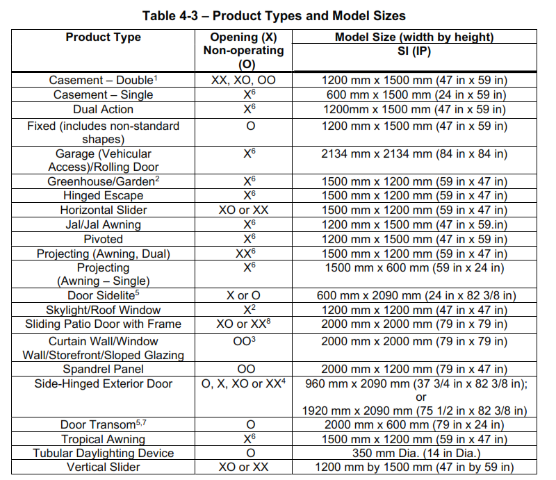

Assembly Window Output Reporting
================

**Jason Glazer, GARD Analytics**

 - June 4, 2021
 

## Justification for New Feature ##

Currently, EnergyPlus does not provide or allow output reporting for assembly 
U-factors for glazing systems. This task will enhance EnergyPlus output 
reporting and allow reporting for assembly U-factors for glazing systems. The 
glazing systems shall include windows and frames. 

In addition, [Issue #6530](https://github.com/NREL/EnergyPlus/issues/6530) says:

> Problem: EnergyPlus only reports U-factor, SHGC, and VT for center-of-glass. It 
> does not report those values for the whole window.
> 
> Rationale: It is very important for modelers to confirm that the window systems 
> (glass layers, gas layers, frames, dividers, shades, etc.) have been input 
> correctly and reporting standard rating values from EnergyPlus’s models is very
> helpful to close the loop.
> 
> Solution: Add content to the fenestration summary report for whole window 
> U/SHGC/VT. Calculate the whole-window metrics using procedures defined by NFRC 
> and consistent with LBNL Window program. Correct any problems with how frame and 
> edge-of-glass regions are input and modeled to make EnergyPlus’s whole-window 
> representation consistent with NFRC and LBNL Window program.
> 
> Context: Frame and edge-of-glass effects can be significant making whole-window 
> performance values very different from center-of-glass values. NFRC uses 
> whole-window U/SHGC/VT for performance ratings. EnergyPlus echoes out 
> center-of-glass U/SHGC/VT but that information is not complete when modeling 
> frames, dividers, etc.

## E-mail and  Conference Call Conclusions ##

None yet.

## Overview ##

Use the updated Windows Calculation Engine to compute the overall assembly 
U-factor, SHGC, and VT for fenestration. 

Since NFRC rates window assemblies at certain sizes, the user will specify 
the type of window based on the list from 
[NFRC 100](https://nfrccommunity.org/store/viewproduct.aspx?id=1380591) 
when specifying the WindowProperty:FrameAndDivider.

## Approach ##

The Windows Calculation Engine (WCE) has recently been updated to include the 
calculation of the overall assembly U-factor, SHGC, and VT for fenestration that
includes frames. This will be getting merged into EnergyPlus and after that the
window.vt(), window.uValue(), window.SHGC() methods will be used for calculating
the overall window properties. Converting the current frame information into frame
information compatible with the WCE will need to be done.

The WCE procedure is described in the 
[WINDOW Technical Documentation -Chapter 2 and 3](https://windows.lbl.gov/sites/default/files/Downloads/WINDOW%20Technical%20Documentation.pdf)
and the general procedures are described in 
[NFRC 100](https://nfrccommunity.org/store/viewproduct.aspx?id=1380591)
 and [NFRC 200](https://nfrccommunity.org/store/viewproduct.aspx?id=1402116).

The output will be new columns in the Exterior Fenestration and Interior Fenestration 
tables of the Envelope Summary report. The new columns would show the overall assembly
U-factor, SHGC, and VT for NFRC rated window sizes as well as the NFRC product type. 
For each NRFC product type a rated size is used to compute the overall assembly 
u-factor, SHGC and VT. The sizes for each NFRC product type are shown in the NFRC 
100 Table 4-3, reproduced below.



A new field will be added to WindowProperty:FrameAndDivider to indicate the NFRC product
type. The default value for this field will be Curtain Wall which is one of the most common
commerical window types.

In order to understand when the assembly outputs should be shown, some simulations were 
performed to identify when the envelope summary report was populated:

- WindowMaterial:Glazing, WindowMaterial:Gas

- Construction:WindowEquivalentLayer, WindowMaterial:Glazing:EquivalentLayer, 
WindowMaterial:Gap:EquivalentLayer, WindowMaterial:Shade:EquivalentLayer, 
WindowMaterial:Screen:EquivalentLayer**

- Construction:ComplexFenestrationState, Matrix:TwoDimension, 
WindowMaterial:Glazing, WindowMaterial:Gap

- Construction:ComplexFenestrationState, Matrix:TwoDimension, 
WindowMaterial:Glazing, WindowMaterial:Gap, WindowProperty:FrameAndDivider

- Construction:WindowDataFile/ Window5DataFile.dat**

- WindowMaterial:SimpleGlazingSystem

- WindowMaterial:GlazingGroup:Thermochromic

- WindowMaterial:Glazing:RefractionExtinctionMethod

All cases shown created the proper columns in the Exterior Fenestration table of the 
Envelope Summary report with and without WindowProperty:FrameAndDivider except the two shown 
with double-asterisks. In those cases, the addition of the WindowProperty:FrameAndDivider
resulted in an error being generated. 

The error with Construction:WindowEquivalentLayer with an WindowProperty:FrameAndDivider 
indicated that it was not supported. The error with Construction:WindowDataFile
and WindowProperty:FrameAndDivider showed that the frame was going to be repalced 
with what was present in the Window5DataFile.dat file. Those errors seem reasonable
and will not be addressed.


## Testing/Validation/Data Sources ##

Comparing results with the values from WINDOW program.

## Input Output Reference Documentation ##

The only change the input output reference is shown below with underlines:

1.10.59 WindowProperty:FrameAndDivider

...

<ins>Field: NFRC Product Type for Assembly Calculations

The selection made for this field corresponds to NFRC 100 "Procedure for 
Determining Fenestration Product U-factors" product types which are used when 
computing the overall u-factor, SHGC, and visual transmittance. The default is 
CurtainWall. The options are: CasementDouble, CasementSingle, DualAction, 
Fixed, Garage, Greenhouse, HingedEscape, HorizontalSlider, Jal, Pivoted, 
Projecting, DoorSidelite, Skylight, SlidingPatioDoor, CurtainWall, 
SpandrelPanel, SideHingedDoor, DoorTransom, TropicalAwning, 
TubularDaylightingDevice, and VerticalSlider. The sizes used in the calculation
of the overall u-factor, overall SHGC, and overall VT are based on NFRC 
100 Table 4-3, reproduced below.
</ins>


 

7.4.1.1.5 Envelope Summary
The Envelope Summary report (key: EnvelopeSummary) produces a report that 
includes the following tables:

* Opaque which includes all opaque surfaces and includes the name of the 
construction, reflectance, U-Factor, gross area, azimuth, tilt, cardinal 
direction.

* Fenestration which includes all non-opaque surfaces and includes the name of 
the construction, areas (glass, frame, divider, single opening, multiplied 
openings), glass U-Factor, glass SHGC (the solar heat gain coefficient based on 
summer conditions), glass visible transmittance, <ins>NFRC Product Type, assembly
U-Factor, assembly SHGC, assembly visible transmittance,</ins> conductance 
(frame, divider), indication of shade control, the name of the parent surface, 
azimuth, tilt, cardinal direction. <ins>The assembly result include the effect
of the frame and divider and are only produced when WindowProperty:FrameAndDivider
input object is used. In addition, the assembly columns are shown for most 
configurations but are not shown when using Construction:WindowEquivalentLayer and
other equivalent layer input object or when using Construction:WindowDataFile 
with a Window5DataFile.dat file.</ins>

<ins>Differences should still be expected between the results from EnergyPlus 
and the WINDOW program for the u-factor, SHGC, and visible transmittance, 
both glass and assembly. This differences are based on algorithmic differences
between the two programs even though they do share some code in the Windows 
Calculation Engine, other portions of the algorithms differ. In addition, the 
reported values may not match the NFRC rated values seen on a label because of 
differences between the calculations in EnergyPlus and the exact NFRC rating 
procedures including grouping of products.</ins>


## Input Description ##

The  only input change is to provide the user a way to specify the NFRC product type so
that the assembly u-factor, SHGC and VT are computed for a standard NFRC size.

```
WindowProperty:FrameAndDivider,
...
  A3,  \field NFRC Product Type for Assembly Calculations
       \type choice
       \key CasementDouble
       \key CasementSingle
       \key DualAction
       \key Fixed
       \key Garage
       \key Greenhouse
       \key HingedEscape
       \key HorizontalSlider
       \key Jal
       \key Pivoted
       \key ProjectingSingle
       \key ProjectingDual
       \key DoorSidelite
       \key Skylight
       \key SlidingPatioDoor
       \key CurtainWall
       \key SpandrelPanel
       \key SideHingedDoor
       \key DoorTransom
       \key TropicalAwning
       \key TubularDaylightingDevice
       \key VerticalSlider
       \default CurtainWall
```

## Outputs Description ##

The current Envelope Summary report consists of six tables:

* Opaque Exterior
* Opaque Interior
* Exterior Fenestration
* Interior Fenestration
* Exterior Door
* Interior Door

Of these, the Exterior Fenestration and Interior Fenestration tables will be modified.

The current version of those tables is shown below:

<b>Exterior Fenestration</b><br><br>
<!-- FullName:Envelope Summary_Entire Facility_Exterior Fenestration-->
<table border="1" cellpadding="4" cellspacing="0">
  <tr><td></td>
    <td align="right">Construction</td>
    <td align="right">Glass Area [m2]</td>
    <td align="right">Frame Area [m2]</td>
    <td align="right">Divider Area [m2]</td>
    <td align="right">Area of One Opening [m2]</td>
    <td align="right">Area of Multiplied Openings [m2]</td>
    <td align="right">Glass U-Factor [W/m2-K]</td>
    <td align="right">Glass SHGC</td>
    <td align="right">Glass Visible Transmittance</td>
    <td align="right">Frame Conductance [W/m2-K]</td>
    <td align="right">Divider Conductance [W/m2-K]</td>
    <td align="right">Shade Control</td>
    <td align="right">Parent Surface</td>
    <td align="right">Azimuth [deg]</td>
    <td align="right">Tilt [deg]</td>
    <td align="right">Cardinal Direction</td>
  </tr>
  <tr>
    <td align="right">WF-1</td>
    <td align="right">DBL CLR 3MM/13MM AIR</td>
    <td align="right">       16.56</td>
    <td align="right">        0.00</td>
    <td align="right">        0.00</td>
    <td align="right">       16.56</td>
    <td align="right">       16.56</td>
    <td align="right">       2.720</td>
    <td align="right">       0.764</td>
    <td align="right">       0.812</td>
    <td align="right">&nbsp;</td>
    <td align="right">&nbsp;</td>
    <td align="right">No</td>
    <td align="right">FRONT-1</td>
    <td align="right">      210.00</td>
    <td align="right">       90.00</td>
    <td align="right">S</td>
  </tr>
  <tr>
    <td align="right">DF-1</td>
    <td align="right">SGL GREY 3MM</td>
    <td align="right">        5.25</td>
    <td align="right">        0.00</td>
    <td align="right">        0.00</td>
    <td align="right">        5.25</td>
    <td align="right">        5.25</td>
    <td align="right">       5.894</td>
    <td align="right">       0.716</td>
    <td align="right">       0.611</td>
    <td align="right">&nbsp;</td>
    <td align="right">&nbsp;</td>
    <td align="right">No</td>
    <td align="right">FRONT-1</td>
    <td align="right">      210.00</td>
    <td align="right">       90.00</td>
    <td align="right">S</td>
  </tr>
  <tr>
    <td align="right">WR-1</td>
    <td align="right">DBL CLR 3MM/13MM AIR</td>
    <td align="right">        9.12</td>
    <td align="right">        0.00</td>
    <td align="right">        0.00</td>
    <td align="right">        9.12</td>
    <td align="right">        9.12</td>
    <td align="right">       2.720</td>
    <td align="right">       0.764</td>
    <td align="right">       0.812</td>
    <td align="right">&nbsp;</td>
    <td align="right">&nbsp;</td>
    <td align="right">No</td>
    <td align="right">RIGHT-1</td>
    <td align="right">      120.00</td>
    <td align="right">       90.00</td>
    <td align="right">E</td>
  </tr>
  <tr>
    <td align="right">WB-1</td>
    <td align="right">DBL CLR 3MM/13MM AIR</td>
    <td align="right">       16.44</td>
    <td align="right">        0.00</td>
    <td align="right">        0.00</td>
    <td align="right">       16.44</td>
    <td align="right">       16.44</td>
    <td align="right">       2.720</td>
    <td align="right">       0.764</td>
    <td align="right">       0.812</td>
    <td align="right">&nbsp;</td>
    <td align="right">&nbsp;</td>
    <td align="right">No</td>
    <td align="right">BACK-1</td>
    <td align="right">       30.00</td>
    <td align="right">       90.00</td>
    <td align="right">N</td>
  </tr>
  <tr>
    <td align="right">DB-1</td>
    <td align="right">SGL GREY 3MM</td>
    <td align="right">        4.41</td>
    <td align="right">        0.00</td>
    <td align="right">        0.00</td>
    <td align="right">        4.41</td>
    <td align="right">        4.41</td>
    <td align="right">       5.894</td>
    <td align="right">       0.716</td>
    <td align="right">       0.611</td>
    <td align="right">&nbsp;</td>
    <td align="right">&nbsp;</td>
    <td align="right">No</td>
    <td align="right">BACK-1</td>
    <td align="right">       30.00</td>
    <td align="right">       90.00</td>
    <td align="right">N</td>
  </tr>
  <tr>
    <td align="right">WL-1</td>
    <td align="right">DBL CLR 3MM/13MM AIR</td>
    <td align="right">        9.12</td>
    <td align="right">        0.00</td>
    <td align="right">        0.00</td>
    <td align="right">        9.12</td>
    <td align="right">        9.12</td>
    <td align="right">       2.720</td>
    <td align="right">       0.764</td>
    <td align="right">       0.812</td>
    <td align="right">&nbsp;</td>
    <td align="right">&nbsp;</td>
    <td align="right">No</td>
    <td align="right">LEFT-1</td>
    <td align="right">      300.00</td>
    <td align="right">       90.00</td>
    <td align="right">W</td>
  </tr>
  <tr>
    <td align="right">Total or Average</td>
    <td align="right">&nbsp;</td>
    <td align="right">&nbsp;</td>
    <td align="right">&nbsp;</td>
    <td align="right">&nbsp;</td>
    <td align="right">&nbsp;</td>
    <td align="right">       60.90</td>
    <td align="right">       3.223</td>
    <td align="right">       0.756</td>
    <td align="right">       0.780</td>
    <td align="right">&nbsp;</td>
    <td align="right">&nbsp;</td>
    <td align="right">&nbsp;</td>
    <td align="right">&nbsp;</td>
    <td align="right">&nbsp;</td>
    <td align="right">&nbsp;</td>
    <td align="right">&nbsp;</td>
  </tr>
  <tr>
    <td align="right">North Total or Average</td>
    <td align="right">&nbsp;</td>
    <td align="right">&nbsp;</td>
    <td align="right">&nbsp;</td>
    <td align="right">&nbsp;</td>
    <td align="right">&nbsp;</td>
    <td align="right">       20.85</td>
    <td align="right">       3.391</td>
    <td align="right">       0.754</td>
    <td align="right">       0.769</td>
    <td align="right">&nbsp;</td>
    <td align="right">&nbsp;</td>
    <td align="right">&nbsp;</td>
    <td align="right">&nbsp;</td>
    <td align="right">&nbsp;</td>
    <td align="right">&nbsp;</td>
    <td align="right">&nbsp;</td>
  </tr>
  <tr>
    <td align="right">Non-North Total or Average</td>
    <td align="right">&nbsp;</td>
    <td align="right">&nbsp;</td>
    <td align="right">&nbsp;</td>
    <td align="right">&nbsp;</td>
    <td align="right">&nbsp;</td>
    <td align="right">       40.05</td>
    <td align="right">       3.136</td>
    <td align="right">       0.757</td>
    <td align="right">       0.785</td>
    <td align="right">&nbsp;</td>
    <td align="right">&nbsp;</td>
    <td align="right">&nbsp;</td>
    <td align="right">&nbsp;</td>
    <td align="right">&nbsp;</td>
    <td align="right">&nbsp;</td>
    <td align="right">&nbsp;</td>
  </tr>
</table>
<br><br>
<b>Interior Fenestration</b><br><br>
<!-- FullName:Envelope Summary_Entire Facility_Interior Fenestration-->
<table border="1" cellpadding="4" cellspacing="0">
  <tr><td></td>
    <td align="right">Construction</td>
    <td align="right">Area of One Opening [m2]</td>
    <td align="right">Area of Openings [m2]</td>
    <td align="right">Glass U-Factor [W/m2-K]</td>
    <td align="right">Glass SHGC</td>
    <td align="right">Glass Visible Transmittance</td>
    <td align="right">Parent Surface</td>
  </tr>
  <tr>
    <td align="right">Total or Average</td>
    <td align="right">&nbsp;</td>
    <td align="right">&nbsp;</td>
    <td align="right">        0.00</td>
    <td align="right">-</td>
    <td align="right">-</td>
    <td align="right">-</td>
    <td align="right">&nbsp;</td>
  </tr>
</table>

The new columns are propsed to be added after the glass only u-factor, SHGC and 
VT and a new footnote has been added:

<b>Exterior Fenestration</b><br><br>
<!-- FullName:Envelope Summary_Entire Facility_Exterior Fenestration-->
<table border="1" cellpadding="4" cellspacing="0">
  <tr><td></td>
    <td align="right">Construction</td>
    <td align="right">Glass Area [m2]</td>
    <td align="right">Frame Area [m2]</td>
    <td align="right">Divider Area [m2]</td>
    <td align="right">Area of One Opening [m2]</td>
    <td align="right">Area of Multiplied Openings [m2]</td>
    <td align="right">Glass U-Factor [W/m2-K]</td>
    <td align="right">Glass SHGC</td>
    <td align="right">Glass Visible Transmittance</td>
    <td align="right">NFRC Product Type</td>
    <td align="right">Assembly U-Factor [W/m2-K]</td>
    <td align="right">Assembly SHGC</td>
    <td align="right">Assembly Visible Transmittance</td>
    <td align="right">Frame Conductance [W/m2-K]</td>
    <td align="right">Divider Conductance [W/m2-K]</td>
    <td align="right">Shade Control</td>
    <td align="right">Parent Surface</td>
    <td align="right">Azimuth [deg]</td>
    <td align="right">Tilt [deg]</td>
    <td align="right">Cardinal Direction</td>
  </tr>
  <tr>
    <td align="right">WF-1</td>
    <td align="right">DBL CLR 3MM/13MM AIR</td>
    <td align="right">       16.56</td>
    <td align="right">        0.00</td>
    <td align="right">        0.00</td>
    <td align="right">       16.56</td>
    <td align="right">       16.56</td>
    <td align="right">       2.720</td>
    <td align="right">       0.764</td>
    <td align="right">       0.812</td>
    <td align="right"> CurtainWall</td>
    <td align="right">       ---  </td>
    <td align="right">       ---  </td>
    <td align="right">       ---  </td>
    <td align="right">&nbsp;</td>
    <td align="right">&nbsp;</td>
    <td align="right">No</td>
    <td align="right">FRONT-1</td>
    <td align="right">      210.00</td>
    <td align="right">       90.00</td>
    <td align="right">S</td>
  </tr>
  <tr>
    <td align="right">DF-1</td>
    <td align="right">SGL GREY 3MM</td>
    <td align="right">        5.25</td>
    <td align="right">        0.00</td>
    <td align="right">        0.00</td>
    <td align="right">        5.25</td>
    <td align="right">        5.25</td>
    <td align="right">       5.894</td>
    <td align="right">       0.716</td>
    <td align="right">       0.611</td>
    <td align="right"> CurtainWall</td>
    <td align="right">       ---  </td>
    <td align="right">       ---  </td>
    <td align="right">       ---  </td>
    <td align="right">&nbsp;</td>
    <td align="right">&nbsp;</td>
    <td align="right">No</td>
    <td align="right">FRONT-1</td>
    <td align="right">      210.00</td>
    <td align="right">       90.00</td>
    <td align="right">S</td>
  </tr>
  <tr>
    <td align="right">WR-1</td>
    <td align="right">DBL CLR 3MM/13MM AIR</td>
    <td align="right">        9.12</td>
    <td align="right">        0.00</td>
    <td align="right">        0.00</td>
    <td align="right">        9.12</td>
    <td align="right">        9.12</td>
    <td align="right">       2.720</td>
    <td align="right">       0.764</td>
    <td align="right">       0.812</td>
    <td align="right"> CurtainWall</td>
    <td align="right">       ---  </td>
    <td align="right">       ---  </td>
    <td align="right">       ---  </td>
    <td align="right">&nbsp;</td>
    <td align="right">&nbsp;</td>
    <td align="right">No</td>
    <td align="right">RIGHT-1</td>
    <td align="right">      120.00</td>
    <td align="right">       90.00</td>
    <td align="right">E</td>
  </tr>
  <tr>
    <td align="right">WB-1</td>
    <td align="right">DBL CLR 3MM/13MM AIR</td>
    <td align="right">       16.44</td>
    <td align="right">        0.00</td>
    <td align="right">        0.00</td>
    <td align="right">       16.44</td>
    <td align="right">       16.44</td>
    <td align="right">       2.720</td>
    <td align="right">       0.764</td>
    <td align="right">       0.812</td>
    <td align="right"> CurtainWall</td>
    <td align="right">       ---  </td>
    <td align="right">       ---  </td>
    <td align="right">       ---  </td>
    <td align="right">&nbsp;</td>
    <td align="right">&nbsp;</td>
    <td align="right">No</td>
    <td align="right">BACK-1</td>
    <td align="right">       30.00</td>
    <td align="right">       90.00</td>
    <td align="right">N</td>
  </tr>
  <tr>
    <td align="right">DB-1</td>
    <td align="right">SGL GREY 3MM</td>
    <td align="right">        4.41</td>
    <td align="right">        0.00</td>
    <td align="right">        0.00</td>
    <td align="right">        4.41</td>
    <td align="right">        4.41</td>
    <td align="right">       5.894</td>
    <td align="right">       0.716</td>
    <td align="right">       0.611</td>
    <td align="right"> CurtainWall</td>
    <td align="right">       ---  </td>
    <td align="right">       ---  </td>
    <td align="right">       ---  </td>
    <td align="right">&nbsp;</td>
    <td align="right">&nbsp;</td>
    <td align="right">No</td>
    <td align="right">BACK-1</td>
    <td align="right">       30.00</td>
    <td align="right">       90.00</td>
    <td align="right">N</td>
  </tr>
  <tr>
    <td align="right">WL-1</td>
    <td align="right">DBL CLR 3MM/13MM AIR</td>
    <td align="right">        9.12</td>
    <td align="right">        0.00</td>
    <td align="right">        0.00</td>
    <td align="right">        9.12</td>
    <td align="right">        9.12</td>
    <td align="right">       2.720</td>
    <td align="right">       0.764</td>
    <td align="right">       0.812</td>
    <td align="right"> CurtainWall</td>
    <td align="right">       ---  </td>
    <td align="right">       ---  </td>
    <td align="right">       ---  </td>
    <td align="right">&nbsp;</td>
    <td align="right">&nbsp;</td>
    <td align="right">No</td>
    <td align="right">LEFT-1</td>
    <td align="right">      300.00</td>
    <td align="right">       90.00</td>
    <td align="right">W</td>
  </tr>
  <tr>
    <td align="right">Total or Average</td>
    <td align="right">&nbsp;</td>
    <td align="right">&nbsp;</td>
    <td align="right">&nbsp;</td>
    <td align="right">&nbsp;</td>
    <td align="right">&nbsp;</td>
    <td align="right">       60.90</td>
    <td align="right">       3.223</td>
    <td align="right">       0.756</td>
    <td align="right">       0.780</td>
    <td align="right">       ---  </td>
    <td align="right">       ---  </td>
    <td align="right">       ---  </td>
    <td align="right">       ---  </td>
    <td align="right">&nbsp;</td>
    <td align="right">&nbsp;</td>
    <td align="right">&nbsp;</td>
    <td align="right">&nbsp;</td>
    <td align="right">&nbsp;</td>
    <td align="right">&nbsp;</td>
    <td align="right">&nbsp;</td>
  </tr>
  <tr>
    <td align="right">North Total or Average</td>
    <td align="right">&nbsp;</td>
    <td align="right">&nbsp;</td>
    <td align="right">&nbsp;</td>
    <td align="right">&nbsp;</td>
    <td align="right">&nbsp;</td>
    <td align="right">       20.85</td>
    <td align="right">       3.391</td>
    <td align="right">       0.754</td>
    <td align="right">       0.769</td>
    <td align="right">       ---  </td>
    <td align="right">       ---  </td>
    <td align="right">       ---  </td>
    <td align="right">       ---  </td>
    <td align="right">&nbsp;</td>
    <td align="right">&nbsp;</td>
    <td align="right">&nbsp;</td>
    <td align="right">&nbsp;</td>
    <td align="right">&nbsp;</td>
    <td align="right">&nbsp;</td>
    <td align="right">&nbsp;</td>
  </tr>
  <tr>
    <td align="right">Non-North Total or Average</td>
    <td align="right">&nbsp;</td>
    <td align="right">&nbsp;</td>
    <td align="right">&nbsp;</td>
    <td align="right">&nbsp;</td>
    <td align="right">&nbsp;</td>
    <td align="right">       40.05</td>
    <td align="right">       3.136</td>
    <td align="right">       0.757</td>
    <td align="right">       0.785</td>
    <td align="right">       ---  </td>
    <td align="right">       ---  </td>
    <td align="right">       ---  </td>
    <td align="right">       ---  </td>
    <td align="right">&nbsp;</td>
    <td align="right">&nbsp;</td>
    <td align="right">&nbsp;</td>
    <td align="right">&nbsp;</td>
    <td align="right">&nbsp;</td>
    <td align="right">&nbsp;</td>
    <td align="right">&nbsp;</td>
  </tr>
</table>
<i>Note: Values shown on this table may not match results from the WINDOW program or the NFRC label when using simplified inputs.</i>

<br><br>
<b>Interior Fenestration</b><br><br>
<!-- FullName:Envelope Summary_Entire Facility_Interior Fenestration-->
<table border="1" cellpadding="4" cellspacing="0">
  <tr><td></td>
    <td align="right">Construction</td>
    <td align="right">Area of One Opening [m2]</td>
    <td align="right">Area of Openings [m2]</td>
    <td align="right">Glass U-Factor [W/m2-K]</td>
    <td align="right">Glass SHGC</td>
    <td align="right">Glass Visible Transmittance</td>
    <td align="right">NFRC Product Type</td>
    <td align="right">Assembly U-Factor [W/m2-K]</td>
    <td align="right">Assembly SHGC</td>
    <td align="right">Assembly Visible Transmittance</td>
    <td align="right">Parent Surface</td>
  </tr>
  <tr>
    <td align="right">Total or Average</td>
    <td align="right">&nbsp;</td>
    <td align="right">&nbsp;</td>
    <td align="right">        0.00</td>
    <td align="right">-</td>
    <td align="right">-</td>
    <td align="right">-</td>
    <td align="right"> CurtainWall</td>
    <td align="right">       ---  </td>
    <td align="right">       ---  </td>
    <td align="right">       ---  </td>
    <td align="right">&nbsp;</td>
  </tr>
</table>
<i>Note: Values shown on this table may not match results from the WINDOW program or the NFRC label when using simplified inputs.</i>
<br>


### EIO Report ###

In addition the EIO report includes the WindowConstruction data if the following is included in the IDF file

Output:Constructions,Constructions;

and currently produces:

! <WindowConstruction>,Construction Name,Index,#Layers,Roughness,Conductance {W/m2-K},SHGC,Solar Transmittance at Normal Incidence,Visible Transmittance at Normal Incidence
 WindowConstruction,DBL CLR 3MM/13MM AIR,6,3,VerySmooth,2.720,0.764,0.705,0.812

this will be enhanced to produce: 

! <WindowConstruction>,Construction Name,Index,#Layers,Roughness,Conductance {W/m2-K},SHGC,Solar Transmittance at Normal Incidence,Visible Transmittance at Normal Incidence, NFRC Product Type, Assembly U-Factor, Assembly SHGC, Assembly Visible Transmittance
 WindowConstruction,DBL CLR 3MM/13MM AIR,6,3,VerySmooth,2.720,0.764,0.705,0.812,CurtainWall, ---, ---, ---


## Engineering Reference ##

No changes expected in the engineering reference.

## Example File and Transition Changes ##

All example files that use WindowProperty:FrameAndDivider will have the new field added.

Output changes to the tabular output files are as described above.

### ERR File ###

The error messages that are generated when WindowProperty:FrameAndDivider is used with 

- Construction:WindowEquivalentLayer, WindowMaterial:Glazing:EquivalentLayer,
WindowMaterial:Gap:EquivalentLayer, WindowMaterial:Shade:EquivalentLayer, 
WindowMaterial:Screen:EquivalentLayer

- Construction:WindowDataFile/ Window5DataFile.dat

will be updated to specifically indicate that assembly output reporting has not been performed.

## References ##

[WINDOW Technical Documentation -Chapter 2 and 3](https://windows.lbl.gov/sites/default/files/Downloads/WINDOW%20Technical%20Documentation.pdf)

[ANSI/NFRC 100-2020](https://nfrccommunity.org/store/viewproduct.aspx?id=1380591) Procedure for Determining Fenestration Product U-factors

[ANSI/NFRC 200-2020](https://nfrccommunity.org/store/viewproduct.aspx?id=1402116) Procedure for Determining Fenestration Product Solar Heat Gain Coefficient and Visible Transmittance at Normal Incidence 


## Design Document ##

The EnvelopeSummary report is defined in the OutputReportPredefined.cc file in SetPredefinedTables() and this will be further modified to add the 
new columns and footnotes.

HeatBalanceSurfaceManager.cc in GatherForPredefinedReport() is where most of the columns are populated which is called 
when state.dataGlobal->BeginSimFlag is true

Additional calls from this routine will add the values for the additional columns which will utilize recently added functionality of the WindowsCalculationEngine.

An example of this is shown at:

https://github.com/LBNL-ETA/Windows-CalcEngine/blob/main/src/Tarcog/tst/units/SingleVisionWindow.unit.cpp

and consists of creating a window based on Tarcog::ISO15099::WindowSingleVision, adding the glazing and frame and
then calling vt(), uValue(), and shgc() methods. The size of the window will be based the user selected size entered
by the user in the new "NFRC Product Type for Assembly Calculations" field in the WindowProperty:FrameAndDivider
input object.

Additional unit tests in OutputReportTabular.unit.cc and HeatBalanceSurfaceManager.unit.cc

Additional changes may also be required to implement the feature.


