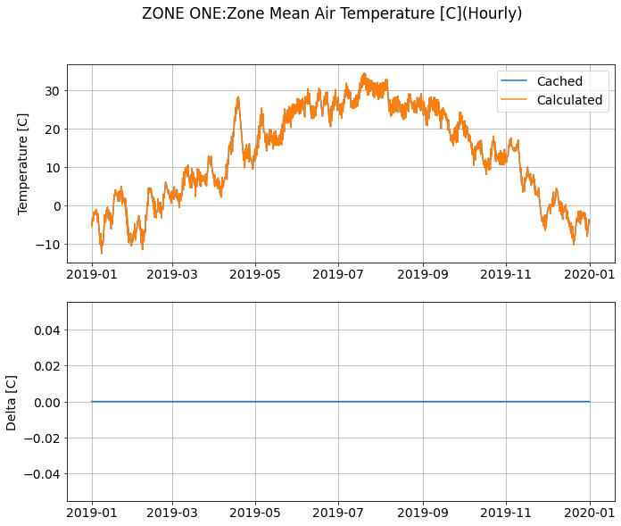

# Caching CTF Data

**Matt Mitchell, NREL**

- Draft Date: July 21, 2020
- Revised: July 27, 2020. Adding comments from Rick Strand.
- Revised: July 29, 2020. Adding comments from Amir Roth.
- Revised: August 25, 2020. Updating with runtime testing results.

## Introduction

EnergyPlus simulations are nearly always run multiple times during model development and design cycles; however, some of the computations performed are likely to never change for subsequent runs. One of these data which are regenerated during each run are conduction transfer functions (CTF). Once the building type and associated constructions have been specified, the CTF values computed will never change. Currently, these CTF values are recomputed during each simulation but this could potentially be eliminated if methods were developed for storing and reusing the CTF values.

The computation time for computing CTF values increases non-linearly with the number of layers in the construction. Similarly, the time required for generating CTF values for 2D radiant systems also increases due to the increasing number of nodes. In general, as the number of layers or nodes increases, so too does the required computation time.

HPC users may also see benefits from a supported data caching method. HPC users make many millions of simulations annually using EnergyPlus, oftentimes varying only a handful of parameters. It's likely that some of the data computed during each simulation, (e.g. CTFs) could be distributed with the simulations prior to execution to help reduce simulation times. Even if the fraction of simulation time saved per simulation is small, the resulting total time to execute a batch of simulations could see meaningful reductions in runtime.

Beyond the CTFs and HPC special use case, there likely exists other data and use cases which could benefit from methods for reusing calculation data. For example, the ground heat exchanger model already implements a basic data caching method, but perhaps there are other model data which could be stored or saved. However, this work will focus on testing whether saving CTF values can be done effectively. Saving other data will be treated separately.

## Approach

### Cache file format

The proposes implementation will not attempt to combine multiple data types. The CTF data will be stored in a file named "eplus.cache.ctfs.\<ext>". File formatting will be largely determined by the selected file format (e.g. JSON, text, etc.). This will continue to be evaluated during development.

### Testing

#### Timing Tests

To test the effectiveness of caching, a set of test materials and constructions were developed. The test materials are shown in Table 1 where a "low" and "high" value were chosen for each of the respective material object input parameters: thickness, conductivity, density, and specific heat. Roughness and absorptance values were held constant since these values are not expected to have an effect on the CTF calculations.

**TABLE 1: Test Materials**

|   Material | Roughness   |   Thickness {m} |   Conductivity {W/m-K} |   Density {kg/m3} |   Specific Heat {J/kg-K} |   Thermal Absorptance |   Solar Absorptance |   Visible Absorptance |   Mass {kg/m2} |   RhoCp {J/m3-K} |   Capacitance {J/m2-K} |   Resist {m2-K/W} |
|-----------:|:------------|----------------:|-----------------------:|------------------:|-------------------------:|----------------------:|--------------------:|----------------------:|---------------:|-----------------:|-----------------------:|------------------:|
|          1 | Smooth      |            0.01 |                   0.01 |               200 |                      400 |                   0.5 |                 0.5 |                   0.5 |              2 |            80000 |                    800 |            1      |
|          2 | Smooth      |            0.1  |                   0.01 |               200 |                      400 |                   0.5 |                 0.5 |                   0.5 |             20 |            80000 |                   8000 |           10      |
|          3 | Smooth      |            0.01 |                 100    |               200 |                      400 |                   0.5 |                 0.5 |                   0.5 |              2 |            80000 |                    800 |            0.0001 |
|          4 | Smooth      |            0.1  |                 100    |               200 |                      400 |                   0.5 |                 0.5 |                   0.5 |             20 |            80000 |                   8000 |            0.001  |
|          5 | Smooth      |            0.01 |                   0.01 |              3000 |                      400 |                   0.5 |                 0.5 |                   0.5 |             30 |          1200000 |                  12000 |            1      |
|          6 | Smooth      |            0.1  |                   0.01 |              3000 |                      400 |                   0.5 |                 0.5 |                   0.5 |            300 |          1200000 |                 120000 |           10      |
|          7 | Smooth      |            0.01 |                 100    |              3000 |                      400 |                   0.5 |                 0.5 |                   0.5 |             30 |          1200000 |                  12000 |            0.0001 |
|          8 | Smooth      |            0.1  |                 100    |              3000 |                      400 |                   0.5 |                 0.5 |                   0.5 |            300 |          1200000 |                 120000 |            0.001  |
|          9 | Smooth      |            0.01 |                   0.01 |               200 |                     1500 |                   0.5 |                 0.5 |                   0.5 |              2 |           300000 |                   3000 |            1      |
|         10 | Smooth      |            0.1  |                   0.01 |               200 |                     1500 |                   0.5 |                 0.5 |                   0.5 |             20 |           300000 |                  30000 |           10      |
|         11 | Smooth      |            0.01 |                 100    |               200 |                     1500 |                   0.5 |                 0.5 |                   0.5 |              2 |           300000 |                   3000 |            0.0001 |
|         12 | Smooth      |            0.1  |                 100    |               200 |                     1500 |                   0.5 |                 0.5 |                   0.5 |             20 |           300000 |                  30000 |            0.001  |
|         13 | Smooth      |            0.01 |                   0.01 |              3000 |                     1500 |                   0.5 |                 0.5 |                   0.5 |             30 |          4500000 |                  45000 |            1      |
|         14 | Smooth      |            0.1  |                   0.01 |              3000 |                     1500 |                   0.5 |                 0.5 |                   0.5 |            300 |          4500000 |                 450000 |           10      |
|         15 | Smooth      |            0.01 |                 100    |              3000 |                     1500 |                   0.5 |                 0.5 |                   0.5 |             30 |          4500000 |                  45000 |            0.0001 |
|         16 | Smooth      |            0.1  |                 100    |              3000 |                     1500 |                   0.5 |                 0.5 |                   0.5 |            300 |          4500000 |                 450000 |            0.001  |

Next, the materials were layered together to form construction objects with 1, 3, 5, 7, or 10 layers of the each respective materials. For example, Construction-1 (C1) had 1 layer of Material-1 (M1); C2 contained 3 layers of M1; C3 contained 5 layers of M1; etc. This resulted in 80 unique construction objects. A unit test was then developed to load these construction objects, calculate the CTF values, and log the computation time. The CTF calculation methods failed to computed CTF values for some of the construction objects. As as result, these construction objects were dropped.

The "cross", "flux", "inside" and "outside" CTF coefficient values were then written simple individual JSON files. No effort was made to control the precision of the values written, though, it appears that full precision is already being preserved. An example JSON file is given below.

```
{
  "cross": [0.7534891589389994, 0.24513326166871127, 8.311944716197864e-05, 1.5173546651170973e-14, 0.0, 0.0, 0.0, 0.0, 
    0.0, 0.0, 0.0, 0.0, 0.0, 0.0, 0.0, 0.0, 0.0, 0.0, 0.0],
  "flux": [0.0012944599459252804, -8.13117813459681e-13, 0.0, 0.0, 0.0, 0.0, 0.0, 0.0, 0.0, 0.0, 0.0, 0.0, 0.0, 0.0,
    0.0, 0.0, 0.0, 0.0],
  "inside": [1.4193503471297266, -0.4207854213428547, 0.00014061426803597566, -2.0941704011183845e-14, 0.0, 0.0, 0.0,
    0.0, 0.0, 0.0, 0.0, 0.0, 0.0, 0.0, 0.0, 0.0, 0.0, 0.0, 0.0],
  "name": "CONST-1",
  "outside": [1.419350347129726, -0.42078542134285474, 0.00014061426803597537, -2.0941703991542773e-14, 0.0, 0.0, 0.0,
    0.0, 0.0, 0.0, 0.0, 0.0, 0.0, 0.0, 0.0, 0.0, 0.0, 0.0, 0.0]
}
```

Once the CTF values were written to a JSON file for each construction object, the time required to instantiate a new construction object, load the data from the JSON file, and insert the cached CTF values into the arrays on the construction object was determined. A summary of the calculated time, cached time, and other test data are provided in Table 2, which are the averaged results from
5 runs.

**TABLE 2: CTF Calculation and Cache Time Summary**

|   Construction |   Material |   Num Layers |   Time Calc [us] |   Time Cached [us] |   % Benefit | Speed Up   |
|---------------:|-----------:|-------------:|-----------------:|-------------------:|------------:|:-----------|
|              1 |          1 |            1 |             72   |               63   |        12.5 | 1.1x       |
|              2 |          1 |            3 |             70.6 |               35.4 |        49.9 | 2.0x       |
|              3 |          1 |            5 |           1985.2 |               30.8 |        98.4 | 64.5x      |
|              4 |          1 |            7 |           6478   |               31.4 |        99.5 | 206.3x     |
|              5 |          1 |           10 |          22408   |               39.4 |        99.8 | 568.7x     |
|              6 |          2 |            1 |             28   |               28.8 |        -2.9 | 1.0x       |
|              7 |          2 |            3 |            175   |               37.6 |        78.5 | 4.7x       |
|              8 |          2 |            5 |           9862.2 |               46.6 |        99.5 | 211.6x     |
|              9 |          2 |            7 |          77018.4 |               41.6 |        99.9 | 1851.4x    |
|             10 |          2 |           10 |         726962   |               41.4 |       100   | 17559.5x   |
|             11 |          3 |            1 |             34.8 |               22.4 |        35.6 | 1.6x       |
|             12 |          3 |            3 |             71.4 |               21.8 |        69.5 | 3.3x       |
|             13 |          3 |            5 |           1974.8 |               32   |        98.4 | 61.7x      |
|             14 |          3 |            7 |           6274.6 |               24.6 |        99.6 | 255.1x     |
|             15 |          3 |           10 |          21940   |               21.8 |        99.9 | 1006.4x    |
|             16 |          4 |            1 |             23   |               22.4 |         2.6 | 1.0x       |
|             17 |          4 |            3 |             80.8 |               22.2 |        72.5 | 3.6x       |
|             18 |          4 |            5 |           1987.8 |               22   |        98.9 | 90.4x      |
|             19 |          4 |            7 |           6320.6 |               21.8 |        99.7 | 289.9x     |
|             20 |          4 |           10 |          21628.6 |               22.6 |        99.9 | 957.0x     |
|             21 |          5 |            1 |             24   |               25.6 |        -6.7 | 0.9x       |
|             22 |          5 |            3 |             76.6 |               32   |        58.2 | 2.4x       |
|             23 |          5 |            5 |           1173.6 |               39   |        96.7 | 30.1x      |
|             24 |          5 |            7 |           7758.2 |               38.6 |        99.5 | 201.0x     |
|             25 |          5 |           10 |          47405.6 |               39.4 |        99.9 | 1203.2x    |
|             26 |          6 |            1 |            432.8 |               39.4 |        90.9 | 11.0x      |
|             27 |          6 |            3 |          37991.2 |               40.6 |        99.9 | 935.7x     |
|             31 |          7 |            1 |             30.6 |               22.4 |        26.8 | 1.4x       |
|             32 |          7 |            3 |             85.4 |               21.8 |        74.5 | 3.9x       |
|             33 |          7 |            5 |           2062   |               29.8 |        98.6 | 69.2x      |
|             34 |          7 |            7 |           6434.4 |               22.4 |        99.7 | 287.2x     |
|             35 |          7 |           10 |          22852.8 |               22.8 |        99.9 | 1002.3x    |
|             36 |          8 |            1 |             26.4 |               21.8 |        17.4 | 1.2x       |
|             37 |          8 |            3 |             79.4 |               23   |        71   | 3.5x       |
|             38 |          8 |            5 |           1921.4 |               29.6 |        98.5 | 64.9x      |
|             39 |          8 |            7 |           6248.2 |               25.2 |        99.6 | 247.9x     |
|             40 |          8 |           10 |          21234.2 |               26   |        99.9 | 816.7x     |
|             41 |          9 |            1 |             24.8 |               24.8 |         0   | 1.0x       |
|             42 |          9 |            3 |             69.6 |               26.6 |        61.8 | 2.6x       |
|             43 |          9 |            5 |           1794.2 |               30   |        98.3 | 59.8x      |
|             44 |          9 |            7 |           5968.4 |               33.6 |        99.4 | 177.6x     |
|             45 |          9 |           10 |          21926.8 |               44.8 |        99.8 | 489.4x     |
|             46 |         10 |            1 |            139.2 |               35.8 |        74.3 | 3.9x       |
|             47 |         10 |            3 |           7767.8 |               40.2 |        99.5 | 193.2x     |
|             48 |         10 |            5 |         281588   |               40.8 |       100   | 6901.7x    |
|             51 |         11 |            1 |             27.4 |               22.2 |        19   | 1.2x       |
|             52 |         11 |            3 |             67.2 |               21.6 |        67.9 | 3.1x       |
|             53 |         11 |            5 |           1923.8 |               21.4 |        98.9 | 89.9x      |
|             54 |         11 |            7 |           6256.4 |               21.6 |        99.7 | 289.6x     |
|             55 |         11 |           10 |          22138.8 |               23.4 |        99.9 | 946.1x     |
|             56 |         12 |            1 |             22.6 |               21.8 |         3.5 | 1.0x       |
|             57 |         12 |            3 |             72.2 |               22   |        69.5 | 3.3x       |
|             58 |         12 |            5 |           1973.4 |               23.4 |        98.8 | 84.3x      |
|             59 |         12 |            7 |           6404.4 |               24.4 |        99.6 | 262.5x     |
|             60 |         12 |           10 |          21516.2 |               23.2 |        99.9 | 927.4x     |
|             61 |         13 |            1 |             23.8 |               25.4 |        -6.7 | 0.9x       |
|             62 |         13 |            3 |             60.6 |               32.4 |        46.5 | 1.9x       |
|             63 |         13 |            5 |           2789   |               39.2 |        98.6 | 71.1x      |
|             64 |         13 |            7 |          18062.8 |               48.2 |        99.7 | 374.7x     |
|             65 |         13 |           10 |         152133   |               57   |       100   | 2669.0x    |
|             66 |         14 |            1 |            509.8 |               40.2 |        92.1 | 12.7x      |
|             71 |         15 |            1 |             16.6 |               22.4 |       -34.9 | 0.7x       |
|             72 |         15 |            3 |             79.6 |               21.6 |        72.9 | 3.7x       |
|             73 |         15 |            5 |           2044   |               21.4 |        99   | 95.5x      |
|             74 |         15 |            7 |           7023   |               21.4 |        99.7 | 328.2x     |
|             75 |         15 |           10 |          22404   |               23.2 |        99.9 | 965.7x     |
|             76 |         16 |            1 |             24.4 |               21.6 |        11.5 | 1.1x       |
|             77 |         16 |            3 |             67.6 |               22.8 |        66.3 | 3.0x       |
|             78 |         16 |            5 |           1957.8 |               30.2 |        98.5 | 64.8x      |
|             79 |         16 |            7 |           6294.8 |               26.8 |        99.6 | 234.9x     |
|             80 |         16 |           10 |          21622.4 |               29.2 |        99.9 | 740.5x     |

Table 3 shows a simple average summary of the timing tests. In some cases, it would appear that even for constructions with 1 layer it may be effective to load a cached set of CTF coefficients rather than recomputing them. The effectiveness increases fairly rapidly from there, indicating that for construction objects with even as few as 3 layers it is significantly faster to load the values from a cache.

**TABLE 3: Simple Average Summary of Timing Tests**

|   Num Layers |   Time Calc [us] |   Time Cached [us] |   % Benefit | Speed Up   |
|-------------:|-----------------:|-------------------:|------------:|:-----------|
|            1 |             91.3 |               28.8 |        20.9 | 2.6x       |
|            3 |           3121.0 |               28.1 |        70.6 | 78.0x      |
|            5 |          22502.7 |               31.2 |        98.6 | 568.5x     |
|            7 |          12810.9 |               29.4 |        99.6 | 385.1x     |
|           10 |          88167.0 |               31.9 |        99.9 | 2296.3x    |

*Caveat*
- These times represent the bare-minimum we could possibly be doing with respect to caching. The cached values are simply loaded back into the arrays based on construction name matching only. In practice, we should definitely be doing more regarding validation of data by making sure that the IDF construction and material object parameters match those in the cached CTF data.

#### Results Tests

A plot comparing the zone temperature for the ```1ZoneUncontrolled.idf``` example file are shown in Figure 1. For this case, only the four CTF arrays and four other data from the construction object needed to be stored in the cache file. This will need to be evaluated further for radiant systems.



## Remaining questions

### Where does cache data live?

- Install directory?
- Run directory?
- User-specified location?
- If the simulation can access multiple caches, which is given priority?

### Cache size limits?

- When do we warn the user to clear the cache?
- Does it get continually appended to, or updated each time, or do values roll off after a certain number of simulation calls?

### Cache matching

- How are the parameter tolerance values determined?
- What happens when you begin to chain tolerances together?
- Do all parameters values need to match or could some fuzzy matching be accepted?

### Caching effectiveness

At some point, caching may not be the fastest solution. Perhaps if they have 3 CTFs to compute the time to load the file and compare the results is greater than just recomputing. This will be evaluated during testing.
