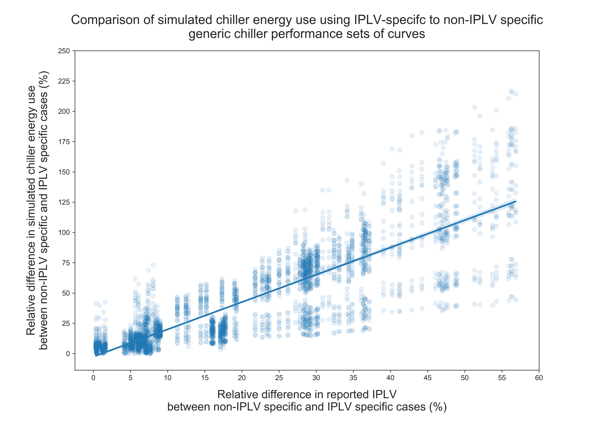

Code Compliant Equipment Dataset
================

Jeremy Lerond, Aowabin Rahman, Jian Zhang, Reid Hart, Michael Rosenberg, PNNL

 - 09/07/2021 

## Justification for New Feature ##
EnergyPlus requires modelers to select sets of performance curves to describe the part load performance of modeled HVAC equipment. While full load efficiency metrics can often be used as a direct input in models, performance curves dictate what the part load efficiency metric of a modeled piece of equipment is at different part load operating conditions.

HVAC equipment rarely, if ever, operate exactly at their full load rated conditions so it is really important to select performance curves that appropriately describe their part load performance. When modeling an existing piece of equipment this can be done by generating performance curves using published manufacturer expanded performance tables. Part load code minimum efficiencies are not targeted at or intended to describe a single specific equipment model or brand but to represent the minimum performance of a group of equipment. Groups are generally defined by equipment size, application, and configuration (e.g., air- and water-cooled chillers). To the authors’ knowledge, there is currently no publicly available resources or methodology to generate such sets of performance curves, that is sets of metric specific generic performance curves for BES.

For years, chillers have been required in many building energy codes to have both a minimum full (expressed as a EER, COP, or kW/ton value) and part load efficiency (expressed as an IPLV value) which make them a good candidate for developing a methodology to develop such a set of curves.

## E-mail and Conference Call Conclusions ##

## Overview ##
The proposed changes add a new dataset, `CodeCompliantEquipment.idf`, that includes chiller performance curves to be use to meet the minimum requirements in ASHRAE 90.1-2019 and its Appendix G. We propose that the same dataset be improved and supplemented at a later date with additional performance curves for other equipment types (for instance: IEER-rated DX equipment).

## Approach ##
Generating chiller performances curves meeting both full and part load efficiency numbers require solving a largely underdetermined system of equations. The number of unknowns depend on the type of curves, which mostly depend on the algorithm used by the software and used in models. It also means that an infinite number of solutions exists. One way to solve this issue is to turn it into a constrained problem and use a simple genetic algorithm (GA) with a well-defined objective or cost function to determine potential solutions with physical significance. A GA can have a short computational time, be scalable, versatile, find solutions to problems with large number of parameters to problems with multiple local optima so it is a good candidate for this task.

The implemented algorithm, which uses a GA, starts with a “seed” set of curves that can be user-modifiable, target full load, and part load efficiency as inputs was designed. The GA reproduces the process of natural selection on an initial population and subsequent generations. Individuals in the initial population are generated from the seed curves by randomly modifying the coefficient of each curve. An objective, fitness, or cost function is defined and is used to grade each individual solution on how close or how far their results are from the target. Following the grading of each individual solution, some of the best performers are retained, others are discarded, and some are used to create new individual solutions during the “crossover” process by combining the best performing sets of curves together. Finally, some individuals are randomly modified during the “mutation” process to avoid local optima. The process is repeated (i.e., new generations are created) until an individual matching the targets is identified. Generation after generation, the average fitness improves until the target is met.

While any sets of curves can be technically used as an input to generate a full and part load specific set of curves, it is important to first generate generic sets of performance curves as the final curves depend strongly on the seed curves. As such, data was collected using in part existing publicly available chiller performance curves datasets and by collecting data of currently available equipment using manufacturer equipment selection software. Performance curves were created for that newly obtained data.

Among others, a “nearest neighbor” type method was developed to aggregate sets of curves and generate a generic set of curves for a specific target. This method selects the N sets of performance curves for chillers that best match the targeted chiller characteristics in terms of capacity, full load efficiency, part load efficiency, condenser type, compressor type, and compressor speed control. Each selected sets of curves are scored based on how close it is to the targeted chiller characteristics. A wide mesh of values for each input variable(s) to each curve is then created and corresponding output calculated. The outputs are then weighted average based on their previously determined score. A regression and normalization at rated conditions is then performed to obtain the aggregated curves.

The GA and seed curve generation process were implemented using the Python programming language and converted into a Python package that will be published under open-source license and thus publicly available.

Using that package, sets of performance curves for the 90.1-2019 chiller minimum efficiency requirements and the 90.1 Appendix G chiller requirements were generated following both the AHRI Standards 550/590 IPLV (IPLV.IP) and 551/591 IPLV (IPLV.SI). It is important to note that performance curves are specific to the algorithm supported by the building energy modeling software and chosen by the modeler. EnergyPlus and DOE-2.2, two of the most widely used building energy modeling software for code compliance, share a chiller model in common that can be used to simulate both air- and water-cooled chillers. It describes the varying performance of a chiller based on the entering condenser temperature, chilled water temperature, and part load ratio. Performance curves for this algorithm were generated. The package also supports the generation of curves using the `Chiller:Electric:ReformulatedEIR` chiller model implemented in EnergyPlus which uses the leaving condenser temperature instead of the entering condenser temperature as a primary independent variable. Curves for this model are not included in the proposed changes but will be at a later date.

While the GA can provide solutions by finding curves coefficients for all curves types, to reduce the pool of potential candidates for each requirement, the GA was only run on the performance curves that are a function of a chiller’s part load ratio, the other curves being kept identical to the seed curves generated using the aggregation process.

## Testing/Validation/Data Sources ##
To ensure the reasonableness of the proposed curves, for each code requirement that they represent, two simulations in three prototypical building models (a hotel, large office, and school) and across all 19 ASHRAE climate zones were run: one using the performance curves included in this PR and one using publicly available part load performance curves which are not part load requirement specific. For each case, we compared the difference in reported IPLV against the chiller energy use. The results are presented in the Figure below. We can see that, in general, as the difference in reported IPLV increases, the difference in cooling energy use increases, which is expected. There is a wide range chiller energy use difference for each level of difference in IPLV, this can be explained by the fact that simulations were run in climate zone with significantly different weather conditions.

The authors would like to point out that to obtain the IPLV.IP and IPLV.SI specific curves, the actual rated conditions from the AHRI Standard 550/590 and 551/591 were used (with a tolerance of 0.5% in IPLV value). Currently, EnergyPlus uses a mix of rated conditions from both Standard 550/590 and 551/591, see issue [#8967](https://github.com/NREL/EnergyPlus/issues/8967) so the IPLV reported when using the curves included in this PR might differ a bit. As mentioned in the issue, we hope that in the future EnergyPlus can report both a chiller's IPLV.IP and IPLV.SI.

## Input Output Reference Documentation ##
A description of the dataset is added to the "OutputDetailsAndExamples" guide.

## Input Description ##
N/A

## Outputs Description ##
N/A

## Engineering Reference ##
N/A

## Example File and Transition Changes ##
N/A

## References ##
* ASHRAE. 2021. BSR/ASHRAE Standard 205P Representation of Performance Data for HVAC&R and Other Facility Equipment (PPR3). Atlanta: ASHRAE.
* California Univ., Berkeley. Lawrence Berkeley Lab., Washington, DC. Department of Energy, and NM. Los Alamos National Lab. 1981. "DOE-2 Engineers Manual (Version 2.1A)." Technical Report.
* Drury B. Crawley, Curtis O. Pedersen, Linda K. Lawrie, Frederick C. Winkelmann. 2000. EnergyPlus: Energy Simulation Program. 
* Lerond, Jeremy. 2019. "Algorithmically Generated Chiller Performance Curves for Building Energy Simulation." ASHRAE Transaction. Atlanta: ASHRAE. 93-95.

