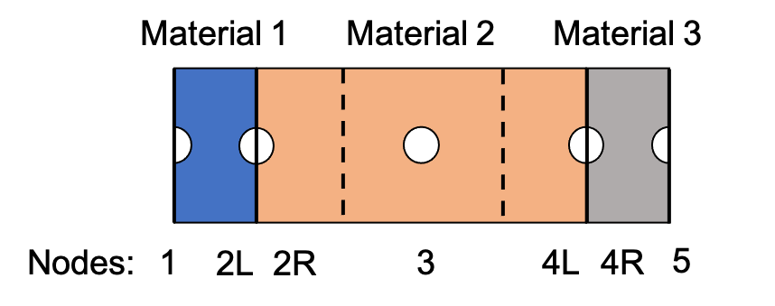

# CondFD Surface EMS Actuators

**Matt Mitchell, NREL**

- December 9, 2020 - Initial Draft

## Overview

Internal NREL users have requested the ability better model dynamic insulation and tunable PCM surfaces within EnergyPlus via the CondFD surfaces. They have also requested the ability to actuate these controls from the Python Plugin System - E+ API, as well as asked for additional report variables from the CondFD surfaces. This work enables these new workflows. 

This project will add EMS actuators and appropriate E+ API functionality to allow users to directly specify the thermal conductivity (k) and specific heat (cp) values for the layers of a surface which correspond to a specific material layer.

## Implementation

The EMS actuators have been implemented to be associated with each material layer of each surface. This results in the material properties for the entire material layer being updated rather than requiring the user to attempt to keep track of how many layers each respective material layer has and then define the actuators. 

As show in the figure below with three different material layers, three actuators for k and cp, respectively, are added to be associated with Material 1, Material 2, and Material 3. Modifications to the properties for Material 1 will result in modified property values for nodes 1 and 2L. Material 2 modifies nodes 2R, 3, and 4L, etc.



The actuators are implemented to override the k and cp values after the IDF-defined phase change property modifications are set, effectively overriding them and allowing EMS to have the final say in the state of the k and cp property values.

Actuator-specific unique key values are determined from the surface name concatenated with the material name with a colon ":". For example, the unique key for surface "Zn001:Wall001" and material layer "WallStudAndCavityk1" would be "Zn001:Wall001:WallStudAndCavityk1". Within the Python code, this would possibly be applied as shown in the following example to obtain the appropriate handle for the thermal conductivity of this layer.

```python
comp_type = "CondFD Surface Material Layer"
ctrl_type = "Thermal Conductivity"

surf_name =  "Zn001:Wall001"
mat_name = "WallStudAndCavityk1"
actuator_key = f"{surf_name}:{mat_name}"

k_handle = self.api.exchange.get_actuator_handle(state, comp_type, ctrl_type, actuator_key)
```

The code is not implemented to check or warn the user if the EMS user-defined property values violate the Fourier number used to determine node spacing which was determined upon surface initialization. 

$$\mbox{Fo} = \frac{\alpha \Delta t}{\Delta x^2}$$

Therefore, it is expected that the user will specify the properties in the IDF file which result in the "worst-case" properties condition which would cause the FD node spacing to be set to the tightest value. This will need to be included in the documentation.

## API

Two new methods were added to the EnergyPlus API from this work. These are outlined below.

- ```condFDReady``` - CondFD surfaces may not be setup and ready by the time the existing ```apiDataFullyReady``` returns successfully, so an additional method/flag was added to ensure that the user could verify that the CondFD surfaces are ready to be actuated. This simply returns 1 if the CondFDReady flag is set to TRUE, and 0 otherwise.

  ```c++
  int condFDReady();
  ```

- ```numNodesInMaterialLayer```  CondFD surface layer-specific *output variables* are accessed by layer number. i.e., "Output:Variable,\*,CondFD Phase Change Node Temperature 1,hourly", "Output:Variable,\*,CondFD Phase Change Node Conductivity 1,hourly", etc. This will allow the users to query each surface material layer to determine the number of nodes in each layer. It's expected that users may wish to actuate controls based on wall node temperature values, so this enables the users to determine this information in a programmatic way. User can access this data by passing the surface name and material name. The method will return the number of nodes in the material layer if found, and 0 otherwise.

  ```c++
  int numNodesInMaterialLayer(std::string const &surfName, std::string const &matName);
  ```

## Testing

A new example file has been added to demonstrate the new features. The example file takes the ``1ZoneUncontrolled.idf`` file and  modifies it to actuate the "WallStudAndCavityk1" material layers for all wall surfaces based on some simple logic relationships between the outdoor air temperature and the zone air temperature. Additional testing will also be added to directly compare the phase change hysteresis model objects.

## Documentation

Some inline code documentation has been added, and additional documentation will be added later.

## IDD Changes and Transition

None
