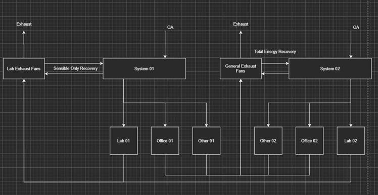

Dedicated Exhaust System for Flexible Exhaust Configurations
=============================================================

**J. Yuan & M.J. Witte, GARD Analytics**

 - Original Date: July 30, 2021
 - Revised: August 2, 2021, revise and start design
 - Revised: Dec 9, 2021, 


## Justification for New Feature ##

This new feature intends to provide a convenient way for multiple exhausts in different AirLoops to be combined to a central exhaust system. The need for this proposed feature stems from the practice of modeling general exhaust with a central exhaust duct. In a typical configuration, airflows are applied to offices and laboratories spaces from multiple airloops, and then the return or exhaust airflows are re-routed to different exhaust systems due to different exhaust heat recovery processes for the office spaces the lab spaces exhausts. This configuration can be shown in the following example (credit: the figure is provided by Sagar Rao at Affiliated Engineers Inc., the original requester of the feature):



Currently modeling this type of configuration in EnergyPlus requires workarounds (to be described in the overview section) and it is quite cumbersome to implement for large projects. According to the original requester, the workaround method could also result in comments about missing “exhaust fans” in the energy report during compliance reviews (e.g. CA Title-24, pp. 257, 2019 version [1], or ASHRAE 90.1 [2]). This calls for an easier way to model such exhaust streams, which would also allow more accurate part load calculations and reporting for the exhaust fans. The proposed work is thus about implementing such a new feature that will allow more flexible exhaust stream routing to meet the modeling needs described above.

Another application for such exhaust systems is health care. ANSI/ASHRAE/ASHE Standard 170-2017 [3] Ventilation of Health Care Facilities specifies that certain types of spaces have a requirement that "All Room Air Exhausted Directly to Outdoors," e.g. ER waiting rooms, laboratories, laundry, etc. This adds the requirement for exhaust flow to track supply flow which is not currently possible at the zone level.


## E-mail and Conference Call Conclusions ##

### E-mail Communications ###

- A few email exchanges with the original requester prior to and during the development of the NFP to clarify the development needs;

- Comment in [pull request #9925](https://github.com/NREL/EnergyPlus/pull/8925#issuecomment-891994628) regarding application for health care spaces with requirement that "All Room Air Exhausted Directly to Outdoors."

### Conference Call Communications ###

- A discussion at the Technicality conference call occurred before the development of the current NFP;

- An informal phone conversation with the original requester was conducted during the development of the current NFP about the development needs and the current workaround method.


## Overview ##

A few existing EnergyPlus modules are investigated for their potential capabilities for implementing the exhaust system configurations mentioned above. Here the capabilities and limitations of each of these solutions (of trying to use existing modules) are discussed and will be used to develop a new strategy for developing the new feature.

The first candidate to model such a system is to use the AirLoopHVAC:Mixer object, which needs to be used in a Dedicated Outdoor Air System (AirLoopHVAC:DedicatedOutdoorAirSystem). When using this object, multiple OutdoorAir:Mixer relief air nodes can be connected together with the AirLoopHVAC:Mixer to form one common exhaust outlet (to the outdoor) or to a heat recovery device. This seems to be a good candidate for combining multiple relief air streams to a general exhaust. However, the limitation is that the AirLoopHVAC:Mixer is only intended to be used by (and with) the AirLoopHVAC:DedicatedOutdoorAirSystem object, and it cannot be used for regular non-DOAS airloop system. Further, it is not intend to use with multiple return loops that span across multiple (DOAS) airloops, similar to the "intertwined" configuration shown in the example figure above.

The second potential candidate for modeling such an exhaust system is the AirLoopHVAC:ZoneMixer object to configure an AirLoopHVAC:ReturnPath object. The zone mixer will be able to combine the return airflow of multiple zones into one common outlet for a return path. The current limitation of this method is that the "return path" in general ends at the point where the collected return air combines into a central return duct. The exhaust path from the zones could take another path with the existing "return path". This configuration is not intended for use with multiple return paths that span across multiple airloops.

A third potential candidate is using the general Connector:Mixer object to develop the airloop topography. The Connector:Mixer will take several "branches" and connect them to a common outlet branch. This means that the Connector:Mixer actually works on the branch level and explicit branches need to be defined for each incoming and outgoing connections, which will be cumbersome to use when trying to connect many zones on larger projects. The configuration is also subject to the restrictions that the airloop system that multiple routed exhaust system is difficult to be correctly recognized by EnergyPlus. A few experiment trials were conducted to establish such a system using the method. However, although the branch-node topology looked correct, the air loop would not correctly simulate the exhaust airflows in such branch-node connections, due to the upstream-to-downstream modeling procedure of the air loop.

Currently, the original requester for the feature uses a workaround that uses EMS sensors to gather the different zone exhaust information and "virtually" mix them together via some pieces of EMS program code, and then feed the gathered flow information to a "dummy" actuatable system to accomplish the goal of modeling such a configuration.

Based on the existing modules' capabilities and limitations, we propose to add two new IDF objects to model such exhaust system configurations and to allow quick setup for larger simulation projects.


## Approach ##

The following new objects will be added to specify an exhaust system which serves one or more zones.

### AirLoopHVAC:ExhaustSystem ###

An AirLoopHVAC:ExhaustSystem defines how the exhaust air goes out from the zone(s). It is similar to a "Return Path", although it includes both a zone mixer (AirLoopHVAC:ZoneMixer type) and a central exhaust fan (Fan:SystemModel type). The inlets of the mixer will be from the exhaust system outlets (newly added ZoneHVAC:ExhaustControl, to be introduced soon) from one more more zones that are not necessarily belong to the same airloop. The outlet of the zone mixer will be the inlet of the central exhaust fan. The outlet node of the central exhaust fan can further served as the inlet to an (optional) energy recovery heat exchanger further downstream.

```
AirLoopHVAC:ExhaustSystem,
    Central Exhaust 1,            !- Name
    Exhaust Avail List,         !- Availability Manager List Name
    AirLoopExhaustMixer1,        !- AirLoopHVAC:ZoneMixer Name    
    Fan:SystemModel,            !- Fan Object Type
    CentralExhaustFan1;        !- Fan Name
```

The central exhaust fan object needs to be either FAN:SYSTEMMODEL or FAN:COMPONENTMODEL. The older fan models such as Fan:OnOff, Fan:ConstantVolume, or Fan:VariableVolume will not be allowed.

#### Expand the usage of the current AirLoopHVAC:ZoneMixer object ####

The existing AirLoopHVAC:ZoneMixer object will be expanded for use in the exhaust system. Currently the AirLoopHVAC:ZoneMixer is only allowed in a return path, or in a PIU-type zone equipment. A severe warning would show up if the zone mixer is not used (or referenced) with one of the following objects: AirLoopHVAC:ReturnPath, AirTerminal:SingleDuct:SeriesPIU:Reheat, AirTerminal:SingleDuct:ParallelPIU:Reheat, or AirTerminal:SingleDuct:ConstantVolume:FourPipeInduction.

In the current development, the AirLoopHVAC:ZoneMixer will be used as the connectors in the "Exhaust Path" system. This means that the zone mixer can be connected to the exhaust nodes (actually the outlet nodes of the newly developed ZoneHVAC:ExhaustControl object, to be introduced soon below) of one or more zones as inlets, and the outlet node of the mixer will be the inlet node of the central exhaust fan in the AirLoopHVAC:ExhaustSystem.

### ZoneHVAC:ExhaustControl ###

Each zone that is connected to an inlet node of an AirLoopHVAC:ExhaustSystem is required to have a ZoneHVAC:ExhaustControl object to describe the zone exhaust connections, design flow rate, and controls.

The ZoneHVAC:ExhaustControl object defines a controlled exhaust flow from a zone. The inlet node for the ZoneHVAC:ExhaustControl object is a zone exhaust node. The outlet node object is one of the inlets for the AirLoopHVAC:ZoneMixer object that will be used in an AirLoopHVAC:ExhaustSystem object. It is similar to Fan:ZoneExhaust but without indivdual fans. It assumes a central exhaust fan drives the flows, with additional control options, similar to (but probably vertile than) a damper for exhaust flow control.

One piece of important information about each of the individual zone exhausts is the design flow rate. This will be autosizable with options base on area, outdoor air flow or suppy flow.

**OPTION FOR DISCUSSION:** Should the sizing options for exhaust flow rate be here in the ZoneHVAC:ExhaustControl object, or in Sizing:Zone, or any other places???.
```
ZoneHVAC:ExhaustControl,
    Zone2 Exhaust System,           !-Name
    HVACOperationSchd,              !- Availability Schedule Name
    Zone2 Exhaust Node,             !- Inlet Node Name
    Zone2 ExhaustSystem Node,       !- Outlet Node Name
    0.1,                            !- Design Flow Rate {m3/s}
    Scheduled,                      !- Flow Control Type (Scheduled, FollowSupply, Other?)
    Zone2 Exhaust Flow Sched,       !- Flow Fraction Schedule Name
    ,                               !- Supply Node or NodeList Name (used with FollowSupply control type)
    ,                               !- Minimum Zone Temperature Limit Schedule Name
    Zone2 Min Exhaust Flow Sched,   !- Minimum Flow Fraction Schedule Name
    FlowBalancedSched;              !- Balanced Exhaust Fraction Schedule Name
```

It is also possible to included multiple ZoneHVAC:ExhaustControl objects for a single zone, such as multiple exhaust hoods in a laboratory [4, 5] which may operate on different schedules. 

### Reporting ###

For each exhaust system, the central exhaust flow (design, total, max, and min), temperature, and humidity conditions will be added to a table named "Exhaust Systems". For each of the exhaust systems, the flow conditions at each individual zone exhaust will also be reported.

### IDD changes ###

The following IDD blocks will be added to the Energy+.idd file.

#### IDD Addition for AirLoopHVAC:ExhaustSystem ####

After the AirLoopHVAC:ReturnPath block:
```
AirLoopHVAC:ExhaustSystem,
       \memo Defines a general exhaust systems with a central exhaust fan drawing from one or more
       \memo ZoneHVAC:ExhaustControl outlet nodes.
  A1 , \field Name
       \required-field
       \note Name of the exhaust system
  A2 , \field Availability Manager List Name
       \note Enter the name of an AvailabilityManagerAssignmentList object.
       \note If this field is blank, the exhaust system is always available.
       \type object-list
       \object-list SystemAvailabilityManagerLists
  A3 , \field AirLoopHVAC:ZoneMixer Name
       \required-field
       \note The name of the exhaust system AirLoopHVAC:ZoneMixer
       \object-list ZoneMixers
  A4 , \field Fan Object Type
       \required-field
       \type choice
       \key Fan:SystemModel
       \key Fan:ComponentModel
  A5 ; \field Fan Name
       \required-field
       \type object-list
       \object-list FansSystemModel
       \object-list FansComponentModel
```

#### #### IDD Addition for ZoneHVAC:ExhaustControl ####

At the end of the `ZoneHVAC Forced Air Units` group (or another position might be at the end of the `Zone HVAC Air Loop Terminal Units` group): 

```
ZoneHVAC:ExhaustControl,
       \memo Defines a controlled exhaust flow from a zone which feeds into 
       \memo an AirloopHVAC:Exhaust system inlet.
  A1 , \field Name
       \required-field
  A2 , \field Availability Schedule Name
       \note Availability schedule name for this exhaust system. Schedule value > 0 means it is available.
       \note If this field is blank, the exhaust system is always available. If the attached 
       \note AirloopHVAC:ExhaustSystem is off, then the flow will be zero.
       \type object-list
       \object-list ScheduleNames
  A3 , \field Inlet Node Name
       \note Inlet node name for the exhaust system
       \required-field
       \type node
  A4 , \field Outlet Node Name
       \note Outlet node name for the exhaust system
       \required-field
       \type node
  N1 , \field Design Exhaust Flow Rate 
       \autosizable
       \units m3/s
       \minimum> 0
       \default autosize
  A5 , \field Flow Control Type
       \note Control type of the exhaust fan
       \type choice
       \key Scheduled
       \key FollowSupply
       \default Scheduled
  A6 , \field Exhaust Flow Fraction Schedule Name
       \note Schedule name of the exhaust flow fraction. Used only with Scheduled control type.
       \note If this field is blank, the flow fraction is always 1.0.
       \type object-list
       \object-list ScheduleNames
  A7 , \field Supply Node or NodeList Name
       \note Used only with FollowSupply control type.
       \type node
  A8,  \field Minimum Zone Temperature Limit Schedule Name
       \note Schedule name of the Minimum Zone Temperature Limit
       \type object-list
       \object-list ScheduleNames
  A9 , \field Minimum Exhaust Flow Fraction Schedule Name
       \note Schedule name of the minimum exhaust flow fraction
       \type object-list
       \object-list ScheduleNames
  A10; \field Balanced Exhaust Fraction Schedule Name
       \note Schedule name of the Balance Exhaust Fraction
       \type object-list
       \object-list ScheduleNames
```

### Air mass and heat balance ###

The exhaust flows from ZoneHVAC:ExhaustControl will be treated the same as any exhaust flow from a zone. The existing zone and airloop mass balances will work the same as the currently do with Fan:ZoneExhaust.

### Controls and operation modes ###

For the control and operation modes of such an exhaust system, two scenarios will be considered: 

1. The first scenario will cover the mode where the central exhaust flow will be driven by the upstream airflow rates; in this case the exhaust system main flow will be determined by the individual ZoneHVAC:ExhaustControl flow rates and fraction schedules.

2. The second operation mode would consider that the exhaust fan can operate at a given flow rate, while the upstream zones may need re-balancing if one or more upstream zone exhausts are not actively controlled. In this scenario, the exhaust system will impact the upstream zone exhaust flow rate and a re-balancing scheme will be need to re-balance the exhaust flow rate at the upstream exhaust nodes.

### Sizing ###

The sizing for the central exhaust fan would depend on the sum of the individual inlets' design flow rates.

### Reporting ###

Although the central exhaust fan has its own report as an individual component, it would be beneficial to also have the exhaust flow included in the HVAC system or airloop reports.


## Testing and Validation ##

A few unit tests will be developed to verify that: 
1. the new input objects can be processed correctly, via one or two unit test case(s);
2. the zone and central exhaust air mass flow balances, via one or more unit test case(s);
3. the exhaust system results, output variables, and reports are working properly via one unit test.


## Example File and Transition Changes ##

One new example file will be added to the test suite to demonstrate how to use this feature. 

Since the feature is based on completely newly added blocks, an older version would not carry the feature. Therefore a transition program is not needed for converting from earlier versions.


## Input Output Reference Documentation ##

The proposed new feature development will add the following contents to the Input Output Reference document:

The AirLoopHVAC:ExhaustSystem and ZoneHVAC:ExhaustControl objects are used to describe the way that the exhaust air streams are configured. These objects provide a way for the exhaust air streams from multiple zones to be rerouted and recombined to form a new central exhausts. The exhaust system is composed of a central exhaust fan, the inlet nodes, (and an implicit exhaust mixer).

### AirLoopHVAC:ExhaustSystem Input Fields ###

The AirLoopHVAC:ExhaustSystem will take the following input fields:

#### Field: Name ####

The name of the exhaust system.

#### Field: Availability Schedule ####

This is the availability manager list name for the exhaust system.

#### Field: AirLoopHVAC:ZoneMixer Name ####

This is the name of the AirLoopHVAC:ZoneMixer object that connects the exhaust air streams from multiple zones. The zone mixer will have the inlet nodes for the exhaust system defined; and typically each inlet nodee must be the outlet node of a ZoneHVAC:ExhaustControl object.

#### Field: Fan Object Type ####

This is the type of fan object for the central exhaust fan. The avaiable choices are Fan:SystemModel or Fan:ComponentModel.

#### Field: Fan Name ####

This is a required field for the name of the central exhaust fan.

An example of the AirLoopHVAC:ExhaustSystem input object is like this:
```
AirLoopHVAC:ExhaustSystem,
    Central Exhaust 1,            !- Name
    Exhaust Avail List,         !- Availability Manager List Name
    AirLoopExhaustMixer1,        !- AirLoopHVAC:ZoneMixer Name    
    Fan:SystemModel,            !- Fan Object Type
    CentralExhaustFan1;        !- Fan Name
```

### ZoneHVAC:ExhaustControl Input Fields ###

The input fields for the ZoneHVAC:ExhaustControl object are as follows.

#### Field: Name ####

This is the name of the ZoneHVAC:ExhaustControl.

#### Field: Availablity Schedule Name ####

This is the aviability schedule name of the ZoneHVAC:ExhaustControl equipment. A schedule value of zero means off, and >0 means on. If the connected AirloopHVAC:ExhaustSystem is on, then this schedule may be used to turn on (or off) the ZoneHVAC:ExhaustControl system. If the connected AirloopHVAC:ExhaustSystem is off, then this ZoneHVAC:ExhaustControl system will be off, and this schedule will be ignored.

#### Field: Inlet Node Name ####

This is the inlet node name of the ZoneHVAC:ExhaustControl object. This must be an exhaust node of the zone.

#### Field: Outlet Node Name ####

This is the outlet node name of the ZoneHVAC:ExhaustControl object. This node must be connected to an AirLoopHVAC:ExhaustSystem object as an inlet node.

#### Field: Design Flow Rate {m3/s} ####

This numerical field is the design exhaust flow rate of the exhaust system in [m3/s]. This field is autosizeable. The default is autosize.

#### Field: Flow Control Type ####

This field is the the control type on how the exhaust flows are controlled. The available choices are: Scheduled or FollowSupply. Scheduled means that the target exhaust flow rate will be the Design Flow Rate times the Flow Fraction Schedule. FollowSupply means that the target exhaust flow rate will be the current total flow rate at the node(s) specified in Supply Node or NodeList Name times the Flow Fraction Schedule. For both control types, if the central exhaust fan is not able to meet the total target exhaust flow rate for all of its inlets, then the flow rate will be reduced proportionally to match the availble fan flow.

#### Field: Flow Fraction Schedule Name ####

This is the schedule name for the exhaust flow fraction. If left empty, the default value is 1.0. This schedule is only applied for Flow Control Type - Schedules.

#### Field: Supply Node or NodeList Name ####
This is the supply air node or nodelist name used for the `FollowSupply` flow control type.

#### Field: Minimum Zone Temperature Limit Schedule Name ####

This will be the minimum zone temperature limit schedule name. It will be used to shut down the exhaust flow rate to the Minimum Flow Fraction Schedule value if the zone temperature get below this temperature.

#### Field: Minimum Flow Fraction Schedule Name ####

This is the schedule name for the minimum exhaust flow fraction. If left empty, the default value would be 1.0.

#### Field: Balanced Exhaust Fraction Schedule Name ####

This field is optional. If it is not used, then all the exhaust air flow is assumed to be unbalanced by any simple airflows, such as infiltration, ventilation, or zone mixing. Unbalanced exhaust is then modeled as being provided by the outdoor air system in the central air system. **copy the rest from Fan:ZoneExhaust**. The modeling of unbalanced will reduce the flow rates at the zone’s return air node by the flow rate that is being exhausted and will ensure that the outdoor air flow rate is sufficient to serve the exhaust. If this field is used, then enter the name of a schedule with fractional values between 0.0 and 1.0, inclusive. This fraction is applied to the exhaust fan flow rate and the model tracks the portion of the exhaust that is balanced. Balanced exhaust is then modeled as being provided by simple airflows and does not impact the central air system return air or outdoor air flow rates. For example, if a kitchen zone with an exhaust fan is designed to draw half of its make up air from a neighboring dining room and the other half from the outdoor air system, then a schedule value of 0.5 could be used here. This input field must be blank when the zone air flow balance is enforced. If user specifies a schedule and zone air flow balance is enforced, then EnergyPlus throws a warning error message, ignores the schedule and simulation continues.

An example of the ZoneHVAC:ExhaustControl input object is like this:
```
ZoneHVAC:ExhaustControl,
    Zone2 Exhaust System,           !-Name
    HVACOperationSchd,              !- Availability Schedule Name
    Zone2 Exhaust Node,             !- Inlet Node Name
    Zone2 ExhaustSystem Node,       !- Outlet Node Name
    0.1,                            !- Design Flow Rate {m3/s}
    Scheduled,                      !- Flow Control Type (Scheduled, FollowSupply, Other?)
    Zone2 Exhaust Flow Sched,       !- Flow Fraction Schedule Name
    ,                               !- Supply Node or NodeList Name (used with FollowSupply control type)
    ,                               !- System Availability Manager Name
    ,                               !- Minimum Zone Temperature Limit Schedule Name
    Zone2 Min Exhaust Flow Sched,   !- Minimum Flow Fraction Schedule Name
    FlowBalancedSched;              !- Balanced Exhaust Fraction Schedule Name
```


## Input Description ##

See the Input Output Reference documentation contents update above.


## Outputs Description ##

The following output will be added the to the new exhaust system: 

```
Central Exhaust Fan Energy [J]
Central Exhaust Fan Power Rate [W];
Central Exhaust Fan Runtime Fraction [];
Central Exhaust Fan Volumetric Flow Rate [m3/s];
Central Exhaust Fan Mass Flow Rate [kg/s];
Central Exhaust Fan pressure drop [Pa];
Individual Exhaust Volumetric Flow Rate [m3/s]; 
Individual Exhaust Mass Flow Rate Rate [kg/s];
```

In addition, the tabular report will now also include the central exhaust fans' flow rates and energy.


## Engineering Reference ##

There would be no change about the fundamental methods in the the Engineering Reference. One potential addition though, is to document the assumptions and methods used to re-balance the zone exhaust airflows under the central exhaust fan driven operation mode.


## Reference ##

[1] Building Energy Efficiency Standards - Title 24, California Energy Commission. Link: https://www.energy.ca.gov/programs-and-topics/programs/building-energy-efficiency-standards

[2] ASHRAE Standard 90.1-2019. Energy Standard for buildings except low-rise Residential buildings. ASHRAE, Atlanta.

[3] ANSI/ASHRAE/ASHE Standard 170-2017, Ventilation of Health Care Facilities. ASHRAE, Atlanta.

[4] T. Smith, G.C. Bell, High-Performance Laboratory Exhaust Devices. Link: https://labs21.lbl.gov/workshop/AdvCourse-HPLabExhDev-5.pdf

[5] D. MacDonald, 2016. Laboratory Design Fundamentals. Link: https://ashraemadison.org/images/ASHRAE_Madison_Lab_Fundamentals_03_14_2016.pdf


## Designs ##

### Air Loop Calling Tree ###

#### getExhaustSystemInput() ####

A function to process the input fields for the AirLoopHVAC:ExhaustSystem object. It will read input information for the exhaust systems and update internal data for the components (such as the central exhaust fans, zone exhausts, and exhaust zone mixers) being read.

#### SizeExhaustSystemFans() ####

This function will be added to size the central exhaust system fans.

#### SimAirLoopExhaustSystems() ####

This function will be added to simulate the central exhaust system in the airloop. Here, since we choose not to tie a central exhaust system to a particular airloop, in this function it could loop through all the central exhaust systems to do the simulation.

One piece of information that needed exchange from the Zone Equipment calling tree is about the flow conditions from the incoming inlet of the AirLoopHVAC:ExhaustSystem objects. This could be done by calling `SimAirLoopExhaustSystem()` right before `CalcZoneMassBalance()` in `SimZoneEquipment()`. At this point, all of the target exhaust flow rates would have been set by the ZoneHVAC:ExhaustControl objects, and the central exhaust system can set the final exhaust node flow rates based on its availability and maximum fan flow.

#### AirLoopHVAC:ExhaustSystem data struct ####

This struct definition and declaration will create a new data struct for the AirLoopHVAC:ExhaustSystem object.

### Zone Equipment Calling Tree ###

#### SimZoneHVACExhaustAirSystem() ####

A new case will be added to `SimZoneEquipment` to call `SimZoneExhaustAirSystem()`.

However, the situation could be complicated by the general exhaust system's operation. Here based on If the AirloopHVAC:ExhaustSystem's condition, (e.g. "is on" or "is off"), the zone air balance will be treated differently. For example, when the AirLoopHVAC:ExhaustSystem is off, all inlet flows for the connected zone exhausts should be set to zero. This needs to be known at the time of the zone air mass balance. The call to `SimAirLoopExhaustSystem()` will be before the zone mass balance calculation (`CalcZoneMassBalance()`) which is near the end of `SimZoneEquipment`. `SimAirLoopExhaustSystem()` will reset the zone exhaust flow rates if needed.

#### ZoneHVAC:ExhaustControl data struct #### 

This struct definition and declaration will create a new data struct for the ZoneHVAC:ExhaustControl object.

### ReportAirLoopExhaustSystem() ###

The function is for reporting the variables related to the exhaust systems, such as the exhaust fans' flow rates, energy usages, and pressure drops.

