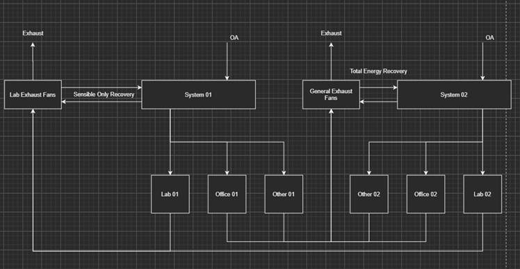

Delicated Exhaust Fans for General Exhaust
=====================================

**J. Yuan & M.J. Witte, GARD**

 - Original Date: July 13, 2021

## Justification for New Feature ##

This new feature provides a convenient way for multiple exhausts in different AirLoops to be combined to a central exhaust system. The need for this proposed feature stems from the practice of modeling general exhaust with a central exhaust duct. Currently this type of configuration requires workarounds in EnergyPlus and it is fairly tedious to accomplish on large projects. As a result, during a compliance review (e.g. CA Title-24, pp. 257, 2019 version), there are frequent complains about missing “exhaust fans” in the energy report. It is benificial to have easier ways to model a dedicated general exhaust stream, which would allow more accurate part loads reporting on the exhaust fans, thus facilitaing code compliance reviews.

## E-mail and Conference Call Conclusions ##

### E-mail Communication ###

## Overview ##

This work will implement code changes that will allow a more convenient approach to allow exhaust streams from multiple airloops to be re-routed and recombined to one or more general central exhaust systems. A typical example is the dedicated airflow supplied to multiple offices and laboratories spaces and then required different heat recovery processes for the office spaces exhausts and the lab spaces exhausts. The configuration of the example can be shown in the following figure: 



## Approach ##

The following new objects will be added to allow an AirLoopHVAC:ExhaustSystem to be described: 
```
AirLoopHVAC:ExhaustSystem,
    Central Exhaust,            !- Name
    Exhaust Avail List,         !- Availability Manager List Name
    Fan:SystemModel,            !- Component 1 Object Type
    Central Exhaust Fan,        !- Component 1 Name
    AirLoopHVAC:ExhaustMixer,   !- Component 2 Object Type
    Exhaust Mixer 1,            !- Component 2 Name
    Fan:ZoneExhaust,            !- Component 3 Object Type
    Zone1 Exhaust Fan;          !- Component 3 Name
```

The central fan model allowed in modeling this object needs to be either FAN:SYSTEMMODEL or FAN:COMPONENTMODEL. The regular fan models such as Fan:OnOff, Fan:ConstantVolume, or Fan:VariableVolume could not be used with the current object.

The AirLoopHVAC:ExahaustMixer is also to be added as a new object: 
```
AirLoopHVAC:ExhaustMixer,
    Exhaust Mixer 1,                !-Name
    Central Exhaust Fan Inlet Node, !- Outlet Node Name
    Zone2 Exhaust Node,             !- Inlet 1 Node Name
    0.1,                            !- Inlet 1 Design Flow Rate {m3/s}
    Zone2 Exhaust Flow Schedule,    !- Inlet 1 Flow Fraction Schedule Name
    Zone1 Exhaust Fan Outlet Node,  !- Inlet 2 Node Name
    ,                               !- Inlet 2 Design Flow Rate {m3/s}
    ;                               !- Inlet 2 Flow Fraction Schedule Name
```

In the example above, the Inlet 2 Design Flow Rate (m3/s) might not be needed as it is an existing zone exhaust fan. The set up tries to allow some flexiblities in the configurations in that one or more of the connect branch to the mixer can be without a branch fan. Further, the exhaust mixer will allow more than 2 inlet branches to be connected to the mixer. 

## IDD changes ##

The following IDD blocks will be added to the Energy+.idd file. 

### IDD Addition for AirLoopHVAC:ExhaustSystem ###

After the AirLoopHVAC:ReturnPath block and before the AirLoopHVAC:ExhaustMixer (to be added) blocks: 
```
AirLoopHVAC:ExhaustSystem,
       \extensible:2 - Just duplicate last two fields and comments (changing numbering, please)
       \memo Define dedicated exhaust systems that 
       \memo combines exhausts of multiple AirLoopHVAC systems
  A1 , \field Name
       \required-field
  A2 , \field Availability Schedule Name
       \note Availability schedule name for this exhaust system. Schedule value > 0 means it is available.
       \note If this field is blank, the exhaust system is always available.      
       \type object-list
       \object-list ScheduleNames
  A3 , \field Component 1 Object Type
       \begin-extensible  
       \required-field
       \type choice
       \key Fan:SystemModel
       \key Fan:ComponentModel
       \key AirLoopHVAC:ExhaustMixer
       \key Fan:ZoneExhaust
  A4 , \field Component 1 Name
       \required-field
       \type object-list
       \object-list FansSystemModel
       \object-list FansComponentModel
       \object-list AirLoopHVACExhaustMixerNames
       \object-list FansZoneExhaust
  A5 , \field Component 2 Object Type
       \type choice
       \key Fan:SystemModel
       \key Fan:ComponentModel
       \key AirLoopHVAC:ExhaustMixer
       \key Fan:ZoneExhaust
  A6 , \field Component 2 Name
       \type object-list
       \object-list FansSystemModel
       \object-list FansComponentModel
       \object-list AirLoopHVACExhaustMixerNames
       \object-list FansZoneExhaust
  A7 , \field Component 3 Object Type
       \type choice
       \key Fan:SystemModel
       \key Fan:ComponentModel
       \key AirLoopHVAC:ExhaustMixer
       \key Fan:ZoneExhaust
  A8;  \field Component 3 Name
       \type object-list
       \object-list FansSystemModel
       \object-list FansComponentModel
       \object-list AirLoopHVACExhaustMixerNames
       \object-list FansZoneExhaust
```

### IDD Addition for AirLooopHVAC:ExhaustMixer ###

After the AirLoopHVAC:ReturnPath block and the AirLoopHVAC:DedicatedOutdoorAirSystem blocks: 
```
AirLoopHVAC:ExhaustMixer,
       \extensible:3 - Just duplicate last three fields and comments (changing numbering, please)
       \memo Mix N exhaust air streams from Relief Air Stream Node
       \memo served by multiple AirLoopHVAC objects into one
       \memo (currently 10 as default, but extensible). Node names cannot
       \memo be duplicated within a single Exhaust mixer list.
  A1 , \field Name
       \required-field
       \reference AirLoopHVACExhaustMixerNames
  A2 , \field Outlet Node Name
       \required-field
       \type node
  A3 , \field Inlet 1 Node Name
       \begin-extensible
       \type node
  N1 , \field Inlet 1 Design Flow Rate {m3/s}
       \units m3/s
       \autosizable
       \default autosize
  A4 , \field Inlet 1 Flow Fraction Schedule Name
       \note Flow fraction schedule name for this Inlet. Schedule value is in range [0,1].
       \type object-list
       \object-list ScheduleNames
  A5 , \field Inlet 2 Node Name
       \type node
  N2 , \field Inlet 2 Design Flow Rate {m3/s}
       \units m3/s
       \autosizable
       \default autosize
  A6 , \field Inlet 2 Flow Fraction Schedule Name
       \note Flow fraction schedule name for this Inlet. Schedule value is in range [0,1].
       \type object-list
       \object-list ScheduleNames
  A7 , \field Inlet 3 Node Name
       \required-field
       \type node
  N3 , \field Inlet 3 Design Flow Rate {m3/s}
       \units m3/s
       \autosizable
       \default autosize
  A8 , \field Inlet 3 Flow Fraction Schedule Name
       \note Flow fraction schedule name for this Inlet. Schedule value is in range [0,1].
       \type object-list
       \object-list ScheduleNames
  A9 , \field Inlet 4 Node Name
       \type node
  N4 , \field Inlet 4 Design Flow Rate {m3/s}
       \units m3/s
       \autosizable
       \default autosize
  A10; \field Inlet 4 Flow Fraction Schedule Name
       \note Flow fraction schedule name for this Inlet. Schedule value is in range [0,1].
       \type object-list
       \object-list ScheduleNames
```

## Testing and Validation ##

(1) Verify that the new input objects can be processed correctly with one or two unit test cases(s);  
(2) Verify the zone, branch, and exhausts mass air flow balances with one or more unit test case(s).

## Example File and Transition Changes ##

One new example file will be added to the test suite to demonstrate how to use this feature. 

Since the feature addes compeletely new blocks, a transition program is not needed for converting the past versions. 

## Input Output Reference Documentation ##

The proposed new feature requires adding the following blocks to the IDD file:

The new outputs to be added will be the exhaust fan related energy. 

### Input Description ###

TBD.

### AirLoopHVAC:ExhaustSystem Input Fields ###

The AirLoopHVAC:Exhaust system has the following input fields: 
```
AirLoopHVAC:ExhaustSystem,
       \extensible:2 - Just duplicate last two fields and comments (changing numbering, please)
       \memo Define dedicated exhaust systems that 
       \memo combines exhausts of multiple AirLoopHVAC systems
  A1 , \field Name
       \required-field
  A2 , \field Availability Schedule Name
       \note Availability schedule name for this exhaust system. Schedule value > 0 means it is available.
       \note If this field is blank, the exhaust system is always available.      
       \type object-list
       \object-list ScheduleNames
  A3 , \field Component 1 Object Type
       \begin-extensible  
       \required-field
       \type choice
       \key Fan:SystemModel
       \key Fan:ComponentModel
       \key AirLoopHVAC:ExhaustMixer
       \key Fan:ZoneExhaust
  A4 , \field Component 1 Name
       \required-field
       \type object-list
       \object-list FansSystemModel
       \object-list FansComponentModel
       \object-list AirLoopHVACExhaustMixerNames
       \object-list FansZoneExhaust
  A5 , \field Component 2 Object Type
       \type choice
       \key Fan:SystemModel
       \key Fan:ComponentModel
       \key AirLoopHVAC:ExhaustMixer
       \key Fan:ZoneExhaust
  A6 , \field Component 2 Name
       \type object-list
       \object-list FansSystemModel
       \object-list FansComponentModel
       \object-list AirLoopHVACExhaustMixerNames
       \object-list FansZoneExhaust
  A7 , \field Component 3 Object Type
       \type choice
       \key Fan:SystemModel
       \key Fan:ComponentModel
       \key AirLoopHVAC:ExhaustMixer
       \key Fan:ZoneExhaust
  A8 , \field Component 3 Name
       \type object-list
       \object-list FansSystemModel
       \object-list FansComponentModel
       \object-list AirLoopHVACExhaustMixerNames
       \object-list FansZoneExhaust
  ...
```
       
### AirLooopHVAC:ExhaustMixer Input fields ###

The AirLoopHVAC:ExhaustMixer block will have the following input fields: 
```
AirLoopHVAC:ExhaustMixer,
       \extensible:3 - Just duplicate last three fields and comments (changing numbering, please)
       \memo Mix N exhaust air streams from Relief Air Stream Node
       \memo served by multiple AirLoopHVAC objects into one
       \memo (currently 10 as default, but extensible). Node names cannot
       \memo be duplicated within a single Exhaust mixer list.
  A1 , \field Name
       \required-field
       \reference AirLoopHVACExhaustMixerNames
  A2 , \field Outlet Node Name
       \required-field
       \type node
  A3 , \field Inlet 1 Node Name
       \begin-extensible
       \type node
  N1 , \field Inlet 1 Design Flow Rate {m3/s}
       \units m3/s
       \autosizable
       \default autosize
  A4 , \field Inlet 1 Flow Fraction Schedule Name
       \note Flow fraction schedule name for this Inlet. Schedule value is in range [0,1].
       \type object-list
       \object-list ScheduleNames
  A5 , \field Inlet 2 Node Name
       \type node
  N2 , \field Inlet 2 Design Flow Rate {m3/s}
       \units m3/s
       \autosizable
       \default autosize
  A6 , \field Inlet 2 Flow Fraction Schedule Name
       \note Flow fraction schedule name for this Inlet. Schedule value is in range [0,1].
       \type object-list
       \object-list ScheduleNames
  A7 , \field Inlet 3 Node Name
       \required-field
       \type node
  N3 , \field Inlet 3 Design Flow Rate {m3/s}
       \units m3/s
       \autosizable
       \default autosize
  A8 , \field Inlet 3 Flow Fraction Schedule Name
       \note Flow fraction schedule name for this Inlet. Schedule value is in range [0,1].
       \type object-list
       \object-list ScheduleNames
  ...
```

## Outputs Description ##

TBD: One of the considerations here is to determine whether the existing outputs are enough (e.g. from a fan's output variables), or a new "Exhaust Fan" related output variable set is need? 

```
Central Exhaust Fan Energy [J]
Central Exhaust Fan Power Rate [W];
Central Exhaust Fan Runtime Fraction [];
Central Exhaust Fan Volumetric Flow Rate [m3/s];
Central Exhaust Fan Mass Flow Rate [kg/s];
Central Exhaust Fan pressure drop [Pa];
```

## Engineering Reference ##

The Engineering Reference will be updated as needed. 

## References ##

NA


## Function Designs ##

### AirLoopHVAC:ExhaustSystem data struct ###

Create a new data struct for the AirLoopHVAC:ExhaustSystem object.

### AirLoopHVAC:ExhaustMixer data struct ###

Create a new data struct for the AirLoopHVAC:ExhaustMixer object. This could be simlar to AirLoopHVAC:Mixer or AirLoopHVAC:ZoneMier object. 

A potential proposal is like this: 
```
    struct AirLoopExhaustMixer
    {
        std::string name;
        static AirLoopExhaustMixer *factory(EnergyPlusData &state, int object_type_of_num, std::string const &objectName);
        int numOfInletNodes;
        int m_AirLoopExhaustMixer_Num;
        int OutletNodeNum;
        std::string OutletNodeName;
        std::vector<std::string> InletNodeName;
        std::vector<int> InlteFractionScheduleIndex;
        std::vecotr<Real64> InletDesignFlowRate;
        std::vector<int> InletNodeNum;
        Real64 OutletTemp;
        Real64 OutletHumRat;

        // default constructor
        AirLoopExhaustMixer() : numOfInletNodes(0), m_AirLoopMixer_Num(0), OutletNodeNum(0), OutletTemp(0.0), OutletHumRat(0.0)
        {
        }

        ~AirLoopExhaustMixer() = default; // destructor

        static void getAirLoopExhaustMixer(EnergyPlusData &state);
        void CalcAirLoopExhaustMixer(EnergyPlusData &state);
    };
```

The proposed code is simlar to the current AirLoopHVAC:Mixer. Two additional vector element will be added to accomodate the inlet fraction schedule index and the inlet design flow rate need for AirLoopHVAC:ExhaustMixer. Further, another another additional member--Real64 OutletHumRat--is added to the struct, in that this could be important information for energy and mass balance, and also for potential total heat (enthalpy) recovery procedures.

### factory method ###

Use the factory method for the AirLoopHVAC:ExhaustSystem and the AirLoopHVAC:ExhaustMixer object creation.

### getAirLoopExhaustSystemInput() ###

A function to process the input fields for the AirLoopHVAC:ExhaustSystem object.

### SimAirLoopExhaustSystem() ###

A function to set up the AirLoopHVAC:ExhaustSystem simulation. 

### getAirLoopExhaustMixer() ###

Process the AirLoopHVAC:ExhaustMixer inputs. Code TBD.

### CalcAirLoopExhaustMixer() ###

Process the AirLoopHVAC:ExhaustMixer inputs. Code TBD.

### HeatBalance Manager ###

TBD.

### Controls ###

TBD.

### Sizing ###

There could be sizing needs for the central exhaust fan. It could be depends on the sum of the indivdual branches' design flow rates. Further details TBD.
