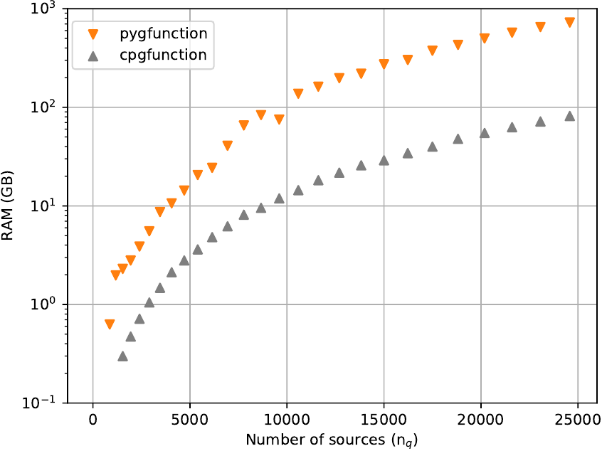
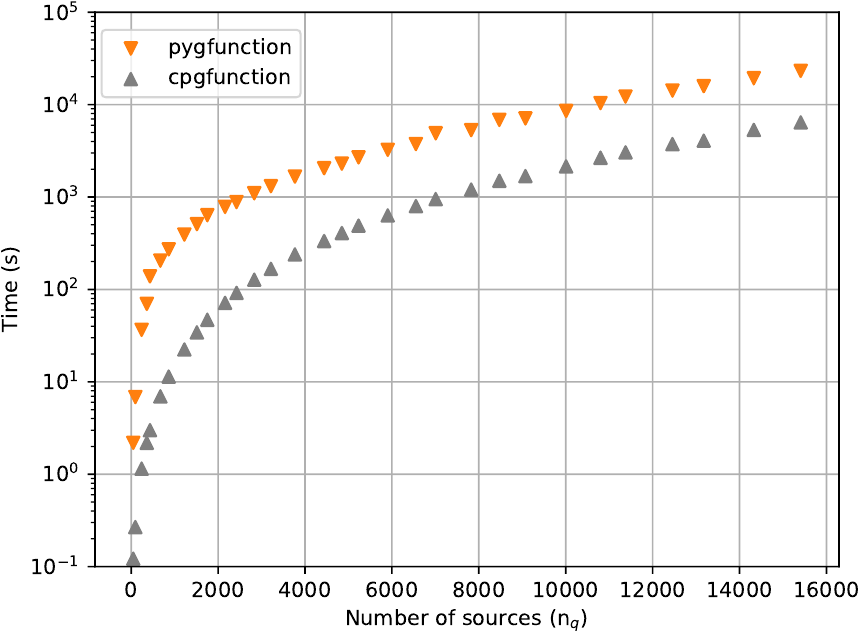
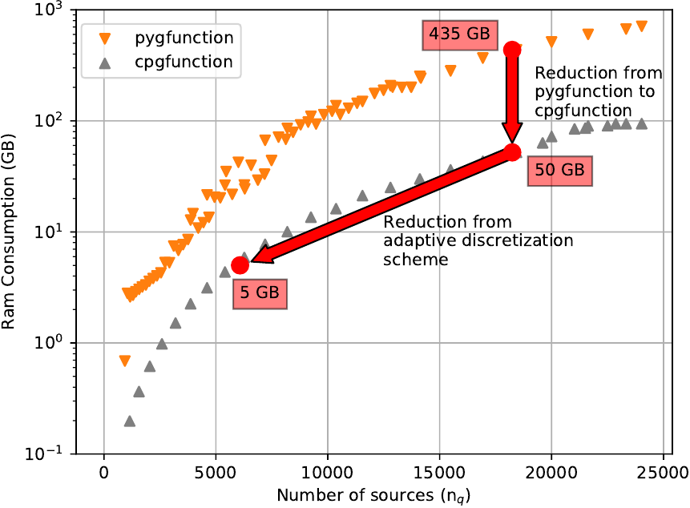
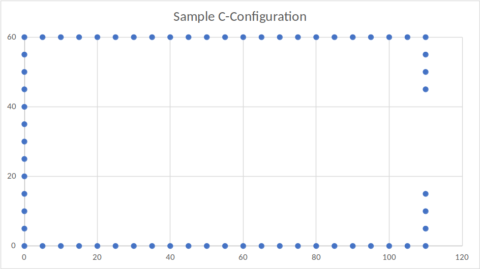

New Feature Proposal Draft

# Fast and accurate g-function calculations for modeling ground heat exchangers


**Jeffrey D. Spitler and Jack C. Cook, OSU**

- Original Date 2021-04-09
- Design added 2021-06-08

## Justification for New Feature
In order for EnergyPlus to simulate a ground heat exchanger (GHE) used with a
ground-source heat pump (GSHP) system, a dimensionless response function,
called a g-function, is required.  The dimensionless response depends primarily
on geometry – locations of boreholes and depths – though the borehole thermal
resistance and flow rate can also have a minor effect.  Users of EnergyPlus
currently have three possibilities for obtaining the g-function:

- EnergyPlus can calculate the g-function with a boundary condition known as
“uniform heat flux” – that is the heat flux per unit length is assumed uniform
over the entire fields.  This assumption works reasonably well for small fields,
but causes significant errors as the number of boreholes increases.
(Malayappan and Spitler 2013)
- The g-function can be input by the end user after determining it for a
specific configuration with a 3rd party tool, GLHEPRO. (Spitler 2000, OSU 2016)
This has the disadvantage of requiring the user to use a commercially
available, non-free, software program.  GLHEPRO relies upon a library of
g-functions that were pre-calculated using the uniform borehole wall
temperature boundary condition, so is not able to calculate g-functions on the
fly for larger fields.  (GLHEPRO does have an implementation of the uniform
heat flux g-function calculation, but based on the findings in Malayappan
and Spitler (2013), limits its usage to a maximum of 36 boreholes. GLHEPRO
does write a snippet of IDF that can be pasted into the user’s IDF file.
- Another tool, pygfunction (Cimmino 2018b) could be used to calculate a
g-function for any configuration.  As shown by Spitler et al. (2020), this
feature can be a powerful aid in optimizing the system performance.  Pygfunction
requires the user to be familiar with Python programming, and to write the IDF
description from scratch.  For larger fields, the computational time can become
excessive (e.g. hours).  A more significant constraint is that the memory
requirements can vastly exceed what is available even on highly-resourced
workstations.

As each of the above methods has significant limitations, it would be highly
desirable to add the capability to calculate g-functions with a method that is
as accurate as that available in GLHEPRO and pygfunction, but which allows
user-specified (non-library) borehole configurations, without excessive
computational time or memory requirements.

## E-mail and Conference Call Conclusions

N/A

## Overview

Starting with the methodology utilized by pygfunction to calculate g-functions
with uniform borehole wall temperature, a C++ implementation
(Cook and Spitler 2021) referred to as “cpgfunction” has been developed.  
The solution has been considerably restructured to give an 8-fold reduction
in required memory.  The reduction in memory depends on the number of finite
line source segments, as shown in Figure 1. This reduction in memory comes at
the expense of some computational speed, but for irregular configurations, as
shown in Figure 2, cpgfunction increases speed by a factor of four when there
are more than about 5000 sources and by higher amounts with smaller amounts of
sources.



Figure 1 Comparison of pygfunction and cpgfunction memory requirements



Figure 2 Comparison of pygfunction and cpgfunction computational speed for
irregular borehole configurations

Beyond the improvements described by Cook and Spitler (2021), this new feature
will include an adaptive discretization algorithm to maximize speed and minimize
memory requirements while maintaining acceptable accuracy.

## Approach

The recently developed “cpgfunction” implementation (Cook and Spitler 2021) will
be adapted for use in EnergyPlus.  In this section, we give an overview of the
methodology.  Cpgfunction and pygfunction use a discretized representation of
the ground heat exchanger, with each borehole divided into multiple segments.  
The effect of each segment on every other segment is determined with an
analytical solution known as the finite line source (FLS).  When applied in
this way, with each borehole represented by multiple finite line sources, the
method is sometimes referred to as stacked finite line source (SFLS).

The algorithm has three major steps:

1. Discretization of the boreholes into finite line segments.  The actual
discretization is simple – boreholes are divided into equal length segments –
but specifying a minimal number of segments that achieve sufficient accuracy is
more difficult.  We are currently finalizing an algorithm that we call the
“adaptive discretization scheme” that ensures sufficient accuracy.  The
methodology for this is similar to a grid-independency study.  Past work in the
field has not included rigorous examination of this question.
2. Analysis of similarities and calculation of segment-to-segment responses.
For, say, a system with 200 boreholes and 12 segments per borehole, there are
24002 segment-to-segment responses to be calculated.  This can be quite
computationally time-consuming and, therefore, as proposed by (Cimmino 2018a),
an analysis of similarities is done first.  By similarities, we mean pairs of
segments with identical or near-identical horizontal and vertical offsets, such
that the segment-to-segment responses are identical or near-identical.  
Therefore, an analysis is done first, and segment-to-segment responses are only
calculated for the unique cases.
3. Superposition of the segment-to-segment responses.  This step may seem
simple, and it is simple if the uniform heat flux boundary condition is used
and all segments have a constant and uniform heat input.  However, as shown by
Malayappan and Spitler (2013), this choice gives inaccurate results for larger
borefields.  The uniform borehole wall temperature has been considered the
reference method for some years, has been widely used to size ground heat
exchangers and has had the benefit of some field validation.
(Cullin et al. 2015)  Arguably, the uniform inlet fluid temperature
method has even better physical justification.  Cpgfunction currently
implements the uniform borehole wall temperature boundary condition, and
as will be discussed below, this is advantageous.

The project team is currently finalizing research into what we call the
“adaptive discretization scheme”, and it takes advantage of the fact that using
the uniform borehole wall temperature approximation with a reduced number of
segments can give a quite good match to the uniform inlet fluid temperature
boundary condition.  This gives us the possibility of significant reduction
in both memory and time requirements while also obtaining a highly accurate
solution.  The memory reduction is illustrated in Figure 3 for a borefield with
about 18000 segments.  Cpgfunction using the same number of segments reduces the
memory required from 435 GB to 50 GB.  Applying the adaptive discretization
scheme then gives a further 10-fold reduction in memory requirements to 5 GB.  
The reduction in computation time depends on the amount of similarities in the
field.  With an irregularly shaped field with few similarities, we would expect
a 4-fold reduction in using cpgfunction with the same number of segments and a
further 20-fold reduction using the adaptive discretization scheme.



Figure 3  Reduction in memory requirements. Downward vertical arrow corresponds
to reduction with cpgfunction using the same number of segments as pygfunction.  
Other arrow represents savings of adaptive discretization scheme.

## Testing/Validation

G-functions are specified as a series of points `(g, ln(t/t_s))`.  A proposed
testing algorithm would involve calculation of g-functions for several borehole
configurations and comparison of the results with pre-calculated g-functions.  
A sample C-shaped configuration is shown in Figure 4; the dimensions are in m.  
Figure 5 shows the g-function corresponding to a 96m depth with the 27 discrete
values marked as points.  The testing algorithm will compute the g-function,
also in 27 discrete values, and the RMSE between the EnergyPlus calculated
g-function and the pre-calculated g-function.  An RMSE of less than 0.1% should
indicate a “pass”.



Figure 4 Sample C-shaped configuration


Figure 5 Sample g-function showing discrete values

## I/O Reference Documentation

EnergyPlus can already calculate g-functions with the uniform heat flux boundary
conditions.  It would be possible to simply replace the algorithm for computing
g-functions and make no changes to the GroundHeatExchanger:System object.  
Borehole locations will be specified with GroundHeatExchanger:Vertical:Single
objects.
However, for purposes of testing, validation, and research it is desirable to
retain the uniform heat flux boundary condition calculation as a non-default
option.  Therefore, we propose a new key for the GroundHeatExchanger:System
object, the “g-function calculation model name”, with values of:

- UHFcalc for the existing uniform heat flux boundary condition calculation
- UBHWTcalc for the new calculation method that utilizes uniform borehole wall
temperature boundary conditions.

Sample IDF and IDD follow, new lines are marked with "+" at the beginning of 
the line (this makes use of the `diff` language marker):

```diff
! IDF example using GHE:Vertical:Array input 

GroundHeatExchanger:System,
  Vertical GHE 1x4 Std,    !- Name
  GLHE Inlet,              !- Inlet Node Name
  GLHE Outlet,             !- Outlet Node Name
  0.004,                   !- Design Flow Rate {m3/s}
  Site:GroundTemperature:Undisturbed:KusudaAchenbach,  !- Undisturbed Ground Temperature Model Type
  KATemps,                 !- Undisturbed Ground Temperature Model Name
  2.5,                     !- Ground Thermal Conductivity {W/m-K}
  2.5E+06,                 !- Ground Thermal Heat Capacity {J/m3-K}
  ,                        !- GHE:Vertical:ResponseFactors Object Name
+ UHFcalc,                 !- g-function Calculation Model Name
  GHE-Array;               !- GHE:Vertical:Array Object Name
```


```diff
! IDF example using GHE:Vertical:Single input

  GroundHeatExchanger:System,
    Vertical GHE 1x4 Std,    !- Name
    GLHE Inlet,              !- Inlet Node Name
    GLHE Outlet,             !- Outlet Node Name
    0.004,                   !- Design Flow Rate {m3/s}
    Site:GroundTemperature:Undisturbed:KusudaAchenbach,  !- Undisturbed Ground Temperature Model Type
    KATemps,                 !- Undisturbed Ground Temperature Model Name
    2.5,                     !- Ground Thermal Conductivity {W/m-K}
    2.5E+06,                 !- Ground Thermal Heat Capacity {J/m3-K}
    ,                        !- GHE:Vertical:ResponseFactors Object Name
+   UHFcalc,                 !- g-function Calculation Model Name
    ,                        !- GHE:Vertical:Array Object Name
    BH1,                     !- GHE:Vertical:Single Object Name 1
    BH2;                     !- GHE:Vertical:Single Object Name 2
```


```diff
! IDD Modifications

GroundHeatExchanger:System,
    \memo Models vertical ground heat exchangers systems using the response factor approach
    \memo developed by Eskilson. Response factors are calculated using a finite line source
+   \memo model assuming uniform heat flux at the borehole wall if UHFcalc is specified,
+   \memo or uniform borehole wall temperature if UBHWTcalc is specified.
    \extensible:1
    \min-fields 9
    A1,   \field Name

    ...

    A6, \field GHE:Vertical:ResponseFactors Object Name
        \type object-list
        \object-list GroundHeatExchangerVerticalResponseFactorNames
+   A7, \field g-function Calculation Model Name
+       \type choice
+       \key UHFcalc
+       \key UBHWTcalc
    A8, \field GHE:Vertical:Array Object Name
        \type object-list
        \object-list GroundHeatExchangerVerticalArrayNames
    ...
```

## Engineering Reference Documentation

The engineering reference documentation will be prepared and will reference a
conference paper (Cook and Spitler 2021, currently under review) and a journal
paper (in preparation.)

## References

Cimmino, M. (2018a). "Fast calculation of the g-functions of geothermal borehole
fields using similarities in the evaluation of the finite line source solution."
Journal of Building Performance Simulation 11(6): 655-668.

Cimmino, M. (2018b). pygfunction: an open-source toolbox for the evaluation of
thermal. eSim 2018, Montreál, IBPSA Canada.

Cook, J. C. and J. D. Spitler (2021). Faster computation of g-functions used for
modeling of ground heat exchangers with reduced memory consumption. Submitted to
Building Simulation 2021. Bruges, Belgium, IBPSA.

Cullin, J. R., J. D. Spitler, C. Montagud, F. Ruiz-Calvo, S. J. Rees, S. S.
Naicker, P. Konečný and L. E. Southard (2015). "Validation of vertical ground
heat exchanger design methodologies." Science and Technology for the Built
Environment 21(2): 137-149.

Malayappan, V. and J. D. Spitler (2013). Limitations of Using Uniform Heat Flux
Assumptions in Sizing Vertical Borehole Heat Exchanger Fields. Clima 2013.
Prague (Czech Republic).

OSU (2016). GLHEPro 5.0 for Windows - Users' Guide. Stillwater.

Spitler, J. D. (2000). GLHEPRO --  A Design Tool For Commercial Building Ground
Loop Heat Exchangers. Fourth International Heat Pumps in Cold Climates
Conference, Aylmer, Québec.

Spitler, J. D., J. C. Cook and X. Liu (2020). A Preliminary Investigation on the
Cost Reduction Potential of Optimizing Bore Fields for Commercial Ground Source
Heat Pump Systems. Proceedings, 45th Workshop on Geothermal Reservoir
Engineering. Stanford, California, Stanford University.

## Design

### Current design

EnergyPlus currently generates vertical borehole g-functions internally using a 
simple, non-optimized line-source model which uses the uniform heat flux 
boundary condition. For the vertical borehole and slinky ground heat exchanger 
model classes, ```GLHEVert``` and ```GLHESlinky```, respectively, the access 
point into these methods is the member function, ```calcGFunctions```. 
Inside of the vertical borehole GHE ```calcGFunctions``` function, three 
different functions are called to generate the g-function values.

- ```calcShortTimestepGFunctions``` - which uses a 1D, radial finite volume 
  borehole model to compute the g-functions from a time of 500 seconds 
  (~ ln(t/ts) = -13) to when ln(t/ts) = -9.0, which is likely on the order of 
  1-2 days.

- ```calcLongTimestepGFunctions```  - which uses the non-optimized line-source 
  model mentioned above to compute the g-functions from ln(t/ts) = -8.5 up to 
  the maximum simulation time as defined in the EnergyPlus input.

- ```combineShortAndLongTimestepGFunctions``` - which combines the g-functions 
  generated from the short and long time-step routines into the vector objects 
  the rest of the EnergyPlus GHE code requires for computations.

### Updated design

The updated design in ```GLHEVert::calcGFunctions``` will wrap the calls to 
these existing functions in an IF block, so that when the new input option 
"UHFcalc" is selected the existing g-function generation code is called. 
However, when the "UBWTcalc" option is selected, cpgfunction will be called to 
generate the g-function values with the uniform borehole wall temperature 
boundary condition.

```C++

if (UHF) {

    calcShortTimestepGFunctions(state);

    calcLongTimestepGFunctions(state);

    combineShortAndLongTimestepGFunctions();

} else if (UBHWT) {

    gt::gfunction::uniform_borehole_wall_temperature(...);

}
```

### Optional Build

This can be an optional feature built based on new or existing CMake flags.

### Dependencies

Cpgfunction was originally written making use of Boost and BLAS/LAPACK. The 
BLAS/LAPACK library is based on Fortran code. While it is quite easy to make an 
executable in Linux and Mac environments that combines C++ code with the 
BLAS/LAPACK library, there are some difficulties in doing this on Windows. 
Additionally, the EnergyPlus development team has goals of ridding the 
repository of Fortran dependencies and eliminating the use of Boost.  

Therefore, we have replaced the calls to BLAS/LAPACK with native C++ code and a 
call to the Eigen library, and (to date) minimized the use of Boost.  Based on 
the further discussions with the EnergyPlus development team, we plan to 
eliminate the use of Boost also.  The following sections describe the 
dependencies, past, present, and future, along with some discussion of the 
performance implications of the changes already made or to be made in the code 
for this feature.

#### Nlohmann json

This dependency exists for running unit tests in the `cpgfunctionEP` repository. 
This dependence will not be used in the EnergyPlus build.

#### BLAS and LAPACK routines (deprecated)

Three BLAS functions were used (copy, axpy, spmv). These functions have been 
replaced with native C++ code. The gesv function from LAPACK has been off 
loaded to the Eigen library.

In the previous version, these were expected to be installed as system 
libraries. Last summer, during the initial development of cpgfunction, it was 
found that OpenBLAS performed LU factorization for solving systems of linear 
equations ([gesv](https://icl.bitbucket.io/lapackpp/group__gesv.html#ga8f2d5c8af99b6aee06f0650d723f8e2f)) 
5x faster than [netlib](https://www.netlib.org/blas/). 
The speed of [OpenBLAS](https://github.com/xianyi/OpenBLAS) 
was nearly 
identical to the solution solved in Python's [numpy.linalg.solve](https://numpy.org/doc/stable/reference/generated/numpy.linalg.solve.html), 
which makes 
use of the same LAPACK routine. More recently, it has been found that linear 
algebra with BLAS is both significantly faster than multi-threading, and that 
BLAS has low level functionality that helps with the goals of cpgfunction. 
(cpgfunction was developed due to the need to compute g-functions faster and 
with lower memory on high performance computers for the development of 
g-function databases (Cook and Spitler 2021).) BLAS provides for "fast slicing" 
of vectors or matrices represented in 1D format. The functions take in pointers 
to a starting location, and a number of elements to be operated on. 
Additionally, the BLAS routine function [symv](https://icl.bitbucket.io/blaspp/group__symv.html#ga496ee8fe24db5f3dd003b09cc2bec5a4) 
gives tremendous speed improvement 
for performing linear algebra on the packed symmetric matrix discussed in Cook 
and Spitler (2021). The packed symmetric response matrix can remain packed at 
each point in time, where inputs to the function instruct whether or not it is 
the upper or lower triangle. The consumption of memory is also minimized by 
storing the results in the input vector y. This allocation of memory can occur 
once, and that vector can be re-used across functions. This results in 
significant speed improvements when compared to multi-threading, with minimal 
to no additional memory consumption. However, while many of these things are 
good, and a 2x speed improvement has already been made by initial transfer of 
computation from boost's thread pool to BLAS, the dependency was programmed in 
Fortran.

There is more than one sticking point with the use of BLAS/LAPACK being a 
dependency. A fork has been made in the project so that EnergyPlus can be 
delivered what is requested. The name of the fork is cpgfunctionEP. Therefore, 
BLAS/LAPACK will not be included in the dependency for cpgfunctionEP. The speed 
of cpgfunctionEP is slower than cpgfunction, but for reasons previously stated, 
it is necessary to remove all Fortran code from the library for delivery to 
EnergyPlus.

#### Eigen

The Eigen library has been made a dependency to be used in solving a system of 
equations using LU decomposition. As previously mentioned, cpgfunction is faster 
than cpgfunctionEP due to more linear algebra being made use of. It may be 
possible for cpgfunctionEP to someday match the speed performance of cpgfunction 
by depending more heavily on Eigen, though the library from its conception has 
been geared towards BLAS/LAPACK. The re-write would be substantial, and the 
amount of memory consumed will grow.

It is unclear if a greater dependency on Eigen could provide performance similar 
to the BLAS/LAPACK of OpenBLAS. A re-write with a focus on Eigen for linear 
algebra could be done, but would take time, and is not feasible to be 
accomplished by August.

#### Boost

The boost functions currently made use of are [Gauss-Kronrod Quadrature](https://www.boost.org/doc/libs/1_71_0/libs/math/doc/html/math_toolkit/gauss_kronrod.html) 
and [thread pool](https://www.boost.org/doc/libs/1_76_0/doc/html/boost_asio/reference/thread_pool.html). 
The quadrature integration is performed to compute the integration 
of the finite line source. Replacements for both functions are under 
investigation. It appears likely that OpenMP could be made use of as opposed to 
Boosts thread pool for multi-threading, though initial speed comparisons 
significantly favored Boost. A standalone [Gauss-Kronrod](https://people.sc.fsu.edu/~jburkardt/cpp_src/kronrod/kronrod.html) 
integration could be made use of, but the speed and accuracy are unknown.

### Git

The code is currently maintained in a private repository on the account of [Jack Cook](https://github.com/j-c-cook). 
The plan is to make the code public and open source following further 
documentation and development. The library can be incorporated into the 
`third_party` folder as a git subtree or however the development team prefers.

--------------------

Cook, J. C. and J. D. Spitler (2021). Faster computation of g-functions used 
for modeling of ground heat exchangers with reduced memory consumption. 
Accepted for publication in Proceedings of Building Simulation 2021. 
September 1-3, 2021. Bruges, Belgium.
