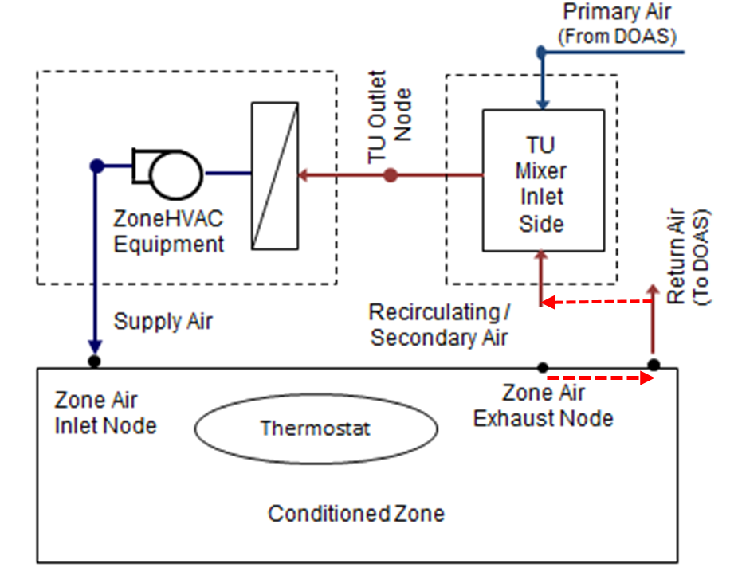
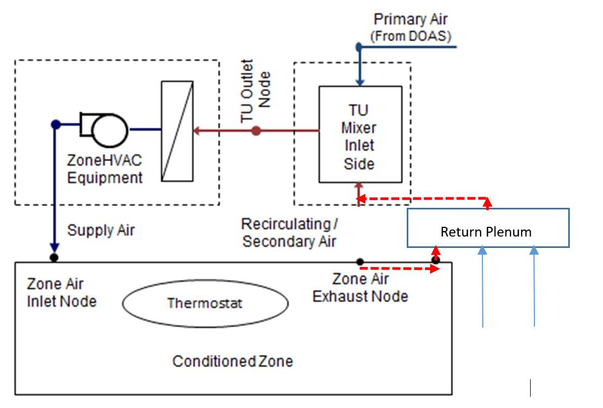

Allow zone HVAC terminal units to draw return air from return air plenum and return duct
================

**Lixing Gu**

**Florida Solare Energy Center**

 - Original draft, 12/15/20

 - None-Revision Date
 

## Justification for New Feature ##

Currently EnergyPlus only allows a zone HVAC terminal unit to draw recriculation air from the zone air node - i.e. air at zone conditions.

Many applications of ceiling-mounted zone HVAC terminal units (VRF, hydronic fan coil, WSHP) actually draw air from the ceiling space or from a return air duct. In those applications the air entering the zone HVAC terminal mixing box is at a condition thermally different from the zone air node. In the case of drawing air from a return air plenum, air is at the mixed plenum temperature, having incorporated heat gains or losses occurring in the plenum. In the case of drawing air from a return duct, the air temperature may have been altered by lighting fixture heat gain in the case of returns originating at vented lighting fixtures. The altered condition of recirculating air affects the loads on cooling or heating coils in the zone HVAC terminal. It allows more accurate modeling of equipment loads and energy use.

This feature request is based on study of commercial building HVAC design drawings in which ceiling mounted HVAC terminals simply have an inlet port that draws air from the ceiling space rather than a duct running from the return grille to the zone HVAC unit mixing box. The distance between return grille and inlet port is sometimes quite large, meaning that return air from the space has sufficient time to mix with air in the plenum to absorb heat gains or losses.

Note:

The above description is mainly from GitHub Issue #8190 at https://github.com/NREL/EnergyPlus/issues/8190

## E-mail and  Conference Call Conclusions ##

Nov. 2020

Tiejun and I discuss how to implement this new feature. Revision was made after discussion.

## Overview ##

The new feature requests Zone HVAC objects to draw inlet air from return plenum and return duct. It should be pointed out that no return duct losses are calculated in Existing EnergyPlus, except for the AirflowNetwork model (beyond the topic for this new feature). Instead, light heat from return fraction is added to the return node after mixing. Therefore, light heat will be added into the drawn air for the scenario with return duct. There is no modification for the scenario with return plenum. 

This new feature is applied to the system configuration only when a zone equipment and an AirLoop serve the same zone. The proposed IO modification will be made in the ZoneHVAC:EquipmentConnections object by adding a new field as Plenum or Return Air Node Name for the last position, so that no transition is needed for this new feature. The advatanges using the proposed modification are listed below:

1. Keep existing input objects integraty

There is no need to change existing ZoneEquipment objects and connections

2. The proposed modification is generally eough to cover all possible zone equipment

3. No new objects are introduced

The existing object will be modified by adding a new optional field. No transition is needed for this new feature.

4. Mass flow rates at all nodes are the same as before

5. The differences are from air properties (temperature and humidity) entered into ZONE HVAC equipment from zone exhaust nodes.

6. Calculation is perfoemd implictly  

The terminal unit of AirTerminal:SingleDuct:Mixer is used to demonstrate how this new feature is accomplished.

Here are two possible approaches to draw zone air using the AirTerminal:SingleDuct:Mixer object:

1. Zone HVAC objects draw return air from the return node after light return fraction heat is added, istead of from exhaust node directly. The following step will be applied for this approach with retunr duct.

Mix flow rates at inlet of return node

	Mass flow rate at return node = Zone HVAC object inlet mass flow rate + AirLoop return air flow rate

Split flow rate after adding return heat

	The light fraction heat will be added. The outlet condition will be calculated using the total mass flow rate. Then the total mass flow rate will be split into two parts. The difference is that the return heat will impact inlet air conditions for a zone hVAC object. The original mass flow rates at exhaust node and return node will remain as is.

**Figure 1 Configuration to draw air from return node**

2. Zone HVAC objects draw inlet air from return plenum

Mix flow rates at inlet of return node

	Mass flow rate at return node = Zone HVAC object inlet mass flow rate + AirLoop return air flow rate
	Adjust return node temperature due to light return fraction heat

Mix air flows in the return plenum will all return airflows

	Mass flow rate at the return plenum outlet = Sum of all mass flow rates at return plenum inlet nodes
	Air properties are weighted by mass flow rates and inlet air properties 

Split flow rate after return plenum mix

	The split mass flow rate = mass flow rate requested by Zone HVAC object inlet with the air properties at the return plenum outlet

**Figure 2 Configuration to draw air from return plenum**

### Note for SupplySide connection

The above description of terminal unit is based on Mixer Connection Type = InletSide. If the input of Mixer Connection Type is SupplySide, the mixer is connected at the outlet side of the ZoneHVAC equipment as drawn air inlet. The calculation procedures are the same with different connection using drawn air inlet configurations. 

## Approach ##

The ZoneHVAC:EquipmentConnections object will be modified by adding an optional field at the last position as Plenum or Return Air Node Name.

### Retur node

When the return node name is entered, the amount of drawing air will mix with return air. Then the mass flow rate at the outlet of mixed air will be used to calculate temperature arise due to light return fraction heat. Since light return fraction is purely sensible, no latent change is expected, so that temperature rise is of the interest. The Zone HVAC objects will take the same amount of mass flow rate and modified temperature after mixing.

It should be pointed out that the rertun node mass flow will not be changed, but the air temperature will be changed due to mixed mass flow rate.

Nomanclature:

m = Mass flow rate
T = Air temperature
W = Air humidity ratio

Zone air properties: Tzone and Wzone

mtotal = mreturn + mterminal

Treturn =  Qlight /{mtotal * Cp} + Tzone

Wreturn = Wzone

Therefore

Return node conditions: mreturn, Treturn, Wreturn 

Zone HVACl entry conditions: mZoneHVAC, Treturn, Wreturn 

Note: The condition includes air properties and mass flow rate

### Return plenum ###

When the return plenum node name is entered, the amount of drawing air will mix with return air first. Then the outlet of mixed air will be used to calculate temperature arise due to light return fraction heat. All return air from zones served by the return plenum will be mixed again. The outlet conditions will be calculated after plenum mixing. The terminal inlet will take the same amount of mass flow rate and temperature and humidity after pelnum mixing to enter the Zone HVAC.

Here is an example to describe what procedures will be used. Assume that there is a connection to a Zone HVAC in Zone 1, there are 3 zones to return air into a return plenum as Zones 1, 2 and 3. This calculation procedure is provided below. The changes will be accordingly when there are more zones served by a return plenum.  

Zone air properties: 

Tzone1 and Wzone1

Tzone2 and Wzone3

Tzone3 and Wzone3

Zone 1 return mass flow rate may be changed as below:

mtotal1 = mreturn1 + mZoneHVAC

There are no return mass flow rate changes in Zones 2 and 3 

Mixed mass flow rate at the return plenum outlet

mtotal = mtotal1 + mreturn2 + mreturn2

Treturn1 =  Qlight1 /{mtotal1 * Cp} + Tzone1

Tplenum = ( Treturn1 * mtotal1 + Tzone2 * mreturn2 + Tzone2 * mreturn3) / mtotal 

Wplenum = ( Wreturn1 * mtotal1 + Tzone2 * mreturn2 + Wzone2 * mreturn3) / mtotal 

Terminal entry conditions: mZoneHVAC, Tplenum, Wplenum 

 

## Testing/Validation/Data Sources ##

Example file testing and unit test will be performed to ensure that the new feature works properly.

## Input Output Reference Documentation ##

This section presents ZoneHVAC:EquipmentConnectionsr with proposed revision. The modifications are highlighted in red.

### ZoneHVAC:EquipmentConnections ###

\subsection{ZoneHVAC:EquipmentConnections}\label{zonehvacequipmentconnections}

Finally, the ZoneHVAC:EquipmentConnections statement defines the remaining details about each thermal zone from an HVAC perspective (besides the controls which were defined above). As with other statements, the first two items in this object are the keyword and an identifying name which links the zone back to its geometrical input, internal gains, etc. and other statements in the HVAC section of the input. The next three items are names of lists (equipment, air inlet nodes, and air exhaust nodes) that are described in more detail below. Note that if there are no air exhaust nodes from the zone that field is left blank. And if there are no air inlet nodes, that field is left blank. Finally, two node names are necessary to complete the zone-HVAC description. The first node is the main air node for the zone upon which the air heat balance is performed. The other node(s) begins the return air path(s) from the zone.

In addition, the last field to allow Zone HVAC equipment to draw inlet air from a return node or a return plenum, instead of a zone exhaust node. Therefore, the Zone HVAC equipment inlet air properties will be impacted by return or plenum. 

Note that all nodes mentioned in the ZoneHVAC:EquipmentConnections input must be unique.~ That is, all nodes in all the ZoneHVAC:EquipmentConnections statements referenced by the ``Zone Air Inlet Nodes'', ``Zone Air Exhaust Nodes'', ``Zone Air Node Name'' and ``Zone Return Air Node Name'' cannot have any node name appearing more than once.

\subsubsection{Inputs}\label{inputs-1-052}

\paragraph{Field: Zone Name}\label{field-zone-name-015}

Name links this equipment list back to the heat balance for the zone.

\paragraph{Field: Zone Conditioning Equipment List Name}\label{field-zone-conditioning-equipment-list-name}

List of zone equipment for this zone in a \hyperref[zonehvacequipmentlist]{ZoneHVAC:EquipmentList} object. This list will consist of air distribution units or other direct convection or radiant equipment, i.e.~window air conditioner, baseboard, fan coils, etc.

\paragraph{Field: Zone Air Inlet Node or NodeList Name}\label{field-zone-air-inlet-node-or-nodelist-name}

There can be more than one air inlet node depending on how many pieces of equipment are in the \hyperref[zonehvacequipmentlist]{ZoneHVAC:EquipmentList}. Generally there will be one air inlet node for each piece of zone equipment that delivers conditioned air to the zone. Components such as electric or hot water baseboards and radiant systems do not require zone air inlet nodes. If there is only one node -- its name can be put in this field. If there is more than one node, this must be the name of a node list object (a node list object can also contain only one node name). If this field is not required (as in the baseboard system), it should be blank.

\paragraph{Field: Zone Air Exhaust Node or NodeList Name}\label{field-zone-air-exhaust-node-or-nodelist-name}

List of exhaust nodes leaving the zone for exhaust fans, zone energy recovery, etc. However these nodes are also used as sources of zone air for zone components such as fan coil units, unit heaters and ventilators, and window air conditioners. For each such component attached to a zone there should be a unique zone exhaust node acting as the inlet node to the component. If there is only one node -- its name can be put in this field. If there is more than one node, this must be the name of a node list object (a node list object can also contain only one node name). If there are no air exhaust nodes, this field should be blank.

\paragraph{Field: Zone Air Node Name}\label{field-zone-air-node-name}

The conditions at this node represent the average state of the air in the zone. For zones modeled as fully mixed the conditions at this node are assumed to represent the air in the entire zone. This field is required for all ZoneHVAC:EquipmentConnections statements.

\paragraph{Field: Zone Return Air Node or NodeList Name}\label{field-zone-return-air-node-or-nodelist-name}

The name of one or more return air nodes which attach the zone to an air loop return air path. Even if there is no return air or no return air path, a unique name must be entered in this field. The conditions at each return node represent the state of the air leaving the zone including any heat gain assigned to that return node from \hyperref[lights-000]{Lights}, refrigeration equipment or airflow windows.

\paragraph{Field: Zone Return Air Node 1 Flow Rate Fraction Schedule Name}\label{field-zone-return-air-flow-rate-fraction-schedule-name}

The name of a schedule to specify the return air flow rate for the first return air node as a fraction of the base return air. If the next field is blank, then the return air flow rate is the total supply inlet flow rate to the zone less the total exhaust node flow rate from the zone multiplied by this schedule name. If this field is left blank, the schedule defaults to 1.0 at all times.

\paragraph{Field: Zone Return Air Node 1 Flow Rate Basis Node or NodeList Name}\label{field-zone-return-air-flow-rate-basis-node-or-nodelist-name}

The name of a node or list of nodes (\hyperref[nodelist]{NodeList}) that is used to calculate the return air flow rate for the first return air node in this zone. The sum of the current flow rates for this node(s) multiplied by the Zone Return Air Node 1 Flow Rate Fraction Schedule determines the return air flow rate. If this field is blank, then the base return air flow rate is the total supply inlet flow rate to the zone less the total exhaust node flow rate from the zone in the case of a single air loop serving this zone. If there are multiple air loops serving this zone, the base return air flow rate is governed by the corresponding supply inlet flow rate and the AirloopHVAC Design Return Air Flow Fraction of Supply Air Flow.

\paragraph{Field: Plenum or Return Air Node Name}

This alpha field defines the node name to allow Zone HVAC equipment to draw air from either return node or return plenum, This name should match the name of the zone return air node or AirLoopHVAC:ReturnPlenum node associated with the zone.

An example of this statement in an IDF is:

\begin{lstlisting}

ZoneHVAC:EquipmentConnections,
      SPACE3-1,              !- Zone Name
      SPACE3-1 Eq,           !- List Name: Zone Equipment
      SPACE3-1 In Nodes,     !- List Name: Zone Air Inlet Nodes
      ,                      !- List Name: Zone Air Exhaust Nodes
      SPACE3-1 Node,         !- Zone Air Node Name
      SPACE3-1 Out Node;     !- Zone Return Air Node or NodeList Name
\end{lstlisting}

\paragraph{Field: Plenum or Return Air Node Name}

## Input Description ##

The ZoneHVAC:EquipmentConnections object is modified by adding an optional field as Plenum or Return Air Node Name. The revised idd is provided below. The proposed change is to mimic the addtion of "A20, \field Plenum or Mixer Inlet Node Name" in AirLoopHVAC:UnitaryHeatCool:VAVChangeoverBypass object (https://github.com/NREL/EnergyPlus/tree/develop/design/FY2019/VAV_ChangeoverBypass_Enhancement.md). The revision is highlighted in red.

	ZoneHVAC:EquipmentConnections,
       \memo Specifies the HVAC equipment connections for a zone. Node names are specified for the
       \memo zone air node, air inlet nodes, air exhaust nodes, and the air return node. A zone
       \memo equipment list is referenced which lists all HVAC equipment connected to the zone.
  	A1 , \field Zone Name
       \required-field
       \type object-list
       \object-list ZoneNames
  	A2 , \field Zone Conditioning Equipment List Name
       \note Enter the name of a ZoneHVAC:EquipmentList object.
       \required-field
       \type object-list
       \object-list ZoneEquipmentLists
  	A3 , \field Zone Air Inlet Node or NodeList Name
       \type node
  	A4 , \field Zone Air Exhaust Node or NodeList Name
       \type node
  	A5 , \field Zone Air Node Name
       \required-field
       \type node
  	A6 , \field Zone Return Air Node or NodeList Name
       \type node
  	A7 , \field Zone Return Air Node 1 Flow Rate Fraction Schedule Name
       \note This schedule is multiplied times the base return air flow rate.
       \note If this field is left blank, the schedule defaults to 1.0 at all times.
       \type object-list
       \object-list ScheduleNames
  	A8 , \field Zone Return Air Node 1 Flow Rate Basis Node or NodeList Name
       \note The optional basis node(s) used to calculate the base return air flow
       \note rate for the first return air node in this zone. The return air flow rate is the sum of the flow rates
       \note at the basis node(s) multiplied by the Zone Return Air Flow Rate Fraction Schedule.
       \note If this  field is blank, then the base return air flow rate is the total supply
       \note inlet flow rate to the zone less the total exhaust node flow rate from the zone.
       \type node

New field

   	A9; \field Plenum or Return Air Node Name
        \type node
        \note Enter the name of the duct node connected to a plenum or return air.
        \note When the return air node is entered, all air flows from Zone Air Exhaust Node or NodeList will flow to
        \note the return air, the return node air properties will be calculated based on light return heat fraction,
        \note and all mass flows. The mass flow rate at each exhaust node will remain the same, and air properties
        \note of all exhaust nodes will be the same as return node.

        \note When the Plenum air node is entered, all air flows from Zone Air Exhaust Node or NodeList will also
        \note flow to the return air, the return node air properties will be calculated the same as above. The
        \note outlet air properties will be calculated as is based on all zone mass flow rates, including additional
        \note return flows bypassed from exhaust nodes. The mass flow rate at each exhaust node will remain the
        \note same, and air properties of all exhaust nodes will be the same as return plenum node.

## Outputs Description ##

insert text

## Engineering Reference ##

insert text

## Example File and Transition Changes ##

### Example file ###

Expect to revise an existig example file with this new feature.

### Transition changes ###

No transition is expected, because an optional field is proposed to be added.

## References ##

insert text

