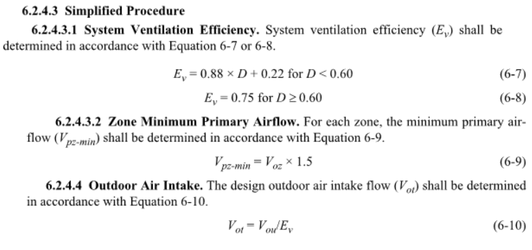
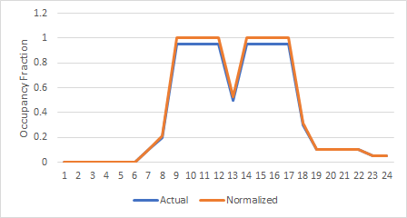
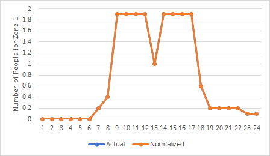

# ASHRAE 62.1-2019 Simplified Procedure
Jeremy Lerond, Wooyoung Jung, Jian Zhang, PNNL

June 2021

## Justification for New Feature
The latest version of ASHRAE Standard 62.1 introduces a new approach to calculate a multi-zone system's design outdoor air (OA) intake and corresponding minimum primary zone air flows. This new approach is a simplification of the previous method, the Ventilation Rate Procedure (VRP). Language from the standard is provided below.



The Simplified Procedure (SP) is referenced by ASHRAE Standard 90.1 to limit the zone air flow rate in dead band when zones with thermostatic DDC controls are served by terminal boxes that re-heat and/or re-cool the air delivered to the zone (see section 6.5.2.1, exception 2.a.(1)).

EnergyPlus is currently able to calculate the design OA intake of multi-zone systems based on the VRP but not based on the SP. EnergyPlus currently handles both multi- and single-zone VRP calculations for single- and dual-duct systems.

This new feature would allow users to let EnergyPlus size/calculate a system's OA intake based on the SP and size/calculate the corresponding zone terminal minimum primary air flows.

## Overview
Implement the new 62.1 Simplified Procedure to calculate multi-zone system design OA intake and zone minimum (primary) air flow.

Cap the OA flow rate calculated by the `Controller:MechanicalVentilation` object to the design system OA flow when using the `VentilationRateProcedure`.

## Approach
### System OA Intake
In order for the design system OA to be calculated following the SP, a new `System Outdoor Air Method` will be added to the `Sizing:System` object.

### Zone Minimum (Primary) Air Flow
As shown in the previous section, minimum terminal primary air flow can (be required to) be calculated using the SP. We propose to add one of the two following items:
1. Add a new `Cooling Design Air Flow Method` to the `Sizing:Zone` object
2. Add a new `Zone Minimum Air Flow Input Method` for all applicable `AirTerminal:*` objects

### Occupant diversity
The occupant diversity, `D`, is currently calculated by EnergyPlus using user-input design levels and schedules. While this might be convenient for users, extra care should be put into developing schedules so `D`, as calculated by EnergyPlus, match a potentially expected value. Additionally, performance might be somewhat impacted by the current implementation of that routine (see [issue 6487](https://github.com/NREL/EnergyPlus/issues/6487)). We propose to make `D` a user-input in the `Sizing:System` object. If not specified by the user the current routine would be used.

Letting EnergyPlus calculate `D` can potentially lead to some issues. For instance, if user-input occupancy schedules are normalized. Below is an example where two cases are compared: one using non-normalized schedules (regular case, actual occupancy fractions) and a case using normalized schedules. In both cases the actual modeled occupancy is the same. Each case leads to a different value of `D`.



| Regular   Case | Number of People | Peak Occupancy Fraction | Number of People - Peak |
|----------------|------------------|-------------------------|-------------------------|
| Zone 1         | 2.0              | 0.95                    | 1.9                     |
| Zone 2         | 5.0              | 0.95                    | 4.75                    |
| Zone 3         | 10.0             | 0.95                    | 9.5                     |

| Normalized   Case | Number of People | Peak Occupancy Fraction | Number of People - Peak |
|-------------------|------------------|-------------------------|-------------------------|
| Zone 1            | 1.9              | 1                       | 1.9                     |
| Zone 2            | 4.75             | 1                       | 4.75                    |
| Zone 3            | 9.5              | 1                       | 9.5                     |



The "regular case" leads to a `D` of 0.95 while the normalized case lead to a `D` of 1.0.

### Ventilation Optimization
The system ventilation optimization control requirement in ASHRAE Standard 90.1 requires that the system OA intake be adjusted, based on changes in System Ventilation Efficiency, below the design rate when applicable. EnergyPlus is able to make this adjustment through the `Controller:MechanicalVentilation` object but does not currently checks if the calculated system OA is less than the design value. It is possible for the System Ventilation Efficiency at non-design conditions to be lower than at design conditions. This would result in a system OA intake increase which violates the building energy code requirement. We proposed to "cap" the system OA calculated by `VentilationMechanicalProps::CalcMechVentController` to the system design OA value when the VRP is selected (Note: the SP is only used for system OA sizing calculations). The ASHRAE Guideline 36 also specifies in Section 5.16.3.1.h that the effective minimum OA intake should be not larger than the design total OA intake.

## E-mail and  Conference Call Conclusions
During the initial presentation, the team suggested not to consider option 1 listed above as a way to determine a terminal's primary air flow rate using the SP.

Additional discussion regarding the proposal of making `D` a user input is needed. Note: an example showcasing why letting EnergyPlus calculate `D` has been added to the Approach section.

Following a review of the NFP, it was decided that the `VentilationRateProcedure` field value would be replaced by `Standard62.1VentilationRateProcedure` and the Simplified Procedure would be referred to as `Standard62.1SimplifiedProcedure` thus requiring a transition rule. Changes were made to this NFP to reflect this.

## Testing/Validation/Data Sources
Three test suites are added to check the followings: (1) OccupantDiversity.unit.cc: the first unit unit test has the `Sizing:System` object that the user specified the `Occupant Diversity` and the second unit test has the `Sizing:System` object that the `Occupant Diversity` is autosized (i.e., calculated from the schedule); (2) Standard621SimplifiedProcedure.unit.cc: this suite includes three tests that have `AirTerminal:SingleDuct:VAV:NoReheat` and `AirTerminal:SingleDuct:SeriesPIU:Reheat` under different conditions - both are autosized, one of them is autosized (two cases); (3) MixedAir.unit.cc: a new test was added to see whether the system outdoor air is properly capped when the VRP is selected.
Two example files are added. The first one has two `Sizing:System` objects having user-specified value and 'autosize' value in the `Occupant Diversity` field, respectively. This part will demonstrate how the users would leverage the `Occupant Diversity` field. In this file, the five `AirTerminal:SingleDuct:VAV:Reheat` objects are all autosized by the Standard 62.1 Simplified Procedure. The second example file aims to demonstrate how the `Minimum Primary Air Flow Rate` of the PIU air terminals are autosized by the Standard 62.1 Simplified Procedure. There are two PIU air terminals (one `AirTerminal:SingleDuct:ParallelPIU:Reheat` and `AirTerminal:SingleDuct:SeriesPIU:Reheat`)

## Input Output Reference Documentation
The only changes to the Input/Output Reference document will be in the description of the System Outdoor Air Method field of the `Sizing:System` object and the new Occupant Diversity, also in the `Sizing:System` object. Changes and additions are respectively strikethrough and underlined in the text below.

### System Outdoor Air Method
>The method used to calculate the system minimum outdoor air flow. The <ins>three</ins> choices are ZoneSum<ins>, Standard62.1VentilationRateProcedure (VRP), and Standard62.1SimplifiedProcedure (SP)</ins>. ZoneSum sums the outdoor air flows across all zones served by the system. VRP uses the multi-zone equations defined in <ins>ASHRAE Standard</ins> 62.1 <ins>~~-2007~~</ins> to calculate the system outdoor air flow. VRP considers zone air distribution effectiveness and zone diversification of outdoor air fractions. VRP may also adjust autosized air terminal maximum and minimum supply flow rates if needed to ensure adequate outdoor air flow rate to each zone. <ins>SP is similar to VRP and was introduced in ASHRAE Standard 62.1-2019. The main difference with VRP is that it uses a simplified approach to calculate the system's ventilation efficiency which is in turn used to calculate the system outdoor air flow. Additionally, when set to autosize, the minimum (primary) air flow (or air flow fraction) for these air terminals will be calculated following SP: \hyperref[airterminalsingleductvavnoreheat]{AirTerminal:SingleDuct:VAV:NoReheat} (\emph{Constant Minimum Air Flow Fraction} or \emph{Fixed Minimum Air Flow Fraction}),
\hyperref[airterminalsingleductvavreheat]{AirTerminal:SingleDuct:VAV:Reheat} (\emph{Constant Minimum Air Flow Fraction} or \emph{Fixed Minimum Air Flow Fraction}), \hyperref[airterminalsingleductseriespiureheat]{AirTerminal:SingleDuct:SeriesPIU:Reheat} (\emph{Minimum Primary Air Flow Fraction}),
 \hyperref[airterminalsingleductparallelpiureheat]{AirTerminal:SingleDuct:ParallelPIU:Reheat}(\emph{Minimum Primary Air Flow Fraction})</ins>

 ### Occupant Diversity
 Part of the language is taken from the Engineering manual.

 ><ins>\paragraph{Field: Occupant Diversity}\label{occupant-diversity}</ins>
 >
 ><ins>The Occupant Diversity ratio (D) as defined in ASHRAE Standard 62.1. The ratio is the expected peak population to the design zone population for all zones attached to the air system. If left blank or set to autosize, EnergyPlus will calculate it by using the people design level and schedules.</ins>

### AirTerminal:SingleDuct:*PIU:Reheat
The following paragraph will be added at the end of the section describing the Minimum Primary Air Flow Fraction:

><ins>The autosize flow fraction is calculated according to the ASHRAE Standard 62.1 Simplified procedure if the Sizing:System's \emph{System Outdoor Air Method} associated with this terminal is set to Standard62.1SimplifiedProcedure.</ins>

### AirTerminal:SingleDuct:VAV:Reheat and NoReheat
The following paragraph will be added at the end of the section describing the Constant Minimum Air Flow Fraction:

><ins>The autosize flow fraction is calculated according to the ASHRAE Standard 62.1 Simplified procedure if the Sizing:System's \emph{System Outdoor Air Method} associated with this terminal is set to Standard62.1SimplifiedProcedure.</ins>

The following paragraph will be added at the end of the section describing the Fixed Minimum Air Flow Rate:

><ins>The autosize flow rate is calculated according to the ASHRAE Standard 62.1 Simplified procedure if the Sizing:System's \emph{System Outdoor Air Method} associated with this terminal is set to Standard62.1SimplifiedProcedure.</ins>

## Input Description
### System OA Intake and Occupant Diversity
A new `System Outdoor Air Method` will be added to the `Sizing:System` object, as follows:

```
Sizing:System,
  A8, \field System Outdoor Air Method
      \type choice
      \key ZoneSum
      \key Standard62.1VentilationRateProcedure
      \key Standard62.1SimplifiedProcedure
      \default ZoneSum
```

Based on the team's final decision, a new field could potentially be added to the `Sizing:System` object to represent the system's occupant diversity (`D`), as follows:
```
Sizing:System,
  N27; \field Occupant Diversity
      \type real
      \maximum 1.0
      \minimum> 0.0
      \default autosize
      \note The Occupant Diversity is used to determine a multi-zone system's outdoor air intake when the System Outdoor Air Method is
      \note Standard62.1VentilationRateProcedure or the Standard62.1SimplifiedProcedure. If set to be autosized, it will be calculated
      \note using the information in the People objects assigned to each zone attached to this system/airloop.
```
For single-zone system, `D` should be equal to 1.0. A warning will be added to let users know when a value less than one has been specified for a single-zone system.

### Zone Minimum (Primary) Air Flow
The SP provides an approach to calculate a terminal's minimum (primary) air flow. EnergyPlus includes the following air terminal objects:

Air terminal list:
- `AirTerminal:SingleDuct:ConstantVolume:Reheat`
- `AirTerminal:SingleDuct:ConstantVolume:NoReheat`
- `AirTerminal:SingleDuct:VAV:NoReheat`
- `AirTerminal:SingleDuct:VAV:Reheat`
- `AirTerminal:SingleDuct:VAV:Reheat:VariableSpeedFan`
- `AirTerminal:SingleDuct:VAV:HeatAndCool:NoReheat`
- `AirTerminal:SingleDuct:VAV:HeatAndCool:Reheat`
- `AirTerminal:SingleDuct:SeriesPIU:Reheat`
- `AirTerminal:SingleDuct:ParallelPIU:Reheat`
- `AirTerminal:SingleDuct:ConstantVolume:FourPipeInduction`
- `AirTerminal:SingleDuct:ConstantVolume:FourPipeBeam`
- `AirTerminal:SingleDuct:ConstantVolume:CooledBeam`
- `AirTerminal:SingleDuct:Mixer`
- `AirTerminal:DualDuct:ConstantVolume`
- `AirTerminal:DualDuct:VAV`
- `AirTerminal:DualDuct:VAV:OutdoorAir`

Constant volume air terminal are not targeted by the SP which narrows the list of air terminal targeted by this new feature:
- `AirTerminal:SingleDuct:VAV:NoReheat`
- `AirTerminal:SingleDuct:VAV:Reheat`
- `AirTerminal:SingleDuct:VAV:Reheat:VariableSpeedFan`
- `AirTerminal:SingleDuct:VAV:HeatAndCool:NoReheat`
- `AirTerminal:SingleDuct:VAV:HeatAndCool:Reheat`
- `AirTerminal:SingleDuct:SeriesPIU:Reheat`
- `AirTerminal:SingleDuct:ParallelPIU:Reheat`
- `AirTerminal:DualDuct:VAV`

The zone minimum air flow of the `AirTerminal:DualDuct:VAV`, `AirTerminal:SingleDuct:VAV:HeatAndCool:Reheat`, `AirTerminal:SingleDuct:VAV:HeatAndCool:NoReheat`, and `AirTerminal:SingleDuct:VAV:Reheat:VariableSpeedFan` is not currently "autosizable" so they should probably not be targeted by this new feature. Removing these objects from the list above give us the following air terminal objects:
- `AirTerminal:SingleDuct:VAV:NoReheat`
- `AirTerminal:SingleDuct:VAV:Reheat`
- `AirTerminal:SingleDuct:SeriesPIU:Reheat`
- `AirTerminal:SingleDuct:ParallelPIU:Reheat`

Instead of adding a new `Zone Minimum Air Flow Input Method` for all terminal listed above, their zone minimum (primary) air flow will be calculated following the SP if the `Sizing:System`'s `System Outdoor Air Method` is set to `Standard62.1SimplifiedProcedure`. A note in the `Constant Minimum Air Flow Fraction`, `Fixed Minimum Air Flow Rate`, and `Minimum Primary Air Flow Fraction` will be added to specify that, see below.

```
  N2 , \field Constant Minimum Air Flow Fraction
       \type real
       \autosizable
       \default autosize
       \note This field is used if the field Zone Minimum Air Flow Input Method is Constant
       \note If the field Zone Minimum Air Flow Input Method is Scheduled, then this field
       \note is optional; if a value is entered, then it is used for sizing normal-action reheat coils.
       \note If both this field and the following field are entered, the larger result is used.
       \note The values for autosizing are picked up from the Sizing:Zone input fields
       \note "Cooling Minimum Air Flow per Zone Floor Area", "Cooling Minimum Air Flow", and
       \note "Cooling Minimum Air Flow Fraction". If there is no sizing calculation a default of
       \note 0.000762 m3/s-m2 (0.15 cfm/ft2) is used.
       \note To calculate the constant minimum air flow fraction based on the ASHRAE 62.1 Simplified Procedure,
       \note set this field to autosize and this object's air loop's Sizing:System's System Outdoor Air Method
       \note field to Standard62.1SimplifiedProcedure.
  N3 , \field Fixed Minimum Air Flow Rate
       \type real
       \units m3/s
       \autosizable
       \default autosize
       \note This field is used if the field Zone Minimum Air Flow Input Method is FixedFlowRate.
       \note If the field Zone Minimum Air Flow Input Method is Scheduled, then this field
       \note is optional; if a value is entered, then it is used for sizing normal-action reheat coils.
       \note If both this field and the previous field are entered, the larger result is used.
       \note The values for autosizing are picked up from the Sizing:Zone input fields
       \note "Cooling Minimum Air Flow per Zone Floor Area", "Cooling Minimum Air Flow", and
       \note "Cooling Minimum Air Flow Fraction". If there is no sizing calculation a default of
       \note 0.000762 m3/s-m2 (0.15 cfm/ft2) is used.
       \note To calculate the fixed minimum air flow rate based on the ASHRAE 62.1 Simplified Procedure,
       \note set this field to autosize and this object's air loop's Sizing:System's System Outdoor Air Method
       \note field to Standard62.1SimplifiedProcedure.
```

```
  N3,  \field Minimum Primary Air Flow Fraction
       \required-field
       \type real
       \minimum 0.0
       \maximum 1.0
       \autosizable
       \note When set to autosize, the calculated air flow is determined based on the System Outdoor Air Method used in the air loop's Sizing:System object.
```

## Outputs Description
The existing Standard 62.1 Summary report will be used. Several modification will be made:
- A column under the _System Ventilation Requirements_ tables will be added to specify the origin of the Occupant Diversity for each air loop. Is it user-specified or calculated from schedules?
- A column under the _System Ventilation Requirements_ tables will be added to specify the method of calculation of the System Ventilation Efficiency. Reported values would be nothing if ZoneSum is used, "Standard 62.1 Ventilation Rate Procedure", or "Standard 62.1 Simplified Procedure".
- A column under the _Zone Ventilation Calculations_ tables will be added to specify if Vpz_min was calculated following the Standard 62.1 Simplified Procedure. The title of the column would be "Is Vpz-min calculated using the Standard 62.1 Simplified Procedure?" and reported values would either nothing or Yes.

## Engineering Reference
### Simplified Procedure
A new sub section will be added under the Demand Control Ventilation section of the Engineering Reference manual to describe the SP calculations (`EnergyPlus/doc/engineering-reference/src/simulation-models-encyclopedic-reference-002/demand-controlled-ventilation.tex`).
>\subsection{Simplified Procedure}\label{simplified-procedure}
>
>\subsubsection{System Ventilation Efficiency}\label{sp-calculation-of-system-ventilation-efficiency}
>
>The Simplified Procedure (SP) introduced in ASHRAE Standard 62.1-2019 provides an alternative way to determine the ventilation efficiency of a system(\({E_v}\)). The efficiency is calculated using equation \ref{eqn:ev-high-d} when the occupant diversity, \({D}\), is less than 0.6 and equation \ref{eqn:ev-low-d} otherwise. \({E_v}\) is then used in the same manner as in the VRP to determine the system design outdoor air intake.
>
>\begin{equation}\label(eqn:ev-high-d)
>{E_{v}} = 0.88 {D} + 0.22
>\end{equation}
>
>\begin{equation}\label(eqn:ev-low-d)
>{E_{v}} = 0.75
>\end{equation}
>
>\subsubsection{Zone Minimum Air Flow}\label{sp-zone-minimum-air-flow}
>When set to be autosized, the minimum (primary) air flow (or fraction) for these terminals will be calculated using equation \ref{eqn:sp-zone-minimum-air-flow}: \emph{AirTerminal:SingleDuct:VAV:NoReheat} (Constant Minimum Air Flow Fraction or Fixed Minimum Air Flow Fraction), \emph{AirTerminal:SingleDuct:VAV:Reheat} (Constant Minimum Air Flow Fraction or Fixed Minimum Air Flow Fraction), \emph{AirTerminal:SingleDuct:SeriesPIU:Reheat}, \emph{AirTerminal:SingleDuct:ParallelPIU:Reheat}.
>
>\begin{equation}\label(eqn:sp-zone-minimum-air-flow)
>{V_{{pz}_{min}}} = 1.5 * {V_{oz}}
>\end{equation}

### Other
* A mention of the Simplified Procedure will be added to the "System Design Outdoor Air Flow Rate" subsection of the Engineering Manual.

### Ventilation Optimization
The following equation in the in the sub-sub-section "Calculation of system minimum OA flow" will changed from...

>\begin{equation}
>{V_{ot}} = {V_{ou}}/{E_v}
>\end{equation}

... to:
> \begin{equation}
> {V_{ot}} = min(V_{{ot}_{design}}, {V_{ou}}/{E_v})
> \end{equation}

## Example Files and Transition Changes
Two example files using the SP are developed to showcase of to correctly set up a model to use the SP using both standard and PIU air terminals. More details are presented above.
Review of the original NFP prompted a request to change the existing `VentilationRateProcedure` field value to `Standard62.1SimplifiedProcedure`. This change requires a transition rule.

# References
* ASHRAE. 2019. ANSI/ASHRAE/IES 90.1-2019, Energy Standard for Buildings Except Low-Rise
Residential Buildings. ASHRAE, Atlanta, GA
* ASHRAE. 2019. ANSI/ASHRAE 62.1-2019, Ventilation for Acceptable Indoor Air Quality. ASHRAE, Atlanta, GA
* ASHRAE. 2018. ASHRAE Guideline 36-2018, High-Performance Sequences of Operation for HVAC Systems. ASHRAE, Atlanta, GA

# Design Document
## System OA Intake and Occupant Diversity
### Occupant Diversity
In the `DetermineSystemPopulationDiversity` the calculation of the Occupant Diversity, D, will be bypassed if the new occupant diversity field in the `Sizing:System` object is set to `autosize`. If the user-specified value of D is less than one and the system serves a single-zone, a warning will be issued mentioning that the actual occupant diversity used by EnergyPlus is 1.0.
### System OA Intake
A new OA method will be added to `DataSizing.hh`, `SOAM_SP`.

The design system OA intake, ventilation efficiency, along with the intermediate values for the design ventilation rate procedure are calculated in `ManageSystemVentilationAdjustments`. The existing VRP calculations will be kept and also applied to the SP. The only modification will be to the zone ventilation efficiency `Evz` which will be calculated as per the SP when request by the user. `Evz` will be the same for heating, cooling, and all zones. This code modification approach will ensure that the variables used in the 62.1 Summary reporting are the same as for the VRP. The only exception being how `Ev` and `Evz` are calculated.
## Zone Minimum (Primary) Air Flow
### Single Ducts
In the `SingleDuctAirTerminal::SizeSys` function (where terminal air flow sizing calculations for single duct terminals are done), code will be added to retrieve the system OA method associated with each terminal (through `state.dataSize->SysSizInput`). Code will be added in that same function to determine the zone minimum airflow if the selected system OA method is the new OA method (`DataSizing::SOAM_SP`). `FixedMinAirDes` (when `ZoneMinAirFracMethod == MinFlowFraction::Fixed`) will be calculated by retrieving the values for `VozClgByZone` and `VozHtgByZone` and multiplying the larger of the two by 1.5. `MinAirFlowFracDes` (when `ZoneMinAirFracMethod == MinFlowFraction::Constant`) will be calculated similarly (and divided by `MaxAirVolFlowRate`).
### PIUs
The same approach as previously described will be used in `SizePIU`. `MinPriAirFlowFracDes` will be determined by multiplying the larger of the two `VozClgByZone` and `VozHtgByZone` air flows by 1.5.
## Reporting
New variables will be created to store data used to populate the new columns described in the Output Description section of the NFP.

## Ventilation Optimization
The ventilation optimization calculations are done in the `VentilationMechanicalProps::CalcMechVentController` function in `MixedAir.cc`. The system OA flow for the VRP is calculated as follows: `SysOA = SysOAuc / SysEv;`. As mentioned in ASHRAE Standard 90.1 and Guideline 36, the calculated OA flow should be equal or smaller than the design OA flow. The design OA flow will be retrieved from `state.dataSize->FinalSysSizing` when a `System:Sizing` object exists and a system sizing run has been done (design OA flow rate is not known otherwise) and assigned to a new member of the `VentilationMechanicalProps` structure: `SysDesOA`. `SysDesOA` will then be used in `VentilationMechanicalProps::CalcMechVentController` to retrieve the system design OA flow. The system OA flow will be set to the minimum of the design air flow rate and the recalculated air flow.
