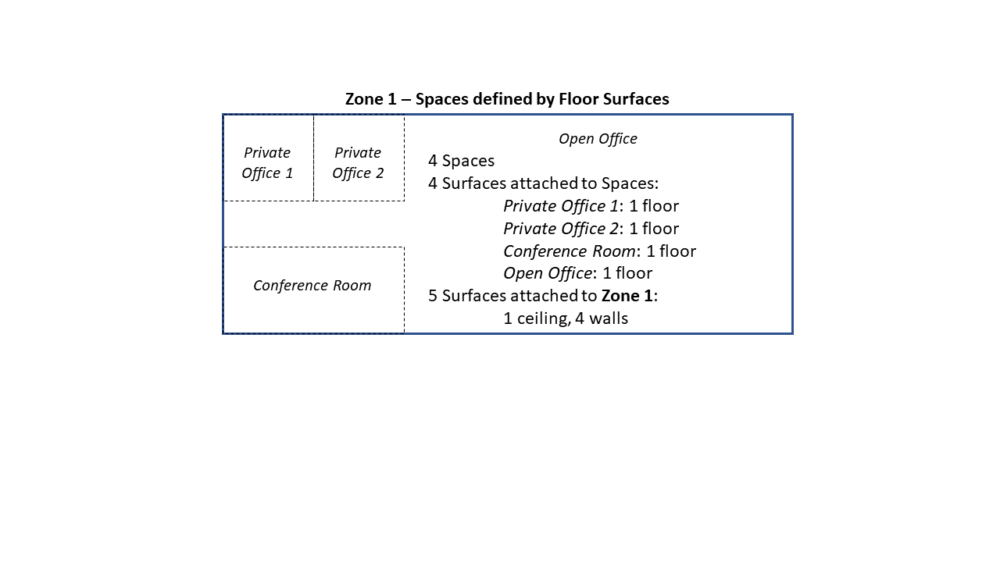
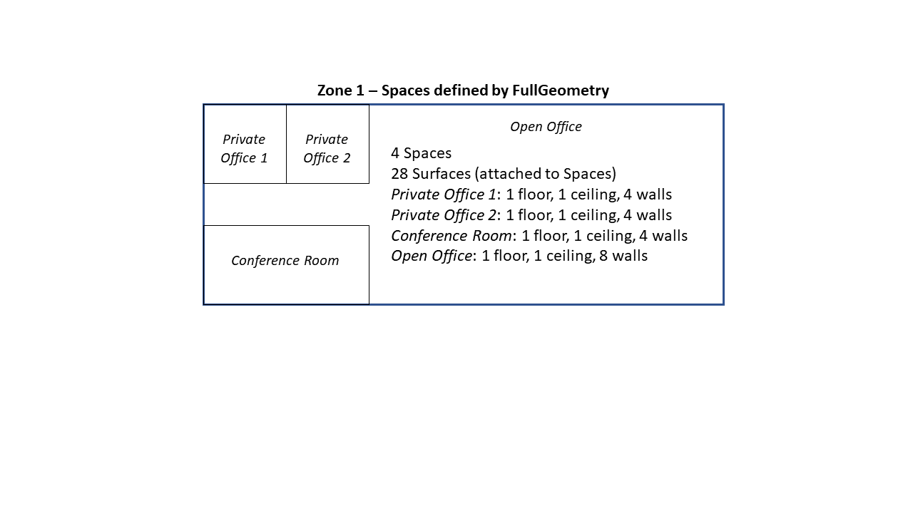

# Adding "Spaces" to EnergyPlus #

**Michael J. Witte, GARD Analytics, Inc.**  
**Jason W. DeGraw, ORNL**  
**With input from many more . . .**  

 -  Original, November 22, 2019
 -  Revised, April 1, 2020
    * Keep the current definition of Zone
    * Add new objects for Space, SpaceType, CompoundSpaceType, and Enclosure
 -  Revised, November 25, 2020
    * Condensed and focused on final proposal somewhat agreed to back in April 2020
    * Revised to reflect simplified Construction:AirBoundary object (radiant and solar enclosures are now the same)
 -  Revised, December 11, 2020
    * Simplify transition rules by allowing Zone and Space to share names
    * Per comments, decide that load assignments like internal gains, infiltration and ventilation, should be at the Space level
    * Add language to clarify concerns raised in comments
    * Add daylighting and thermal comfort considerations
 - Revised, May 18, 2021
    * Make Space optional for input
    * Make Space Type just a tag
    * Add optional Space Name field to surfaces
    * Allow Space to be assigned to floor surface(s) only or full set of surfaces
 - Revised, May 25, 2021
    * Add clarifications from May 19 conference call
 - Revised, June 7, 2021
    * Add design section
 - Revised, August 19, 2021
    * Leave ZoneInfiltration and ZoneVentilation as-is (reference Zone, not Space).
    
## Table of Contents ##

[Justification for New Feature](#justification-for-new-feature)

[Proposed Input Approach](#proposed-input-approach)
[Sizing Considerations](#sizing-considerations)

[Testing/Validation/Data Sources](#testingvalidationdata-sources)

[Input Output Reference Documentation](#input-output-reference-documentation)

[Outputs Description](#outputs-description)

[Engineering Reference](#engineering-reference)

[Example File and Transition Changes](#example-file-and-transition-changes)

[Q&A from May 19 Conference Call](#Q&A-from-may-19-conference-call)

[Relationship Assumptions](#relationship-assumptions)

[Data Structure Considerations](#data-structure-considerations)

[Design](#design)


## Justification for New Feature ##

### More Straightforward Input
Thermal zones (HVAC zones) are often composed of a variety of spaces grouped together to be served by
a single thermostat. Currently, the user (or interface) must blend these spaces together for surfaces,
internal gains, and other specifications. The option to specify each space explicitly would greatly simplify input in data managemenent,
especially for space-based interfaces (such as OpenStudio) and for codes and standards modeling.

### Reporting by Space Type
For standards and other purposes, reporting by space type is essential. There are also additional tags related to standards which
may be used for reporting.

### Radiant and Solar Exchange
Other possible advantages include better surface groupings for radiant and solar exchange. For example, a private office which is part of a large 
HVAC zone could be modeled as a space so that it does not pass solar or radiant to other surfaces in the larger zone. 
There are also potential computing performance advantages to dividing zones into smaller enclosures for radiant exchange and solar
distribution, especially for large HVAC zones with many surfaces.


## Proposed Input Approach ##
New Space object (and related objects) with minimal changes to current inputs.

### Zones, Spaces, and Surfaces ###
 * Zone object does not change

 * *New optional Space object with Space Type tag and other tags.*
 * Surfaces will always reference a Zone Name (no change).
 * *Surfaces may reference a Space Name (optional)*
 * *Two space geometry options:* 
   * Floor surface(s): Area based on floor surface(s) attached to the Space
   * Full geometry: Define the Space with surfaces on all sides.
 * *New SpaceList object* (equivalent to ZoneList, but for Spaces).

### Internal Gains and HVAC
 * Internal gains reference Zone or ZoneList, *Space or Spacelist*.
   * Gains specified at the Zone level will be applied proportionally by floor area to all Spaces in the Zone
   * Gains specified at the Space level will be applied to the Space in addition to any gains specified at the Zone level
 * ZoneInfiltration:* and ZoneVentilation:* reference Zone or ZoneList, ~*Space or Spacelist*~ (19 Aug).
 * Daylighting controls will reference a Zone *or Space*. (Daylighting reference points see all windows in an enclosure).

 * Thermostats remain as-is and continue to reference a Zone or ZoneList.
 * ZoneHVAC remains as-is and continues to reference a single Zone.

 * *New DesignSpecification:OutdoorAir:List object* to list OA requirements by Space.
 * Sizing:Zone references a DesignSpecification:OutdoorAir *or DesignSpecification:OutdoorAir:List object.*

### Proposed Input Changes:

    Space,  !- Optional new object
      Space Name,
      Zone Name,
      Space Type,
      *Optional Tags for Reporting*      
      Tag 1,
      Tag 2,
      ...
      
    Zone, !- No change
      Name,
      Origin,
      ...
      
    Lights/People/Equipment
      Name,
      Zone, ZoneList, Space or SpaceList Name,
      Schedule Name,
      ...
    
    Infiltration:* and Ventilation:*
      Name,
      Zone, ZoneList, Space or SpaceList Name,
      ...
    
    Surface,
      Name,
      ...
      Zone Name,  !- Required
      Space Name, !- Optional new field
      ...
      
    DesignSpecification:OutdoorAir:List  !- Optional new object
      List Name,
      Space Name 1,
      Design Specification Outdoor Air Object Name 1,
      Space Name 2,
      Design Specification Outdoor Air Object Name 2,
      ...
      
       




## Sizing Considerations ##

 * Zone sizing calculations and reports are all at the Zone level. 
 * Possible future work could add Space level sizing calculations and reports for Spaces.
 * New DesignSpecification:OutdoorAir:List allows space-level OA specifications to be combined
 
## Testing/Validation/Data Sources ##

* For new example files with Spaces added, there should be no substantive diffs 
compared to the equivalent file without Spaces. There will likely be some small diffs due to 
changes in computational order or accumulating space-level values. 
* For the regression tests with no Spaces, all numeric results
should stay exactly the same, but some table headings may change.

## Input Output Reference Documentation ##

* New docs for Space, SpaceList, Compliance:Space, and DesignSpecification:OutdoorAir:List.
* Add Space or SpaceList options to other objects where applicable.

## Outputs Description ##

* Zone-level output variables will remain the same.
* Some space-level output variables may be added.
* Table reports summarizing inputs at the zone level will remain the same.
* Table reports summarizing inputs at the Space Type level will be added.
* Table reports allocating energy at the Space Type level *may* be added.
* Space-level outputs will include:
  * Internal gains attached directly to a Space.
  * Internal gains attached to a Zone apportioned by Space floor area.
  * Floor area for each Space.
  * Walls and other surfaces will only be reported at the Space level for full geometry Spaces.
* Enclosures will be reported with a list of Spaces for each enclosure.

## Engineering Reference ##

The basic calculations will not change, so changes will be minimal to clarify Space, Zone, and Enclosure.

## Example File and Transition Changes ##

* Transition required to add a blank Space Name field to all surfaces.
* Take one or more example files and add Spaces (using a mix of floor only and full surfaces).

## Q&A from May 19 Conference Call
1. Room air models will remain at the Zone level.
2. AirflowNetwork (AFN) will remain at the Zone level.
3. HVAC will remain at the Zone level - one air node and one thermostat per zone. Future work may extend this to the Space level.
4. The current unitary system control-zone concept with subzones remains at the zone level. Future work may extend this to the Space level.
5. Surfaces between spaces will be treated the same as between zones (Outside Boundary Condition = Adiabatic or Surface). Existing warnings
about interzone surfaces in the same zone will be modified to warn if in the same space.
6. For a zone which has Spaces with walls, throw a warning that the spaces will be lumped together with a single air node.
7. Thermal comfort will be calculated using all surfaces within the same Enclosure (or as specified in ComfortViewFactorAngles).
8. ComfortViewFactorAngles Zone name will be optional (if it is not already).
9. Need to temper expectations about the heat balance (zones, not spaces).
10. Space Types are user-defined (no standard list).
11. Space is the atom that allows us to create a flexible relationship between zone and enclosure.
12. Non-convex enclosures will be handled as they are currently (should generate a severe error when using FullInterior solar distribution with PolygonClipping).
13. The Pixel-counting method should be unaffected by this (works with surfaces and enclosures).


##  Relationship Assumptions
*(getting deep in the weeds here)*

### Current EnergyPlus model ###
EnergyPlus input currently has the following (very flat) heierarchy:

    Zone
        Surfaces (references a zone name)
        People, Lights, etc. (references a zone name or zone list name)
        Thermostat (one per zone)
        HVAC equipment (attaches to a zone)

Zones represent an air mass (air node) that exchanges heat with surfaces, internal loads, HVAC equipment, etc. 
A Zone is essentially the "atomic unit" of the building. By default a zone has a uniform air temperature, but there are room air models 
that allow modeling of stratification and other non-uniform temperature effects. Thermostats and HVAC equipment are assigned per Zone.

The internal data model adds another layer:

    Enclosure
        Zone
            Surfaces
            People, Lights, etc.
            Thermostat
            HVAC equipment
        Zone
            Surfaces
            People, Lights, etc.
            Thermostat
            HVAC equipment

Enclosures are used for radiant and solar/daylighting exchange. Enclosures are primarily concerned with Surfaces, but they
are also related to internal gains (which cast radiant and visible energy into the enclosure) and thermal comfort (MRT). 
By default there is one Enclosure for each Zone.  By using Construction:AirBoundary, multiple zones may be grouped into a single larger Enclosure. 
Enclosures are assigned automatically based on the zones connected by an air boundary surface. 

### Proposed model with new Space layer ###

* Keep the current definition of "Zone".

* Add "Space" (<= Zone).

* Space will be optional in input, but required in the data model.
So if any or all surfaces in Zone have no Space defined in input, a Space will be generated automatically.

        Zone 1  !- No surfaces with Space assigned
            *Space Zone 1-All*
                Surfaces
                Internal Gains (People, Lights, etc.)
        Zone 2  !- Some surfaces with Space assigned
            Space 2A
                Surfaces (Floor, Walls, Ceiling)
                Internal Gains (People, Lights, etc.)
            Space 2B
                Surfaces (Floor(s) only)
                Internal Gains (People, Lights, etc.)
            *Space Zone 2-Remainder*
                Surfaces
                Internal Gains (People, Lights, etc.)
    
        Enclosure A  !- All of Zone 1
            *Space Zone 1-All*
                Surfaces
                Internal Gains (People, Lights, etc.)

        Enclosure B  !- Space 2A is a separate enclosure
            Space 2A
                Surfaces
                Internal Gains (People, Lights, etc.)
    
        Enclosure C  !- Space 2B plus remainder of Zone 2
            Space 2B
                Floor Surface
                Internal Gains (People, Lights, etc.)
            *Space Zone 2-Remainder*
                Surfaces
                Internal Gains (People, Lights, etc.)

### Definitions

 * Surface - A geometric plane which is attached to a Zone and a Space. 
   * A Surface can be opaque, transparent, or an air boundary.
   * Each Surface belongs to one Zone and one Space.
   * Inter-Space Surfaces (adjacent to another Space) are modeled the same as current inter-Zone surfaces (two linked surfaces).
   * Inter-Space surfaces connecting spaces that are part of the same Zone will see the same air temperature but may be in 
     different enclosures. If they connect spaces that are in different Zones, then they will see different air temperatures as well.
   * Air boundary surfaces will combine one or more spaces and/or zones into an enclosure.

 * Space - A collection of one or more Surfaces and internal gains or a fraction of a Zone.
   * Think of Space as an overlay on Zone.
   * Each Space belongs to one Zone (user specified or generated by default).
   * A Space may have only floor surface(s) or may be fully enclosed (floors, walls, ceilings, etc).
   * Each Space belongs to one Enclosure (implicitly assigned).
   * There is no heat balance at the Space level. (This could be added in the future).

 * Space Type - Just a tag on Space

 * Zone - An air mass connecting Surfaces, internal gains, and HVAC equipment for heat balance and HVAC control.
   * Each Zone is comprised of one or more Spaces.
   * If no Spaces are specified for a zone, a Space will automatically be created.
   * All Surfaces and internal gains associated with the Spaces are included in the Zone.
   * Surfaces and internal gains may also be attached directly to the Zone.
   * The Zone heat balance does not change: it has an air temperature (or a Room Air Model) and includes all Surfaces and 
   internal gains from its Spaces. 
   * Every Zone with HVAC connected has its own air node and its own air temperature and humidity.

 * Enclosure - A continuous volume connecting Surfaces for radiant, solar, and daylighting exchange.
   * Each Enclosure is comprised of one or more Spaces.
   * If a Space has a floor surface(s) plus any other surfaces, then it is its own enclosure
   * If a Space has only a floor surface(s), then it is part of the zone enclosure
   * Any surfaces with a blank Space are part of the zone enclosure
   * Air boundaries can be used at the Space and/or Zone level to combine enclosures
   * All Surfaces and internal radiant gains associated with the Spaces are included in the Enclosure.
   * Enclosures only distribute radiant (thermal), solar, and visible energy to and from the Surfaces.
   * There is no full heat balance at the Enclosure level. Each Enclosure only balances the radiant/solar flux on each 
   Surface. These fluxes then become part of the Surface inside heat balance.

## Design
The development process will roughly follow the order shown below. At each stage, the regression suite should
show no diffs except the following:
  * eio: enclosure names and space names will change
  * rdd: new space-level output variables
  * mtd: new space-level output variables and space-type meters
  * tables: existing tables should remain the same (except the Initialization Summary which echoes the eio outputs)
  * tables: some new space and space-type tables will be added

### Spaces and Zones ###
  * Create `DataHeatBalance::SpaceData::Space` based on existing `ZoneData::Zone`
  * Add vectors for `SpaceNames` and `SpaceNums` to `ZoneData::Zone`
  * Add a new function `HeatBalanceManager::GetSpaceData` based on `GetZoneData`

### Surfaces ###

`DataSurfaces::SurfaceData`
   - Add fields to `Surface` to track the Space name and index along with the existing Zone and Enclosure fields.
 
 * Proposed Surface ordering (same as current): 
   - All shading surfaces are first
   - Group by Zone
   - Group by surface type within each Zone
     - Zone air boundary surfaces are first
     - Base surfaces (wall, floor, roof/ceiling)
     - Internal mass
     - Opaque subsurfaces (door)
     - Exterior windows (window, glass door)
     - Interior windows (window, glass door)
     - TDD diffusers
     - TDD domes

  e.g., Zone1 contains Space1 and Space3, Zone2 contains Space2.

      Shading Surfaces
      Space1-AirBoundarySurface1 (begin surfaces in Zone1)
      Space1-OpaqueSurface1
      Space1-OpaqueSurface2
      Space3-OpaqueSurface1
      Space3-OpaqueSurface2
      Space1-Window1
      Space1-Window2
      Space2-AirBoundarySurface1 (begin surfaces in Zone2)
      Space2-OpaqueSurface1
      Space2-OpaqueSurface2
      Space2-Window1

 * Alternate Surface ordering (consider for a later phase of work): 
   - All shading surfaces are first
   - All air boundary surfaces are next
   - Group by Enclosure (because enclosure radiant exchange is more computationally intensive than zone heat balance?)
   - Group by Space within each Enclosure.
   - Group by surface type within each Space
   - Modify heat balance Zone loops to be Space loops(?)

e.g., Enclosure1 contains Space1 and Space3, Enclosure2 contains Space2.

      Shading Surfaces
      Air Boundary Surfaces
      Space1-OpaqueSurface1 (begin surfaces in Enclosure1)
      Space1-OpaqueSurface2
      Space1-Window1
      Space1-Window2
      Space3-OpaqueSurface1
      Space3-OpaqueSurface2
      Space2-OpaqueSurface1 (begin surfaces in Enclosure2)
      Space2-OpaqueSurface2
      Space2-Window1

`SurfaceGeometry.::GetSurfaceData` 
  * Surface input functions (`GetHTSurfaceData, GetRectSurfaces, GetHTSubSurfaceData, GetRectSubSurfaces, GetIntMassSurfaceData`)
    - Store space name and index for each surface
    - Generate automatic Space objects and assign them where needed
  * Surface sorting (lines 1608ff)
    - no change initially - continue to group surfaces by zone
  * Interzone surface checking (lines 1865ff)
    - change warnings to reference inter"space" surfaces instead of interzone 
    - change test to warn when two inter"space" surfaces are in the same Space
  * Setup Zone `*SurfaceFirst/Last` indexes (lines 2286ff)
    - no change intially - continue to set  by zone
  * Set up floor areas for zones (lines 2359ff)
    - compute Space floor areas
    - set zone floor areas as sum of Space areas
  * Check for zones with not enough surfaces (lines 2503ff)  
    - no change - continue to test this at the zone level
  * Set flag for exterior obstruction, and set associated surfaces for Kiva foundations (lines 2564ff)
    - no change for now
  * Check for IRT surfaces in invalid places (lines 2623ff)
    - no change


### Enclosures ###

`DataViewFactorInformation.hh/cc`
  * Change `ZoneNames` and `ZoneNums` to `SpaceNames` and `SpaceNums`

`SurfaceGeometry::SetupEnclosuresAndAirBoundaries`
  * Change enclosure groupings to be by Space instead of Zone
  * Add logic to recognize if a Space was defined by only a floor surface or more surfaces

Other functions impacted by the change from zone to space:

`HeatBalanceIntRadExchange::InitInteriorRadExchange`

`HeatBalanceIntRadExchange::InitSolarViewFactors`

`HeatBalanceIntRadExchange::FixViewFactors`

`HeatBalanceIntRadExchange::AlingInputViewFactors`

Believe it or not, no changes needed in `HeatBalanceIntRadExchange::CalcInteriorRadExchange` 

`DaylightingManager.cc` Many functions, replace Zone with Space

`InternalHeatGains::InitInternalHeatGains`

`HeatBalanceSurfaceManager::InitIntSolarDistribution`

### Internal Gains and Simple Airflow ###

`DataHeatBalance::PeopleData, LightsData, ZoneEquipData, ITEquipData, BBHeatData, InfiltrationData, VentilationData`
  * Add SpacePtr (and keep ZonePtr)
  
`DataHeatBalance::ZoneMassConservationData`
  * Change to Space basis??
  
`InternalHeatGains::GetInternalHeatGainsInput`
`HeatBalanceAirManager::GetSimpleAirModelInputs`
  * Allow Space Name and SpaceList Name as well as Zone Name
  * Use Space area or Zone area when calculating /area design levels
  * Allocate Zone-level objects across the zone's space(s)
  * Set enclosure index based on Space
  * Do not allow Space names for ZoneMixing and ZoneCrossMixing - keep at the zone level
  * All internal gains and simple airflow calculations remain at the zone level
  
### Daylighting ###

`DataDaylighting::ZoneDaylightingCalc`
  * Add Space pointer
  
`DaylightingManager::GetDaylightingControls`
  * Allow Space Name and SpaceList Name as well as Zone Name
  * Set enclosure index based on Space

`DaylightingManager::*`
  * Change all zone-level daylighting calculations to be for Space???
  
### Zone HVAC Sizing ###

`SizingManager::GetOARequirements`
  * Add input processing for new object DesignSpecification:OutdoorAir:List
  * Figure out how this will flow into the Sizing:Zone calculations
    - Require some traits of the DSOA objects in the list to be uniform?
    - Store a sigle blended DSOA object?
    - Same for Controller:MechanicalVentilation? `MixedAir.cc`
    - Same for other places that reference OA requirements? `DataSizing, DataZoneEquipment, DualDuct, HybridEvapCoolingModel, 
    PurchasedAirManager, SingleDuct, SimAirServingZones, ZoneEquipmentManager` 
  
### Output Reports ###

`OutputProcessor.cc`
  * Add a new layer of meters for SpaceType, similar to the existing Zone meters.


```
      Meters for 81,SPACE2-1 LIGHTS 1:Lights Electricity Energy [J]
      OnMeter=Electricity:Facility [J]
      OnMeter=Electricity:Building [J]
      OnMeter=Electricity:Zone:SPACE2-1 [J]
      OnMeter=InteriorLights:Electricity [J]
      OnMeter=InteriorLights:Electricity:Zone:SPACE2-1 [J]
      OnMeter=GeneralLights:InteriorLights:Electricity [J]
```

  * Add SpaceType as a parameter in calls to `SetupOutputVariable` for internal gains

`OutputReportTabular.cc`
  * Add a new Space subtable to "Input Verification and Results Summary" table report
  * Add a new Space Type subtable to "Input Verification and Results Summary"
