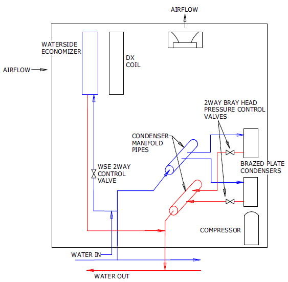

NFP Waterside Economizer
================

**R. Raustad, FSEC/UCF**

 - Original Date - 1/13/21
 - Revision Date
 

**Task Description**:

**Ability to properly model and control water-side economizers for self contained units** - Ability to model water side economizer in AirloopHVAC:UnitarySystem which enables free cooling and switching of DX compressor in that object.
## Justification for New Feature ##

Manufacturers have a configuration option that includes free cooling using a cooling coil dedicated to waterside economizing connected to the condenser plant (e.g., cooling towers). The cooling coil is upstream of a DX cooling coil which reduces the DX compressor energy use in cooling mode. EnergyPlus does not currently have a mechanism to properly model control of this configuration.

## E-mail and  Conference Call Conclusions ##

TBD

## Overview ##

The waterside economizer is used as a pre-cooling coil in packaged DX equipment. 

**The following description was excerpt from Trane Product Catalog PKG-PRC024D-EN**.

The waterside economizer substantially reduces the compressor energy requirements because
it uses the cooling water before it enters the condensers. Disadvantages include higher airside pressure drop and a higher head on condenser water pumps.

**Figure 1 Schematic of waterside economizer (Extracted from Trane Product Catalog)**

**Unit Operating Limits**

**Airflow**:
The minimum recommended airflow for proper VAV system staging and temperature control is 35 percent of nominal design airflow. Adjusting VAV boxes with the appropriate minimum settings prevents the self-contained unit from operating in a surge condition at airflows below this point. Continuous operation in a surge condition can cause fan failure.
Note: Contact your local Trane sales office for minimum airflow conditions.

**Water Flow**: Use 3 gpm/ton for optimum unit capacity and efficiency. Use 2.5 or 2 gpm/ton to reduce pump energy, cooling tower, and piping costs. However, these reduced water flows may impact unit capacity and efficiency by one or two percent. Consult factory for unit specific water flow ranges.

**Supply Air Temperature Control Unit Sequence of Operation
1** — Occupied Supply Air Temperature Control Cooling/Waterside Economizer
During occupied cooling mode, the waterside economizer option and mechanical cooling are used to control the supply air temperature. The supply air temperature setpoint is user defined.
After the fans run for 5 minutes, and a call for cooling is calculated, the Cooling Tower/Pump Command is turned on. After the Condenser Water flow switch closes proving flow, the
Compressors and/or Economizer will be allowed to start.
Waterside economizing enables when the unit’s entering water temperature is less than the
entering mixed air temperature. This is set at Waterside Economizer Enable Offset setpoint. The factory default is 7°F, but can be adjusted by the user.

The economizer acts as the first stage of cooling. If the economizer is unable to maintain the supply air setpoint, the unit controller will bring on the compressors as required to meet the setpoint. If the unit does not include an economizer, only mechanical cooling will satisfy cooling requirements.

**Discharge Air Cooling Setpoint** The Discharge Air Cooling Setpoint default valve of 55 degrees and the unit will control to this value when in the cooling mode. The setpoint can be adjusted 3 different ways.

 - Reset Based on Return Air Temperature: The Discharge Air Temperature can be reset based off the return air temperature which will work to keep this temepature between its heating and cooling setpoints.
 - Reset Based on Zone Temperature:
The Discharge Air Temperature can be reset based off the return air temperature which will work
to keep this temepature between its heating and cooling setpoints.

 - Reset Based on Zone Temperature: Zone reset is applied to the zone(s) in a building that tends to overcool or overheat. The supply air
temperature setpoint is adjusted based on the temperature of the critical zone(s).This can have the
effect of improving comfort and/or lowering energy usage.The user-defined parameters are the
same as for outdoor air reset.

**End Trane Product Catalog excerpt**.

**Note**: The set point control methods will remain the responsibility of existing EnergyPlus SetPointManagers.

## Approach ##

The waterside economizer is simply a water coil with special controls. The coil is not active if the entering coil air temperature is not sufficiently higher than the entering water temperature by some user specified value (e.g., 7 °F or 3.89 °C) and is controlled to a set point temperature. These controls must be "actuated" by some means. Since the existing UnitarySystem already has 3 coils within the parent, the initial  proposal is to wrap the existing water cooling coils in a parent object and place this new object upstream of the UnitarySystem to achieve the goal of free cooling. There are several coil wrappers in EnergyPlus as follows:

    CoilSystem:Cooling:DX
    A6,  \field Cooling Coil Object Type
         \key Coil:Cooling:DX:SingleSpeed
         \key CoilSystem:Cooling:DX:HeatExchangerAssisted
         \key Coil:Cooling:DX:TwoSpeed
         \key Coil:Cooling:DX:TwoStageWithHumidityControlMode
         \key Coil:Cooling:DX:VariableSpeed
         \key Coil:Cooling:DX:SingleSpeed:ThermalStorage

    CoilSystem:Heating:DX,
    A3,  \field Heating Coil Object Type
         \key Coil:Heating:DX:SingleSpeed
         \key Coil:Heating:DX:VariableSpeed

    CoilSystem:Cooling:Water:HeatExchangerAssisted,
    A2 , \field Heat Exchanger Object Type
        \key HeatExchanger:AirToAir:FlatPlate
         \key HeatExchanger:AirToAir:SensibleAndLatent
    A4 , \field Cooling Coil Object Type
         \key Coil:Cooling:Water
         \key Coil:Cooling:Water:DetailedGeometry

    CoilSystem:Cooling:DX:HeatExchangerAssisted,
    A2 , \field Heat Exchanger Object Type
         \key HeatExchanger:AirToAir:FlatPlate
         \key HeatExchanger:AirToAir:SensibleAndLatent
         \key HeatExchanger:Desiccant:BalancedFlow
    A4 , \field Cooling Coil Object Type
         \key Coil:Cooling:DX:SingleSpeed
         \key Coil:Cooling:DX:VariableSpeed

It may be time to begin consolodating these exising wrappers as done with the Coil:Cooling:DX object. The name would simply be CoilSystem and contain any type of coil with an optional heat exchangera available for cooling coils. This big of a change may be too big for this task, however, keeping this in mind for this new object is highly desireable.

Instead of incorporating a waterside economizer coil object into a packaged system, a generic method of providing free cooling is discussed here. The new object would be configured as a condenser plant demand side component and placed upstream of any existing coil types. A new wrapper will be developed to include the water coils. This wrapper could be specific to a new waterside economizer coil object or be more generic to allow branch water coils to be simulated without using the Controller:WaterCoil object. The more generic method is described here.

**Note**: This new object may also be used on the demand side of a cooling plant to support existing coil types.

## Input Description ##

    CoilSystem:Cooling:Water
        \memo Virtual container component that consists of a water cooling coil
        \memo and its associated controls. This control object supports the
        \memo available water coil types and may be placed directly on an
        \memo air loop branch or in an outdoor air equipment list.
        \min-fields 7
    A1, \field Name
        \required-field
        \reference WaterCoilSystemName
        \type alpha
        \reference-class-name validBranchEquipmentTypes
        \reference validBranchEquipmentNames
        \reference-class-name validOASysEquipmentTypes
        \reference validOASysEquipmentNames
    A2, \field Availability Schedule Name
        \note Availability schedule name for this system. Schedule value > 0
        \note means the system is available.
        \note If this field is blank, the system is always available.
        \type object-list
        \object-list ScheduleNames
    A3, \field Cooling Coil System Inlet Node Name
        \required-field
        \type node
    A4, \field Cooling Coil System Outlet Node Name
        \required-field
        \type node
    A5, \field Cooling Coil Object Type
        \type choice
        \required-field
        \key Coil:Cooling:Water
        \key Coil:Cooling:Water:DetailedGeometry
        \key CoilSystem:Cooling:Water:HeatExchangerAssisted ??
    A6, \field Cooling Coil Name
        \required-field
        \type object-list
        \object-list CoolingCoilsWater
    A7, \field Minimum Air To Water Temperature Offset
        \note Coil will turn on as required when inlet air temperature is above
        \note water temperature by amount of offset. To model a waterside
        \note economizer connect to condenser loop and increase offset as desired.
        \type real
        \units C
        \minimum 0.0
        \default 0.0
    A8, \field Dehumidification Control Type
        \type choice
        \key None
        \key Multimode
        \key CoolReheat
        \default None
        \note None = meet sensible load only
        \note Multimode = activate water coil and meet sensible load.
        \note If no sensible load exists, and Run on Latent Load = Yes, and a latent
        \note load exists, the unit will operate to meet the latent load.
        \note If the latent load cannot be met the heat exchanger will be activated.
        \note IF Run on Latent Load = No, the heat exchanger will always be active.
        \note CoolReheat = cool beyond the dry-bulb setpoint as required
        \note to meet the humidity setpoint.
        \note For all dehumidification controls, the max
        \note humidity setpoint on the Sensor Node is used.
        \note SetpointManager:SingleZone:Humidity:Maximum,
        \note SetpointManager:MultiZone:Humidity:Maximum, or
        \note SetpointManager:MultiZone:MaximumHumidity:Average, and
        \note SetpointManager:OutdoorAirPretreat (optional) objects.
    A9, \field Run on Sensible Load
        \type choice
        \key Yes
        \key No
        \default Yes
        \note If Yes, unit will run if there is a sensible load.
        \note If No, unit will not run if there is only a sensible load.
        \note Dehumidification controls will be active if specified.
    A10; \field Run on Latent Load
        \type choice
        \key Yes
        \key No
        \default No
        \note If Yes, unit will run if there is a latent load.
        \note even if there is no sensible load.
        \note If No, unit will not run only if there is a latent load.
        \note Dehumidification controls will be active if specified.

Several considerations need to be resolved for this new object.

 - Should a Sensor Node Name input field be included, or force use of the object or coil outlet node (recommended)
 - Should a controller tolerance input field be included or assume a typical value of 0.001 for temperature control and 0.00001 for humidity control
 - If the CoilSystem objects are consolodated, additional inputs would be needed for Use Outdoor Air DX Cooling Coil (A11) and Outdoor Air DX Cooling Coil Leaving Minimum Air Temperature (N1) to replicate all inputs for CoilSystem:Cooling:DX. Additional inputs would also be required for heat exchanger type and name.

## Testing/Validation/Data Sources ##

Compare results of existing coil types with this new object. Also test performance of the new waterside economizer model with object attached to a condenser loop and upstream of a UnitarySystem.

## Input Output Reference Documentation ##

Add new IO section for new object.

## Outputs Description ##

Same as water coils.

## Engineering Reference ##

Add new Engineering section for new object.

## Example File and Transition Changes ##

No transition required. New example file(s) will be included.

## References ##

None.

## Design Document ##

The UnitarySystem is the only air-side parent that uses the pointer/factory method. The pointer if of the class HVACSystemData.

SimAirServingZones::SimAirLoopComponent

    void SimAirLoopComponent(EnergyPlusData &state,
                             std::string const &CompName,
                             int CompType_Num,
                             bool FirstHVACIteration,
                             int AirLoopNum,       // Primary air loop number
                             int &CompIndex,
                             HVACSystemData *CompPointer); // HVACSystemData pointer

EnergyPlusData.cc

    namespace EnergyPlus {

    EnergyPlusData::EnergyPlusData() {
        // todo, try to eliminate the need for the singleton
        IOFiles::setSingleton(&files);

        this->dataAirflowNetworkBalanceManager = 
             std::make_unique<AirflowNetworkBalanceManagerData>();
        this->dataAirLoop = std::make_unique<DataAirLoopData>();
        this->dataAirLoopHVACDOAS = std::make_unique<AirLoopHVACDOASData>();
        this->dataAirSystemsData = std::make_unique<AirSystemsData>();

    New pointer:
 
        this->dataCoilSystemsData = std::make_unique<CoilSystemsData>();
        ...
    }

    void EnergyPlusData::clear_state() {
        this->dataAirflowNetworkBalanceManager->clear_state();
        this->dataAirLoop->clear_state();
        this->dataAirLoopHVACDOAS->clear_state();
        this->dataAirSystemsData->clear_state();

    New clear_state call:

        this->dataCoilSystemsData->clear_state();
        ...
    }
    }
    
CoilWaterSystems.hh

    New classes:

    struct CoilWaterSys : HVACSystemData
    {
        enum classes
        member variables
        member functions
        
    Public:
        
        external variables
        external functions
        
         CoilWaterSys(); // constructor

        ~CoilWaterSys() // destructor
        {
        }

        static void getCoilWaterSystemInputData(EnergyPlusData &state,
                                                std::string const &Name,
                                                bool const ZoneEquipment,
                                                int const ZoneOAUnitNum,
                                                bool &errorsFound);

    Note the same pointer class is used for factory call for this new coil object.

        static HVACSystemData *factory(EnergyPlusData &state,
                                       int const object_type_of_num,
                                       std::string const objectName,
                                       bool const ZoneEquipment,
                                       int const ZoneOAUnitNum);

    Note same argument list as HVACSystemData:simulate even though all arguments
    will not be used at this time:

        void simulate(EnergyPlusData &state,
                      std::string const &Name,
                      bool const firstHVACIteration,
                      int const &AirLoopNum,
                      int &CompIndex,
                      bool &HeatActive,
                      bool &CoolActive,
                      int const OAUnitNum,         // system is OutdoorAirUnit
                      Real64 const OAUCoilOutTemp, // Tinlet OutdoorAirUnit
                      bool const ZoneEquipment,    // TRUE if zone equipment
                      Real64 &sysOutputProvided,   // supply node sensible output
                      Real64 &latOutputProvided    // supply node latent output
        );
    }

    struct CoilWaterSystemsData : BaseGlobalStruct {

        int numCoilWaterSystems = 0;
        bool initCoilWaterSystemsErrFlag = false;

        bool getInputOnceFlag = true;
        bool getMSHPInputOnceFlag = true;

        std::vector<UnitarySystems::UnitarySys> coilSys;

        void clear_state() override
        {
            clear state variables
        }

        // Default Constructor
        CoilWaterSystemsData() = default;
    }
};

SimAirServingZones::GetAirPathData

    } else if (componentType == "COILSYSTEM:COOLING:DX") {
        state.dataAirSystemsData->PrimaryAirSystems(AirSysNum).Branch(BranchNum).
            Comp(CompNum).CompType_Num = DXSystem;
    } else if (componentType == "COILSYSTEM:HEATING:DX") {
        state.dataAirSystemsData->PrimaryAirSystems(AirSysNum).Branch(BranchNum).
            Comp(CompNum).CompType_Num = DXHeatPumpSystem;
    } else if (componentType == "COIL:USERDEFINED") {
        state.dataAirSystemsData->PrimaryAirSystems(AirSysNum).Branch(BranchNum).
            Comp(CompNum).CompType_Num = CoilUserDefined;
    } else if (componentType == "AIRLOOPHVAC:UNITARYSYSTEM") {
        state.dataAirSystemsData->PrimaryAirSystems(AirSysNum).Branch(BranchNum).
            Comp(CompNum).CompType_Num = UnitarySystemModel;
        UnitarySystems::UnitarySys thisSys;
        state.dataAirSystemsData->PrimaryAirSystems(AirSysNum).Branch(BranchNum).
            Comp(CompNum).compPointer =
            thisSys.factory(state,
                            DataHVACGlobals::UnitarySys_AnyCoilType,
                            state.dataAirSystemsData->PrimaryAirSystems(AirSysNum).
                                Branch(BranchNum).Comp(CompNum).Name,
                            false,
                            0);
                                                
    New factory call:

    } else if (componentType == "COILSYSTEM:COOLING:WATER") {
        state.dataAirSystemsData->PrimaryAirSystems(AirSysNum).Branch(BranchNum).
            Comp(CompNum).CompType_Num = CoilWaterSystem;
        CoilWaterSystems::CoilSys thisSys;
        state.dataAirSystemsData->PrimaryAirSystems(AirSysNum).Branch(BranchNum).
            Comp(CompNum).compPointer =
            thisSys.factory(state,
                            DataHVACGlobals::CoilWaterSys,
                            state.dataAirSystemsData->PrimaryAirSystems(AirSysNum).
                                Branch(BranchNum).Comp(CompNum).Name,
                            false,
                            0);
                                                

SimAirServingZones::SimAirLoopComponent
                                                
            } else if (SELECT_CASE_var == DXSystem) { // CoilSystem:Cooling:DX'
                SimDXCoolingSystem(state, CompName, FirstHVACIteration,
                                   AirLoopNum, CompIndex, _, _, QActual);
                if (QActual > 0.0) CoolingActive = true; // determine if coil is ON

            } else if (SELECT_CASE_var == DXHeatPumpSystem) {// CoilSystem:Heating:DX
                SimDXHeatPumpSystem(state, CompName, FirstHVACIteration, AirLoopNum,
                                    CompIndex, _, _, QActual);
                if (QActual > 0.0) HeatingActive = true; // determine if coil is ON

            } else if (SELECT_CASE_var == CoilUserDefined) { // Coil:UserDefined
                SimCoilUserDefined(state, CompName, CompIndex, AirLoopNum,
                                   HeatingActive, CoolingActive);

            } else if (SELECT_CASE_var == UnitarySystemModel) {
                // 'AirLoopHVAC:UnitarySystem'
                Real64 sensOut = 0.0;
                Real64 latOut = 0.0;
                CompPointer->simulate(state,
                                      CompName,
                                      FirstHVACIteration,
                                      AirLoopNum,
                                      CompIndex,
                                      HeatingActive,
                                      CoolingActive,
                                      OAUnitNum,
                                      OAUCoilOutTemp,
                                      ZoneEquipFlag,
                                      sensOut,
                                      latOut);

    New simulate call using override for HVACSystemData::simulate:

            } else if (SELECT_CASE_var == CoilWaterSystem) {
                // 'CoilSystem:Cooling:Water'
                Real64 sensOut = 0.0;
                Real64 latOut = 0.0;
                CompPointer->simulate(state,
                                      CompName,
                                      FirstHVACIteration,
                                      AirLoopNum,
                                      CompIndex,
                                      HeatingActive,
                                      CoolingActive,
                                      OAUnitNum,
                                      OAUCoilOutTemp,
                                      ZoneEquipFlag,
                                      sensOut,
                                      latOut);

Similar configuration in MixedAir.cc