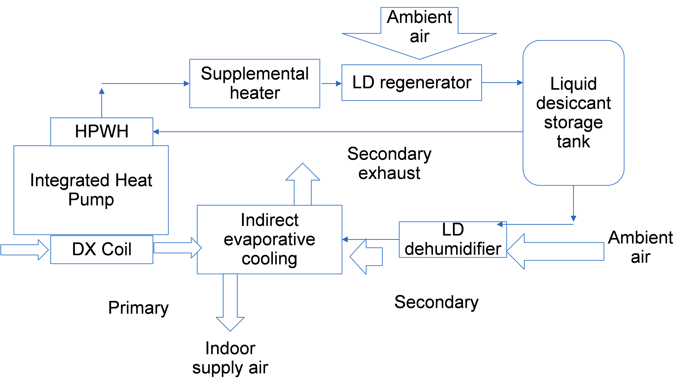

# Liquid Desiccant Storage Integrated Heat Pump

**Bo Shen and Jian Sun, ORNL**

- February 14, 2021 - Initial Draft

## Justification for Feature Update
Liquid desiccant facillitates latent energy storage and dehumidification. 
It can be coupled with an evaporative cooler as an alternative space cooling manner during grid peak hours. 
The EnergyPlus HVAC Grid-Responsive Flexibilities need to assess this feature. 
The ORNL team has developed a liquid desiccant coil object in another NFP. 
This NFP introduces the development grouping the liquid desiccant coil, with a main cooling coil, an evaporative cooler, and a thermostorge tank in an integrated heat pump parent object. 

## Overview
Liquid desiccant (LD) absorbs moisture from indoor air and dumps it to ambient using a heating source for recovery. 
Since the liquid desiccant cycle will add sensible load to indoor as an expense of dehumidification, the LD cycle is usually coupled with a main DX cooling coil or drives an evaporative cooler to deal with the sensible load. With this addition, EnergyPlus is able to model an LD cycle, including a dehumidifier and a regenerator; and its combination with a main DX cooiling coil or an evaporative cooler to provide separate sensible and latent cooling, or grid-responsive cooling with latent energy storage in a tank, and a recovery heat source. These components will be comprised in a liquid desiccant integrated heat pump, i.e. CoilSystem:DesiccantStorageHeatPump:AirSource. 

The first scenario of a LD cycle with a main DX cooling coil is depicted below, 

The second scenario of a LD cycle with a main DX cooling coil and an supplemental evaporative cooler is shown below,

## Model Description
CoilSystem:DesiccantStorageHeatPump:AirSource is connected to an air loop in a parent object of AirLoopHVAC:UnitaryHeatPump:AirToAir; and coupled with a thermostorage tank in a parent object of WaterHeater:HeatPump:PumpedCondenser. 

Components: 

In addition to the LD dehumidifier and regenerator, the integrated heat pump (IHP) contains three variable-speed DX cooling coils,
a main cooling acts when there is no enhanced dehumidification call nor grid-response requests; 
an enhanced dehumidification coil responds when a ZoneControl:Humidistat requires moisture removal in the loop object, 
and a grid-responsive cooling coil which operates during grid-responses. 

The IHP has two DX heating coils, a main heating coil and a grid-responsive heating coil. 
The grid-responsive coil provides grid responses , while the main heating coil meets the building heating load during other moments. 

The IHP can recover the condenser waste energy to heat the LD before heat and mass exchanged with the ambient air. 
The LD heating modes include: dedicated water heating mode (DWH - using the outdoor air as the source to heat the liquid desiccant in full condensing), 
combined space cooling and water heating mode  with full condensing (SCWH- using the indoor air as the source and the whole condenser heat), 
combined space cooling and water heating in desuperheating (SCDWH - using the indoor air as the source and the desuperheater heat). 
All the operation modes (coils) can be absent except the main space cooling mode. 
The dedicated water heating coil (DWH) can be from a sparate heat pump which responds simultaneously with the other modes, 
or from the same IHP using the single compressor to operarate at different moments from the other modes. 

The liquid desiccant storage IHP contains a LD dehumidifier (type: Coil:LiquidDesiccant:Simple) which can be placed at the UPSTREAM, DOWNSTREAM of the DX cooling coil, or OUTDOOR. 
If placed UPSTREAM or DOWNSTREAM in combination of the indoor DX cooling coil, the LD dehumidifier removes the indoor moisture while the DX cooling coil manages the sensible load. 
If placed OUTDOOR, it will dehumidify ambient air to drive an indirect evaporative cooler for indoor cooling. 
In this case, the type and name of the evaporative cooler should be given. 
A LD regenernator (type: Coil:LiquidDesiccant:Simple) is placed outdoor, downstream of all the LD heating coils. 
If all the LD heating coils can't elevate the LD temperature as high as needed, 
a supplemental heater (Gas, Electric or Solar) will be turned on. Out of the LD regenerator, the regenerated LD is storated in a thermosotorage tank,
connected in a WaterHeater:HeatPump:PumpedCondenser object. The LD dehumidifier draws flow from the storage tank. 

Control: 

The user will provide control targets below,  

Regeneration target temperature: the target LD temperature before entering the regeneration coil. 

Salt concentration target: the LD salt concentration upper limit in the storage tank before terminating the regeneration process. 

Salt concentration control band: below (salt concentration target – concentration control band), the regeneration operation will be called. 

Entering LD temperature limit to apply SCWH mode: below this LD temperature limit, the combined space cooling and water heating with full condensing mode can be applied. 

Entering LD temperature limit to apply SCDWH mode: below this LD temperature limit, the combined space cooling and water heating with desuperheating mode can be applied. 

Entering LD temperature limit to apply DWH mode: below this LD temperature limit, the dedicated water heating mode can be applied. 

During a grid responsive cooling period, i.e. called by signals embedded in the grid-responsive cooling coil (If the grid-responsive cooling coil is not present, the grid signal is from the main cooling coil), 
the LD dehumidifier operates in combination with the indoor DX cooling coil or an indirect evaporator cooler. 
If there is cooling call, but no requests from the grid, the IHP will operate either the main cooling coil or the enhanced dehumidification coil depending if there is a moisture removal call. 

During the other moments, when it calls space heating, the grid-responsive heating coil operates when there is a grid demand, otherwise, the main heating coil operates. 
When it requests LD regeneration without cooling/heating demand, it will operate the dedicated water heating mode if the entering LD temperature is below the limit for DWH. 
When there are simultaneous space cooling and water heating (LD regeneration) calls, the IHP will first try to operate the SCWH mode if the LD temperature is below the temperature limit for SCWH, 
otherwise, it will operate the SCDWH mode if allowed by the temperature limit of SCDWH mode. 
If the LD temperature is above the limits of all the water (LD) heating modes or can’t be heated up to the target temperature, the supplemental heater will automatically make up the heating capacity before entering the LD regeneration coil. 

CoilSystem:DesiccantStorageHeatPump:AirSource Sizing: 

The IHP will size all its children object, by inputting ratios of capacity and flow rates relative to its main cooling coil and dedicated water heating coil. 

## Implementation
CoilSystem:DesiccantStorageHeatPump:AirSource was added to IntegratedHeatPump.cc and IntegratedHeatPump.hh. 
The IHP object can be called from AirLoopHVAC:UnitaryHeatPump:AirToAir. 

## Testing

One example file has been added to demonstrate the new features, i.e. "DesiccantStorageHP.idf" . 

## Documentation

Some inline code documentation has been added, and additional documentation will be added later.

## IDD Changes and Transition

Input example for a liquid desiccant cycle coupled with an indirect evaporative cooler is shown below. 

  CoilSystem:DesiccantStorageHeatPump:AirSource,

    ASIHP1,                  !- Name
    DX Cooling Coil_unit1,    !- Space Cooling Coil  Name
    Main DX Heating Coil_unit1,  !- Space Heating Coil Name
    HPWHOutdoorDXCoilVS,     !- Dedicated Water Heating Coil Name
	SINGLE,					 ! --DWH mode belongs to a single unit or a separate unit
    SCWHCoil1,               !- SCWH Coil Name
    SCDWHCoolCoil1,          !- SCDWH Cooling Coil Name
    SCDWHWHCoil1,            !- SCDWH Water Heating Coil Name
	,						 ! - Enhanced dehumidification coil name
	,						 ! - Grid Response Cooling coil name
	Coil:LiquidDesiccant:Simple, ! -- dehumidification coil type
	DehumLDCoil, 			 !--dehumidification coil name
	OUTDOOR,				 ! - dehumidification coil placement: OUTDOOR; UPSTREAM; DOWNSTREAM
	Coil:LiquidDesiccant:Simple, ! -- regeneration coil type
	RegenLDCoil, 			 !--Regeneration coil name
	EvaporativeCooler:Indirect:CelDekPad,  !- First Evaporative Cooler Object Type
    Indirect Evaporative Cooler 1,  !- First Evaporative Cooler Object Name
	,						 ! - Grid Response Heating coil name
	GAS,					 ! - supplemental liquid desiccant heater type
	WaterHeater:HeatPump:PumpedCondenser,  ! - heat pump type
	OutdoorHeatPumpWaterHeater,  !- heat pump Name
    1.0,                       !- Minimum Speed Level for SCWH Mode {dimensionless}
    1.0,                       !- Minimum Speed Level for SCDWH Mode {dimensionless}
	60.0,					 ! - entering water temperature limit to apply SCWH mode 
	1.0,					 ! - entering water temperature limit to apply SCDWH mode
	60.0,					 ! - entering water temperature limit to apply DWH mode
    45.0,					 ! - regeneration target temperature 
    0.45,                    !-  salt concentration target
	0.02,                     ! - salt concentration control band
	1.0,                     !- dehumidification coil liquid desiccant flow rate sizing to DWH or SCWH water flow rate
	1.0,                     !- dehumidification coil air flow rate sizing to SC coil nominal air flow rate
	1.0,                     !- regeneration coil air flow rate sizing to SC coil nominal air flow rate
	1.0,                     !- sizing ratio of space heating coil to space cooling coil
	1.0,                     !- sizing ratio of dedicated water heating capacity to space cooling coil
	1.0, 					 !- sizing ratio of combined space cooling and water heating with full condensing - water heating capacity to space cooling coil
	1.0,                     !- sizing ratio of combined space cooling and water heating with desuperheating - space cooling capacity to space cooling coil
	0.15,                    !- sizing ratio of combined space cooling and water heating with desuperheating - water heating capacity to space cooling coil
	1.0,                     ! - sizing ratio of enhanced dehumidification coil to space cooling coil
	1.0,                     ! - sizing ratio of grid response cooling coil to space cooling coil
	1.0;                     ! - sizing ratio of grid response heating coil to space cooling coil
		
  Coil:LiquidDesiccant:Simple,

    RegenLDCoil,     !- Name
    PlantHPWHSch,   !- Availability Schedule Name
    autosize,                !- Design Water Flow Rate {m3/s}
    autosize,                !- Design Air Flow Rate {m3/s}
    autosize,                !- Design Inlet Water Temperature {C}
    autosize,                !- Design Inlet Air Temperature {C}
    autosize,                !- Design Outlet Air Temperature {C}
    autosize,                !- Design Inlet Air Humidity Ratio {kgWater/kgDryAir}
    autosize,                !- Design Outlet Air Humidity Ratio {kgWater/kgDryAir}
    autosize,                !- Design Inlet Solution Concentration
	55.0,                      !- Design fan power per unit mass flow rate
	autosize,                !- Outdoor Air Flow Rates {m3/s}
	75.0,                      !- Design pump power 
	0.9,                      !- Design peffectiveness
    HPOutdoorWaterOutletNode,  !- Water Inlet Node Name
    Regen Out,               !- Water Outlet Node Name
    Regen OA In,                        !- Air Inlet Node Name
    Regen OA Out,                        !- Air Outlet Node Name
    RegenerationMode,        !- Type of Operation Mode: 1- RegenerationMode, 2-DehumidificationMode
    OutdoorAirSource,        !- air source: 1-OutdoorAirSource 2-ZoneAirSource (default)
	LiCl;                    !-  material
	
 Coil:LiquidDesiccant:Simple,

    DehumLDCoil,     !- Name
    PlantHPWHSch,   !- Availability Schedule Name
    autosize,                !- Design Water Flow Rate {m3/s}
    autosize,                !- Design Air Flow Rate {m3/s}
    autosize,                !- Design Inlet Water Temperature {C}
    autosize,                !- Design Inlet Air Temperature {C}
    autosize,                !- Design Outlet Air Temperature {C}
    autosize,                !- Design Inlet Air Humidity Ratio {kgWater/kgDryAir}
    autosize,                !- Design Outlet Air Humidity Ratio {kgWater/kgDryAir}
    autosize,                !- Design Inlet Solution Concentration
	55.0,                      !- Design fan power per unit mass flow rate
	autosize,                !- Outdoor Air Flow Rates {m3/s}
	75.0,                      !- Design pump power 
	0.9,                      !- Design peffectiveness
    TankOut,                 !- Water Inlet Node Name
    TankIn,               !- Water Outlet Node Name
    Dehum2ndIn,                        !- Air Inlet Node Name
    EvapCool2ndIn,                        !- Air Outlet Node Name
    DehumidificationMode,        !- Type of Operation Mode: 1- RegenerationMode, 2-DehumidificationMode
    ZoneAirSource,        !- air source: 1-OutdoorAirSource 2-ZoneAirSource (default)	
	LiCl;                    !-  material
	
  EvaporativeCooler:Indirect:CelDekPad,

    Indirect Evaporative Cooler 1,  !- Name
    PlantHPWHSch,               !- Availability Schedule Name
    1.0,                     !- Direct Pad Area {m2}
    0.17,                     !- Direct Pad Depth {m}
    55.,                     !- Recirculating Water Pump Power Consumption {W}
    1.0,                     !- Secondary Air Fan Flow Rate {m3/s}
    0.7,                     !- Secondary Air Fan Total Efficiency
    200.0,                   !- Secondary Air Fan Delta Pressure {Pa}
    0.0,                    !- Indirect Heat Exchanger Effectiveness 0.67
    EvapCool1stIn,     !- Primary Air Inlet Node Name
    Heating Coil Air Inlet Node_unit1,  !- Primary Air Outlet Node Name
    Constant,                !- Control Type
    ,                        !- Water Supply Storage Tank Name
    EvapCool2ndIn;  !- Secondary Air Inlet Node Name
	

Input example for a LD cycle coupled with a main DX cooling coil. 

  CoilSystem:DesiccantStorageHeatPump:AirSource,

    ASIHP1,                  !- Name
    DX Cooling Coil_unit1,    !- Space Cooling Coil  Name
    Main DX Heating Coil_unit1,  !- Space Heating Coil Name
    HPWHOutdoorDXCoilVS,     !- Dedicated Water Heating Coil Name
	SINGLE,					 ! --DWH mode belongs to a single unit or a separate unit
    SCWHCoil1,               !- SCWH Coil Name
    SCDWHCoolCoil1,          !- SCDWH Cooling Coil Name
    SCDWHWHCoil1,            !- SCDWH Water Heating Coil Name
	,						 ! - Enhanced dehumidification coil name
	,						 ! - Grid Response Cooling coil name
	Coil:LiquidDesiccant:Simple, ! -- dehumidification coil type
	DehumLDCoil, 			 !--dehumidification coil name
	UPSTREAM,				 ! - dehumidification coil placement: OUTDOOR; UPSTREAM; DOWNSTREAM
	Coil:LiquidDesiccant:Simple, ! -- regeneration coil type
	RegenLDCoil, 			 !--Regeneration coil name
	,  !- First Evaporative Cooler Object Type
    ,  !- First Evaporative Cooler Object Name
	,						 ! - Grid Response Heating coil name
	GAS,					 ! - supplemental liquid desiccant heater type
	WaterHeater:HeatPump:PumpedCondenser,  ! - heat pump type
	OutdoorHeatPumpWaterHeater,  !- heat pump Name
    1.0,                       !- Minimum Speed Level for SCWH Mode {dimensionless}
    1.0,                       !- Minimum Speed Level for SCDWH Mode {dimensionless}
	60.0,					 ! - entering water temperature limit to apply SCWH mode 
	1.0,					 ! - entering water temperature limit to apply SCDWH mode
	60.0,					 ! - entering water temperature limit to apply DWH mode
    45.0,					 ! - regeneration target temperature 
    0.45,                    !-  salt concentration target
	0.02,                     ! - salt concentration control band
	1.0,                     !- dehumidification coil liquid desiccant flow rate sizing to DWH or SCWH water flow rate
	1.0,                     !- dehumidification coil air flow rate sizing to SC coil nominal air flow rate
	1.0,                     !- regeneration coil air flow rate sizing to SC coil nominal air flow rate
	1.0,                     !- sizing ratio of space heating coil to space cooling coil
	1.0,                     !- sizing ratio of dedicated water heating capacity to space cooling coil
	1.0, 					 !- sizing ratio of combined space cooling and water heating with full condensing - water heating capacity to space cooling coil
	1.0,                     !- sizing ratio of combined space cooling and water heating with desuperheating - space cooling capacity to space cooling coil
	0.15,                    !- sizing ratio of combined space cooling and water heating with desuperheating - water heating capacity to space cooling coil
	1.0,                     ! - sizing ratio of enhanced dehumidification coil to space cooling coil
	1.0,                     ! - sizing ratio of grid response cooling coil to space cooling coil
	1.0;                     ! - sizing ratio of grid response heating coil to space cooling coil

IDD Objects (Modified):

CoilSystem:DesiccantStorageHeatPump:AirSource,     
 \memo This object is used for air-source integrated heat pump with liquid desiccant storage, a collection of its working modes.

    A1, \field Name
        \required-field
        \type alpha
        \reference IntegratedHeatPumps
        \note Unique name for this instance of an air-source integrated heat pump.
    A2, \field Space Cooling Coil  Name
        \required-field
        \type object-list
        \object-list CoolingCoilsDXVariableSpeed
        \note Must match the name used in the corresponding Coil:Cooling:DX:VariableSpeed object.
    A3, \field Space Heating Coil Name
        \type object-list
        \object-list HeatingCoilsDXVariableSpeed
        \note Must match the name used in the corresponding Coil:Heating:DX:VariableSpeed object.
    A4, \field Dedicated Water Heating Coil Name
        \type object-list
        \object-list HeatPumpWaterHeaterDXCoilsVariableSpeed
        \note Must match the name used in the corresponding Coil:WaterHeating:AirToWaterHeatPump:VariableSpeed object.
    A5,  \field Dedicated Water Heating Coil Belongs to a Single or Separate Unit
        \type choice
        \key Single
        \key Separate
        \default Single
    A6, \field SCWH Coil Name
        \type object-list
        \object-list HeatPumpWaterHeaterDXCoilsVariableSpeed
        \note Must match the name used in the corresponding Coil:WaterHeating:AirToWaterHeatPump:VariableSpeed object.
    A7, \field SCDWH Cooling Coil Name
        \type object-list
        \object-list CoolingCoilsDXVariableSpeed
        \note Must match the name used in the corresponding Coil:Cooling:DX:VariableSpeed object.
    A8, \field SCDWH Water Heating Coil Name
        \type object-list
        \object-list HeatPumpWaterHeaterDXCoilsVariableSpeed
        \note Must match the name used in the corresponding Coil:WaterHeating:AirToWaterHeatPump:VariableSpeed object.
    A9, \field Enhanced Dehumidification Cooling Coil Name
        \type object-list
        \object-list CoolingCoilsDXVariableSpeed
        \note Must match the name used in the corresponding Coil:Cooling:DX:VariableSpeed object.
    A10, \field Grid Response Cooling Coil Name
        \type object-list
        \object-list CoolingCoilsDXVariableSpeed
        \note Must match the name used in the corresponding Coil:Cooling:DX:VariableSpeed object.
    A11, \field Dehumidification Desiccant Coil Object Type
        \required-field
        \type choice
        \key Coil:LiquidDesiccant:Simple
    A12,  \field Dehumidification Desiccant Coil Object Name
        \required-field
        \type object-list
        \object-list SimpleCoils  
    A13,  \field Placement of Liquid Desiccant Dehumidifier
        \type choice
        \key OUTDOOR
        \key UPSTREAM
	    \key DOWNSTREAM
        \default OUTDOOR
    A14, \field Regeneration Desiccant Coil Object Type
        \required-field
        \type choice
        \key Coil:LiquidDesiccant:Simple
    A15,  \field Regeneration Desiccant Coil Object Name
        \required-field
        \type object-list
        \object-list SimpleCoils
    A16,  \field Evaporative Cooler Object Type
        \type choice
        \key EvaporativeCooler:Direct:CelDekPad
        \key EvaporativeCooler:Direct:ResearchSpecial
        \key EvaporativeCooler:Indirect:CelDekPad
        \key EvaporativeCooler:Indirect:WetCoil
        \key EvaporativeCooler:Indirect:ResearchSpecial
    A17,  \field Evaporative Cooler Object Name
        \type object-list
        \object-list EvapCoolerNames
    A18, \field Grid Response Space Heating Coil Name
        \type object-list
        \object-list HeatingCoilsDXVariableSpeed
        \note Must match the name used in the corresponding Coil:Heating:DX:VariableSpeed object.
    A19,  \field Supplemental Liquid Desicccant Heating Fuel Type
        \type choice
        \key Electric
        \key Gas
        \key None
        \Default None		
    A20 , \field Zone Equipment 1 Object Type
        \type choice
        \key WaterHeater:HeatPump:PumpedCondenser
        \required-field
    A21, \field Zone Equipment 1 Name
        \required-field
        \type object-list
        \object-list ZoneEquipmentNames
    N1 , \field Minimum Speed Level for SCWH Mode
        \units dimensionless
        \type integer
        \default 1
        \minimum> 0
        \maximum< 10
    N2 , \field Minimum Speed Level for SCDWH Mode
        \units dimensionless
        \type integer
        \default 1
        \minimum> 0
        \maximum< 10
    N3 , \field Water Inlet Temperature Limit below which Combined Space Cooling and Water Heating with Full Condensing is Allowed. 
        \type real
        \units C
        \minimum> 0.0
        \default 51.1
    N4 , \field Water Inlet Temperature Limit below which Combined Space Cooling and Water Heating with Desuperheating is Allowed. 
        \type real
        \units C
        \minimum> 0.0
        \default 70.0
    N5 , \field Water Inlet Temperature Limit below which Dedicated Water Heating is Allowed. 
        \type real
        \units C
        \minimum> 0.0
        \default 51.1
    N6 , \field Regeneration Target Liquid Desiccant Temperature 
        \type real
	    \units C
        \minimum> 0.0
        \default 80.0   
    N7 , \field Salt Concentration Setting Point
        \type real
	    \units dimensionless
        \minimum> 0.0
        \default 0.45
    N8 , \field Salt Concentration Dead Band
        \type real
	    \units dimensionless
        \minimum> 0.0
        \default 0.05
    N9,  \field Dehumidification Coil Liquid Dessicant Circulation Mass Flow Rate Sizing Ratio to DWH or SCWH water flow rate
        \type real
	    \units dimensionless
        \minimum> 0.0
        \default 1.0  
    N10, \field Dehumidification Coil Air Mass Flow Rate Sizing Ratio to Space Cooling Coil Norminal Air Flow Rate
        \type real
	    \units dimensionless
        \minimum> 0.0
        \default 1.0	 
    N11, \field Regeneration Coil Air Mass Flow Rate Sizing Ratio to Space Cooling Coil Norminal Air Flow Rate
        \type real
	    \units dimensionless
        \minimum> 0.0
        \default 1.0		   
    N12, \field Sizing Ratio of Space Heating Coil to Space Cooling Coil
        \units dimensionless
        \type real
	    \default 1.0
        \minimum> 0
	    \maximum< 5.0
    N13, \field Sizing Ratio of Dedicated Water Heating Coil to Space Cooling Coil
        \units dimensionless
        \type real
	    \default 1.0
        \minimum> 0
	    \maximum< 5.0
    N14, \field Sizing Ratio of Combined Space Cooling and Water Heating Coil with Full Condensing to Space Cooling Coil
        \units dimensionless
        \type real
	    \default 1.0
        \minimum> 0
	    \maximum< 5.0
    N15, \field Sizing Ratio of Combined Space Cooling and Water Heating Coil with Desuperheating - Cooling Capacity to Space Cooling Coil
        \units dimensionless
        \type real
	    \default 1.0
        \minimum> 0
	    \maximum< 5.0
    N16, \field Sizing Ratio of Combined Space Cooling and Water Heating Coil with Desuperheating - Water Heating Capacity to Space Cooling Coil
        \units dimensionless
        \type real
	    \default 0.15
        \minimum> 0
	    \maximum< 5.0
    N17, \field Sizing Ratio of Enhanced Dehumidification Coil to Space Cooling Coil
        \units dimensionless
        \type real
	    \default 0.9
        \minimum> 0
	    \maximum< 5.0
    N18, \field Sizing Ratio of Grid Response Coil to Space Cooling Coil
        \units dimensionless
        \type real
	    \default 0.9
        \minimum> 0
	    \maximum< 5.0
    N19; \field Sizing Ratio of Grid Response Heating Coil to Space Cooling Coil
        \units dimensionless
        \type real
	    \default 0.9
        \minimum> 0
	    \maximum< 5.0