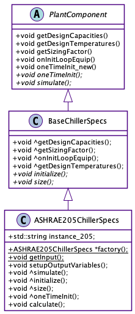

# ASHRAE-205 Chillers

**Tanaya Mankad, Neal Kruis; Big Ladder Software**

## Overview

ASHRAE Standard 205P defines common data models and serialization formats for facility equipment performance data needed for engineering applications such as energy simulation.  The formats allow automated exchange among data sources (manufacturers), simulation models, and other engineering applications. The formats and procedures specified in the standard are developed by SPC (Standard Project Committee) 205 under ASHRAE and ANSI consensus processes. SPC-205 membership includes equipment manufacturers, application software developers, and engineering practitioners.

The standard is in its fourth public review at the time of this writing; an overview can be found at http://data.ashrae.org/standard205/.

As a first step to introducing the full set of equipment specified by 205, we will integrate the representation of chillers as a standalone modeling object. Although the current specification for chillers, known as RS0001, is limited to liquid-cooled chillers, it will evolve to contain other capabilities (e.g., air-cooled condensers, heat recovery).

## Implementation

We will add a new chiller object to EnergyPlus, `Chiller:Electric:ASHRAE205`. This object will share the same topology (i.e., node connection inputs) as other chiller objects, but all of the performance related inputs will be parsed from an external representation file referenced by the object.

Standard 205 representations are stored in either human-readable JSON or serialized CBOR (Concise Binary Object Representation) format. The new libtk205 (Toolkit 205) library, part of the open-source project [open205](https://github.com/open205), supports all operations relating to opening and parsing the representation file, and will link with EnergyPlus to populate the new EnergyPlus chiller class derived from BaseChillerSpecs.



### Calculations

One of the advantages of ASHRAE Standard 205 is that available equipment operating conditions must be provided as raw performance maps in a representation. These performance maps are straightforward to arrange in a tabular format, which the libtk205 library passes to the same multi-dimensional interpolation engine ([btwxt](https://github.com/bigladder/btwxt)) which is already used in EnergyPlus to calculate performance at different operating conditions. Rather than being extracted from a regression curve, which can produce physically unrealistic results near their boundaries and can fail to capture internal inflections, equipment performance is interpolated within the closest available data to the operating point. The performance calculation will be embedded in the `simulate()` function of our `ASHRAE205ChillerSpecs` class. 

One complication from relying on a 205 chiller representation arises when design conditions require a chiller capacity other than what is specified in the representation file. We expect that the existing autosizing algorithm in EnergyPlus will allow scaling of the representation data for other sizes. This type of size scaling is not intended for ASHRAE 205 representations, and will be accompanied with a warning. The sizing calculations will also include a *Sizing Factor* as enumerated in the [IDD](#markdown-header-idd-changes-and-transition) section below.

## Testing

In order to test the new `Chiller:Electric:ASHRAE205` object, we will create a new model based on an existing one, e.g. `Chiller:Electric:ReformulatedEIR`. A new ASHRAE 205 representation file will be created using performance characteristics from the known model, using its performance curves to back-calculate the tabular parameter and lookup information required by the new representation. We will ensure results between the two files are similar, within reason.

## IDD Changes and Transition

We will add a new object `Chiller:Electric:ASHRAE205`. As ASHRAE 205 eliminates the need to specify regression coefficients, the IDD entry primarily describes the equipment topology.

<!-- Do we need reference temperatures?
  N4 , \field Reference Leaving Chilled Water Temperature
       \type real
       \default 6.67
       \units C
  N5 , \field Reference Entering Condenser Fluid Temperature
       \type real
       \default 29.4
       \units C
  N6 , \field Reference Chilled Water Flow Rate
       \type real
       \units m3/s
       \minimum> 0
       \autosizable
       \ip-units gal/min
  N7 , \field Reference Condenser Fluid Flow Rate
       \type real
       \units m3/s
       \autosizable
       \minimum 0.0
       \ip-units gal/min
       \note This field is only used for Condenser Type = AirCooled or EvaporativelyCooled
       \note when Heat Recovery is specified
-->
<!-- Do we need to be messing around with this if it's in the file? (NO)
  N3 , \field Reference COP
       \note Efficiency of the chiller compressor (cooling output/compressor energy input).
       \note Condenser fan power should not be included here.
       \type real
       \units W/W
       \required-field
       \minimum> 0.0
-->
```
Chiller:Electric:ASHRAE205,
   \memo This chiller model is based on the ASHRAE Standard 205 representation specification for chillers.
  A1,  \field Name
       \type alpha
       \reference Chillers
       \required-field
       \reference-class-name validPlantEquipmentTypes
       \reference validPlantEquipmentNames
       \reference-class-name validBranchEquipmentTypes
       \reference validBranchEquipmentNames
  A2,  \field Representation File Name
       \note The name of the ASHRAE205 RS0001 (chiller) representation file
       \type alpha
       \retaincase
       \required-field
  A3,  \field Zone Name
       \note Chiller efficiency losses are added as heat gains to this Zone. If blank, losses are not added to any Zone.
       \type object-list
       \object-list ZoneNames
  N1,  \field Reference Capacity
       \type real
       \units W
       \required-field
       \minimum> 0.0
       \autosizable
  N2,  \field Sizing Factor
       \note Multiplies the autosized capacity and flow rates
       \type real
       \minimum> 0.0
       \default 1.0
  A4,  \field Chilled Water Inlet Node Name
       \type node
       \required-field
  A5,  \field Chilled Water Outlet Node Name
       \type node
       \required-field
  A6,  \field Condenser Inlet Node Name
       \type node
       \note Not required if air-cooled or evaporatively-cooled
  A7,  \field Condenser Outlet Node Name
       \type node
       \note Not required if air-cooled or evaporatively-cooled
  A8,  \field Oil Cooler Inlet Node Name
       \type node
       \note Not required if oil cooler heat is rejected to condenser stream
  A9,  \field Oil Cooler Outlet Node Name
       \type node
       \note Not required if oil cooler heat is rejected to condenser stream
  A10, \field Auxiliary Inlet Node Name
       \type node
       \note Not required if auxilliary heat is rejected to condenser stream
  A11, \field Auxiliary Outlet Node Name
       \type node
       \note Not required if auxilliary heat is rejected to condenser stream
  A12, \field Heat Recovery Inlet Node Name
       \type node
       \note For RS0001 expansion; heat recovery not currently supported
  A13, \field Heat Recovery Outlet Node Name
       \type node
       \note For RS0001 expansion; heat recovery not currently supported
  A14, \field End-Use Subcategory
       \note Any text may be used here to categorize the end-uses in the ABUPS End Uses by Subcategory table.
       \type alpha
       \retaincase
       \default General
```

## Documentation

Much of the content above will be modified to describe the feature in "Input Output Reference", and details of the aggregation calculations in "Engineering Reference".
