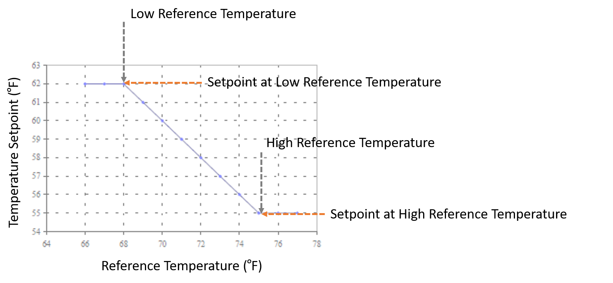

System Node Temperature & Humidity Ratio Reset Setpoint Manager
================

**Jeremy Lerond, Wooyoung Jung, Jian Zhang PNNL**

 - Original Date: 10/27/2021
 - Revision Date: 01/14/2022

## Justification for New Feature ##

Currently, EnergyPlus does not support Temperature or Humidity Ratio Setpoint Reset based on a system's Reference (e.g., Return) Temperature or Humidity ratio. While this method is not often used for high-performance building, these reset control strategies are widely used in the industry. Hence, a request to add such SetPoint Managers (SPMs) to EnergyPlus has been made and this new feature will deliver such needs.

The request can take two approaches: (1) an approach similar to the `SetpointManager:OutdoorAirReset` object, but looking at reference temperature or humidity ratio to determine the setpoint, and (2) an approach similar to the `SetpointManager:ReturnTemperature:ChilledWater` object but applicable to an air loop as well. After discussing with industry experts and gathering supportive information, it was found that the former approach is the most widely used, the latter is mostly used for single-zone systems (which could use the `SetpointManager:SingleZone:Heating/Cooling` objects) or systems with very large air flows. Hence, this NFP will take the former approach.

## E-mail and  Conference Call Conclusions ##

## Overview ##

A new SPM, `SetpointManager:SystemNodeReset`, will be added to EnergyPlus. This new SPM will set the temperature or humidity ratio setpoint at a user-specified system node or node list based on a user-defined linear relationship between the reference temperature or humidity ratio and temperature or humidity ratio setpoints. This SPM will be similarly structured with the `SetpointManager:OutdoorAirReset`, but will be adjusted as it covers humidity ratio as one of the control variables.

## Approach ##

This SPM will set a temperature or humidity ratio setpoint at a user-defined node or node list based on the temperature or humidity ratio at another user-defined node which is set to be the system's reference node. The setpoint is determined using a linear relationship defined by the user (see Input Description). The figure below shows a typical Temperature Setpoint = f(Reference Temperature) reset [Guanghua et al. 2002]. The blue line represents the relationship between the reference temperature and the temperature setpoint.



The approach used by this SPM is similar to the existing `SetpointManager:OutdoorAirReset`, hence the calculations for the existing object will be similarly devised in the new SPM object.

## Testing/Validation/Data Sources ##

Unit tests checking the correct functioning of the new SPM will be implemented. Tests will include cases where both temperature or humidity ratio is within and outside the temperature or humidity ratio bounds of the linear relationship.

## Input Output Reference Documentation ##

A new subsection for the new SPM will be added to the I/O reference guide as follows:

\subsection{SetpointManager:SystemNodeReset}\label{setpointmanagersystemnodereset}

The System Node Reset Setpoint Manager is used to place a temperature or humidity ratio setpoint on a system node according to the reference (e.g., return) temperature or humidity ratio of a system node using a reset rule. The reset rule is determined by two points: setpoints at low and high reference temperature or humidity ratio (SpAtLowRefTemp and SpAtHighRefTemp or SpAtLowRefHumRat and SpAtHighRefHumRat). In general, the higher the reference temperature or humidity ratio, the lower the setpoint. Specifically, the temperature or humidity ratio setpoints at low reference temperature or humidity ratio start decreasing linearly to the temperature or humidity ratio setpoints at high reference temperature or humidity ratio when the temperature or humidity ratio becomes higher than the low reference temperature or humidity ratio (LowRefTemp or LowRefHumRat) until the high reference temperature or humidity ratio (HighRefTemp or HighRefHumRat). The reference temperature or humidity ratio is obtained from the user-specified system node during the simulation. This SPM can be used to place a temperature or humidity ratio setpoint on HVAC system nodes.

The input consists of the setpoint manager name, the control variable, the name of the node or node list affected by the setpoint, the name of the reference node name, and the data for the reset rule: setpoints at low and high reference temperatures, low and high reference temperatures, setpoints at low and high reference humidity ratios, low and high reference humidity ratios. Depending on the selected control variable, this setpoint manager uses the temperature inputs or humidity ratio inputs.

\subsubsection{Inputs}

\paragraph{Field: Name}

A unique, user-assigned name for an instance of a system node reset setpoint manager. Anywhere in the input that this setpoint manager is used, it is referred to by this name.

\paragraph{Field: Control Variable}

The type of variable that will be controlled. There are six key choices for this type of set point manager:
\begin{itemize}
  \item Temperature
  \item MaximumTemperature
  \item MinimumTemperature
  \item HumidityRatio
  \item MaximumHumidityRatio
  \item MinimumHumidityRatio

\paragraph{Field: Setpoint at Low Reference Temperature}\label{field-setpoint-at-low-reference-temperature}

The temperature setpoint in \(^{o}\)C at the low reference temperature for the reset rule. This input is required when Temperature, MaximumTemperature or MinimumTemperature is selected as the control variable.

\paragraph{Field: Setpoint at High Reference Temperature}\label{field-setpoint-at-low-reference-temperature}

The temperature setpoint in \(^{o}\)C at the high reference temperature for the reset rule. This input is required when Temperature, MaximumTemperature or MinimumTemperature is selected as the control variable.

\paragraph{Field: Low Reference Temperature}\label{field-low-reference-temperature}

The low reference temperature in \(^{o}\)C for the reset rule. In other words, when the reference temperature is lower than this value, the temperature setpoint is at its maximum.

\paragraph{Field: High Reference Temperature}\label{field-high-reference-temperature}

The high reference temperature in \(^{o}\)C for the reset rule. In other words, when the reference temperature is higher than this value, the temperature setpoint is at its minimum.

\paragraph{Field: Setpoint at Low Reference Humidity Ratio}\label{field-setpoint-at-low-reference-humidity-ratio}

The humidity ratio setpoint in kgWater/kgDryAir at the low reference humidity ratio for the reset rule. This input is required when HumidityRatio, MaximumHumidityRatio or MinimumHumidityRatio is selected as the control variable.

\paragraph{Field: Setpoint at High Reference Humidity Ratio}\label{field-setpoint-at-high-reference-humidity-ratio}

The humidity ratio setpoint in kgWater/kgDryAir at the high reference humidity ratio for the reset rule. This input is required when HumidityRatio, MaximumHumidityRatio or MinimumHumidityRatio is selected as the control variable.

\paragraph{Field: Low Reference Humidity Ratio}\label{field-low-reference-humidity-ratio}

The low reference humidity ratio in kgWater/kgDryAir for the reset rule. In other words, when the reference humidity ratio is lower than this value, the humidity ratio setpoint is at its maximum.

\paragraph{Field: High Reference Humidity Ratio}\label{field-high-reference-humidity-ratio}

The high reference humidity ratio in kgWater/kgDryAir for the reset rule. In other words, when the reference humidity ratio is higher than this value, the humidity ratio setpoint is at it minimum.

\paragraph{Field: Reference Node Name}\label{field-reference-node-name}

The name of a reference system node which will be used as a reference to determine the setpoint established by this setpoint manager.

\paragraph{Field: Setpoint Node or NodeList Name}\label{field-setpoint-node-or-nodelist-name}

The name of a \hyperref[nodelist]{NodeList} object containing the names of the HVAC system nodes or the HVAC System Node Name for which temperature setpoints will be established by this setpoint manager.

Below are examples, showing the inputs for SetpointManager:SystemNodeReset.

\begin{lstlisting}

SetpointManager:SystemNodeReset,
  Supply Air Temp Manager,    !- Name
  Temperature,                !- Control Variable
  20.0,                       !- Setpoint at Low Reference Temperature {C}
  16.7,                       !- Setpoint at High Reference Temperature {C}
  12.8,                       !- Low Reference Temperature {C}
  23.9,                       !- High Reference Temperature {C}
  ,                           !- Setpoint at Low Reference Humidity Ratio {kgWater/kgDryAir}
  ,                           !- Setpoint at High Reference Humidity Ratio {kgWater/kgDryAir}
  ,                           !- Low Reference Humidity Ratio {kgWater/kgDryAir}
  ,                           !- High Reference Humidity Ratio {kgWater/kgDryAir}
  Reference Air Node,         !- Reference Node Name
  Supply Air Temp Nodes;      !- Setpoint Node or NodeList Name

SetpointManager:SystemNodeReset,
  Supply Humidity Manager,       !- Name
  Humidity Ratio,                !- Control Variable
  ,                              !- Setpoint at Low Reference Temperature {C}
  ,                              !- Setpoint at High Reference Temperature {C}
  ,                              !- Low Reference Temperature {C}
  ,                              !- High Reference Temperature {C}
  0.008,                         !- Setpoint at Low Reference Humidity Ratio {kgWater/kgDryAir}
  0.004,                         !- Setpoint at High Reference Humidity Ratio {kgWater/kgDryAir}
  0.003,                         !- Low Reference Humidity Ratio {kgWater/kgDryAir}
  0.010,                         !- High Reference Humidity Ratio {kgWater/kgDryAir}
  Reference Air Node,            !- Reference Node Name
  Supply Air Temp Nodes;         !- Setpoint Node or NodeList Name
\end{lstlisting}

## Input Description ##
A new `SetpointManager:SystemNodeReset` object will be added as follows:

```
SetpointManager:SystemNodeReset,
     \memo This Setpoint Manager is used to place a temperature or humidity ratio setpoint on a system node according to the reference (e.g., return) temperature or humidity ratio using a reset rule.
     \memo The temperature or humidity ratio setpoint is obtained by retrieving the temperature or humidity ratio of the user specified reference system node.
     \memo
  A1 , \field Name
       \required-field
  A2 , \field Control Variable
       \required-field
       \type choice
       \key Temperature
       \key MaximumTemperature
       \key MinimumTemperature
       \key HumidityRatio
       \key MaximumHumidityRatio
       \key MinimumHumidityRatio
  N1 , \field Setpoint at Low Reference Temperature
       \units C
       \note Applicable only if Control Variable is Temperature, MaximumTemperature, or MinimumTemperature.
  N2 , \field Setpoint at High Reference Temperature
       \units C
       \note Applicable only if Control Variable is Temperature, MaximumTemperature, or MinimumTemperature.
  N3 , \field Low Reference Temperature
       \units C
       \note Applicable only if Control Variable is Temperature, MaximumTemperature, or MinimumTemperature.
  N4 , \field High Reference Temperature
       \units C
       \note Applicable only if Control Variable is Temperature, MaximumTemperature, or MinimumTemperature.
  N1 , \field Setpoint at Low Reference Humidity Ratio
       \units kgWater/kgDryAir
       \note Applicable only if Control Variable is HumidityRatio, MaximumHumidityRatio, or MinimumHumidityRatio.
  N2 , \field Setpoint at High Reference Humidity Ratio
       \units kgWater/kgDryAir
       \note Applicable only if Control variable is Humidity Ratio, MaximumHumidityRatio, or MinimumHumidityRatio.
  N3 , \field Low Reference Humidity Ratio
       \units kgWater/kgDryAir
       \note Applicable only if Control variable is Humidity Ratio, MaximumHumidityRatio, or MinimumHumidityRatio.
  N4 , \field High Reference Humidity Ratio
       \units kgWater/kgDryAir
       \note Applicable only if Control variable is Humidity Ratio, MaximumHumidityRatio, or MinimumHumidityRatio.  
  A3 , \field Reference Node Name
       \note The name of an HVAC system node.
       \required-field
       \type node
  A4 ; \field Setpoint Node or NodeList Name
       \note Node(s) for which temperature or humidity ratio will be set.
       \required-field
       \type node
```

## Outputs Description ##

No new outputs will be created.

## Engineering Reference ##

A new subsection under SPMs will be created and contain the following text:

The input object SetpointManager:SystemNodeReset provides a setpoint manager that places a temperature or humidity setpoint on a system node according to the reference (e.g., return) temperature or humidity using a reset strategy. The user defines a reset rule for this strategy by specifying two temperature or humidity ratio setpoints at two reference air temperatures or humidity ratios. Generally the lower temperature (or humidity ratio) setpoint is matched with the higher reference air temperature (or humidity ratio) and vice versa.

The parameter \(T_{set}\) is determined as per the following pseudo code:
```
If \({T_{ret,low}} < {T_{ret,high}}\) ~then
     If \({T_{ret}} \le {T_{ret,low}}\) ~then
          \({T_{set}} = {T_{set,atRetlow}}\)
     End If
     If \({T_{ret}} \ge {T_{ret,high}}\) ~then
          \({T_{set}} = {T_{set,atRethigh}}\)
     Else
          \({T_{set}} = {T_{set,atRetlow}} - (({T_{ret}} - {T_{ret,low}})/({T_{ret,high}} - {T_{ret,low}}))\cdot ({T_{set,atRetlow}} - {T_{set,atRethigh}})\)
     End If
Else
     \({T_{set}} = 0.5({T_{set,atRetlow}} + {T_{set,atRethigh)}}\)
End IF
```
\emph{\({T_{set}}\)} will be applied to the node or nodes specified in the \emph{SetpointManager:SystemNodeReset} object input.

When humidity ratio is selected as the control variable, the same pseudo code, but addressing humidity ratio, will be applied.

## Example File and Transition Changes ##

A new example idf file using SetpointManager:SystemNodeReset will be created to demonstrate how this new feature can be used. This example file will demonstrate how this new SetpointManager will be applied to air loop and plant loop nodes. Also, the Output:Variable objects in the example idf will be added so that this example file produces the output files showing how SetpointManager:SystemNodeReset plays a role to determine the setpoint.

No transition changes are expected.

## References ##

- Guanghua, Wei & Turner, W. & Claridge, David & Liu, Mao. (2003). Single-Duct Constant Air Volume System Supply Air Temperature Reset: Using Return Air Temperature or Outside Air Temperature?. 10.1061/40699(2003)23.

# Design Document #

This new feature revises modules: SetpointManager.

## Changes to the IDD file ##
A new object called SetpointManager:SystemNodeReset, as shown in the Input Description Section, will be added to the idd file.

## Setpoint Manager ##
This code change adds a new structure called `DefineSysNodeResetSetPointManager` to the header file (`SetPointManager.hh`) and the other changes are made to `SetPointManager.cc`.

The inputs will be grabbed through the `GetSetPointManagerInputData` function, similar with other SetpointManager objects. The following are the cases that the error gets produced: (1) when the invalid control variable is inputted, (2) the maximum temperature or humidity ratio setpoint is higher than the minimum temperature or humidity ratio setpoint.

The new function called `DefineSystemNdResetSetPointManager::calculate` will determine which input parameters will be used for setpoint calculation depending on the selected control variable. Since the calculation for the sepoint is the same as the SetpointManager:OutdoorAirReset (`DefineOutsideAirSetPointManager::CalcSetPoint`), the function will be moved outside the `DefineOutsideAirSetPointManager` struct and then called to `DefineOutsideAirSetPointManager::calculate` and `DefineSysNodeResetSetPointManager::calculate`.

The calculated setpoint gets applied through `InitSetPointManagers`, `SimSetPointManagers`, and `UpdateSetPointManagers` functions, similar with other SetpointManager objects.
