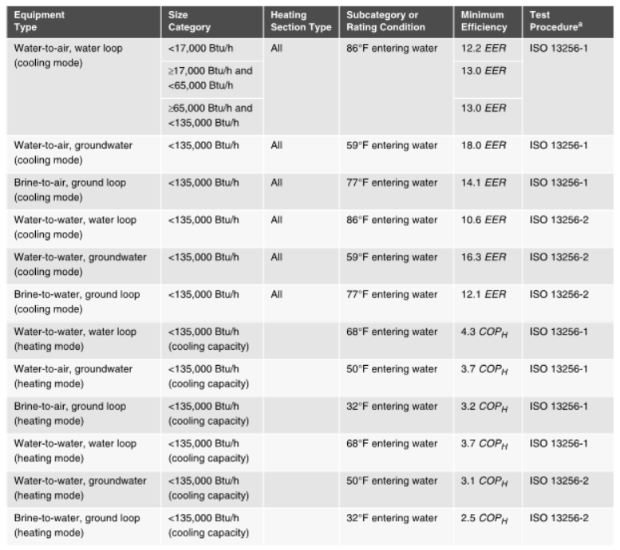
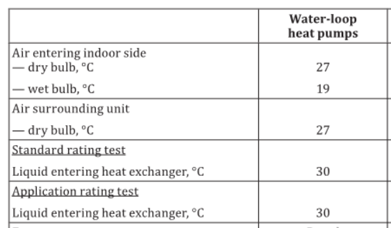
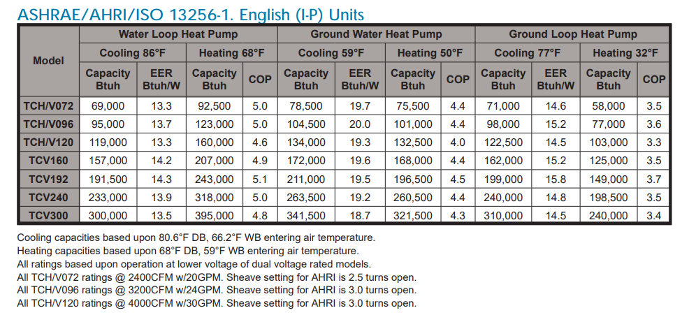

Rated Temperature Inputs for Water To Air Coils
================

**Jeremy Lerond, Wooyoung Jung, and Jian Zhang, PNNL**

 - Original Date: 10/21/2021
 - Revision Date: 06/22/2022

## Justification for New Feature ##

When auto-sizing the capacity and power of the `Coil:Cooling:WaterToAirHeatPump:EquationFit` and `Coil:Heating:WaterToAirHeatPump:EquationFit` objects, EnergyPlus determines their total rated capacity by normalizing the total capacity at peak design conditions by the total capacity curve modifier at 85&deg;F Entering Water Temperature (EWT) and at the Entering Air Wet-bulb Temperature (EAWT) at peak design conditions. The total rated capacity is then used to determine the rated power which is in turn used in the simulation to calculate the coil's power by multiplying it by the power curve modifier.

Water-source heat pumps are rated following the test procedures in ISO 13256-1. The rating conditions vary based upon the water-to-air heat pump application. For instance, for cooling operation, groundwater water-to-air heat pumps are rated at 59&deg;F EWT whereas water loop water-to-air heat pumps are rated at 86&deg;F EWT (see Figure 1). While ASHRAE 90.1 only references the ISO standard, the AHRI certification program documentation specify that the applicable rating standard is ISO Standard 13256-1. Figure 3 shows a typical manufacturer equipment report which shows that the performance of water-to-air heat pumps are reported at different conditions based on their application.



_Figure 1 - Excerpt of ASHRAE Standard 90.1 Minimum Efficiency requirements for water-to-air heat pumps_



_Figure 2 - Excerpt of the ISO 13256-1 rating conditions_



_Figure 3 - Typical manufacturer equipment performance report ([source](https://www.climatemaster.com/download/18.274be999165850ccd5b5c48/1535543869128/lc517-climatemaster-commercial-tranquility-compact-belt-drive-tchv-series-water-source-heat-pump-submittal-set.pdf))_

Since the rated power is calculated from the rated capacity and rated COP, when auto-sizing water-to-air coils using these objects the rated capacity should be calculated based on the design load on the coil and the design temperatures and not calculated assuming a 85&deg;F design EWT for all cases. Additionally, when both a cooling and heating coil are modeled, the rated capacity of the heating coil is currently set to be the same as the cooling coil, however, the rating conditions between cooling and heating operation are very different which typically results in very different rated heating and cooling capacity for a specific unit.

This document proposes to add new rated temperature inputs for both the `Coil:Cooling:WaterToAirHeatPump:EquationFit` and `Coil:Heating:WaterToAirHeatPump:EquationFit` objects. These new inputs would be used to, in conjunction with the capacity and COP inputs, make sure that the correct rated power when auto-sizing these coil objects is used in the simulation. This is mostly relevant, but not limited, to code compliance modeling where users rely on the simulation software to calculate the correct autosized rated capacity and power.

## E-mail and  Conference Call Conclusions ##

## Overview ##

Adding new rated temperature inputs for both the `Coil:Cooling:WaterToAirHeatPump:EquationFit` and `Coil:Heating:WaterToAirHeatPump:EquationFit` objects. These new inputs would be used in conjunction with the capacity and COP inputs to determine the correct rated power when auto-sizing coils.

## Approach ##

### Core Changes ###

The rated capacity is currently calculated as follows (in the `SizeHVACWaterToAir` function).

```
ratioTWB = (MixWetBulb + 273.15) / 283.15;
[...]
ratioTS = (((85.0 - 32.0) / 1.8) + 273.15) / 283.15;
[...]
TotCapTempModFac = Curve::CurveValue(state, simpleWatertoAirHP.TotalCoolCapCurveIndex, ratioTWB, ratioTS, 1.0, 1.0);
[...]
RatedCapCoolTotalDes = CoolCapAtPeak / TotCapTempModFac
[...]
simpleWatertoAirHP.RatedPowerCool = simpleWatertoAirHP.RatedCapCoolTotal / simpleWatertoAirHP.RatedCOPCool;
```

This approach assumes that the rated capacity is calculated using the coil's peak mixed-air wet-bulb temperature and an entering water temperature of 85&deg;F. The proposed approach would calculate the rated capacity and power using the user specified rated conditions. Below is a pseudo-code that illustrates how the code would be modified:

```
RatedCapCoolTotalDes = CoolCapAtPeak / PeakTotCapTempModFac
CapCoolTotalDesAtRatedCdts = RatedCapCoolTotalDes * RatedTotCapTempModFac
RatedPowerCool = CapCoolTotalDesAtRatedCdts / (RatedCOPCool * RatedPowerTempModFac)
PowerCoolAtRatedCdts = RatedPowerCool * RatedPowerTempModFac
```

- `PeakTotCapTempModFac` is the capacity modifier at peak design conditions. Currently, the peak design conditions correspond to the mixed air wet-bulb temperature and an entering water temperature of 85&deg;F. We propose to keep the former but to change the latter to be based on the user-specified design plant loop leaving fluid temperature.
- `RatedTotCapTempModFac` is the capacity modifier at the rated conditions. The rated conditions would correspond to the user-specified mixed air wet-bulb (default to 19&deg;C, 66.2&deg;F) and entering water temperature (default to 30&deg;C, 86&deg;F). The rated conditions could be the rating conditions for a specific water-to-air application (see Table 2 and 3 in ISO 13256-1) if the user provides a rated COP as input. **The capacity modifier shall be equal to (or be very close to ) 1.0 at rated conditions so** `CapCoolTotalDesAtRatedCdts = RatedCapCoolTotalDes` **, a warning will be issued if the modifier differs by more than 2%**.
- `RatedPowerTempModFac` is the power modifier at the rated conditions. The rated conditions would correspond to the user-specified mixed air wet-bulb (default to 19&deg;C, 66.2&deg;F) and entering water temperature (default to 30&deg;C, 86&deg;F). The rated conditions could be the rating conditions for a specific water-to-air application (see Table 2 and 3 in ISO 13256-1) if the user provides a rated COP as input. **The power modifier shall be equal to 1.0 (or be very close to) at rated conditions so** `PowerCoolAtRatedCdts = RatedPowerCool` **, a warning will be issued if the modifier differs by 2%**.

The coil's sensible capacity is calculated similarly to the total capacity. The main difference being that it uses the sensible capacity/load at peak as the basis for the calculation. The same adjustments will be made to accurately calculate the rated sensible capacity.

When a heating coil is modeled along with a cooling coil and both are setup to have their capacity auto-sized, EnergyPlus currently sets the rated heating capacity to be the same as the cooling coil. However, rating conditions are different for heating coils, and also vary based on the water-to-air heat pump application. We propose a new input, solely for the heating coil, that would represent the ratio of rated heating capacity to rated cooling capacity. General guidelines on which value to use will be added to the I/O reference guide, values will be provided based on a review of equipment in the AHRI database. Figure 3 shows that for example, the ratio is about 1.3 for water loop applications, 0.95 for ground water applications, and 0.8 for ground loop applications.

The total cooling and heating coil capacity is currently solely based on cooling peak calculations. It is possible that in certain climate zones, and certain buildings, that heating load dominates cooling loads and thus that heating coils might end-up being undersized. We proposed to add a heating peak calculation to calculate the heating load that the coil would have to meet, and using the the ratio of heating rated capacity to rated cooling capacity calculate the corresponding rated cooling coil capacity and set the cooling capacity to be the maximum between this one and the one determined based on cooling peak calculations.

## Testing/Validation/Data Sources ##

Unit tests will be added to test that the rated heating and cooling capacity of the `Coil:Cooling:WaterToAirHeatPump:EquationFit` and `Coil:Heating:WaterToAirHeatPump:EquationFit` objects is correctly calculated using the user-input rated temperatures and that the capacities are determined according to the new ratio of rated heating capacity to cooling capacity.

## Input Output Reference Documentation ##

Documentation for the new inputs will be added for both coil objects. The proposed documentation could be as follows:

> This numeric field contains the entering air wet-bulb temperature at which the coil capacity, COP and power are rated at. As such, the coil's COP should be entered at this temperature. If left blank, 19 degrees C is used (rated temperature for water loop water-to-air heat pumps in ISO-13256-1-1998).

> This numeric field contains the entering water temperature at which the coil capacity, COP and power are rated at. As such, the coil's COP should be entered at this temperature. If left blank, 30 degrees C is used (rating temperature for water loop water-to-air heat pumps in ISO-13256-1-1998).

> This numeric field contains the ratio of rated heating capacity to the rayed cooling capacity. It is used to determine the autosized rated heating capacity from the rated cooling capacity. It is also used to determine the autosized rated cooling capacity when peak heating loads are dominating during sizing calculations. If both this object's and its associated cooling coil's capacity are provided by the user, this field not used. Typical value for this field depends on the application in which the coils are used. Here are some suggested values 1.23 for water loop applications, 0.89 for ground water applications, and 0.76 for ground loop applications (source: 2021 AHRI directory).

## Input Description ##

The following inputs will be added to the `Coil:Cooling:WaterToAirHeatPump:EquationFit` and `Coil:Heating:WaterToAirHeatPump:EquationFit` objects:

```
Coil:Cooling:WaterToAirHeatPump:EquationFit,
   N*,  \field Rated Entering Water Temperature
        \note Rated entering water temperature corresponding to the water-to
        \note -air application for which this coil is used. For example: for water loop
        \note applications, the rated temperature is 30 degree Celsius
        \units C
        \type real
        \minimum> 0
        \default 30
   N*,  \field Rated Entering Air Dry-Bulb Temperature
        \note Rated entering air dry-bulb temperature corresponding to the
        \note water-to-air application for which this coil is used. For example: for
        \note water loop applications, the rated temperature is 27 degree Celsius
        \units C
        \type real
        \default 27
        \minimum> 0
   N*,  \field Rated Entering Air Wet-Bulb Temperature
        \note Rated entering air wet-bulb temperature corresponding to the
        \note water-to-air application for which this coil is used. For example: for
        \note water loop applications, the rated temperature is 19 degree Celsius
        \units C
        \type real
        \default 19.0
        \minimum> 0
```

```
Coil:Heating:WaterToAirHeatPump:EquationFit,
   N*,  \field Rated Entering Water Temperature
        \note Rated entering water temperature corresponding to the water-to
        \note -air application for which this coil is used. For example: for water loop
        \note applications, the rated temperature is 20 degree Celsius.
        \units C
        \type real
        \default 20
   N*,  \field Rated Entering Air Dry-Bulb Temperature
        \note Rated entering air dry-bulb temperature corresponding to the
        \note water-to-air application for which this coil is used. For example: for
        \note water loop applications, the rated temperature is 20 degree Celsius.
        \units C
        \type real
        \default 20
        \minimum> 0
   N*,  \field Ratio of Rated Heating Capacity to Rated Cooling Capacity
        \note Ratio of rated heating capacity to rated cooling capacity. This
        \note input is used to calculate the heating or cooling capacity when autosizing.
        \note This input is only used if a companion cooling coil of the same type 
        \note (Coil:Cooling:WaterToAirHeatPump:EquationFit) is used. This input is only
        \note used when a sizing run for the system which uses this object is requested
        \note and when the coil capacity is autosized.
        \type real
        \minimum> 0
        \default 1.0
```

## Outputs Description ##

This new feature proposal does not include any new outputs. The modified objects will evaluate the curves at the reference conditions and throw warnings if the outputs of the curves aren't close to 1.0.

## Engineering Reference ##

The "Rated Total Cooling Capacity" subsection of "Coil:Cooling:WaterToAirHeatPump:EquationFit Sizing" will be modified as follows:

```
The following calculations are performed to determine the rated total cooling capacity.

\begin{equation}
  T_{WB,ratio} = \frac{T_{WB,air,in,des}+273.15C}{283.15C}
\end{equation}

\begin{equation}
  T_{S,ratio} = \frac{T_{EWT,in,des}+273.15C}{283.15C}
\end{equation}

where:

\begin{itemize}
\item $T_{WB,air,in,des}$: wet-bulb air temperature entering the coil at design conditions
\item $T_{EWT,in,des}$: design entering water temperature obtained from the \emph{Sizing:Plant} object (\emph{Design Loop Exit Temperature} input)
\item $T_{WB,ratio}$: ratio of load-side inlet air wet-bulb temperature in Kelvin to a reference temperature
\item $T_{S,ratio}$: ratio of source-side inlet water temperature in Kelvin to a reference temperature
\end{itemize}

\begin{equation}
TotCapTempModFac = \,TCC1 + TCC2\left( {{T_{WB,ratio}}} \right) + TCC3\left( {{T_{S,ratio}}} \right) + TCC4 + TCC5
\end{equation}

where:

TCC1 = user input for Total Cooling Capacity Coefficient 1

TCC2 = user input for Total Cooling Capacity Coefficient 2

TCC3 = user input for Total Cooling Capacity Coefficient 3

TCC4 = user input for Total Cooling Capacity Coefficient 4

TCC5 = user input for Total Cooling Capacity Coefficient 5


The 4\(^{th}\) and 5\(^{th}\) coefficient (TCC4 and TCC5) used in the above equation are multipliers for the load-side and source-side flow ratios, respectively. For sizing, these ratios are assumed to be 1. If the calculation for $TotCapTempModFac$ yields 0 as the result, a value of 1 is used in the following calculation. If the design air mass flow rate is determined to be less than a very small flow value (0.001 kg/s) or the capacity calculated here is less than 0, the coil total cooling capacity is set equal to 0.

\begin{equation}
  \dot{Q}_{coil,rated,total}   = \frac{\dot{m}_{air,des}\PB{H_{mix}-H_{sup}}+ \dot{Q}_{fan,heat,des}}{TotCapTempModFac}
\end{equation}

Where:

\begin{itemize}
\item \(H_{mix}\): mixed air enthalpy
\item \(H_{sup}\): supply air enthalpy
\item \(\dot{m}_{air,des}\): design cooling air mass flow rate
\item \(\dot{Q}_{fan,heat,des}\): design fan heat (W) - see Section \ref{design-fan-heat}
\end{itemize}

If the cooling coil is modeled along with a \emph{Coil:Heating:WaterToAirHeatPump:EquationFit} object, the final cooling coil rated total capacity is determined as follow:

\begin{equation}
  \dot{Q}_{coil,rated,total} = max(\dot{Q}_{coil,rated,total,CDD}, \dot{Q}_{coil,rated,total,HDD})
\end{equation}

Where:

\begin{itemize}
\item \(\dot{Q}_{coil,rated,total,CDD}\): rated total cooling capacity determined based on cooling design day calculations
\item \(\dot{Q}_{coil,rated,total,HDD}\): rated total cooling capacity determined based on the heating companion coil capacity (determined from heating design day calculations) divided by the user-specified \emph{Ratio of Rated Heating Capacity to Rated Cooling Capacity} input
\end{itemize}

If the design air flow used to determine the capacity is different from the system air flow ($= max($design cooling air flow rate, design heating air flow rate$)$) then the capacity is adjusted by the ratio of system air flow rate to design air flow rate. The capacity is also adjusted by the ratio of temperature (for heating coils) or enthalpy (for cooling coils) difference across the coil at the system air flow to the temperature or enthalpy difference at the design air flow.
```

The "Rated Sensible Cooling Capacity" subsection will be modified as follows:

```
The following calculations are performed to determine the rated sensible cooling capacity.

\begin{equation}
  T_{DB,ratio} = \frac{T_{DB,air,in,des}+273.15C}{283.15C}
\end{equation}

\begin{equation}
  T_{S,ratio} = \frac{T_{EWT,in,des}+273.15C}{283.15C}
\end{equation}

where:

\begin{itemize}
\item $T_{DB,air,in,des}$: dry-bulb air temperature entering the coil at design conditions
\item $T_{EWT,in,des}$: design entering water temperature obtain from the \emph{Sizing:Plant} object (\emph{Design Loop Exit Temperature} input)
\item $T_{DB,ratio}$: ratio of load-side inlet air dry-bulb temperature in Kelvin to a reference temperature
\end{itemize}

\begin{equation}
  \begin{array}{rl}
    SensCapTempModFac &= SCC1 + SCC2\left( {{T_{DB,ratio}}} \right) + SCC3\left( {{T_{WB,ratio}}} \right) \\
                      &+ SCC4\left( {{T_{S,ratio}}} \right) + SCC5 + SCC6
  \end{array}
\end{equation}

where:

SCC1 = user input for Sensible Cooling Capacity Coefficient 1

SCC2 = user input for Sensible Cooling Capacity Coefficient 2

SCC3 = user input for Sensible Cooling Capacity Coefficient 3

SCC4 = user input for Sensible Cooling Capacity Coefficient 4

SCC5 = user input for Sensible Cooling Capacity Coefficient 5

SCC6 = user input for Sensible Cooling Capacity Coefficient 6


The 5\(^{th}\) and 6\(^{th}\) coefficient (SCC5 and SCC6) used in the above equation are multipliers for the load-side and source-side flow ratios, respectively. For sizing, these ratios are assumed to be 1. If the calculation for $SensCapTempModFac$ yields 0 as the result, a value of 1 is used in the following calculation. If the design air mass flow rate is determined to be less than a very small flow value (0.001 kg/s) or the capacity calculated here is less than 0, the coil sensible cooling capacity is set equal to 0.

\begin{equation}
  \dot{Q}_{coil,rated,sensible} = \frac{\dot{m}_{air,des}C_{p,air,des}\PB{T_{DB,mix}-T_{DB,sup}}+\dot{Q}_{fan,heat,des}}{SensCapTempModFac}
\end{equation}

Where:

\begin{itemize}
\item \(T_{DB,mix}\): mixed air temperature
\item \(T_{DB,sup}\): supply air temperature
\item \(\dot{m}_{air,des}\): design cooling air mass flow rate
\item \(\dot{Q}_{fan,heat,des}\): design fan heat (W) - see Section \ref{design-fan-heat}
\end{itemize}

If the cooling coil is modeled along with a \emph{Coil:Heating:WaterToAirHeatPump:EquationFit} object, and the total cooling capacity is adjusted to be based on the rated total cooling capacity determined from the heating companion coil capacity, then the sensible capacity will also be adjusted so the sensible heat ratio is the same as the one determined following the cooling design day calculations.
```

And finally, the "Rated Total Heating Capacity" subsection of "Coil:Heating:WaterToAirHeatPump:EquationFit Sizing" will be modified as follows:

```
If the heating coil is modeled along with a \emph{Coil:Cooling:WaterToAirHeatPump:EquationFit} object, its capacity is determined using the rated total cooling capacity multiplied by the user-specified \emph{Ratio of Rated Heating Capacity to Rated Cooling Capacity} input.

If the heating coil is modeled with a different type of coil or alone, a heating design day calculation is performed to determine the mixed air temperature ($T_{DB,mix}$). Knowing that, the design supply air temperature ($T_{DB,sup}$, determined from the \emph{Sizing:System} object inputs), the coil capacity modifier at the design conditions ($HeatCapTempModFac$), and the fan power can be used along with the design air mass flow rate to determine the rated heating coil capacity.

\begin{equation}
  \dot{Q}_{coil,rated,heating} = \frac{\dot{m}_{air,des}C_{p,air,des}\PB{T_{DB,mix}-T_{DB,sup}}- \dot{Q}_{fan,heat,des}}{HeatCapTempModFac}
\end{equation}
```

## Example File and Transition Changes ##

All example files will be modified to use the new inputs and be set to the correct rated temperature for the corresponding water-to-air application from ISO 13256-1:1998.

The proposed approach plans on adding three new inputs in the middle of the `Coil:*:WaterToAirHeatPump:EquationFit` objects, so transition rules will be needed. The transition rule will set the new temperature fields to the rated temperature from ISO 13256-1:1998 for water loop applications and issue a warning to let the users know that it might not align with their application.

Note: While ISO 13256-1:2021 has been published (which contains slightly different rated temperatures), it has not yet made it's way into ASHRAE 90.1 so that is why we proposed to use values from ISO 13256-1:1998.

## References ##
* ASHRAE. 2019. ANSI/ASHRAE/IES 90.1-2019, Energy Standard for Buildings Except Low-Rise
Residential Buildings. ASHRAE, Atlanta, GA
* ISO, 2021. ISO 13256-1, Water-source heat pumps — Testing and rating for performance — Part 1: Water-to-air and brine-to-air heat pumps
* AHRI, 2018. Water-source heat pumps certification program for 60 Hz products
* AHRI, 2021. AHRI Directory

## Design Document ##

### Heating Design Day Calculations ###
Calculations of a rated heating capacity based on peak heating conditions will be added to the cooling coil section of `SizeHVACWaterToAir`. A rated cooling capacity will be calculated based on the rated heating capacity using the new proposed input ("Ratio of Rated Heating Capacity to Rated Cooling Capacity") by dividing the rated heating capacity by the new input. The actual autosized rated cooling capacity will be the maximum of the latter and the rated cooling capacity calculated based on the peak cooling conditions. Heating capacity will not be just set to be the rated cooling capacity as it is currently done but to be the rated cooling capacity multiplied by the new input. If the heating design day based cooling capacity is selected, the sensible capacity will be adjusted by assuming that the SHR is constant (i.e. same as for the cooling design day calculations).

The cooling and heating design day peak load will be calculated using the cooling and heating design air flow instead of the system air flow. The final capacities will be adjusted by the ratio of system (maximum of the cooling and heating design air flow) to design air flow to take into account that the system might operate a different air flow than the design one. The capacity is also adjusted by the ratio of temperature (for heating coils) or enthalpy (for cooling coils) difference across the coil at the system air flow to the temperature or enthalpy difference at the design air flow to make sure that the capacity of the coil is based on the design supply air temperature/humidity ratio.

### Curve Output at Rated Temperatures ###
A new function, `CheckSimpleWAHPRatedCurvesOutputs`, will be created and called when getting the input for the coil object, the function will check the curve output at the rated conditions and issue a warning if they differ by more than 2%.

### New HTML Table ###
A new table under the Equipment report will be created. The report will be titled "Water-to-Air Heat Pumps at Rated Temperatures Report" and will include the rated capacities, power, COP along with the user-specified rated temperatures. The rated characteristics will be reported at rated conditions, see the `***AtRatedCdts` variables defined below.

### Rated Characteristics ###
The following adjustments will be made to the current approach:

```
RatedCapCoolTotalDes = CoolCapAtPeak / PeakTotCapTempModFac
CapCoolTotalDesAtRatedCdts = RefCapCoolTotalDes * RefTotCapTempModFac
RatedPowerCool = CapCoolTotalDesAtRatedCdts / (RatedCapCoolAtRatedCdts * RatedPowerTempModFac)
PowerCoolAtRatedCdts = RatedPowerCool * RatedPowerTempModFac
```

Similarly `RatedCapHeatDes` and `RatedPowerHeat` will be calculated as follows. Where `RatioRatedHeatRatedTotCoolCap` is the new "Ratio of Rated Heating Capacity to Rated Cooling Capacity" user input.

```
RatedCapHeatDes = RatedCapCoolTotalDes * RatioRatedHeatRatedTotCoolCap
CapHeatAtRatedCdts = RatedCapHeatDes * RatedCapTempModFac
RatedPowerHeat = CapHeatAtRatedCdts / (RatedCOPHeat * RatedPowerTempModFac)
PowerHeatAtRatedCdts = RatedPowerHeat * RatedPowerTempModFac
```

### Performance Curves in Example Files ###
It was observed that the performance curves used for these objects in the example files are not normalized at the reference conditions. These curves will be re-normalized at rated temperature.

### Curve Dataset ###
Because the source(s?) for the performance curves used in the example files is hard to track down and the fact that they were not normalized to the rated temperature, a small dataset will be added which will contained performance curves for cooling and heating coil for water loop, ground water, and ground loop applications generated using publicly available manufacturer data.