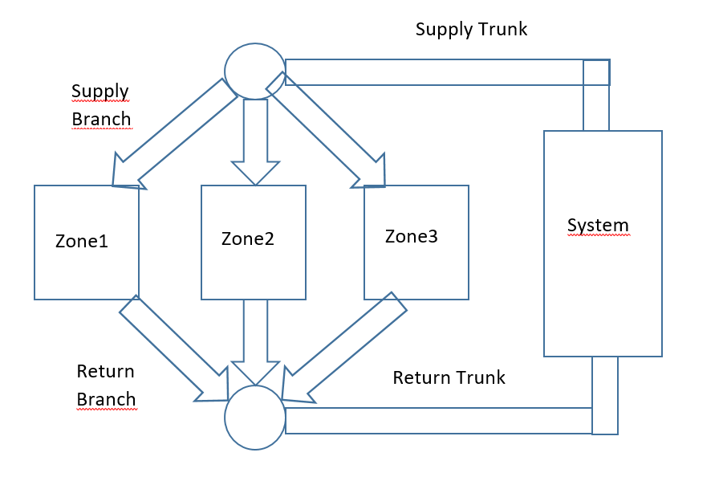

AirflowNetwork Duct Autosizing
================

**Lixing Gu**

**Florida Solar Energy Center**

 - Second revision, 04/21/22
 - First draft, 04/13/22
 - 
 

## Justification for New Feature ##

Duct sizing is one of the remaining barriers to greater usage of the AFN distribution feature. For simpler and smaller models, inclusion of the pressure network may require more inputs and information than the base energy model itself. Removing duct size inputs will be especially helpful in schema-driven modeling efforts (e.g. the approach used in several audit-related interfaces) that may need a legitimate distribution system but lack detailed inputs to construct one. Adding this feature would greatly simplify the required inputs to create a fully featured residential AFN model with distribution.

## E-mail and  Conference Call Conclusions ##

### First conference ###

The first conference call was held on 04/20/22 as a part of EnergyPlus Technicalities. Most team members attended the conference call. Comments and my answers are provided below:

1. Shall we make duct objects in general, instead of inside of AFN?

A: It is preferred that all duct inputs should be available in general. Unfortunately, all air duct objects are inside AFN currently. The present new feature provides duct sizing, not for general purpose. The team may condier this request in the future, include duct objects as a part of AirLoops.

2. Duct leakage

Duct leakage will not be considered for duct sizing. In order to compensate possible leakage flow losses, a new field of Sizing Factor will be added, similar to two fields listed in the Sizing:Parameters: Heating Sizing Factor, and Cooling Sizing Factor.

3. New fields

All proposed new fields will be added in the existing AirflowNetwork:SimulationControl object. No new object will be created, since no comments were mentioned for the IDD change during the conference call. 

4. Duct shape

The proposed duct shape for this phase will be a round duct. Since hydrolic diameter input is a field for autosize, the Corss Section Area will be calculated after autosizing in AirflowNetwork:Distribution:Component:Duct object.   

### E-mail communication with Tianzhen ###

Thanks for clarification.

On Apr 20, 2022, at 7:52 PM, gu@fsec.ucf.edu wrote:

Tianzhen:
 
No. I don’t allow this happens for now, because all ducts in each branch or trunk should have same diameter. I will think of later after Phase 1.
 
Thanks.
 
Gu
 
From: Tianzhen Hong <thong@lbl.gov> 
Sent: Wednesday, April 20, 2022 7:46 PM
To: Lixing Gu <gu@fsec.ucf.edu>
Subject: Re: NFP on duct sizing
 
Gu,
 
On item 3, do you allow a mix of auto-size and manual/entered sizes?
 
Tianzhen
 
On Wed, Apr 20, 2022 at 1:18 PM Lixing Gu <gu@fsec.ucf.edu> wrote:
Tianzhen:
 
Thanks for your comments. Here are my answers:
 
1.       Will make a change as "Duct Sizing Method"
2.       Yes. Your understanding is correct. It is intended to have a choice for “None”.
3.       Yes. Since each truck or branch have the same airflow, they should have the same size for each truck or branch.
 
I will incorporate your comments and my reply in the updated NFP.
 
Thanks.
 
Gu 
 
From: Tianzhen Hong <thong@lbl.gov> 
Sent: Wednesday, April 20, 2022 3:13 PM
To: Lixing Gu <gu@fsec.ucf.edu>
Cc: Lee, Edwin <Edwin.Lee@nrel.gov>; Mike Witte <MJWitte@gard.com>
Subject: NFP on duct sizing
 
Gu,
 
A nice feature to add.
 
To finish up the comments:
1. The field name Duct Sizing Type may be named "Duct Sizing Method" to be consistent with naming convention
2. You have a default None for the sizing method. Is the intent to keep the IDD object even if the duct sizing feature is not used at all. This is fine, allowing users to switch back easily. In EnergyPlus, when None is selected, I would assume the object is basically ignored and not needed.
3. Do you require all air ducts to be auto-sized? or some can be auto-sized while others are manually sized?
 
Tianzhen

### Actions from the first conference call and E-mail communication ###

1. Duct leakage will not be considered during sizing
2. Add new fields in AirflowNetwork:SimulationControl object
3. Add a new field as Sizing Factor to compensate possible leakage losses

## Overview ##

Due to complexity of this new feature, it will implement in different phases. Phase 1 will be a preliminary phase of airflow network duct autosizing. In this phase, the task will cover autosize duct diameter for a given duct length in simulations with a single air loop and a single conditioned zone. This will answer questions and reveal issues that will inform subsequent phases.

## Approach ##

In order to implement the task, several assumptions are provided below.

###Assumptions###

Here are assumptions used to implement Phase 1. Figure 1 shows schematic air distribution system with trunk and branch ducts.

** Figure 1. Air dictribution system with trunk and branch ducts **

####Supply duct####

The supply ducts will be divided into two sections based on current duct configuration: Truck and Branch. The truck section includes ducts between Return Air Path Outlet Node in Demand Side Inlet Node in AirLoopHVAC, and Inlet Node in AirLoopHVAC:ZoneSplitter. The branch section includes ducts between Outlet Nodes in AirLoopHVAC:ZoneSplitter, and Inlet Node in ZoneTernminal Units defined in ZoneHVAC:AirDistributionUnit. 
  
####Return duct####

The return ducts will be divided into two sections based on current duct configurqation: Truck and Branch. The truck section includes ducts between Demand Side Outlet Node in AirLoopHVAC, and Outlet Node in AirLoopHVAC:ZoneMixer. The branch section includes ducts between Inlet Nodes in AirLoopHVAC:ZoneMixer, and Zone Return Air Node defined in ZoneHVAC:EquipmentConnections.

####Mass or volumetric flow rates####

The mass flow rates are available from either system sizing or user inputs. Each truck has the same mass flow rate as max fan flow rate. Each branch has the same flow rate as max flow rate from the corresponding ZoneTernminal Unit.

All ducts in the same truck or branch have the same size as diameter, due to the same mass flow rate and velocity. 

####Relationship between total pressure and static pressure####

The total pressure drop between inlet and outlet for a duct is presented below:

&Delta;P = (P1 + &rho;V12 / 2) - (P2 + &rho;V22 / 2) + &rho;g (z1 - z2)

where

&Delta;P = Total pressure drop between points 1 and 2

P1, P2 = Entry and exit static pressure

V1, V2 = Entry and exit velocities

&rho; = Air density

g = Acceleration of gravity

z1, z2 = Entry and exit elevations

When entry and exit velocities and elevations are the same, the total pressure difference is equal to the static pressure difference. The assumption will be used for duct sizing. 

###Duct losses ###

The total pressure loss in either a truck or a branch can be calculated using Darcy-Weisbach Equation (Eq. 34 in Chpater 21, 2017 ASHRAE HOF)

&Delta;P = \( (1000fL) / Dh + &Sigma;C ) * (&rho;V2 / 2) \)

where

&Delta;P = Total pressure loss in a truck or branch

f = Friction factor

L = Total length in a truck or branch

Dh = Hydraulic diameter

V = Velocity

&rho; = Air density

C = Local loss coefficient for all ducts

where the friction factor can be represented by Colebrrook's equation:

1/ (f)1/2 = -2 log\( &epsilon;/ (3.7 * Dh) + 2.51 /(Re (f)1/2)\)

Re = 66.4 *Dh *V

For a round duct:

V = Q/A = Q / (Dh2 * &pi; / 4)

When &Delta;P given, and the relationship between Dh and V is also given, there is only a single unknow Dh. The value can be obtained through iteration. 

When the max velocity and mass flow rate are given, the hydraulic diameter can be calculated, so that the total pressure drop can be calculated.

###No hard sizes ###

When sizing is requested, no hard input values of hydrolic diameter will be allowed for all ducts. In other words, sizing will be applied to all ducts.

###Discussions###

####New fields ####

The proposed new fields can be added at the end of the AirflowNetwork:SimulationControl object as optional. Or a new sizing object may be created: Sizing:AFN:Ducts with the same fields.

Based on conference call, no comments are provided for this discussion. I propose to add new fields in the existing AirflowNetwork:SimulationControl object. No new object will be created. 

## Testing/Validation/Data Sources ##

insert text

## Input Output Reference Documentation ##

This section provides description for the AirflowNetwork:SimulationControl objec with proposed new optional fields.

\subsection{AirflowNetwork:SimulationControl}\label{airflownetworksimulationcontrol}

The basic run parameters for this model are defined in this unique object which has the following input specifications:

\subsubsection{Inputs}\label{inputs-004}

\paragraph{Field: Name}\label{field-name-004}

This is a unique character string associated with this instance of the AirflowNetwork:\hyperref[simulationcontrol]{SimulationControl} object. At this time, only one AirflowNetwork:\hyperref[simulationcontrol]{SimulationControl} object can be specified in an input data file (idf).

\paragraph{Field: AirflowNetwork Control}\label{field-airflownetwork-control}

The following selections are available to control the Airflow Network simulation:

\textbf{MultiZoneWithDistribution:} MultiZone air flow calculations are performed during all simulation timesteps, including the impacts of the air distribution system when a HVAC system fan is operating. Any \textbf{ZoneInfiltration:*}, \textbf{ZoneVentilation:*}, \textbf{\hyperref[zonemixing]{ZoneMixing}} and \textbf{\hyperref[zonecrossmixing]{ZoneCrossMixing}} objects specified in the input data file are not simulated.

\textbf{MultiZoneWithoutDistribution}: MultiZone air flow calculations are performed during all simulation timesteps, but the air distribution system portion of the network is not modeled even if it is specified in the input data file. Any \textbf{ZoneInfiltration:*}, \textbf{ZoneVentilation:*}, \textbf{\hyperref[zonemixing]{ZoneMixing}} and \textbf{\hyperref[zonecrossmixing]{ZoneCrossMixing}} objects specified in the input data file are not simulated.

\textbf{MultiZoneWithDistributionOnlyDuringFanOperation:} MultiZone air flow calculations, including the impacts of the air distribution system, are only performed when the HVAC system fan is operating. Any \textbf{ZoneInfiltration:*}, \textbf{ZoneVentilation:*}, \textbf{\hyperref[zonemixing]{ZoneMixing}} and \textbf{\hyperref[zonecrossmixing]{ZoneCrossMixing}} objects specified in the input data file are used when the HVAC system fan is OFF (if none are specified, then no air flow calculations are performed when the fan is OFF).

\textbf{NoMultiZoneOrDistribution:} No multizone air flow calculations (with or without the air distribution system portion of the network) are performed during the simulation. Any \textbf{ZoneInfiltration:*}, \textbf{ZoneVentilation:*}, \textbf{\hyperref[zonemixing]{ZoneMixing}} and \textbf{\hyperref[zonecrossmixing]{ZoneCrossMixing}} objects specified in the input data file are simulated (if none are specified, then no air flow calculations are performed). Note: Having an input data file with no AirflowNetwork:\hyperref[simulationcontrol]{SimulationControl} objects gives the same impact -- no multizone air flow calculations. However, this choice is provided as a convenience to the user to easily disable the multizone air flow calculations for an input data file that already contains AirflowNetwork objects.

\textbf{Note:} A \textbf{ZoneInfiltration:*} object indicates any one of \textbf{\hyperref[zoneinfiltrationdesignflowrate]{ZoneInfiltration:DesignFlowRate}}, \textbf{\hyperref[zoneinfiltrationeffectiveleakagearea]{ZoneInfiltration:EffectiveLeakageArea}},and \textbf{\hyperref[zoneinfiltrationflowcoefficient]{ZoneInfiltration:FlowCoefficient}} objects.A object of\textbf{ZoneVentilation:*} indicates any one of \textbf{\hyperref[zoneventilationdesignflowrate]{ZoneVentilation:DesignFlowRate}} and \textbf{\hyperref[zoneventilationwindandstackopenarea]{ZoneVentilation:WindandStackOpenArea}} objects\textbf{.}

\paragraph{Field: Wind Pressure Coefficient Type}\label{field-wind-pressure-coefficient-type}

Determines whether the wind pressure coefficients are input by the user or calculated. The choices are \textbf{Input} or \textbf{SurfaceAverageCalculation}, with the default being SurfaceAverageCalculation.

If INPUT, you must enter an \hyperref[airflownetworkmultizonewindpressurecoefficientarray]{AirflowNetwork:MultiZone:WindPressureCoefficientArray} object, one or more \hyperref[airflownetworkmultizoneexternalnode]{AirflowNetwork:MultiZone:ExternalNode} objects, and one or more \hyperref[airflownetworkmultizonewindpressurecoefficientvalues]{AirflowNetwork:MultiZone:WindPressureCoefficientValues} objects.

The second choice, SurfaceAverageCalculation, should only be used for \textbf{rectangular} buildings. In this case surface-average wind pressure coefficients vs. wind direction are calculated by the program for the four vertical fa\c{c}ades and the roof based on user entries for ``Building Type,'' ``Azimuth Angle of Long Axis of Building,'' and ``Ratio of Building Width Along Short Axis to Width Along Long Axis'' (see description of these fields below). With this choice you do \textbf{not} have to enter any of the following objects: AirflowNetwork:MultiZone: Wind Pressure Coefficient Array, \hyperref[airflownetworkmultizoneexternalnode]{AirflowNetwork:MultiZone:ExternalNode} and \hyperref[airflownetworkmultizonewindpressurecoefficientvalues]{AirflowNetwork:MultiZone:WindPressureCoefficientValues}.

\paragraph{Field: Height Selection for Local Wind Pressure Calculation}\label{field-height-selection-for-local-wind-pressure-calculation}

Determines whether the local wind pressure is calculated based on either given external node heights or surface opening heights. The choices are \textbf{ExternalNode} or \textbf{OpeningHeight}, with the default being OpeningHeight. The local outdoor wind speed calculation procedure is given in the section of ``Local Wind Speed Calculation'' in the Engineering Reference. The calculation procedure requires the height input.

If \textbf{ExternalNode}, the heights given in the \hyperref[airflownetworkmultizoneexternalnode]{AirflowNetwork:MultiZone:ExternalNode} objects are used to calculate local wind pressures based on the given height local wind speed.~ Used only if Wind Pressure Coefficient Type = INPUT (see description of previous field).

If \textbf{OpeningHeight}, the number of the \hyperref[airflownetworkmultizoneexternalnode]{AirflowNetwork:MultiZone:ExternalNode} objects has to be equal to the number of external surfaces defined in the \hyperref[airflownetworkmultizonesurface]{AirflowNetwork:MultiZone:Surface} objects. The centroids in the z direction of the \hyperref[airflownetworkmultizonesurface]{AirflowNetwork:MultiZone:Surface} objects are the heights used in the local wind pressure calculation with the given height wind speed. The input is required if Wind Pressure Coefficient Type = INPUT (see description of previous field).

If Wind Pressure Coefficient Type = \textbf{SurfaceAverageCalculation}, a value in this field is not required and a blank may be entered. The default choice is used internally to generate the \hyperref[airflownetworkmultizoneexternalnode]{AirflowNetwork:MultiZone:ExternalNode} objects

\paragraph{Field: Building Type}\label{field-building-type}

Used only if Wind Pressure Coefficient Type = SurfaceAverageCalculation. The choices for Building Type are LowRise and HighRise, with the default being LowRise.

LowRise corresponds to a rectangular building whose height is less than three times the width of the footprint (\emph{w\(_{short}\)} in Figure~\ref{fig:footprint-of-a-rectangular-building-showing}) and is less than three times the length of the footprint (\emph{w\(_{long}\)} in the same figure).

HighRise corresponds to a rectangular building whose height is more than three times the width of the footprint (\emph{w\(_{short}\)} in Figure~\ref{fig:footprint-of-a-rectangular-building-showing}) or is more than three times the length of the footprint (\emph{w\(_{long}\)} in the same figure).

\paragraph{Field: Maximum Number of Iterations}\label{field-maximum-number-of-iterations}

The maximum number of iterations allowed in finding an AirflowNetwork solution. If the number of iterations at each simulation timestep is above the maximum number of iterations defined by this field, the program could not find the solution and a Severe error is issued and the program is aborted. The default value is 500.

\paragraph{Field: Initialization Type}\label{field-initialization-type}

Designates which method is used for AirflowNetwork initialization. The choices for Initialization Type are LinearInitializationMethod and ZeroNodePressures, with the default being ZeroNodePressures.

\paragraph{Field: Relative Airflow Convergence Tolerance}\label{field-relative-airflow-convergence-tolerance}

The solution is assumed to have converged when \({{\left| {\,\sum\limits_{} {{{\mathop m\limits^ \bullet }_{_i}}} } \right|} \mathord{\left/ {\vphantom {{\left| {\,\sum\limits_{} {{{\mathop m\limits^ \bullet }_{_i}}} } \right|} {\sum\limits_{} {\left| {{{\mathop m\limits^ \bullet }_{_i}}} \right|} }}} \right. } {\sum\limits_{} {\left| {{{\mathop m\limits^ \bullet }_{_i}}} \right|} }}\) is less than the value specified for this input field. This convergence criteria is equivalent to the ratio of the absolute value of the sum of all network airflows (\(\left| {\sum {{{\mathop m\limits^ \bullet }_{_i}}} } \right|\) ) to the sum of network airflow magnitudes (\(\sum\limits_{}^{} {\left| {{{\mathop m\limits^ \bullet }_{_i}}} \right|}\) ). The default value is 1.0x10\(^{-4}\).

\paragraph{Field: Absolute Airflow Convergence Tolerance}\label{field-absolute-airflow-convergence-tolerance}

The solution is assumed to have converged when the summation of the absolute value of all network airflows (\(\left| {\sum {{{\mathop m\limits^ \bullet }_{_i}}} } \right|\) ) is less than the value specified for this input field. The default value is 1.0x10\(^{-6}\).

\paragraph{Field: Convergence Acceleration Limit}\label{field-convergence-acceleration-limit}

If the ratio of successive pressure corrections is less than this limit, use Steffensen acceleration algorithm (Ref. AirflowNetwork Model in the EnergyPlus Engineering Reference). The range for this field is -1 to 1, with the default value being -0.5.

\paragraph{Field: Azimuth Angle of Long Axis of Building}\label{field-azimuth-angle-of-long-axis-of-building}

Gives the orientation of a rectangular building for calculating wind pressure coefficients. This is the smaller of the angles, measured clockwise, between North and the long axis of the building (see Figure~\ref{fig:footprint-of-a-rectangular-building-showing}). Used only if Wind Pressure Coefficient Type = SurfaceAverageCalculation. The range for this input is 0 to 180, with the default value being 0.

\paragraph{Field: Ratio of Building Width Along Short Axis to Width Along Long Axis}\label{field-ratio-of-building-width-along-short-axis-to-width-along-long-axis}

This is the aspect ratio of a rectangular footprint. It is given by the width of the footprint along its short axis divided by the width along the long axis (see Figure~\ref{fig:footprint-of-a-rectangular-building-showing}). If the footprint is square, the value of this field is 1.0. Used only if Wind Pressure Coefficient Type = SurfaceAverageCalculation. The range for this input is \textgreater{} 0 to 1, with the default value being 1.

\begin{figure}[hbtp] % fig 95
\centering
\includegraphics[width=0.9\textwidth, height=0.9\textheight, keepaspectratio=true]{media/image221.png}
\caption{Footprint of a rectangular building showing variables used by the program to calculate surface-average wind pressure coefficients. The angle a is the ``Azimuth Angle of Long Axis of Building.''  $w_{short}/w_{long}$ is the ``Ratio of Building Width Along Short Axis to Width Along Long Axis.'' \protect \label{fig:footprint-of-a-rectangular-building-showing}}
\end{figure}

\paragraph{Field: Height Dependence of External Node Temperature}\label{field-height-dependence-of-external-node-temperature}

This is an optional field. Input is Yes or No. The default is No. Yes is that external node temperature is dependent on node height. No means that external node temperature is calculated with zero height.

\paragraph{Field: Allow Unsupported Zone Equipment}\label{allow-unsupported-zone-equipment}

This is an optional field. Input is Yes or No. The default is No. Set this input to Yes to have zone equipment that are currently unsupported in the AirflowNetwork model allowed in the simulation. Setting this field to Yes, allows the following equipment to be modeled along an AirflowNetwork model: ZoneHVAC:Dehumidifier, ZoneHVAC:EnergyRecoveryVentilator, WaterHeater:HeatPump:*. The AirflowNetwork model will exclude mass balance in these equipment objects and assume the mass flows are self-balanced in the equipment objects.

\paragraph{Field: Duct Sizing Method}\label{duct-sizing-method}

This is an optional field. The allowed choices are None, MaximumVelocity, PressureLoss, and PressureLossWithMaximumVelocity, with the default being None.

None: No duct sizing is performed.

MaximumVelocity: The duct diameter is calculated based on entered velocity as D_h = sqrt(4Q/(V*pi))

where Q = volumetric flow rate {m3}

      V = maximum velocity {m/s}

PressureLoss: Colebrook's equation is used to calculate duct diameter. Please see detailed description of calculation procedure in Engineering Reference.

PressureLossWithMaximumVelocity: When PressureLossWithMaximumVelocity is entered, duct diameter is calculated based on PressureLoss first. The value will be used to calculate flow velocity to ensure the final velocity is less than the maximum value. If greater, final value will be obtained from MaximumVelocity.

\paragraph{Field: Duct Sizing Factor}\label{duct-sizing-factor}

The global duct sizing ratio applied to all of the duct component diameter.

\paragraph{Field: Maximum Airflow Velocity}\label{maximum-airflow-velocity}

This is an optional field to represent the maximum velopcity in trunk ducts with units m/s. The default value is 5 m/s. The value is used when the choice of Duct Sizing Method is either MaximumVelocity or PressureLossWithMaximumVelocity. The duct diameter is calculated at D = flow rate / Cross section area.

\paragraph{Field: Total Pressure Loss Across Supply Truck}\label{total-pressure-loss-across-supply-truck}

This optional field is used if Duct Sizing Method is PressureLoss or PressureLossWithMaximumVelocity. When PressureLoss is entered, duct diameter is calculated using Colebrook's equation.  When PressureLossWithMaximumVelocity is entered, duct diameter is calculated based on PressureLoss first. The value is used to calculate flow velocity to ensure the final velocity is less than the maximum value. If greater, final value will be obtained from the MaximumVelocity method.

\paragraph{Field: Total Pressure Loss Across Supply Branch}\label{total-pressure-loss-across-supply-branch}

This optional field with units Pa is used to calculate supply branch duct diameter based on Colesbrook's equation. 

\paragraph{Field: Total Pressure Loss Across Return Truck}\label{total-pressure-loss-across-return-truck}

This optional field with units Pa is used to calculate return trunk duct diameter based on Colesbrook's equation. 

\paragraph{Field: Total Pressure Loss Across Return Branch}\label{total-pressure-loss-across-return-branch}
 
This optional field with units Pa is used to calculate return branch duct diameter based on Colesbrook's equation. 

An IDF example is shown below:

\begin{lstlisting}
AirflowNetwork:SimulationControl,
      AirflowNetwork_All,      !- Name
      MultiZoneWithDistribution,  !- AirflowNetwork Control
      Input,                   !- Wind Pressure Coefficient Type
      Every 30 Degrees,        !- AirflowNetwork Wind Pressure Coefficient Array Name
      OpeningHeight,           !- Height Selection for Local Wind Speed Calculation
      LowRise,                 !- Building Type
      500,                     !- Maximum Number of Iterations {dimensionless}
      ZeroNodePressures,       !- Initialization Type
      1.0E-05,                 !- Relative Airflow Convergence Tolerance {dimensionless}
      1.0E-06,                 !- Absolute Airflow Convergence Tolerance {kg/s}
      -0.5,                    !- Convergence Acceleration Limit {dimensionless}
      0.0,                     !- Azimuth Angle of Long Axis of Building {deg}
      1.0;                     !- Ratio of Building Width Along Short Axis to Width Along Long Axis
\end{lstlisting}

If the AirflowNetwork:SimulationControl object is not provided in an input file, the default input object will be created by the program internally, as long as following conditions are satisfied:
\begin{itemize}
\item The number of AirflowNetwork:MultiZone:Zone objects >= 1
\item The number of AirflowNetwork:MultiZone:Surface objects >= 2
\end{itemize}
The default input object is shown below:

\begin{lstlisting}
AirflowNetwork:SimulationControl,
    AFNDefaultControl,          !- Name
    MultizoneWithoutDistribution,  !- AirflowNetwork Control
    SurfaceAverageCalculation,  !- Wind Pressure Coefficient Type
    OpeningHeight,           !- Height Selection for Local Wind Pressure Calculation
    LOWRISE,                 !- Building Type
    500,                     !- Maximum Number of Iterations {dimensionless}
    ZeroNodePressures,       !- Initialization Type
    1.0E-04,                 !- Relative Airflow Convergence Tolerance {dimensionless}
    1.0E-06,                 !- Absolute Airflow Convergence Tolerance {kg/s}
    -0.5,                    !- Convergence Acceleration Limit {dimensionless}
    0.0,                     !- Azimuth Angle of Long Axis of Building {deg}
    1.0;                     !- Ratio of Building Width Along Short Axis to Width Along Long Axis
\end{lstlisting}

## Input Description ##

Six new optional fields are proposed in the AirflowNetwork:SimulationControl object. The new fields cover duct sizing type, and total pressure loses for supply and retun ducts. Both supply and return ducts are divided into two sections: trunk and branch. All branches have the same pressure drop to represent equal friction method. The new fields in the object are highlighted in red. 

There are several choices for trunk sizing: maximum velocity, pressure loss, or combination. The combination uses the pressure loss first. Then velocity will be checked. If the velocity is less than the maximum velocity, the pressure loss method results will be used. Otherwise, the maximum velocity will be used to calculate duct diameter.

The pressure loss method will be applied to all branches, so that all ducts have the same pressure losses. The approach is equivalent to equal friction method.

	! Basic parameters
	AirflowNetwork:SimulationControl,
      \min-fields 12
      \unique-object
      \memo This object defines the global parameters used in an Airflow Network simulation.
	A1 , \field Name
      \required-field
      \note Enter a unique name for this object.
 	A2 , \field AirflowNetwork Control
      \type choice
      \key MultizoneWithDistribution
      \key MultizoneWithoutDistribution
      \key MultizoneWithDistributionOnlyDuringFanOperation
      \key NoMultizoneOrDistribution
      \default NoMultizoneOrDistribution
      \note NoMultizoneOrDistribution: Only perform Simple calculations (objects ZoneInfiltration:*,
      \note ZoneVentilation:*, ZoneMixing, ZoneCrossMixing, ZoneRefrigerationDoorMixing,
      \note ZoneAirBalance:OutdoorAir, ZoneEarthtube, ZoneThermalChimney, and ZoneCoolTower:Shower);
      \note MultizoneWithoutDistribution: Use AirflowNetwork objects to simulate multizone
      \note Airflows driven by wind during simulation time,
      \note and objects of ZoneInfiltration:*, ZoneVentilation:*, ZoneMixing, ZoneCrossMixing
      \note ZoneRefrigerationDoorMixing, ZoneAirBalance:OutdoorAir, ZoneEarthtube,
      \note ZoneThermalChimney, and ZoneCoolTower:Shower are ignored;
      \note MultizoneWithDistributionOnlyDuringFanOperation: Perform distribution system
      \note calculations during system fan on time
      \note and Simple calculations during system Fan off time;
      \note MultizoneWithDistribution: Perform distribution system calculations during system
      \note fan on time and multizone Airflow driven by wind during system fan off time.
 	A3 , \field Wind Pressure Coefficient Type
      \type choice
      \key Input
      \key SurfaceAverageCalculation
      \default SurfaceAverageCalculation
      \note Input: User must enter AirflowNetwork:MultiZone:WindPressureCoefficientArray,
      \note AirflowNetwork:MultiZone:ExternalNode, and
      \note AirflowNetwork:MultiZone:WindPressureCoefficientValues objects.
      \note SurfaceAverageCalculation: used only for rectangular buildings.
      \note If SurfaceAverageCalculation is selected,
      \note AirflowNetwork:MultiZone:WindPressureCoefficientArray, AirflowNetwork:MultiZone:ExternalNode,
      \note and AirflowNetwork:MultiZone:WindPressureCoefficientValues objects are not used.
 	A4 , \field Height Selection for Local Wind Pressure Calculation
      \type choice
      \key ExternalNode
      \key OpeningHeight
      \default OpeningHeight
      \note If ExternalNode is selected, the height given in the
      \note AirflowNetwork:MultiZone:ExternalNode object will be used.
      \note If OpeningHeight is selected, the surface opening height (centroid) will be used to
      \note calculate local wind pressure
      \note This field is ignored when the choice of the Wind Pressure Coefficient Type field is
      \note SurfaceAverageCalculation.
 	A5 , \field Building Type
      \note Used only if Wind Pressure Coefficient Type = SurfaceAverageCalculation,
      \note otherwise this field may be left blank.
      \type choice
      \key LowRise
      \key HighRise
      \default LowRise
 	N1 , \field Maximum Number of Iterations
      \type integer
      \units dimensionless
      \default 500
      \minimum> 10
      \maximum 30000
      \note Determines the maximum number of iterations used to converge on a solution. If this limit
      \note is exceeded, the program terminates.
 	A6 , \field Initialization Type
      \type choice
      \key LinearInitializationMethod
      \key ZeroNodePressures
      \default ZeroNodePressures
 	N2 , \field Relative Airflow Convergence Tolerance
      \type real
      \units dimensionless
      \default 1.E-4
      \minimum> 0
      \note This tolerance is defined as the absolute value of the sum of the mass Flow Rates
      \note divided by the sum of the absolute value of the mass Flow Rates. The mass Flow Rates
      \note described here refer to the mass Flow Rates at all Nodes in the AirflowNetwork model.
      \note The solution converges when both this tolerance and the tolerance in the next field
      \note (Absolute Airflow Convergence Tolerance) are satisfied.
 	N3 , \field Absolute Airflow Convergence Tolerance
      \type real
      \units kg/s
      \default 1.E-6
      \minimum> 0
      \note This tolerance is defined as the absolute value of the sum of the mass flow rates. The mass
      \note flow rates described here refer to the mass flow rates at all nodes in the AirflowNetwork
      \note model. The solution converges when both this tolerance and the tolerance in the previous
      \note field (Relative Airflow Convergence Tolerance) are satisfied.
 	N4 , \field Convergence Acceleration Limit
      \type real
      \units dimensionless
      \note Used only for AirflowNetwork:SimulationControl
      \minimum -1
      \maximum 1
      \default -0.5
 	N5 , \field Azimuth Angle of Long Axis of Building
      \type real
      \units deg
      \minimum 0.0
      \maximum 180.0
      \default 0.0
      \note Degrees clockwise from true North.
      \note Used only if Wind Pressure Coefficient Type = SurfaceAverageCalculation.
 	N6 , \field Ratio of Building Width Along Short Axis to Width Along Long Axis
      \type real
      \minimum> 0.0
      \maximum 1.0
      \default 1.0
      \note Used only if Wind Pressure Coefficient Type = SurfaceAverageCalculation.
 	A7 , \field Height Dependence of External Node Temperature
      \note If Yes, external node temperature is height dependent.
      \note If No, external node temperature is based on zero height.
      \type choice
      \key Yes
      \key No
      \default No
	A8 , \field Solver
      \note Select the solver to use for the pressure network solution
      \type choice
      \key SkylineLU
      \key ConjugateGradient
      \default SkylineLU
 	A9 , \field Allow Unsupported Zone Equipment
      \note Set this input to Yes to have zone equipment that are currently unsupported in the AirflowNetwork model
      \note allowed in the simulation if present. Setting this field to Yes, allows the following equipments
      \note to be modeled along an AirflowNetwork model: ZoneHVAC:Dehumidifier, ZoneHVAC:EnergyRecoveryVentilator,
      \note WaterHeater:HeatPump:*.
      \type choice
      \key Yes
      \key No
      \default No

 	A10, \field Duct Sizing Method
      \type choice
      \key None
      \key MaximumVelocity
      \key PressureLoss
      \key PressureLossWithMaximumVelocity
      \default None
    N7 , \field Duct Sizing Factor
      \type real
      \minimum> 0.0
      \default 1.0
	N8 , \field Maximum Airflow Velocity
      \type real
      \units m/s
      \minimum >0.0
      \maximum 25.0
      \default 5.0
      \note Used only if Duct Sizing Type = MaximumVelocity or PressureLossWithMaximumVelocity.
      \note When MaximumVelocity is entered, duct diameter is calculated at D = flow rate / 
      \note cross section area.
      \note When PressureLossWithMaximumVelocity is entered, duct diameter is calculated based on 
      \note PressureLoss. The value is used to check to ensure the final velocity is less than
      \note the maximum value. If greater, final value will be obtained from MaximumVelocity.
      \note This field is apply for truck size, while branch size is based on total pressure drop.
 	N9 , \field Total Pressure Loss Across Supply Truck
      \type real
      \units Pa
      \minimum >0.0
      \note Used only if Duct Sizing Type = PressureLoss or PressureLossWithMaximumVelocity.
      \note When PressureLoss is entered, duct diameter is calculated using Colebrook's equation  
      \note When PressureLossWithMaximumVelocity is entered, duct diameter is calculated based on 
      \note PressureLoss. The value is used to check to ensure the final velocity is less than
      \note the maximum value. If greater, final value will be obtained from MaximumVelocity.
      \note This field is apply for truck size, while branch size is based on total pressure drop.
 	N10 , \field Total Pressure Loss Across Supply Branch
      \type real
      \units Pa
      \minimum >0.0
      \note Duct diameter is calculated using Colebrrook's equation  
 	N11 , \field Total Pressure Loss Across Return Trunk
      \type real
      \units Pa
      \minimum >0.0
      \note Duct diameter is calculated using Colebrrook's equation  
 	N12 ; \field Total Pressure Loss Across Return Branch
      \type real
      \units Pa
      \minimum >0.0
      \note Duct diameter is calculated using Colebrrook's equation  

## Outputs Description ##

Duct sizes will be added in the output of eio.

## Engineering Reference ##

A new section of Duct Sizing is provided below.

\subsection{Duct Sizing}\label{duct-sizingl}

There are two methods used to size duct diameter and cross section area by assuming round ducts. Each method is presented below.

1. Maxiumum velocity

The cross section area (A) is calculated below

A =  \frac{Q}{V} 

where 

A = Cross section area {m2}

Q = Volumetric air flow rate {m3/s}

V = Maximum velocity {m/s}

The duct diameter is calculated as

D = \sqrt{\frac{4Q}{V \pi } } 

where

D = Duct diameter {m}

Q = Volumetric air flow rate {m3/s}

V = Maximum velocity {m/s}

2. Pressure loss

The total pressure loss across a duct may be expressed as

\Delta P =  \big( P_{1} +  \rho  \frac{V_{1}^2}{2}  )  - \big( P_{2} +  \rho  \frac{V_{2}^2}{2}  ) +  \rho g(z_{1} - z_{2} ) 

where

\Delta P = Total pressure loss in a truck or branch {Pa}

P_1, P_2 = Entry and exit static pressure {Pa}

V_1, V_2 = Entry and exit velocities {m/s}

\rho = Air density {kg/m3}

g = Acceleration of gravity {m/s2}

z_1, z_2 = Entry and exit elevations {m}

When entry and exit velocities and elevations are the same, the total pressure difference is equal to the static pressure difference. The assumption will be used for duct sizing. 

The total pressure loss in either a truck or a branch can be calculated using Darcy-Weisbach Equation (Eq. 34 in Chpater 21, 2017 ASHRAE HOF)

\Delta P =  \big( \frac{1000 f L}{D} +  \Sigma C ) *  \frac{ \rho  V^{2} }{2}  

f = Friction factor {dimensionless}

L = Total length in a truck or branch {m}

D = Hydraulic diameter {m}

V = Velocity {m/s}

\rho = Air density {kg/m3}

C = Local loss coefficient for all ducts {dimensionless}

where the friction factor can be represented by Colebrrook's equation:

\frac{1}{\sqrt{f}} = -2 log\big( \frac{ \varepsilon }{3.7 D} +  \frac{2.51}{Re\sqrt{f}}) 

Re = 66.4 *D *V

For a round duct:

V = Q/A = Q / (D^2 * \pi / 4)

The cross section area

A = \frac{D^2 * \pi}{4}

When ΔP given, and the relationship between D and V is also given, there is only a single unknow D. The value can be obtained through iteration. 

## Example File and Transition Changes ##

An existing eample file will be modified by adding duct sizing capability. If not found, a new example file will be created and uploded in GitHub

## References ##

insert text

##Design Documentation##

The new feature will revise a single module: AirflowNetworkBalanceManager. Some functions will be revised and a new function of DuctSizing will be created to calculate duct diameters.

### AirflowNetworkBalanceManager ###

The module revision includes the GetAirflowNetworkInput fuction and a new variable as bool AFNDuctAutoSize.

####GetAirflowNetworkInput####

The function will be revised to read proposed 7 new fields for the AirflowNetwork:SimulationControl object. Corresponding code validation and warnings will be added after reading statements.

Add a new bool variable as AFNDuctAutoSize, with default being false. When any choice of Duct Size Methos is entered, the variable will be set to true.

####A new function as DuctSizing ####

The new function will perform several actions as shown below.

1. The function will be called inside AirflowNetworkBalanceManagerData::initialize.

The calling point is similar to other system modules, such as SizeDXCoils in the DXCOils module.

2. Get volumetric airflow rates for each trunk and branch.

Fan flow rate will be assigned to trunk flow rate, and terminal flow rates will be assinged to branch flow rates

3. Assign duct components as Trunk and Branch

As mentioned before, the supply truck section includes ducts between Return Air Path Outlet Node in Demand Side Inlet Node in AirLoopHVAC, and Inlet Node in AirLoopHVAC:ZoneSplitter. The supply branch section includes ducts between Outlet Nodes in AirLoopHVAC:ZoneSplitter, and Inlet Node in ZoneTernminal Units defined in ZoneHVAC:AirDistributionUnit. The return truck section includes ducts between Demand Side Outlet Node in AirLoopHVAC, and Outlet Node in AirLoopHVAC:ZoneMixer. The return branch section includes ducts between Inlet Nodes in AirLoopHVAC:ZoneMixer, and Zone Return Air Node defined in ZoneHVAC:EquipmentConnections.

Based on trunk and branch definitions, a loop for every linkage, with duct component and exposed to zones, will be performed to find supply trunks and branches, and return trunks and branches, using node information.

4. Solve Colesbrook equation to get duct diameter for each duct component

5. Select D = max(D1, D2, D3....)

6. Check duct diameter to ensure diamters from other ducts located in HVAS system and zone connection are greater or equal to the calculated duct diameter.

7. Write duct diameter values for each duct component in trunks and branches in the eio.

Note:

If we assume all Surface Roughness values are the same in the same trunk or branch, a simple iteration will be performed to find a solution for all ducts in the same trunk or branch.    

